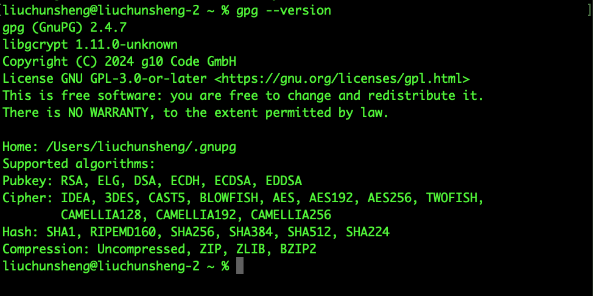

# 【拓展】Maven中央仓库项目发布

## sonatype账号注册
- 访问https://central.sonatype.com/
- 点击`Sign In`进到登陆页中进行注册(如果已注册则直接登陆)  

> 参考：[create-an-account](https://central.sonatype.org/register/legacy/#create-an-account)

## 登陆
- 登陆sonatype账号

## 创建namespace
- 登陆后点击右上角下拉菜单中的`View Namespaces`
- 点击`Register New Namespace`，创建namespace
- 填写namespace需要域名或者代码托管服务提供的Pages服务域名(例如xxx.github.io或xxx.bitbucket.io)，这里以第2种方式为例

- 我的github用户名是Brotherc，所以填入`io.github.brotherc`。注意需要将域名反转，并且用户名使用全小写


> 参考：[for-code-hosting-services-with-personal-groupid](https://central.sonatype.org/register/namespace/#for-code-hosting-services-with-personal-groupid)


## 验证namespace
- 创建namespace之后，会得到一个`Verification Key`

- 在github上创建一个公共仓库，并以`Verification Key`进行命名，以我为例创建的仓库为`https://github.com/Brotherc/ynqxl401u1`
- 在namespace中进行验证


- 验证成功后状态变为Verified

- 验证通过后以`Verification Key`命名的代码仓库就可以删除了

## 安装GnuPG
- **下载地址：**  
[https://gnupg.org/download/index.html#sec-1-2](https://gnupg.org/download/index.html#sec-1-2)    
- **Mac OS下载地址：**  
[https://sourceforge.net/p/gpgosx/docu/Download/](https://sourceforge.net/p/gpgosx/docu/Download/)  

安装后验证是否安装成功
```
gpg --version
```



> 参考：[installing-gnupg](https://central.sonatype.org/publish/requirements/gpg/#installing-gnupg)

## 生成密钥对
```
gpg --full-generate-key
```


生成的过程需要输入密码，用于保护密钥，后续发布项目还会再次用到


```
gpg: revocation certificate stored as '/Users/liuchunsheng/.gnupg/openpgp-revocs.d/DCB2674BE30B1B6B6C555C34D72AD748C9AFFE56.rev'
public and secret key created and signed.

pub   rsa4096 2025-06-07 [SC] [expires: 2027-06-07]
      DCB2674BE30B1B6B6C555C34D72AD748C9AFFE56
uid                      liuchunsheng <1157730239@qq.com>
sub   rsa4096 2025-06-07 [E] [expires: 2027-06-07]
```
生成的key为`DCB2674BE30B1B6B6C555C34D72AD748C9AFFE56`

> 参考：[generating-a-key-pair](https://central.sonatype.org/publish/requirements/gpg/#generating-a-key-pair)

## 发布key
```
gpg --keyserver keyserver.ubuntu.com --send-keys DCB2674BE30B1B6B6C555C34D72AD748C9AFFE56
```
> 参考：[distributing-your-public-key](https://central.sonatype.org/publish/requirements/gpg/#distributing-your-public-key)

## 生成token
- 点击右上角下拉菜单中的`View Account`
- 点击`Generate User Token`，该token每次发布项目到中央仓库只允许使用一次，再次发布时需要重新生成

## 修改settings.xml
将生成的token设置到`settings.xml`中，记住server中的id，后续需要用到
```xml
    <server>
    	<id>oss</id>
    	<username>dKM+2Rt6</username>
    	<password>FCleTgStxSjhh0W44bDzSmBVPwLG3FaAw31kZ1YsoHia</password>
    </server>
```

## 修改pom.xml
```xml
<?xml version="1.0" encoding="UTF-8"?>
<project xmlns="http://maven.apache.org/POM/4.0.0" xmlns:xsi="http://www.w3.org/2001/XMLSchema-instance"
		 xsi:schemaLocation="http://maven.apache.org/POM/4.0.0 https://maven.apache.org/xsd/maven-4.0.0.xsd">
	<modelVersion>4.0.0</modelVersion>

    <!--groupId需要保持与上面创建的namespace一致-->
	<groupId>io.github.brotherc</groupId>
	<artifactId>openapi2apischema-core</artifactId>
	<version>1.0.0</version>

    <!--添加name-->
	<name>openapi2apischema-core</name>
    <!--添加description-->
	<description>openapi2apischema</description>
    <!--添加url-->
	<url>https://github.com/Brotherc/openapi2apischema</url>

    <!--添加licenses-->
	<licenses>
		<license>
			<name>The Apache Software License, Version 2.0</name>
			<url>http://www.apache.org/licenses/LICENSE-2.0.txt</url>
		</license>
	</licenses>

    <!--添加developers-->
	<developers>
		<developer>
			<name>liuchunsheng</name>
			<email>1157730239@qq.com</email>
		</developer>
	</developers>

    <!--添加scm-->
	<scm>
		<connection>scm:git:git://github.com/Brotherc/openapi2apischema.git</connection>
		<developerConnection>scm:git:ssh://github.com/Brotherc/openapi2apischema.git</developerConnection>
		<url>https://github.com/Brotherc/openapi2apischema/tree/main</url>
	</scm>

	<profiles>
		<profile>
			<id>release</id>
			<build>
				<plugins>
					<!-- Source -->
					<plugin>
						<groupId>org.apache.maven.plugins</groupId>
						<artifactId>maven-source-plugin</artifactId>
						<version>2.2.1</version>
						<executions>
							<execution>
								<phase>package</phase>
								<goals>
									<goal>jar-no-fork</goal>
								</goals>
							</execution>
						</executions>
					</plugin>
					<!-- Javadoc -->
					<plugin>
						<groupId>org.apache.maven.plugins</groupId>
						<artifactId>maven-javadoc-plugin</artifactId>
						<version>2.9.1</version>
						<configuration>
							<show>private</show>
							<nohelp>true</nohelp>
							<charset>UTF-8</charset>
							<encoding>UTF-8</encoding>
							<docencoding>UTF-8</docencoding>
							<additionalparam>-Xdoclint:none</additionalparam>
							<javadocExecutable>${java.home}/bin/javadoc</javadocExecutable>
						</configuration>
						<executions>
							<execution>
								<phase>package</phase>
								<goals>
									<goal>jar</goal>
								</goals>
							</execution>
						</executions>
					</plugin>
					<!-- GPG -->
					<plugin>
						<groupId>org.apache.maven.plugins</groupId>
						<artifactId>maven-gpg-plugin</artifactId>
						<version>1.5</version>
						<executions>
							<execution>
								<phase>verify</phase>
								<goals>
									<goal>sign</goal>
								</goals>
							</execution>
						</executions>
					</plugin>
                    <!-- central -->
					<plugin>
						<groupId>org.sonatype.central</groupId>
						<artifactId>central-publishing-maven-plugin</artifactId>
						<version>0.4.0</version>
						<extensions>true</extensions>
						<configuration>
							<publishingServerId>oss</publishingServerId>
							<tokenAuth>true</tokenAuth>
						</configuration>
					</plugin>
				</plugins>
			</build>
			<distributionManagement>
				<snapshotRepository>
					<id>oss</id>
					<url>https://oss.sonatype.org/content/repositories/snapshots/</url>
				</snapshotRepository>
				<repository>
					<id>oss</id>
					<url>https://oss.sonatype.org/service/local/staging/deploy/maven2/</url>
				</repository>
			</distributionManagement>
		</profile>
	</profiles>

	<properties>
		<java.version>1.8</java.version>
	</properties>
	<dependencies>
        ...
	</dependencies>
	<build>
		<plugins>
			<plugin>
				<groupId>org.apache.maven.plugins</groupId>
				<artifactId>maven-compiler-plugin</artifactId>
				<configuration>
					<source>8</source>
					<target>8</target>
				</configuration>
			</plugin>
		</plugins>
	</build>

</project>
```
> 参考：  
> [a-complete-example-pom](https://central.sonatype.org/publish/requirements/#a-complete-example-pom)  
> [https://github.com/simpligility/ossrh-demo/blob/master/pom.xml](https://github.com/simpligility/ossrh-demo/blob/master/pom.xml)

## maven发布
```sh
mvn -s /Users/liuchunsheng/Documents/soft/apache-maven-3.9.10/conf/settings.xml clean deploy -P release -Dgpg.passphrase=lcs13726530392 -f pom.xml
```
过几分钟后在中央仓库中查看到发布成功

### 发布过程中遇到的问题
问题：
> [INFO] BUILD FAILURE  
> [INFO] ------------------------------------------------------------------------  
> [INFO] Total time:  1.101 s  
> [INFO] Finished at: 2025-06-08T17:57:58+08:00  
> [INFO] ------------------------------------------------------------------------  
> [ERROR] Failed to execute goal org.apache.maven.plugins:maven-javadoc-plugin:2.9.1:jar (default) on project openapi2apischema-core: MavenReportException: Error while creating archive: Unable to find javadoc command: The environment variable JAVA_HOME is not correctly set. -> [Help 1]  
> [ERROR]  
> [ERROR] To see the full stack trace of the errors, re-run Maven with the -e switch.  
> [ERROR] Re-run Maven using the -X switch to enable full debug logging.  
> [ERROR]  
> [ERROR] For more information about the errors and possible solutions, please read the following articles:  
> [ERROR] [Help 1] http://cwiki.apache.org/confluence/display/MAVEN/MojoExecutionException  
>
> Process finished with exit code 1

解决方法：  
增加`<javadocExecutable>${java.home}/bin/javadoc</javadocExecutable>`
```xml
<plugin>
    <groupId>org.apache.maven.plugins</groupId>
    <artifactId>maven-javadoc-plugin</artifactId>
    <version>2.9.1</version>
    <configuration>
        <show>private</show>
        <nohelp>true</nohelp>
        <charset>UTF-8</charset>
        <encoding>UTF-8</encoding>
        <docencoding>UTF-8</docencoding>
        <additionalparam>-Xdoclint:none</additionalparam>
        <javadocExecutable>${java.home}/bin/javadoc</javadocExecutable>
    </configuration>
    <executions>
        <execution>
            <phase>package</phase>
            <goals>
                <goal>jar</goal>
            </goals>
        </execution>
    </executions>
</plugin>
```

问题：
```
gpg: signing failed: Inappropriate ioctl for device
gpg: signing failed: Inappropriate ioctl for device
```
解决方法：  
gpg在当前终端无法弹出密码输入页面 ，执行发布命令前先执行`export GPG_TTY=$(tty)`

问题：  
> [INFO] BUILD FAILURE  
> [INFO] ------------------------------------------------------------------------  
> [INFO] Total time:  11.235 s  
> [INFO] Finished at: 2025-06-08T15:39:04+08:00  
> [INFO] ------------------------------------------------------------------------  
> [ERROR] Failed to execute goal org.apache.maven.plugins:maven-deploy-plugin:3.1.2:deploy (default-deploy) on project openapi2apischema-core: Failed to deploy artifacts: Could not transfer artifact io.github.brotherc:openapi2apischema-core:pom:1.0.0 from/to oss (https://oss.sonatype.org/service/local/staging/deploy/maven2/): status code: 401, reason phrase: Content access is protected by token (401) -> [Help 1]  
> [ERROR]  
> [ERROR] To see the full stack trace of the errors, re-run Maven with the -e switch.  
> [ERROR] Re-run Maven using the -X switch to enable full debug logging.  
> [ERROR]  
> [ERROR] For more information about the errors and possible solutions, please read the following articles:  
> [ERROR] [Help 1] http://cwiki.apache.org/confluence/display/MAVEN/MojoExecutionException  

解决方法：  
使用以下方式发布
```xml
<plugin>
    <groupId>org.sonatype.central</groupId>
    <artifactId>central-publishing-maven-plugin</artifactId>
    <version>0.4.0</version>
    <extensions>true</extensions>
    <configuration>
        <publishingServerId>oss</publishingServerId>
        <tokenAuth>true</tokenAuth>
    </configuration>
</plugin>
```