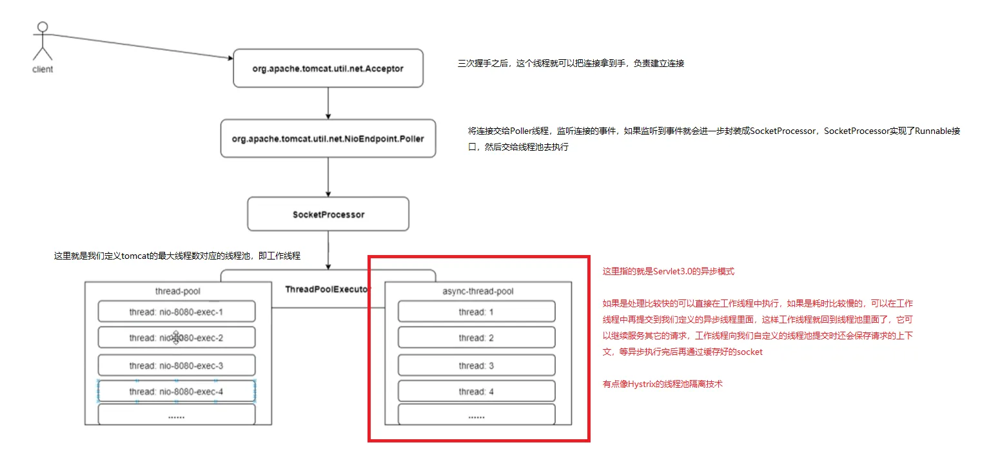

# 【知识】WebFlux
## 传统Servlet
不管是访问数据库也好，访问远程接口也好，底层实现都是一个同步阻塞的API，比如传统的jdbc驱动  
这样会带来以下问题：  
在发起远程调用的时候，当前线程会让出自己的cpu使用权，让出之后当前线程并不能做其他事情，在收到请求响应之前，这个线程会一直被占用，资源被占用，直到下游web服务器响应，才能恢复执行。如果中间请求时间比较长的话，会导致这个线程一直被占用  
如果请求响应够快，那占用没什么问题，如果响应是一个耗时任务的时候，请求比较多的时候，线程会被耗尽，请求造成排队，延时增长，如果是对于时延比较敏感的话，会导致用户的流流失，而且线程多的话会导致内存爆掉  
## Servlet3.0
交给另外的线程去异步执行，还是没有从本质上解决，只是接收请求的时候线程能尽早返回给web容器，但是执行还是需要通过新的线程去执行  
异步Servlet有点像Hystrix的线程池隔离技术，让Servlet通过另外的线程去异步执行，可以控制线程执行的数量  

## WebFlux
Servlet3.0确实缓解了线程池资源比较紧张的情况，但是没有解决根本性的问题  
因为我们在实际执行业务逻辑的时候，我们是在自定义的线程池里面执行的，而我们在执行业务的时候也可能是同步阻塞的  
我们希望在现有资源一定的情况下让我们的系统做更多的事情，这才是我们终极的目标，这也是Webflux要解决的事情  
> Spring异步非阻塞的架构，意味着可以在现有资源有限的情况下干更多的事情，更适合于我们低延迟、高负载的工作场景  
> 响应式编程是一种编程范式，ProjectReactor就是对它的具体实现，Webflux也是基于ProjectReactor实现的  
