## 读写分离的由来
秒杀业务
> 秒杀、抢购系统的业务特点：  
> 非常多的人来参与，并发量很大  
> 时间点集中  
> 看看其它的商品，都多写少

数据库集群
> 一个主库，负责写入数据，我们称之为：写库  
> 其它都是从库，负责读取数据，我们称之为：读库  

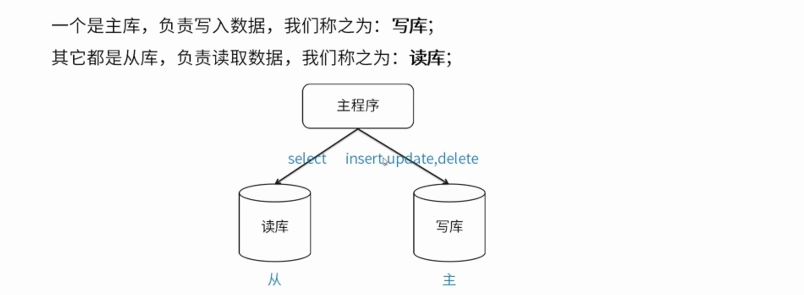

## 数据库主从库理论
主从同步如何工作

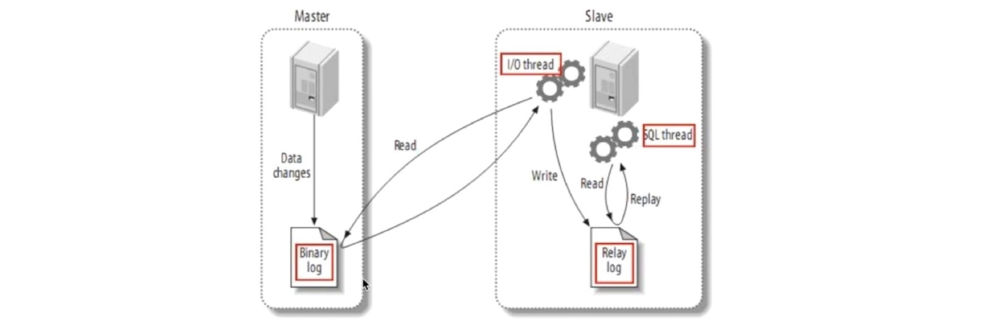

## 步骤一

##### 主：

修改配置

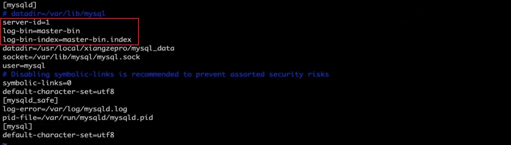
重启mysql
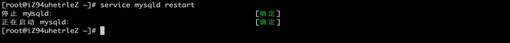
连接mysql，查看主状态
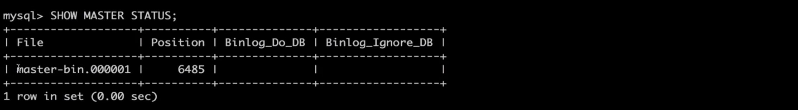
##### 从：
修改配置

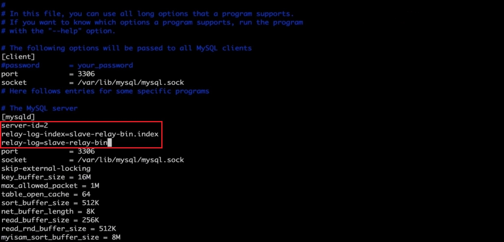
重启mysql
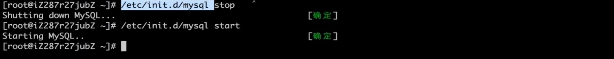

## 步骤二

##### 主：

授权
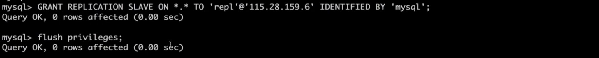
##### 从：
设置主从关系
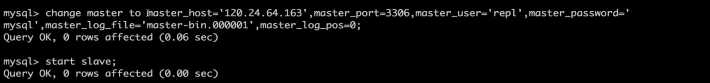
查看从状态

出现error
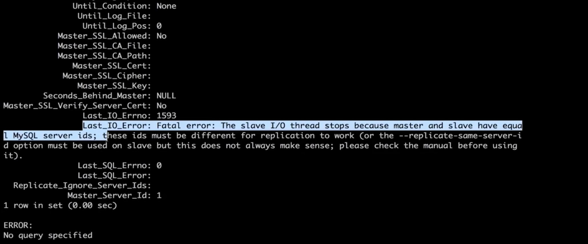
修改配置
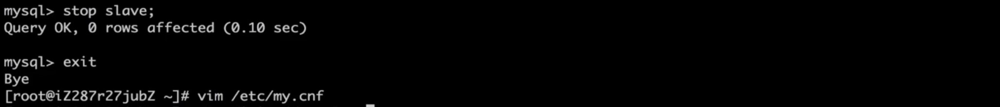
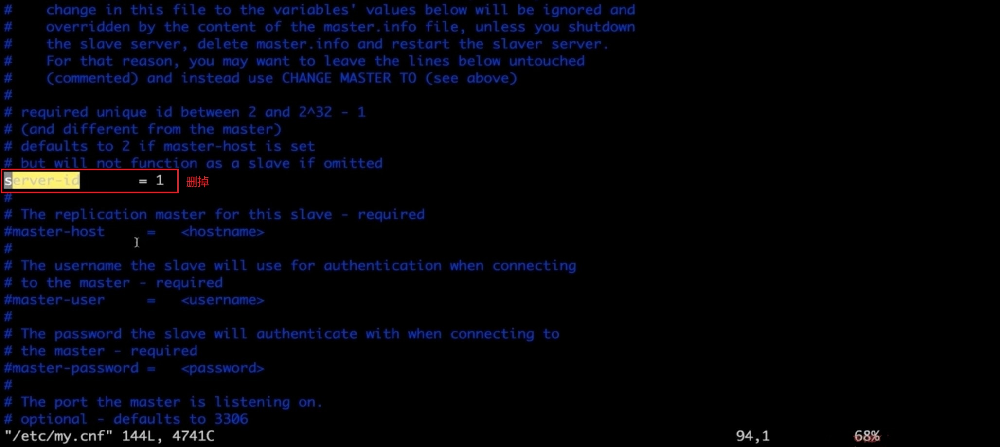
查看状态
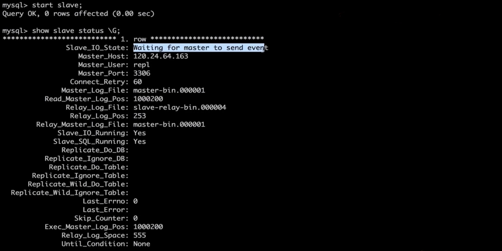

## 解决方案
数据库集群，对我们的要求
1. 读库和写库的数据一致
2. 写数据必须写到写库
3. 读数据必须到读库读

### 解决方案-应用层
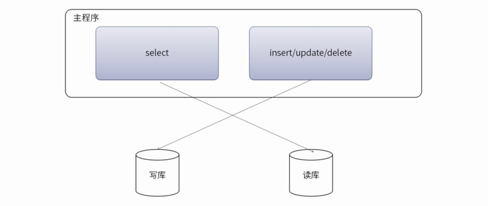
优点：  
1. 多数据源切换方便，由程序自动完成  
2. 不需要引入中间件  
3. 理论上支持任何数据库  

缺点：
1. 由程序员完成，运维参与不到
2. 不能做到动态增加数据源

解决方案：
1. 驱动实现`com.mysql.jdbc.ReplicationDriverSharding-jdbc`  
2. SpringAOP + mybatisplugin + 注解  
3. Spring动态数据源 + mybatisplugin  

### 解决方案-中间件层
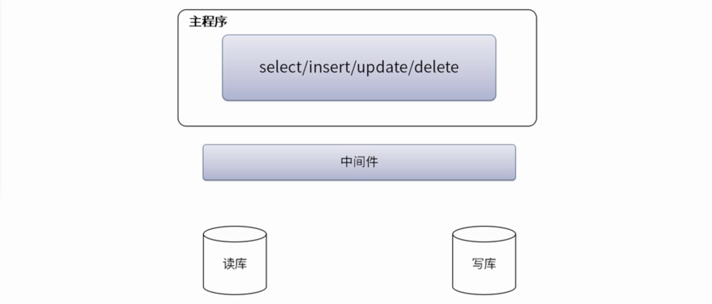
优点：  
1. 源程序不需要做任何改动就可以实现读写分离  
2. 动态添加数据源不需要重启程序  

缺点：  
1. 程序依赖于中间件，会导致切换数据库变得困难  
2. 由中间件做了中转代理，性能有所下降  

解决方案：
1. MySQL-Proxy https://downloads.mysql.com/archives/proxy/  
2. Amoeba for MySQL http://docs.hexnova.com/amoeba/  
3. MyCat http://mycat.io/  
4. Atlas https://github.com/Qihoo360/Atlas  
5. OneProxy  

> 现在有比使用中间件更好的解决方案，这就是运行在公有云上的，基于中间件技术+公有云  
> 数据库打造成的分布式数据库。目前典型的有阿里云的DRDS/PetaData，腾讯云的DCDBF  
> ORTDSQL，以及UCloud最近推出的UDDB  

## 实现
Spring + Mybatis Plugs 实现读写分离  
> 如果你的后台结构是spring+mybatis  
> 可以通过 spring的AbstractRoutingDataSource和 mybatis Plugin 拦截器  
> 非常友好的实现读写分离，原有代码不需要任何改变  

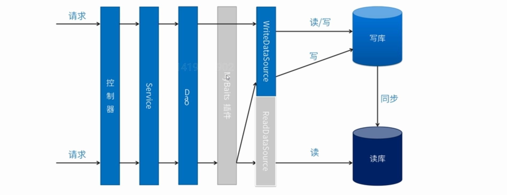

datasource.xml:
```xml
<?xml version="1.0" encoding="UTF-8"?>
<beans xmlns="http://www.springframework.org/schema/beans"
       xmlns:xsi="http://www.w3.org/2001/XMLSchema-instance"
       xmlns:tx="http://www.springframework.org/schema/tx"
       xmlns:context="http://www.springframework.org/schema/context"
       xsi:schemaLocation="http://www.springframework.org/schema/beans
       http://www.springframework.org/schema/beans/spring-beans-4.1.xsd
       http://www.springframework.org/schema/tx
       http://www.springframework.org/schema/tx/spring-tx-4.1.xsd
       http://www.springframework.org/schema/context
	   http://www.springframework.org/schema/context/spring-context-4.1.xsd">

	<context:component-scan base-package="com.study" />

	<bean id="abstractDataSource" abstract="true" class="com.alibaba.druid.pool.DruidDataSource" init-method="init" destroy-method="close">
		<property name="driverClassName" value="com.mysql.jdbc.Driver" />
		<!-- 配置初始化大小、最小、最大 -->
		<property name="initialSize" value="1" />
		<property name="minIdle" value="10" />
		<property name="maxActive" value="10" />
		<!-- 配置获取连接等待超时的时间 -->
		<property name="maxWait" value="60000" />
	</bean>

	<!-- 写库 -->
	<bean id="dataSourceWrite" parent="abstractDataSource">
		<!-- 基本属性 url、user、password -->
		<property name="url" value="jdbc:mysql://allen.aliyun.com:3306/mybatis?serverTimezone=UTC&amp;characterEncoding=utf-8&amp;autoReconnect=true&amp;allowMultiQueries=true" />
		<property name="username" value="root" />
		<property name="password" value="root@123456" />
	</bean>

	<!-- 读库 -->
	<bean id="dataSourceRead" parent="abstractDataSource">
		<!-- 基本属性 url、user、password -->
		<property name="url" value="jdbc:mysql://allen.aliyun.com:3307/mybatis?serverTimezone=UTC&amp;characterEncoding=utf-8&amp;autoReconnect=true&amp;allowMultiQueries=true" />
		<property name="username" value="root" />
		<property name="password" value="root@123456" />
	</bean>

	<!-- 动态数据源 -->
	<bean id="dataSource" class="com.study.rwdb.DynamicDataSource">
		<property name="writeDataSource" ref="dataSourceWrite"></property>
		<property name="readDataSource" ref="dataSourceRead"></property>
	</bean>

	<tx:annotation-driven transaction-manager="transactionManager" />

	<!-- 动态事务管理 -->
	<bean id="transactionManager" class="com.study.rwdb.DynamicDataSourceTransactionManager">
		<property name="dataSource" ref="dataSource" />
	</bean>

	<!-- 配置sqlSessionFactory -->
	<bean id="sqlSessionFactory" class="org.mybatis.spring.SqlSessionFactoryBean">
		<!-- 实例化sqlSessionFactory时需要使用上述配置好的数据源以及SQL映射文件 -->
		<property name="dataSource" ref="dataSource" />
		<!--configLocation属性指定mybatis的核心配置文件 -->
		<property name="configLocation" value="classpath:mybatis-config.xml" />
		<!-- 所有配置的mapper文件 -->
		<property name="mapperLocations" value="classpath:com/study/mapper/*.xml" />
		<!-- 所有的实体 -->
		<property name="typeAliasesPackage" value="com.study.entity" />
		<property name="plugins">
			<array>
				<bean class="com.study.rwdb.DynamicPlugin" />
			</array>
		</property>
	</bean>

	<!-- 配置扫描器 -->
	<bean class="org.mybatis.spring.mapper.MapperScannerConfigurer">
		<!-- 扫描包以及它的子包下的所有映射接口类 -->
		<property name="basePackage" value="com.study.mapper" />
		<property name="sqlSessionFactoryBeanName" value="sqlSessionFactory" />
	</bean>
</beans>
```
DynamicDataSourceGlobal.java:
```java
/**
 * 读写操作对应数据源
 */
public enum DynamicDataSourceGlobal {
    READ, WRITE;
}
```
DynamicDataSourceHolder.java:
```java
/**
 * 使用ThreadLocal技术来记录当前线程中的数据源的key
 */
public final class DynamicDataSourceHolder {

	// 使用ThreadLocal记录当前线程的数据源key
    private static final ThreadLocal<DynamicDataSourceGlobal> holder = new ThreadLocal<DynamicDataSourceGlobal>();

    private DynamicDataSourceHolder() {
        // ......
    }

    /**
     * 设置数据源
     *
     * @param dataSource
     */
    public static void putDataSource(DynamicDataSourceGlobal dataSource){
        holder.set(dataSource);
    }

    /**
     * 获取数据源
     * @return
     */
    public static DynamicDataSourceGlobal getDataSource(){
        return holder.get();
    }

    /**
     * 清理数据源
     */
    public static void clearDataSource() {
        holder.remove();
    }

}
```
DynamicDataSource.java:
```java
import java.util.HashMap;
import java.util.Map;

import org.springframework.jdbc.datasource.lookup.AbstractRoutingDataSource;

/**
 * 获取数据源，用于动态切换数据源
 * <p>
 * <pre>
 * 实现Spring提供的AbstractRoutingDataSource，只需要实现determineCurrentLookupKey方法即可，
 * 由于DynamicDataSource是单例的，线程不安全的，所以采用ThreadLocal保证线程安全，
 * 由DynamicDataSourceHolder完成。
 * </pre>
 */
public class DynamicDataSource extends AbstractRoutingDataSource {
    // 写数据源 3306
    private Object writeDataSource;
    // 读数据源 3307
    private Object readDataSource;

    @Override
    public void afterPropertiesSet() {
        if (this.writeDataSource == null) {
            throw new IllegalArgumentException("Property 'writeDataSource' is required");
        }
        // 覆盖AbstractRoutingDataSource中的默认数据源为 write
        setDefaultTargetDataSource(writeDataSource);
        Map<Object, Object> targetDataSources = new HashMap<>();
        targetDataSources.put(DynamicDataSourceGlobal.WRITE.name(), writeDataSource);
        if (readDataSource != null) {
            // 如果读数据源不为空就压入map
            targetDataSources.put(DynamicDataSourceGlobal.READ.name(), readDataSource);
        }
        // 设置目标数据源为map中压入的数据源
        setTargetDataSources(targetDataSources);
        super.afterPropertiesSet();
    }

    /**
     * 获取与数据源相关的key 此key是Map<String,DataSource> resolvedDataSources 中与数据源绑定的key值
     * 在通过determineTargetDataSource获取目标数据源时使用
     */
    @Override
    protected Object determineCurrentLookupKey() {
        // 使用DynamicDataSourceHolder保证线程安全，并且得到当前线程中的数据源key
        DynamicDataSourceGlobal dynamicDataSourceGlobal = DynamicDataSourceHolder.getDataSource();

        if (dynamicDataSourceGlobal == null || dynamicDataSourceGlobal == DynamicDataSourceGlobal.WRITE) {
            return DynamicDataSourceGlobal.WRITE.name();
        }

        return DynamicDataSourceGlobal.READ.name();
    }

    // get and set method

    public void setWriteDataSource(Object writeDataSource) {
        this.writeDataSource = writeDataSource;
    }

    public Object getWriteDataSource() {
        return writeDataSource;
    }

    public Object getReadDataSource() {
        return readDataSource;
    }

    public void setReadDataSource(Object readDataSource) {
        this.readDataSource = readDataSource;
    }
}
```
DynamicPlugin.java:
```java
import java.util.Locale;
import java.util.Map;
import java.util.Properties;
import java.util.concurrent.ConcurrentHashMap;

import org.apache.ibatis.executor.Executor;
import org.apache.ibatis.executor.keygen.SelectKeyGenerator;
import org.apache.ibatis.mapping.BoundSql;
import org.apache.ibatis.mapping.MappedStatement;
import org.apache.ibatis.mapping.SqlCommandType;
import org.apache.ibatis.plugin.*;
import org.apache.ibatis.session.ResultHandler;
import org.apache.ibatis.session.RowBounds;
import org.slf4j.Logger;
import org.slf4j.LoggerFactory;
import org.springframework.transaction.support.TransactionSynchronizationManager;

/**
 * Mybatis插件，通过拦截Executor
 */
@Intercepts({
	@Signature(type = Executor.class, method = "update", args = { MappedStatement.class, Object.class }),
	@Signature(type = Executor.class, method = "query", args = { MappedStatement.class, Object.class, RowBounds.class, ResultHandler.class })
})
public class DynamicPlugin implements Interceptor {
	private Logger log = LoggerFactory.getLogger(DynamicPlugin.class);

	private static final String REGEX = ".*insert$|.*delete$|.*update$";

	private static final Map<String, DynamicDataSourceGlobal> cacheMap = new ConcurrentHashMap<>();

	@Override
	public Object intercept(Invocation invocation) throws Throwable {
		// 如果拥有事务上下文，则将连接绑定到事务上下文中
		boolean synchronizationActive = TransactionSynchronizationManager.isSynchronizationActive();
		if (!synchronizationActive) {
			Object[] objects = invocation.getArgs();
			MappedStatement ms = (MappedStatement) objects[0];

			DynamicDataSourceGlobal dynamicDataSourceGlobal = null;

			if ((dynamicDataSourceGlobal = cacheMap.get(ms.getId())) == null) {
				// 读方法
				if (ms.getSqlCommandType().equals(SqlCommandType.SELECT)) { // select * from user;    update insert
					// !selectKey 为自增id查询主键(SELECT LAST_INSERT_ID() )方法，使用主库
					if (ms.getId().contains(SelectKeyGenerator.SELECT_KEY_SUFFIX)) {
						dynamicDataSourceGlobal = DynamicDataSourceGlobal.WRITE;
					} else {
						BoundSql boundSql = ms.getSqlSource().getBoundSql(objects[1]);

						String sql = boundSql.getSql().toLowerCase(Locale.CHINA).replaceAll("[\\t\\n\\r]", " ");
						if (sql.matches(REGEX)) {
							dynamicDataSourceGlobal = DynamicDataSourceGlobal.WRITE;
						} else {
							dynamicDataSourceGlobal = DynamicDataSourceGlobal.READ;
						}
					}
				} else {
					// 写方法
					dynamicDataSourceGlobal = DynamicDataSourceGlobal.WRITE;
				}
				System.out.println("设置方法[{"+ms.getId()+"}] use [{"+dynamicDataSourceGlobal.name()+"}] Strategy, SqlCommandType [{"+ms.getSqlCommandType().name()+"}]..");
				log.warn("设置方法[{}] use [{}] Strategy, SqlCommandType [{}]..", ms.getId(), dynamicDataSourceGlobal.name(), ms.getSqlCommandType().name());
				// 把id(方法名)和数据源存入map，下次命中后就直接执行                                                                                                  
				cacheMap.put(ms.getId(), dynamicDataSourceGlobal);
			}
			DynamicDataSourceHolder.putDataSource(dynamicDataSourceGlobal);
		}

		return invocation.proceed();
	}

	@Override
	public Object plugin(Object target) {
		if (target instanceof Executor) {
			return Plugin.wrap(target, this);
		} else {
			return target;
		}
	}

	@Override
	public void setProperties(Properties properties) {
		//
	}
}
```
DynamicDataSourceTransactionManager.java:
```java
/**
 * 自定义事务
 */
public class DynamicDataSourceTransactionManager extends DataSourceTransactionManager {
    private static final long serialVersionUID = 1L;

    /**
     * 只读事务到读库，读写事务到写库
     *
     * @param transaction
     * @param definition
     */
    @Override
    protected void doBegin(Object transaction, TransactionDefinition definition) {

        // 设置数据源
        boolean readOnly = definition.isReadOnly();
        if (readOnly) {
            DynamicDataSourceHolder.putDataSource(DynamicDataSourceGlobal.READ);
        } else {
            DynamicDataSourceHolder.putDataSource(DynamicDataSourceGlobal.WRITE);
        }
        super.doBegin(transaction, definition);
    }

    /**
     * 清理本地线程的数据源
     *
     * @param transaction
     */
    @Override
    protected void doCleanupAfterCompletion(Object transaction) {
        super.doCleanupAfterCompletion(transaction);
        DynamicDataSourceHolder.clearDataSource();
    }
}
```
