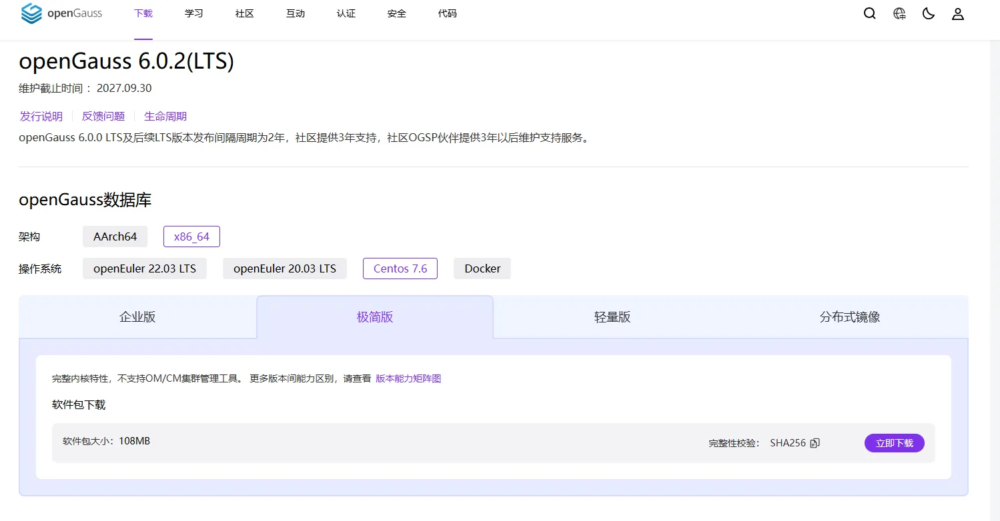
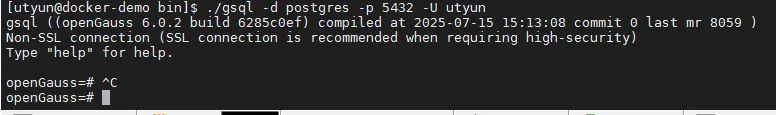
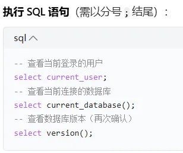
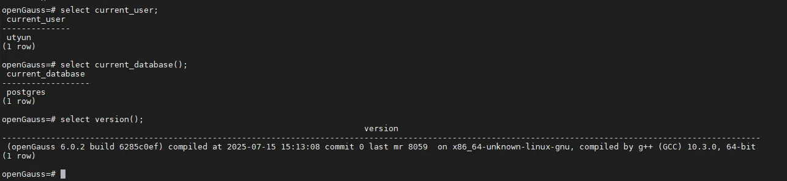
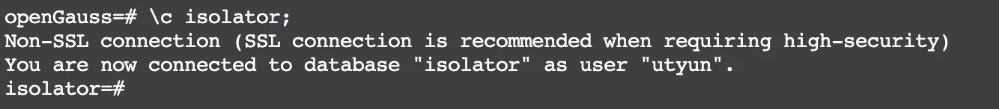
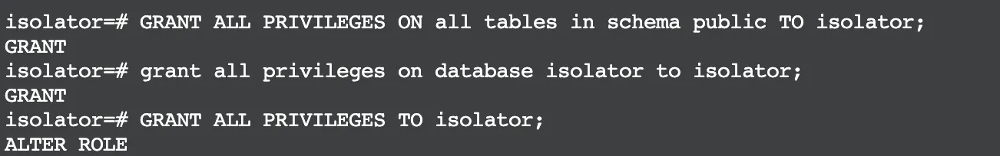
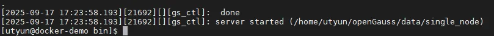
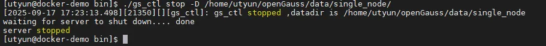

# 【工作】openGauss-安装
## 创建安装用户
openGauss禁止root安装，请提前准备一个linux用户如omm且授予全部权限，便于后续操作（注意后续的路径为omm账用户的，其他用户自行调整）  
1、创建用户  
```shell
sudo useradd -m omm
```
2、为用户设置密码  
```shell
sudo passwd omm
```
3、修改 /etc/security/limits.conf  
```shell
omm soft nofile 1000000
omm hard nofile 1000000
```
4、重新登录生效  

## 开放防火墙端口
```shell
sudo firewall-cmd --add-port=5432/tcp --permanent
sudo firewall-cmd --reload
```

## 安装库
查看是否已安装libtool 动态加载库  
```shell
sudo find / -name "libltdl.so*"
```
如果创建B模式的数据库缺少libtool 动态加载库会报错，因此如果没有的话需要提前安装  
```shell
sudo yum install libtool-ltdl
```

## 下载安装包
官网：https://opengauss.org/zh/download/?version=lts  
  
选择LTS长期维护版本openGauss 6.0.2(LTS)，下载安装包到路径/home/omm/openGauss/  

## 解压安装包
输入以下命令解压，如果报错`tar (child): bzip2: Cannot exec: No such file or directory`需通过执行`yum install -y bzip2` 安装bzip2依赖包，安装完成后，再次运行解压命令  
```shell
tar -jxf openGauss-Server-6.0.2-CentOS7-x86_64.tar.bz2
```

## 安装
进入到simpleInstall文件夹执行安装命令，your_actual_password替换为实际的密码  
```shell
sh ./install.sh -w your_actual_password
```
安装执行完成后，使用ps和gs_ctl查看进程是否正常  
```shell
ps ux | grep gaussdb
gs_ctl query -D /home/omm/openGauss/data/single_node/
```
如果进程没有正常启动，需要手动启动  
```shell
[omm@localhost bin]$ ./gs_ctl restart -D /home/omm/openGauss/data/single_node/ 
```
如果执行启动报了以下错误，是因为缺少 openGauss 依赖的动态库 `libreadline.so.7`（readline 库）或者没有该版本  
```shell
[omm@localhost bin]$ ./gs_ctl restart -D /home/omm/openGauss/data/single_node/ ./gs_ctl: error while loading shared libraries: libreadline.so.7: cannot open shared object file: No such file or directory
```
先查看是否有安装  
```shell
ldconfig -p | grep readline
```
我的系统只有libreadline.so.8，所以需要通过软连接的方式进行解决  
```shell
sudo ln -s /usr/lib64/libreadline.so.8 /usr/lib64/libreadline.so.7
sudo ln -s /usr/lib64/libhistory.so.8 /usr/lib64/libhistory.so.7
```
如果执行启动报了以下错误，是因为`/home/omm/openGauss/data/single_node/`目录不存在，需要我们手动初始化数据库实例  
```shell
[2025-10-24 15:55:22.208][611623][][gs_ctl]: gs_ctl restarted ,datadir is /home/omm/openGauss/data/single_node 
[2025-10-24 15:55:22.208][611623][][gs_ctl]: can't create lock file "/home/omm/openGauss/data/single_node/pg_ctl.lock" : No such file or directory
[omm@localhost bin]$
```
创建数据目录  
```shell
mkdir -p /home/omm/openGauss/data/single_node
chown -R omm:omm /home/omm/openGauss/data
chmod 700 /home/omm/openGauss/data/single_node
```
初始化数据库实例
```shell
gs_initdb -D /home/omm/openGauss/data/single_node --nodename sgnode -U omm
```

## 连接数据库
进入到bin文件夹`/home/omm/openGauss/bin/`，执行连接数据库命令
```shell
./gsql -d postgres -p 5432 -U omm
```
  
连接成功，本地连接默认不用密码  

## 设置密码
your_secure_password替换为实际密码
```shell
ALTER ROLE omm PASSWORD 'your_secure_password';
```

## 验证
  
  

## 配置
1. 修改postgresql配置文件，放开监听地址，允许远程访问  
```shell
vi /home/omm/openGauss/data/single_node/postgresql.conf
```
将`#listen_addresses = 'localhost'`改为`listen_addresses = '*'`
2. 修改pg_hba配置文件，增加远程访问权限  
```shell
vi /home/omm/openGauss/data/single_node/pg_hba.conf
```
在末尾追加  
```text
host    all             all             0.0.0.0/0             sha256
```

## 创建数据库
连接数据库后执行创建isolator数据库命令
```sql
CREATE DATABASE isolator DBCOMPATIBILITY 'B';
```

## 创建用户
创建用户
```sql
CREATE USER isolator WITH PASSWORD 'Ut123456' CREATEDB;
```
  
切换到isolator  
```sql
\c isolator;
```
  
分配权限  
```sql
GRANT ALL PRIVILEGES ON all tables in schema public TO isolator;
grant all privileges on isolator test_db to isolator;
GRANT ALL PRIVILEGES TO isolator;
```
  
退出终端  
```shell
\q
```

## 其他命令
启动/重启数据库  
```shell
./gs_ctl restart -D /home/omm/openGauss/data/single_node/
```
  
关闭数据库
```shell
./gs_ctl stop -D /home/omm/openGauss/data/single_node/
```
  

## 其它  
mac安装数据库管理工具dbeaver连接openGauss数据库  
https://blog.csdn.net/Katharsis_Tk/article/details/138305306  

