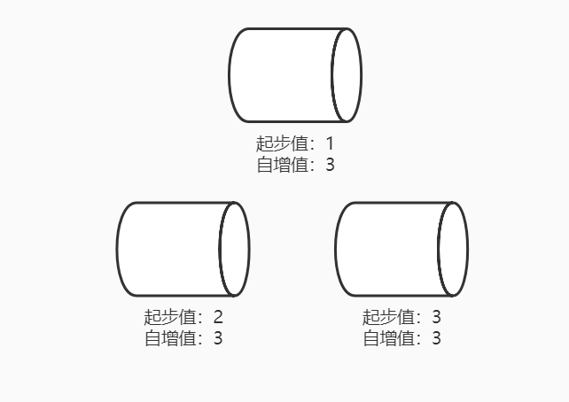
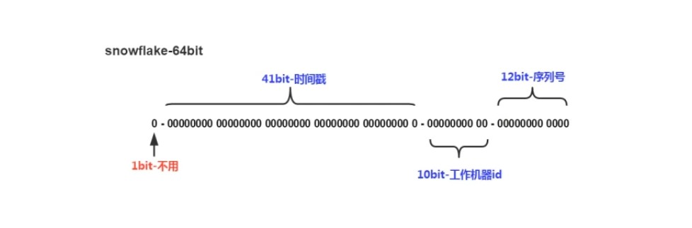
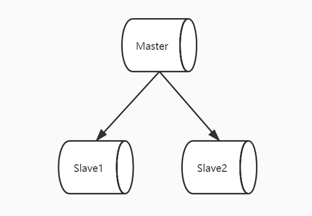

## 分布式/集群环境ID生成要求
- 全局唯一
- 高并发支持
- 高可用
- 趋势递增
- 信息安全
- 可读性

## ID生成策略及总结
- UUID
- 数据库自增
- Snowflake
- Redis

### 生成策略一
策略一: UUID（通用唯一识别码）
- 组成: 当前日期+时间+时钟序列+机器识别码（Mac地址或其他）。
- 在分布式系统中，所有元素都不需要通过中央控制器来判断数据唯一性。

```java
public static String generate() {
    UUID randomUUID = UUID.randomUUID();
    return randomUUID.toString();
}
```

```java
private static final int THREAD_NUM = 1000;
private static CountDownLatch cdl = new CountDownLatch(THREAD_NUM); //线程并发工具

private static void test() throws InterruptedException {
    for (int i =0; i < THREAD_NUM; i++) {
        new Thread(() -> {
            try {
                cdl.await();//等待 等待一个命令
            } catch (InterruptedException e) {
                e.printStackTrace();
            }
            System.out.println(generate());
        }).start();
        cdl.countDown(); //计数器 每次调用+1
    }
    Thread.sleep(2000);
}
```

### 生成策略二
策略二: 数据库自增ID
- 关系型数据库都实现数据库自增ID: MySQL通过AUTO_INCREMENT实现、Oracle通过Sequence序列实现。
- 在数据库集群环境下，不同数据库节点可设置不同起步值、相同步长来实现集群下生成全局唯一、递增ID。



```sql
SET GLOBAL auto_increment_increment=3;
SET GLOBAL auto_increment_offset=1;
```

### 生成策略三
策略三: Snowflake算法
- 组成: 41位时间戳+10位机器ID+12序列号（自增），转换为长度为18的长整形。
- Twitter为满足每秒上万条消息的创建，每条消息都必须分配全局唯一ID，这些ID需要趋势递增，方便客户端排序。



```java
/*开始时间戳（2015-01-01）*/
private final long twepoch = 1420041600000L;

/*机器id所占的位数*/
private final long workerIdBits = 5L;

/*数据标识id所占的位数*/
private final long datacenterIdBits = 5L;

/*序列在id中占的位数*/
private final long sequenceBits = 12L;

/*机器ID向左移12位*/
private final long workerIdShift = sequenceBits;

/*数据标识id向左移17位（12+5）*/
private final long datacenterIdShift = sequenceBits + workerIdBits;

private final long timestampLeftShift = sequenceBits + workerIdBits + datacenterIdBits;

/*生成序列的掩码，这里为4095 (0b111111111111=0xfff=4095)*/
private final long sequenceMask = 1L ^ (-1L << sequenceBits);

/*工作机器ID(0~31)*/
private long workerId = 0L;

/*数据中心ID(0~31)*/
private long datacenterId = 0L;

/*毫秒内序列(0~4095)*/
private long sequence = 0L;

/*上次生成ID的时间戳*/
private long lastTimestamp = -1L;

public synchronized long nextId() {
    long timestamp = timeGen();

    //如果当前时间小于上一次ID生成的时间戳，说明系统时钟回退过这个时候应当抛出异常
    if (timestamp < lastTimestamp) {
        throw new RuntimeException();
    }

    //如果是同一时间生成的，则进行毫秒内序列
    if (lastTimestamp == timestamp) {
        sequence = (sequence + 1) & sequenceMask;
        //毫秒内序列溢出
        if (sequence == 0) {
            //阻塞到下一个毫秒，获得新的时间戳
            timestamp = tilNextMillis(lastTimestamp);
        }
    }
    //时间戳改变，毫秒内序列重置
    else {
        sequence = 0L;
    }
    //上次生成ID的时间戳
    lastTimestamp = timestamp;

    //移位并通过或运算拼到一起组成64位的ID
    return ((timestamp - twepoch) << timestampLeftShift)
            | (datacenterId << datacenterIdShift)
            | (workerId << workerIdShift)
            | sequence;
}

/**
 * 阻塞到下一个毫秒，直到获得新的时间戳
 * @param lastTimestamp 上次生成ID的时间戳
 * @return 当前时间戳
 */
protected long tilNextMillis(long lastTimestamp) {
    long timestamp = timeGen();
    while (timestamp <= lastTimestamp) {
        timestamp = timeGen();
    }
    return timestamp;
}

/**
 * 返回以毫秒为单位的当前时间
 * @return 当前时间(毫秒)
 */
protected long timeGen() {
    return System.currentTimeMillis();
}
```

### 生成策略四
策略四: Redis 自增ID
- Redis实现了incr(key)API用于将key的值递增1，并返回结果。如果key不存在，则创建并赋值为0，然后再执行incr操作。




```java
public void nextId() {
    String key = "id";
    int timeout = 60;
    String prefix = getPrefix(new Date()); //根据时间获取前缀
    long id = redis.incr(key, timeout); //使用redis获取自增ID
    System.out.println(prefix + String.format("%1$05d", id));
}

private String getPrefix(Date date) {
    Calendar c = Calendar.getInstance();
    c.setTime(date);
    int year = c.get(Calendar.YEAR);//2018
    int day = c.get(Calendar.DAY_OF_YEAR);//93
    int hour = c.get(Calendar.HOUR_OF_DAY);//21
    //天数转为3位字符串，不满3位用0补齐
    String dayFmt = String.format("%1$03d", day);
    //小时转为2位字符串，不满2位用0补齐
    String hourFmt = String.format("%1$02d", hour);
    //2位年份+3位天数+2位小时
    return (year - 2000) + dayFmt +hourFmt;
}
```

```java
private Long incr(String key, int timeout) {
    /*
     *incr(key) 是redis的一个同步方法，用于对key自增加1，当key不存在时，则创建值为0的key。
     */
    Jedis jedis = null;
    try {
        jedis = jedisPool.getResource();//拿到jedis客户端
        boolean flag = false; //判断是否需要设置key的超时时间
        if (!jedis.exists(key)) {
            flag = true;
        }
        Long id = jedis.incr(key);
        if (flag && timeout > 0) {
            jedis.expire(key, timeout);//超时
        }
        return id;
    } catch (Exception e) {
        e.printStackTrace();
    } finally {
        if (jedis != null) {
            jedis.close();
        }
    }
    return null;
}
```

### 几种策略总结
| 策略      | 优点                         | 缺点                      | 格式 |
| --------- | ---------------------------- | ------------------------- | ---- |
| UUID      | 实现简单、不占用宽带         | 无序、不可读、查询慢      | 32位 |
| DB自增    | 无代码、递增                 | DB单点故障、扩展性瓶颈    |      |
| Snowflake | 不占用宽带、低位趋势递增     | 依赖服务器时间            | 18位 |
| Redis     | 无单点故障、性能优于DB、递增 | 占用带宽带、Redis集群维护 | 12位 |

