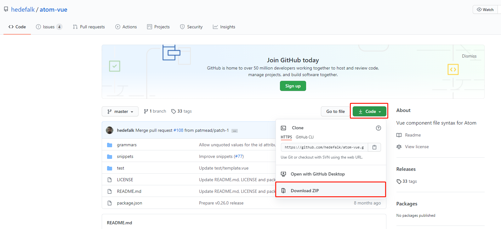
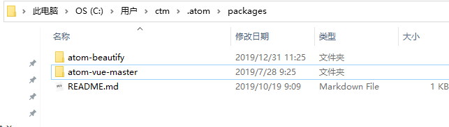

# atom
## 常用快捷键
```properties
多个光标往下: ctrl + alt + 向下箭头
获取查找项的光标: ctrl + f，Alt + Enter
光标统一往右移动: ctrl + shift + 向右箭头
```

<br>

## 支持Vue样式
### 1. 下载atom-vue
[https://github.com/hedefalk/atom-vue](https://github.com/hedefalk/atom-vue)  
  
下载zip包，解压后文件夹移动到 C:/Users/用户名/.atom/packages/文件夹内  
  
### 2. 重启atom
