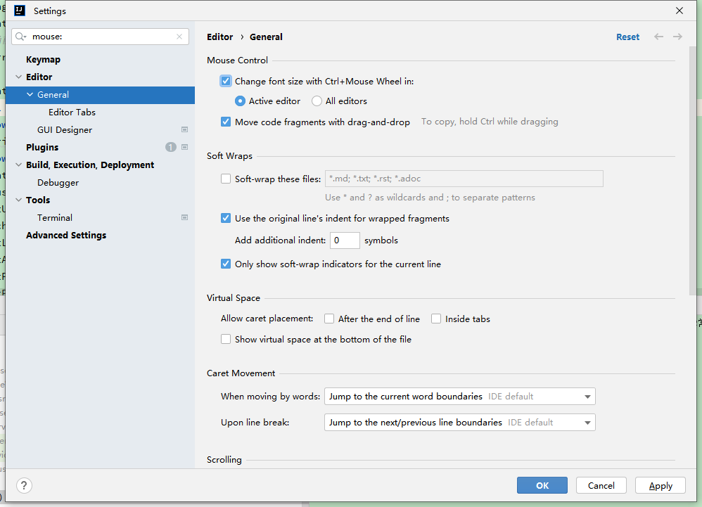
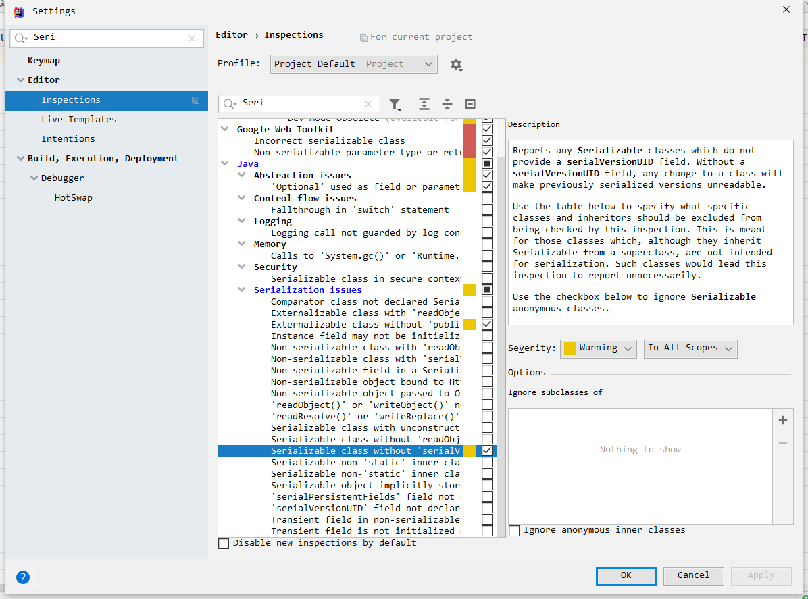
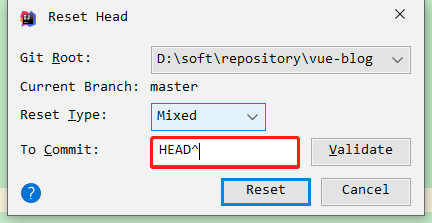

# idea
## 修改编码UTF8

 

## 设置maven

 

## 设置打开的文件栏多行显示
> settings—Editor—General—Editor Tabs—取消勾选Show tabs in one row

 

## 切换风格
> settings—Appearance & Behavior—Appearance—Theme—点击切换

 

## 设置护眼
> settings—Editor—Color Scheme—General—Text—Default text—点击"Background"所对应的颜色框—R: 199,  G:237, B:204

 

## 切换字体
> settings—Editor—Font—选择 source code pro

 

## 自动删除类中无用的import包
> settings—Editor—General—Auto Import—勾选Optimize imports on the fly

 

## 代码提示区分大小写
> settings—Editor—General—Code Completion—取消勾选Match case

 

## 鼠标滚动缩放字体大小

 

## 自动生成serialVersionUID

 

## 破解
[https://www.exception.site/essay/idea-reset-eval](https://www.exception.site/essay/idea-reset-eval)  
[https://3.jetbra.in/](https://3.jetbra.in/)  

 

## 常用插件
- Translate或Translation
- SonarLint  
详情见:  
[https://segmentfault.com/a/1190000019859084?utm_source=tag-newest](https://segmentfault.com/a/1190000019859084?utm_source=tag-newest)  
[https://blog.csdn.net/amethystcity/article/details/82989231](https://blog.csdn.net/amethystcity/article/details/82989231)  

- RestfulToolkit
- Maven Helper
- Lombok
- GsonFormat
- Free MyBatis plugin
- Codota
- Json Parser
- any-rule
- SequenceDiagram
- Elasticsearch
详情见:  
[https://plugins.jetbrains.com/plugin/14512-elasticsearch](https://plugins.jetbrains.com/plugin/14512-elasticsearch)  
[https://www.intellij-elasticsearch.com/](https://www.intellij-elasticsearch.com/)  
- jclasslib Bytecode Viewer

 

## 常用快捷键
> 大小写切换: ctr+shift+u

 

## 还原commit

 

## 问题
**开启easyconnect导致maven下载依赖失败及数据库连接不上**  
- Maven  
Build，Execution，Deployment-Build Tools-Maven-importing-VM options for importe-填上-Djava.net.preferIPv4Stack=true  
Build，Execution，Deployment-Build Tools-Maven-Runner-VM Options-填上-Djava.net.preferIPv4Stack=true  
- 数据库连接  
Data Source-Advanced-VM Options-填上-Djava.net.preferIPv4Stack=true  

 

**Gradle不兼容中文环境，控制台乱码**  
Help-Edit Custom VM Options  
> -Dfile.encoding=UTF-8
