#### 1.1分布式消息中间件设计篇


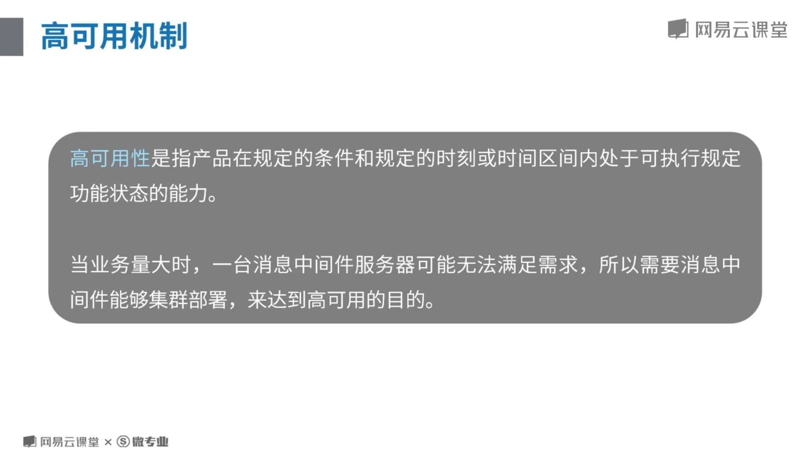


#### 1.2.1amq入门
#### 1.2.2amq支持的消息协议讲解
#### 1.2.3Activemq高可用集群方案
#### 1.2.4持久化原理及事务机制
#### 1.3.1rabbitmq入门及内部消息分发机制
#### 1.3.2rabbitmq集群和高可用方案
#### 1.3.3持久化机制、内存、磁盘控制
#### 1.3.4消息可靠性和插件化机制
#### 1.4.1Kafka入门及使用场景
#### 1.4.2Kafka Connect数据传输作业工具
#### 1.4.3Kafka Streams架构
#### 1.4.4Kafka优雅应用
#### 1.5.1rocketmq入门


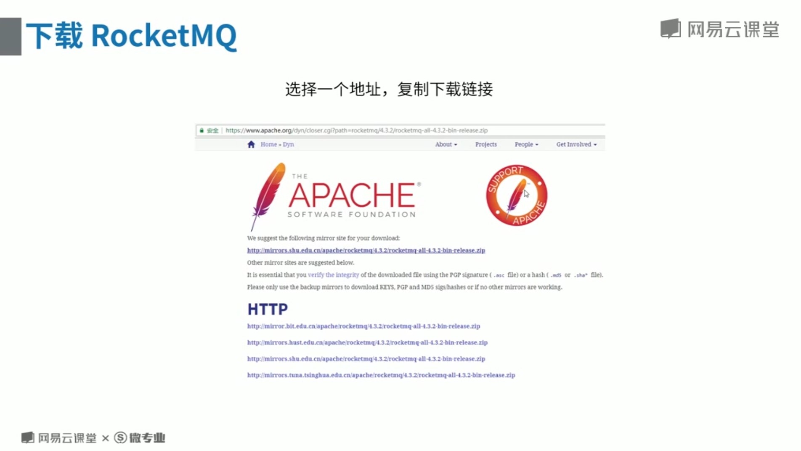


#### 1.5.2rocketmq架构方案及角色详解


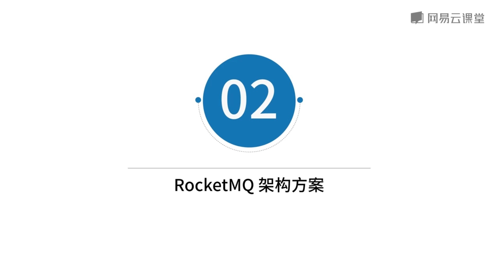


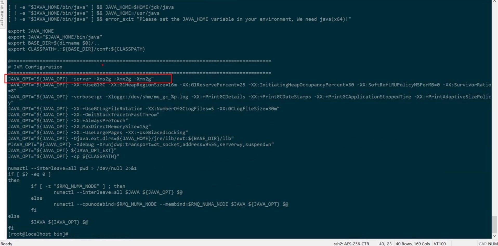


```text
在CentOS7环境中安装好RocketMQ后，为了保证网络互通，你可以关掉防火墙

生产者启动后，发送消息时会报以下错：
Exception in thread "main" org.apache.rocketmq.client.exception.MQClientException: No route info of this topic, TopicTest

原因：
使用RocketMQ进行发消息时，必须要指定topic，对于topic的设置有一个开关autoCreateTopicEnable，一般在开发测试环境中会使用默认设置autoCreateTopicEnable = true，
但是这样就会导致topic的设置不容易规范管理，没有统一的审核等等，所以在正式环境中会在Broker启动时设置参数autoCreateTopicEnable = false。

但是，目前的版本中，autoCreateTopicEnable设置为true也不会生效

解决方法：
手动通过命令或管理界面创建主题
/usr/rocketmq/bin/mqadmin updateTopic -n '192.168.100.242:9876' -c DefaultCluster -t TopicTest
```
```java
import org.apache.rocketmq.client.consumer.DefaultMQPushConsumer;
import org.apache.rocketmq.client.consumer.listener.ConsumeConcurrentlyContext;
import org.apache.rocketmq.client.consumer.listener.ConsumeConcurrentlyStatus;
import org.apache.rocketmq.client.consumer.listener.MessageListenerConcurrently;
import org.apache.rocketmq.client.exception.MQClientException;
import org.apache.rocketmq.common.message.MessageExt;
import org.apache.rocketmq.remoting.common.RemotingHelper;

import java.io.UnsupportedEncodingException;
import java.util.List;

/**
 * 普通消息消费者
 */
public class Consumer {

    public static final String NAME_SERVER_ADDR = "192.168.100.242:9876";

    public static void main(String[] args) throws MQClientException {
        // 1. 创建消费者（Push）对象
        DefaultMQPushConsumer consumer = new DefaultMQPushConsumer("GROUP_TEST");

        // 2. 设置NameServer的地址，如果设置了环境变量NAMESRV_ADDR，可以省略此步
        consumer.setNamesrvAddr(NAME_SERVER_ADDR);
        consumer.setMaxReconsumeTimes(-1);// 消费重试次数 -1代表16次
        // 3. 订阅对应的主题和Tag
        consumer.subscribe("TopicTest", "*");

        // 4. 注册消息接收到Broker消息后的处理接口
        consumer.registerMessageListener(new MessageListenerConcurrently() {
            public ConsumeConcurrentlyStatus consumeMessage(List<MessageExt> list, ConsumeConcurrentlyContext consumeConcurrentlyContext) {
                try {
                    MessageExt messageExt = list.get(0);
                    System.out.printf("线程：%-25s 接收到新消息 %s --- %s %n", Thread.currentThread().getName(), messageExt.getTags(), new String(messageExt.getBody(), RemotingHelper.DEFAULT_CHARSET));
                } catch (UnsupportedEncodingException e) {
                    e.printStackTrace();
                }
                return ConsumeConcurrentlyStatus.RECONSUME_LATER;
            }
        });

        // 5. 启动消费者(必须在注册完消息监听器后启动，否则会报错)
        consumer.start();

        System.out.println("已启动消费者");
    }
}
```
```java
import org.apache.rocketmq.client.exception.MQBrokerException;
import org.apache.rocketmq.client.exception.MQClientException;
import org.apache.rocketmq.client.producer.DefaultMQProducer;
import org.apache.rocketmq.client.producer.SendResult;
import org.apache.rocketmq.common.message.Message;
import org.apache.rocketmq.remoting.common.RemotingHelper;
import org.apache.rocketmq.remoting.exception.RemotingException;

import java.io.UnsupportedEncodingException;

/**
 * 发送同步消息
 * 可靠的同步传输用于广泛的场景，如重要的通知消息，短信通知，短信营销系统等。
 */
public class SyncProducer {
    public static final String NAME_SERVER_ADDR = "192.168.100.242:9876";
    public static void main(String[] args) throws MQClientException, UnsupportedEncodingException, RemotingException, InterruptedException, MQBrokerException {
        // 1. 创建生产者对象
        DefaultMQProducer producer = new DefaultMQProducer("GROUP_TEST");

        // 2. 设置NameServer的地址，如果设置了环境变量NAMESRV_ADDR，可以省略此步
        producer.setNamesrvAddr(NAME_SERVER_ADDR);

        // 3. 启动生产者
        producer.start();

        // 4. 生产者发送消息
        for (int i = 0; i < 10; i++) {
            Message message = new Message("TopicTest", "TagA", ("Hello MQ:" + i).getBytes(RemotingHelper.DEFAULT_CHARSET));

            SendResult result = producer.send(message);

            System.out.printf("发送结果：%s%n", result);
        }

        // 5. 停止生产者
        producer.shutdown();
    }
}
```
```java
import org.apache.rocketmq.client.exception.MQClientException;
import org.apache.rocketmq.client.producer.DefaultMQProducer;
import org.apache.rocketmq.client.producer.SendCallback;
import org.apache.rocketmq.client.producer.SendResult;
import org.apache.rocketmq.common.message.Message;
import org.apache.rocketmq.remoting.common.RemotingHelper;
import org.apache.rocketmq.remoting.exception.RemotingException;

import java.io.UnsupportedEncodingException;
import java.util.concurrent.CountDownLatch;

/**
 * 异步消息
 * 一般用来对方法调用响应时间有较严格要求的情况下，异步调用，立即返回
 * 不同于同步的唯一在于： send方法调用的时候多携带一个回调接口参数，用来异步处理消息发送结果
 */
public class AsyncProducer {
    public static final String NAME_SERVER_ADDR = "192.168.100.242:9876";
    public static void main(String[] args) throws MQClientException, UnsupportedEncodingException, RemotingException, InterruptedException {
        // 1：创建生产者对象，并指定组名
        DefaultMQProducer producer = new DefaultMQProducer("GROUP_TEST");

        // 2：指定NameServer地址
        producer.setNamesrvAddr(NAME_SERVER_ADDR);

        // 3：启动生产者
        producer.start();
        producer.setRetryTimesWhenSendAsyncFailed(0); // 设置异步发送失败重试次数，默认为2

        int count = 10;
        CountDownLatch cd = new CountDownLatch(count);
        // 4：循环发送消息
        for (int i = 0; i < count; i++) {
            final int index = i;

            // ID110：业务数据的ID，比如用户ID、订单编号等等
            Message msg = new Message("TopicTest", "TagB", "ID110", ("Hello World " + index).getBytes(RemotingHelper.DEFAULT_CHARSET));
            // 发送异步消息
            producer.send(msg, new SendCallback() {
                /**
                 * 发送成功的回调函数
                 * 但会结果有多种状态，在SendStatus枚举中定义
                 * @param sendResult
                 */
                public void onSuccess(SendResult sendResult) {
                    System.out.printf("%-10d OK MSG_ID:%s %n", index, sendResult.getMsgId());
                    cd.countDown();
                }

                /**
                 * 发送失败的回调函数
                 * @param e
                 */
                public void onException(Throwable e) {
                    System.out.printf("%-10d Exception %s %n", index, e);
                    e.printStackTrace();
                    cd.countDown();
                }
            });
        }

        // 确保消息都发送出去了
        cd.await();
        // 5：关闭生产者
        producer.shutdown();
    }
}
```
```java
import org.apache.rocketmq.client.exception.MQClientException;
import org.apache.rocketmq.client.producer.DefaultMQProducer;
import org.apache.rocketmq.common.message.Message;
import org.apache.rocketmq.remoting.common.RemotingHelper;
import org.apache.rocketmq.remoting.exception.RemotingException;

import java.io.UnsupportedEncodingException;

/**
 * 单向模式
 * 一般用来对可靠性有一定要求的消息发送，例如日志系统
 * 不同于同步的唯一之处在于：调用的是sendOneway方法，且方法不返回任何值，即调用者不需要关心成功或失败
 */
public class OnewayProducer {
    public static final String NAME_SERVER_ADDR = "192.168.100.242:9876";

    public static void main(String[] args) throws MQClientException, UnsupportedEncodingException, RemotingException, InterruptedException {
        // 1：创建生产者对象
        DefaultMQProducer producer = new DefaultMQProducer("GROUP_TEST");

        // 2：指定NameServer地址
        producer.setNamesrvAddr(NAME_SERVER_ADDR);

        // 3：启动生产者
        producer.start();

        // 4：发送消息
        for (int i = 0; i < 10; i++) {
            Message msg = new Message("TopicTest", "TagC", ("Hello OneWay :" + i).getBytes(RemotingHelper.DEFAULT_CHARSET));
            producer.sendOneway(msg);
        }
        System.out.println("消息已发送");

        producer.shutdown();
    }
}
```


#### 1.5.3有序消息


```java
import org.apache.rocketmq.client.exception.MQBrokerException;
import org.apache.rocketmq.client.exception.MQClientException;
import org.apache.rocketmq.client.producer.DefaultMQProducer;
import org.apache.rocketmq.client.producer.MessageQueueSelector;
import org.apache.rocketmq.client.producer.SendResult;
import org.apache.rocketmq.common.message.Message;
import org.apache.rocketmq.common.message.MessageQueue;
import org.apache.rocketmq.remoting.common.RemotingHelper;
import org.apache.rocketmq.remoting.exception.RemotingException;

import java.io.UnsupportedEncodingException;
import java.util.ArrayList;
import java.util.HashMap;
import java.util.List;
import java.util.Map;

/**
 * 有序消息
 */
public class OrderedProducer {
    public static final String NAME_SERVER_ADDR = "192.168.100.242:9876";

    public static void main(String[] args) throws MQClientException, InterruptedException, RemotingException, MQBrokerException, UnsupportedEncodingException {
        // 1：创建生产者对象，并指定组名
        DefaultMQProducer producer = new DefaultMQProducer("GROUP_TEST");

        // 2：指定NameServer地址
        producer.setNamesrvAddr(NAME_SERVER_ADDR);

        // 3：启动生产者
        producer.start();
        producer.setRetryTimesWhenSendAsyncFailed(0); // 设置异步发送失败重试次数，默认为2

        // 4：定义消息队列选择器
        MessageQueueSelector messageQueueSelector = new MessageQueueSelector() {

            /**
             * 消息队列选择器，保证同一条业务数据的消息在同一个队列
             * @param mqs topic中所有队列的集合
             * @param msg 发送的消息
             * @param arg 此参数是本示例中producer.send的第三个参数
             * @return
             */
            public MessageQueue select(List<MessageQueue> mqs, Message msg, Object arg) {
                Integer id = (Integer) arg;
                // id == 1001
                int index = id % mqs.size();
                // 分区顺序：同一个模值的消息在同一个队列中
                return mqs.get(index);

                // 全局顺序：所有的消息都在同一个队列中
                // return mqs.get(mqs.size() - 1);
            }
        };

        String[] tags = new String[]{"TagA", "TagB", "TagC"};

        List<Map> bizDatas = getBizDatas();

        // 5：循环发送消息
        for (int i = 0; i < bizDatas.size(); i++) {
            Map bizData = bizDatas.get(i);
            // keys：业务数据的ID，比如用户ID、订单编号等等
            Message msg = new Message("TopicTest", tags[i % tags.length], "" + bizData.get("msgType"), bizData.toString().getBytes(RemotingHelper.DEFAULT_CHARSET));
            // 发送有序消息
            SendResult sendResult = producer.send(msg, messageQueueSelector, bizData.get("msgType"));

            System.out.printf("%s， body:%s%n", sendResult, bizData);
        }

        // 6：关闭生产者
        producer.shutdown();
    }

    public static List<Map> getBizDatas() {
        List<Map> orders = new ArrayList<Map>();

        HashMap orderData = new HashMap();
        orderData.put("msgType", 1001);
        orderData.put("userId", "tony");
        orderData.put("desc", "存钱1000");
        orders.add(orderData);

        orderData = new HashMap();
        orderData.put("msgType", 1001);
        orderData.put("userId", "tony");
        orderData.put("desc", "取钱1000");
        orders.add(orderData);

        orderData = new HashMap();
        orderData.put("msgType", 1001);
        orderData.put("userId", "tony");
        orderData.put("desc", "存钱1000");
        orders.add(orderData);

        orderData = new HashMap();
        orderData.put("msgType", 1001);
        orderData.put("userId", "tony");
        orderData.put("desc", "存钱1000");
        orders.add(orderData);

        orderData = new HashMap();
        orderData.put("msgType", 1001);
        orderData.put("userId", "tony");
        orderData.put("desc", "存钱1000");
        orders.add(orderData);

        orderData = new HashMap();
        orderData.put("msgType", 1001);
        orderData.put("userId", "tony");
        orderData.put("desc", "取钱1000");
        orders.add(orderData);

        orderData = new HashMap();
        orderData.put("msgType", 1001);
        orderData.put("userId", "tony");
        orderData.put("desc", "取钱1000");
        orders.add(orderData);


        orderData = new HashMap();
        orderData.put("msgType", 1001);
        orderData.put("userId", "tony");
        orderData.put("desc", "取钱1000");
        orders.add(orderData);

        orderData = new HashMap();
        orderData.put("msgType", 1001);
        orderData.put("userId", "tony");
        orderData.put("desc", "存钱1000");
        orders.add(orderData);

        return orders;
    }
}
```
```java
import org.apache.rocketmq.client.consumer.DefaultMQPushConsumer;
import org.apache.rocketmq.client.consumer.listener.*;
import org.apache.rocketmq.common.consumer.ConsumeFromWhere;
import org.apache.rocketmq.common.message.Message;
import org.apache.rocketmq.common.message.MessageExt;
import org.apache.rocketmq.remoting.common.RemotingHelper;

import java.io.UnsupportedEncodingException;
import java.util.List;
import java.util.concurrent.atomic.AtomicInteger;

/**
 * 顺序消息消费者
 */
public class OrderedConsumer {
    public static final String NAME_SERVER_ADDR = "192.168.100.242:9876";
    public static void main(String[] args) throws Exception {
        // 1. 创建消费者（Push）对象
        DefaultMQPushConsumer consumer = new DefaultMQPushConsumer("GROUP_TEST");

        // 2. 设置NameServer的地址，如果设置了环境变量NAMESRV_ADDR，可以省略此步
        consumer.setNamesrvAddr(NAME_SERVER_ADDR);

        /**
         * 设置Consumer第一次启动是从队列头部开始消费还是队列尾部开始消费<br>
         * 如果非第一次启动，那么按照上次消费的位置继续消费
         */
        consumer.setConsumeFromWhere(ConsumeFromWhere.CONSUME_FROM_FIRST_OFFSET);

        // 3. 订阅对应的主题和Tag
        consumer.subscribe("TopicTest", "TagA || TagB || TagC");

        // 4. 注册消息接收到Broker消息后的处理接口
        // 注1：普通消息消费 [[
//        consumer.registerMessageListener(new MessageListenerConcurrently() {
//            AtomicInteger count = new AtomicInteger(0);
//
//            public ConsumeConcurrentlyStatus consumeMessage(List<MessageExt> list, ConsumeConcurrentlyContext consumeConcurrentlyContext) {
//                doBiz(list.get(0));
//                return ConsumeConcurrentlyStatus.CONSUME_SUCCESS;
//            }
//        });
        // ]] 注1：普通消息消费

        // consumer
        consumer.setMaxReconsumeTimes(-1);
        // 延时  level  3

        // 注2：顺序消息消费 [[
        consumer.registerMessageListener(new MessageListenerOrderly() {

            public ConsumeOrderlyStatus consumeMessage(List<MessageExt> msgs,
                                                       ConsumeOrderlyContext context) {
                context.setAutoCommit(true);
                doBiz(msgs.get(0));

                return ConsumeOrderlyStatus.SUCCESS;
            }
        });
        // ]] 注2：顺序消息消费

        // 5. 启动消费者(必须在注册完消息监听器后启动，否则会报错)
        consumer.start();

        System.out.println("已启动消费者");
    }

    /**
     * 模拟处理业务
     *
     * @param message
     */
    public static void doBiz(Message message) {
        try {
            System.out.printf("线程：%-25s 接收到新消息 %s --- %s %n", Thread.currentThread().getName(), message.getTags(), new String(message.getBody(), RemotingHelper.DEFAULT_CHARSET));
        } catch (UnsupportedEncodingException e) {
            e.printStackTrace();
        }
    }
}
```


#### 1.5.4订阅机制和定时消息


```java
import org.apache.rocketmq.client.consumer.DefaultMQPullConsumer;
import org.apache.rocketmq.client.consumer.DefaultMQPushConsumer;
import org.apache.rocketmq.client.consumer.PullResult;
import org.apache.rocketmq.client.consumer.PullStatus;
import org.apache.rocketmq.client.consumer.listener.ConsumeConcurrentlyContext;
import org.apache.rocketmq.client.consumer.listener.ConsumeConcurrentlyStatus;
import org.apache.rocketmq.client.consumer.listener.MessageListenerConcurrently;
import org.apache.rocketmq.client.exception.MQBrokerException;
import org.apache.rocketmq.client.exception.MQClientException;
import org.apache.rocketmq.common.message.MessageExt;
import org.apache.rocketmq.common.message.MessageQueue;
import org.apache.rocketmq.remoting.common.RemotingHelper;
import org.apache.rocketmq.remoting.exception.RemotingException;

import java.io.UnsupportedEncodingException;
import java.util.HashMap;
import java.util.List;
import java.util.Map;
import java.util.Set;
import java.util.concurrent.Executors;
import java.util.concurrent.TimeUnit;

/**
 * 普通消息消费者
 */
public class PullConsumer {

    public static final String NAME_SERVER_ADDR = "192.168.100.242:9876";

    public static void main(String[] args) throws Exception {
        // 1. 创建消费者（Pull）对象
        DefaultMQPullConsumer consumer = new DefaultMQPullConsumer("GROUP_TEST");

        // 2. 设置NameServer的地址，如果设置了环境变量NAMESRV_ADDR，可以省略此步
        consumer.setNamesrvAddr(NAME_SERVER_ADDR);
        consumer.start();
        // 3. 获取到对于topic的queue列表
        Set<MessageQueue> messageQueues = consumer.fetchSubscribeMessageQueues("TopicTest");
        Executors.newSingleThreadScheduledExecutor().scheduleAtFixedRate(() -> {
            try {
                // 4. 循环遍历
                for (MessageQueue messageQueue : messageQueues) {
                    // 5. 获取读取位置
                    long offset = consumer.fetchConsumeOffset(messageQueue, true);
                    // 6. 从指定位置取queue中的消息，每次最多10条。  如果没有则阻塞等待
                    PullResult pullResult = consumer.pullBlockIfNotFound(messageQueue, null, offset, 10);
                    // 7. 存储Offset，客户端每隔5s会定时刷新到Broker()
                    System.out.println(pullResult.getNextBeginOffset());
                    consumer.updateConsumeOffset(messageQueue, pullResult.getNextBeginOffset());
                    // 8. 遍历结果
                    if (pullResult.getPullStatus() == PullStatus.FOUND) {
                        List<MessageExt> messageExtList = pullResult.getMsgFoundList();
                        for (MessageExt messageExt : messageExtList) {
                            System.out.printf("线程：%-25s 接收到新消息 %s --- %s %n", Thread.currentThread().getName(), messageExt.getTags(), new String(messageExt.getBody(), RemotingHelper.DEFAULT_CHARSET));
                        }
                    }
                }
            } catch (Exception e) {
                e.printStackTrace();
            }
        }, 1000L, 1000L, TimeUnit.MILLISECONDS);
    }
}
```
```java
import org.apache.rocketmq.client.exception.MQClientException;
import org.apache.rocketmq.client.producer.DefaultMQProducer;
import org.apache.rocketmq.client.producer.SendCallback;
import org.apache.rocketmq.client.producer.SendResult;
import org.apache.rocketmq.common.message.Message;
import org.apache.rocketmq.remoting.common.RemotingHelper;
import org.apache.rocketmq.remoting.exception.RemotingException;

import java.io.UnsupportedEncodingException;
import java.util.concurrent.CountDownLatch;

/**
 * 异步消息
 * 一般用来对方法调用响应时间有较严格要求的情况下，异步调用，立即返回
 * 不同于同步的唯一在于： send方法调用的时候多携带一个回调接口参数，用来异步处理消息发送结果
 */
public class AsyncProducer {
    public static final String NAME_SERVER_ADDR = "192.168.100.242:9876";
    public static void main(String[] args) throws MQClientException, UnsupportedEncodingException, RemotingException, InterruptedException {
        // 1：创建生产者对象，并指定组名
        DefaultMQProducer producer = new DefaultMQProducer("GROUP_TEST");

        // 2：指定NameServer地址
        producer.setNamesrvAddr(NAME_SERVER_ADDR);

        // 3：启动生产者
        producer.start();
        producer.setRetryTimesWhenSendAsyncFailed(0); // 设置异步发送失败重试次数，默认为2

        int count = 10;
        CountDownLatch cd = new CountDownLatch(count);
        // 4：循环发送消息
        for (int i = 0; i < count; i++) {
            final int index = i;

            // ID110：业务数据的ID，比如用户ID、订单编号等等
            Message msg = new Message("TopicTest", "TagB", "ID110", ("Hello World " + index).getBytes(RemotingHelper.DEFAULT_CHARSET));
            // 发送异步消息
            producer.send(msg, new SendCallback() {
                /**
                 * 发送成功的回调函数
                 * 但会结果有多种状态，在SendStatus枚举中定义
                 * @param sendResult
                 */
                public void onSuccess(SendResult sendResult) {
                    System.out.printf("%-10d OK MSG_ID:%s %n", index, sendResult.getMsgId());
                    cd.countDown();
                }

                /**
                 * 发送失败的回调函数
                 * @param e
                 */
                public void onException(Throwable e) {
                    System.out.printf("%-10d Exception %s %n", index, e);
                    e.printStackTrace();
                    cd.countDown();
                }
            });
        }

        // 确保消息都发送出去了
        cd.await();
        // 5：关闭生产者
        producer.shutdown();
    }
}
```


```java
import org.apache.rocketmq.client.exception.MQBrokerException;
import org.apache.rocketmq.client.exception.MQClientException;
import org.apache.rocketmq.client.producer.DefaultMQProducer;
import org.apache.rocketmq.client.producer.SendResult;
import org.apache.rocketmq.common.message.Message;
import org.apache.rocketmq.remoting.common.RemotingHelper;
import org.apache.rocketmq.remoting.exception.RemotingException;

import java.io.UnsupportedEncodingException;

/**
 * 发布订阅消息生产者
 */
public class BroadcastProducer {
    public static void main(String[] args) throws MQClientException, InterruptedException, RemotingException, MQBrokerException, UnsupportedEncodingException {
        // 1. 创建生产者对象
        DefaultMQProducer producer = new DefaultMQProducer("GROUP_TEST");

        // 2. 设置NameServer的地址，如果设置了环境变量NAMESRV_ADDR，可以省略此步
        producer.setNamesrvAddr("192.168.100.242:9876");

        // 3. 启动生产者
        producer.start();

        // 4. 生产者发送消息
        for (int i = 0; i < 10; i++) {
            Message message = new Message("TopicTest", "TagA", "OrderID_" + i, ("Hello Broadcast:" + i).getBytes(RemotingHelper.DEFAULT_CHARSET));

            SendResult result = producer.send(message);

            System.out.printf("发送结果：%s%n", result);
        }

        // 5. 停止生产者
        producer.shutdown();
    }
}
```
```java
import org.apache.rocketmq.client.consumer.DefaultMQPushConsumer;
import org.apache.rocketmq.client.consumer.listener.ConsumeConcurrentlyContext;
import org.apache.rocketmq.client.consumer.listener.ConsumeConcurrentlyStatus;
import org.apache.rocketmq.client.consumer.listener.MessageListenerConcurrently;
import org.apache.rocketmq.client.exception.MQClientException;
import org.apache.rocketmq.common.consumer.ConsumeFromWhere;
import org.apache.rocketmq.common.message.MessageExt;
import org.apache.rocketmq.common.protocol.heartbeat.MessageModel;
import org.apache.rocketmq.remoting.common.RemotingHelper;

import java.io.UnsupportedEncodingException;
import java.util.List;

/**
 * 发布订阅消息消费者
 */
public class BroadcastConsumer {

    public static void main(String[] args) throws MQClientException {

        // 1. 创建消费者（Push）对象
        DefaultMQPushConsumer consumer = new DefaultMQPushConsumer("GROUP_TEST");

        // 2. 设置NameServer的地址，如果设置了环境变量NAMESRV_ADDR，可以省略此步
        consumer.setNamesrvAddr("192.168.100.242:9876");

        /**
         * 设置Consumer第一次启动是从队列头部开始消费还是队列尾部开始消费<br>
         * 如果非第一次启动，那么按照上次消费的位置继续消费
         */
        consumer.setConsumeFromWhere(ConsumeFromWhere.CONSUME_FROM_FIRST_OFFSET);

        /**
         * 3. 设置消息模式，默认是CLUSTERING
         * MessageModel.BROADCASTING 广播消费模式
         * MessageModel.CLUSTERING   集群消费模式
         */
        consumer.setMessageModel(MessageModel.BROADCASTING);

        // 4. 订阅对应的主题和Tag
        consumer.subscribe("TopicTest", "TagA || TagB || TagC");

        // 5. 注册消息接收到Broker消息后的处理接口
        consumer.registerMessageListener(new MessageListenerConcurrently() {
            public ConsumeConcurrentlyStatus consumeMessage(List<MessageExt> list, ConsumeConcurrentlyContext consumeConcurrentlyContext) {
                MessageExt messageExt = list.get(0);
                try {
                    System.out.printf("线程：%-25s 接收到新消息 %s --- %s %n", Thread.currentThread().getName(), messageExt.getTags(), new String(messageExt.getBody(), RemotingHelper.DEFAULT_CHARSET));
                } catch (UnsupportedEncodingException e) {
                    e.printStackTrace();
                }
                return ConsumeConcurrentlyStatus.CONSUME_SUCCESS;
            }
        });

        // 6. 启动消费者(必须在注册完消息监听器后启动，否则会报错)
        consumer.start();

        System.out.println("已启动消费者");
    }
}
```


```java
import org.apache.commons.lang3.RandomUtils;
import org.apache.rocketmq.client.exception.MQBrokerException;
import org.apache.rocketmq.client.exception.MQClientException;
import org.apache.rocketmq.client.producer.DefaultMQProducer;
import org.apache.rocketmq.client.producer.SendResult;
import org.apache.rocketmq.common.message.Message;
import org.apache.rocketmq.remoting.common.RemotingHelper;
import org.apache.rocketmq.remoting.exception.RemotingException;

import java.io.UnsupportedEncodingException;
import java.text.SimpleDateFormat;
import java.util.Date;
import java.util.concurrent.TimeUnit;

/**
 * 定时消息生产者
 */
public class ScheduledMessageProducer {

    public static final String NAME_SERVER_ADDR = "192.168.100.242:9876";
    public static void main(String[] args) throws MQClientException, InterruptedException, RemotingException, MQBrokerException, UnsupportedEncodingException {
        // 1. 创建生产者对象
        DefaultMQProducer producer = new DefaultMQProducer("GROUP_TEST");

        // 2. 设置NameServer的地址，如果设置了环境变量NAMESRV_ADDR，可以省略此步
        producer.setNamesrvAddr(NAME_SERVER_ADDR);

        // 3. 启动生产者
        producer.start();

        for (int i = 0; i < 10; i++) {
            String content = "Hello scheduled message " + new SimpleDateFormat("yyyy-MM-dd HH:mm:ss.SS").format(new Date());
            Message message = new Message("TopicTest", content.getBytes(RemotingHelper.DEFAULT_CHARSET));

            // 4. 设置延时等级，此消息将在10秒后传递给消费者
            // 可以在broker服务器端自行配置messageDelayLevel=1s 5s 10s 30s 1m 2m 3m 4m 5m 6m 7m 8m 9m 10m 20m 30m 1h 2h
            message.setDelayTimeLevel(3);

            // 5. 发送消息
            SendResult result = producer.send(message);

            System.out.printf("发送结果：%s%n", result);
            TimeUnit.MILLISECONDS.sleep(RandomUtils.nextInt(300, 800));
        }

        // 6. 停止生产者
        producer.shutdown();
    }
}
```
```java
import org.apache.rocketmq.client.consumer.DefaultMQPushConsumer;
import org.apache.rocketmq.client.consumer.listener.ConsumeConcurrentlyContext;
import org.apache.rocketmq.client.consumer.listener.ConsumeConcurrentlyStatus;
import org.apache.rocketmq.client.consumer.listener.MessageListenerConcurrently;
import org.apache.rocketmq.client.exception.MQClientException;
import org.apache.rocketmq.common.message.MessageExt;
import org.apache.rocketmq.remoting.common.RemotingHelper;

import java.io.UnsupportedEncodingException;
import java.text.SimpleDateFormat;
import java.util.Date;
import java.util.List;

/**
 * 定时消息消费者
 */
public class ScheduledMessageConsumer {

    public static final String NAME_SERVER_ADDR = "192.168.100.242:9876";

    public static void main(String[] args) throws MQClientException {

        // 1. 创建消费者（Push）对象
        DefaultMQPushConsumer consumer = new DefaultMQPushConsumer("GROUP_TEST");

        // 2. 设置NameServer的地址，如果设置了环境变量NAMESRV_ADDR，可以省略此步
        consumer.setNamesrvAddr(NAME_SERVER_ADDR);

        // 3. 订阅对应的主题和Tag
        consumer.subscribe("TopicTest", "*");

        // 4. 注册消息接收到Broker消息后的处理接口
        consumer.registerMessageListener(new MessageListenerConcurrently() {
            public ConsumeConcurrentlyStatus consumeMessage(List<MessageExt> list, ConsumeConcurrentlyContext consumeConcurrentlyContext) {
                MessageExt messageExt = list.get(0);
                try {
                    System.out.printf("%-25s 接收到新消息 --- %s %n", new SimpleDateFormat("yyyy-MM-dd HH:mm:ss.SS").format(new Date()), new String(messageExt.getBody(), RemotingHelper.DEFAULT_CHARSET));
                } catch (UnsupportedEncodingException e) {
                    e.printStackTrace();
                }
                return ConsumeConcurrentlyStatus.CONSUME_SUCCESS;
            }
        });

        // 5. 启动消费者(必须在注册完消息监听器后启动，否则会报错)
        consumer.start();

        System.out.println("已启动消费者");
    }
}
```


#### 1.5.5批量消息和事务消息


```java
import org.apache.rocketmq.client.exception.MQBrokerException;
import org.apache.rocketmq.client.exception.MQClientException;
import org.apache.rocketmq.client.producer.DefaultMQProducer;
import org.apache.rocketmq.client.producer.SendResult;
import org.apache.rocketmq.common.message.Message;
import org.apache.rocketmq.remoting.common.RemotingHelper;
import org.apache.rocketmq.remoting.exception.RemotingException;

import java.io.UnsupportedEncodingException;
import java.util.ArrayList;
import java.util.List;

/**
 * 批量消息生产者
 */
public class BatchMessageProducer {
    public static void main(String[] args) throws MQClientException, InterruptedException, RemotingException, MQBrokerException, UnsupportedEncodingException {
        // 1. 创建生产者对象
        DefaultMQProducer producer = new DefaultMQProducer("GROUP_TEST");

        // 2. 设置NameServer的地址，如果设置了环境变量NAMESRV_ADDR，可以省略此步
        producer.setNamesrvAddr("192.168.100.242:9876");

        // 3. 启动生产者
        producer.start();

        List<Message> messages = new ArrayList<>();
        for (int i = 0; i < 32; i++) {
            String content = "Hello batch message " + i;
            Message message = new Message("TopicTest", content.getBytes(RemotingHelper.DEFAULT_CHARSET));

            messages.add(message);
        }
        // 5. 发送消息
        SendResult result = producer.send(messages);
        System.out.println("消息已发送：" + result);

        // 6. 停止生产者
        producer.shutdown();
    }
}
```
```java
import org.apache.rocketmq.client.consumer.DefaultMQPushConsumer;
import org.apache.rocketmq.client.consumer.listener.ConsumeConcurrentlyContext;
import org.apache.rocketmq.client.consumer.listener.ConsumeConcurrentlyStatus;
import org.apache.rocketmq.client.consumer.listener.MessageListenerConcurrently;
import org.apache.rocketmq.client.exception.MQClientException;
import org.apache.rocketmq.common.message.MessageExt;
import org.apache.rocketmq.remoting.common.RemotingHelper;

import java.io.UnsupportedEncodingException;
import java.util.List;

/**
 * 批量消息消费者
 */
public class BatchMessageConsumer {

    public static void main(String[] args) throws MQClientException {

        // 1. 创建消费者（Push）对象
        DefaultMQPushConsumer consumer = new DefaultMQPushConsumer("GROUP_TEST");

        // 2. 设置NameServer的地址，如果设置了环境变量NAMESRV_ADDR，可以省略此步
        consumer.setNamesrvAddr("192.168.100.242:9876");

        // 3. 订阅对应的主题和Tag
        consumer.subscribe("TopicTest", "*");

        // 4. 设置消息批处理数量，即每次最多获取多少消息，默认是1
        consumer.setConsumeMessageBatchMaxSize(10);

        // 5. 注册接收到Broker消息后的处理接口
        consumer.registerMessageListener(new MessageListenerConcurrently() {
            public ConsumeConcurrentlyStatus consumeMessage(List<MessageExt> list, ConsumeConcurrentlyContext consumeConcurrentlyContext) {
                try {
                    // 设置消息批处理数量后，list中才会有多条，否则每次只会有一条
                    for (MessageExt messageExt : list) {
                        System.out.printf("线程：%-25s 接收到新消息 --- %s %n", Thread.currentThread().getName(), new String(messageExt.getBody(), RemotingHelper.DEFAULT_CHARSET));
                    }
                } catch (UnsupportedEncodingException e) {
                    e.printStackTrace();
                }
                return ConsumeConcurrentlyStatus.CONSUME_SUCCESS;
            }
        });

        // 6. 启动消费者(必须在注册完消息监听器后启动，否则会报错)
        consumer.start();

        System.out.println("已启动消费者");
    }
}
```


```java
import org.apache.rocketmq.client.exception.MQClientException;
import org.apache.rocketmq.client.producer.LocalTransactionState;
import org.apache.rocketmq.client.producer.SendResult;
import org.apache.rocketmq.client.producer.TransactionListener;
import org.apache.rocketmq.client.producer.TransactionMQProducer;
import org.apache.rocketmq.common.message.Message;
import org.apache.rocketmq.common.message.MessageExt;
import org.apache.rocketmq.remoting.common.RemotingHelper;

import java.io.IOException;

/**
 * 事务消息生产者
 */
public class TransactionMessageProducer {
    /**
     * 事务消息监听实现
     */
    private final static TransactionListener transactionListenerImpl = new TransactionListener() {

        /**
         * 在发送消息成功时执行本地事务
         * @param msg
         * @param arg producer.sendMessageInTransaction的第二个参数
         * @return 返回事务状态
         * LocalTransactionState.COMMIT_MESSAGE：提交事务，提交后broker才允许消费者使用
         * LocalTransactionState.RollbackTransaction：回滚事务，回滚后消息将被删除，并且不允许别消费
         * LocalTransactionState.Unknown：中间状态，表示MQ需要核对，以确定状态
         */
        @Override
        public LocalTransactionState executeLocalTransaction(Message msg, Object arg) {
            // TODO 开启本地事务（实际就是我们的jdbc操作）

            // TODO 执行业务代码（插入订单数据库表）
            // int i = orderDatabaseService.insert(....)
            // TODO 提交或回滚本地事务(如果用spring事务注解，这些都不需要我们手工去操作)

            // 模拟一个处理结果
            int index = 8;
            /**
             * 模拟返回事务状态
             */
            switch (index) {
                case 3:
                    System.out.printf("本地事务回滚，回滚消息，id:%s%n", msg.getKeys());
                    return LocalTransactionState.ROLLBACK_MESSAGE;
                case 5:
                case 8:
                    return LocalTransactionState.UNKNOW;
                default:
                    System.out.println("事务提交，消息正常处理");
                    return LocalTransactionState.COMMIT_MESSAGE;
            }
        }

        /**
         * Broker端对未确定状态的消息发起回查，将消息发送到对应的Producer端（同一个Group的Producer），
         * 由Producer根据消息来检查本地事务的状态，进而执行Commit或者Rollback
         * @param msg
         * @return 返回事务状态
         */
        @Override
        public LocalTransactionState checkLocalTransaction(MessageExt msg) {
            // 根据业务，正确处理： 订单场景，只要数据库有了这条记录，消息应该被commit
            String transactionId = msg.getTransactionId();
            String key = msg.getKeys();
            System.out.printf("回查事务状态 key:%-5s msgId:%-10s transactionId:%-10s %n", key, msg.getMsgId(), transactionId);

            if ("id_5".equals(key)) { // 刚刚测试的10条消息， 把id_5这条消息提交，其他的全部回滚。
                System.out.printf("回查到本地事务已提交，提交消息，id:%s%n", msg.getKeys());
                return LocalTransactionState.COMMIT_MESSAGE;
            } else {
                System.out.printf("未查到本地事务状态，回滚消息，id:%s%n", msg.getKeys());
                return LocalTransactionState.ROLLBACK_MESSAGE;
            }
        }
    };

    public static void main(String[] args) throws MQClientException, IOException {
        // 1. 创建事务生产者对象
        // 和普通消息生产者有所区别，这里使用的是TransactionMQProducer
        TransactionMQProducer producer = new TransactionMQProducer("GROUP_TEST");

        // 2. 设置NameServer的地址，如果设置了环境变量NAMESRV_ADDR，可以省略此步
        producer.setNamesrvAddr("192.168.100.242:9876");

        // 3. 设置事务监听器
        producer.setTransactionListener(transactionListenerImpl);

        // 4. 启动生产者
        producer.start();

        for (int i = 0; i < 10; i++) {
            String content = "Hello transaction message " + i;
            Message message = new Message("TopicTest", "TagA", "id_" + i, content.getBytes(RemotingHelper.DEFAULT_CHARSET));

            // 5. 发送消息(发送一条新订单生成的通知)
            SendResult result = producer.sendMessageInTransaction(message, i);

            System.out.printf("发送结果：%s%n", result);
        }

        System.in.read();
        // 6. 停止生产者
        producer.shutdown();
    }
}
```


#### 1.5.6rocketmq中高性能最佳实践


#### 1.6.1消息中间件监控方案及应用场景
#### 1.6.2网易后端架构中消息中间件应用(网易云)

#### 2.1.1Nginx负载均衡


#### 2.1.2代理缓存机制


#### 2.1.3通过Lua扩展Nginx


#### 2.1.4高性能Nginx最佳实践


#### 2.2.1LVS基础概念解析


#### 2.2.2基于VIP的keepalived高可用架构讲解


#### 2.2.3搭建LVS负载均衡集群


#### 2.3.1使用CDN实现应用的缓存和加速


#### 2.3.2通过DNS实现高可靠的负载均衡和访问提速


#### 2.4.1网易集团负载均衡的应用(网易云)

#### 3.1.1缓存介绍


#### 3.1.2自研Java内存缓存


jsr107:
```text
了解一下就行，因为~没太多的应用
http://jcp.org/en/jsr/detail?id=107
1. 目标
为应用程序提供缓存Java对象的功能。
定义了一套通用的缓存概念和工具。
最小化开发人员使用缓存的学习成本。
最大化应用程序在使用不同缓存实现之间的可移植性。
支持进程内和分布式的缓存实现。

2. 核心概念
Java Caching定义了5个核心接口，分别是CachingProvider, CacheManager, Cache, Entry 和 Expiry。
CachingProvider定义了创建、配置、获取、管理和控制多个CacheManager。一个应用可以在运行期访问多个CachingProvider。
CacheManager定义了创建、配置、获取、管理和控制多个唯一命名的Cache，这些Cache存在于CacheManager的上下文中。一个CacheManager仅被一个CachingProvider所拥有。
Cache是一个类似Map的数据结构并临时存储以Key为索引的值。一个Cache仅被一个CacheManager所拥有。
Entry是一个存储在Cache中的key-value对。
每一个存储在Cache中的条目有一个定义的有效期，即Expiry Duration。
一旦超过这个时间，条目为过期的状态。一旦过期，条目将不可访问、更新和删除。缓存有效期可以通过ExpiryPolicy设置。
```
```java
import java.lang.ref.SoftReference;
import java.util.*;
import java.util.concurrent.ConcurrentHashMap;

// 用map实现一个简单的缓存功能
public class MapCacheDemo {

    // 我使用了  ConcurrentHashMap，线程安全的要求。
    //我使用SoftReference <Object>  作为映射值，因为软引用可以保证在抛出OutOfMemory之前，如果缺少内存，将删除引用的对象。
    //在构造函数中，我创建了一个守护程序线程，每5秒扫描一次并清理过期的对象。
    private static final int CLEAN_UP_PERIOD_IN_SEC = 5;

    private final ConcurrentHashMap<String, SoftReference<CacheObject>> cache = new ConcurrentHashMap<>();

    public MapCacheDemo() {
        Thread cleanerThread = new Thread(() -> {
            while (!Thread.currentThread().isInterrupted()) {
                try {
                    Thread.sleep(CLEAN_UP_PERIOD_IN_SEC * 1000);
                    cache.entrySet().removeIf(entry -> Optional.ofNullable(entry.getValue()).map(SoftReference::get).map(CacheObject::isExpired).orElse(false));
                } catch (InterruptedException e) {
                    Thread.currentThread().interrupt();
                }
            }
        });
        cleanerThread.setDaemon(true);
        cleanerThread.start();
    }

    public void add(String key, Object value, long periodInMillis) {
        if (key == null) {
            return;
        }
        if (value == null) {
            cache.remove(key);
        } else {
            long expiryTime = System.currentTimeMillis() + periodInMillis;
            cache.put(key, new SoftReference<>(new CacheObject(value, expiryTime)));
        }
    }

    public void remove(String key) {
        cache.remove(key);
    }

    public Object get(String key) {
        return Optional.ofNullable(cache.get(key)).map(SoftReference::get).filter(cacheObject -> !cacheObject.isExpired()).map(CacheObject::getValue).orElse(null);
    }

    public void clear() {
        cache.clear();
    }

    public long size() {
        return cache.entrySet().stream().filter(entry -> Optional.ofNullable(entry.getValue()).map(SoftReference::get).map(cacheObject -> !cacheObject.isExpired()).orElse(false)).count();
    }

    // 缓存对象value
    private static class CacheObject {
        private Object value;
        private long expiryTime;

        private CacheObject(Object value, long expiryTime) {
            this.value = value;
            this.expiryTime = expiryTime;
        }

        boolean isExpired() {
            return System.currentTimeMillis() > expiryTime;
        }

        public Object getValue() {
            return value;
        }

        public void setValue(Object value) {
            this.value = value;
        }
    }
}
```
```java
public class MapCacheDemoTests {
    public static void main(String[] args) throws InterruptedException {
        MapCacheDemo mapCacheDemo = new MapCacheDemo();
        mapCacheDemo.add("uid_10001", "{1}", 5 * 1000);
        mapCacheDemo.add("uid_10002", "{2}", 5 * 1000);
        mapCacheDemo.add("uid_10003", "{3}", 5 * 1000);
        System.out.println("从缓存中取出值:" + mapCacheDemo.get("uid_10001"));
        Thread.sleep(5000L);
        System.out.println("5秒钟过后");
        System.out.println("从缓存中取出值:" + mapCacheDemo.get("uid_10001"));
        // 5秒后数据自动清除了~
    }
}
```

#### 3.1.3谷歌guava提供的缓存


```xml
        <dependency>
            <groupId>com.google.guava</groupId>
            <artifactId>guava</artifactId>
            <version>27.0.1-jre</version>
        </dependency>
```
```java
import java.io.Serializable;

public class User implements Serializable {
    private String userName;
    private String userId;

    public User(String userName, String userId) {
        this.userName = userName;
        this.userId = userId;
    }

    public String getUserId() {
        return userId;
    }

    public void setUserId(String userId) {
        this.userId = userId;
    }

    public String getUserName() {
        return userName;
    }

    @Override
    public String toString() {
        return userId + " --- " + userName;
    }
}
```
```java
import com.google.common.cache.*;

import java.util.concurrent.ExecutionException;
import java.util.concurrent.TimeUnit;

// https://github.com/google/guava
public class GuavaCacheDemo {
    public static void main(String[] args) throws ExecutionException {
        //缓存接口这里是LoadingCache，LoadingCache在缓存项不存在时可以自动加载缓存
        LoadingCache<String, User> userCache
                //CacheBuilder的构造函数是私有的，只能通过其静态方法newBuilder()来获得CacheBuilder的实例
                = CacheBuilder.newBuilder()
                //设置并发级别为8，并发级别是指可以同时写缓存的线程数
                .concurrencyLevel(8)
                //设置写缓存后8秒钟过期
                .expireAfterWrite(8, TimeUnit.SECONDS)
                //设置写缓存后1秒钟刷新
                .refreshAfterWrite(1, TimeUnit.SECONDS)
                //设置缓存容器的初始容量为10
                .initialCapacity(10)
                //设置缓存最大容量为100，超过100之后就会按照LRU最近虽少使用算法来移除缓存项
                .maximumSize(100)
                //设置要统计缓存的命中率
                .recordStats()
                //设置缓存的移除通知
                .removalListener(new RemovalListener<Object, Object>() {
                    @Override
                    public void onRemoval(RemovalNotification<Object, Object> notification) {
                        System.out.println(notification.getKey() + " 被移除了，原因： " + notification.getCause());
                    }
                })
                //build方法中可以指定CacheLoader，在缓存不存在时通过CacheLoader的实现自动加载缓存
                .build(
                        new CacheLoader<String, User>() {
                            @Override
                            public User load(String key) throws Exception {
                                System.out.println("缓存没有时，从数据库加载" + key);
                                // TODO jdbc的代码~~忽略掉
                                return new User("tony" + key, key);
                            }
                        }
                );

        // 第一次读取
        for (int i = 0; i < 20; i++) {
            User user = userCache.get("uid" + i);
            System.out.println(user);
        }

        // 第二次读取
        for (int i = 0; i < 20; i++) {
            User user = userCache.get("uid" + i);
            System.out.println(user);
        }
        System.out.println("cache stats:");
        //最后打印缓存的命中率等 情况
        System.out.println(userCache.stats().toString());
    }
}
```

#### 3.2.1redis数据结构和常用指令(一)


```text
spring 文档
https://docs.spring.io/spring-data/redis/docs/2.1.5.RELEASE/reference/html

jedis 对redis5新特性支持有限
```

applicationContext.xml:
```xml
<?xml version="1.0" encoding="UTF-8"?>
<beans xmlns="http://www.springframework.org/schema/beans"
       xmlns:xsi="http://www.w3.org/2001/XMLSchema-instance" xmlns:aop="http://www.springframework.org/schema/aop"
       xmlns:c="http://www.springframework.org/schema/c" xmlns:cache="http://www.springframework.org/schema/cache"
       xmlns:context="http://www.springframework.org/schema/context"
       xmlns:jdbc="http://www.springframework.org/schema/jdbc" xmlns:jee="http://www.springframework.org/schema/jee"
       xmlns:lang="http://www.springframework.org/schema/lang" xmlns:mvc="http://www.springframework.org/schema/mvc"
       xmlns:p="http://www.springframework.org/schema/p" xmlns:task="http://www.springframework.org/schema/task"
       xmlns:tx="http://www.springframework.org/schema/tx" xmlns:util="http://www.springframework.org/schema/util"
       xsi:schemaLocation="http://www.springframework.org/schema/beans http://www.springframework.org/schema/beans/spring-beans.xsd
        http://www.springframework.org/schema/aop http://www.springframework.org/schema/aop/spring-aop.xsd  
        http://www.springframework.org/schema/cache http://www.springframework.org/schema/cache/spring-cache.xsd  
        http://www.springframework.org/schema/context http://www.springframework.org/schema/context/spring-context.xsd  
        http://www.springframework.org/schema/jdbc http://www.springframework.org/schema/jdbc/spring-jdbc.xsd  
        http://www.springframework.org/schema/jee http://www.springframework.org/schema/jee/spring-jee.xsd  
        http://www.springframework.org/schema/lang http://www.springframework.org/schema/lang/spring-lang.xsd  
        http://www.springframework.org/schema/mvc http://www.springframework.org/schema/mvc/spring-mvc.xsd  
        http://www.springframework.org/schema/task http://www.springframework.org/schema/task/spring-task.xsd  
        http://www.springframework.org/schema/tx http://www.springframework.org/schema/tx/spring-tx.xsd  
        http://www.springframework.org/schema/util http://www.springframework.org/schema/util/spring-util.xsd">

    <!-- Scans the classpath of this application for @Components to deploy as
        beans -->
    <context:component-scan base-package="com.study"/>


    <!-- 此处特意混合一下xml+java两种配置方式
     理论上xml和java事是可以相互替代的
     -->
    <bean id="stringRedisTemplate"
          class="org.springframework.data.redis.core.StringRedisTemplate"
          p:connection-factory-ref="redisConnectionFactory" >
    </bean>
</beans> 
```
```java
import org.springframework.cache.CacheManager;
import org.springframework.cache.annotation.EnableCaching;
import org.springframework.context.annotation.Bean;
import org.springframework.context.annotation.Configuration;
import org.springframework.context.annotation.Profile;
import org.springframework.data.redis.cache.RedisCacheConfiguration;
import org.springframework.data.redis.cache.RedisCacheManager;
import org.springframework.data.redis.cache.RedisCacheWriter;
import org.springframework.data.redis.connection.RedisConnectionFactory;
import org.springframework.data.redis.connection.RedisStandaloneConfiguration;
import org.springframework.data.redis.connection.lettuce.LettuceConnectionFactory;
import org.springframework.data.redis.core.RedisTemplate;
import org.springframework.data.redis.serializer.JdkSerializationRedisSerializer;
import org.springframework.data.redis.serializer.StringRedisSerializer;

@Configuration
@Profile("single")
// 开启spring cache注解功能
@EnableCaching
class SingleRedisAppConfig {
    @Bean
    public LettuceConnectionFactory redisConnectionFactory() {
        System.out.println("使用单机版本");
        return new LettuceConnectionFactory(new RedisStandaloneConfiguration("192.168.100.241", 6379));
    }

    @Bean
    public RedisTemplate redisTemplate(RedisConnectionFactory redisConnectionFactory) {
        RedisTemplate redisTemplate = new RedisTemplate();
        redisTemplate.setConnectionFactory(redisConnectionFactory);
        // 可以配置对象的转换规则，比如使用json格式对object进行存储。
        // Object --> 序列化 --> 二进制流 --> redis-server存储
        redisTemplate.setKeySerializer(new StringRedisSerializer());
        redisTemplate.setValueSerializer(new JdkSerializationRedisSerializer());
        return redisTemplate;
    }

    // 配置Spring Cache注解功能
    @Bean
    public CacheManager cacheManager(RedisConnectionFactory redisConnectionFactory) {
        RedisCacheWriter redisCacheWriter = RedisCacheWriter.nonLockingRedisCacheWriter(redisConnectionFactory);
        RedisCacheConfiguration redisCacheConfiguration = RedisCacheConfiguration.defaultCacheConfig();
        RedisCacheManager cacheManager = new RedisCacheManager(redisCacheWriter, redisCacheConfiguration);
        return cacheManager;
    }
}
```
```java
import com.study.cache.redis.pojo.User;
import org.springframework.beans.factory.annotation.Autowired;
import org.springframework.cache.CacheManager;
import org.springframework.cache.annotation.Cacheable;
import org.springframework.context.annotation.Profile;
import org.springframework.data.redis.core.RedisTemplate;
import org.springframework.data.redis.core.StringRedisTemplate;
import org.springframework.stereotype.Service;

@Service
@Profile("single")
public class SingleExampleService {
    // 直接注入StringRedisTemplate，则代表每一个操作参数都是字符串
    @Autowired
    private StringRedisTemplate stringRedisTemplate;

    // 参数可以是任何对象，默认由JDK序列化
    @Autowired
    private RedisTemplate redisTemplate;

    /**
     * 简单的缓存插入功能
     */
    public void setByCache(String userId, String userInfo) {
        stringRedisTemplate.opsForValue().set(userId, userInfo);
    }

    /**
     * 对象缓存功能
     */
    public User findUser(String userId) throws Exception {
        User user = null;
        // 1、 判定缓存中是否存在
        user = (User) redisTemplate.opsForValue().get(userId);
        if (user != null) {
            System.out.println("从缓存中读取到值：" + user);
            return user;
        }

        // TODO 2、不存在则读取数据库或者其他地方的值
        user = new User(userId, "张三");
        System.out.println("从数据库中读取到值：" + user);
        // 3、 同步存储value到缓存。
        redisTemplate.opsForValue().set(userId, user);
        return user;
    }
}
```
```java
import com.study.cache.redis.pojo.User;
import org.springframework.cache.annotation.CacheEvict;
import org.springframework.cache.annotation.CachePut;
import org.springframework.cache.annotation.Cacheable;
import org.springframework.context.annotation.Profile;
import org.springframework.stereotype.Service;

@Service
@Profile("single")
public class SpringCacheService {

    /**
     * springcache注解版本（官方大部分资料开始往springboot方向引导，实际上不用springboot，也是差不多的方式）
     */
    // value~单独的缓存前缀
    // key缓存key 可以用springEL表达式
    @Cacheable(cacheManager = "cacheManager", value = "cache-1", key = "#userId")
    public User findUserById(String userId) throws Exception {
        // 读取数据库
        User user = new User(userId, "张三");
        System.out.println("从数据库中读取到数据：" + user);
        return user;
    }

    @CacheEvict(cacheManager = "cacheManager", value = "cache-1", key = "#userId")
    public void deleteUserById(String userId) throws Exception {
        System.out.println("用户从数据库删除成功，请检查缓存是否清除~~" + userId);
    }

    // 如果数据库更新成功，更新redis缓存
    @CachePut(cacheManager = "cacheManager", value = "cache-1", key = "#user.userId", condition = "#result ne null")
    public User updateUser(User user) throws Exception {
        // 读取数据库
        System.out.println("数据库进行了更新，检查缓存是否一致");
        return user; // 返回最新内容，代表更新成功
    }
}
```
```java
import com.study.cache.redis.pojo.User;
import org.junit.Test;
import org.junit.runner.RunWith;
import org.springframework.beans.factory.annotation.Autowired;
import org.springframework.test.context.ActiveProfiles;
import org.springframework.test.context.ContextConfiguration;
import org.springframework.test.context.junit4.SpringJUnit4ClassRunner;

@RunWith(SpringJUnit4ClassRunner.class)
@ContextConfiguration("classpath:applicationContext.xml")
@ActiveProfiles("single") // 设置profile
public class SpringCacheTests {

    @Autowired
    SpringCacheService springCacheService;

    // ---------------spring cache注解演示
    // get
    @Test
    public void springCacheTest() throws Exception {
        User user = springCacheService.findUserById("tony");
        System.out.println(user);
    }

    // update
    @Test
    public void springCacheTest2() throws Exception {
        springCacheService.updateUser(new User("hhhhhhh-2", "tony"));
        User user = springCacheService.findUserById("tony");
        System.out.println(user);
    }

    // delete
    @Test
    public void springCacheTest3() throws Exception {
        springCacheService.deleteUserById("tony");
    }
}
```


#### 3.2.1redis数据结构和常用指令(二)
```java
@RunWith(SpringJUnit4ClassRunner.class)
@ContextConfiguration("classpath:applicationContext.xml")
@ActiveProfiles("single") // 设置profile
public class JedisTests {

    // ------------------------ jedis 工具直连演示
    // jedis和redis命令名称匹配度最高，最为简洁，学习难度最低

    // 列表~ 集合数据存储~ java.util.List，java.util.Stack
    // 生产者消费者（简单MQ）
    @Test
    public void list() {
        Jedis jedis = new Jedis("192.168.100.241", 6379);
        // 插入数据1 --- 2 --- 3
        jedis.rpush("queue_1", "1");
        jedis.rpush("queue_1", "2", "3");

        List<String> strings = jedis.lrange("queue_1", 0, -1);
        for (String string : strings) {
            System.out.println(string);
        }

        // 消费者线程简例
        while (true) {
            String item = jedis.lpop("queue_1");
            if (item == null) break;
            System.out.println(item);
        }

        jedis.close();
    }

    // 类似：在redis里面存储一个hashmap
    // 推荐的方式，无特殊需求是，一般的缓存都用这个
    @Test
    public void hashTest() {
        HashMap<String, Object> user = new HashMap<>();
        user.put("name", "tony");
        user.put("age", 18);
        user.put("userId", 10001);
        System.out.println(user);

        Jedis jedis = new Jedis("192.168.100.241", 6379);
        jedis.hset("user_10001", "name", "tony");
        jedis.hset("user_10001", "age", "18");
        jedis.hset("user_10001", "userId", "10001");
        System.out.println("redis版本~~~~~");
        // jedis.hget("user_10001", "name");
        System.out.println(jedis.hgetAll("user_10001"));
        jedis.close();
    }

    // 用set实现（交集 并集）
    // 交集示例： 共同关注的好友
    // 并集示例：
    @Test
    public void setTest() {
        // 取出两个人共同关注的好友
        Jedis jedis = new Jedis("192.168.100.241", 6379);
        // 每个人维护一个set
        jedis.sadd("user_A", "userC", "userD", "userE");
        jedis.sadd("user_B", "userC", "userE", "userF");
        // 取出共同关注
        Set<String> sinter = jedis.sinter("user_A", "user_B");
        System.out.println(sinter);

        // 检索给某一个帖子点赞/转发的
        jedis.sadd("trs_tp_1001", "userC", "userD", "userE");
        jedis.sadd("star_tp_1001", "userE", "userF");
        // 取出共同人群
        Set<String> union = jedis.sunion("star_tp_1001", "trs_tp_1001");
        System.out.println(union);

        jedis.close();
    }

    // 游戏排行榜
    @Test
    public void zsetTest() {
        Jedis jedis = new Jedis("192.168.100.241", 6379);
        String ranksKeyName = "exam_rank";
        jedis.zadd(ranksKeyName, 100.0, "tony");
        jedis.zadd(ranksKeyName, 82.0, "allen");
        jedis.zadd(ranksKeyName, 90, "mengmeng");
        jedis.zadd(ranksKeyName, 96, "netease");
        jedis.zadd(ranksKeyName, 89, "ali");

        Set<String> stringSet = jedis.zrevrange(ranksKeyName, 0, 2);
        System.out.println("返回前三名:");
        for (String s : stringSet) {
            System.out.println(s);
        }

        Long zcount = jedis.zcount(ranksKeyName, 85, 100);
        System.out.println("超过85分的数量 " + zcount);

        jedis.close();
    }
}
```

```java
@Configuration
@Profile("pipeline")
class PipelineRedisAppConfig {

    @Bean
    public LettuceConnectionFactory redisConnectionFactory() {
        System.out.println("使用单机版本");
        return new LettuceConnectionFactory(new RedisStandaloneConfiguration("192.168.100.241", 6379));
    }

    @Bean
    public RedisTemplate redisTemplate(RedisConnectionFactory redisConnectionFactory) {
        RedisTemplate redisTemplate = new RedisTemplate();
        redisTemplate.setConnectionFactory(redisConnectionFactory);
        // 可以配置对象的转换规则，比如使用json格式对object进行存储。
        // Object --> 序列化 --> 二进制流 --> redis-server存储
        redisTemplate.setKeySerializer(new StringRedisSerializer());
        redisTemplate.setValueSerializer(new JdkSerializationRedisSerializer());
        return redisTemplate;
    }
}
```
```java
@RunWith(SpringJUnit4ClassRunner.class)
@ContextConfiguration("classpath:applicationContext.xml")
@ActiveProfiles("pipeline") // 设置profile
public class PipelineTests {
    @Autowired
    RedisTemplate redisTemplate;

    @Test
    public void test1() throws InterruptedException {
        // 普通模式和pipeline模式
        long time = System.currentTimeMillis();
        for (int i = 0; i < 10000; i++) {
            redisTemplate.opsForList().leftPush("queue_1", i);
        }
        System.out.println("操作完毕：" + redisTemplate.opsForList().size("queue_1"));
        System.out.println("普通模式一万次操作耗时：" + (System.currentTimeMillis() - time));

        time = System.currentTimeMillis();
        redisTemplate.executePipelined(new RedisCallback<String>() {
            @Override
            public String doInRedis(RedisConnection connection) throws DataAccessException {
                for (int i = 0; i < 10000; i++) {
                    connection.lPush("queue_2".getBytes(), String.valueOf(i).getBytes());
                }
                return null;
            }
        });
        System.out.println("操作完毕：" + redisTemplate.opsForList().size("queue_2"));
        System.out.println("pipeline一万次操作耗时：" + (System.currentTimeMillis() - time));
    }
}
```


```java
@Service
@Profile("geo")
public class GeoExampleService {

    // 参数可以是任何对象，默认由JDK序列化
    @Autowired
    private RedisTemplate redisTemplate;

    /**
     * 上传位置
     */
    public void add(Point point, String userId) {
        redisTemplate.opsForGeo().add("user_geo", new RedisGeoCommands.GeoLocation<>(userId, point));
    }

    /**
     * 附近的人
     *
     * @param point 用户自己的位置
     */
    public GeoResults<RedisGeoCommands.GeoLocation> near(Point point) {
        // 半径 100米
        Distance distance = new Distance(100, RedisGeoCommands.DistanceUnit.METERS);
        Circle circle = new Circle(point, distance);
        // 附近5个人
        RedisGeoCommands.GeoRadiusCommandArgs geoRadiusCommandArgs = RedisGeoCommands.GeoRadiusCommandArgs.newGeoRadiusArgs().includeDistance().limit(5);
        GeoResults<RedisGeoCommands.GeoLocation> user_geo = redisTemplate.opsForGeo().radius("user_geo", circle, geoRadiusCommandArgs);
        return user_geo;
    }
}
```
```java
@RunWith(SpringJUnit4ClassRunner.class)
@ContextConfiguration("classpath:applicationContext.xml")
@ActiveProfiles("geo") // 设置profile
public class GeoTests {

    @Autowired
    GeoExampleService geoExampleService;

    @Test
    public void test1() throws InterruptedException {
        // 模拟三个人位置上报
        geoExampleService.add(new Point(116.405285, 39.904989), "allen");
        geoExampleService.add(new Point(116.405265, 39.904969), "mike");
        geoExampleService.add(new Point(116.405315, 39.904999), "tony");

        // tony查找附近的人
        GeoResults<RedisGeoCommands.GeoLocation> geoResults = geoExampleService.near(new Point(116.405315, 39.904999));
        for (GeoResult<RedisGeoCommands.GeoLocation> geoResult : geoResults) {
            RedisGeoCommands.GeoLocation content = geoResult.getContent();
            System.out.println(content.getName() + " :" + geoResult.getDistance().getValue());
        }
    }
}
```


```java
@Configuration
@Profile("pubsub")
class PubsubRedisAppConfig {
    /** 用于测试的通道名称 */
    public final static String TEST_CHANNEL_NAME = "sms_send";

    @Bean
    public LettuceConnectionFactory redisConnectionFactory() {
        System.out.println("使用单机版本");
        return new LettuceConnectionFactory(new RedisStandaloneConfiguration("192.168.100.241", 6379));
    }

    @Bean
    public RedisTemplate redisTemplate(RedisConnectionFactory redisConnectionFactory) {
        RedisTemplate redisTemplate = new RedisTemplate();
        redisTemplate.setConnectionFactory(redisConnectionFactory);
        // 可以配置对象的转换规则，比如使用json格式对object进行存储。
        // Object --> 序列化 --> 二进制流 --> redis-server存储
        redisTemplate.setKeySerializer(new StringRedisSerializer());
        redisTemplate.setValueSerializer(new JdkSerializationRedisSerializer());
        return redisTemplate;
    }
}
```
```java
/**
 * 接收短信通知，直接用客户端的方式
 */
@Component
@Profile("pubsub")
public class SmsChannelListener {
    @Autowired
    RedisTemplate redisTemplate;

    @PostConstruct
    public void setup() {
        redisTemplate.execute(new RedisCallback() {
            @Override
            public Object doInRedis(RedisConnection connection) throws DataAccessException {
                connection.subscribe((message, pattern) -> {
                    System.out.println("收到消息，使用redisTemplate收到的：" + message);
                }, PubsubRedisAppConfig.TEST_CHANNEL_NAME.getBytes());
                return null;
            }
        });
    }
}
```
```java
/**
 * 接收短信通知
 */
@Component
@Profile("pubsub")
@Configuration
public class SmsChannelListenerBySpring {
    // 定义监听器
    @Bean
    public RedisMessageListenerContainer smsMessageListener(RedisConnectionFactory redisConnectionFactory) {
        RedisMessageListenerContainer container = new RedisMessageListenerContainer();
        container.setConnectionFactory(redisConnectionFactory);
        SmsSendListener smsSendListener = new SmsSendListener();
        container.addMessageListener(smsSendListener, Arrays.asList(new ChannelTopic(PubsubRedisAppConfig.TEST_CHANNEL_NAME)));
        return container;
    }

    // 定义触发的方法
    class SmsSendListener implements MessageListener {
        @Override
        public void onMessage(Message message, byte[] pattern) {
            System.out.println("借助spring容器收到消息：" + message);
        }
    }
}
```
```java
@RunWith(SpringJUnit4ClassRunner.class)
@ContextConfiguration("classpath:applicationContext.xml")
@ActiveProfiles("pubsub") // 设置profile
public class PubSubTests {
    @Autowired
    RedisTemplate redisTemplate;

    @Test
    public void test1() throws InterruptedException {
        System.out.println("开始测试发布订阅机制，5秒后发布一条消息");
        Thread.sleep(5000L);
        redisTemplate.execute(new RedisCallback<Long>() {
            @Override
            public Long doInRedis(RedisConnection connection) throws DataAccessException {
                // 发送通知
                Long received = connection.publish(PubsubRedisAppConfig.TEST_CHANNEL_NAME.getBytes(), "{手机号码10086~短信内容~~}".getBytes());
                return received;
            }
        });
    }
}
```


```java
@RunWith(SpringJUnit4ClassRunner.class)
@ContextConfiguration("classpath:applicationContext.xml")
@ActiveProfiles("pubsub") // 设置profile
public class PubSubTests {
    @Autowired
    RedisTemplate redisTemplate;

    // 隐藏功能~~黑科技~~当key被删除，或者key过期之后，也会有通知~
    @Test
    public void test2() throws InterruptedException {
        redisTemplate.execute(new RedisCallback<Long>() {
            @Override
            public Long doInRedis(RedisConnection connection) throws DataAccessException {
                connection.subscribe((message, pattern) -> {
                    System.out.println("收到消息，使用redisTemplate收到的：" + message);
                }, "__keyevent@0__:del".getBytes());
                return null;
            }
        });

        redisTemplate.opsForValue().set("hkkkk", "tony");
        Thread.sleep(1000L);
        redisTemplate.delete("hkkkk");
    }
}
```


```java
@RunWith(SpringJUnit4ClassRunner.class)
@ContextConfiguration("classpath:applicationContext.xml")
@ActiveProfiles("stream") // 设置profile
public class StreamTests {
    // stream 流，5.0新特性，redisTemplate、jedis还没有支持,Redisson和Lettuce支持了
    // 我们使用springboot中默认的redis客户端Lettuce
    // 添加： XADD mystream * sensor-id 1234 temperature 19.8
    // 遍历： XRANGE mystream - + COUNT 2
    // 消费：XREAD COUNT 2 STREAMS mystream 0
    // 阻塞式消费： XREAD BLOCK 0 STREAMS mystream $
    // 创建消费者组：   XGROUP CREATE mystream mygroup $
    // 分组消费： XREADGROUP GROUP mygroup Alice COUNT 1 STREAMS mystream >
    // 消费确认： XACK mystream mygroup 1526569495631-0
    // 查看未确认的消息： XPENDING mystream mygroup - + 10
    // 重新认领消费：XCLAIM mystream mygroup Alice 3600000 1526569498055-0
    // XINFO 查看stream信息，监控
    @Test
    public void producer() throws InterruptedException {
        RedisClient redisClient = RedisClient.create("redis://192.168.100.241:6379");
        StatefulRedisConnection<String, String> connect = redisClient.connect();
        RedisCommands<String, String> redisSyncCommands = connect.sync();
        redisSyncCommands.xadd("stream_sms_send", "smsid", "10001", "content", "收到短信请回复");
    }

    // 普通消费 -- 最后一条消息
    @Test
    public void consumer() {
        RedisClient redisClient = RedisClient.create("redis://192.168.100.241:6379");
        StatefulRedisConnection<String, String> connect = redisClient.connect();
        RedisCommands<String, String> redisSyncCommands = connect.sync();
        List<StreamMessage<String, String>> stream_sms_send = redisSyncCommands.xread(XReadArgs.StreamOffset.from("stream_sms_send", "0"));
        for (StreamMessage<String, String> stringStringStreamMessage : stream_sms_send) {
            System.out.println(stringStringStreamMessage);
        }
    }

    @Test
    public void createGroup() {
        RedisClient redisClient = RedisClient.create("redis://192.168.100.241:6379");
        StatefulRedisConnection<String, String> connect = redisClient.connect();
        RedisCommands<String, String> redisSyncCommands = connect.sync();
        // 创建分组
        redisSyncCommands.xgroupCreate(XReadArgs.StreamOffset.from("stream_sms_send", "0"), "group_1");
    }

    @Test
    public void consumerGroup() {
        RedisClient redisClient = RedisClient.create("redis://192.168.100.241:6379");
        StatefulRedisConnection<String, String> connect = redisClient.connect();
        RedisCommands<String, String> redisSyncCommands = connect.sync();
        // 按组消费
        List<StreamMessage<String, String>> xreadgroup = redisSyncCommands.xreadgroup(Consumer.from("group_1", "consumer_1"), XReadArgs.StreamOffset.lastConsumed("stream_sms_send"));
        for (StreamMessage<String, String> message : xreadgroup) {
            System.out.println(message);
            // 告知redis，消息已经完成了消费
            redisSyncCommands.xack("stream_sms_send", "group_1", message.getId());
        }
    }

    @Test
    public void consumerAck() {

    }
}
```

#### 3.2.2持久化机制


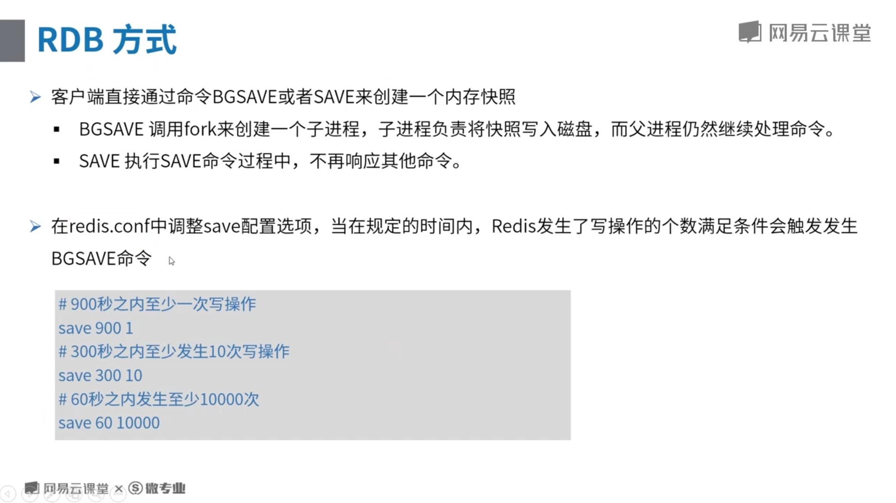


#### 3.2.3redis内存管理

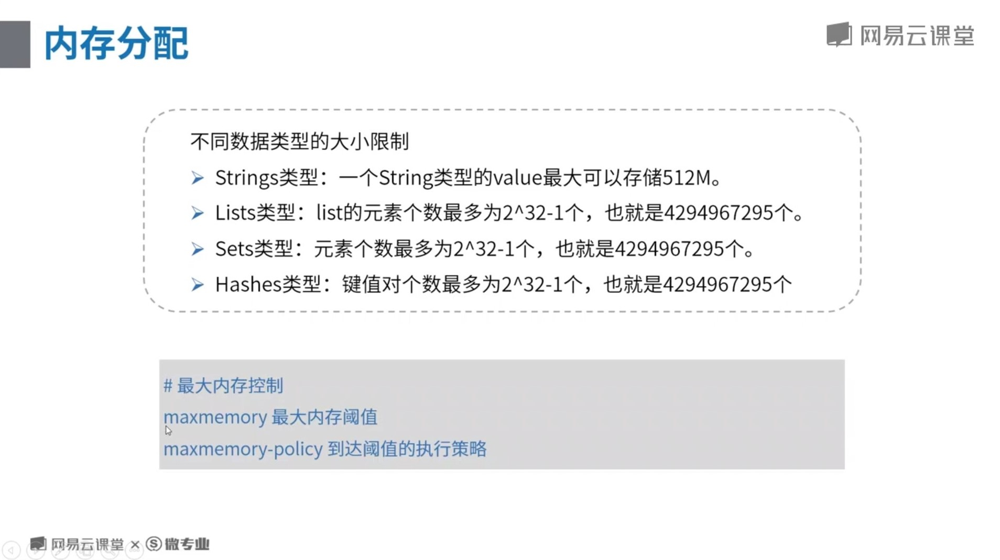
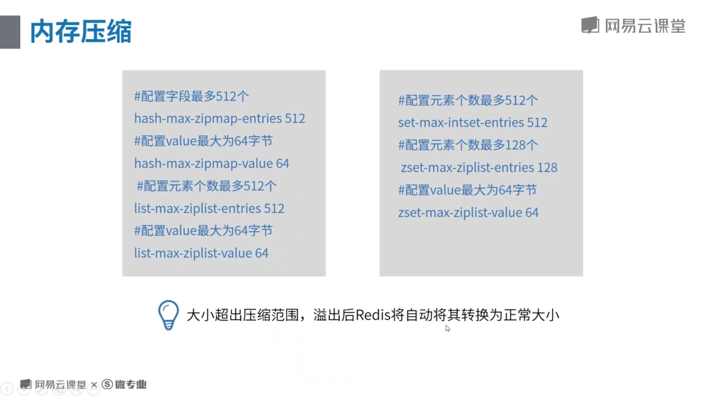


#### 3.2.4 redis主从复制


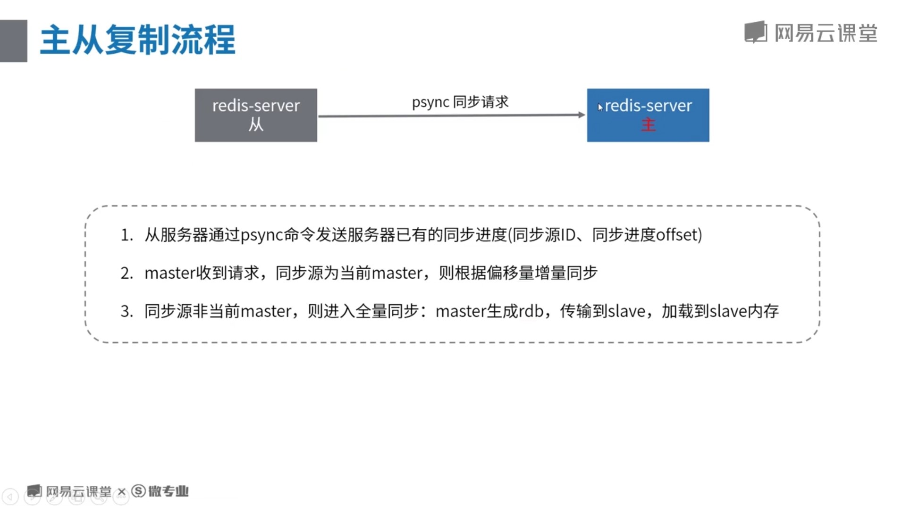


```java
@Configuration
@Profile("replication-rw") // 主从 - 读写分离模式
class ReplicationRWRedisAppConfig {
    @Bean
    public LettuceConnectionFactory redisConnectionFactory() {
        System.out.println("使用读写分离版本");
        LettuceClientConfiguration clientConfig = LettuceClientConfiguration.builder()
                .readFrom(ReadFrom.SLAVE_PREFERRED)
                .build();
        // 此处
        RedisStandaloneConfiguration serverConfig = new RedisStandaloneConfiguration("192.168.100.242", 6379);
        return new LettuceConnectionFactory(serverConfig, clientConfig);
    }
}
```
```java
@Service
public class ReplicationExampleService {
    @Autowired
    private StringRedisTemplate template;

    public void setByCache(String userId, String userInfo) {
        template.opsForValue().set(userId, userInfo);
    }

    public String getByCache(String userId) {
        return template.opsForValue().get(userId);
    }
}
```
```java
@RunWith(SpringJUnit4ClassRunner.class)
@ContextConfiguration("classpath:applicationContext.xml")
@ActiveProfiles("replication-rw") // 激活主从集群-读写分离的配置
public class ReplicationRWTests {
    @Autowired
    ReplicationExampleService replicationExampleService;

    @Test
    public void setTest() {
        replicationExampleService.setByCache("tony", "xxxx");
        String result = replicationExampleService.getByCache("tony");
        System.out.println("从缓存中读取到数据：" + result);
    }
}
```


#### 3.2.5 哨兵高可用机制


```java
@Configuration
@Profile("sentinel")
class SentinelRedisAppConfig {
    @Bean
    public LettuceConnectionFactory redisConnectionFactory() {
        System.out.println("使用哨兵版本");
        RedisSentinelConfiguration sentinelConfig = new RedisSentinelConfiguration()
                .master("mymaster")
                // 哨兵地址
                .sentinel("192.168.100.241", 26380)
                .sentinel("192.168.100.241", 26381)
                .sentinel("192.168.100.241", 26382);
        return new LettuceConnectionFactory(sentinelConfig);
    }
}
```
```java
@RunWith(SpringJUnit4ClassRunner.class)
@ContextConfiguration("classpath:applicationContext.xml")
@ActiveProfiles("sentinel") // 设置profile
public class SentinelTests {
    @Autowired
    StringRedisTemplate stringRedisTemplate;

    @Test
    public void test() throws InterruptedException {
        // 每个一秒钟，操作一下redis，看看最终效果
        int i = 0;
        while (true) {
            i++;
            stringRedisTemplate.opsForValue().set("test-value", String.valueOf(i));
            System.out.println("修改test-value值为: " + i);
            Thread.sleep(1000L);
        }
    }
}
```


#### 3.2.6 redis集群分片存储


```java
@Configuration
// 在cluster环境下生效
@Profile("a7_cluster")
class ClusterAppConfig {
    @Bean
    public JedisConnectionFactory redisConnectionFactory() {
        System.out.println("加载cluster环境下的redis client配置");
        RedisClusterConfiguration redisClusterConfiguration = new RedisClusterConfiguration(Arrays.asList(
                "192.168.100.242:6381",
                "192.168.100.242:6382",
                "192.168.100.242:6383",
                "192.168.100.242:6384",
                "192.168.100.242:6385",
                "192.168.100.242:6386"
        ));
        // 自适应集群变化
        return new JedisConnectionFactory(redisClusterConfiguration);
    }
}
```
```java
@Service
@Profile("a7_cluster")
public class ClusterService {
    @Autowired
    private StringRedisTemplate template;

    public void set(String userId, String userInfo) {
        template.opsForValue().set(userId, userInfo);
    }
}
```
```java
@RunWith(SpringJUnit4ClassRunner.class)
@ContextConfiguration("classpath:applicationContext.xml")
@ActiveProfiles("a7_cluster") // 设置profile
// 集群对于客户端而言，基本是无感知的
public class ClusterServiceTests {
    @Autowired
    ClusterService clusterService;

    @Test
    public void setTest() {
        clusterService.set("tony", "hahhhhh");
        clusterService.set("a", "1");
        clusterService.set("foo", "bar");
    }

    // 测试cluster集群故障时的反应
    @Test
    public void failoverTest() {
        while (true) {
            try {
                long i = System.currentTimeMillis();
                clusterService.set("tony", i + "");
                // delay 10ms
                TimeUnit.MILLISECONDS.sleep(10);
            } catch (Exception e) {
                System.out.println(e.getMessage());
            }
        }
    }
}
```


#### 3.2.7 redis 监控


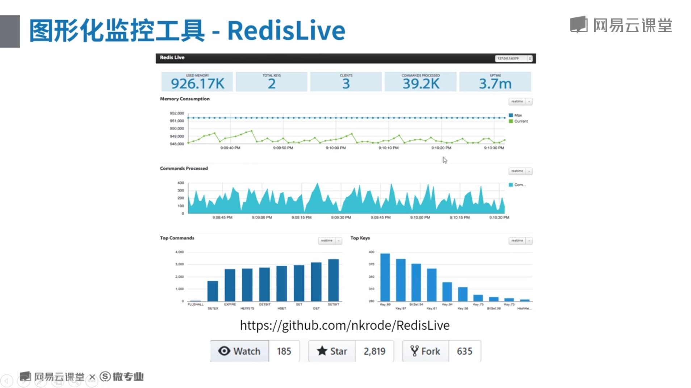

#### 4.1.1数据库中间件设计理论


#### 4.1.2数据库中间件设计要点


#### 4.2.1mycat入门


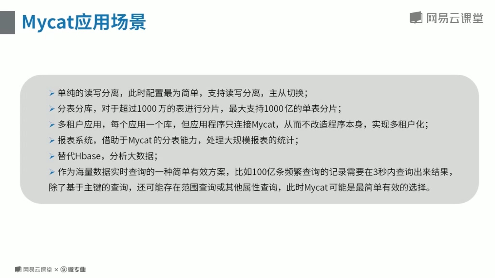


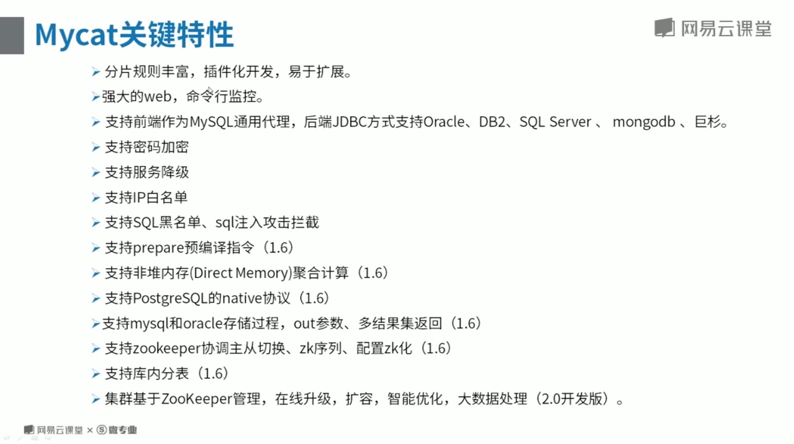


#### 4.2.2mycat读写分离


#### 4.2.3mycat分库分表

#### 4.2.4Mycat架构实践

#### 4.3.1sharding-jdbc概览


#### 4.3.2sharding-jdbc读写分离


```properties
<dependencies>
    <dependency>
        <groupId>org.springframework.boot</groupId>
        <artifactId>spring-boot-starter-web</artifactId>
    </dependency>
    <dependency>
        <groupId>org.mybatis.spring.boot</groupId>
        <artifactId>mybatis-spring-boot-starter</artifactId>
        <version>2.0.0</version>
    </dependency>

    <dependency>
        <groupId>org.springframework.boot</groupId>
        <artifactId>spring-boot-devtools</artifactId>
        <scope>runtime</scope>
    </dependency>
    <dependency>
        <groupId>mysql</groupId>
        <artifactId>mysql-connector-java</artifactId>
        <scope>runtime</scope>
    </dependency>
    <dependency>
        <groupId>org.springframework.boot</groupId>
        <artifactId>spring-boot-starter-test</artifactId>
        <scope>test</scope>
    </dependency>
    <dependency>
        <groupId>io.shardingsphere</groupId>
        <artifactId>sharding-jdbc-spring-boot-starter</artifactId>
        <version>3.1.0</version>
    </dependency>
    <dependency>
        <groupId>com.alibaba</groupId>
        <artifactId>druid</artifactId>
        <version>1.1.14</version>
    </dependency>
</dependencies>
```
application.yml:
```yaml
sharding:
  jdbc:
    datasource:
      names: ds0,ds1
      ds0: 
        type: com.alibaba.druid.pool.DruidDataSource
        driver-class: com.mysql.jdbc.Driver
        url: jdbc:mysql://localhost:3306/db1?useUnicode=true&characterEncoding=utf-8&serverTimezone=UTC
        username: mike
        password: Mike666!
        maxPoolSize: 50
        minPoolSize: 1
      ds1: 
        type: com.alibaba.druid.pool.DruidDataSource
        driver-class: com.mysql.jdbc.Driver
        url: jdbc:mysql://localhost:3306/db2?useUnicode=true&characterEncoding=utf-8&serverTimezone=UTC
        username: mike
        password: Mike666!
        maxPoolSize: 50
        minPoolSize: 1
    config:
      sharding:
        tables: 
           t_order: 
             actual-data-nodes: ds$->{0..1}.t_order$->{0..1}
             database-strategy: 
               standard: 
                 sharding-column: order_time
                 preciseAlgorithmClassName: com.study.mike.sharding.jdbc.sharding.OrderTimePreciseShardingAlgorithm
               #inline:
                 #sharding-column: customer_id
                 #algorithm-expression: ds$->{customer_id % 2}
             table-strategy: 
               inline:
                 sharding-column: order_id
                 algorithm-expression: t_order$->{order_id % 2} 
             keyGeneratorColumnName: order_id
             #key-generator-column-name: order_id
             #keyGeneratorClassName: io.shardingsphere.core.keygen.DefaultKeyGenerator
        default-data-source-name: ds0
        #defaultKeyGeneratorClassName: io.shardingsphere.core.keygen.DefaultKeyGenerator
        #defaultKeyGenerator:
          #type: SNOWFLAKE
      props:
        sql.show: true
        
mybatis:
  configuration:
    map-underscore-to-camel-case: true
```

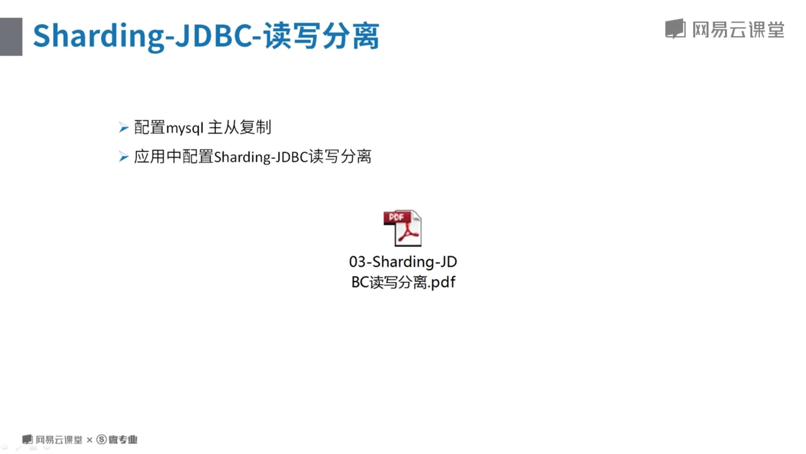
application-rw.yml:
```yaml
sharding:
  jdbc:
    datasource:
      names: ds0,ds1
      ds0: 
        type: com.alibaba.druid.pool.DruidDataSource
        driver-class: com.mysql.jdbc.Driver
        url: jdbc:mysql://192.168.120.218:3306/orders?useUnicode=true&characterEncoding=utf-8&serverTimezone=UTC
        username: mike
        password: Mike666!
        maxPoolSize: 50
        minPoolSize: 1
      ds1: 
        type: com.alibaba.druid.pool.DruidDataSource
        driver-class: com.mysql.jdbc.Driver
        url: jdbc:mysql://192.168.120.219:3306/orders?useUnicode=true&characterEncoding=utf-8&serverTimezone=UTC
        username: mike
        password: Mike666!
        maxPoolSize: 50
        minPoolSize: 1
    config:
      sharding:
        default-data-source-name: ds0
      masterslave:
        name: ms
        master-data-source-name: ds0
        slave-data-source-names: ds1
      props:
        sql.show: true
        
mybatis:
  configuration:
    map-underscore-to-camel-case: true
```


#### 4.3.3sharding-jdbc分库分表

#### 4.3.4sharding-jdbc事务与数据处理

#### 4.3.5分布式数据库在网易的最佳实践(网易云课堂)