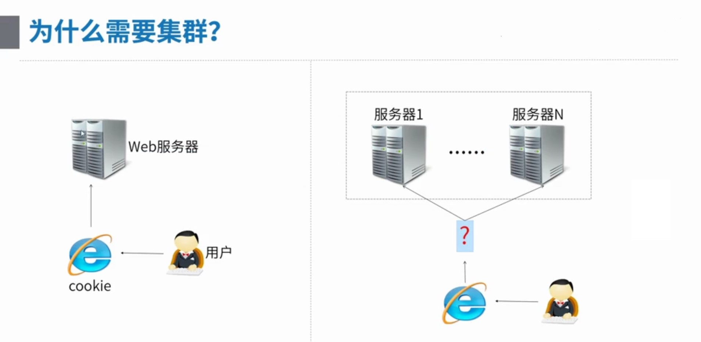
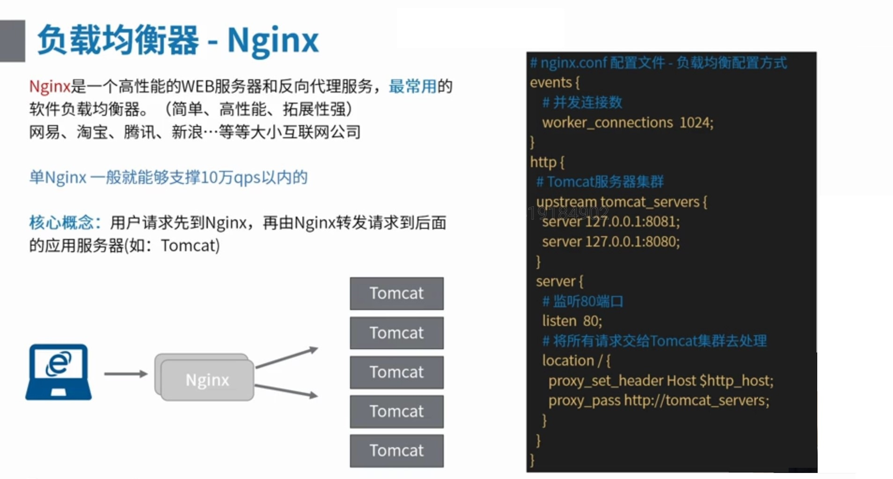
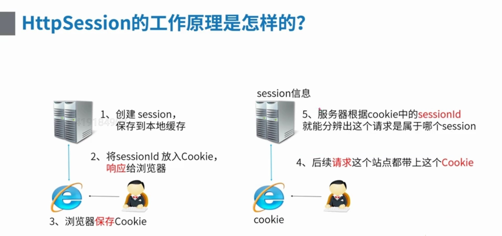
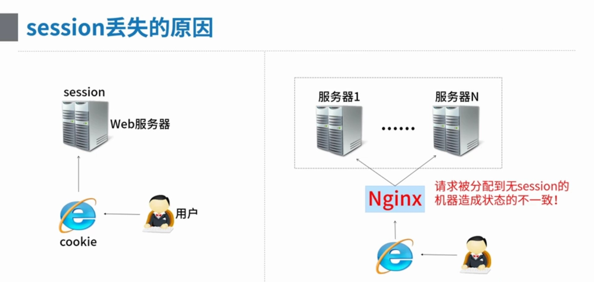
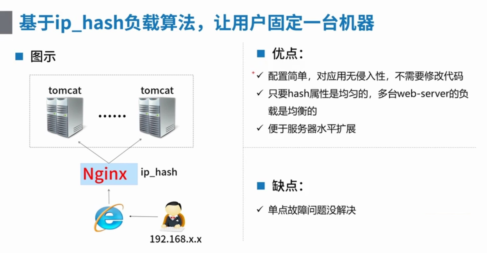
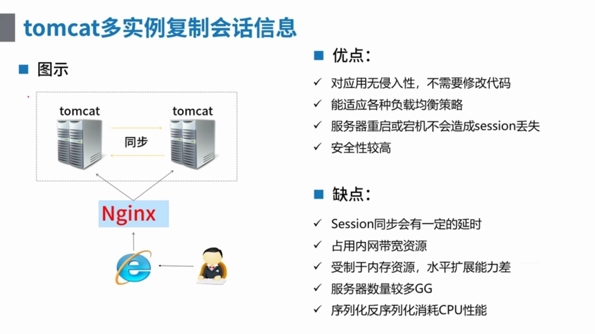
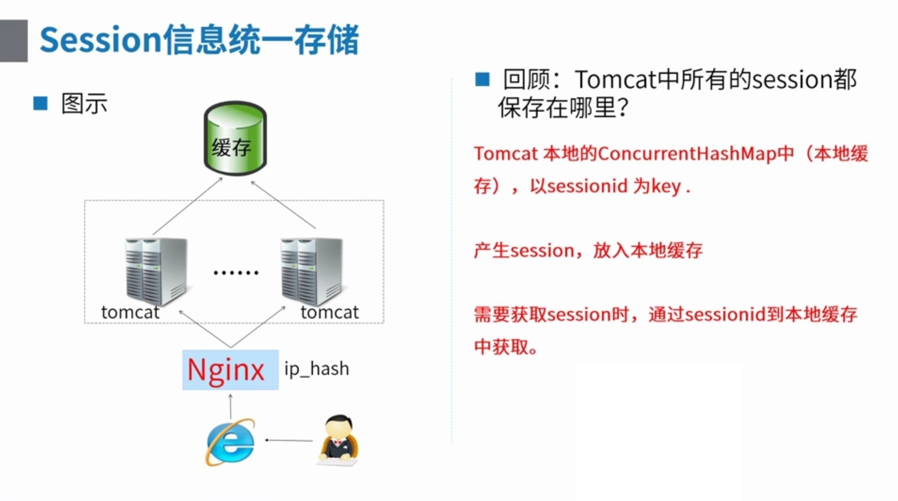
nginx 80

- 高并发负载均衡、高可用

session

- 跟踪会话信息
- 电商网站不登录加入购物车
- 登录 --- 标志 --- session会话 属于哪个用户

ip_hash负载算法缺点

- 单点故障
- IP -- 真的能够不变？

1. 移动、联通、--- 宽带
2. 移动互联网 --- 不同区域ip变化

redis

- 理解为一个JVM外置的Map

```xml
<dependency>
    <groupId>org.springframework.session</groupId>
    <artifactId>spring-session-data-redis</artifactId>
    <version>${spring-session-data-redis.version}</version>
</dependency>
```

```java
@EnableRedisHttpSession // 启用redis存储session功能
public class Config {
    @Bean
    public LettuceConnectionFactory connectionFactory() {
        // 1.配置一个redis客户端 -- 默认连接 127.0.0.1:6379
        return new LettuceConnectionFactory();
    }
}

```

```java
public class Initializer extends AbstractHttpSessionApplicationInitializer {
    public Initializer() {
		super(Config.class);
    }
}
```
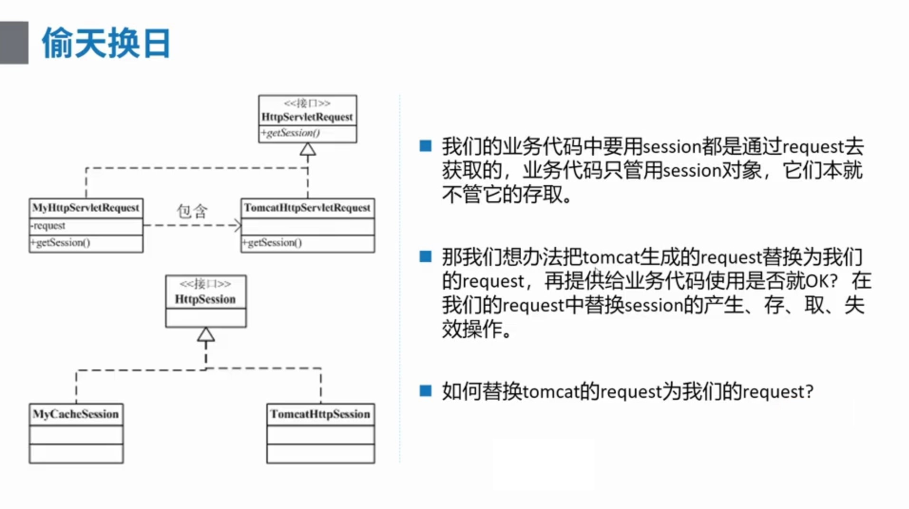
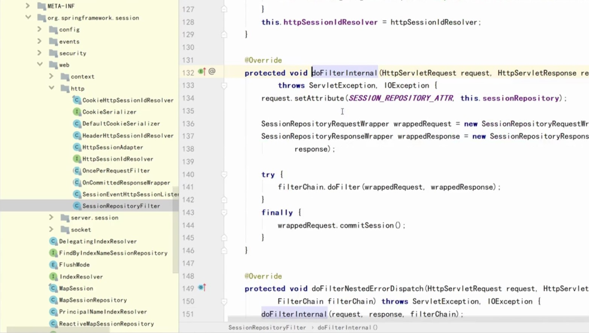
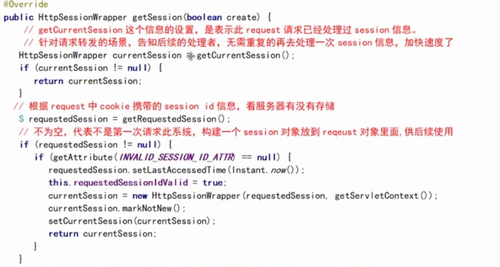
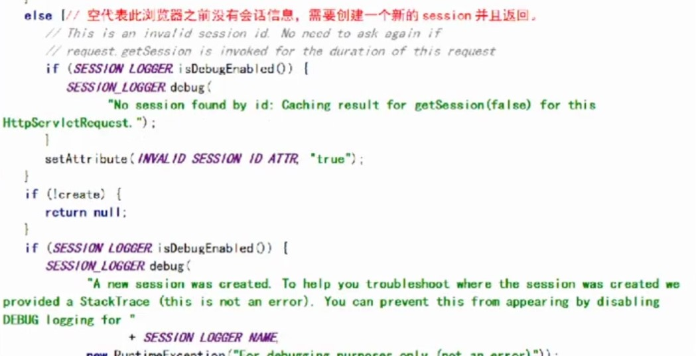
