##  JDK线程
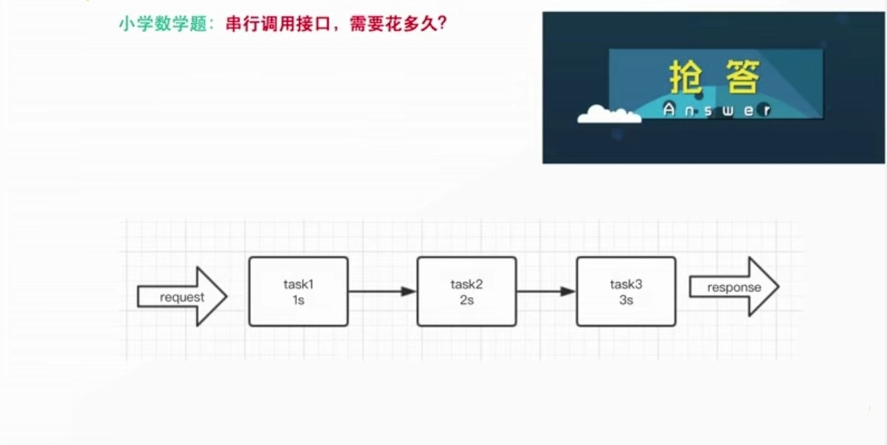
-  **针对以上串行场景，有什么优化方案**

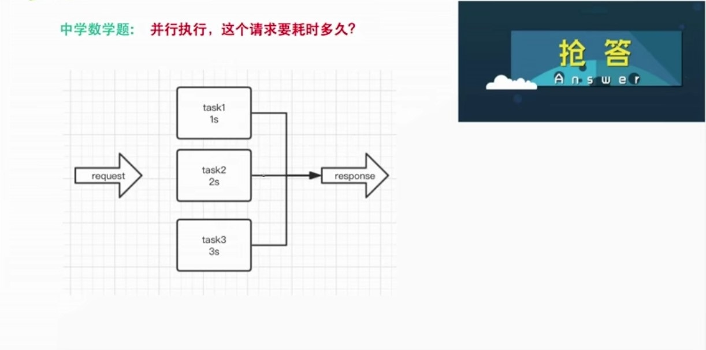
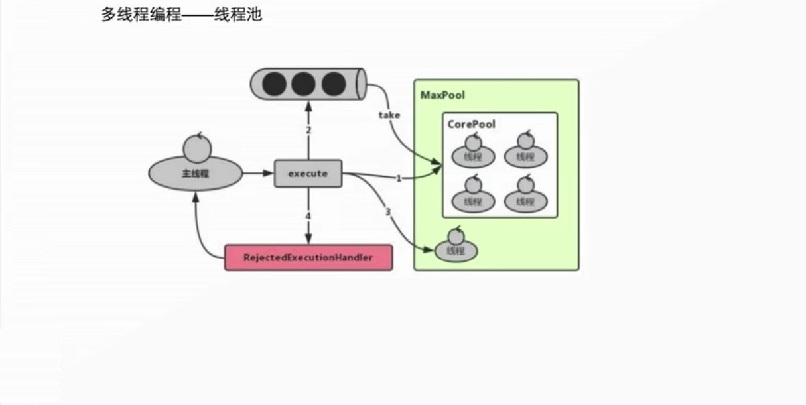
-  **谈谈你对Java线程池的理解**

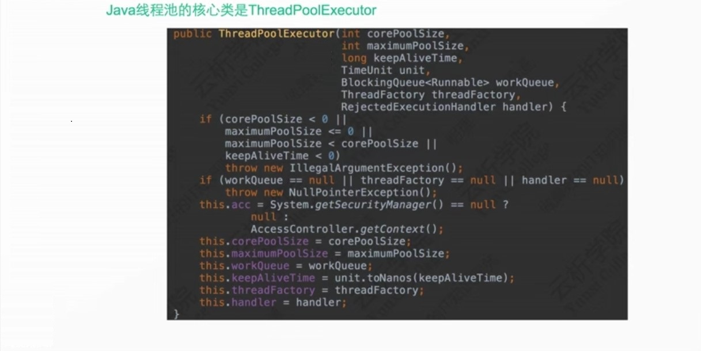

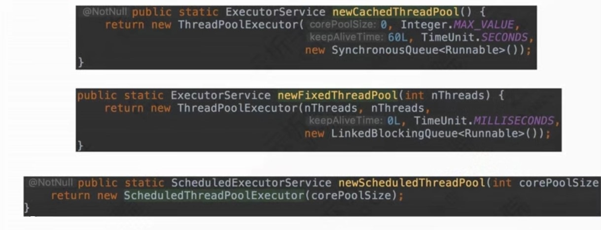
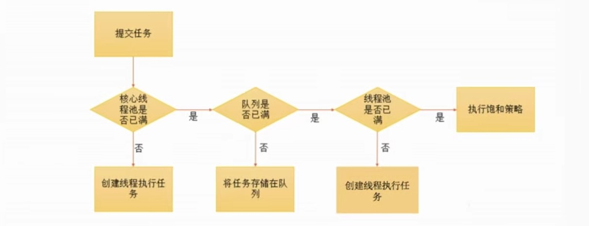
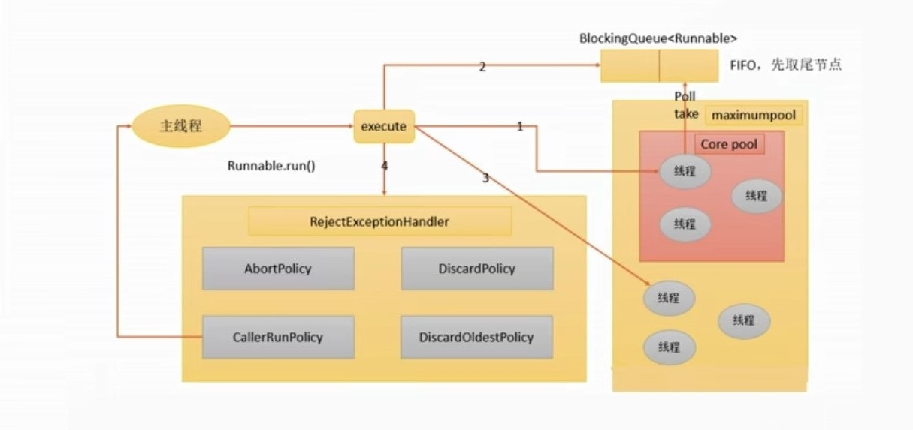
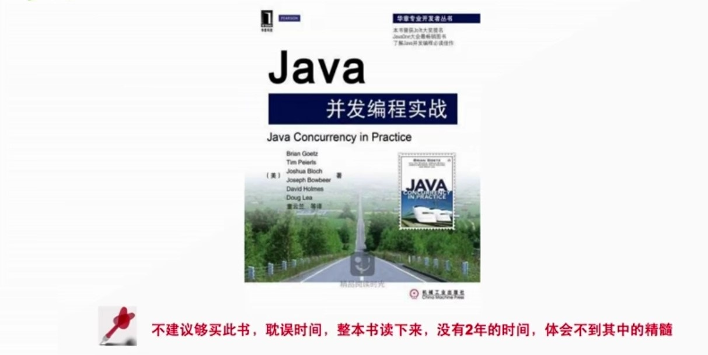
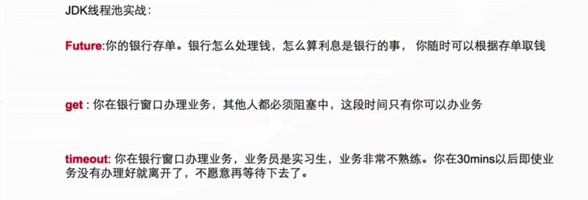
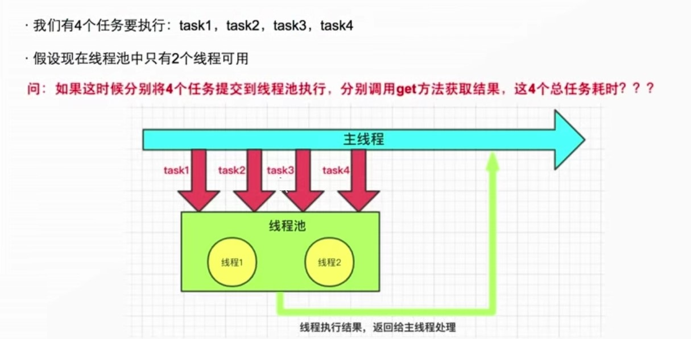
-  **以上方式就是最优解吗？**


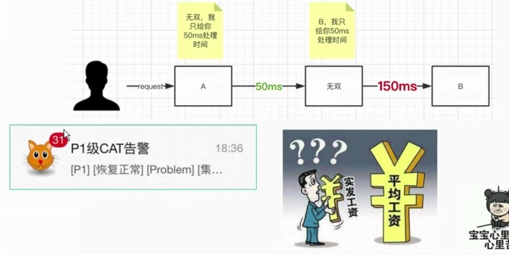
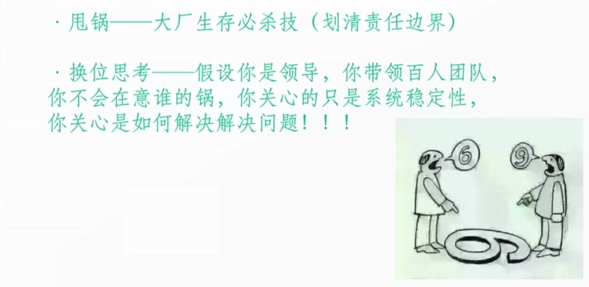
-  **95线  95%请求  300ms**

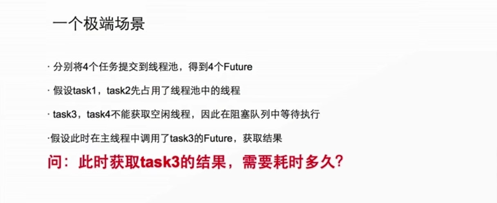

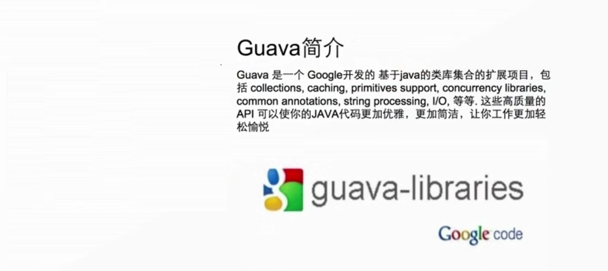
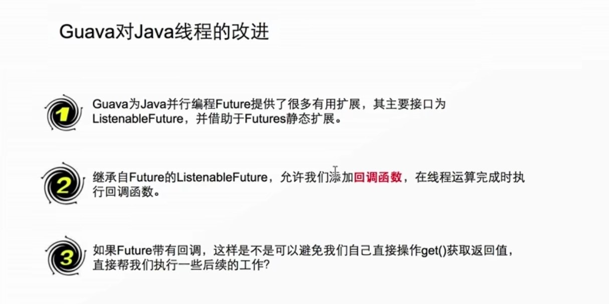

##  Guava对JDK扩展
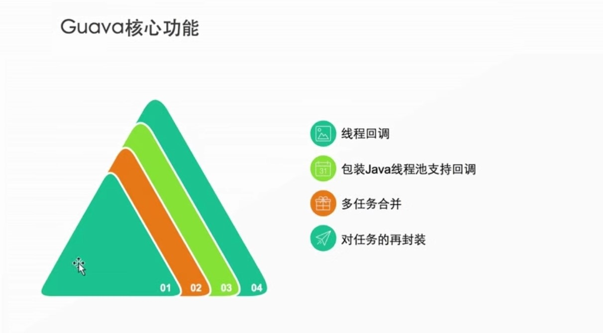


##  Guava实战
##### 模拟外部服务
```java
/**
 * @Description: 模拟一个耗时的服务 如：RPC或者HTTP请求
 */
@Service
public class OuterService {
    /**
     * 用户服务
     */
    public long userService() {
        System.out.println("用户服务开始执行");
        try {
            //模拟耗时1000ms的用户服务
            Thread.sleep(1000);
        } catch (InterruptedException e) {
            e.printStackTrace();
        }
        System.out.println("用户服务执行结束");
        //假设用户服务返回值=1
        return 1;
    }

    /**
     * 订单服务
     */
    public long orderService() {
        System.out.println("订单服务开始执行");
        try {
            //模拟耗时2000ms的订单服务
            Thread.sleep(2000);
        } catch (InterruptedException e) {
            e.printStackTrace();
        }
        System.out.println("订单服务执行结束");
        //假设订单服务返回值=3
        return 3;
    }

    /**
     * 商品服务
     */
    public long itemService() {
        System.out.println("商品服务开始执行");
        try {
            //模拟耗时3000ms的商品服务
            Thread.sleep(3000);
            //模拟调用超时或者服务异常
            // throw new RuntimeException("Oh My God, OrderService Exception!!!");
        } catch (InterruptedException e) {
            e.printStackTrace();
        }
        System.out.println("商品服务执行结束");
        //假设商品服务返回值=5
        return 5;
    }

    /**
     * 地址服务
     */
    public long addressService() {
        System.out.println("地址服务开始执行");
        try {
            //模拟耗时5000ms的地址服务
            Thread.sleep(5000);
        } catch (InterruptedException e) {
            e.printStackTrace();
        }
        System.out.println("地址服务执行结束");
        //假设地址服务返回值=7
        return 7;
    }
}
```
##### 单线程演示
```java
/**
 * @Description: 单线程操作演示
 */
@RestController
public class SingleThreadDemo {
    @Resource
    private OuterService outerService;

    /**
     * 测试代码
     */
    @RequestMapping("/test/single")
    public Map<String, Object> test () {
        //开始调用的时间
        long start = System.currentTimeMillis();
        //同步调用用户服务
        long userServiceResult = outerService.userService();
        //同步调用订单服务
        long orderServiceResult = outerService.orderService();
        //同步调用商品服务
        long itemServiceResult = outerService.itemService();
        //结束调用的时间
        long end = System.currentTimeMillis();
        String time = "总调用时间是：" + (end - start) + "毫秒";
        //计算结果
        long result = userServiceResult + orderServiceResult + itemServiceResult;
        //为什么要初始化4个容量的Map
        Map<String, Object> resultMap = new HashMap<>(4);
        resultMap.put("time", time);
        resultMap.put("result", result);
        //结果
        return resultMap;
    }
}
```
##### JDK多线程演示
```java
/**
 * @Description: JDK多线程操作演示
 */
@RestController
public class JdkThreadController {

    @Resource
    private OuterService outerService;

    @RequestMapping("/test/jdk")
    public Map<String, Object> execute() throws ExecutionException, InterruptedException {
        // 固定大小的线程池 核心线程数和最大线程数=10
        ExecutorService executorService = Executors.newFixedThreadPool(10);
        // 记录开始时间
        Long start = System.currentTimeMillis();
        // 异步调用用户服务
        Future<Long> userServiceFuture = executorService.submit(new Callable<Long>() {
            @Override
            public Long call() throws Exception {
                return outerService.userService();
            }
        });
        // 异步调用订单服务
        Future<Long> orderServiceFuture = executorService.submit(new Callable<Long>() {
            @Override
            public Long call() throws Exception {
                return outerService.orderService();
            }
        });
        // 异步调用商品服务
        Future<Long> itemServiceFuture = executorService.submit(new Callable<Long>() {
            @Override
            public Long call() throws Exception {
                return outerService.itemService();
            }
        });
        // 阻塞 等待执行结果
        long userServiceResult = userServiceFuture.get();
        long orderServiceResult = orderServiceFuture.get();
        long itemServiceResult = itemServiceFuture.get();

        //结束调用的时间
        long end = System.currentTimeMillis();
        //计算结果
        long result = userServiceResult + orderServiceResult + itemServiceResult;
        String time = "总调用时间是：" + (end - start) + "毫秒";
        //为什么要初始化4个容量的Map
        Map<String, Object> resultMap = new HashMap<>(4);
        resultMap.put("time", time);
        resultMap.put("result", result);
        //结果
        return resultMap;
    }
}
```
##### Guava特性演示
```java
import com.google.common.util.concurrent.ListeningExecutorService;
import com.google.common.util.concurrent.MoreExecutors;
import org.springframework.context.annotation.Bean;
import org.springframework.stereotype.Component;

import java.util.concurrent.Executors;

/**
 * @Description: 公用的线程池
 */
@Component
public class ListeningExecutors {

    @Bean
    public ListeningExecutorService createListeningExecutorService() {
        // 创建线程池
        return MoreExecutors.listeningDecorator(Executors.newFixedThreadPool(10));
    }
}
```
```java
import com.google.common.util.concurrent.FutureCallback;

/**
 * @Description: ListenableFuture回调任务
 */
public class FutureCallBackTask implements FutureCallback<Object> {

    /**
     * 成功的回调
     * @param result
     */
    @Override
    public void onSuccess(Object result) {
        //执行回调函数
        System.out.println("进入正确的回调函数");
        //得到任务执行的结果
        System.out.printf("任务执行的结果是：%s%n", result);
    }

    /**
     * 失败的回调
     * @param thrown
     */
    @Override
    public void onFailure(Throwable thrown) {
        System.out.println("进入错误的回调函数");
        System.out.printf("系统出错了，错误原因是：%s%n", thrown.getMessage());
    }
}
```
```java
/**
 * @Description: Guava 线程简单测试
 */
@RestController
public class GuavaThreadController {

    @Autowired
    private ListeningExecutorService listeningExecutorService;

    @RequestMapping("/test/guava")
    public void execute() {
        // 记录开始时间
        Long start = System.currentTimeMillis();
        // 一个耗时的任务
        ListenableFuture<Boolean> listenableFuture = listeningExecutorService.submit(() -> {
            Thread.sleep(5000);
            return true;
        });
        // 注册回调事件
        Futures.addCallback(listenableFuture, new FutureCallBackTask(), listeningExecutorService);
        // 记录结束时间
        Long end = System.currentTimeMillis();
        // 执行时间
        System.out.println("execute()方法执行结束了，耗时=" + (end - start) + "毫秒");
        System.out.println("-----------------------华丽的分割线-----------------------");
    }
}
```
```java
/**
 * @Description: 高级特性介绍
 * <p>
 * transform：对于ListenableFuture的返回值进行转换。
 * <p>
 * allAsList：对多个ListenableFuture的合并，返回一个当所有Future成功时返回多个Future返回值组成的List对象。
 * 注：当其中一个Future失败或者取消的时候，将会进入失败或者取消。
 * <p>
 * successfulAsList：和allAsList相似，唯一差别是对于失败或取消的Future返回值用null代替。不会进入失败或者取消流程。
 * <p>
 * immediateFuture/immediateCancelledFuture： 立即返回一个待返回值的ListenableFuture。
 * <p>
 * makeChecked: 将ListenableFuture 转换成CheckedFuture。CheckedFuture 是一个ListenableFuture 。
 * 其中包含了多个版本的get 方法，方法声明抛出检查异常.这样使得创建一个在执行逻辑中可以抛出异常的Future更加容易
 * <p>
 * JdkFutureAdapters.listenInPoolThread(jdkthread): guava同时提供了将JDK Future转换为ListenableFuture的接口函数。
 */
@RestController
public class SeniorListenableFutureController {

    @Autowired
    private ListeningExecutorService listeningExecutorService;
    @Autowired
    private OuterService outerService;

    @RequestMapping("/test/senior")
    public Map<String, Object> execute() throws ExecutionException, InterruptedException {

        long start = System.currentTimeMillis();

        // 异步调用用户服务
        ListenableFuture<Long> userServiceFuture = listeningExecutorService.submit(new Callable<Long>() {
            @Override
            public Long call() throws Exception {
                return outerService.userService();
            }
        });

        // 异步调用订单服务
        ListenableFuture<Long> orderServiceFuture = listeningExecutorService.submit(new Callable<Long>() {
            @Override
            public Long call() throws Exception {
                return outerService.orderService();
            }
        });

        // 异步调用商品服务
        ListenableFuture<Long> itemServiceFuture = listeningExecutorService.submit(new Callable<Long>() {
            @Override
            public Long call() throws Exception {
                return outerService.itemService();
            }
        });
        //注册商品服务回调
        addCallBack(itemServiceFuture);

        // .......
        // 对多个ListenableFuture的合并，返回一个当所有Future成功时返回多个Future返回值组成的List对象。
        // 注：当其中一个Future失败或者取消的时候，会怎样？
        final ListenableFuture<List<Long>> threeServicesFutures = Futures.successfulAsList(userServiceFuture, orderServiceFuture, itemServiceFuture);

        //对于多个ListenableFuture的进行转换，返回一个新的ListenableFuture
        final ListenableFuture<Long> transform = Futures.transformAsync(threeServicesFutures, new AsyncFunction<List<Long>, Long>() {
            /**
             * 用给定的输入封装一个特定的ListenableFuture作为输出
             *
             * @param input 输入的ListenableFuture对象
             */
            @Override
            public ListenableFuture<Long> apply(@Nullable List<Long> input) {

                if (input == null || input.isEmpty()) {
                    return null;
                }
                // 这里可以对input进行复杂的处理，返回最终的一个结果
                // 比如：对用户服务，订单服务，商品服务的远程调用结果进行封装
                long result = 0;
                for (Long serviceResult : input) {
                    if (serviceResult != null) {
                        result += serviceResult;
                    }
                }
                // 立即返回一个带返回值的ListenableFuture
                return Futures.immediateFuture(result);
            }
        }, listeningExecutorService);

        // 异步调用地址服务
        ListenableFuture<Long> addressServiceFuture = listeningExecutorService.submit(new Callable<Long>() {
            @Override
            public Long call() throws Exception {
                return outerService.addressService();
            }
        });

        final ListenableFuture<List<Long>> finalFutures = Futures.successfulAsList(transform, addressServiceFuture);

        ListenableFuture<Long> finalResult = Futures.transformAsync(finalFutures, new AsyncFunction<List<Long>, Long>() {
            @Override
            public ListenableFuture<Long> apply(@Nullable List<Long> input) throws Exception {
                if (CollectionUtils.isEmpty(input)) {
                    return null;
                }
                // 这里可以对input进行复杂的处理，返回最终的一个结果
                long result = 0;
                // 比如：对上面的用户服务，订单服务，商品服务的总结果和地址服务再封装
                for (Long serviceResult : input) {
                    if (serviceResult != null) {
                        result += serviceResult;
                    }
                }
                // 立即返回一个带返回值的ListenableFuture
                return Futures.immediateFuture(result);
            }
        }, listeningExecutorService);

        // 注册回调事件
        addCallBack(finalResult);
        long end = System.currentTimeMillis();
        String time = "总调用时间是：" + (end - start) + "毫秒";
        //为什么要初始化4个容量的Map
        Map<String, Object> resultMap = new HashMap<>(3);
        resultMap.put("time", time);
        //结果
        return resultMap;
    }

    /**
     * 添加回调
     * @param listenableFuture
     */
    private void addCallBack(ListenableFuture<Long> listenableFuture) {
        Futures.addCallback(listenableFuture, new FutureCallback<Long>() {
            @Override
            public void onSuccess(@Nullable Long result) {
                System.out.printf("服务调用成功,执行结果是%s%n",result);
            }

            @Override
            public void onFailure(Throwable t) {
                System.out.printf("服务调用异常%s%n", t);
            }
        }, listeningExecutorService);
    }
}
```
```java
/**
 * @Description:  JdkFutureAdapters.listenInPoolThread(jdkthread)
 *
 * guava同时提供了将JDK Future转换为ListenableFuture的接口函数。
 */
@RestController
public class JdkFutureAdaptersController {

    @Autowired
    private ListeningExecutorService listeningExecutorService;

    @RequestMapping("/test/adapter")
    public void execute() {
        // 固定大小的线程池 核心线程数和最大线程数=10
        ExecutorService executorService = Executors.newFixedThreadPool(10);
        // 记录开始时间
        Long start = System.currentTimeMillis();
        // 一个耗时的任务
        Future<Boolean> future = executorService.submit(new Callable<Boolean>() {
            /**
             * Computes a result, or throws an exception if unable to do so.
             *
             * @return computed result
             * @throws Exception if unable to compute a result
             */
            @Override
            public Boolean call() throws Exception {
                //模拟耗时5s
                Thread.sleep(5000);
                return true;
            }
        });
        ListenableFuture listenableFuture = JdkFutureAdapters.listenInPoolThread(future);
        Futures.addCallback(listenableFuture, new FutureCallBackTask(), listeningExecutorService);
        // 记录结束时间
        Long end = System.currentTimeMillis();
        // 执行时间
        System.out.println("线程执行结束了，耗时=" + (end - start) + "毫秒");
        System.out.println("-----------------------华丽的分割线-----------------------");
    }
}
```

参考：
[https://github.com/online-demo/yunxi-guava-thread](https://github.com/online-demo/yunxi-guava-thread)
