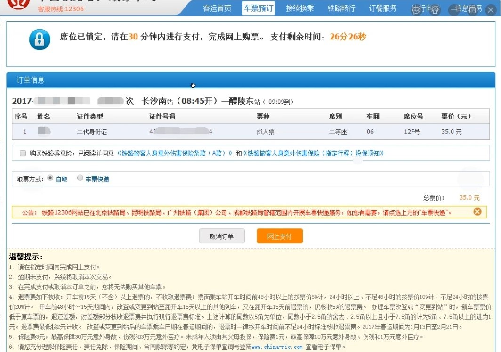
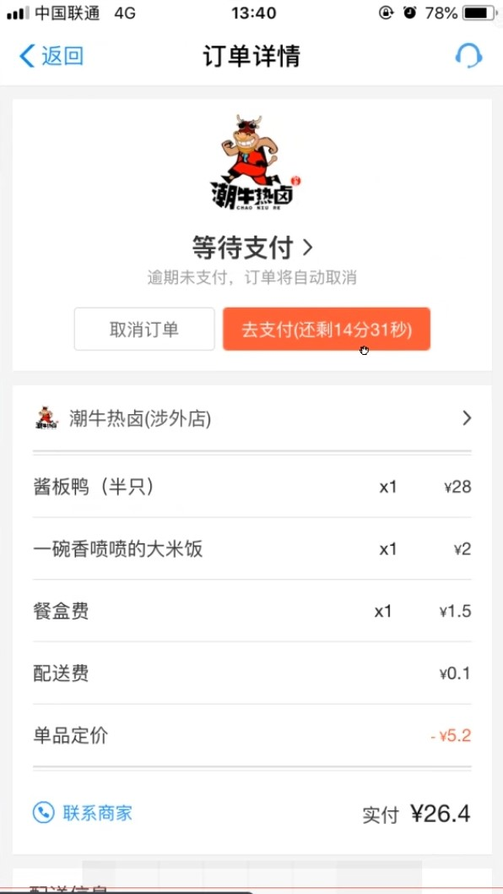
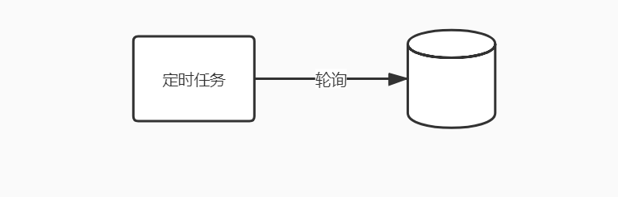
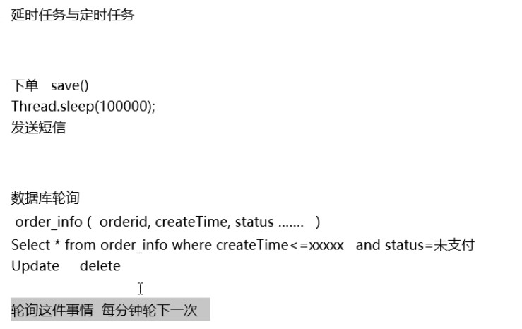
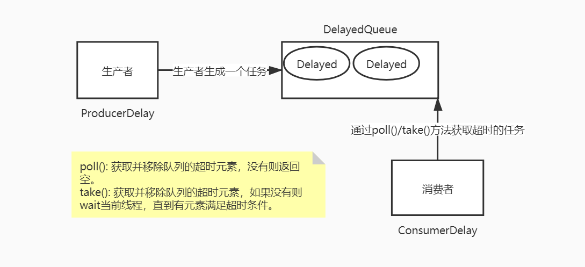
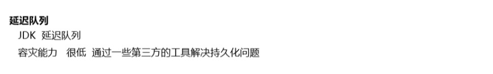
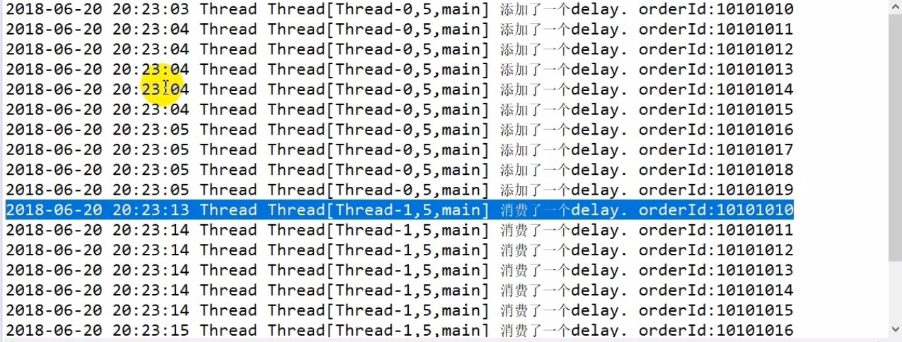
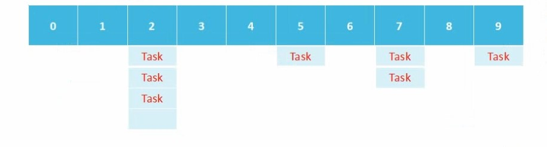

## 延迟任务场景及特点
### 延迟任务场景



## 实现方案及总结
### 实现方案一
数据库轮询: 小型项目常用方式，通过一个线程去扫描数据库或数据库定时任务，通过订单时间判断超时的订单，进行更新状态或其他操作。



### 实现方案二
JDK延迟队列: DelayQueue是一个无界阻塞队列，只有在延迟期满时才能从中获取元素，放入DelayQueue中的对象需要实现Delayed接口。


```java
public class CalendarUtils {

    /**
     * 获得当前时间second秒后的时间戳
     */
    public static long getCurrentTimeInMillis(int second) {
        Calendar cal = Calendar.getInstance();
        if (second > 0) {
            cal.add(Calendar.SECOND, second);
        }
        return cal.getTimeInMillis();
    }

    /**
     * 获得当前时间second秒后的时间戳
     */
    public static String getCurrentTimeInSecond(int second) {
        return null;
    }

}
```
```java
public class MyDelayed implements Delayed {

    // 任务超时时间戳
    private long expire = 0;
    private String orderId;

    MyDelayed(int delaySecond, String orderId) {
        // 任务超时时间戳 = 当前时间 + 延迟时间
        expire = CalendarUtils.getCurrentTimeInMillis(delaySecond);
        this.orderId = orderId;
    }

    /**
     * 需要实现的接口，获得延迟时间(过期时间 - 当前时间)
     */
    @Override
    public long getDelay(TimeUnit unit) {
        Calendar cal = Calendar.getInstance();
        return expire - cal.getTimeInMillis();
    }

    /**
     * 用于延迟队列内部比较排序(当前时间的延迟时间 - 比较对象的延迟时间)
     */
    @Override
    public int compareTo(Delayed o) {
        long d = getDelay(TimeUnit.NANOSECONDS) - o.getDelay(TimeUnit.NANOSECONDS);
        return d == 0 ? 0 : (d < 0 ? -1 : 1);
    }

    public String getOrderId() {
        return orderId;
    }
}
```
```java
public class DelayQueueDemo {

    public static void main(String[] args) {
        DelayQueue<MyDelayed> delayQueue = new DelayQueue<>();
        // 生产者生产多个10秒的延时任务
        new Thread(new ProducerDelay(delayQueue, 10)).start();
        // 开启消费者轮询
        new Thread(new ConsumerDelay(delayQueue)).start();
    }

    /**
     * 延时任务生产者
     */
    static class ProducerDelay implements Runnable {
        DelayQueue<MyDelayed> delayQueue;
        int delaySecond;
        SimpleDateFormat sdf = new SimpleDateFormat("yyyy-MM-dd HH:mm:ss");

        ProducerDelay(DelayQueue<MyDelayed> delayQueue, int delaySecond) {
            this.delayQueue = delayQueue;
            this.delaySecond = delaySecond;
        }

        @Override
        public void run() {
            String orderId = "101001";
            for (int i = 0; i < 10; i++) {
                // 定义一个Delay，放入DelayQueue队列中
                MyDelayed delay = new MyDelayed(this.delaySecond, orderId + i);
                // 向队列中插入一个元素（延时任务）
                delayQueue.add(delay);
                System.out.println(sdf.format(new Date()) + " Thread " + Thread.currentThread() + " 添加了一个delay. orderId:" + orderId + i);
                try {
                    Thread.sleep(200);
                } catch (InterruptedException e) {
                    e.printStackTrace();
                }
            }
        }
    }

    /**
     * 延时任务消费者
     */
    static class ConsumerDelay implements Runnable {
        DelayQueue<MyDelayed> delayQueue;
        SimpleDateFormat sdf = new SimpleDateFormat("yyyy-MM-dd HH:mm:ss");

        ConsumerDelay(DelayQueue<MyDelayed> delayQueue) {
            this.delayQueue = delayQueue;
        }

        @Override
        public void run() {
            // 轮询获取DelayQueue队列中当前超时的Delay元素
            while (true) {
                MyDelayed delayed = null;
                try {
                    // 获取DelayQueue队列中的超时元素(Delay)
                    delayed = delayQueue.poll();
                } catch (Exception ignored) {
                }
                // 如果Delay元素存在，则任务到达超时时间
                if (delayed != null) {
                    // 处理任务
                    System.out.println(sdf.format(new Date()) + " Thread " + Thread.currentThread() + " 消费了一个delay. orderId:" + delayed.getOrderId());
                } else {
                    try {
                        System.out.println("任务扫描中...");
                        Thread.sleep(100);
                    } catch (InterruptedException e) {
                        e.printStackTrace();
                    }
                }
            }
        }
    }

}
```


- 环形队列: 环形队列的本质是一个指定长度的数组，数组中每个位置可存放一个任务集合（Set）,集合中的元
素为任务（Task）。当扫描到数组最后一个元素时，重新从下标0开始下一轮扫描，形成环形队列。
- Task结构中有两个非常重要的属性:
1.num: 当前第几圈扫描到这个Task时，执行任务。
2.taskId: 任务执行的ID。

