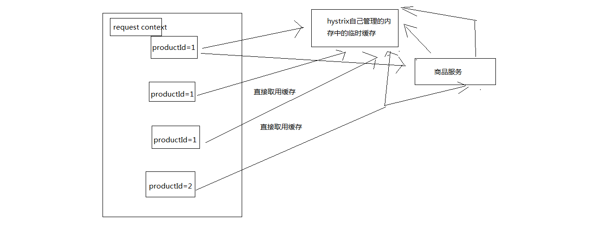

## hystrix与高可用系统架构：资源隔离+限流+熔断+降级+运维监控

前半部分，专注在高并发这一块，缓存架构，承载高并发，在各种高并发导致的令人崩溃/异常的场景下，运行着

缓存架构，高可用性，在各种系统的各个地方有乱七八糟的异常和故障的情况下，整套缓存系统还能继续健康的run着

HA，HAProxy，主备服务间的切换，这就做到了高可用性，主备实例，多冗余实例，高可用最最基础的东西

什么样的情况下，可能会导致系统的崩溃，以及系统不可用，针对各种各样的一些情况，然后我们用什么技术，去保护整个系统处于高可用的一个情况下

### 1、hystrix是什么？

netflix（国外最大的类似于，爱奇艺，优酷）视频网站，五六年前，也是，感觉自己的系统，整个网站，经常出故障，可用性不太高

有时候一些vip会员不能支付，有时候看视频就卡顿，看不了视频。。。影响公司的收入。。。

五六年前，netflix，api team，提升高可用性，开发了一个框架，类似于spring，mybatis，hibernate等等这种框架

高可用性的框架，hystrix框架，提供了高可用相关的各种各样的功能，然后确保说在hystrix的保护下，整个系统可以长期处于高可用的状态，100%，99.99999%

最理想的状况下，软件的故障，就不应该说导致整个系统的崩溃，服务器硬件的一些故障，服务的冗余

唯一有可能导致系统彻底崩溃，就是类似于之前，支付宝的那个事故，工人施工，挖断了电缆，导致几个机房都停电

不可用，和产生一些故障或者bug的区别

### 2、高可用系统架构

资源隔离、限流、熔断、降级、运维监控

资源隔离：让你的系统里，某一块东西，在故障的情况下，不会耗尽系统所有的资源，比如线程资源

我实际的项目中的一个case，有一块东西，是要用多线程做一些事情，小伙伴做项目的时候，没有太留神，资源隔离，那块代码，在遇到一些故障的情况下，每个线程在跑的时候，因为那个bug，直接就死循环了，导致那块东西启动了大量的线程，每个线程都死循环

最终导致我的系统资源耗尽，崩溃，不工作，不可用，废掉了

资源隔离，那一块代码，最多最多就是用掉10个线程，不能再多了，就废掉了，限定好的一些资源

限流：高并发的流量涌入进来，比如说突然间一秒钟100万QPS，废掉了，10万QPS进入系统，其他90万QPS被拒绝了

熔断：系统后端的一些依赖，出了一些故障，比如说mysql挂掉了，每次请求都是报错的，熔断了，后续的请求过来直接不接收了，拒绝访问，10分钟之后再尝试去看看mysql恢复没有

降级：mysql挂了，系统发现了，自动降级，从内存里存的少量数据中，去提取一些数据出来

运维监控：监控+报警+优化，各种异常的情况，有问题就及时报警，优化一些系统的配置和参数，或者代码

### 3、内容

（1）如何将eshop-cache，核心的缓存服务改造成高可用的架构
（2）eshop-cache，写代码，eshop-cache-ha，业务场景，跟之前衔接起来，重新去写代码


eshop-cache，在各级缓存数据都失效的情况下，会重新从源系统中调用接口，依赖源系统去查询mysql数据库去重新获取数据

如果你的各种依赖的服务有了故障，那么很可能会导致你的系统不可用

hystrix对系统进行各种高可用性的系统加固，来应对各种不可用的情况


缓存雪崩那一块去讲解，redis肯定挂，mysql有较大概率挂掉，在风雨飘摇中

我之前做的一个项目，我们多个项目都用了公司里公用的缓存的存储，缓存彻底挂了，雪崩了，导致各种业务系统全部崩溃，崩溃了好几个小时。导致公司损失了大量的资金的损失，其中导致公司损失最大的负责人，受到了很大的处分


## hystrix要解决的分布式系统可用性问题以及其设计原则

### 1、Hystrix是什么？

在分布式系统中，每个服务都可能会调用很多其他服务，被调用的那些服务就是依赖服务，有的时候某些依赖服务出现故障也是很正常的。

Hystrix可以让我们在分布式系统中对服务间的调用进行控制，加入一些调用延迟或者依赖故障的容错机制。

Hystrix通过将依赖服务进行资源隔离，进而组织某个依赖服务出现故障的时候，这种故障在整个系统所有的依赖服务调用中进行蔓延，同时Hystrix还提供故障时的fallback降级机制

总而言之，Hystrix通过这些方法帮助我们提升分布式系统的可用性和稳定性

### 2、Hystrix的历史

hystrix，就是一种高可用保障的一个框架，类似于spring（ioc，mvc），mybatis，activiti，lucene，框架，预先封装好的为了解决某个特定领域的特定问题的一套代码库框架，用了框架之后，来解决这个领域的特定的问题，就可以大大减少我们的工作量，提升我们的工作质量和工作效率，框架hystrix，高可用性保障的一个框架

Netflix（可以认为是国外的优酷或者爱奇艺之类的视频网站），API团队从2011年开始做一些提升系统可用性和稳定性的工作，Hystrix就是从那时候开始发展出来的。

在2012年的时候，Hystrix就变得比较成熟和稳定了，Netflix中，除了API团队以外，很多其他的团队都开始使用Hystrix。

时至今日，Netflix中每天都有数十亿次的服务间调用，通过Hystrix框架在进行，而Hystrix也帮助Netflix网站提升了整体的可用性和稳定性

### 3、初步看一看Hystrix的设计原则是什么？

hystrix为了实现高可用性的架构，设计hystrix的时候，一些设计原则是什么？？？

1. 对依赖服务调用时出现的调用延迟和调用失败进行控制和容错保护
2. 在复杂的分布式系统中，阻止某一个依赖服务的故障在整个系统中蔓延，服务A->服务B->服务C，服务C故障了，服务B也故障了，服务A故障了，整套分布式系统全部故障，整体宕机
3. 提供fail-fast（快速失败）和快速恢复的支持
4. 提供fallback优雅降级的支持
5. 支持近实时的监控、报警以及运维操作


- 调用延迟+失败，提供容错
- 阻止故障蔓延
- 快速失败+快速恢复
- 降级
- 监控+报警+运维

完全描述了hystrix的功能，提供整个分布式系统的高可用的架构


### 4、Hystrix要解决的问题是什么？

在复杂的分布式系统架构中，每个服务都有很多的依赖服务，而每个依赖服务都可能会故障

如果服务没有和自己的依赖服务进行隔离，那么可能某一个依赖服务的故障就会拖垮当前这个服务

举例来说，某个服务有30个依赖服务，每个依赖服务的可用性非常高，已经达到了99.99%的高可用性。那么该服务的可用性就是99.99%的30次方，也就是99.7%的可用性。99.7%的可用性就意味着3%的请求可能会失败，因为3%的时间内系统可能出现了故障不可用了。对于1亿次访问来说，3%的请求失败，也就意味着300万次请求会失败，也意味着每个月有2个小时的时间系统是不可用的。在真实生产环境中，可能更加糟糕

上面也就是说，即使你每个依赖服务都是99.99%高可用性，但是一旦你有几十个依赖服务，还是会导致你每个月都有几个小时是不可用的

画图分析说，当某一个依赖服务出现了调用延迟或者调用失败时，为什么会拖垮当前这个服务？以及在分布式系统中，故障是如何快速蔓延的？


### 5、再看Hystrix的更加细节的设计原则是什么？

1. 阻止任何一个依赖服务耗尽所有的资源，比如tomcat中的所有线程资源
2. 避免请求排队和积压，采用限流和fail fast来控制故障
3. 提供fallback降级机制来应对故障
4. 使用资源隔离技术，比如bulkhead（舱壁隔离技术），swimlane（泳道技术），circuit breaker（短路技术），来限制任何一个依赖服务的故障的影响
5. 通过近实时的统计/监控/报警功能，来提高故障发现的速度
6. 通过近实时的属性和配置热修改功能，来提高故障处理和恢复的速度
7. 保护依赖服务调用的所有故障情况，而不仅仅只是网络故障情况

调用这个依赖服务的时候，client调用包有bug，阻塞，等等，依赖服务的各种各样的调用的故障，都可以处理

### 6、Hystrix是如何实现它的目标的？

1. 通过HystrixCommand或者HystrixObservableCommand来封装对外部依赖的访问请求，这个访问请求一般会运行在独立的线程中，资源隔离
2. 对于超出我们设定阈值的服务调用，直接进行超时，不允许其耗费过长时间阻塞住。这个超时时间默认是99.5%的访问时间，但是一般我们可以自己设置一下
3. 为每一个依赖服务维护一个独立的线程池，或者是semaphore，当线程池已满时，直接拒绝对这个服务的调用
4. 对依赖服务的调用的成功次数，失败次数，拒绝次数，超时次数，进行统计
5. 如果对一个依赖服务的调用失败次数超过了一定的阈值，自动进行熔断，在一定时间内对该服务的调用直接降级，一段时间后再自动尝试恢复
6. 当一个服务调用出现失败，被拒绝，超时，短路等异常情况时，自动调用fallback降级机制
7. 对属性和配置的修改提供近实时的支持

画图分析，对依赖进行资源隔离后，如何避免依赖服务调用延迟或失败导致当前服务的故障


## 电商网站的商品详情页缓存服务业务背景以及框架结构说明

模拟真实业务的这么一个小型的项目，来全程贯穿，用这个项目中的业务场景去一个一个的讲解hystrix高可用的每个技术

大背景：电商网站，首页，商品详情页，搜索结果页，广告页，促销活动，购物车，订单系统，库存系统，物流系统

小背景：商品详情页，如何用最快的结果将商品数据填充到一个页面中，然后将页面显示出来

分布式系统：商品详情页，缓存服务，+底层源数据服务，商品信息服务，店铺信息服务，广告信息服务，推荐信息服务，综合起来组成一个分布式的系统

### 1、电商网站的商品详情页系统架构

1. 小型电商网站的商品详情页系统架构（不是我们要讲解的）

2. 大型电商网站的商品详情页系统架构

3. 页面模板

举个例子，将数据动态填充/渲染到一个html模板中，是什么意思呢？

```html
<html>
	<title>#{name}的页面</title>
	<body>
		商品的价格是：#{price}
		商品的介绍：#{description}
	</body>
</html>
```

上面这个就可以认为是一个页面模板，里面的很多内容是不确定的，#{name}，#{price}，#{description}，这都是一些模板脚本，不确定里面的值是什么？

将数据填充/渲染到html模板中，是什么意思呢？
```json
{
	"name": "iphone7 plus（玫瑰金+32G）",
	"price": 5599.50
	"description": "这个手机特别好用。。。。。。"
}
```
```html
<html>
	<title>iphone7 plus（玫瑰金+32G）的页面</title>
	<body>
		商品的价格是：5599.50
		商品的介绍：这个手机特别好用。。。。。。
	</body>
</html>
```
上面这个就是一份填充好数据的一个html页面

### 2、缓存服务

缓存服务，订阅一个MQ的消息变更，如果有消息变更的话，那么就会发送一个网络请求，调用一个底层的对应的源数据服务的接口，去获取变更后的数据

将获取到的变更后的数据填充到分布式的redis缓存中去

高可用这一块儿，最可能出现说可用性不高的情况，是什么呢？就是说，在接收到消息之后，可能在调用各种底层依赖服务的接口时，会遇到各种不稳定的情况

比如底层服务的接口调用超时，200ms，2s都没有返回; 底层服务的接口调用失败，比如说卡了500ms之后，返回一个报错

在分布式系统中，对于这种大量的底层依赖服务的调用，就可能会出现各种可用性的问题，一旦没有处理好的话

可能就会导致缓存服务自己本身会挂掉，或者故障掉，就会导致什么呢？不可以对外提供服务，严重情况下，甚至会导致说整个商品详情页显示不出来

缓存服务接收到变更消息后，去调用各个底层依赖服务时的高可用架构的实现

### 3、框架结构

围绕着缓存服务去拉取各种底层的源数据服务的数据，调用其接口时，可能出现的系统不可用的问题

2个服务，缓存服务，商品服务，缓存服务依赖于商品服务

模拟各种商品服务可能接口调用时出现的各种问题，导致系统不可用的场景，然后用hystrix完整的各种技术点全部贯穿在里面

解决了一大堆设计业务背景下的系统不可用问题

spring boot + http client + hystrix


## 基于spring boot快速构建缓存服务以及商品服务

### 1、pom.xml
```xml
<parent>
    <groupId>org.springframework.boot</groupId>
    <artifactId>spring-boot-starter-parent</artifactId>
    <version>1.2.5.RELEASE</version>
</parent>

<properties>
	<project.build.sourceEncoding>UTF-8</project.build.sourceEncoding>
	<java.version>1.8</java.version>
</properties>

<dependencies>
	<dependency>
        <groupId>org.springframework.boot</groupId>
        <artifactId>spring-boot-starter-web</artifactId>
    </dependency>
    <dependency>
        <groupId>org.springframework.boot</groupId>
        <artifactId>spring-boot-starter-thymeleaf</artifactId>
    </dependency>
    <dependency>
        <groupId>org.springframework.boot</groupId>
        <artifactId>spring-boot-starter-jdbc</artifactId>
    </dependency>
    <dependency>
        <groupId>org.springframework.boot</groupId>
        <artifactId>spring-boot-starter-actuator</artifactId>
    </dependency>
    <dependency>
        <groupId>org.mybatis</groupId>
        <artifactId>mybatis-spring</artifactId>
        <version>1.2.2</version>
    </dependency>
    <dependency>
        <groupId>org.mybatis</groupId>
        <artifactId>mybatis</artifactId>
        <version>3.2.8</version>
    </dependency>
    <dependency>
        <groupId>org.apache.tomcat</groupId>
        <artifactId>tomcat-jdbc</artifactId>
    </dependency>
    <dependency>
        <groupId>mysql</groupId>
        <artifactId>mysql-connector-java</artifactId>
    </dependency>
    <dependency>
        <groupId>com.alibaba</groupId>
        <artifactId>fastjson</artifactId>
        <version>1.1.43</version>
    </dependency>
</dependencies>
	
<build>
    <plugins>
        <plugin>
            <groupId>org.springframework.boot</groupId>
            <artifactId>spring-boot-maven-plugin</artifactId>
        </plugin>
    </plugins>
</build>

<repositories>
    <repository>
        <id>spring-milestone</id>
        <url>https://repo.spring.io/libs-release</url>
    </repository>
</repositories>

<pluginRepositories>
    <pluginRepository>
        <id>spring-milestone</id>
        <url>https://repo.spring.io/libs-release</url>
    </pluginRepository>
</pluginRepositories>
```

### 2、配置文件（src/main/resources）
Application.properties
```
server.port=8081
spring.datasource.url=jdbc:mysql://192.168.31.85:3306/eshop
spring.datasource.username=eshop
spring.datasource.password=eshop
spring.datasource.driver-class-name=com.mysql.jdbc.Driver
```

mybatis/UserMappper.xml

templates/hello.html

### 3、Application

```java
@EnableAutoConfiguration
@SpringBootApplication
@ComponentScan
@MapperScan("com.roncoo.eshop.cache.mapper")
public class Application {

    @Bean
    @ConfigurationProperties(prefix="spring.datasource")
    public DataSource dataSource() {
        return new org.apache.tomcat.jdbc.pool.DataSource();
    }
    
    @Bean
    public SqlSessionFactory sqlSessionFactoryBean() throws Exception {
        SqlSessionFactoryBean sqlSessionFactoryBean = new SqlSessionFactoryBean();
        sqlSessionFactoryBean.setDataSource(dataSource());
        PathMatchingResourcePatternResolver resolver = new PathMatchingResourcePatternResolver();
        sqlSessionFactoryBean.setMapperLocations(resolver.getResources("classpath:/mybatis/*.xml"));
        return sqlSessionFactoryBean.getObject();
    }
     
    @Bean
    public PlatformTransactionManager transactionManager() {
        return new DataSourceTransactionManager(dataSource());
    }
    
    public static void main(String[] args) {
        SpringApplication.run(Application.class, args);
    }

}
```

### 4、HelloController

### 5、完成两个服务的构建


## 快速完成缓存服务接收数据变更消息以及调用商品服务接口的代码编写

1、接收数据变更的消息，订阅一个MQ的topic，但是我们这里就简化一下，采取提供一个http接口

2、往http接口发送一条消息，就认为是通知缓存服务，有一个商品的数据变更了


## 商品服务接口故障导致的高并发访问耗尽缓存服务资源的场景分析

1、商品服务接口调用故障，导致缓存服务资源耗尽

2、hystrix针对一个一个的具体的业务场景，去开发高可用的架构


## 基于hystrix的线程池隔离技术进行商品服务接口的资源隔离以及限流

### 1、pom.xml
```xml
<dependency>
    <groupId>com.netflix.hystrix</groupId>
    <artifactId>hystrix-core</artifactId>
    <version>1.5.12</version>
</dependency>
```

### 2、将商品服务接口调用的逻辑进行封装

hystrix进行资源隔离，其实是提供了一个抽象，叫做command，就是说，你如果要把对某一个依赖服务的所有调用请求，全部隔离在同一份资源池内。对这个依赖服务的所有调用请求，全部走这个资源池内的资源，不会去用其他的资源了，这个就叫做资源隔离

hystrix最最基本的资源隔离的技术，线程池隔离技术

对某一个依赖服务，商品服务，所有的调用请求，全部隔离到一个线程池内，对商品服务的每次调用请求都封装在一个command里面

每个command（每次服务调用请求）都是使用线程池内的一个线程去执行的

所以哪怕是对这个依赖服务，商品服务，现在同时发起的调用量已经到了1000了，但是线程池内就10个线程，最多就只会用这10个线程去执行。不会说，对商品服务的请求，因为接口调用延迟，将tomcat内部所有的线程资源全部耗尽，不会出现了
```java
public class CommandHelloWorld extends HystrixCommand<String> {

    private final String name;
    
    public CommandHelloWorld(String name) {
        super(HystrixCommandGroupKey.Factory.asKey("ExampleGroup"));
        this.name = name;
    }
    
    @Override
    protected String run() {
        return "Hello " + name + "!";
    }

}
```

不让超出这个量的请求去执行了，保护说，不要因为某一个依赖服务的故障，导致耗尽了缓存服务中的所有的线程资源去执行

### 3、开发一个支持批量商品变更的接口

HystrixCommand：是用来获取一条数据的
HystrixObservableCommand：是设计用来获取多条数据的

```java
public class ObservableCommandHelloWorld extends HystrixObservableCommand<String> {

    private final String name;
    
    public ObservableCommandHelloWorld(String name) {
        super(HystrixCommandGroupKey.Factory.asKey("ExampleGroup"));
        this.name = name;
    }
    
    @Override
    protected Observable<String> construct() {
        return Observable.create(new Observable.OnSubscribe<String>() {
            @Override
            public void call(Subscriber<? super String> observer) {
                try {
                    if (!observer.isUnsubscribed()) {
                        observer.onNext("Hello " + name + "!");
                        observer.onNext("Hi " + name + "!");
                        observer.onCompleted();
                    }
                } catch (Exception e) {
                    observer.onError(e);
                }
            }
         } ).subscribeOn(Schedulers.io());
    }
}
```

### 4、command的四种调用方式

同步：
```java
new CommandHelloWorld("World").execute()
new ObservableCommandHelloWorld("World").toBlocking().toFuture().get()
```

如果你认为observable command只会返回一条数据，那么可以调用上面的模式，去同步执行，返回一条数据

异步：
```java
new CommandHelloWorld("World").queue()
new ObservableCommandHelloWorld("World").toBlocking().toFuture()
```

对command调用queue()，仅仅将command放入线程池的一个等待队列，就立即返回，拿到一个Future对象，后面可以做一些其他的事情，然后过一段时间对future调用get()方法获取数据  

```java
// observe()：hot，已经执行过了
Observable<String> fWorld = new CommandHelloWorld("World").observe();

assertEquals("Hello World!", fWorld.toBlocking().single());

fWorld.subscribe(new Observer<String>() {

    @Override
    public void onCompleted() {
    
    }
    
    @Override
    public void onError(Throwable e) {
        e.printStackTrace();
    }
    
    @Override
    public void onNext(String v) {
        System.out.println("onNext: " + v);
    }

});
```

```java
// toObservable(): cold，还没执行过
Observable<String> fWorld = new ObservableCommandHelloWorld("World").toObservable();

assertEquals("Hello World!", fWorld.toBlocking().single());

fWorld.subscribe(new Observer<String>() {

    @Override
    public void onCompleted() {
    
    }
    
    @Override
    public void onError(Throwable e) {
        e.printStackTrace();
    }
    
    @Override
    public void onNext(String v) {
        System.out.println("onNext: " + v);
    }

});
```

### 5、如何解决刚才的问题，画图讲解资源隔离后的效果


## 基于hystrix的信号量技术对地理位置获取逻辑进行资源隔离与限流

### 1、线程池隔离技术与信号量隔离技术的区别

hystrix里面，核心的一项功能，其实就是所谓的资源隔离，要解决的最最核心的问题，就是将多个依赖服务的调用分别隔离到各自自己的资源池内，避免说对某一个依赖服务的调用，因为依赖服务的接口调用的延迟或者失败，导致服务所有的线程资源全部耗费在这个服务的接口调用上

一旦说某个服务的线程资源全部耗尽的话，可能就导致服务就会崩溃，甚至说这种故障会不断蔓延

hystrix，资源隔离，两种技术，线程池的资源隔离，信号量的资源隔离

信号量，semaphore

信号量跟线程池，两种资源隔离的技术，区别到底在哪儿呢？


### 2、线程池隔离技术和信号量隔离技术，分别在什么样的场景下去使用呢？？

线程池：适合绝大多数的场景，99%的，线程池，对依赖服务的网络请求的调用和访问，timeout这种问题

信号量：适合，你的访问不是对外部依赖的访问，而是对内部的一些比较复杂的业务逻辑的访问，但是像这种访问，系统内部的代码，其实不涉及任何的网络请求，那么只要做信号量的普通限流就可以了，因为不需要去捕获timeout类似的问题，算法+数据结构的效率不是太高，并发量突然太高，因为这里稍微耗时一些，导致很多线程卡在这里的话，不太好，所以进行一个基本的资源隔离和访问，避免内部复杂的低效率的代码，导致大量的线程被hang住

### 3、在代码中加入从本地内存获取地理位置数据的逻辑

业务背景里面， 比较适合信号量的是什么场景呢？

比如说，我们一般来说，缓存服务，可能会将部分量特别少，访问又特别频繁的一些数据，放在自己的纯内存中

一般我们在获取到商品数据之后，都要去获取商品是属于哪个地理位置，省，市，卖家的，可能在自己的纯内存中，比如就一个Map去获取。对于这种直接访问本地内存的逻辑，比较适合用信号量做一下简单的隔离

优点在于，不用自己管理线程池拉，不用care timeout超时了，信号量做隔离的话，性能会相对来说高一些

### 4、采用信号量技术对地理位置获取逻辑进行资源隔离与限流

```java
super(Setter.withGroupKey(HystrixCommandGroupKey.Factory.asKey("ExampleGroup"))
        .andCommandPropertiesDefaults(HystrixCommandProperties.Setter()
               .withExecutionIsolationStrategy(ExecutionIsolationStrategy.SEMAPHORE)));
```


## hystrix的线程池+服务+接口划分以及资源池的容量大小控制

资源隔离，两种策略，线程池隔离，信号量隔离

对资源隔离这一块东西，做稍微更加深入一些的讲解，告诉你，除了可以选择隔离策略以外，对你选择的隔离策略，可以做一定的细粒度的一些控制

### 1、execution.isolation.strategy

指定了HystrixCommand.run()的资源隔离策略，THREAD或者SEMAPHORE，一种是基于线程池，一种是信号量

线程池机制，每个command运行在一个线程中，限流是通过线程池的大小来控制的

信号量机制，command是运行在调用线程中，但是通过信号量的容量来进行限流

如何在线程池和信号量之间做选择？

默认的策略就是线程池

线程池其实最大的好处就是对于网络访问请求，如果有超时的话，可以避免调用线程阻塞住

而使用信号量的场景，通常是针对超大并发量的场景下，每个服务实例每秒都几百的QPS，那么此时你用线程池的话，线程一般不会太多，可能撑不住那么高的并发，如果要撑住，可能要耗费大量的线程资源，那么就是用信号量，来进行限流保护

一般用信号量常见于那种基于纯内存的一些业务逻辑服务，而不涉及到任何网络访问请求

netflix有100+的command运行在40+的线程池中，只有少数command是不运行在线程池中的，就是从纯内存中获取一些元数据，或者是对多个command包装起来的facacde command，是用信号量限流的

```java
// to use thread isolation
HystrixCommandProperties.Setter()
   .withExecutionIsolationStrategy(ExecutionIsolationStrategy.THREAD)
// to use semaphore isolation
HystrixCommandProperties.Setter()
   .withExecutionIsolationStrategy(ExecutionIsolationStrategy.SEMAPHORE)
```

### 2、command名称和command组

线程池隔离，依赖服务->接口->线程池，如何来划分

你的每个command，都可以设置一个自己的名称，同时可以设置一个自己的组

```java
private static final Setter cachedSetter = 
    Setter.withGroupKey(HystrixCommandGroupKey.Factory.asKey("ExampleGroup"))
        .andCommandKey(HystrixCommandKey.Factory.asKey("HelloWorld"));    

public CommandHelloWorld(String name) {
    super(cachedSetter);
    this.name = name;
}
```

command group，是一个非常重要的概念，默认情况下，因为就是通过command group来定义一个线程池的，而且还会通过command group来聚合一些监控和报警信息

同一个command group中的请求，都会进入同一个线程池中

### 3、command线程池

threadpool key代表了一个HystrixThreadPool，用来进行统一监控，统计，缓存。默认的threadpool key就是command group名称

每个command都会跟它的threadpool key对应的thread pool绑定在一起。如果不想直接用command group，也可以手动设置thread pool name

```java
public CommandHelloWorld(String name) {
    super(Setter.withGroupKey(HystrixCommandGroupKey.Factory.asKey("ExampleGroup"))
            .andCommandKey(HystrixCommandKey.Factory.asKey("HelloWorld"))
            .andThreadPoolKey(HystrixThreadPoolKey.Factory.asKey("HelloWorldPool")));
    this.name = name;
}
```

command threadpool -> command group -> command key

command key，代表了一类command，一般来说，代表了底层的依赖服务的一个接口

command group，代表了某一个底层的依赖服务，合理，一个依赖服务可能会暴露出来多个接口，每个接口就是一个command key

command group，在逻辑上去组织起来一堆command key的调用，统计信息，成功次数，timeout超时次数，失败次数，可以看到某一个服务整体的一些访问情况

command group，一般来说，推荐是根据一个服务去划分出一个线程池，command key默认都是属于同一个线程池的

比如说你以一个服务为粒度，估算出来这个服务每秒的所有接口加起来的整体QPS在100左右

你调用那个服务的当前服务，部署了10个服务实例，每个服务实例上，其实用这个command group对应这个服务，给一个线程池，量大概在10个左右，就可以了，你对整个服务的整体的访问QPS大概在每秒100左右

一般来说，command group是用来在逻辑上组合一堆command的

举个例子，对于一个服务中的某个功能模块来说，希望将这个功能模块内的所有command放在一个group中，那么在监控和报警的时候可以放一起看

command group，对应了一个服务，但是这个服务暴露出来的几个接口，访问量很不一样，差异非常之大

你可能就希望在这个服务command group内部，包含的对应多个接口的command key，做一些细粒度的资源隔离

对同一个服务的不同接口，都使用不同的线程池

command key -> command group

command key -> 自己的threadpool key

逻辑上来说，多个command key属于一个command group，在做统计的时候，会放在一起统计

每个command key有自己的线程池，每个接口有自己的线程池，去做资源隔离和限流

但是对于thread pool资源隔离来说，可能是希望能够拆分的更加一致一些，比如在一个功能模块内，对不同的请求可以使用不同的thread pool

command group一般来说，可以是对应一个服务，多个command key对应这个服务的多个接口，多个接口的调用共享同一个线程池

如果说你的command key，要用自己的线程池，可以定义自己的threadpool key，就ok了

### 4、coreSize

设置线程池的大小，默认是10

```java
HystrixThreadPoolProperties.Setter().withCoreSize(int value)
```

一般来说，用这个默认的10个线程大小就够了

### 5、queueSizeRejectionThreshold

控制queue满后reject的threshold，因为maxQueueSize不允许热修改，因此提供这个参数可以热修改，控制队列的最大大小

HystrixCommand在提交到线程池之前，其实会先进入一个队列中，这个队列满了之后，才会reject

默认值是5

```java
HystrixThreadPoolProperties.Setter().withQueueSizeRejectionThreshold(int value)
```


### 6、execution.isolation.semaphore.maxConcurrentRequests

设置使用SEMAPHORE隔离策略的时候，允许访问的最大并发量，超过这个最大并发量，请求直接被reject

这个并发量的设置，跟线程池大小的设置，应该是类似的，但是基于信号量的话，性能会好很多，而且hystrix框架本身的开销会小很多

默认值是10，设置的小一些，否则因为信号量是基于调用线程去执行command的，而且不能从timeout中抽离，因此一旦设置的太大，而且有延时发生，可能瞬间导致tomcat本身的线程资源本占满

```java
HystrixCommandProperties.Setter().withExecutionIsolationSemaphoreMaxConcurrentRequests(int value)
```


## 深入分析hystrix执行时的8大流程步骤以及内部原理

画图分析整个8大步骤的流程，然后再对每个步骤进行细致的讲解


### 1、构建一个HystrixCommand或者HystrixObservableCommand

一个HystrixCommand或一个HystrixObservableCommand对象，代表了对某个依赖服务发起的一次请求或者调用

构造的时候，可以在构造函数中传入任何需要的参数

HystrixCommand主要用于仅仅会返回一个结果的调用
HystrixObservableCommand主要用于可能会返回多条结果的调用

HystrixCommand command = new HystrixCommand(arg1, arg2);
HystrixObservableCommand command = new HystrixObservableCommand(arg1, arg2);

### 2、调用command的执行方法

执行Command就可以发起一次对依赖服务的调用

要执行Command，需要在4个方法中选择其中的一个：execute()，queue()，observe()，toObservable()

其中execute()和queue()仅仅对HystrixCommand适用

execute()：调用后直接block住，属于同步调用，直到依赖服务返回单条结果，或者抛出异常
queue()：返回一个Future，属于异步调用，后面可以通过Future获取单条结果
observe()：订阅一个Observable对象，Observable代表的是依赖服务返回的结果，获取到一个那个代表结果的Observable对象的拷贝对象
toObservable()：返回一个Observable对象，如果我们订阅这个对象，就会执行command并且获取返回结果

```java
K             value   = command.execute();
Future<K>     fValue  = command.queue();
Observable<K> ohValue = command.observe();         
Observable<K> ocValue = command.toObservable();    
```

execute()实际上会调用queue().get().queue()，接着会调用toObservable().toBlocking().toFuture()

也就是说，无论是哪种执行command的方式，最终都是依赖toObservable()去执行的

### 3、检查是否开启缓存

从这一步开始，进入我们的底层的运行原理啦，了解hysrix的一些更加高级的功能和特性

如果这个command开启了请求缓存，request cache，而且这个调用的结果在缓存中存在，那么直接从缓存中返回结果

### 4、检查是否开启了短路器

检查这个command对应的依赖服务是否开启了短路器

如果断路器被打开了，那么hystrix就不会执行这个command，而是直接去执行fallback降级机制

### 5、检查线程池/队列/semaphore是否已经满了

如果command对应的线程池/队列/semaphore已经满了，那么也不会执行command，而是直接去调用fallback降级机制

### 6、执行command

调用HystrixObservableCommand.construct()或HystrixCommand.run()来实际执行这个command

HystrixCommand.run()是返回一个单条结果，或者抛出一个异常
HystrixObservableCommand.construct()是返回一个Observable对象，可以获取多条结果

如果HystrixCommand.run()或HystrixObservableCommand.construct()的执行，超过了timeout时长的话，那么command所在的线程就会抛出一个TimeoutException

如果timeout了，也会去执行fallback降级机制，而且就不会管run()或construct()返回的值了

这里要注意的一点是，我们是不可能终止掉一个调用严重延迟的依赖服务的线程的，只能说给你抛出来一个TimeoutException，但是还是可能会因为严重延迟的调用线程占满整个线程池的

即使这个时候新来的流量都被限流了。。。

如果没有timeout的话，那么就会拿到一些调用依赖服务获取到的结果，然后hystrix会做一些logging记录和metric统计

### 7、短路健康检查

Hystrix会将每一个依赖服务的调用成功，失败，拒绝，超时，等事件，都会发送给circuit breaker断路器

短路器就会对调用成功/失败/拒绝/超时等事件的次数进行统计

短路器会根据这些统计次数来决定，是否要进行短路，如果打开了短路器，那么在一段时间内就会直接短路，然后如果在之后第一次检查发现调用成功了，就关闭断路器

### 8、调用fallback降级机制

在以下几种情况中，hystrix会调用fallback降级机制：run()或construct()抛出一个异常，短路器打开，线程池/队列/semaphore满了，command执行超时了

一般在降级机制中，都建议给出一些默认的返回值，比如静态的一些代码逻辑，或者从内存中的缓存中提取一些数据，尽量在这里不要再进行网络请求了

即使在降级中，一定要进行网络调用，也应该将那个调用放在一个HystrixCommand中，进行隔离

在HystrixCommand中，上线getFallback()方法，可以提供降级机制

在HystirxObservableCommand中，实现一个resumeWithFallback()方法，返回一个Observable对象，可以提供降级结果

如果fallback返回了结果，那么hystrix就会返回这个结果

对于HystrixCommand，会返回一个Observable对象，其中会发返回对应的结果
对于HystrixObservableCommand，会返回一个原始的Observable对象

如果没有实现fallback，或者是fallback抛出了异常，Hystrix会返回一个Observable，但是不会返回任何数据

不同的command执行方式，其fallback为空或者异常时的返回结果不同

对于execute()，直接抛出异常
对于queue()，返回一个Future，调用get()时抛出异常
对于observe()，返回一个Observable对象，但是调用subscribe()方法订阅它时，理解抛出调用者的onError方法
对于toObservable()，返回一个Observable对象，但是调用subscribe()方法订阅它时，理解抛出调用者的onError方法

### 9、不同的执行方式

execute()，获取一个Future.get()，然后拿到单个结果
queue()，返回一个Future
observer()，立即订阅Observable，然后启动8大执行步骤，返回一个拷贝的Observable，订阅时理解回调给你结果
toObservable()，返回一个原始的Observable，必须手动订阅才会去执行8大步骤


## 基于request cache请求缓存技术优化批量商品数据查询接口

1、创建command，2种command类型
2、执行command，4种执行方式
3、查找是否开启了request cache，是否有请求缓存，如果有缓存，直接取用缓存，返回结果

首先，有一个概念，叫做reqeust context，请求上下文，一般来说，在一个web应用中，hystrix

我们会在一个filter里面，对每一个请求都施加一个请求上下文，就是说，tomcat容器内，每一次请求，就是一次请求上下文。然后在这次请求上下文中，我们会去执行N多代码，调用N多依赖服务，有的依赖服务可能还会调用好几次

在一次请求上下文中，如果有多个command，参数都是一样的，调用的接口也是一样的，其实结果可以认为也是一样的。那么这个时候，我们就可以让第一次command执行，返回的结果，被缓存在内存中，然后这个请求上下文中，后续的其他对这个依赖的调用全部从内存中取用缓存结果就可以了。不用在一次请求上下文中反复多次的执行一样的command，提升整个请求的性能


HystrixCommand和HystrixObservableCommand都可以指定一个缓存key，然后hystrix会自动进行缓存，接着在同一个request context内，再次访问的时候，就会直接取用缓存

用请求缓存，可以避免重复执行网络请求。多次调用一个command，那么只会执行一次，后面都是直接取缓存

对于请求缓存（request caching），请求合并（request collapsing），请求日志（request log），等等技术，都必须自己管理HystrixReuqestContext的声明周期

在一个请求执行之前，都必须先初始化一个request context

```java
HystrixRequestContext context = HystrixRequestContext.initializeContext();
```

然后在请求结束之后，需要关闭request context

```java
context.shutdown();
```

一般来说，在java web来的应用中，都是通过filter过滤器来实现的

```java
public class HystrixRequestContextServletFilter implements Filter {

    public void doFilter(ServletRequest request, ServletResponse response, FilterChain chain) 
     throws IOException, ServletException {
        HystrixRequestContext context = HystrixRequestContext.initializeContext();
        try {
            chain.doFilter(request, response);
        } finally {
            context.shutdown();
        }
    }

}
```

```java
@Bean
public FilterRegistrationBean indexFilterRegistration() {
    FilterRegistrationBean registration = new FilterRegistrationBean(new IndexFilter());
    registration.addUrlPatterns("/");
    return registration;
}
```

结合咱们的业务背景，我们做了一个批量查询商品数据的接口，在这个里面，我们其实通过HystrixObservableCommand一次性批量查询多个商品id的数据

但是这里有个问题，如果说nginx在本地缓存失效了，重新获取一批缓存，传递过来的productId都没有进行去重，1,1,2,2,5,6,7

那么可能说，商品id出现了重复，如果按照我们之前的业务逻辑，可能就会重复对productId=1的商品查询两次，productId=2的商品查询两次

我们对批量查询商品数据的接口，可以用request cache做一个优化，就是说一次请求，就是一次request context，对相同的商品查询只能执行一次，其余的都走request cache



```java
public class CommandUsingRequestCache extends HystrixCommand<Boolean> {

    private final int value;
    
    protected CommandUsingRequestCache(int value) {
        super(HystrixCommandGroupKey.Factory.asKey("ExampleGroup"));
        this.value = value;
    }
    
    @Override
    protected Boolean run() {
        return value == 0 || value % 2 == 0;
    }
    
    @Override
    protected String getCacheKey() {
        return String.valueOf(value);
    }

}
```

```java
@Test
public void testWithCacheHits() {
    HystrixRequestContext context = HystrixRequestContext.initializeContext();
    try {
        CommandUsingRequestCache command2a = new CommandUsingRequestCache(2);
        CommandUsingRequestCache command2b = new CommandUsingRequestCache(2);

        assertTrue(command2a.execute());
        // this is the first time we've executed this command with
        // the value of "2" so it should not be from cache
        assertFalse(command2a.isResponseFromCache());
    
        assertTrue(command2b.execute());
        // this is the second time we've executed this command with
        // the same value so it should return from cache
        assertTrue(command2b.isResponseFromCache());
    } finally {
        context.shutdown();
    }
    
    // start a new request context
    context = HystrixRequestContext.initializeContext();
    try {
        CommandUsingRequestCache command3b = new CommandUsingRequestCache(2);
        assertTrue(command3b.execute());
        // this is a new request context so this 
        // should not come from cache
        assertFalse(command3b.isResponseFromCache());
    } finally {
        context.shutdown();
    }

}
```

缓存的手动清理

```java
public static class GetterCommand extends HystrixCommand<String> {

    private static final HystrixCommandKey GETTER_KEY = HystrixCommandKey.Factory.asKey("GetterCommand");
    private final int id;
    
    public GetterCommand(int id) {
        super(Setter.withGroupKey(HystrixCommandGroupKey.Factory.asKey("GetSetGet"))
                .andCommandKey(GETTER_KEY));
        this.id = id;
    }
    
    @Override
    protected String run() {
        return prefixStoredOnRemoteDataStore + id;
    }
    
    @Override
    protected String getCacheKey() {
        return String.valueOf(id);
    }
    
    /**
     * Allow the cache to be flushed for this object.
     * 
     * @param id
     *            argument that would normally be passed to the command
     */
    public static void flushCache(int id) {
        HystrixRequestCache.getInstance(GETTER_KEY,
                HystrixConcurrencyStrategyDefault.getInstance()).clear(String.valueOf(id));
    }

}
```

```java
public static class SetterCommand extends HystrixCommand<Void> {

    private final int id;
    private final String prefix;
    
    public SetterCommand(int id, String prefix) {
        super(HystrixCommandGroupKey.Factory.asKey("GetSetGet"));
        this.id = id;
        this.prefix = prefix;
    }
    
    @Override
    protected Void run() {
        // persist the value against the datastore
        prefixStoredOnRemoteDataStore = prefix;
        // flush the cache
        GetterCommand.flushCache(id);
        // no return value
        return null;
    }
}
```


## 开发品牌名称获取接口的基于本地缓存的fallback降级机制

1、创建command
2、执行command
3、request cache
4、短路器，如果打开了，fallback降级机制

### 1、fallback降级机制

- hystrix调用各种接口，或者访问外部依赖，mysql，redis，zookeeper，kafka，等等，如果出现了任何异常的情况。比如说报错了，访问mysql报错，redis报错，zookeeper报错，kafka报错，error

- 对每个外部依赖，无论是服务接口，中间件，资源隔离，对外部依赖只能用一定量的资源去访问，线程池/信号量，如果资源池已满，reject

- 访问外部依赖的时候，访问时间过长，可能就会导致超时，报一个TimeoutException异常，timeout

上述三种情况，都是我们说的异常情况

- 对外部依赖的东西访问的时候出现了异常，发送异常事件到短路器中去进行统计。如果短路器发现异常事件的占比达到了一定的比例，直接开启短路，circuit breaker

上述四种情况，都会去调用fallback降级机制

fallback，降级机制，你之前都是必须去调用外部的依赖接口，或者从mysql中去查询数据的，但是为了避免说可能外部依赖会有故障

比如，你可以再内存中维护一个ehcache，作为一个纯内存的基于LRU自动清理的缓存，数据也可以放入缓存内

如果说外部依赖有异常，fallback这里，直接尝试从ehcache中获取数据

比如说，本来你是从mysql，redis，或者其他任何地方去获取数据的，获取调用其他服务的接口的，结果人家故障了，人家挂了，fallback，可以返回一个默认值

两种最经典的降级机制：纯内存数据，默认值

run()抛出异常，超时，线程池或信号量满了，或短路了，都会调用fallback机制

给大家举个例子，比如说我们现在有个商品数据，brandId，品牌，一般来说，假设，正常的逻辑，拿到了一个商品数据以后，用brandId再调用一次请求，到其他的服务去获取品牌的最新名称

假如说，那个品牌服务挂掉了，那么我们可以尝试本地内存中，会保留一份时间比较过期的一份品牌数据，有些品牌没有，有些品牌的名称过期了，Nike++，Nike

调用品牌服务失败了，fallback降级就从本地内存中获取一份过期的数据，先凑合着用着

```java
public class CommandHelloFailure extends HystrixCommand<String> {

    private final String name;
    
    public CommandHelloFailure(String name) {
        super(HystrixCommandGroupKey.Factory.asKey("ExampleGroup"));
        this.name = name;
    }
    
    @Override
    protected String run() {
        throw new RuntimeException("this command always fails");
    }
    
    @Override
    protected String getFallback() {
        return "Hello Failure " + name + "!";
    }

}
```

```java
@Test
public void testSynchronous() {
    assertEquals("Hello Failure World!", new CommandHelloFailure("World").execute());
}
```

HystrixObservableCommand，是实现resumeWithFallback方法

### 2、fallback.isolation.semaphore.maxConcurrentRequests

这个参数设置了HystrixCommand.getFallback()最大允许的并发请求数量，默认值是10，也是通过semaphore信号量的机制去限流

如果超出了这个最大值，那么直接被reject

```java
HystrixCommandProperties.Setter()
   .withFallbackIsolationSemaphoreMaxConcurrentRequests(int value)
```


## 深入理解hystrix的短路器原理以及接口异常时的熔断实验

短路器深入的工作原理

#### 1、如果经过短路器的流量超过了一定的阈值，HystrixCommandProperties.circuitBreakerRequestVolumeThreshold()

举个例子，可能看起来是这样子的，要求在10s内，经过短路器的流量必须达到20个；在10s内，经过短路器的流量才10个，那么根本不会去判断要不要短路

#### 2、如果断路器统计到的异常调用的占比超过了一定的阈值，HystrixCommandProperties.circuitBreakerErrorThresholdPercentage()

如果达到了上面的要求，比如说在10s内，经过短路器的流量（你，只要执行一个command，这个请求就一定会经过短路器），达到了30个；同时其中异常的访问数量，占到了一定的比例，比如说60%的请求都是异常（报错，timeout，reject），会开启短路

#### 3、然后断路器从close状态转换到open状态

#### 4、断路器打开的时候，所有经过该断路器的请求全部被短路，不调用后端服务，直接走fallback降级

#### 5、经过了一段时间之后，HystrixCommandProperties.circuitBreakerSleepWindowInMilliseconds()，会half-open，让一条请求经过短路器，看能不能正常调用。如果调用成功了，那么就自动恢复，转到close状态

短路器，会自动恢复的，half-open，半开状态

#### 6、circuit breaker短路器的配置

（1）circuitBreaker.enabled

控制短路器是否允许工作，包括跟踪依赖服务调用的健康状况，以及对异常情况过多时是否允许触发短路，默认是true

HystrixCommandProperties.Setter()
   .withCircuitBreakerEnabled(boolean value)

（2）circuitBreaker.requestVolumeThreshold

设置一个rolling window，滑动窗口中，最少要有多少个请求时，才触发开启短路

举例来说，如果设置为20（默认值），那么在一个10秒的滑动窗口内，如果只有19个请求，即使这19个请求都是异常的，也是不会触发开启短路器的

HystrixCommandProperties.Setter()
   .withCircuitBreakerRequestVolumeThreshold(int value)

（3）circuitBreaker.sleepWindowInMilliseconds

设置在短路之后，需要在多长时间内直接reject请求，然后在这段时间之后，再重新导holf-open状态，尝试允许请求通过以及自动恢复，默认值是5000毫秒

HystrixCommandProperties.Setter()
   .withCircuitBreakerSleepWindowInMilliseconds(int value)

（4）circuitBreaker.errorThresholdPercentage

设置异常请求量的百分比，当异常请求达到这个百分比时，就触发打开短路器，默认是50，也就是50%

HystrixCommandProperties.Setter()
   .withCircuitBreakerErrorThresholdPercentage(int value)

（5）circuitBreaker.forceOpen

如果设置为true的话，直接强迫打开短路器，相当于是手动短路了，手动降级，默认false

HystrixCommandProperties.Setter()
   .withCircuitBreakerForceOpen(boolean value)

（6）circuitBreaker.forceClosed

如果设置为ture的话，直接强迫关闭短路器，相当于是手动停止短路了，手动升级，默认false

HystrixCommandProperties.Setter()
   .withCircuitBreakerForceClosed(boolean value)

#### 7、实战演练

配置一个断路器，流量要求是20，异常比例是50%，短路时间是5s

在command内加入一个判断，如果是productId=-1，那么就直接报错，触发异常执行

写一个client测试程序，写入50个请求，前20个是正常的，但是后30个是productId=-1，然后继续请求，会发现


## 深入理解线程池隔离技术的设计原则以及动手实战接口限流实验

1、command的创建和执行：资源隔离
2、request cache：请求缓存
3、fallback：优雅降级
4、circuit breaker：短路器，快速熔断（一旦后端服务故障，立刻熔断，阻止对其的访问）

把一个分布式系统中的某一个服务，打造成一个高可用的服务。资源隔离，优雅降级，熔断

5、判断，线程池或者信号量的容量是否已满，reject，限流

限流，限制对后端的服务的访问量，比如说你对mysql，redis，zookeeper，各种后端的中间件的资源，访问，其实为了避免过大的流浪打死后端的服务，线程池，信号量，限流

限制服务对后端的资源的访问

### 1、线程池隔离技术的设计原则

Hystrix采取了bulkhead舱壁隔离技术，来将外部依赖进行资源隔离，进而避免任何外部依赖的故障导致本服务崩溃

线程池隔离，学术名称：bulkhead，舱壁隔离

外部依赖的调用在单独的线程中执行，这样就能跟调用线程隔离开来，避免外部依赖调用timeout耗时过长，导致调用线程被卡死

Hystrix对每个外部依赖用一个单独的线程池，这样的话，如果对那个外部依赖调用延迟很严重，最多就是耗尽那个依赖自己的线程池而已，不会影响其他的依赖调用

Hystrix选择用线程池机制来进行资源隔离，要面对的场景如下：

（1）每个服务都会调用几十个后端依赖服务，那些后端依赖服务通常是由很多不同的团队开发的
（2）每个后端依赖服务都会提供它自己的client调用库，比如说用thrift的话，就会提供对应的thrift依赖
（3）client调用库随时会变更
（4）client调用库随时可能会增加新的网络请求的逻辑
（5）client调用库可能会包含诸如自动重试，数据解析，内存中缓存等逻辑
（6）client调用库一般都对调用者来说是个黑盒，包括实现细节，网络访问，默认配置，等等
（7）在真实的生产环境中，经常会出现调用者，突然间惊讶的发现，client调用库发生了某些变化
（8）即使client调用库没有改变，依赖服务本身可能有会发生逻辑上的变化
（9）有些依赖的client调用库可能还会拉取其他的依赖库，而且可能那些依赖库配置的不正确
（10）大多数网络请求都是同步调用的
（11）调用失败和延迟，也有可能会发生在client调用库本身的代码中，不一定就是发生在网络请求中

简单来说，就是你必须默认client调用库就很不靠谱，而且随时可能各种变化，所以就要用强制隔离的方式来确保任何服务的故障不能影响当前服务

我不知道在学习这个课程的学员里，有多少人，真正参与过一些复杂的分布式系统的开发，不是说一个team，你们五六个人，七八个人，去做的

在一些大公司里，做一些复杂的项目的话，广告计费系统，特别复杂，可能涉及多个团队，总共三四十个人，五六十个人，一起去开发一个系统，每个团队负责一块儿

每个团队里的每个人，负责一个服务，或者几个服务，比较常见的大公司的复杂分布式系统项目的分工合作的一个流程

线程池机制的优点如下：

（1）任何一个依赖服务都可以被隔离在自己的线程池内，即使自己的线程池资源填满了，也不会影响任何其他的服务调用
（2）服务可以随时引入一个新的依赖服务，因为即使这个新的依赖服务有问题，也不会影响其他任何服务的调用
（3）当一个故障的依赖服务重新变好的时候，可以通过清理掉线程池，瞬间恢复该服务的调用，而如果是tomcat线程池被占满，再恢复就很麻烦
（4）如果一个client调用库配置有问题，线程池的健康状况随时会报告，比如成功/失败/拒绝/超时的次数统计，然后可以近实时热修改依赖服务的调用配置，而不用停机
（5）如果一个服务本身发生了修改，需要重新调整配置，此时线程池的健康状况也可以随时发现，比如成功/失败/拒绝/超时的次数统计，然后可以近实时热修改依赖服务的调用配置，而不用停机
（6）基于线程池的异步本质，可以在同步的调用之上，构建一层异步调用层

简单来说，最大的好处，就是资源隔离，确保说，任何一个依赖服务故障，不会拖垮当前的这个服务

线程池机制的缺点：

（1）线程池机制最大的缺点就是增加了cpu的开销

除了tomcat本身的调用线程之外，还有hystrix自己管理的线程池

（2）每个command的执行都依托一个独立的线程，会进行排队，调度，还有上下文切换
（3）Hystrix官方自己做了一个多线程异步带来的额外开销，通过对比多线程异步调用+同步调用得出，Netflix API每天通过hystrix执行10亿次调用，每个服务实例有40个以上的线程池，每个线程池有10个左右的线程
（4）最后发现说，用hystrix的额外开销，就是给请求带来了3ms左右的延时，最多延时在10ms以内，相比于可用性和稳定性的提升，这是可以接受的


我们可以用hystrix semaphore技术来实现对某个依赖服务的并发访问量的限制，而不是通过线程池/队列的大小来限制流量

sempahore技术可以用来限流和削峰，但是不能用来对调研延迟的服务进行timeout和隔离

execution.isolation.strategy，设置为SEMAPHORE，那么hystrix就会用semaphore机制来替代线程池机制，来对依赖服务的访问进行限流

如果通过semaphore调用的时候，底层的网络调用延迟很严重，那么是无法timeout的，只能一直block住

一旦请求数量超过了semephore限定的数量之后，就会立即开启限流

### 2、接口限流实验

假设，一个线程池，大小是15个，队列大小是10个，timeout时长设置的长一些，5s

模拟发送请求，然后写死代码，在command内部做一个sleep，比如每次sleep 1s，10个请求发送过去以后，直接被hang死，线程池占满

再发送请求，就会堵塞在缓冲队列，queue，10个，20个，10个，后10个应该就直接reject，fallback逻辑

15 + 10 = 25个请求，15在执行，10个缓冲在队列里了，剩下的流量全部被reject，限流，降级

withCoreSize：设置你的线程池的大小
withMaxQueueSize：设置的是你的等待队列，缓冲队列的大小
withQueueSizeRejectionThreshold：如果withMaxQueueSize<withQueueSizeRejectionThreshold，那么取的是withMaxQueueSize，反之，取得是withQueueSizeRejectionThreshold

线程池本身的大小，如果你不设置另外两个queue相关的参数，等待队列是关闭的

queue大小，等待队列的大小，timeout时长

先进去线程池的是10个请求，然后有8个请求进入等待队列，线程池里有空闲，等待队列中的请求如果还没有timeout，那么就进去线程池去执行

10 + 8 = 18个请求之外，7个请求，直接会被reject掉，限流，fallback

withExecutionTimeoutInMilliseconds(20000)：timeout也设置大一些，否则如果请求放等待队列中时间太长了，直接就会timeout，等不到去线程池里执行了
withFallbackIsolationSemaphoreMaxConcurrentRequests(30)：fallback，sempahore限流，30个，避免太多的请求同时调用fallback被拒绝访问


## 基于timeout机制来为商品服务接口的调用超时提供安全保护

一般来说，在调用依赖服务的接口的时候，比较常见的一个问题，就是超时

超时是在一个复杂的分布式系统中，导致不稳定，或者系统抖动，或者出现说大量超时，线程资源hang死，吞吐量大幅度下降，甚至服务崩溃

超时最大的一个问题

你去调用各种各样的依赖服务，特别是在大公司，你甚至都不认识开发一个服务的人，你都不知道那个人的水平怎么样，不了解。比尔盖茨说过一句话，在互联网的另外一头，你都不知道甚至坐着一条狗

分布式系统，大公司，多个团队，大型协作，服务是谁的，不了解，很可能说那个哥儿们，实习生都有可能

在一个复杂的系统里，可能你的依赖接口的性能很不稳定，有时候2ms，200ms，2s。如果你不对各种依赖接口的调用，做超时的控制，来给你的服务提供安全保护措施，那么很可能你的服务就被各种垃圾的依赖服务的性能给拖死了

大量的接口调用很慢，大量线程就卡死了，资源隔离，线程池的线程卡死了，超时的控制

（1）execution.isolation.thread.timeoutInMilliseconds

手动设置timeout时长，一个command运行超出这个时间，就被认为是timeout，然后将hystrix command标识为timeout，同时执行fallback降级逻辑。默认是1000，也就是1000毫秒

```java
HystrixCommandProperties.Setter()
   .withExecutionTimeoutInMilliseconds(int value)
```

（2）execution.timeout.enabled

控制是否要打开timeout机制，默认是true

```java
HystrixCommandProperties.Setter()
   .withExecutionTimeoutEnabled(boolean value)
```

让一个command执行timeout，然后看是否会调用fallback降级


## 基于hystrix的高可用分布式系统架构项目实战课程的总结

hystrix的核心知识

1、hystrix内部工作原理：8大执行步骤和流程
2、资源隔离：你如果有很多个依赖服务，高可用性，先做资源隔离，任何一个依赖服务的故障不会导致你的服务的资源耗尽，不会崩溃
3、请求缓存：对于一个request context内的多个相同command，使用request cache，提升性能
4、熔断：基于短路器，采集各种异常事件，报错，超时，reject，短路，熔断，一定时间范围内就不允许访问了，直接降级，自动恢复的机制
5、降级：报错，超时，reject，熔断，降级，服务提供容错的机制
6、限流：在你的服务里面，通过线程池，或者信号量，限制对某个后端的服务或资源的访问量，避免从你的服务这里过去太多的流量，打死某个资源
7、超时：避免某个依赖服务性能过差，导致大量的线程hang住去调用那个服务，会导致你的服务本身性能也比较差


## 基于request collapser请求合并技术进一步优化批量查询

hystrix，高级的技术，request collapser，请求合并技术，collapser折叠

优化过一个批量查询的接口了，request cache来做优化，可能有相同的商品就可以直接取用缓存了

多个商品，需要发送多次网络请求，调用多次接口，才能拿到结果。可以使用HystrixCollapser将多个HystrixCommand合并到一起，多个command放在一个command里面去执行，发送一次网络请求，就拉取到多条数据

用请求合并技术，将多个请求合并起来，可以减少高并发访问下需要使用的线程数量以及网络连接数量，这都是hystrix自动进行的。其实对于高并发的访问来说，是可以提升性能的

请求合并有很多种级别

（1）global context，tomcat所有调用线程，对一个依赖服务的任何一个command调用都可以被合并在一起，hystrix就传递一个HystrixRequestContext

（2）user request context，tomcat内某一个调用线程，将某一个tomcat线程对某个依赖服务的多个command调用合并在一起

（3）object modeling，基于对象的请求合并，如果有几百个对象，遍历后依次调用每个对象的某个方法，可能导致发起几百次网络请求，基于hystrix可以自动将对多个对象模型的调用合并到一起

请求合并技术的开销有多大

使用请求合并技术的开销就是导致延迟大幅度增加，因为需要一定的时间将多个请求合并起来

发送过来10个请求，每个请求本来大概是2ms可以返回，要把10个请求合并在一个command内，统一一起执行，先后等待一下，5ms

所以说，要考量一下，使用请求合并技术是否合适，如果一个请求本来耗费的时间就比较长，那么进行请求合并，增加一些延迟影响并不大


请求合并技术，不是针对那种访问延时特别低的请求的，比如说你的访问延时本身就比较高，20ms，10个请求合并在一起，25ms，这种情况下就还好

好处在哪里，大幅度削减你的线程池的资源耗费，线程池，10个线程，一秒钟可以执行10个请求，合并在一起，1个线程执行10个请求，10个线程就可以执行100个请求

增加你的吞吐量

减少你对后端服务访问时的网络资源的开销，10个请求，10个command，10次网络请求的开销，1次网络请求的开销了


每个请求就2ms，batch，8~10ms，延迟增加了4~5倍

每个请求本来就30ms~50ms，batch，35ms~55ms，延迟增加不太明显


将多个command请求合并到一个command中执行

请求合并时，可以设置一个batch size，以及elapsed time（控制什么时候触发合并后的command执行）

有两种合并模式，一种是request scope，另一种是global scope，默认是rquest scope，在collapser构造的时候指定scope模式

request scope的batch收集是建立在一个request context内的，而global scope的batch收集是横跨多个request context的

所以对于global context来说，必须确保能在一个command内处理多个requeset context的请求

在netflix，是只用request scope请求合并的，因为默认是用唯一一个request context包含所有的command，所以要做合并，肯定就是request scope

一般请求合并技术，对于那种访问同一个资源的command，但是参数不同，是很有效的


批量查询，HystrixObservableCommand，HystrixCommand+request cache，都是每个商品发起一次网络请求

一个批量的商品过来以后，我们还是多个command的方式去执行，request collapser+request cache，相同的商品还是就查询一次，不同的商品合并到一起通过一个网络请求得到结果


timeout问题解释：开发机上，特别慢，第一次请求的时候，几百毫秒，默认的timeout时长比较短

第二次的时候，访问的速度会快很多，就不会超时了

反应在系统上，第一次启动的时候，会有个别的超时，但是后面就好了，手动将timeout时长设置的大一些


（1）maxRequestsInBatch

控制一个Batch中最多允许多少个request被合并，然后才会触发一个batch的执行

默认值是无限大，就是不依靠这个数量来触发执行，而是依靠时间

```java
HystrixCollapserProperties.Setter()
   .withMaxRequestsInBatch(int value)
```

（2）timerDelayInMilliseconds

控制一个batch创建之后，多长时间以后就自动触发batch的执行，默认是10毫秒

```java
HystrixCollapserProperties.Setter()
   .withTimerDelayInMilliseconds(int value)
```

```java
super(Setter.withCollapserKey(HystrixCollapserKey.Factory.asKey("GetProductInfosCollapser"))
				.andCollapserPropertiesDefaults(HystrixCollapserProperties.Setter()
						   .withMaxRequestsInBatch(100)
						   .withTimerDelayInMilliseconds(20))); 
```


## hystirx的fail-fast与fail-silient两种最基础的容错模式

fail-fast，就是不给fallback降级逻辑，HystrixCommand.run()，直接报错，直接会把这个报错抛出来，给你的tomcat调用线程

fail-silent，给一个fallback降级逻辑，如果HystrixCommand.run()，报错了，会走fallback降级，直接返回一个空值，HystrixCommand，就给一个null

HystrixObservableCommand，Observable.empty()

很少会用fail-fast模式，比较常用的可能还是fail-silent，特别常用，既然都到了fallback里面，肯定要做点降级的事情


## 为商品服务接口调用增加stubbed fallback降级机制

stubbed fallback，残缺的降级

用请求中的部分数据拼装成结果，然后再填充一些默认值，返回

比如说你发起了一个请求，然后请求中可能本身就附带了一些信息，如果主请求失败了，走到降级逻辑。在降级逻辑里面，可以将这个请求中的数据，以及部分本地缓存有的数据拼装在一起，再给数据填充一些简单的默认值。然后尽可能将自己有的数据返回到请求方

stubbed，残缺了，比如说应该查询到一个商品信息，里面包含20个字段。请求参数搂出来一两个字段，从本地的少量缓存中比如说，可以搂出来那么两三个字段，最终的话返回的字段可能就五六个，其他的字段都是填充的默认值

在你自己的项目里去用的话，你就必须结合你自己的业务场景，去思考，stubbed fallback，从请求参数里尽可能提取一些数据，请求参数多给一些。你要考虑到可以将哪些量比较少的数据保存在内存中，提取部分数据。默认的值怎么设置，看起来能稍微靠谱一些


## 基于双层嵌套command开发商品服务接口的多级降级机制

多级降级

先降一级，尝试用一个备用方案去执行，如果备用方案失败了，再用最后下一个备用方案去执行

command嵌套command

尝试从备用服务器接口去拉取结果


给大家科普一下，常见的多级降级的做法，有一个操作，要访问MySQL数据库。mysql数据库访问报错，降级，去redis中获取数据。如果说redis又挂了，然后就去从本地ehcache缓存中获取数据

hystrix command fallback语义，很容易就可以实现多级降级的策略


商品服务接口，多级降级的策略

command，fallback，又套了一个command，第二个command其实是第一级降级策略

第二个command的fallback是第二级降级策略


第一级降级策略，可以是storm，我们之前做storm这块，第一级降级，一般是搞一个storm的备用机房，部署了一套一模一样的拓扑，如果主机房中的storm拓扑挂掉了，备用机房的storm拓扑定顶上。如果备用机房的storm拓扑也挂了，第二级降级，可能就降级成用mysql/hbase/redis/es，手工封装的一套，按分钟粒度去统计数据的系统。第三级降级，离线批处理去做，hdfs+spark，每个小时执行一次数据统计，去降级。

特别复杂，重要的系统，肯定是要搞好几套备用方案的，一个方案死了，立即上第二个方案，而且要尽量做到是自动化的


商品接口拉取

主流程，访问的商品服务，是从主机房去访问的，服务，如果主机房的服务出现了故障，机房断电，机房的网络负载过高，机器硬件出了故障

第一级降级策略，去访问备用机房的服务

第二级降级策略，用stubbed fallback降级策略，比较常用的，返回一些残缺的数据回去


## 基于facade command开发商品服务接口的手动降级机制

手动降级

你写一个command，在这个command它的主流程中，根据一个标识位，判断要执行哪个流程

可以执行主流程，command，也可以执行一个备用降级的command

一般来说，都是去执行一个主流程的command，如果说你现在知道有问题了，希望能够手动降级的话，动态给服务发送个请求

在请求中修改标识位，自动就让command以后都直接过来执行备用command

3个command，套在最外面的command，是用semaphore信号量做限流和资源隔离的，因为这个command不用去care timeout的问题，嵌套调用的command会自己去管理timeout超时的


商品服务接口的手动降级的方案

主流程还是去走GetProductInfoCommand，手动降级的方案，比如说是从某一个数据源，自己去简单的获取一些数据，尝试封装一下返回

手动降级的策略，就比较low了，调用别人的接口去获取数据的，业务逻辑的封装

主流程有问题，那么可能你就需要立即自己写一些逻辑发布上去，从mysql数据库的表中获取一些数据去返回，手动调整一下降级标识，做一下手动降级


## 生产环境中的线程池大小以及timeout超时时长优化经验总结

生产环境里面，一个是线程池的大小怎么设置，timeout时长怎么

不合理的话，问题还是很大的


在生产环境中部署一个短路器，一开始需要将一些关键配置设置的大一些，比如timeout超时时长，线程池大小，或信号量容量

然后逐渐优化这些配置，直到在一个生产系统中运作良好

（1）一开始先不要设置timeout超时时长，默认就是1000ms，也就是1s
（2）一开始也不要设置线程池大小，默认就是10
（3）直接部署hystrix到生产环境，如果运行的很良好，那么就让它这样运行好了
（4）让hystrix应用，24小时运行在生产环境中
（5）依赖标准的监控和报警机制来捕获到系统的异常运行情况
（6）在24小时之后，看一下调用延迟的占比，以及流量，来计算出让短路器生效的最小的配置数字
（7）直接对hystrix配置进行热修改，然后继续在hystrix dashboard上监控
（8）看看修改配置后的系统表现有没有改善

下面是根据系统表现优化和调整线程池大小，队列大小，信号量容量，以及timeout超时时间的经验

假设对一个依赖服务的高峰调用QPS是每秒30次

一开始如果默认的线程池大小是10

我们想的是，理想情况下，每秒的高峰访问次数 * 99%的访问延时 + buffer = 30 * 0.2 + 4 = 10线程，10个线程每秒处理30次访问应该足够了，每个线程处理3次访问

此时，我们合理的timeout设置应该为300ms，也就是99.5%的访问延时，计算方法是，因为判断每次访问延时最多在250ms（TP99如果是200ms的话），再加一次重试时间50ms，就是300ms，感觉也应该足够了

因为如果timeout设置的太多了，比如400ms，比如如果实际上，在高峰期，还有网络情况较差的时候，可能每次调用要耗费350ms，也就是达到了最长的访问时长

那么每个线程处理2个请求，就会执行700ms，然后处理第三个请求的时候，就超过1秒钟了，此时会导致线程池全部被占满，都在处理请求

这个时候下一秒的30个请求再进来了，那么就会导致线程池已满，拒绝请求的情况，就会调用fallback降级机制

因此对于短路器来说，timeout超时一般应该设置成TP99.5，比如设置成300ms，那么可以确保说，10个线程，每个线程处理3个访问，每个访问最多就允许执行300ms，过时就timeout了

这样才能保证说每个线程都在1s内执行完，才不会导致线程池被占满，然后后续的请求过来大量的reject

对于线程池大小来说，一般应该控制在10个左右，20个以内，最少5个，不要太多，也不要太少


大家可能会想，每秒的高峰访问次数是30次，如果是300次，甚至是3000次，30000次呢？？？

30000 * 0.2 = 6000 + buffer = 6100，一个服务器内一个线程池给6000个线程把

如果你一个依赖服务占据的线程数量太多的话，会导致其他的依赖服务对应的线程池里没有资源可以用了

6000 / 20 = 300台虚拟机也是ok的

虚拟机，4个cpu core，4G内存，虚拟机，300台

物理机，十几个cpu core，几十个G的内存，5~8个虚拟机，300个虚拟机 = 50台物理机


你要真的说是，你的公司服务的用户量，或者数据量，或者请求量，真要是到了每秒几万的QPS，

3万QPS，60 * 3 = 180万访问量，1800，1亿8千，1亿，10个小时，10亿的访问量，app，系统

几十台服务器去支撑，我觉得很正常

QPS每秒在几千都算多的了


## 生产环境中的线程池自动扩容与缩容的动态资源分配经验

可能会出现一种情况，比如说我们的某个依赖，在高峰期，需要耗费100个线程，但是在那个时间段，刚好其他的依赖的线程池其实就维持一两个就可以了

但是，如果我们都是设置死的，每个服务就给10个线程，那就很坑，可能就导致有的服务在高峰期需要更多的资源，但是没资源了，导致很多的reject

但是其他的服务，每秒钟就易一两个请求，结果也占用了10个线程，占着茅坑不拉屎

做成弹性的线程资源调度的模式

刚开始的时候，每个依赖服务都是给1个线程，3个线程，但是我们允许说，如果你的某个线程池突然需要大量的线程，最多可以到100个线程

如果你使用了100个线程，高峰期过去了，自动将空闲的线程给释放掉

（1）coreSize

设置线程池的大小，默认是10

```java
HystrixThreadPoolProperties.Setter()
   .withCoreSize(int value)
```

（2）maximumSize

设置线程池的最大大小，只有在设置allowMaximumSizeToDivergeFromCoreSize的时候才能生效

默认是10

```java
HystrixThreadPoolProperties.Setter()
   .withMaximumSize(int value)
```

（5）keepAliveTimeMinutes

设置保持存活的时间，单位是分钟，默认是1

如果设置allowMaximumSizeToDivergeFromCoreSize为true，那么coreSize就不等于maxSize，此时线程池大小是可以动态调整的，可以获取新的线程，也可以释放一些线程

如果coreSize < maxSize，那么这个参数就设置了一个线程多长时间空闲之后，就会被释放掉

```java
HystrixThreadPoolProperties.Setter()
   .withKeepAliveTimeMinutes(int value)
```

（6）allowMaximumSizeToDivergeFromCoreSize

允许线程池大小自动动态调整，设置为true之后，maxSize就生效了，此时如果一开始是coreSize个线程，随着并发量上来，那么就会自动获取新的线程，但是如果线程在keepAliveTimeMinutes内空闲，就会被自动释放掉

默认是false

```java
HystrixThreadPoolProperties.Setter()
   .withAllowMaximumSizeToDivergeFromCoreSize(boolean value)
```


生产环境中，这块怎么玩儿的

也是根据你的服务的实际的运行的情况切看的，比如说你发现某个服务，平时3个并发QPS就够了，高峰期可能要到30个

那么你就可以给设置弹性的资源调度


因为你可能一个服务会有多个线程池，你要计算好，每个线程池的最大的大小加起来不能过大，30个依赖，30个线程池，每个线程池最大给到30,900个线程，很坑的


还有一种模式，就是说让多个依赖服务共享一个线程池，我们不推荐，多个依赖服务就做不到资源隔离，互相之间会影响的


## hystrix的metric统计相关的各种高阶配置讲解

### 1、为什么需要监控与报警？

HystrixCommand执行的时候，会生成一些执行耗时等方面的统计信息。这些信息对于系统的运维来说，是很有帮助的，因为我们通过这些统计信息可以看到整个系统是怎么运行的。hystrix对每个command key都会提供一份metric，而且是秒级统计粒度的。

这些统计信息，无论是单独看，还是聚合起来看，都是很有用的。如果将一个请求中的多个command的统计信息拿出来单独查看，包括耗时的统计，对debug系统是很有帮助的。聚合起来的metric对于系统层面的行为来说，是很有帮助的，很适合做报警或者报表。hystrix dashboard就很适合。

### 2、hystrix的事件类型

对于hystrix command来说，只会返回一个值，execute只有一个event type，fallback也只有一个event type，那么返回一个SUCCESS就代表着命令执行的结束

对于hystrix observable command来说，多个值可能被返回，所以emit event代表一个value被返回，success代表成功，failure代表异常

（1）execute event type

EMIT					observable command返回一个value
SUCCESS 				完成执行，并且没有报错
FAILURE					执行时抛出了一个异常，会触发fallback
TIMEOUT					开始执行了，但是在指定时间内没有完成执行，会触发fallback
BAD_REQUEST				执行的时候抛出了一个HystrixBadRequestException
SHORT_CIRCUITED			短路器打开了，触发fallback
THREAD_POOL_REJECTED	线程成的容量满了，被reject，触发fallback
SEMAPHORE_REJECTED		信号量的容量满了，被reject，触发fallback

（2）fallback event type

FALLBACK_EMIT			observable command，fallback value被返回了
FALLBACK_SUCCESS		fallback逻辑执行没有报错
FALLBACK_FAILURE		fallback逻辑抛出了异常，会报错
FALLBACK_REJECTION		fallback的信号量容量满了，fallback不执行，报错
FALLBACK_MISSING		fallback没有实现，会报错

（3）其他的event type

EXCEPTION_THROWN		command生命自周期是否抛出了异常
RESPONSE_FROM_CACHE		command是否在cache中查找到了结果
COLLAPSED				command是否是一个合并batch中的一个

（4）thread pool event type

EXECUTED				线程池有空间，允许command去执行了
REJECTED 				线程池没有空间，不允许command执行，reject掉了

（5）collapser event type

BATCH_EXECUTED			collapser合并了一个batch，并且执行了其中的command
ADDED_TO_BATCH			command加入了一个collapser batch
RESPONSE_FROM_CACHE		没有加入batch，而是直接取了request cache中的数据

### 3、metric storage

metric被生成之后，就会按照一段时间来存储，存储了一段时间的数据才会推送到其他系统中，比如hystrix dashboard

另外一种方式，就是每次生成metric就实时推送metric流到其他地方，但是这样的话，会给系统带来很大的压力

hystrix的方式是将metric写入一个内存中的数据结构中，在一段时间之后就可以查询到

hystrix 1.5x之后，采取的是为每个command key都生成一个start event和completion event流，而且可以订阅这个流。每个thread pool key也是一样的，包括每个collapser key也是一样的。

每个command的event是发送给一个线程安全的RxJava中的rx.Subject，因为是线程安全的，所以不需要进行线程同步

因此每个command级别的，threadpool级别的，每个collapser级别的，event都会发送到对应的RxJava的rx.Subject对象中。这些rx.Subject对象接着就会被暴露出Observable接口，可以被订阅。

### 4、metric统计相关的配置

（1）metrics.rollingStats.timeInMilliseconds

设置统计的rolling window，单位是毫秒，hystrix只会维持这段时间内的metric供短路器统计使用

这个属性是不允许热修改的，默认值是10000，就是10秒钟

```java
HystrixCommandProperties.Setter()
   .withMetricsRollingStatisticalWindowInMilliseconds(int value)
```

（2）metrics.rollingStats.numBuckets

该属性设置每个滑动窗口被拆分成多少个bucket，而且滑动窗口对这个参数必须可以整除，同样不允许热修改

默认值是10，也就是说，每秒钟是一个bucket

随着时间的滚动，比如又过了一秒钟，那么最久的一秒钟的bucket就会被丢弃，然后新的一秒的bucket会被创建

```java
HystrixCommandProperties.Setter()
   .withMetricsRollingStatisticalWindowBuckets(int value)
```

（3）metrics.rollingPercentile.enabled

控制是否追踪请求耗时，以及通过百分比方式来统计，默认是true

```java
HystrixCommandProperties.Setter()
   .withMetricsRollingPercentileEnabled(boolean value)
```

（4）metrics.rollingPercentile.timeInMilliseconds

设置rolling window被持久化保存的时间，这样才能计算一些请求耗时的百分比，默认是60000，60s，不允许热修改

相当于是一个大的rolling window，专门用于计算请求执行耗时的百分比

```java
HystrixCommandProperties.Setter()
   .withMetricsRollingPercentileWindowInMilliseconds(int value)
```

（5）metrics.rollingPercentile.numBuckets

设置rolling percentile window被拆分成的bucket数量，上面那个参数除以这个参数必须能够整除，不允许热修改

默认值是6，也就是每10s被拆分成一个bucket

```java
HystrixCommandProperties.Setter()
   .withMetricsRollingPercentileWindowBuckets(int value)
```

（6）metrics.rollingPercentile.bucketSize

设置每个bucket的请求执行次数被保存的最大数量，如果再一个bucket内，执行次数超过了这个值，那么就会重新覆盖从bucket的开始再写

举例来说，如果bucket size设置为100，而且每个bucket代表一个10秒钟的窗口，但是在这个bucket内发生了500次请求执行，那么这个bucket内仅仅会保留100次执行

如果调大这个参数，就会提升需要耗费的内存，来存储相关的统计值，不允许热修改

默认值是100

```java
HystrixCommandProperties.Setter()
   .withMetricsRollingPercentileBucketSize(int value)
```

（7）metrics.healthSnapshot.intervalInMilliseconds

控制成功和失败的百分比计算，与影响短路器之间的等待时间，默认值是500毫秒

```java
HystrixCommandProperties.Setter()
   .withMetricsHealthSnapshotIntervalInMilliseconds(int value)
```