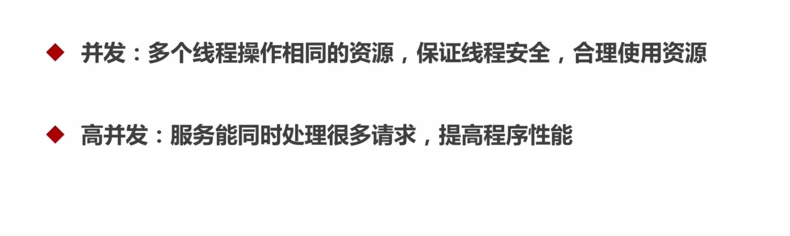
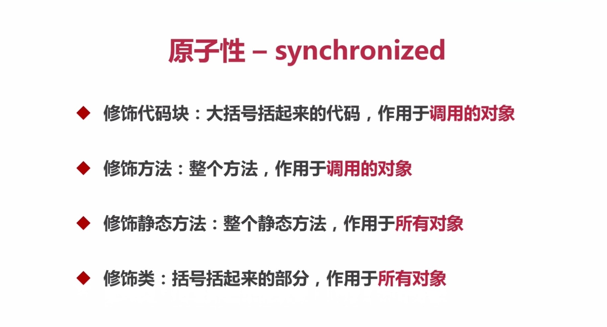
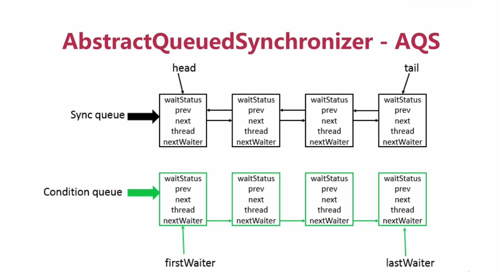
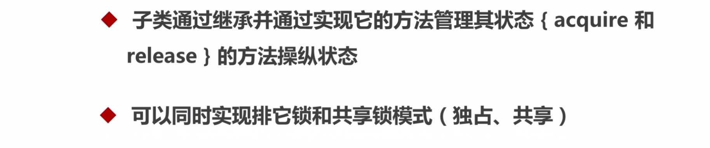

### 准备


### 基本概念




### CPU多级缓存


### JAVA内存模型


### 并发的优势与风险


### 线程安全性


#### 原子性

```java
import lombok.extern.slf4j.Slf4j;

import java.util.concurrent.CountDownLatch;
import java.util.concurrent.ExecutorService;
import java.util.concurrent.Executors;
import java.util.concurrent.Semaphore;
import java.util.concurrent.atomic.AtomicInteger;
import java.util.concurrent.atomic.AtomicLong;
import java.util.concurrent.atomic.LongAdder;

@Slf4j
@ThreadSafe
public class AtomicExample1 {

    // 请求总数
    public static int clientTotal = 5000;

    // 同时并发执行的线程数
    public static int threadTotal = 200;

    public static AtomicInteger count = new AtomicInteger(0);
    // public static AtomicLong count = new AtomicLong(0);
    // public static LongAdder count = new LongAdder();

    public static void main(String[] args) throws Exception {
        ExecutorService executorService = Executors.newCachedThreadPool();
        final Semaphore semaphore = new Semaphore(threadTotal);
        final CountDownLatch countDownLatch = new CountDownLatch(clientTotal);
        for (int i = 0; i < clientTotal ; i++) {
            executorService.execute(() -> {
                try {
                    semaphore.acquire();
                    add();
                    semaphore.release();
                } catch (Exception e) {
                    log.error("exception", e);
                }
                countDownLatch.countDown();
            });
        }
        countDownLatch.await();
        executorService.shutdown();
        log.info("count:{}", count.get());
    }

    private static void add() {
        count.incrementAndGet();
        // count.getAndIncrement();
        // count.increment();
    }
}
```
```java
import lombok.extern.slf4j.Slf4j;

import java.util.concurrent.CountDownLatch;
import java.util.concurrent.ExecutorService;
import java.util.concurrent.Executors;
import java.util.concurrent.Semaphore;
import java.util.concurrent.atomic.AtomicReference;
import java.util.concurrent.atomic.LongAdder;

@Slf4j
@ThreadSafe
public class AtomicExample4 {

    private static AtomicReference<Integer> count = new AtomicReference<>(0);

    public static void main(String[] args) {
        count.compareAndSet(0, 2); // 2
        count.compareAndSet(0, 1); // no
        count.compareAndSet(1, 3); // no
        count.compareAndSet(2, 4); // 4
        count.compareAndSet(3, 5); // no
        log.info("count:{}", count.get());
    }
}
```
```java
import java.util.concurrent.atomic.AtomicIntegerFieldUpdater;

import lombok.Getter;
import lombok.extern.slf4j.Slf4j;

@Slf4j
public class AtomicExample5 {

    private static AtomicIntegerFieldUpdater<AtomicExample5> updater =
            AtomicIntegerFieldUpdater.newUpdater(AtomicExample5.class, "count");

    @Getter
    public volatile int count = 100;

    public static void main(String[] args) {

        AtomicExample5 example5 = new AtomicExample5();

        if (updater.compareAndSet(example5, 100, 120)) {
            log.info("update success 1, {}", example5.getCount());
        }

        if (updater.compareAndSet(example5, 100, 120)) {
            log.info("update success 2, {}", example5.getCount());
        } else {
            log.info("update failed, {}", example5.getCount());
        }
    }
}
```
结果:
```
23:15:33.084 [main] INFO com.mmall.concurrency.example.atomic.AtomicExample5 - update success 1, 120
23:15:33.089 [main] INFO com.mmall.concurrency.example.atomic.AtomicExample5 - update failed, 120

```
```java
import lombok.extern.slf4j.Slf4j;

import java.util.concurrent.CountDownLatch;
import java.util.concurrent.ExecutorService;
import java.util.concurrent.Executors;
import java.util.concurrent.Semaphore;
import java.util.concurrent.atomic.AtomicBoolean;

@Slf4j
@ThreadSafe
public class AtomicExample6 {

    private static AtomicBoolean isHappened = new AtomicBoolean(false);

    // 请求总数
    public static int clientTotal = 5000;

    // 同时并发执行的线程数
    public static int threadTotal = 200;

    public static void main(String[] args) throws Exception {
        ExecutorService executorService = Executors.newCachedThreadPool();
        final Semaphore semaphore = new Semaphore(threadTotal);
        final CountDownLatch countDownLatch = new CountDownLatch(clientTotal);
        for (int i = 0; i < clientTotal ; i++) {
            executorService.execute(() -> {
                try {
                    semaphore.acquire();
                    test();
                    semaphore.release();
                } catch (Exception e) {
                    log.error("exception", e);
                }
                countDownLatch.countDown();
            });
        }
        countDownLatch.await();
        executorService.shutdown();
        log.info("isHappened:{}", isHappened.get());
    }

    private static void test() {
        if (isHappened.compareAndSet(false, true)) {
            log.info("execute");
        }
    }
}
```
结果:
```
23:19:09.823 [pool-1-thread-1] INFO com.mmall.concurrency.example.atomic.AtomicExample6 - execute
23:19:09.840 [main] INFO com.mmall.concurrency.example.atomic.AtomicExample6 - isHappened:true

```





#### 可见性


#### 有序性


### 安全发布对象

```java
import lombok.extern.slf4j.Slf4j;

@Slf4j
@NotThreadSafe
@NotRecommend
public class Escape {

    private int thisCanBeEscape = 0;

    public Escape () {
        new InnerClass();
    }

    private class InnerClass {

        public InnerClass() {
            log.info("{}", Escape.this.thisCanBeEscape);
        }
    }

    public static void main(String[] args) {
        new Escape();
    }
}
```
```java
import lombok.extern.slf4j.Slf4j;

import java.util.Arrays;

@Slf4j
@NotThreadSafe
public class UnsafePublish {
    private String[] states = {"a", "b", "c"};

    public String[] getStates() {
        return states;
    }

    public static void main(String[] args) {
        UnsafePublish unsafePublish = new UnsafePublish();
        log.info("{}", Arrays.toString(unsafePublish.getStates()));

        unsafePublish.getStates()[0] = "d";
        log.info("{}", Arrays.toString(unsafePublish.getStates()));
    }
}
```


```java
/**
 * 懒汉模式
 * 单例实例在第一次使用时进行创建
 */
@NotThreadSafe
public class SingletonExample1 {
    // 私有构造函数
    private SingletonExample1() {}

    // 单例对象
    private static SingletonExample1 instance = null;

    // 静态的工厂方法
    public static SingletonExample1 getInstance() {
        if (instance == null) {
            instance = new SingletonExample1();
        }
        return instance;
    }
}
```
```java
/**
 * 饿汉模式
 * 单例实例在类装载时进行创建
 */
@ThreadSafe
public class SingletonExample2 {
    // 私有构造函数
    private SingletonExample2() {}

    // 单例对象
    private static SingletonExample2 instance = new SingletonExample2();

    // 静态的工厂方法
    public static SingletonExample2 getInstance() {
        return instance;
    }
}
```
```java
/**
 * 懒汉模式
 * 单例实例在第一次使用时进行创建
 */
@ThreadSafe
@NotRecommend
public class SingletonExample3 {
    // 私有构造函数
    private SingletonExample3() {}

    // 单例对象
    private static SingletonExample3 instance = null;

    // 静态的工厂方法
    public static synchronized SingletonExample3 getInstance() {
        if (instance == null) {
            instance = new SingletonExample3();
        }
        return instance;
    }
}
```
```java
/**
 * 懒汉模式 -》 双重同步锁单例模式
 * 单例实例在第一次使用时进行创建
 */
@NotThreadSafe
public class SingletonExample4 {
    // 私有构造函数
    private SingletonExample4() {}

    // 1、memory = allocate() 分配对象的内存空间
    // 2、ctorInstance() 初始化对象
    // 3、instance = memory 设置instance指向刚分配的内存

    // JVM和cpu优化，发生了指令重排

    // 1、memory = allocate() 分配对象的内存空间
    // 3、instance = memory 设置instance指向刚分配的内存
    // 2、ctorInstance() 初始化对象

    // 单例对象
    private static SingletonExample4 instance = null;

    // 静态的工厂方法
    public static SingletonExample4 getInstance() {
        if (instance == null) { // 双重检测机制        // B
            synchronized (SingletonExample4.class) { // 同步锁
                if (instance == null) {
                    instance = new SingletonExample4(); // A - 3
                }
            }
        }
        return instance;
    }
}
```
```java
/**
 * 懒汉模式 -》 双重同步锁单例模式
 * 单例实例在第一次使用时进行创建
 */
@ThreadSafe
public class SingletonExample5 {
    // 私有构造函数
    private SingletonExample5() {}

    // 1、memory = allocate() 分配对象的内存空间
    // 2、ctorInstance() 初始化对象
    // 3、instance = memory 设置instance指向刚分配的内存

    // 单例对象 volatile + 双重检测机制 -> 禁止指令重排
    private volatile static SingletonExample5 instance = null;

    // 静态的工厂方法
    public static SingletonExample5 getInstance() {
        if (instance == null) { // 双重检测机制        // B
            synchronized (SingletonExample5.class) { // 同步锁
                if (instance == null) {
                    instance = new SingletonExample5(); // A - 3
                }
            }
        }
        return instance;
    }
}
```
```java
/**
 * 饿汉模式
 * 单例实例在类装载时进行创建
 */
@ThreadSafe
public class SingletonExample6 {
    // 私有构造函数
    private SingletonExample6() {}

    // 单例对象
    private static SingletonExample6 instance = null;

    static {
        instance = new SingletonExample6();
    }

    // 静态的工厂方法
    public static SingletonExample6 getInstance() {
        return instance;
    }

    public static void main(String[] args) {
        System.out.println(getInstance().hashCode());
        System.out.println(getInstance().hashCode());
    }
}
```
```java
/**
 * 枚举模式：最安全
 */
@ThreadSafe
@Recommend
public class SingletonExample7 {

    // 私有构造函数
    private SingletonExample7() {}

    public static SingletonExample7 getInstance() {
        return Singleton.INSTANCE.getInstance();
    }

    private enum Singleton {
        INSTANCE;

        private SingletonExample7 singleton;

        // JVM保证这个方法绝对只调用一次
        Singleton() {
            singleton = new SingletonExample7();
        }

        public SingletonExample7 getInstance() {
            return singleton;
        }
    }
}
```

### 不可变对象


```java
import com.google.common.collect.Maps;
import lombok.extern.slf4j.Slf4j;

import java.util.Map;

@Slf4j
@NotThreadSafe
public class ImmutableExample1 {

    private final static Integer a = 1;
    private final static String b = "2";
    private final static Map<Integer, Integer> map = Maps.newHashMap();

    static {
        map.put(1, 2);
        map.put(3, 4);
        map.put(5, 6);
    }

    public static void main(String[] args) {
//        a = 2;
//        b = "3";
//        map = Maps.newHashMap();
        map.put(1, 3);
        log.info("{}", map.get(1));
    }

    private void test(final int a) {
//        a = 1;
    }
}
```

```java
import com.google.common.collect.Maps;
import lombok.extern.slf4j.Slf4j;

import java.util.Collections;
import java.util.Map;

@Slf4j
@ThreadSafe
public class ImmutableExample2 {

    private static Map<Integer, Integer> map = Maps.newHashMap();

    static {
        map.put(1, 2);
        map.put(3, 4);
        map.put(5, 6);
        map = Collections.unmodifiableMap(map);
    }

    public static void main(String[] args) {
        map.put(1, 3);
        log.info("{}", map.get(1));
    }

}
```
结果:
```
Exception in thread "main" java.lang.UnsupportedOperationException
	at java.util.Collections$UnmodifiableMap.put(Collections.java:1457)
```
```java
import com.google.common.collect.ImmutableList;
import com.google.common.collect.ImmutableMap;
import com.google.common.collect.ImmutableSet;

@ThreadSafe
public class ImmutableExample3 {

    private final static ImmutableList<Integer> list = ImmutableList.of(1, 2, 3);
    private final static ImmutableSet set = ImmutableSet.copyOf(list);
    private final static ImmutableMap<Integer, Integer> map = ImmutableMap.of(1, 2, 3, 4);
    private final static ImmutableMap<Integer, Integer> map2 = ImmutableMap.<Integer, Integer>builder()
            .put(1, 2).put(3, 4).put(5, 6).build();


    public static void main(String[] args) {
        System.out.println(map2.get(3));
    }
}
```

### 线程封闭


### 线程不安全类与写法


JodaTime:
```java
import com.mmall.concurrency.annoations.ThreadSafe;
import lombok.extern.slf4j.Slf4j;
import org.joda.time.DateTime;
import org.joda.time.format.DateTimeFormat;
import org.joda.time.format.DateTimeFormatter;

import java.util.concurrent.CountDownLatch;
import java.util.concurrent.ExecutorService;
import java.util.concurrent.Executors;
import java.util.concurrent.Semaphore;

@Slf4j
@ThreadSafe
public class DateFormatExample3 {
    // 请求总数
    public static int clientTotal = 5000;
    // 同时并发执行的线程数
    public static int threadTotal = 200;

    private static DateTimeFormatter dateTimeFormatter = DateTimeFormat.forPattern("yyyyMMdd");

    public static void main(String[] args) throws Exception {
        ExecutorService executorService = Executors.newCachedThreadPool();
        final Semaphore semaphore = new Semaphore(threadTotal);
        final CountDownLatch countDownLatch = new CountDownLatch(clientTotal);
        for (int i = 0; i < clientTotal; i++) {
            final int count = i;
            executorService.execute(() -> {
                try {
                    semaphore.acquire();
                    update(count);
                    semaphore.release();
                } catch (Exception e) {
                    log.error("exception", e);
                }
                countDownLatch.countDown();
            });
        }
        countDownLatch.await();
        executorService.shutdown();
    }

    private static void update(int i) {
        log.info("{}, {}", i, DateTime.parse("20180208", dateTimeFormatter).toDate());
    }
}
```

### 同步容器


Vector不是线程安全的情况:
```java
import java.util.Vector;

@NotThreadSafe
public class VectorExample2 {

    private static Vector<Integer> vector = new Vector<>();

    public static void main(String[] args) {

        while (true) {

            for (int i = 0; i < 10; i++) {
                vector.add(i);
            }

            Thread thread1 = new Thread() {
                public void run() {
                    for (int i = 0; i < vector.size(); i++) {
                        vector.remove(i);
                    }
                }
            };

            Thread thread2 = new Thread() {
                public void run() {
                    for (int i = 0; i < vector.size(); i++) {
                        vector.get(i);
                    }
                }
            };
            thread1.start();
            thread2.start();
        }
    }
}
```
ConcurrentModificationException:
```java
import java.util.Iterator;
import java.util.Vector;

public class VectorExample3 {
    // java.util.ConcurrentModificationException
    private static void test1(Vector<Integer> v1) { // foreach
        for(Integer i : v1) {
            if (i.equals(3)) {
                v1.remove(i);
            }
        }
    }

    // java.util.ConcurrentModificationException
    private static void test2(Vector<Integer> v1) { // iterator
        Iterator<Integer> iterator = v1.iterator();
        while (iterator.hasNext()) {
            Integer i = iterator.next();
            if (i.equals(3)) {
                v1.remove(i);
            }
        }
    }

    // success
    private static void test3(Vector<Integer> v1) { // for
        for (int i = 0; i < v1.size(); i++) {
            if (v1.get(i).equals(3)) {
                v1.remove(i);
            }
        }
    }

    public static void main(String[] args) {

        Vector<Integer> vector = new Vector<>();
        vector.add(1);
        vector.add(2);
        vector.add(3);
        test1(vector);
    }
}
```
Collections.synchronizedXXX
```java
import com.google.common.collect.Lists;
import com.google.common.collect.Sets;
import com.mmall.concurrency.annoations.ThreadSafe;
import lombok.extern.slf4j.Slf4j;

import java.util.Collections;
import java.util.List;
import java.util.Vector;
import java.util.Set;
import java.util.concurrent.CountDownLatch;
import java.util.concurrent.ExecutorService;
import java.util.concurrent.Executors;
import java.util.concurrent.Semaphore;

@Slf4j
@ThreadSafe
public class CollectionsExample1 {

    // 请求总数
    public static int clientTotal = 5000;

    // 同时并发执行的线程数
    public static int threadTotal = 200;

    private static List<Integer> list = Collections.synchronizedList(Lists.newArrayList());
    // private static Set<Integer> set = Collections.synchronizedSet(Sets.newHashSet());
    // private static Map<Integer, Integer> map = Collections.synchronizedMap(new HashMap<>());

    public static void main(String[] args) throws Exception {
        ExecutorService executorService = Executors.newCachedThreadPool();
        final Semaphore semaphore = new Semaphore(threadTotal);
        final CountDownLatch countDownLatch = new CountDownLatch(clientTotal);
        for (int i = 0; i < clientTotal; i++) {
            final int count = i;
            executorService.execute(() -> {
                try {
                    semaphore.acquire();
                    update(count);
                    semaphore.release();
                } catch (Exception e) {
                    log.error("exception", e);
                }
                countDownLatch.countDown();
            });
        }
        countDownLatch.await();
        executorService.shutdown();
        log.info("size:{}", list.size());
    }

    private static void update(int i) {
        list.add(i);
        // set.add(i);
        // map.put(i, i);
    }
}
```


### 安全共享策略


### AQS




Sync queue 同步队列（底层是双向链表）
Condition queue 单向链表（不是必须的，需要用到的时候才会使用）

#### aqs实现的具体大致思路:
```
aqs内部维护了一个clh队列来管理锁，线程会首先尝试获取锁，如果失败，就将当前线程以及等待信息包成一个node节点，加入到之前介绍的同步队列
，接着会不断循环尝试获取锁，条件是，当前节点为head的直接后继才会尝试，如果失败，就会阻塞自己，直到自己被唤醒，而当持有锁的线程释放锁的时候，会
唤醒队列中的后继线程，基于这些基础的设计和思路，jdk提供了很多基于aqs的子类
```


#### 使用场景:
```
程序执行需要等待某个条件完成后才能继续执行后续的操作，典型的应用比如：并行计算
当某个处理的运算量很大时，可以将该运算任务拆分成多个子任务，等待所有的子任务都完成后，
父任务再拿到所有子任务的运算结果进行汇总
```
```java
import lombok.extern.slf4j.Slf4j;

import java.util.concurrent.CountDownLatch;
import java.util.concurrent.ExecutorService;
import java.util.concurrent.Executors;

@Slf4j
public class CountDownLatchExample1 {

    private final static int threadCount = 200;

    public static void main(String[] args) throws Exception {

        ExecutorService exec = Executors.newCachedThreadPool();

        final CountDownLatch countDownLatch = new CountDownLatch(threadCount);

        for (int i = 0; i < threadCount; i++) {
            final int threadNum = i;
            exec.execute(() -> {
                try {
                    test(threadNum);
                } catch (Exception e) {
                    log.error("exception", e);
                } finally {
                    countDownLatch.countDown();
                }
            });
        }
        countDownLatch.await();
        log.info("finish");
        exec.shutdown();
    }

    private static void test(int threadNum) throws Exception {
        Thread.sleep(100);
        log.info("{}", threadNum);
        Thread.sleep(100);
    }
}
```
结果:
```
15:14:51.589 [pool-1-thread-10] INFO com.mmall.concurrency.example.aqs.CountDownLatchExample1 - 9
15:14:51.589 [pool-1-thread-6] INFO com.mmall.concurrency.example.aqs.CountDownLatchExample1 - 5
15:14:51.589 [pool-1-thread-3] INFO com.mmall.concurrency.example.aqs.CountDownLatchExample1 - 2
15:14:51.589 [pool-1-thread-7] INFO com.mmall.concurrency.example.aqs.CountDownLatchExample1 - 6
15:14:51.589 [pool-1-thread-1] INFO com.mmall.concurrency.example.aqs.CountDownLatchExample1 - 0
15:14:51.589 [pool-1-thread-5] INFO com.mmall.concurrency.example.aqs.CountDownLatchExample1 - 4
15:14:51.589 [pool-1-thread-9] INFO com.mmall.concurrency.example.aqs.CountDownLatchExample1 - 8
15:14:51.589 [pool-1-thread-4] INFO com.mmall.concurrency.example.aqs.CountDownLatchExample1 - 3
15:14:51.589 [pool-1-thread-2] INFO com.mmall.concurrency.example.aqs.CountDownLatchExample1 - 1
15:14:51.589 [pool-1-thread-8] INFO com.mmall.concurrency.example.aqs.CountDownLatchExample1 - 7
15:14:51.696 [main] INFO com.mmall.concurrency.example.aqs.CountDownLatchExample1 - finish

```
```java
import java.util.concurrent.CountDownLatch;
import java.util.concurrent.ExecutorService;
import java.util.concurrent.Executors;
import java.util.concurrent.TimeUnit;

import lombok.extern.slf4j.Slf4j;

@Slf4j
public class CountDownLatchExample2 {

    private final static int threadCount = 10;

    public static void main(String[] args) throws Exception {

        ExecutorService exec = Executors.newCachedThreadPool();

        final CountDownLatch countDownLatch = new CountDownLatch(threadCount);

        for (int i = 0; i < threadCount; i++) {
            final int threadNum = i;
            exec.execute(() -> {
                try {
                    test(threadNum);
                } catch (Exception e) {
                    log.error("exception", e);
                } finally {
                    countDownLatch.countDown();
                }
            });
        }
        countDownLatch.await(10, TimeUnit.MILLISECONDS);
        log.info("finish");
        exec.shutdown();
    }

    private static void test(int threadNum) throws Exception {
        Thread.sleep(100);
        log.info("{}", threadNum);
    }
}
```
结果:
```
15:17:50.556 [main] INFO com.mmall.concurrency.example.aqs.CountDownLatchExample2 - finish
15:17:50.644 [pool-1-thread-1] INFO com.mmall.concurrency.example.aqs.CountDownLatchExample2 - 0
15:17:50.644 [pool-1-thread-4] INFO com.mmall.concurrency.example.aqs.CountDownLatchExample2 - 3
15:17:50.644 [pool-1-thread-3] INFO com.mmall.concurrency.example.aqs.CountDownLatchExample2 - 2
15:17:50.644 [pool-1-thread-7] INFO com.mmall.concurrency.example.aqs.CountDownLatchExample2 - 6
15:17:50.644 [pool-1-thread-8] INFO com.mmall.concurrency.example.aqs.CountDownLatchExample2 - 7
15:17:50.644 [pool-1-thread-2] INFO com.mmall.concurrency.example.aqs.CountDownLatchExample2 - 1
15:17:50.645 [pool-1-thread-10] INFO com.mmall.concurrency.example.aqs.CountDownLatchExample2 - 9
15:17:50.644 [pool-1-thread-9] INFO com.mmall.concurrency.example.aqs.CountDownLatchExample2 - 8
15:17:50.644 [pool-1-thread-6] INFO com.mmall.concurrency.example.aqs.CountDownLatchExample2 - 5
15:17:50.644 [pool-1-thread-5] INFO com.mmall.concurrency.example.aqs.CountDownLatchExample2 - 4

```


#### 使用场景:
```
仅能提供有限的访问资源，比如：我们项目中的数据库，数据库的最大连接数只有20，而我们的上层应用的并发数会远远大于20，如果同时对数据库进行操作，
就可能会出现因为无法获取数据库连接数导致异常，这时候就可以通过信号量来做并发访问控制，当信号量semaphore把并发数控制到1时，就跟单线程运行很相似，
```
```java
import lombok.extern.slf4j.Slf4j;

import java.util.concurrent.CountDownLatch;
import java.util.concurrent.ExecutorService;
import java.util.concurrent.Executors;
import java.util.concurrent.Semaphore;

@Slf4j
public class SemaphoreExample1 {

    private final static int threadCount = 10;

    public static void main(String[] args) throws Exception {

        ExecutorService exec = Executors.newCachedThreadPool();

        final Semaphore semaphore = new Semaphore(3);

        for (int i = 0; i < threadCount; i++) {
            final int threadNum = i;
            exec.execute(() -> {
                try {
                    semaphore.acquire(); // 获取一个许可
                    test(threadNum);
                    semaphore.release(); // 释放一个许可
                } catch (Exception e) {
                    log.error("exception", e);
                }
            });
        }
        exec.shutdown();
    }

    private static void test(int threadNum) throws Exception {
        log.info("{}", threadNum);
        Thread.sleep(1000);
    }
}
```
结果: 大概每隔1s打印3行
```
12:14:18.188 [pool-1-thread-2] INFO com.mmall.concurrency.example.aqs.SemaphoreExample1 - 1
12:14:18.188 [pool-1-thread-1] INFO com.mmall.concurrency.example.aqs.SemaphoreExample1 - 0
12:14:18.188 [pool-1-thread-3] INFO com.mmall.concurrency.example.aqs.SemaphoreExample1 - 2
12:14:19.194 [pool-1-thread-4] INFO com.mmall.concurrency.example.aqs.SemaphoreExample1 - 3
12:14:19.194 [pool-1-thread-5] INFO com.mmall.concurrency.example.aqs.SemaphoreExample1 - 4
12:14:19.194 [pool-1-thread-6] INFO com.mmall.concurrency.example.aqs.SemaphoreExample1 - 5
12:14:20.195 [pool-1-thread-8] INFO com.mmall.concurrency.example.aqs.SemaphoreExample1 - 7
12:14:20.195 [pool-1-thread-9] INFO com.mmall.concurrency.example.aqs.SemaphoreExample1 - 8
12:14:20.195 [pool-1-thread-7] INFO com.mmall.concurrency.example.aqs.SemaphoreExample1 - 6
12:14:21.196 [pool-1-thread-10] INFO com.mmall.concurrency.example.aqs.SemaphoreExample1 - 9
```
```java
import java.util.concurrent.ExecutorService;
import java.util.concurrent.Executors;
import java.util.concurrent.Semaphore;

import lombok.extern.slf4j.Slf4j;

@Slf4j
public class SemaphoreExample2 {

    private final static int threadCount = 10;

    public static void main(String[] args) throws Exception {

        ExecutorService exec = Executors.newCachedThreadPool();

        final Semaphore semaphore = new Semaphore(3);

        for (int i = 0; i < threadCount; i++) {
            final int threadNum = i;
            exec.execute(() -> {
                try {
                    semaphore.acquire(3); // 获取多个许可
                    test(threadNum);
                    semaphore.release(3); // 释放多个许可
                } catch (Exception e) {
                    log.error("exception", e);
                }
            });
        }
        exec.shutdown();
    }

    private static void test(int threadNum) throws Exception {
        log.info("{}", threadNum);
        Thread.sleep(1000);
    }
}
```
结果: 大概每隔1s打印1行
```
12:17:05.304 [pool-1-thread-1] INFO com.mmall.concurrency.example.aqs.SemaphoreExample2 - 0
12:17:06.310 [pool-1-thread-2] INFO com.mmall.concurrency.example.aqs.SemaphoreExample2 - 1
12:17:07.310 [pool-1-thread-3] INFO com.mmall.concurrency.example.aqs.SemaphoreExample2 - 2
12:17:08.310 [pool-1-thread-4] INFO com.mmall.concurrency.example.aqs.SemaphoreExample2 - 3
12:17:09.311 [pool-1-thread-5] INFO com.mmall.concurrency.example.aqs.SemaphoreExample2 - 4
12:17:10.312 [pool-1-thread-6] INFO com.mmall.concurrency.example.aqs.SemaphoreExample2 - 5
12:17:11.312 [pool-1-thread-7] INFO com.mmall.concurrency.example.aqs.SemaphoreExample2 - 6
12:17:12.313 [pool-1-thread-8] INFO com.mmall.concurrency.example.aqs.SemaphoreExample2 - 7
12:17:13.314 [pool-1-thread-9] INFO com.mmall.concurrency.example.aqs.SemaphoreExample2 - 8
12:17:14.314 [pool-1-thread-10] INFO com.mmall.concurrency.example.aqs.SemaphoreExample2 - 9

```
```java
import lombok.extern.slf4j.Slf4j;

import java.util.concurrent.ExecutorService;
import java.util.concurrent.Executors;
import java.util.concurrent.Semaphore;
import java.util.concurrent.TimeUnit;

@Slf4j
public class SemaphoreExample3 {

    private final static int threadCount = 20;

    public static void main(String[] args) throws Exception {

        ExecutorService exec = Executors.newCachedThreadPool();

        final Semaphore semaphore = new Semaphore(3);

        for (int i = 0; i < threadCount; i++) {
            final int threadNum = i;
            exec.execute(() -> {
                try {
                    if (semaphore.tryAcquire()) { // 尝试获取一个许可
                        test(threadNum);
                        semaphore.release(); // 释放一个许可
                    }
                } catch (Exception e) {
                    log.error("exception", e);
                }
            });
        }
        exec.shutdown();
    }

    private static void test(int threadNum) throws Exception {
        log.info("{}", threadNum);
        Thread.sleep(1000);
    }
}
```
结果:
```
12:19:05.556 [pool-1-thread-3] INFO com.mmall.concurrency.example.aqs.SemaphoreExample3 - 2
12:19:05.556 [pool-1-thread-1] INFO com.mmall.concurrency.example.aqs.SemaphoreExample3 - 0
12:19:05.556 [pool-1-thread-2] INFO com.mmall.concurrency.example.aqs.SemaphoreExample3 - 1
```
```java
import java.util.concurrent.ExecutorService;
import java.util.concurrent.Executors;
import java.util.concurrent.Semaphore;
import java.util.concurrent.TimeUnit;

import lombok.extern.slf4j.Slf4j;

@Slf4j
public class SemaphoreExample4 {

    private final static int threadCount = 10;

    public static void main(String[] args) throws Exception {

        ExecutorService exec = Executors.newCachedThreadPool();

        final Semaphore semaphore = new Semaphore(3);

        for (int i = 0; i < threadCount; i++) {
            final int threadNum = i;
            exec.execute(() -> {
                try {
                    if (semaphore.tryAcquire(5000, TimeUnit.MILLISECONDS)) { // 尝试获取一个许可
                        test(threadNum);
                        semaphore.release(); // 释放一个许可
                    }
                } catch (Exception e) {
                    log.error("exception", e);
                }
            });
        }
        exec.shutdown();
    }

    private static void test(int threadNum) throws Exception {
        log.info("{}", threadNum);
        Thread.sleep(1000);
    }
}
```
结果: 大概每隔1s打印3行
```
12:22:58.289 [pool-1-thread-1] INFO com.mmall.concurrency.example.aqs.SemaphoreExample4 - 0
12:22:58.289 [pool-1-thread-3] INFO com.mmall.concurrency.example.aqs.SemaphoreExample4 - 2
12:22:58.289 [pool-1-thread-2] INFO com.mmall.concurrency.example.aqs.SemaphoreExample4 - 1
12:22:59.294 [pool-1-thread-6] INFO com.mmall.concurrency.example.aqs.SemaphoreExample4 - 5
12:22:59.294 [pool-1-thread-5] INFO com.mmall.concurrency.example.aqs.SemaphoreExample4 - 4
12:22:59.294 [pool-1-thread-4] INFO com.mmall.concurrency.example.aqs.SemaphoreExample4 - 3
12:23:00.294 [pool-1-thread-8] INFO com.mmall.concurrency.example.aqs.SemaphoreExample4 - 7
12:23:00.294 [pool-1-thread-7] INFO com.mmall.concurrency.example.aqs.SemaphoreExample4 - 6
12:23:00.294 [pool-1-thread-9] INFO com.mmall.concurrency.example.aqs.SemaphoreExample4 - 8
12:23:01.294 [pool-1-thread-11] INFO com.mmall.concurrency.example.aqs.SemaphoreExample4 - 10
12:23:01.294 [pool-1-thread-10] INFO com.mmall.concurrency.example.aqs.SemaphoreExample4 - 9
12:23:01.294 [pool-1-thread-12] INFO com.mmall.concurrency.example.aqs.SemaphoreExample4 - 11
12:23:02.295 [pool-1-thread-15] INFO com.mmall.concurrency.example.aqs.SemaphoreExample4 - 14
12:23:02.295 [pool-1-thread-13] INFO com.mmall.concurrency.example.aqs.SemaphoreExample4 - 12
12:23:02.295 [pool-1-thread-14] INFO com.mmall.concurrency.example.aqs.SemaphoreExample4 - 13

```


```java
import lombok.extern.slf4j.Slf4j;

import java.util.concurrent.CyclicBarrier;
import java.util.concurrent.ExecutorService;
import java.util.concurrent.Executors;

@Slf4j
public class CyclicBarrierExample1 {

    private static CyclicBarrier barrier = new CyclicBarrier(5);

    public static void main(String[] args) throws Exception {

        ExecutorService executor = Executors.newCachedThreadPool();

        for (int i = 0; i < 10; i++) {
            final int threadNum = i;
            Thread.sleep(1000);
            executor.execute(() -> {
                try {
                    race(threadNum);
                } catch (Exception e) {
                    log.error("exception", e);
                }
            });
        }
        executor.shutdown();
    }

    private static void race(int threadNum) throws Exception {
        Thread.sleep(1000);
        log.info("{} is ready", threadNum);
        barrier.await();

/*        try {
            barrier.await(2000, TimeUnit.MILLISECONDS);
        } catch (Exception e) {
            log.warn("BarrierException", e);
        }*/

        log.info("{} continue", threadNum);
    }
}
```
结果：
```
23:57:27.925 [pool-1-thread-1] INFO com.mmall.concurrency.example.aqs.CyclicBarrierExample1 - 0 is ready
23:57:28.916 [pool-1-thread-2] INFO com.mmall.concurrency.example.aqs.CyclicBarrierExample1 - 1 is ready
23:57:29.917 [pool-1-thread-3] INFO com.mmall.concurrency.example.aqs.CyclicBarrierExample1 - 2 is ready
23:57:30.917 [pool-1-thread-4] INFO com.mmall.concurrency.example.aqs.CyclicBarrierExample1 - 3 is ready
23:57:31.918 [pool-1-thread-5] INFO com.mmall.concurrency.example.aqs.CyclicBarrierExample1 - 4 is ready
23:57:31.918 [pool-1-thread-5] INFO com.mmall.concurrency.example.aqs.CyclicBarrierExample1 - 4 continue
23:57:31.918 [pool-1-thread-1] INFO com.mmall.concurrency.example.aqs.CyclicBarrierExample1 - 0 continue
23:57:31.918 [pool-1-thread-2] INFO com.mmall.concurrency.example.aqs.CyclicBarrierExample1 - 1 continue
23:57:31.918 [pool-1-thread-3] INFO com.mmall.concurrency.example.aqs.CyclicBarrierExample1 - 2 continue
23:57:31.918 [pool-1-thread-4] INFO com.mmall.concurrency.example.aqs.CyclicBarrierExample1 - 3 continue
23:57:32.919 [pool-1-thread-6] INFO com.mmall.concurrency.example.aqs.CyclicBarrierExample1 - 5 is ready
23:57:33.918 [pool-1-thread-4] INFO com.mmall.concurrency.example.aqs.CyclicBarrierExample1 - 6 is ready
23:57:34.919 [pool-1-thread-1] INFO com.mmall.concurrency.example.aqs.CyclicBarrierExample1 - 7 is ready
23:57:35.919 [pool-1-thread-2] INFO com.mmall.concurrency.example.aqs.CyclicBarrierExample1 - 8 is ready
23:57:36.920 [pool-1-thread-3] INFO com.mmall.concurrency.example.aqs.CyclicBarrierExample1 - 9 is ready
23:57:36.920 [pool-1-thread-3] INFO com.mmall.concurrency.example.aqs.CyclicBarrierExample1 - 9 continue
23:57:36.920 [pool-1-thread-6] INFO com.mmall.concurrency.example.aqs.CyclicBarrierExample1 - 5 continue
23:57:36.920 [pool-1-thread-4] INFO com.mmall.concurrency.example.aqs.CyclicBarrierExample1 - 6 continue
23:57:36.920 [pool-1-thread-1] INFO com.mmall.concurrency.example.aqs.CyclicBarrierExample1 - 7 continue
23:57:36.920 [pool-1-thread-2] INFO com.mmall.concurrency.example.aqs.CyclicBarrierExample1 - 8 continue

```
```java
import lombok.extern.slf4j.Slf4j;

import java.util.concurrent.CyclicBarrier;
import java.util.concurrent.ExecutorService;
import java.util.concurrent.Executors;

@Slf4j
public class CyclicBarrierExample3 {

    private static CyclicBarrier barrier = new CyclicBarrier(5, () -> {
        log.info("callback is running");
    });

    public static void main(String[] args) throws Exception {

        ExecutorService executor = Executors.newCachedThreadPool();

        for (int i = 0; i < 10; i++) {
            final int threadNum = i;
            Thread.sleep(1000);
            executor.execute(() -> {
                try {
                    race(threadNum);
                } catch (Exception e) {
                    log.error("exception", e);
                }
            });
        }
        executor.shutdown();
    }

    private static void race(int threadNum) throws Exception {
        Thread.sleep(1000);
        log.info("{} is ready", threadNum);
        barrier.await();
        log.info("{} continue", threadNum);
    }
}
```
```
00:00:48.622 [pool-1-thread-1] INFO com.mmall.concurrency.example.aqs.CyclicBarrierExample3 - 0 is ready
00:00:49.618 [pool-1-thread-2] INFO com.mmall.concurrency.example.aqs.CyclicBarrierExample3 - 1 is ready
00:00:50.618 [pool-1-thread-3] INFO com.mmall.concurrency.example.aqs.CyclicBarrierExample3 - 2 is ready
00:00:51.618 [pool-1-thread-4] INFO com.mmall.concurrency.example.aqs.CyclicBarrierExample3 - 3 is ready
00:00:52.617 [pool-1-thread-5] INFO com.mmall.concurrency.example.aqs.CyclicBarrierExample3 - 4 is ready
00:00:52.617 [pool-1-thread-5] INFO com.mmall.concurrency.example.aqs.CyclicBarrierExample3 - callback is running
00:00:52.617 [pool-1-thread-5] INFO com.mmall.concurrency.example.aqs.CyclicBarrierExample3 - 4 continue
00:00:52.618 [pool-1-thread-2] INFO com.mmall.concurrency.example.aqs.CyclicBarrierExample3 - 1 continue
00:00:52.618 [pool-1-thread-1] INFO com.mmall.concurrency.example.aqs.CyclicBarrierExample3 - 0 continue
00:00:52.618 [pool-1-thread-3] INFO com.mmall.concurrency.example.aqs.CyclicBarrierExample3 - 2 continue
00:00:52.618 [pool-1-thread-4] INFO com.mmall.concurrency.example.aqs.CyclicBarrierExample3 - 3 continue
00:00:53.619 [pool-1-thread-6] INFO com.mmall.concurrency.example.aqs.CyclicBarrierExample3 - 5 is ready
00:00:54.618 [pool-1-thread-4] INFO com.mmall.concurrency.example.aqs.CyclicBarrierExample3 - 6 is ready
00:00:55.619 [pool-1-thread-3] INFO com.mmall.concurrency.example.aqs.CyclicBarrierExample3 - 7 is ready
00:00:56.619 [pool-1-thread-2] INFO com.mmall.concurrency.example.aqs.CyclicBarrierExample3 - 8 is ready
00:00:57.620 [pool-1-thread-1] INFO com.mmall.concurrency.example.aqs.CyclicBarrierExample3 - 9 is ready
00:00:57.620 [pool-1-thread-1] INFO com.mmall.concurrency.example.aqs.CyclicBarrierExample3 - callback is running
00:00:57.620 [pool-1-thread-1] INFO com.mmall.concurrency.example.aqs.CyclicBarrierExample3 - 9 continue
00:00:57.620 [pool-1-thread-6] INFO com.mmall.concurrency.example.aqs.CyclicBarrierExample3 - 5 continue
00:00:57.620 [pool-1-thread-4] INFO com.mmall.concurrency.example.aqs.CyclicBarrierExample3 - 6 continue
00:00:57.620 [pool-1-thread-3] INFO com.mmall.concurrency.example.aqs.CyclicBarrierExample3 - 7 continue
00:00:57.620 [pool-1-thread-2] INFO com.mmall.concurrency.example.aqs.CyclicBarrierExample3 - 8 continue

```


synchronized:
```java
import lombok.extern.slf4j.Slf4j;

import java.util.concurrent.CountDownLatch;
import java.util.concurrent.ExecutorService;
import java.util.concurrent.Executors;
import java.util.concurrent.Semaphore;

@Slf4j
@ThreadSafe
public class LockExample1 {
    // 请求总数
    public static int clientTotal = 5000;

    // 同时并发执行的线程数
    public static int threadTotal = 200;

    public static int count = 0;

    public static void main(String[] args) throws Exception {
        ExecutorService executorService = Executors.newCachedThreadPool();
        final Semaphore semaphore = new Semaphore(threadTotal);
        final CountDownLatch countDownLatch = new CountDownLatch(clientTotal);
        for (int i = 0; i < clientTotal ; i++) {
            executorService.execute(() -> {
                try {
                    semaphore.acquire();
                    add();
                    semaphore.release();
                } catch (Exception e) {
                    log.error("exception", e);
                }
                countDownLatch.countDown();
            });
        }
        countDownLatch.await();
        executorService.shutdown();
        log.info("count:{}", count);
    }

    private synchronized static void add() {
        count++;
    }
}
```
ReentrantLock:
```java
import lombok.extern.slf4j.Slf4j;

import java.util.concurrent.CountDownLatch;
import java.util.concurrent.ExecutorService;
import java.util.concurrent.Executors;
import java.util.concurrent.Semaphore;
import java.util.concurrent.locks.Lock;
import java.util.concurrent.locks.ReentrantLock;

@Slf4j
@ThreadSafe
public class LockExample2 {

    // 请求总数
    public static int clientTotal = 5000;

    // 同时并发执行的线程数
    public static int threadTotal = 200;

    public static int count = 0;

    private final static Lock lock = new ReentrantLock();

    public static void main(String[] args) throws Exception {
        ExecutorService executorService = Executors.newCachedThreadPool();
        final Semaphore semaphore = new Semaphore(threadTotal);
        final CountDownLatch countDownLatch = new CountDownLatch(clientTotal);
        for (int i = 0; i < clientTotal ; i++) {
            executorService.execute(() -> {
                try {
                    semaphore.acquire();
                    add();
                    semaphore.release();
                } catch (Exception e) {
                    log.error("exception", e);
                }
                countDownLatch.countDown();
            });
        }
        countDownLatch.await();
        executorService.shutdown();
        log.info("count:{}", count);
    }

    private static void add() {
        lock.lock();
        try {
            count++;
        } finally {
            lock.unlock();
        }
    }
}
```
ReentrantReadWriteLock:
```java
import lombok.extern.slf4j.Slf4j;

import java.util.Map;
import java.util.Set;
import java.util.TreeMap;
import java.util.concurrent.locks.Lock;
import java.util.concurrent.locks.ReentrantReadWriteLock;

@Slf4j
public class LockExample3 {

    private final Map<String, Data> map = new TreeMap<>();

    private final ReentrantReadWriteLock lock = new ReentrantReadWriteLock();

    private final Lock readLock = lock.readLock();

    private final Lock writeLock = lock.writeLock();

    public Data get(String key) {
        readLock.lock();
        try {
            return map.get(key);
        } finally {
            readLock.unlock();
        }
    }

    public Set<String> getAllKeys() {
        readLock.lock();
        try {
            return map.keySet();
        } finally {
            readLock.unlock();
        }
    }

    public Data put(String key, Data value) {
        writeLock.lock();
        try {
            return map.put(key, value);
        } finally {
            readLock.unlock();
        }
    }

    class Data {}
}
```
StampedLock:
```java
import java.util.concurrent.locks.StampedLock;

public class LockExample4 {

    class Point {
        private double x, y;
        private final StampedLock sl = new StampedLock();

        void move(double deltaX, double deltaY) { // an exclusively locked method
            long stamp = sl.writeLock();
            try {
                x += deltaX;
                y += deltaY;
            } finally {
                sl.unlockWrite(stamp);
            }
        }

        //下面看看乐观读锁案例
        double distanceFromOrigin() { // A read-only method
            long stamp = sl.tryOptimisticRead(); //获得一个乐观读锁
            double currentX = x, currentY = y;  //将两个字段读入本地局部变量
            if (!sl.validate(stamp)) { //检查发出乐观读锁后同时是否有其他写锁发生？
                stamp = sl.readLock();  //如果没有，我们再次获得一个读悲观锁
                try {
                    currentX = x; // 将两个字段读入本地局部变量
                    currentY = y; // 将两个字段读入本地局部变量
                } finally {
                    sl.unlockRead(stamp);
                }
            }
            return Math.sqrt(currentX * currentX + currentY * currentY);
        }

        //下面是悲观读锁案例
        void moveIfAtOrigin(double newX, double newY) { // upgrade
            // Could instead start with optimistic, not read mode
            long stamp = sl.readLock();
            try {
                while (x == 0.0 && y == 0.0) { //循环，检查当前状态是否符合
                    long ws = sl.tryConvertToWriteLock(stamp); //将读锁转为写锁
                    if (ws != 0L) { //这是确认转为写锁是否成功
                        stamp = ws; //如果成功 替换票据
                        x = newX; //进行状态改变
                        y = newY;  //进行状态改变
                        break;
                    } else { //如果不能成功转换为写锁
                        sl.unlockRead(stamp);  //我们显式释放读锁
                        stamp = sl.writeLock();  //显式直接进行写锁 然后再通过循环再试
                    }
                }
            } finally {
                sl.unlock(stamp); //释放读锁或写锁
            }
        }
    }
}
```
```java
import lombok.extern.slf4j.Slf4j;

import java.util.concurrent.CountDownLatch;
import java.util.concurrent.ExecutorService;
import java.util.concurrent.Executors;
import java.util.concurrent.Semaphore;
import java.util.concurrent.locks.StampedLock;

@Slf4j
@ThreadSafe
public class LockExample5 {

    // 请求总数
    public static int clientTotal = 5000;

    // 同时并发执行的线程数
    public static int threadTotal = 200;

    public static int count = 0;

    private final static StampedLock lock = new StampedLock();

    public static void main(String[] args) throws Exception {
        ExecutorService executorService = Executors.newCachedThreadPool();
        final Semaphore semaphore = new Semaphore(threadTotal);
        final CountDownLatch countDownLatch = new CountDownLatch(clientTotal);
        for (int i = 0; i < clientTotal ; i++) {
            executorService.execute(() -> {
                try {
                    semaphore.acquire();
                    add();
                    semaphore.release();
                } catch (Exception e) {
                    log.error("exception", e);
                }
                countDownLatch.countDown();
            });
        }
        countDownLatch.await();
        executorService.shutdown();
        log.info("count:{}", count);
    }

    private static void add() {
        long stamp = lock.writeLock();
        try {
            count++;
        } finally {
            lock.unlock(stamp);
        }
    }
}
```
Condition:
```java
import lombok.extern.slf4j.Slf4j;

import java.util.concurrent.locks.Condition;
import java.util.concurrent.locks.ReentrantLock;

@Slf4j
public class LockExample6 {

    public static void main(String[] args) {
        ReentrantLock reentrantLock = new ReentrantLock();
        Condition condition = reentrantLock.newCondition();

        new Thread(() -> {
            try {
                reentrantLock.lock();
                log.info("wait signal"); // 1
                condition.await();
            } catch (InterruptedException e) {
                e.printStackTrace();
            }
            log.info("get signal"); // 4
            reentrantLock.unlock();
        }).start();

        new Thread(() -> {
            reentrantLock.lock();
            log.info("get lock"); // 2
            try {
                Thread.sleep(3000);
            } catch (InterruptedException e) {
                e.printStackTrace();
            }
            condition.signalAll();
            log.info("send signal ~ "); // 3
            reentrantLock.unlock();
        }).start();
    }
}
```
Future:
```java
import lombok.extern.slf4j.Slf4j;

import java.util.concurrent.Callable;
import java.util.concurrent.ExecutorService;
import java.util.concurrent.Executors;
import java.util.concurrent.Future;

@Slf4j
public class FutureExample {

    static class MyCallable implements Callable<String> {

        @Override
        public String call() throws Exception {
            log.info("do something in callable");
            Thread.sleep(5000);
            return "Done";
        }
    }

    public static void main(String[] args) throws Exception {
        ExecutorService executorService = Executors.newCachedThreadPool();
        Future<String> future = executorService.submit(new MyCallable());
        log.info("do something in main");
        Thread.sleep(1000);
        String result = future.get();
        log.info("result：{}", result);
    }
}
```
FutureTask:
```java
import lombok.extern.slf4j.Slf4j;

import java.util.concurrent.Callable;
import java.util.concurrent.FutureTask;

@Slf4j
public class FutureTaskExample {

    public static void main(String[] args) throws Exception {
        FutureTask<String> futureTask = new FutureTask<String>(new Callable<String>() {
            @Override
            public String call() throws Exception {
                log.info("do something in callable");
                Thread.sleep(5000);
                return "Done";
            }
        });

        new Thread(futureTask).start();
        log.info("do something in main");
        Thread.sleep(1000);
        String result = futureTask.get();
        log.info("result：{}", result);
    }
}
```
结果:
```
09:06:15.160 [main] INFO com.mmall.concurrency.example.aqs.FutureTaskExample - do something in main
09:06:15.160 [Thread-0] INFO com.mmall.concurrency.example.aqs.FutureTaskExample - do something in callable
09:06:20.164 [main] INFO com.mmall.concurrency.example.aqs.FutureTaskExample - result：Done

```


### JUC组件拓展

```java
import lombok.extern.slf4j.Slf4j;

import java.util.concurrent.ForkJoinPool;
import java.util.concurrent.Future;
import java.util.concurrent.RecursiveTask;

@Slf4j
public class ForkJoinTaskExample extends RecursiveTask<Integer> {

    public static final int threshold = 2;
    private int start;
    private int end;

    public ForkJoinTaskExample(int start, int end) {
        this.start = start;
        this.end = end;
    }

    @Override
    protected Integer compute() {
        int sum = 0;

        //如果任务足够小就计算任务
        boolean canCompute = (end - start) <= threshold;
        if (canCompute) {
            for (int i = start; i <= end; i++) {
                sum += i;
            }
        } else {
            // 如果任务大于阈值，就分裂成两个子任务计算
            int middle = (start + end) / 2;
            ForkJoinTaskExample leftTask = new ForkJoinTaskExample(start, middle);
            ForkJoinTaskExample rightTask = new ForkJoinTaskExample(middle + 1, end);

            // 执行子任务
            leftTask.fork();
            rightTask.fork();

            // 等待任务执行结束合并其结果
            int leftResult = leftTask.join();
            int rightResult = rightTask.join();

            // 合并子任务
            sum = leftResult + rightResult;
        }
        return sum;
    }

    public static void main(String[] args) {
        ForkJoinPool forkjoinPool = new ForkJoinPool();

        //生成一个计算任务，计算1+2+3+4
        ForkJoinTaskExample task = new ForkJoinTaskExample(1, 100);

        //执行一个任务
        Future<Integer> result = forkjoinPool.submit(task);

        try {
            log.info("result:{}", result.get());
        } catch (Exception e) {
            log.error("exception", e);
        }
    }
}

```


### 线程调度-线程池


```
运行的线程数量  <  corePoolSize                        直接创建新线程来处理任务即使线程池中的其他线程是空闲的
corePoolSize  <=  线程池的线程数量  < maximumPoolSize  只有当workQueue满时才会创建新的线程处理任务
corePoolSize   =  maximumPoolSize                     创建的线程池大小是固定的，这时如果有新任务提交，workQueue没满时，把请求放到workQueue里面，等待有空闲等待线程从里面取出任务进行处理
运行的线程数量  >  maximumPoolSize                     如果workQueue满了，通过指定策略来处理这个任务
```
```
提交一个新的任务到线程池以后，线程池会根据当前线程池中运行的线程数量来决定该任务的处理方式
1.直接切换       SynchronousQueue
2.使用无界队列   LnkedBlockingQueue 能创建的最大线程数就是corePoolSize
3.使用有界队列   ArrayBlockQueue    将线程的最大线程数量设置为maximumPoolSize ，降低资源的消耗
```
```
降低系统资源的消耗（cpu使用率，操作系统资源的消耗）可以设置一个较大的队列容量，较小的线程池容量，降低线程处理任务的吞吐量
提交的任务经常发生阻塞，调用设置线程最大线程数方法重新设置线程的容量，如果队列容量设置较小通常需要把线程池容量设置大一点，CPU的使用率会相对高一些
```

```
AbortPolicy：直接抛出异常
CallerRunsPolicy：用调用者使用的线程来执行任务
DiscardOldestPolicy：丢弃掉阻塞队列中最靠前的任务，并执行当前任务
DiscardPolicy：直接丢弃当前任务
```


```java
import lombok.extern.slf4j.Slf4j;

import java.util.concurrent.ExecutorService;
import java.util.concurrent.Executors;

@Slf4j
public class ThreadPoolExample1 {
    public static void main(String[] args) {

        ExecutorService executorService = Executors.newCachedThreadPool();
        // ExecutorService executorService = Executors.newFixedThreadPool(3);
        // ExecutorService executorService = Executors.newSingleThreadExecutor();

        for (int i = 0; i < 10; i++) {
            final int index = i;
            executorService.execute(new Runnable() {
                @Override
                public void run() {
                    log.info("task:{}", index);
                }
            });
        }
        executorService.shutdown();
    }
}
```
```java
import lombok.extern.slf4j.Slf4j;

import java.util.Date;
import java.util.Timer;
import java.util.TimerTask;
import java.util.concurrent.Executors;
import java.util.concurrent.ScheduledExecutorService;
import java.util.concurrent.TimeUnit;

@Slf4j
public class ThreadPoolExample4 {
    public static void main(String[] args) {
        ScheduledExecutorService executorService = Executors.newScheduledThreadPool(1);

//        executorService.schedule(new Runnable() {
//            @Override
//            public void run() {
//                log.warn("schedule run");
//            }
//        }, 3, TimeUnit.SECONDS);

        executorService.scheduleAtFixedRate(new Runnable() {
            @Override
            public void run() {
                log.warn("schedule run");
            }
        }, 1, 3, TimeUnit.SECONDS);
//        executorService.shutdown();

        Timer timer = new Timer();
        timer.schedule(new TimerTask() {
            @Override
            public void run() {
                log.warn("timer run");
            }
        }, new Date(), 5 * 1000);
    }
}
```


### 死锁

```
避免死锁
1.按顺序加锁
2.加锁时间（超过一定时间就放弃该锁的请求，并释放自己占有的锁）
3.死锁检测（以上两种方式都无法解决）

每当一个线程获取了锁，会在线程和锁的相关数据结构中记下来，除此之外，每当有线程请求锁，也需要记录在这个数据结构中，
当一个线程请求锁失败的时候，这个线程可以遍历锁的关系图，看是否有死锁发生，并决定后续操作该怎么办，具体这个结构需要大家根据实际情况去设计一下，
那么，当检测出死锁的时候，线程都可以做哪些是事情呢，一个可执行的做法是释放所有锁，回退，并且等待一定时间（随机）后，之后进行重试，
这个和简单的加锁超时有些类似，不一样的是，只有死锁发生了才回退而不会因为加锁请求超时了，虽然有了回退和等待，但是，
如果有大量线程又同时竞争同一批锁，他们还是有可能出现重复死锁，这时候有个更好的方案，给这些线程设置优先级，
让一个或几个线程回退，剩下的线程就像reantran锁一样，继续保持他们，如果赋予这些线程的优先级是固定不变的，可以在死锁发生的时候设置随机的线程优先级
```

### 并发最佳实践


### spring与线程安全


### HashMap与ConcurrentHashMap解析


