### 高并发处理思路与手段
#### 扩容
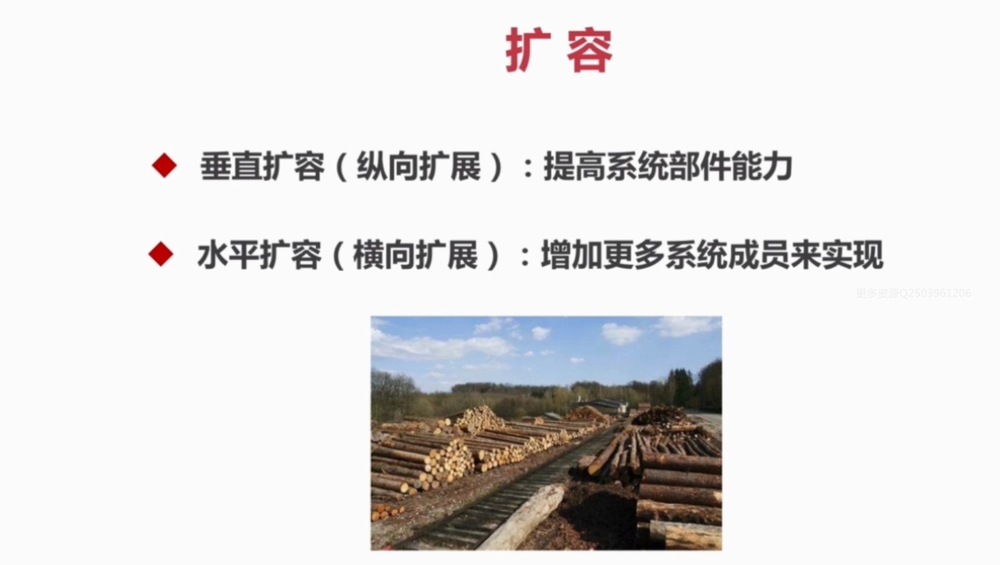
```
随着并发线程的增加，从几十到几百，几千，几万
垂直扩展：可能就得考虑给系统增内存
水平扩展：复杂一点可能要增服务器来分担压力
```


#### 缓存
##### 特征、场景及组件介绍
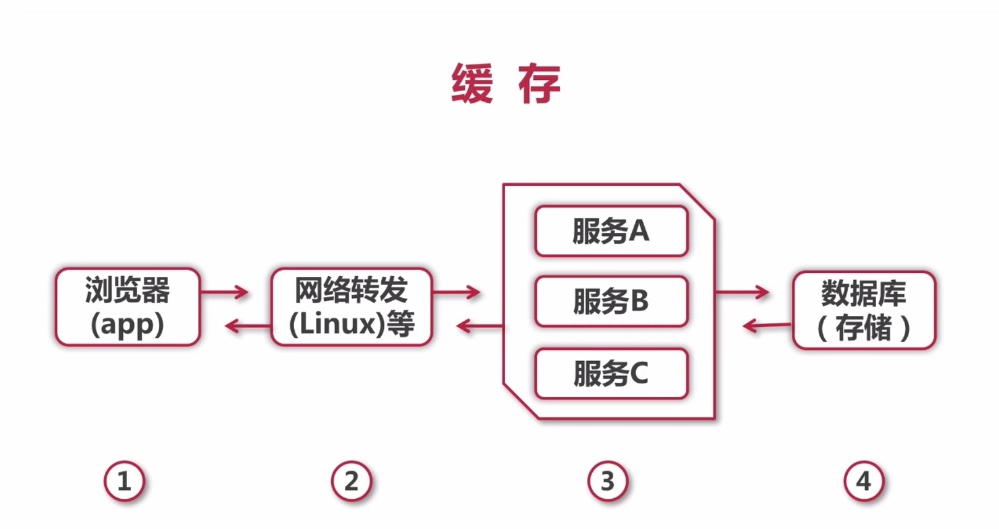


```
适合读多写少的场景，实时性越低越适合缓存

在相同key和请求数的情况下，缓存的时间越长命中率越高。缓存的粒度越小，命中率越高。
当缓存当个对象时，比如单个用户信息，只有当该对象对应的数据发生变化的时候我们才要更新缓存或者移除缓存。
而当缓存一个集合时，例如我们要缓存所有用户数据，期中任何一个对象当中的数据发生变化时，我们都要更新或移除缓存。
还有另一种情况，假设其他地方也要获取该对象对应的数据时，比如也要获取单个用户信息，如果缓存的是单个对象，那么就可以直接命中缓存，否则就无法直接命中。

此外，缓存的更新过期策略也直接影响到缓存的命中率，当数据发生变化时，直接更新缓存的值会比移除缓存或让缓存过期的命中率更高，当然这个时候的系统复杂度也会变得更高。

缓存的容量有限，就容易引起缓存失效和被淘汰，目前多数的缓存框架或中间件都采用LRU算法。
同时缓存的技术选型也是至关重要的，比如采用应用内置的本地缓存，比较容易出现单机瓶颈，而采用分布式缓存则容易拓展，所以需要做好系统容量规划，并考虑是否可拓展。
此外，不同的缓存框架和中间件的效率和稳定性也是存在一定的差异，还有一些会影响到缓存命中率的因素，
比如当缓存节点发生故障时，需要避免缓存失效并最大化程度降低影响，业内比较典型的做法就是通过一致性哈希算法或者节点冗余的方式来避免这个问题，并发越高，缓存的收益越高，即使缓存的时间很短。
需要应用尽可能的通过缓存来直接获取数据并避免缓存失效，尽可能的聚集在高频访问且时效性不高的热点业务上，通过缓存预加载，增加存储容量，调整缓存粒度，更新缓存等手段来提高命中率。
对于时效性很高或缓存空间有限的情况下内容跨度越大或者访问很随机并且访问量不高的业务来说，缓存命中率可能会长期的很低，可能预热后的缓存还没来得及访问就过期了。
```
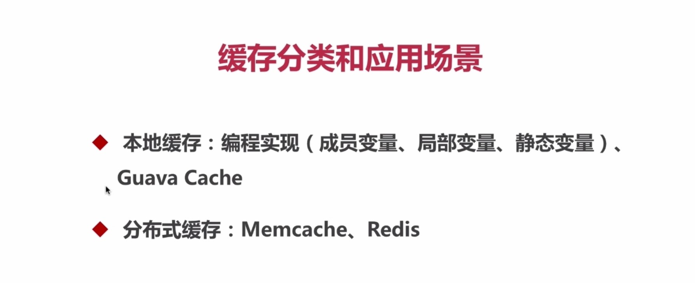
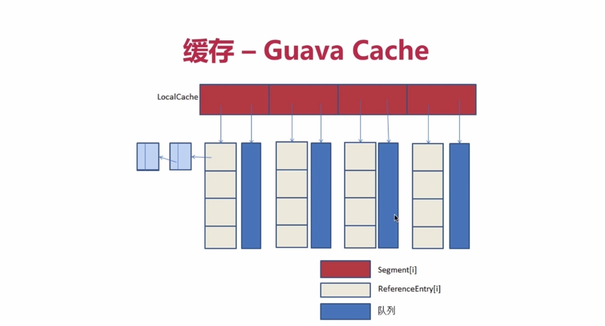
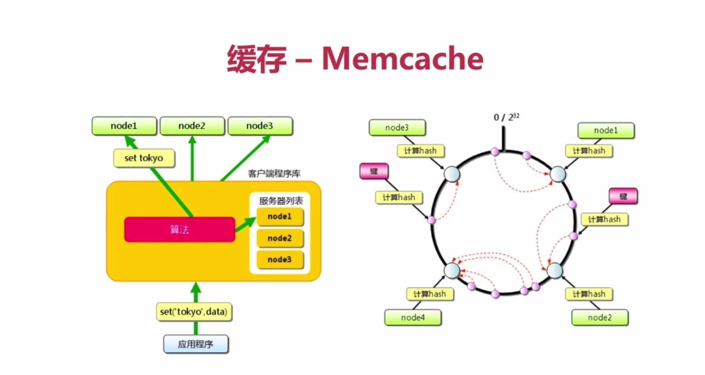
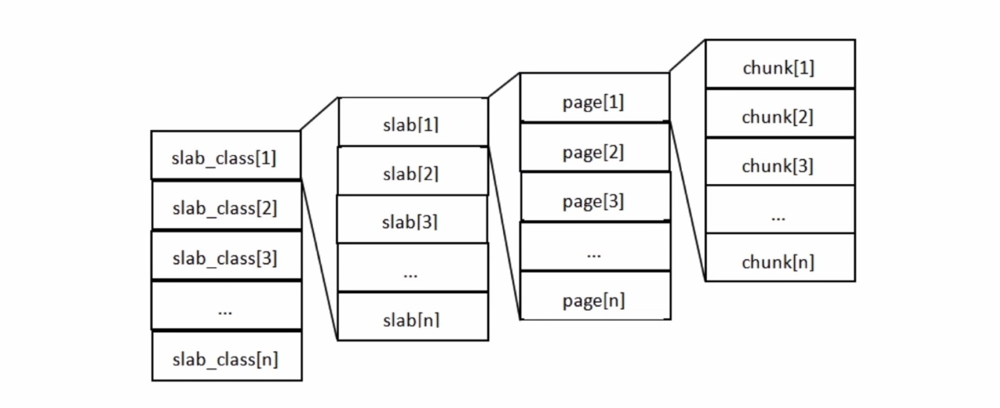
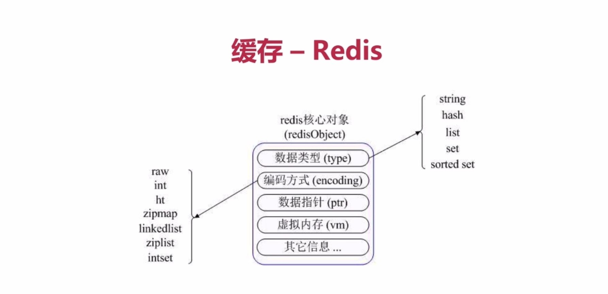
```
redis是远程内存数据库，非关系型数据库，性能强劲，具有复制特性，解决问题而生的独一无二的数据模型，存储键值对与5种不同类型的值之间的映射，可以将存储在内存的键值对数据持久化到硬盘，可以使用复制特性来拓展读性能，还可以使用客户端分片来拓展写性能。

特点：
支持数据的持久化，可以将数据保存到磁盘里，重启的时候可以再次加载进行使用，redis不仅支持简单的key,value数据，同时它还提供特殊类型的存储如：list，hash
支持数据的备份，即master slave模式（主从数据备份）
性能极高：读的速度 11万次/s  写的速度  81000次/s
丰富的数据类型
原子性
支持对多个操作后的原子性执行
支持publish,subscribe，key过期等等特性

场景：
取最新n个操作；排行榜（取top N 操作）精准设置过期的应用；应用于计数器；做唯一性检查的操作；实时系统；队列系统
```

#### 高并发场景问题及实战讲解

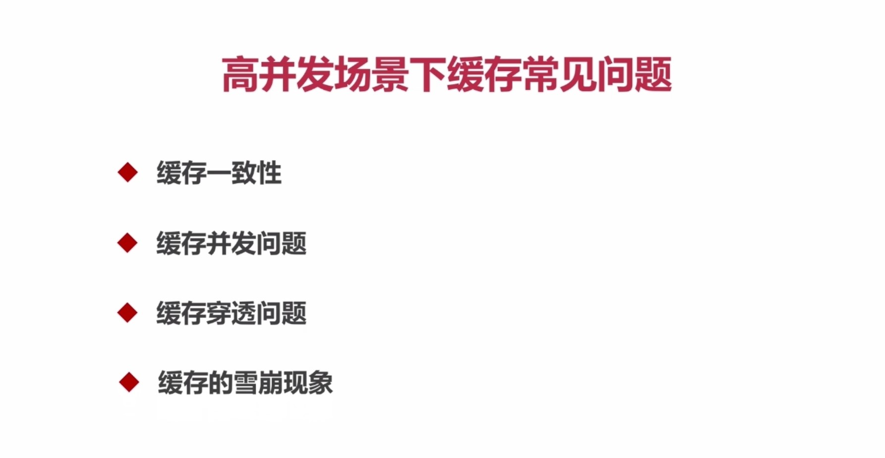
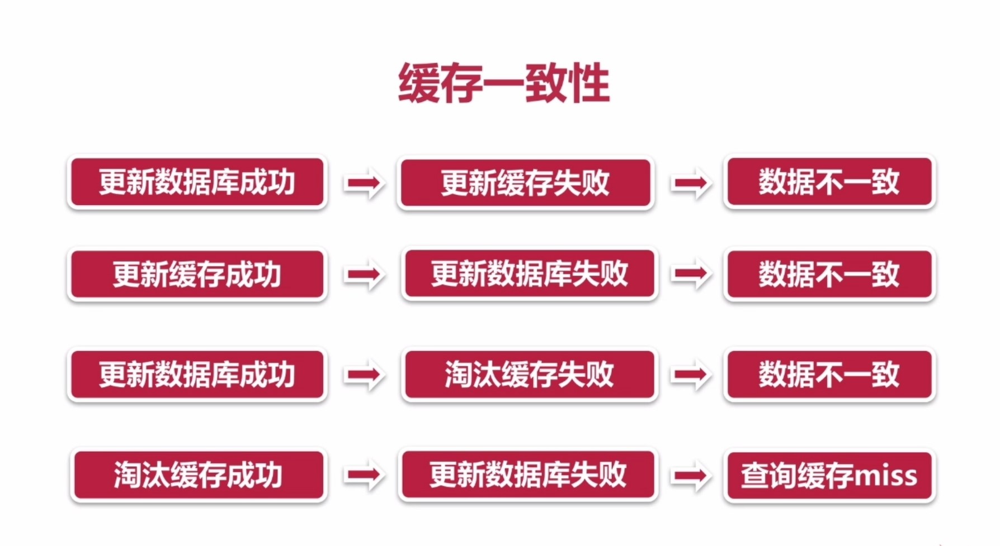
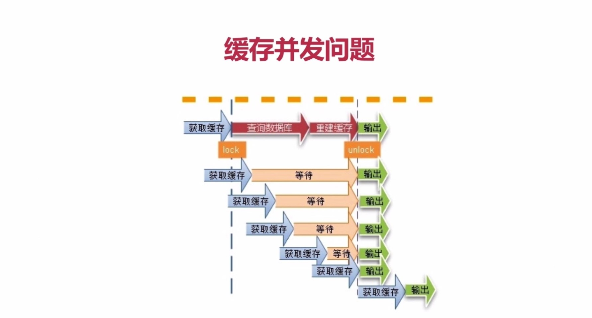
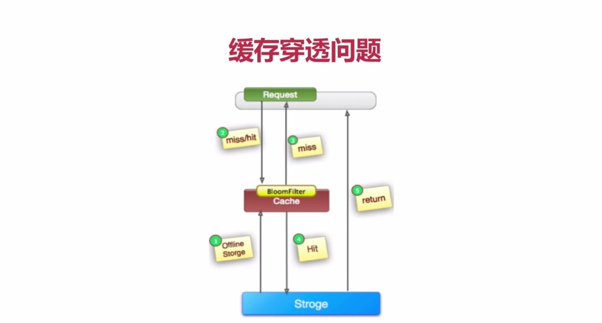

```
在高并发的场景下，如果某个key被高并发的访问，没有被命中，出于对容错性的考虑，可以尝试去后端数据库获取，从而达到了大量请求到达数据库，而当该key对应的数据本身就是空的情况下，这就导致数据库中并发的执行了很多不必要的查询操作，从而导致了巨大的冲击和压力。
我们可以缓存空对象，对查询结果为空的对象也进行缓存，如果是集合的话，可以缓存一个空的集合，但不是null，如果是缓存单个对象，则可以通过字段标识来区分，避免请求穿透到后端数据库，同时也需要保证缓存数据的时效性，这种方式实现起来成本较低，比较适合命中不高，但比较频繁更新的数据。
单独过滤处理，对所有可能对应数据为空的key进行统一的存放，并在请求前做拦截，这样避免请求穿透到后端的数据库，这种方式实现起来相对复杂一些，比较适合命中不高但是更新不频繁的数据。
```

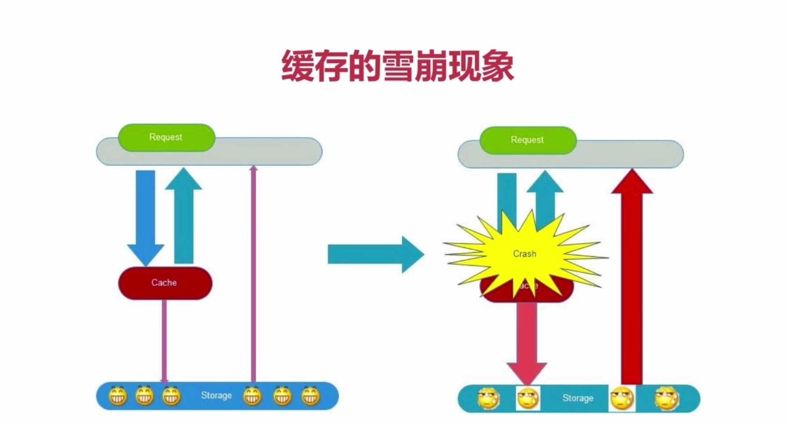
```
由于缓存的原因导致大量的请求到达后端数据库而导致数据库奔溃整个系统奔溃发生灾难。
导致的原因有很多种，比如提到的缓存并发，缓存穿透，缓存抖动，都有可能造成缓存雪崩的现象。
这些问题也可能被恶意攻击者利用，还有一种情况，例如某个时间点内，系统预加载的缓存周期性的集中失效了，也有可能导致雪崩。
为了避免这种周期性的失效，可以通过设置不同的过期时间来错开他们的缓存过期时间，从而避免缓存集中失效。
从应用架构角度，我们可以通过限流，降级，熔断等手段来降低影响，也可以通过多级缓存来避免这种灾难。
此外，从整个研发体系流程角度，应该多加强压力测试，尽量模拟真实场景，尽早暴露问题，从而进行防范。
```


参考:  
[http://www.imooc.com/article/20918](http://www.imooc.com/article/20918)

#### 消息队列
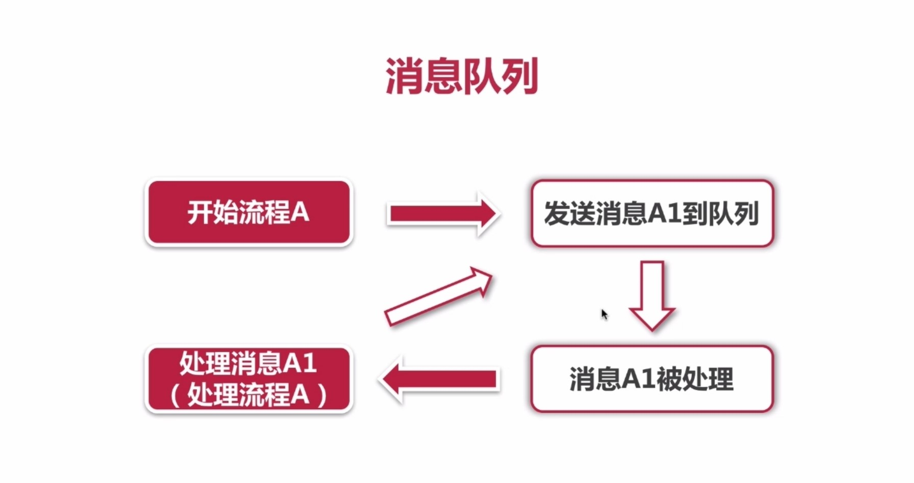
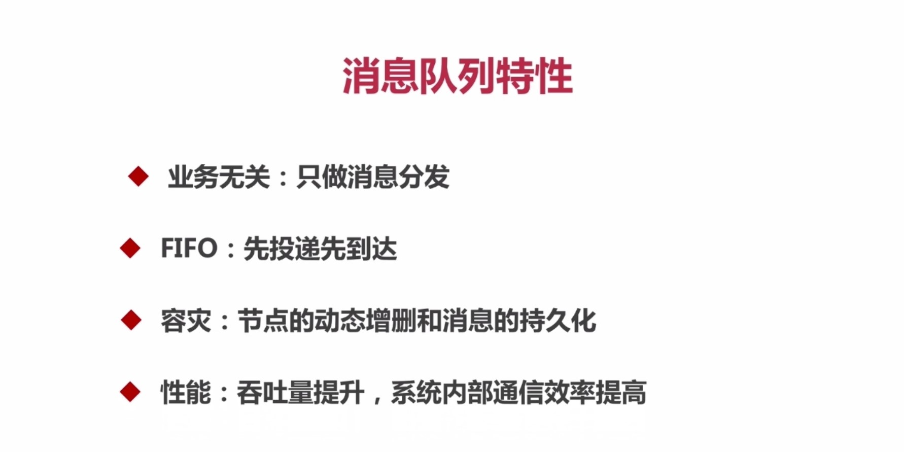

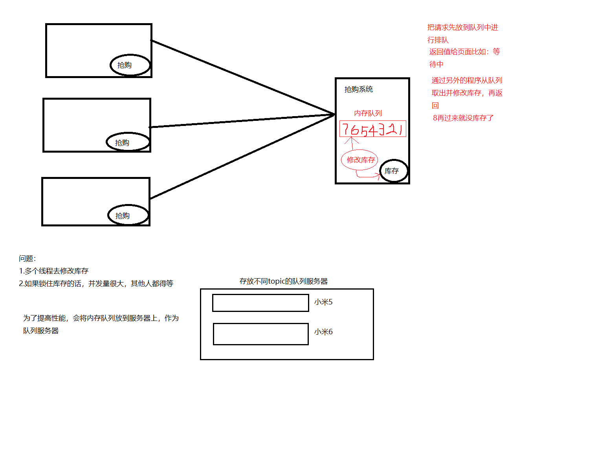
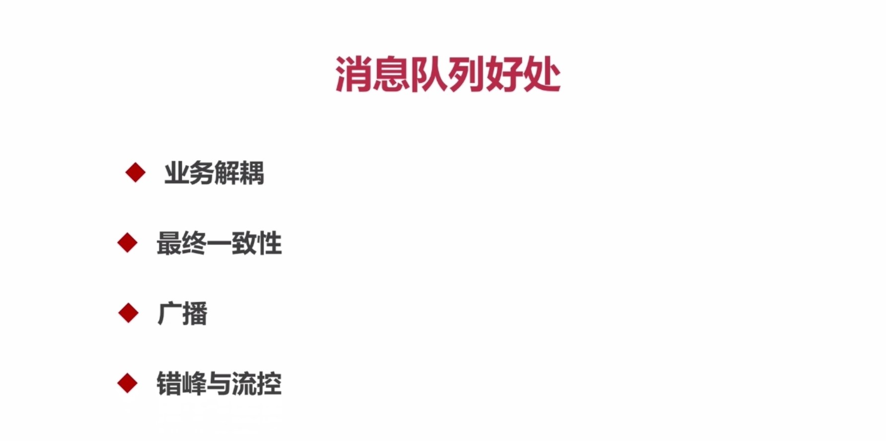
##### 业务解耦
```
所谓解耦，本质上讲的就是一个事务只关心简单的流程，而需要依赖其它的系统但不那么重要的事情，有通知即可无需等待结果。
基于消息的模型关心的是通知，不是处理。
如：对于订单系统，用户支付成功之后，我们可能需要给用户发送一条短信通知。但其实呢，这已经不是系统的核心流程了。
如果外部系统偏慢，比如短信网关速度不好，那么主流程的时间就会加强很多，用户肯定不想点击支付之后几分钟才看到结果，那么我们只需通知短信系统我们支付成功了，去发送短信通知就好了，并不一定要等待它处理完成才结束。
```
##### 最终一致性
```
指的是两个系统的状态保持一致，要么都成功，要么都失败。当然了，有个时间限制，理论上是越快越好。但实际上各种异常的情况下，可能会有一定的延迟达到最终的一致状态。
但最后两个系统的状态还是要一样的。
如：转账功能，A系统扣钱成功，B系统加钱一定也要成功。反之，它们就一起回滚，像什么都没发生一样，然而这个过程中存在很多可能的意外，比如：
1.A系统扣钱成功，调用B系统加钱失效
2.A扣钱成功，调用B系统加钱接口虽然成功，但是获取最终结果的时候网络异常引起的超时
3.A扣钱成功，但B系统加钱失效了，A系统想回滚刚才扣除的钱，但是系统宕机了，无法回滚
通过这三个场景，我们看出了想把这件看似简单的事情做成真的不容易，所有跨JVM一致性的问题，从技术的角度讲，通用的解决方法包括两个：
1.强一致性
分布式事务，落地太难，而且成本太高，我们就不做具体介绍了。
2.最终一致性
也是消息队列可以使用的场景，主要是用记录和补偿的方式来处理，在做所有的不确定事情之前，先把事情记录下来，然后去做不确定的事，它的结果通常分三种：成功/失败/不确定（超时等等可以等价为失败）
如果是成功的话，就可以把我们记录的东西清理掉，对于失败和不确定，我们可以依靠定时任务等方式把所有失败的事情重新做一遍，知道成功为止。
系统在A扣钱成功的情况下，需要给B通知的这件事情记录在库中，为了保证最高的可靠性，也可以把通知B系统加钱和扣钱成功这两件事情维护在一个本地事务里面。
通知成功，则删除这条记录，通知失败或不确定则依靠定时任务可尝试地通知我们，直到我们把状态更加为正确的为止。这时，可能会遇到重复消息的问题，需要处理消息的地方做好幂等操作。
最终一致性不是消息队列必备的特性。但确实可以依靠队列来做最终一致性的事情。需要注意的是，像kafka等消息队列，它的设计层面上有丢消息的可能，比如定时刷盘，如果掉列会丢消息的可能等等。
哪怕只丢千分之一的消息，业务也要通过其它手段来保证结果的正确。
```
##### 广播
```
如果没有队列，每当一个新的业务方介入，我们都要联调一次新接口，有了消息队列，我们只需要关心消息是否达到消息队列，新接入的接口订阅相关的消息，自己去做处理就可以了。
```
##### 错峰和流控
```
上下游对性能处理能力是不同的，比如：Web前端每秒承受上千万的请求并不是什么神奇的事情，只需要多加一点机器，再搭建一些LVS负载均衡设备和nginx服务器即可。
但是，数据库处理却是十分有限，即使使用了SSD加上分库分表单机处理能力仍然有限，出于成本考虑，我们不能奢求数据库的机器数量追上前端。这种问题同样出现于系统和系统之间，
比如短信系统可能由于短板效应，速度卡在网关上，比如每秒几百次请求，它跟前端的并发量不是一个数量级的，但是，用户晚个半分钟左右收到短信一般也不会有太大问题，如果没有消息队列，
两个系统之间通过协商，滑动窗口等方案也不是不能实现。但是，系统的复杂性将会成指数性增长。势必在上游或下游做些存储，并且要处理定时、阻塞等一些列问题，
而且每当处理能力有些差异的时候，都需要单独开发一套逻辑来维护这套逻辑。所以，利用中间系统，如消息队列转储两个系统的消息内容，并在下游系统有能力处理这些消息的时候再处理，是一套相对比较通用的方式。
总而言之，对于需要强事务保证，而且延迟很敏感的，RPC是优于队列的，对于一些无关痛痒或者一些对于别人很重要，但对于自己不是那么关心的事情可以利用消息队列去做。
支持最终一致性的消息队列能够用来处理延迟不那么敏感的分布式事务场景，而且相对于笨重的分布式事务可能是更优的处理方式。
```

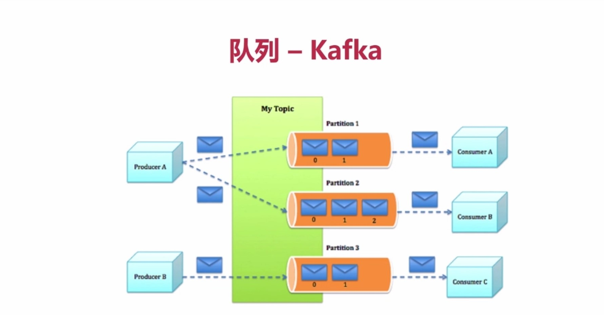
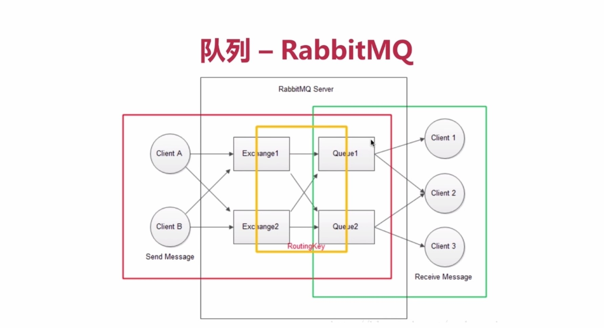

##### 应用拆分


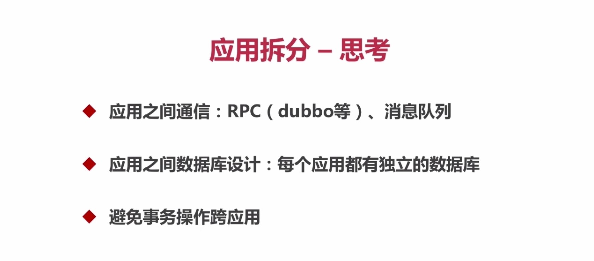

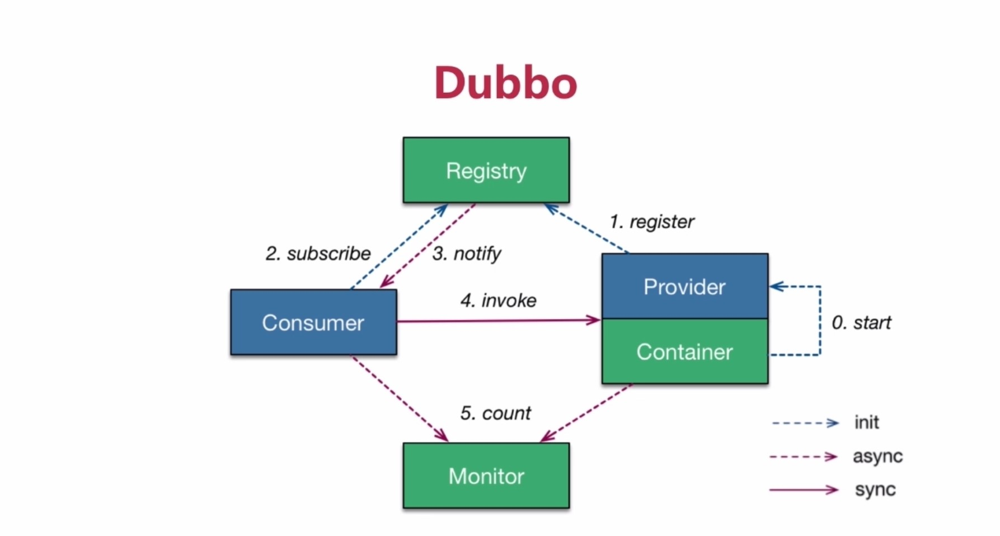
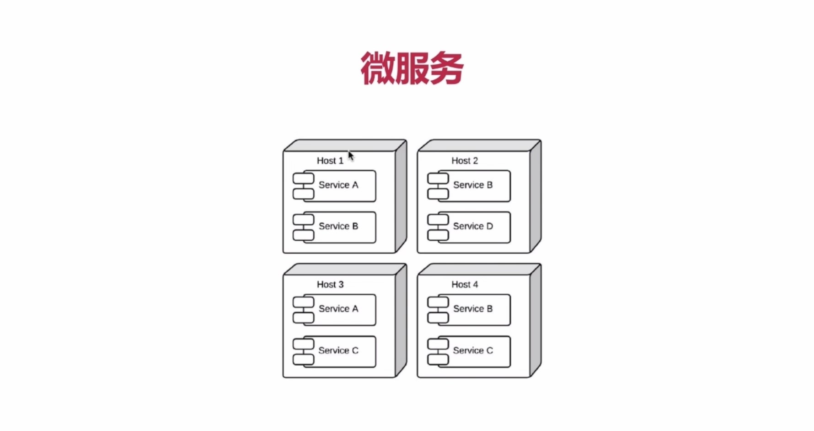
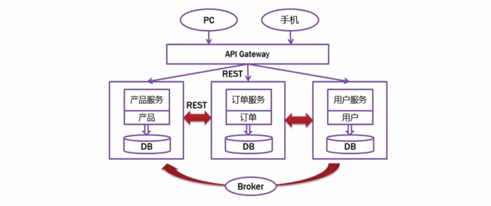

##### 应用限流

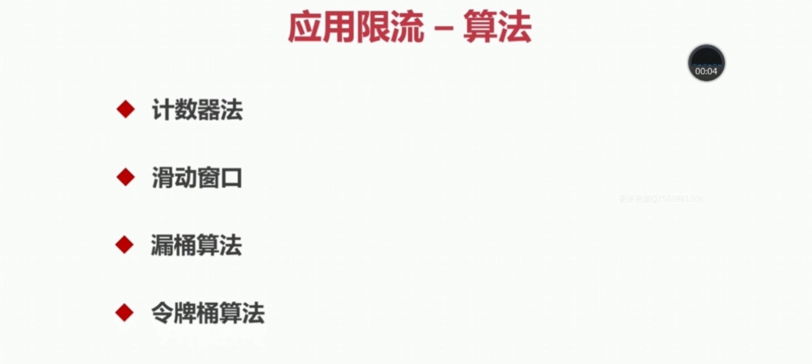
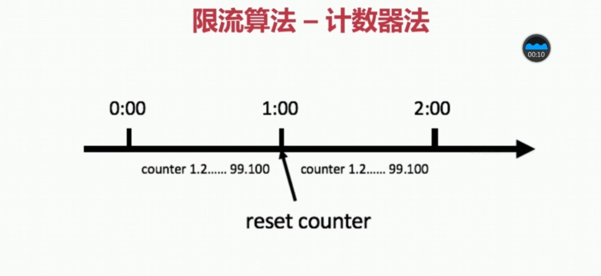
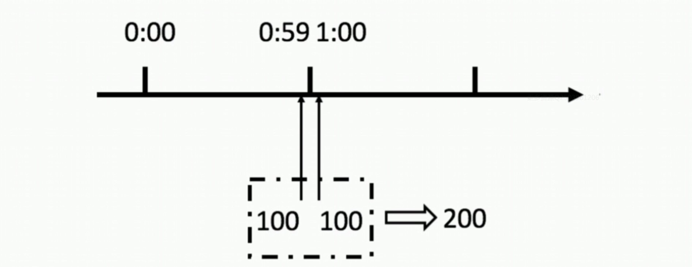
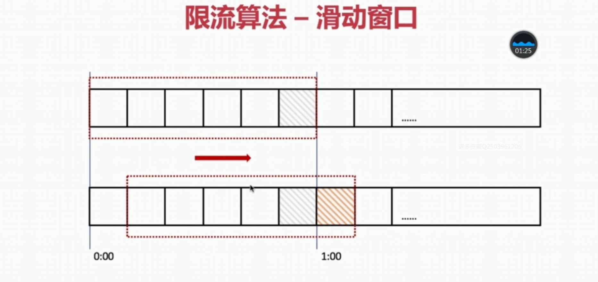
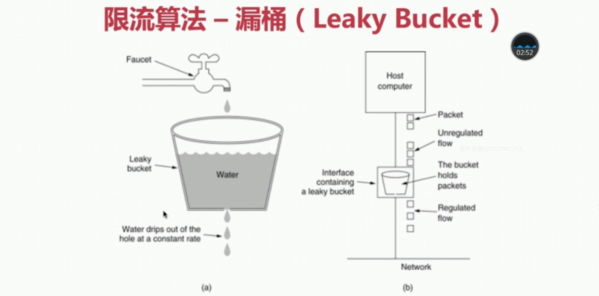
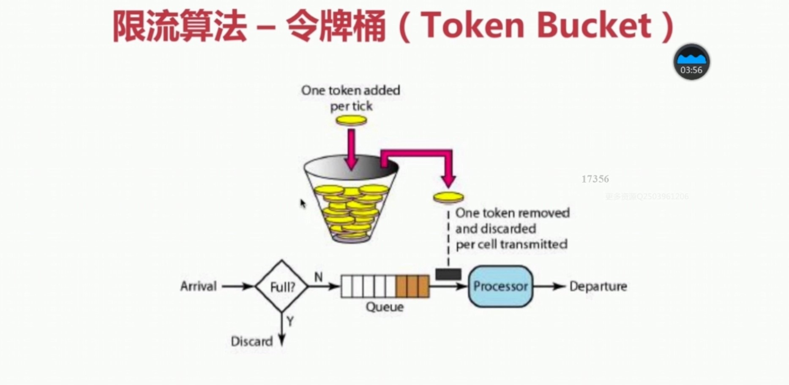

##### 服务降级与服务熔断

```
对一些服务，界面有策略地降级以此缓解保证了部分甚至大部分客户能得到正确的响应，
简单来说，如果当前请求处理不了了或者出错了，我给一个默认的返回，根据不同的接口做不同的默认返回和定制
```
```
熔断是指软件系统里由于某些原因使得服务出现了过载的现象，为了防止整个系统出现故障，从而采用的一种保护措施，所以很多地方也把熔断称为过载保护
```

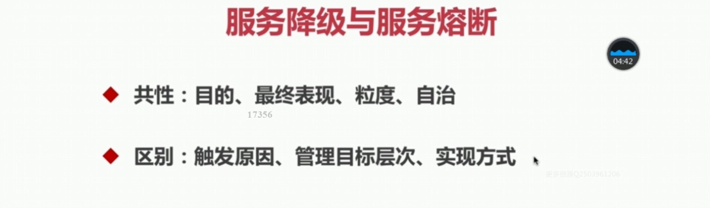
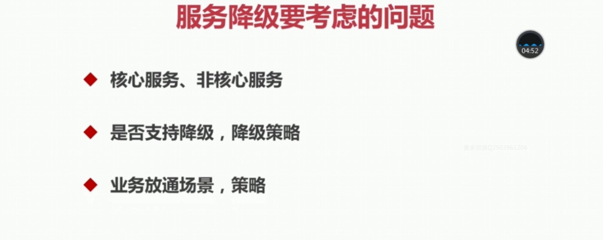
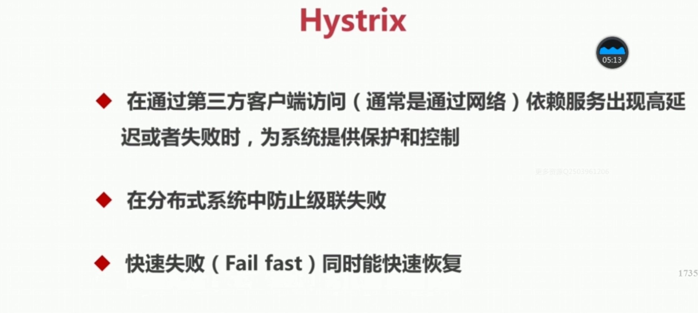

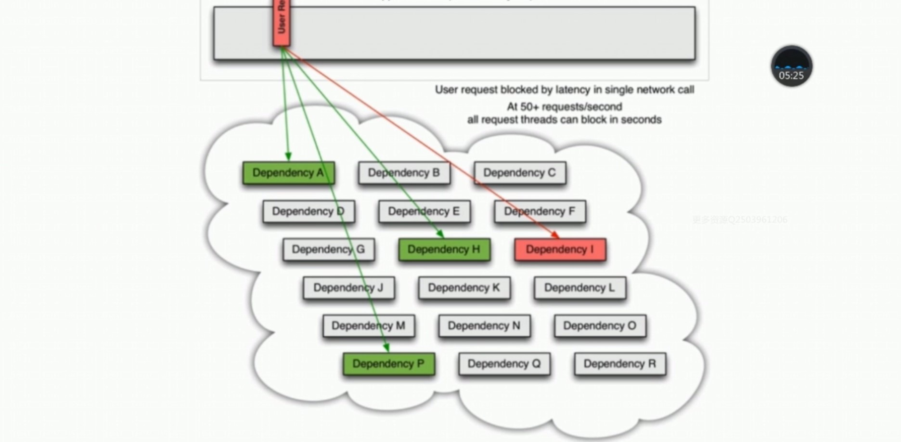
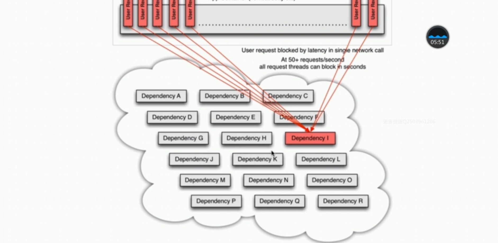

##### 数据库切库、分库、分表
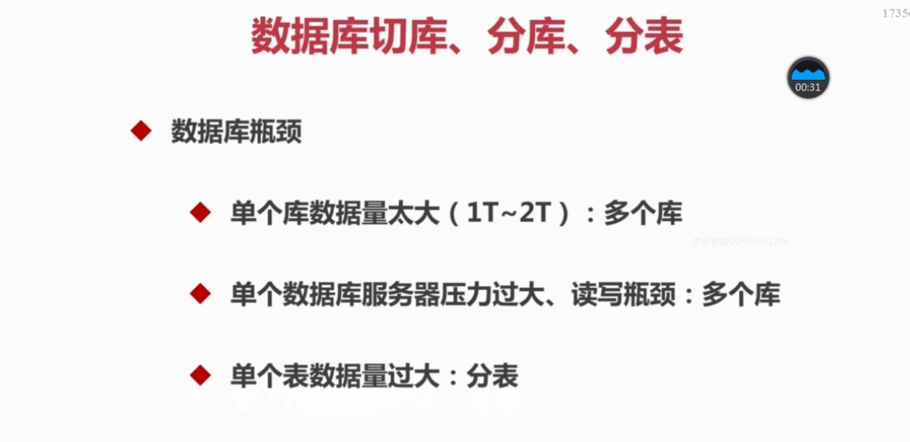

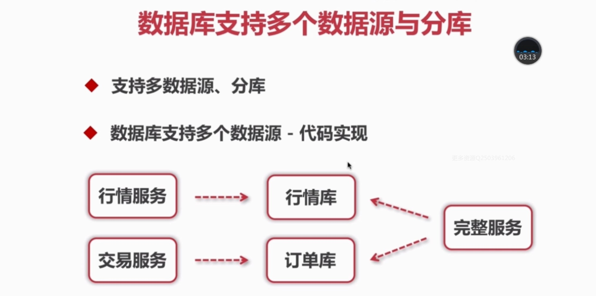
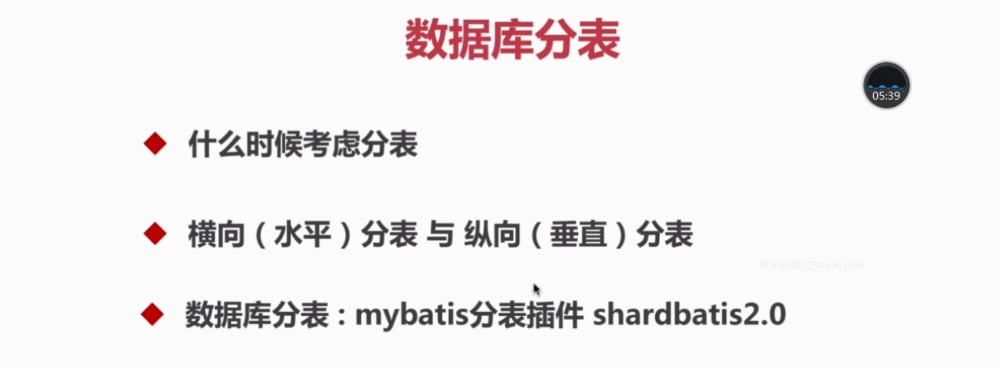
