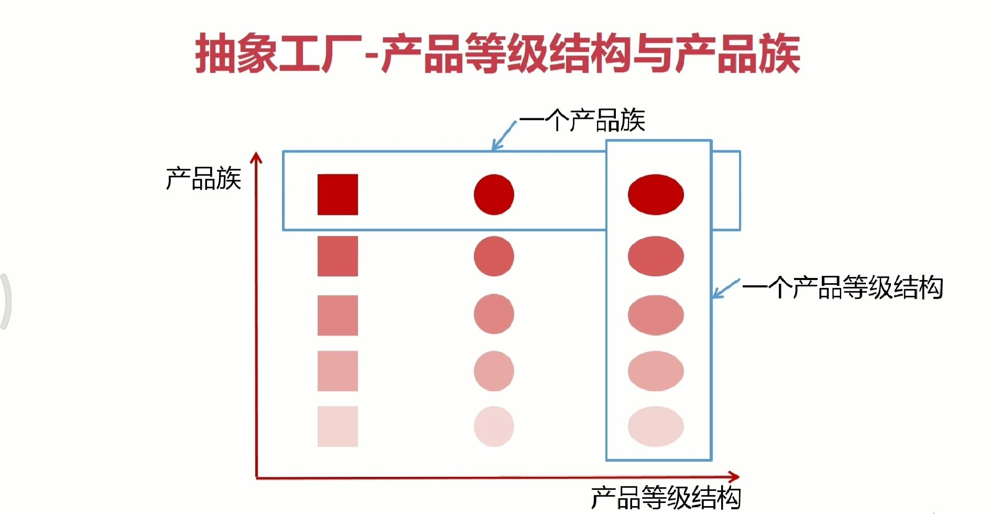
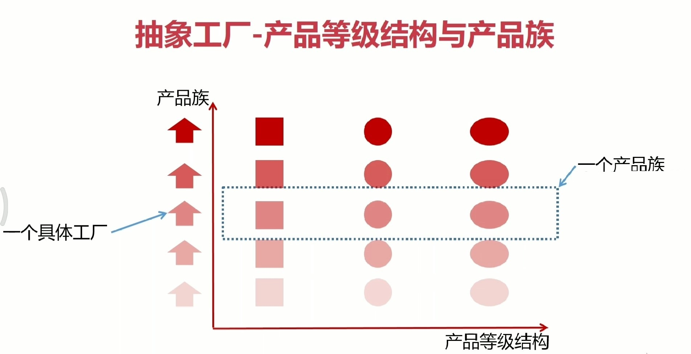
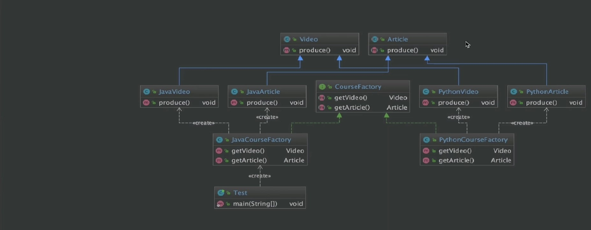
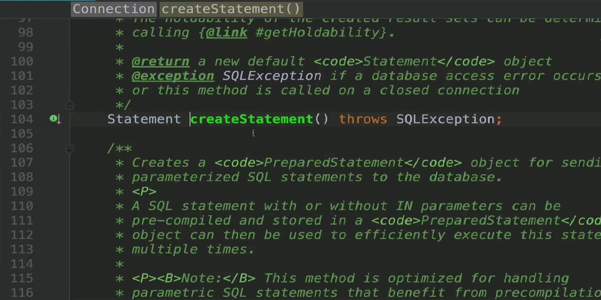
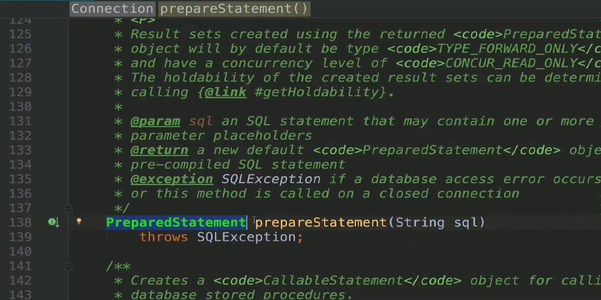
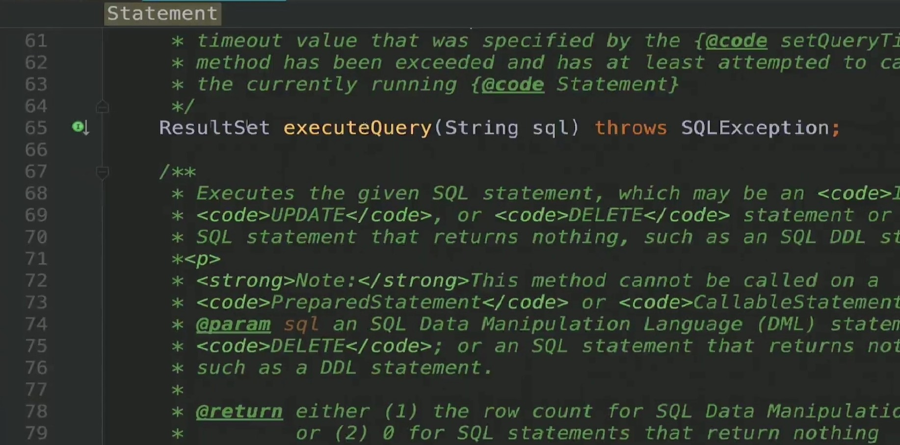
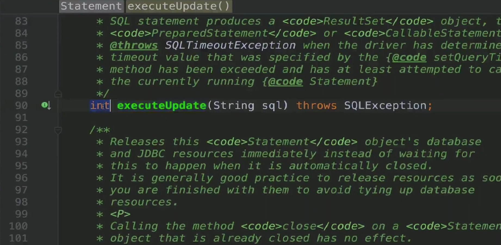
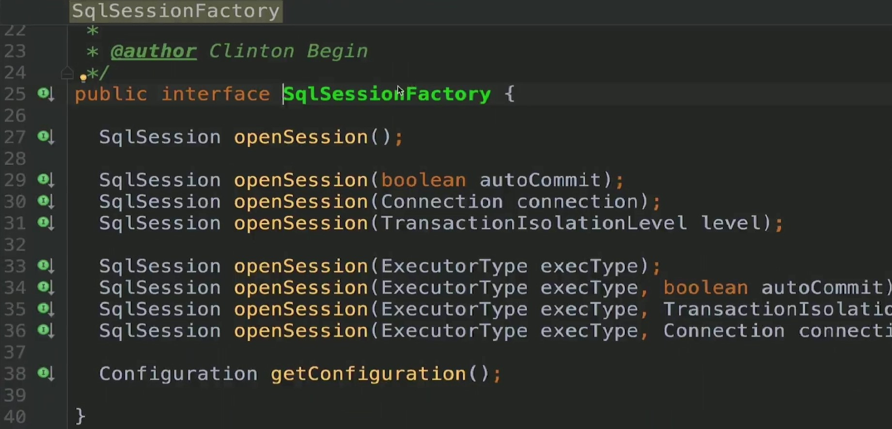

### 定义与类型
定义:抽象工厂模式提供一个创建一系列相关或相互依赖对象的接口，无须指定它们具体的类
类型:创建型
### 适用场景
- 客户端(应用层)不依赖于产品类实例如何被创建、实现等细节
- 强调一系列相关的产品对象(属于同一产品族)一起使用创建对象需要大量重复的代码
- 提供一个产品类的库，所有的产品以同样的接口出现，从而使客户端不依赖于具体实现

### 优点
- 具体产品在应用层代码隔离，无须关心创建细节
- 将一个系列的产品族统一到一起创建

### 缺点
- 规定了所有可能被创建的产品集合，产品族中扩展新的产品困难，需要修改抽象工厂的接口
- 增加了系统的抽象性和理解难度




### Coding
```java
public abstract class Video {
    public abstract void produce();

}
```
```java
public abstract class Article {
    public abstract void produce();
}
```
```java
public interface CourseFactory {
    Video getVideo();
    Article getArticle();
}
```
```java
public class JavaVideo extends Video {
    @Override
    public void produce() {
        System.out.println("录制Java课程视频");
    }
}
```
```java
public class JavaArticle extends Article {
    @Override
    public void produce() {
        System.out.println("编写Java课程手记");
    }
}
```
```java
public class JavaCourseFactory implements CourseFactory {
    @Override
    public Video getVideo() {
        return new JavaVideo();
    }

    @Override
    public Article getArticle() {
        return new JavaArticle();
    }
}
```
```java
public class PythonVideo extends Video {
    @Override
    public void produce() {
        System.out.println("录制Python课程视频");
    }
}
```
```java
public class PythonArticle extends Article {
    @Override
    public void produce() {
        System.out.println("编写Python课程手记");
    }
}
```
```java
public class PythonCourseFactory implements CourseFactory {
    @Override
    public Video getVideo() {
        return new PythonVideo();
    }

    @Override
    public Article getArticle() {
        return new PythonArticle();
    }
}
```
```java
public class Test {
    public static void main(String[] args) {
        CourseFactory courseFactory = new JavaCourseFactory();
        Video video = courseFactory.getVideo();
        Article article = courseFactory.getArticle();
        video.produce();
        article.produce();
    }
}
```
### UML


### 源码解析




