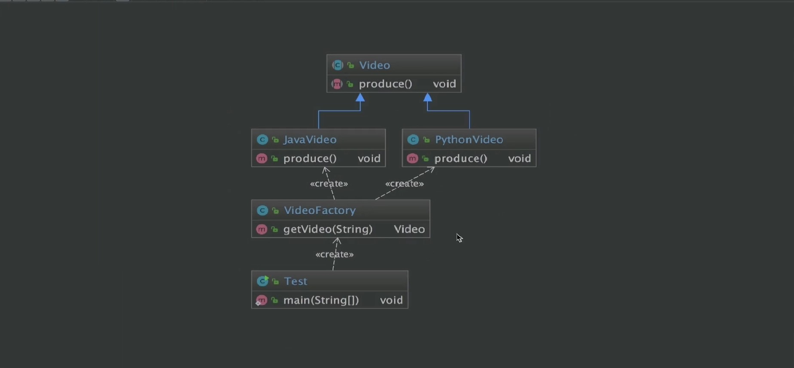
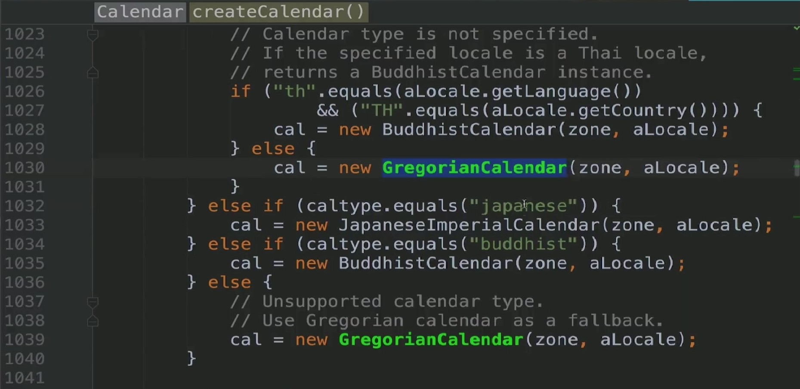
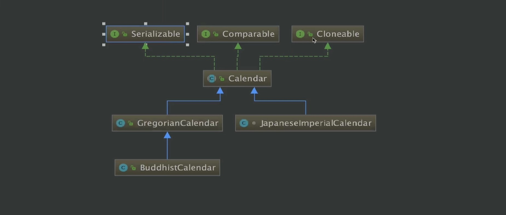
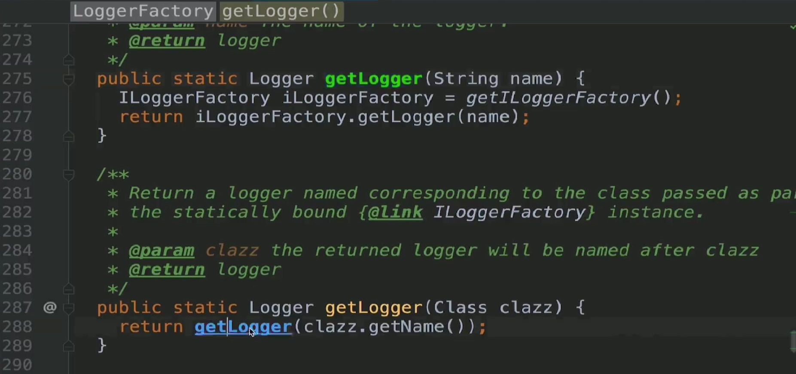
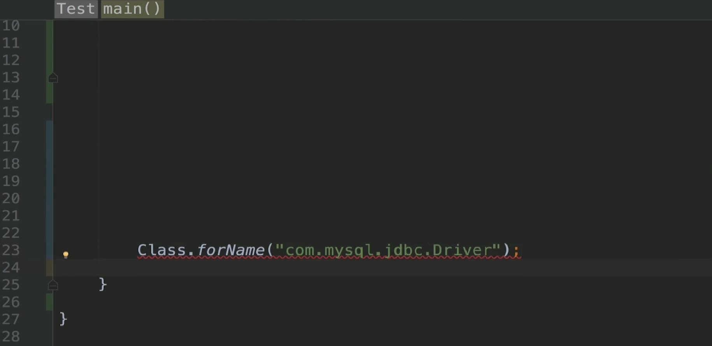

### 定义与类型
定义:由一个工厂对象决定创建出哪一类产品类的实例  
类型:创建型，但不属于GOF23种设计模式
### 适用场景
- 工厂类负责的对象比较少
- 客户端(应用层)只知道传入工厂类的参数对于如何创建对象（逻辑）不关心

### 优点
- 只需要传入一个正确的参数，就可以获取你所需要的对象而无须知道其创建细节

### 缺点
- 工厂类的职责相对过重，增加新的产品需要修改工厂类的判断逻辑，违背开闭原则

### Coding
```java
public abstract class Video {
    public abstract void produce();
}
```
```java
public class JavaVideo extends Video {
    @Override
    public void produce() {
        System.out.println("录制Java课程视频");
    }
}
```
```java
public class PythonVideo extends Video {
    @Override
    public void produce() {
        System.out.println("录制Python课程视频");
    }
}
```
```java
public class VideoFactory {
    public Video getVideo(Class c){
        Video video = null;
        try {
            video = (Video) Class.forName(c.getName()).newInstance();
        } catch (InstantiationException e) {
            e.printStackTrace();
        } catch (IllegalAccessException e) {
            e.printStackTrace();
        } catch (ClassNotFoundException e) {
            e.printStackTrace();
        }
        return video;
    }

    public Video getVideo(String type){
        if("java".equalsIgnoreCase(type)){
            return new JavaVideo();
        }else if("python".equalsIgnoreCase(type)){
            return new PythonVideo();
        }
        return null;
    }
}
```
```java
public class Test {
    public static void main(String[] args) {
//        VideoFactory videoFactory = new VideoFactory();
//        Video video = videoFactory.getVideo("java");
//        if(video == null){
//            return;
//        }
//        video.produce();

        VideoFactory videoFactory = new VideoFactory();
        Video video = videoFactory.getVideo(JavaVideo.class);
        if(video == null){
            return;
        }
        video.produce();
    }
}
```
### UML


### 源码解析




