### 定义与类型
定义:将一个复杂对象的构建与它的表示分离，使得同样的构建过程可以创建不同的表示，用户只需指定需要建造的类型就可以得到它们，建造过程及细节不需要知道
类型:创建型
### 适用场景
- 如果一个对象有非常复杂的内部结构(很多属性)
- 想把复杂对象的创建和使用分离

### 优点
- 封装性好，创建和使用分离
- 扩展性好、建造类之间独立、一定程度上解耦

### 缺点
- 产生多余的Builder对象
- 产品内部发生变化，建造者都要修改，成本较大

### Coding
V1:  
```java
@Data
@ToString
public class Course {
    private String courseName;
    private String coursePPT;
    private String courseVideo;
    private String courseArticle;

    //question & answer
    private String courseQA;
}
```
```java
public abstract class CourseBuilder {

    public abstract void buildCourseName(String courseName);
    public abstract void buildCoursePPT(String coursePPT);
    public abstract void buildCourseVideo(String courseVideo);
    public abstract void buildCourseArticle(String courseArticle);
    public abstract void buildCourseQA(String courseQA);

    public abstract Course makeCourse();
}
```
```java
public class CourseActualBuilder extends CourseBuilder {

    private Course course = new Course();


    @Override
    public void buildCourseName(String courseName) {
        course.setCourseName(courseName);
    }

    @Override
    public void buildCoursePPT(String coursePPT) {
        course.setCoursePPT(coursePPT);
    }

    @Override
    public void buildCourseVideo(String courseVideo) {
        course.setCourseVideo(courseVideo);
    }

    @Override
    public void buildCourseArticle(String courseArticle) {
        course.setCourseArticle(courseArticle);
    }

    @Override
    public void buildCourseQA(String courseQA) {
        course.setCourseQA(courseQA);
    }

    @Override
    public Course makeCourse() {
        return course;
    }
}
```
```java
public class Coach {
    private CourseBuilder courseBuilder;

    public void setCourseBuilder(CourseBuilder courseBuilder) {
        this.courseBuilder = courseBuilder;
    }

    public Course makeCourse(String courseName,String coursePPT,
                             String courseVideo,String courseArticle,
                             String courseQA){
        this.courseBuilder.buildCourseName(courseName);
        this.courseBuilder.buildCoursePPT(coursePPT);
        this.courseBuilder.buildCourseVideo(courseVideo);
        this.courseBuilder.buildCourseArticle(courseArticle);
        this.courseBuilder.buildCourseQA(courseQA);
        return this.courseBuilder.makeCourse();
    }
}
```
```java
public class Test {
    public static void main(String[] args) {
        CourseBuilder courseBuilder = new CourseActualBuilder();
        Coach coach = new Coach();
        coach.setCourseBuilder(courseBuilder);

        Course course = coach.makeCourse("Java设计模式精讲",
                "Java设计模式精讲PPT",
                "Java设计模式精讲视频",
                "Java设计模式精讲手记",
                "Java设计模式精讲问答");
        System.out.println(course);
    }
}
```
V2:  
```java
public class Course {

    private String courseName;
    private String coursePPT;
    private String courseVideo;
    private String courseArticle;

    //question & answer
    private String courseQA;

    public Course(CourseBuilder courseBuilder) {
        this.courseName = courseBuilder.courseName;
        this.coursePPT = courseBuilder.coursePPT;
        this.courseVideo = courseBuilder.courseVideo;
        this.courseArticle = courseBuilder.courseArticle;
        this.courseQA = courseBuilder.courseQA;
    }


    @Override
    public String toString() {
        return "Course{" +
                "courseName='" + courseName + '\'' +
                ", coursePPT='" + coursePPT + '\'' +
                ", courseVideo='" + courseVideo + '\'' +
                ", courseArticle='" + courseArticle + '\'' +
                ", courseQA='" + courseQA + '\'' +
                '}';
    }

    public static class CourseBuilder{
        private String courseName;
        private String coursePPT;
        private String courseVideo;
        private String courseArticle;

        //question & answer
        private String courseQA;

        public CourseBuilder buildCourseName(String courseName){
            this.courseName = courseName;
            return this;
        }


        public CourseBuilder buildCoursePPT(String coursePPT) {
            this.coursePPT = coursePPT;
            return this;
        }

        public CourseBuilder buildCourseVideo(String courseVideo) {
            this.courseVideo = courseVideo;
            return this;
        }

        public CourseBuilder buildCourseArticle(String courseArticle) {
            this.courseArticle = courseArticle;
            return this;
        }

        public CourseBuilder buildCourseQA(String courseQA) {
            this.courseQA = courseQA;
            return this;
        }

        public Course build(){
            return new Course(this);
        }
    }
}
```

### UML
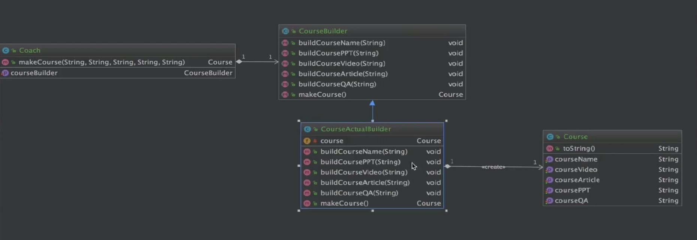
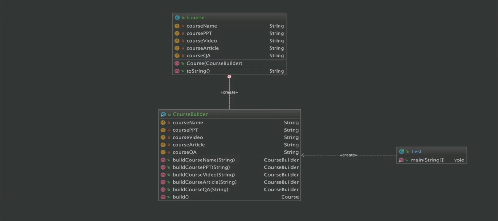

### 源码解析

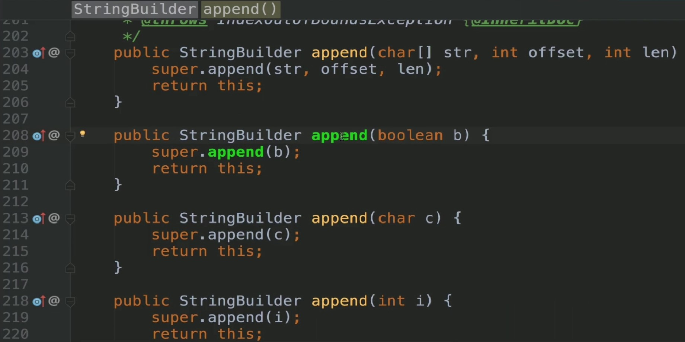
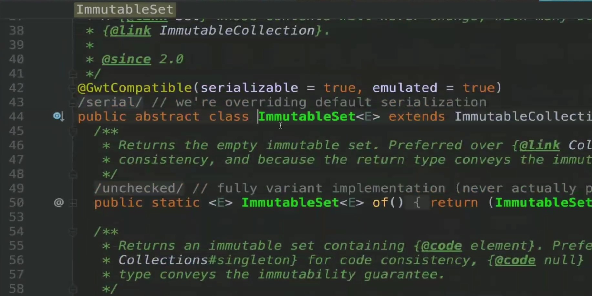
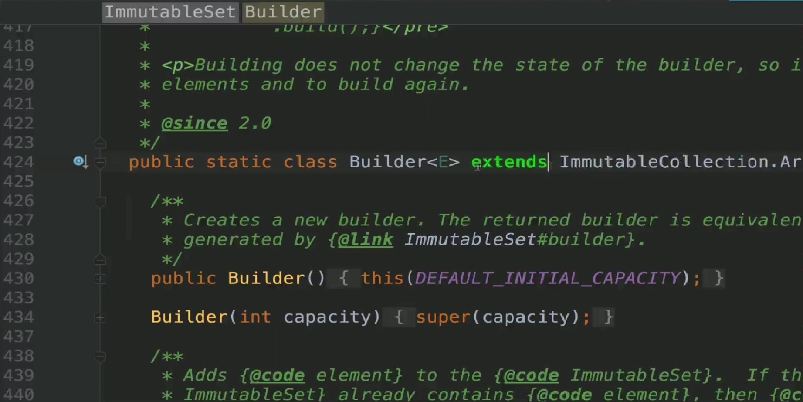
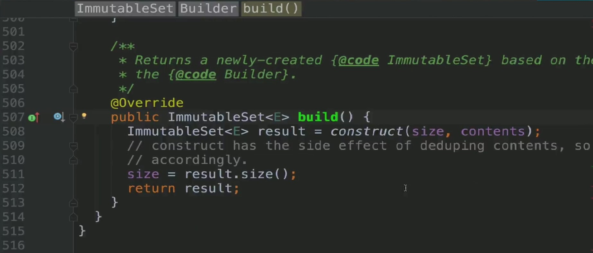
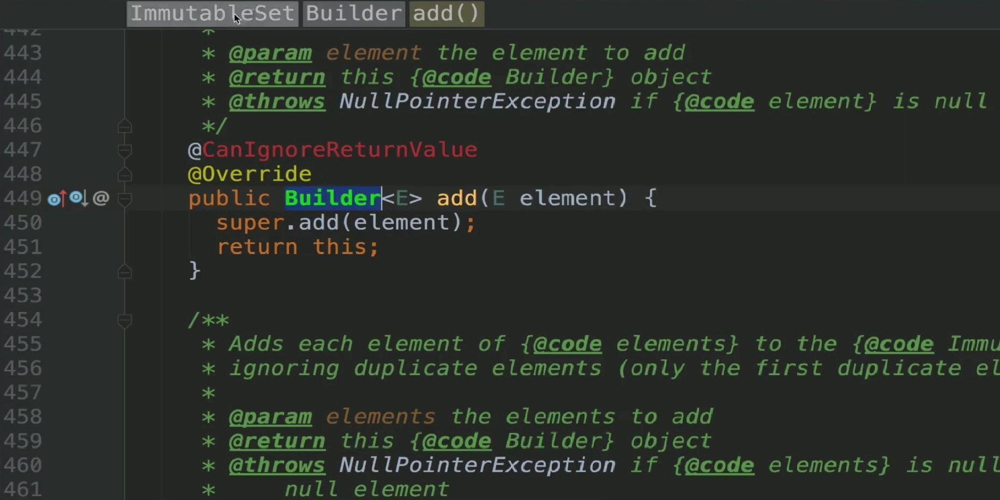
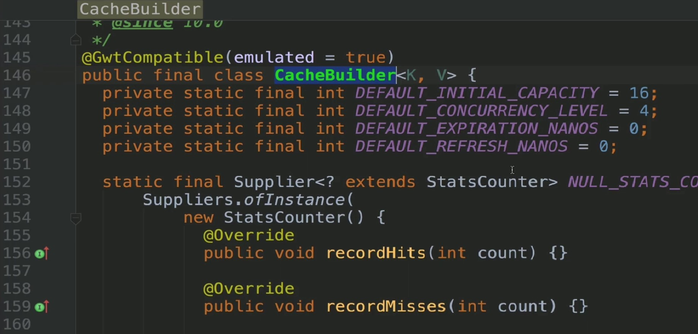
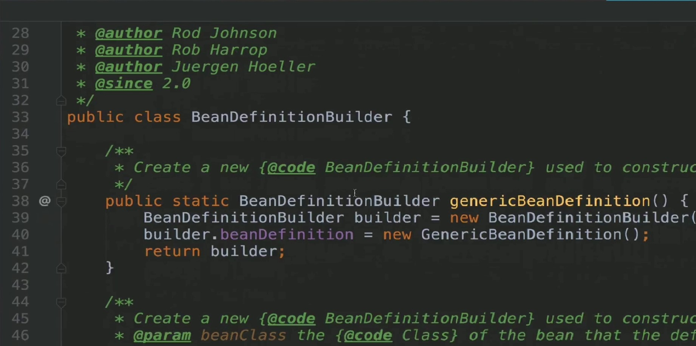
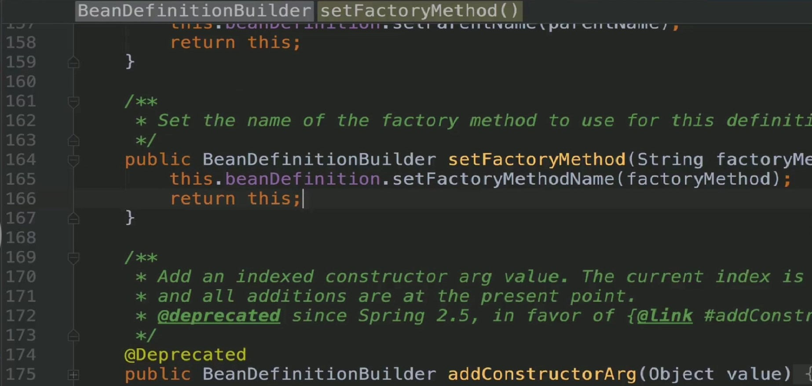
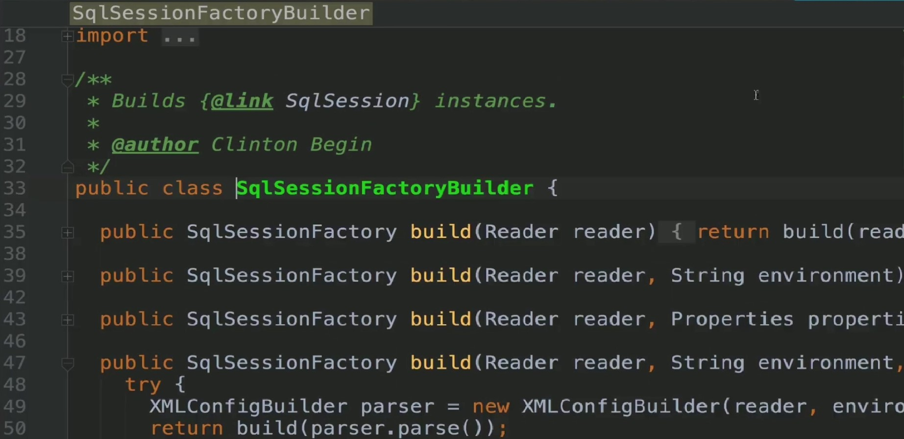
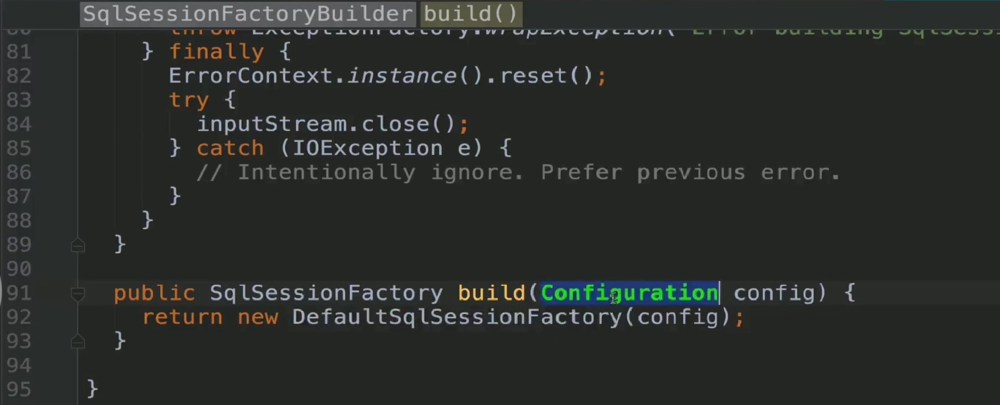