# 【问题】Jpa内存泄漏
## 问题背景
2022年12月底中午12点08分，收到业务方反馈，商品服务接口延迟增大，后续服务发生了重启。  
## 问题定位  
1. 检查是否有突发流量  
   流量并未骤增，与日常访问量基本一致  
2. 检查服务资源是否正常  
   商品服务CPU偏高、JVM堆满了、频繁FullGC  
3. 检查数据库、中间件资源是否正常，是否存在慢日志、慢sql、阻塞等情况  
   资源正常、没有明显的慢日志、慢sql、阻塞情况  
4. 检查异常日志  
   日志里查看到OOM的打印  
   通过上面的排查，基本可以把问题锁定在商品服务堆内存溢出导致的  

## 问题分析
定位到是内存溢出之后，我们就需要知道是短时间内产生了大量数据还是内存泄漏导致的，因为上面也检查了没有突发流量而且检查了这段时间并没有产生大数据量的业务对象，并且从垃圾回收后堆的大小情况可以看出，并未正常释放，堆一直持续一个增长的情况，所以可以确定是内存泄漏导致的内存溢出。  
不幸的是，我们并没有开启内存溢出的时候dump出堆文件，所以没办法基于堆文件进行分析。  
于是只能分两步走，线上先开启内存溢出的时候dump出堆文件参数，并隔一段时间让运维dump一下堆文件，辅助后续基于基线进行比对。另一方面，我们对堆增长的这段时间请求的接口进行排查，看是否有存在内存泄漏的情况(大部分场景都是在本地内存中维护了日志或缓存，但是没有相应的大小限制或淘汰策略导致的)。  
最后我们从代码中并未发现明显的内存溢出情况，也大概在几周内，同样出现了堆持续增长但并没有正常释放的情况，所以把堆文件拿下来通过MAT进行分析，从MAT的分析中确实存在内存泄漏，泄漏的类是hibernate的SessionFactoryImpl，并且从引用关系链中能看到最终的引用对象中有相关sql语句的句式  
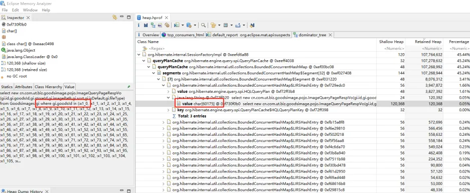  
根据这个sql语句我们在代码中也定位到对应的查询，是一个根据商品id列表in查询商品图片的语句，检查代码的写法看着是没什么问题，因为这个sql语句是在QueryPlanCache中引用的，所以查一下这个是什么东西  
https://tool.oschina.net/uploads/apidocs/hibernate-4.1.4/org/hibernate/engine/query/spi/QueryPlanCache.html  

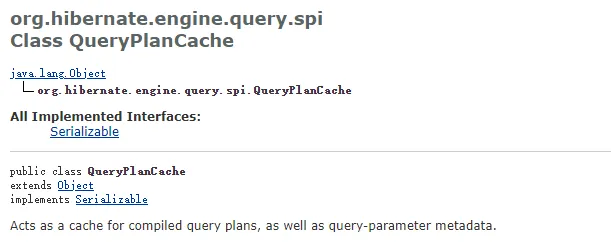  
可以看到，这个是一个对编译查询计划的缓存，还有一些查询参数的元数据等，既然是缓存那大概率有可能是这家伙导致的  
在查询相关QueryPlanCache时，也看到了很多遇到QueryPlanCache缓存导致的内存泄漏问题，在我们这个场景中大概情况如下：QueryPlanCache会缓存sql，以便于后边的相同的sql重复编译，如果in后的参数不同，hibernate会把其当成不同的sql进行缓存，从而缓存大量的sql导致heap内存溢出。  
参考资料：  
https://vladmihalcea.com/improve-statement-caching-efficiency-in-clause-parameter-padding/  
https://stackoverflow.com/questions/31557076/spring-hibernate-query-plan-cache-memory-usage  

## 问题处理
增加如下配置项
```yaml
spring:
  jpa:
    properties:
      hibernate:
        query:
          in_clause_parameter_padding: true
          plan_cache_max_size: 64
```

## 问题验证
**1. 压测准备：**  
   根据MAT分析hprof文件中导致内存泄漏的sql语句，模拟对有问题的接口调用代码  
```java
@Autowired
private BuzGoodsFeignClient buzGoodsFeignClient; // 商品服务feign客户端

// 构造多个商品id in查询条件，模拟接口调用
@RequestMapping("/buzGoods")
public void buzGoods() {
        GoodsReqVO goodsReqVO = new GoodsReqVO();
        // 随机生成1000个以内的goodsId
        goodsReqVO.setGoodsIds(generate());
        // 生成1个appId或null
        goodsReqVO.setAppIds(System.currentTimeMillis() % 2 == 0 ?
        null : Collections.singletonList("436140e219c747859196a6988d8d5005"));
        // 生成1个MerchantId或null
        goodsReqVO.setMerchantIds(System.currentTimeMillis() % 2 == 0 ?
        null : Collections.singletonList("505397679019806720"));
        // 生成1个gcId或null
        goodsReqVO.setGcIds(System.currentTimeMillis() % 2 == 0 ?
        null : Collections.singletonList("4028cb2266c424b80166c4471ee40002"));
        // 随机生成类型为3、4或3与4
        if (System.currentTimeMillis() % 4 == 0) {
            goodsReqVO.setGoodsTypes(Arrays.asList(3));
        } else if (System.currentTimeMillis() % 4 == 1) {
            goodsReqVO.setGoodsTypes(Arrays.asList(4));
        } else if (System.currentTimeMillis() % 4 == 2) {
            goodsReqVO.setGoodsTypes(Arrays.asList(3, 4));
        }

        buzGoodsFeignClient.queryCountAllByRole("Bearer XXX", goodsReqVO);
}
```
```java
// 随机生成1000个以内的goodsId
private List<String> generate() {
    Random random = new Random();
    int length = random.nextInt(1000);
    if (length == 0) {
        length = 10;
    }
    List<String> list = new ArrayList<>();
    for (int i = 0; i < length; i++) {
        list.add(i + "");
    }
    return list;
}
```
```java
// 商品服务feign接口
@FeignClient(
        value = "xxx-service",
        url = "${xxx.xxx-service}"
)
public interface BuzGoodsFeignClient {
    @PostMapping("/goods/queryAllByRole")
    void queryCountAllByRole(
            @RequestHeader("Authorization") String token,
            @RequestBody GoodsReqVO goodsReqVO
    );
}
```
模拟qps为10，持续进行请求  
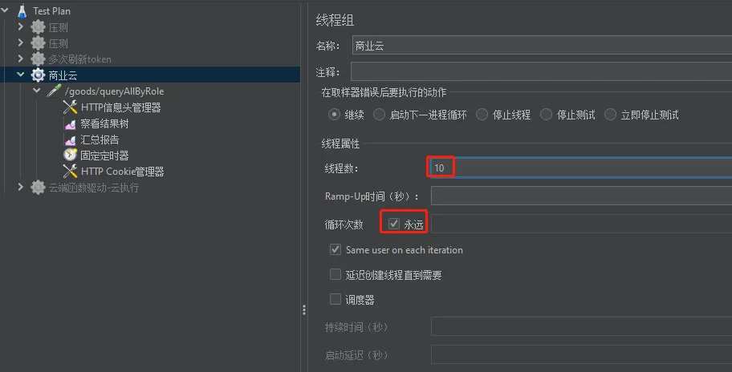  
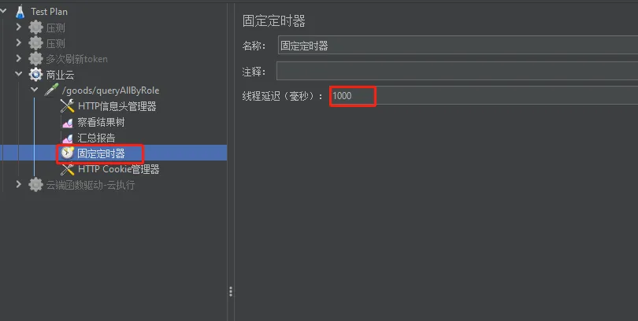  
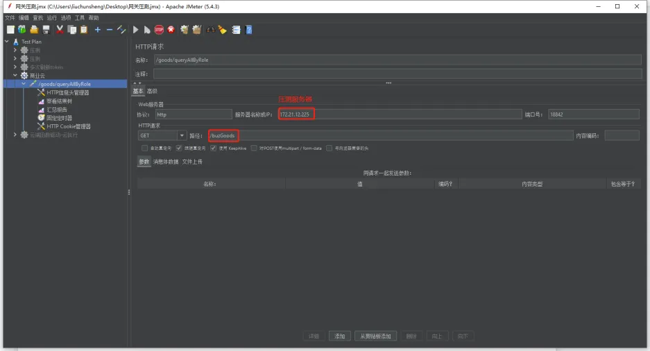  
设置商品服务的堆大小为1024m
```text
nohup java -Xmx1024m -Xms1024m -XX:+HeapDumpOnOutOfMemoryError
-XX:HeapDumpPath=./ -jar -Djava.rmi.server.hostname=172.21.12.225
-Dcom.sun.management.jmxremote.port=9999
-Dcom.sun.management.jmxremote=true
-Dcom.sun.management.jmxremote.ssl=false
-Dcom.sun.managementote.ssl=false
-Dcom.sun.management.jmxremote.authenticate=false /home/buz_goods/goods-service-1.04.06.01.jar >/home/buz_goods/log/buz_goods.log &
```
**2. 问题重现**  
   持续运行一段时间后，堆内存大小在持续增大，垃圾回收后堆内存空间存在部分无法被释放。  
   后续cpu使用率持续上升，垃圾回收频率变多  
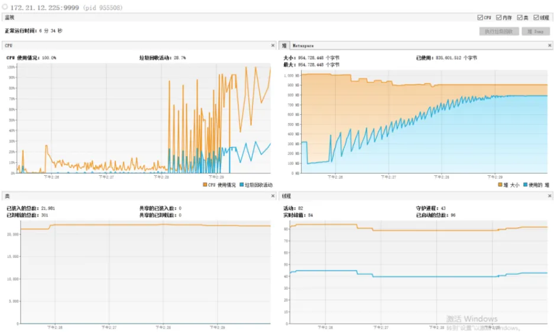  
最终，日志出现java.lang.OutOfMemoryError: Java heap space错误，内存溢出  
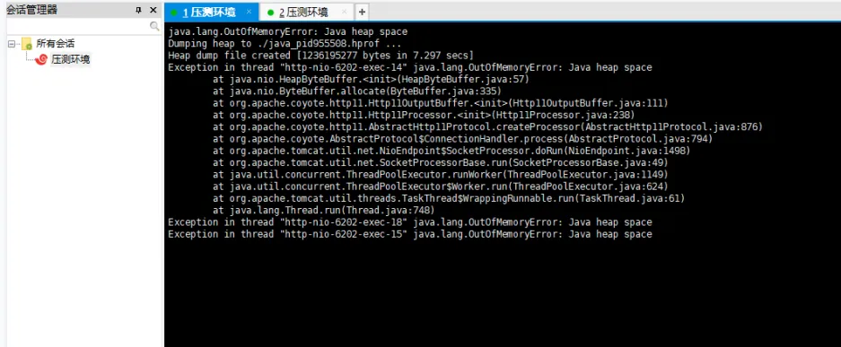  
此时，堆内存已基本100%使用  
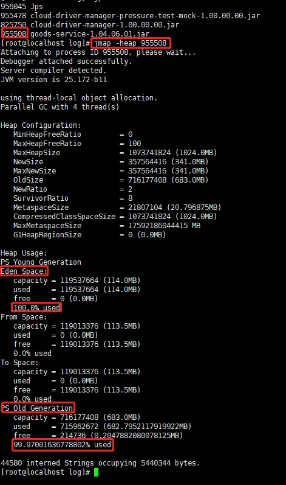  
MAT分析dump文件结果中，实例及内存较高的类前几名为hibernate缓存产生，占用了600多MB，存在内存泄漏风险  
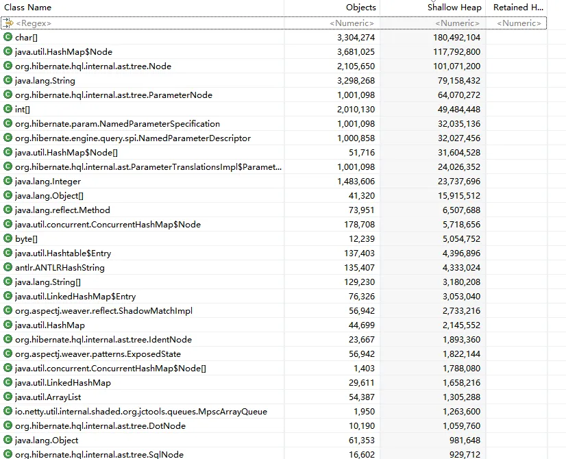  
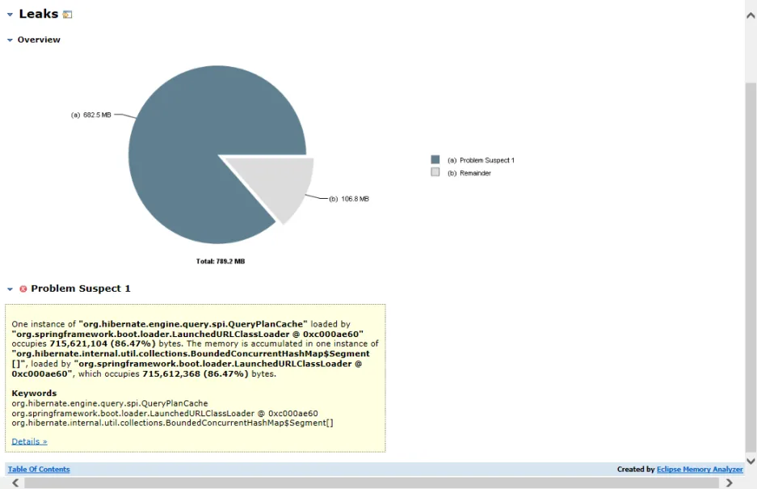  
**3. 修复后情况**  
   内存并未持续增长，在垃圾回收后无明显差异，较稳定。cpu使用率表现正常  
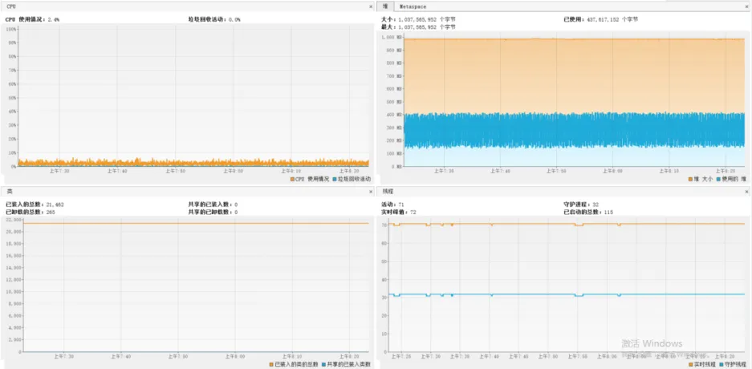  
堆内存使用情况正常  
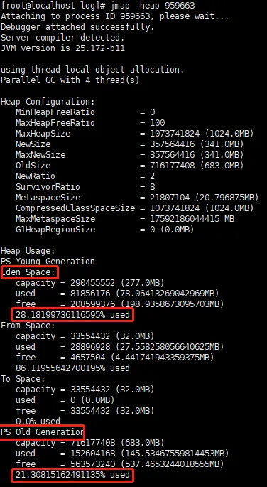  
MAT分析dump文件结果中，hibernate缓存产生的数据仅占用了20MB左右，内存占用大幅减少  
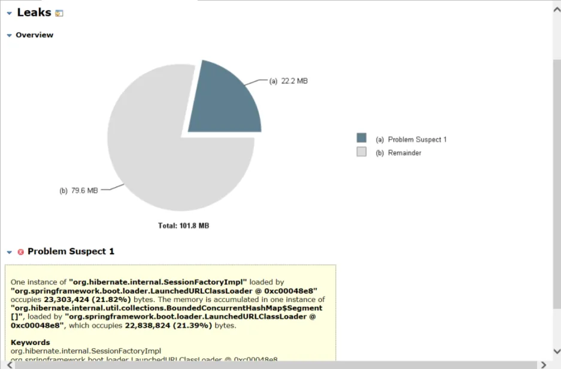

综上分析结果表明，在同样压测请求、相同的时间甚至更长的时间内，并未出现OOM情况  