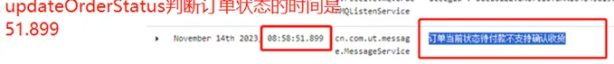
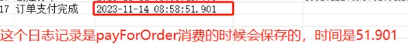
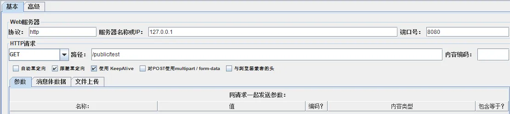
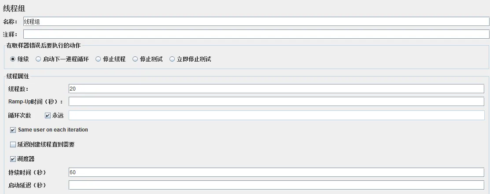
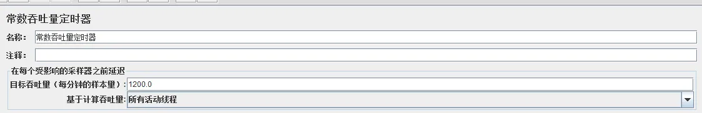
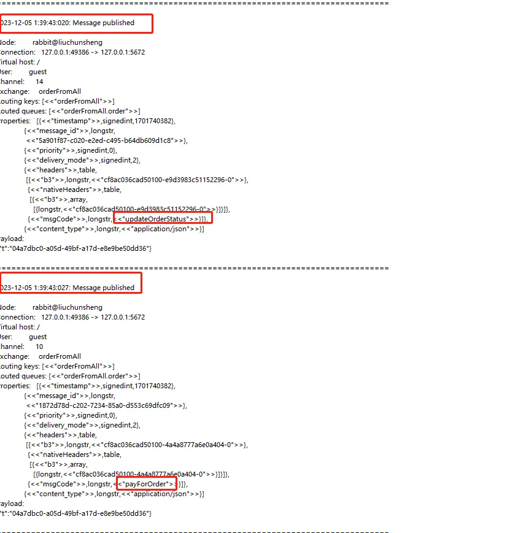
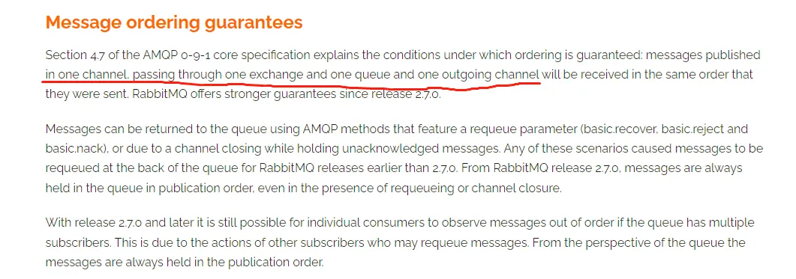
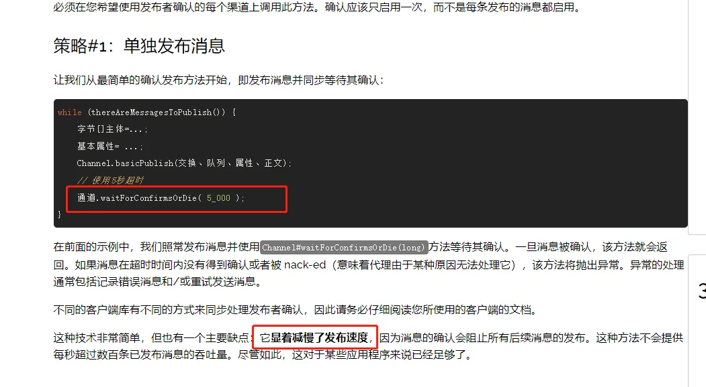
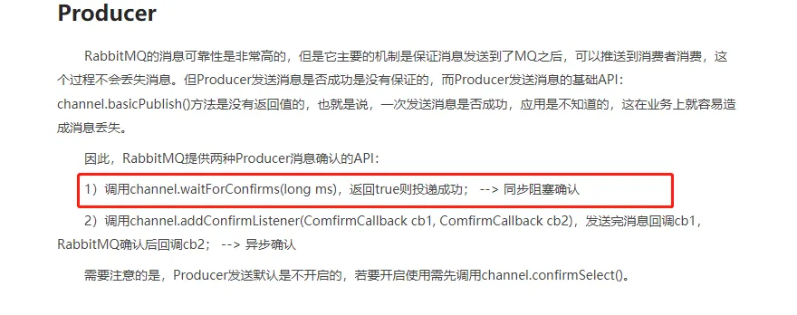
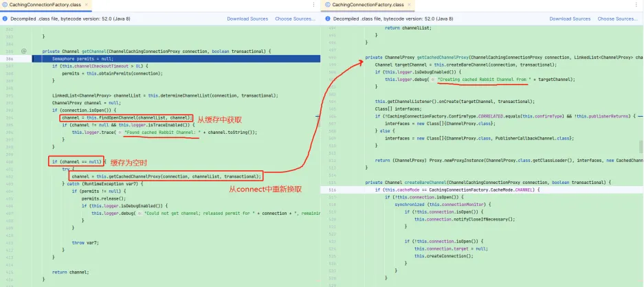

# 【问题】RabbitMQ消息顺序问题
## 问题背景
业务方反馈，生产环境的订单状态流转异常，用户已经完成了支付，但是订单一直是已支付状态，不能正常流转到已完成  
这里简单描述一下整个过程  
1. 业务方的订单完成支付后，业务方后台会通过RabbitMQ向我们的订单服务发送订单支付完成的消息，我们的订单服务进行消息消费并更新订单状态为已支付  
2. 业务方后台在执行完第1步后，会处理自己的业务逻辑，之后再次通过RabbitMQ向我们的订单服务发送订单完成的消息，我们的订单服务进行消息消费并更新订单状态为已完成  

## 问题定位
收到问题反馈之后，通过现象大概率可以定位为消息顺序性的问题，然后通过业务日志继续进一步确认，从我们的订单服务日志里看到，订单服务先消费了订单完成的消息，接着才消费了订单支付完成的消息，而在消费订单完成的消息时会校验订单的状态为已支付才允许更新为已完成，因此可以确认问题是消息未按正确的顺序消费而导致的
  


## 问题分析
1. 定位到是队列消息顺序性问题后，我们就可以从实现消息顺序性的条件出发，排查是否是哪些条件不满足导致的顺序不一致，(这里的顺序性在我们当前的场景中指局部一致性，非全局一致性)  
> RabbitMQ实现顺序消费： 单队列+单消息推送。即一组有序消息，只发到一个队列中，利用队列的FIFO特性保证消息在队列内顺序不会乱。然后在消费者进行消费时，保证只有一个消费者，同时指定prefetch属性为1，即每次RabbitMQ都只往客户端推送一个消息。  
> 
> spring.rabbitmq.listener.simple.prefetch=1

> 这里再介绍一下RabbitMQ消费端可能影响顺序消费的几个配置：  
> spring.rabbitmq.listener.simple.concurrency：设置监听器容器的并发消费者数量，默认为1，即单线程消费。  
> spring.rabbitmq.listener.simple.max-concurrency：设置监听器容器的最大并发消费者数量。  

> spring.rabbitmq.listener.simple.prefetch和spring.rabbitmq.listener.simple.concurrency必须有一个为1  

| 条件  | 实际情况  | 是否满足  |
|---|---|---|
| 要满足顺序性的消息，不管是生产者还是消费者都是操作的同一个队列  | 生产者将消息发送到类型为topic的exchange，exchange绑定了一个队列，路由key为#，同时消费者监消费该队列  |  满足 |
| 队列被监听的消费者只允许有一个  | 订单服务只有一个副本  | 满足  |
|  消费者消费时不能存在异步 | 订单服务消费消息时并未使用异步  | 满足  |
|  生产者发送消息时不能使用异步 | 业务方后台发送消息时并未使用异步  | 满足  |
|  RabbitMQ消费端各种参数配置满足顺序消费 | 未单独配置，使用默认值  |  满足 |
2. 在分析了以上条件都满足的情况下，思路有点被中断了，还能想到的排查方法就是去RabbitMQ上看消息的日志，不够很可惜，我们线上并未开启RabbitMQ的链路跟踪功能，RabbitMQ的控制台并没有像RocketMQ控制台一样提供消息的跟踪，需要另外再开启tracing的插件，所以也没办法看到当时出现问题时消息具体的一个顺序  
https://blog.csdn.net/github_38924695/article/details/102460387  
3. 因为我们订单流转这块是在业务方那边是有几个业务场景会触发到的，而出先这个顺序不一致性的问题好像都是那一个场景，于是便询问了业务方的开发同事，那个场景跟其它场景不同的地方在于，在发送完订单支付完成的消息后，紧接着发订单完成的消息，中间没有其它业务代码，生产者代码大致如下：  
```java
public void updateOrder2Finished(String orderId, String consumerUserId, String receiverName, String receiverPhone, String payWay, String outTradeNo, OrderExtendInfoForStallDTO orderExt, String payTimeStr) {
    // 支付成功通知商业云
    UpdateOrderToPayedMsg msg = new UpdateOrderToPayedMsg();
    msg.setOrderId(orderId);
    msg.setPayTime(TimeUtils.dateToTimeStamp(payTimeStr));
    msg.setPayNo(outTradeNo);
    msg.setPayWay(payWay);
    streamSender.sendDynamicMq(BizCloudMQConst.OrderRequest.DESTINATION, BizCloudMQConst.OrderRequest.MSG_CODE_PAY,msg);
    log.info("[sendOrderPayMsg]DESTINATION is orderFromAll, msgCode is payForOrder, msg= {}", JSON.toJSONString(msg));

    // 更新订单状态
    UpdateOrderStatusMsg content = new UpdateOrderStatusMsg();
    content.setOrderId(orderId);
    content.setOrderStatus(OrderConst.StallOrderSubState.FINISHED.getState());
    content.setOrderSubState(OrderConst.StallOrderSubState.FINISHED.getSubState());
    streamSender.sendDynamicMq(BizCloudMQConst.OrderRequest.DESTINATION, BizCloudMQConst.OrderRequest.MSG_CODE_UPDATE_STATUS, content);
    log.info("[sendOrderPayMsg]DESTINATION is orderFromAll, msgCode is updateOrderStatus, msg= {}", JSON.toJSONString(content));
}
```
4. 难道是因为两个消息发送挨得太近并发导致的？最后只能采用兜底办法了，本地模拟看能不能复现问题了，先开启本地RabbitMQ的tracing插件，然后通过jmeter发送多次请求，每个请求里会模拟业务方后台发送两条消息  
  
  
  
最后从RabbitMQ下载tracing日志，发现消息确实出现了顺序不一致的现象，RabbitMQ在收到生产者的消息时顺序已经不正确了

5. 通过复现我们又可以确定消息顺序不一致是在生产者发送消息时出现的，而业务方的代码已经保持同步顺序发送消息，那会不会是Spring整合RabbitMQ发送消息的部分出现的不一致性呢，于是把Spring跟RabbitMQ相关的日志进行开启，并再一次触发消息顺序不一致的现象，然后查看顺序不一致的一组消息在生产者方的相关日志是否存在不一致的情况
```yaml
logging:
  level:
    org.springframework.cloud.stream: DEBUG
    org.springframework.integration: DEBUG
    org.springframework.amqp: TRACE
```
```text
2024-07-31 10:50:22 INFO  [XNIO-1 task-8] - com.ut.user.message.MessageDynamicService - 1722394222983==sendMessageDynamic to dest orderFromAll with msgCode payForOrder and payload {"orderId":"2d19e618-c288-4a8b-b64d-f3e2fd484e15"}==
2024-07-31 10:50:22 TRACE [XNIO-1 task-8] - org.springframework.amqp.rabbit.core.RabbitTemplate - Original message to publish: (Body:'{"orderId":"2d19e618-c288-4a8b-b64d-f3e2fd484e15"}' MessageProperties [headers={b3=1fd65ba9180178ea-0469f397c302b50d-0, nativeHeaders={b3=[1fd65ba9180178ea-0469f397c302b50d-0]}, partition=2d19e618-c288-4a8b-b64d-f3e2fd484e15, msgCode=payForOrder}, timestamp=Wed Jul 31 10:50:22 CST 2024, messageId=1f98a778-2728-343f-cf48-8c60f0351e7b, contentType=application/json, contentLength=0, deliveryMode=PERSISTENT, priority=0, deliveryTag=0])
2024-07-31 10:50:22 DEBUG [XNIO-1 task-8] - org.springframework.amqp.rabbit.core.RabbitTemplate - Publishing message [(Body:'{"orderId":"2d19e618-c288-4a8b-b64d-f3e2fd484e15"}' MessageProperties [headers={b3=1fd65ba9180178ea-0469f397c302b50d-0, nativeHeaders={b3=[1fd65ba9180178ea-0469f397c302b50d-0]}, partition=2d19e618-c288-4a8b-b64d-f3e2fd484e15, msgCode=payForOrder}, timestamp=Wed Jul 31 10:50:22 CST 2024, messageId=1f98a778-2728-343f-cf48-8c60f0351e7b, contentType=application/json, contentLength=0, deliveryMode=PERSISTENT, priority=0, deliveryTag=0])] on exchange [orderFromAll], routingKey = [orderFromAll]
2024-07-31 10:50:22 TRACE [XNIO-1 task-8] - org.springframework.amqp.rabbit.connection.CachingConnectionFactory - AMQChannel(amqp://guest@127.0.0.1:5672/,9) channel.basicPublish([orderFromAll, orderFromAll, false, #contentHeader<basic>(content-type=application/json, content-encoding=null, headers={b3=1fd65ba9180178ea-0469f397c302b50d-0, nativeHeaders={b3=[1fd65ba9180178ea-0469f397c302b50d-0]}, partition=2d19e618-c288-4a8b-b64d-f3e2fd484e15, msgCode=payForOrder}, delivery-mode=2, priority=0, correlation-id=null, reply-to=null, expiration=null, message-id=1f98a778-2728-343f-cf48-8c60f0351e7b, timestamp=Wed Jul 31 10:50:22 CST 2024, type=null, user-id=null, app-id=null, cluster-id=null), [B@50be6fb1])
2024-07-31 10:50:22 INFO  [XNIO-1 task-8] - com.ut.user.message.MessageDynamicService - 1722394222998==sendMessageDynamic to dest orderFromAll with msgCode updateOrderStatus and payload {"orderId":"2d19e618-c288-4a8b-b64d-f3e2fd484e15"}==
2024-07-31 10:50:22 TRACE [XNIO-1 task-8] - org.springframework.amqp.rabbit.core.RabbitTemplate - Original message to publish: (Body:'{"orderId":"2d19e618-c288-4a8b-b64d-f3e2fd484e15"}' MessageProperties [headers={b3=1fd65ba9180178ea-71a7e3c6f44ba81b-0, nativeHeaders={b3=[1fd65ba9180178ea-71a7e3c6f44ba81b-0]}, partition=2d19e618-c288-4a8b-b64d-f3e2fd484e15, msgCode=updateOrderStatus}, timestamp=Wed Jul 31 10:50:22 CST 2024, messageId=feaef99e-fd67-07d7-9a15-c8e418abc88f, contentType=application/json, contentLength=0, deliveryMode=PERSISTENT, priority=0, deliveryTag=0])
2024-07-31 10:50:22 DEBUG [XNIO-1 task-8] - org.springframework.amqp.rabbit.core.RabbitTemplate - Publishing message [(Body:'{"orderId":"2d19e618-c288-4a8b-b64d-f3e2fd484e15"}' MessageProperties [headers={b3=1fd65ba9180178ea-71a7e3c6f44ba81b-0, nativeHeaders={b3=[1fd65ba9180178ea-71a7e3c6f44ba81b-0]}, partition=2d19e618-c288-4a8b-b64d-f3e2fd484e15, msgCode=updateOrderStatus}, timestamp=Wed Jul 31 10:50:22 CST 2024, messageId=feaef99e-fd67-07d7-9a15-c8e418abc88f, contentType=application/json, contentLength=0, deliveryMode=PERSISTENT, priority=0, deliveryTag=0])] on exchange [orderFromAll], routingKey = [orderFromAll]
2024-07-31 10:50:22 TRACE [XNIO-1 task-8] - org.springframework.amqp.rabbit.connection.CachingConnectionFactory - AMQChannel(amqp://guest@127.0.0.1:5672/,6) channel.basicPublish([orderFromAll, orderFromAll, false, #contentHeader<basic>(content-type=application/json, content-encoding=null, headers={b3=1fd65ba9180178ea-71a7e3c6f44ba81b-0, nativeHeaders={b3=[1fd65ba9180178ea-71a7e3c6f44ba81b-0]}, partition=2d19e618-c288-4a8b-b64d-f3e2fd484e15, msgCode=updateOrderStatus}, delivery-mode=2, priority=0, correlation-id=null, reply-to=null, expiration=null, message-id=feaef99e-fd67-07d7-9a15-c8e418abc88f, timestamp=Wed Jul 31 10:50:22 CST 2024, type=null, user-id=null, app-id=null, cluster-id=null), [B@50c61264])
```
6. 通过开启日志之后，也并没有发现RabbitMQ客户端在发送消息时存在乱序，所以大概率猜想会不会是RabbitMQ本身就没法保证强顺序性，在stackoverflow上也看到了大家关于RabbitMQ顺序性的讨论，其中也提到了RabbitMQ官方对于顺序性的描述  
https://stackoverflow.com/questions/21363302/rabbitmq-message-order-of-delivery  
  
https://www.rabbitmq.com/docs/semantics#ordering  
7. 基于官网提到的保证顺序性的条件，其中的Channel好像从始至终都没有关注到，所以看回之前生产者打印的Spring和RabbitMQ日志，以及RabbitMQ tracing日志，从中可以发现顺序不一致的消息所在的Channel号是不一样的，并没有使用同一个Channel，所以这才导致了发送时消息的不一致

## 问题解决
通过上面的分析，可以得出解决问题的关键就是要么使用同一个channel，要么等第一条消息RabbitMQ接收后再发送第二条消息，因为Spring集成RabbitMQ已经帮我们封装了一层消息的发送，Channel的维护都在Spring里，所以为了减少影响面，采用第二种方法，具体的实施方案则是采用RabbitMQ的消息确认机制(异步)  
https://www.rabbitmq.com/tutorials/tutorial-seven-java
  
  

## 原理分析
在解决了问题之后，还是抱着想知道Spring是怎么维护Channel的，于是debug了下源码，大致就是Spring对Connect和Channel都做了代理，当用户要从connect中获取Channel时会先从缓存中取(有点像池化)，如果没有才会去创建，所以这就导致了Channel有可能取到的不是同一个，而我们的场景中，第一条消息取了一个Channel，接着第二条消息去创建Channel时获取不到就又创建了一个Channel  
  
> 关键方法：  
> org.springframework.amqp.rabbit.core.RabbitTemplate#send(java.lang.String, java.lang.String, org.springframework.amqp.core.Message, org.springframework.amqp.rabbit.connection.CorrelationData)  
> 
> <br>
> org.springframework.amqp.rabbit.core.RabbitTemplate#doExecute   
> 
> <br>
> <br>
> org.springframework.amqp.rabbit.connection.CachingConnectionFactory.ChannelCachingConnectionProxy#createChannel  
https://www.jianshu.com/p/f41a6bf5d807  