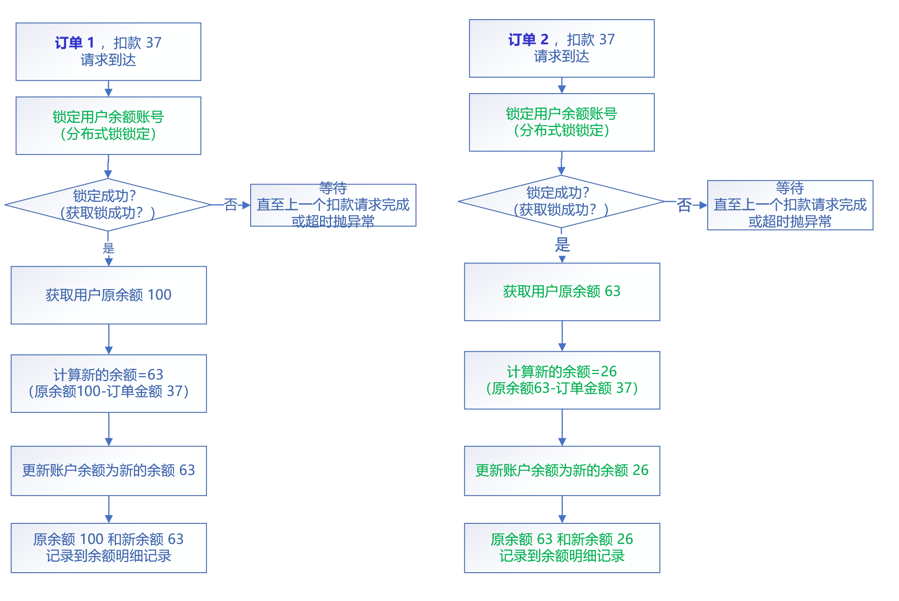
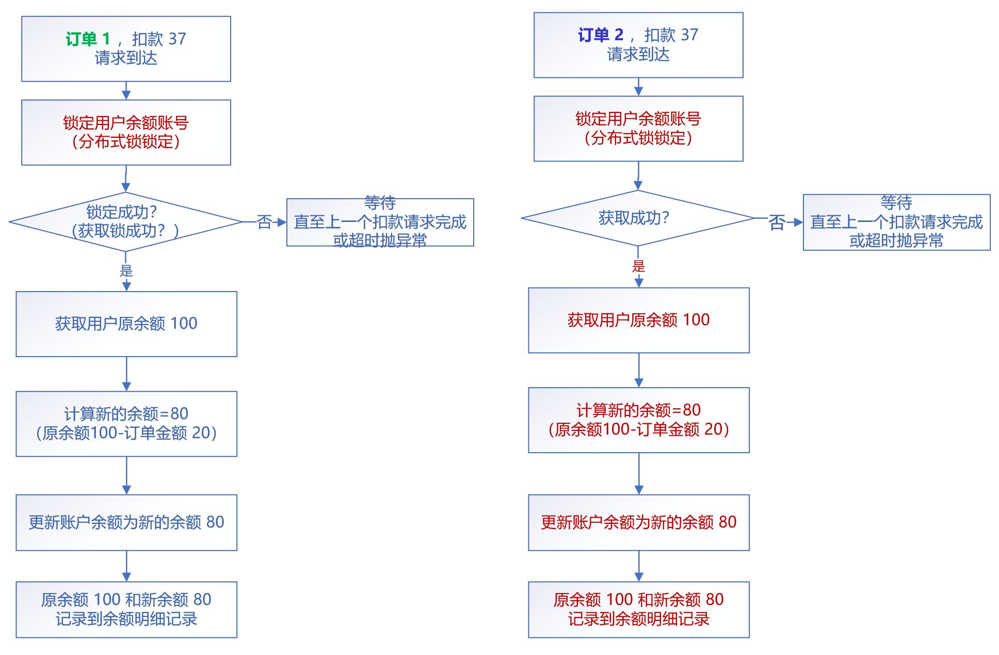
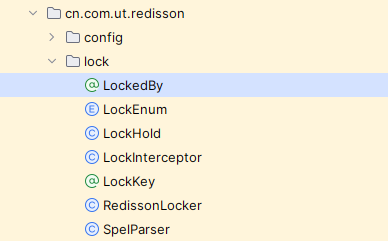
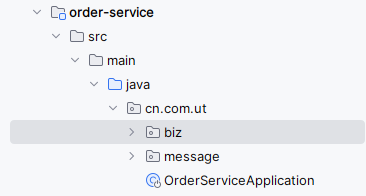
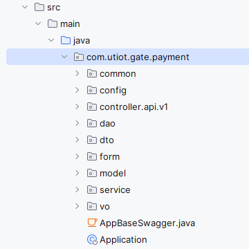

# 【问题】用户订单金额少扣
## 问题背景
上游团队反馈，XX售餐中心反馈有一位用餐用户的余额总额，和实际扣费总额对不上，实际扣款金额小于应扣款金额  
> 虽然此次问题并非我负责的业务和服务引起的，但还是协助支付中台团队的同事分析了问题原因

## 问题排查
以下是支付中台团队同事经过日志分析出的用户操作过程
1、用户在餐厅称菜用餐，消费金额为 39 元，称菜后 15 分钟，售餐系统自动生成订单，进行结算，并在用户余额账号下自动扣款  
2、用餐期间，用户去买了其他商品，并在档口收银机，使用余额立即结算，消费金额 39 元  
3、两个订单在同一时间申请余额扣款，预期余额总扣款 39 * 2 = 78元，实际扣款 39元。  

相关同事又分析了代码，定位到是在扣款时，锁定用户余额账号失效，未对用户余额账号成功锁定，导致用户下的多个扣款请求同时进入扣款流程，原余额数据被覆盖，导致扣款总额减少  
  


## 问题分析
后续我被告知他们加锁使用的是公司封装好的一个依赖，这个依赖是对Redisson进行了封装，而这个依赖我这边服务也在使用的，让我一并检查下我的服务是否也有隐患。
于是我便对我这边的服务和支付中台涉及的服务都进行了并发测试，发现我的服务加锁逻辑是成功的，请求均串行执行，而对方的服务确实加锁有问题，请求并未串行执行。  
只能打断点调试程序了，加锁逻辑是通过注解+切面的方式实现的，所以在切面的增强逻辑中加了断点，最终请求并没有走到断点处，从这可以得出，是代理失效导致的，但是我的服务也是这么使用的，为什么我这边的没问题呢    
检查了对方服务的代码，也并未出现代理失效的使用情况，例如自调用、私有方法、静态/final修饰方法等。  

在回家路上也思考了很久，最后想到会不会是切面类并没有成功注进去导致的，因为那个依赖并不是通过start的方式进行封装的，那就只能是通过扫描指定路径或扫描默认路径，而在我的服务里和对方的服务里都并没有额外增加指定的扫描路径，那么就是用的默认扫描路径，检查了下依赖中切面的路径在我的启动类路径之下，而对方的服务并没有，所以切面根本就没注入成功  
**依赖**  
   
**我的服务**  
   
**对方服务**  
  

## 问题解决
通过在启动类上增加包扫描路径
```java
@ComponentScan(basePackages = {"com.utiot.gate.payment","cn.com.ut.redisson"})
```