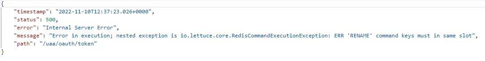
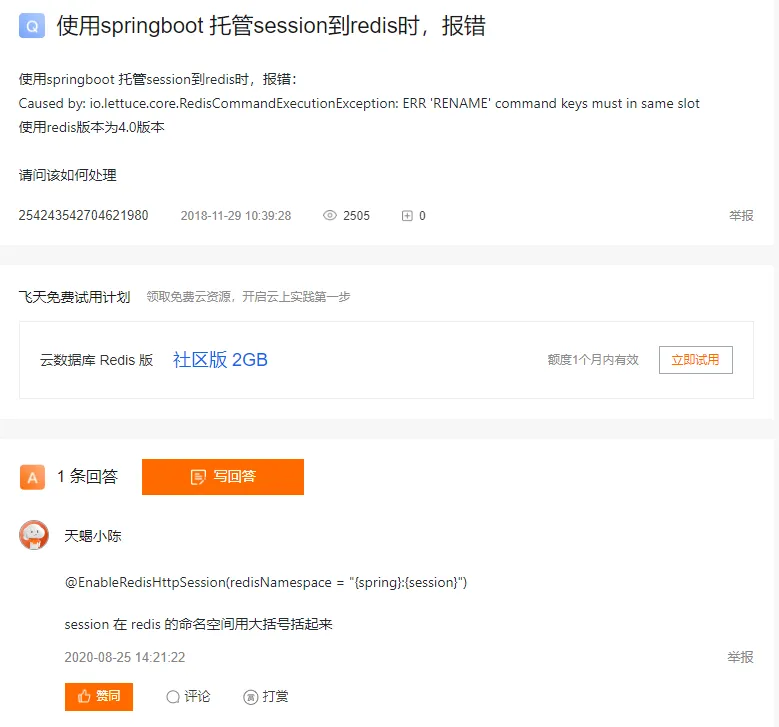

# 【问题】RedisCluster之RENAME异常
## 问题
项目里使用了SpringSession及Redis实现分布式Session，在内部环境运行的好好的，上了生产环境之后报错了  
  
## 分析
这个报错看着挺熟悉的，学习Redis的时候就接触到RENAME时更新的key必须与原先的key落在同一槽上，否则就会报错，查了一下生产环境原来使用的是RedisCluster集群，而内部环境使用的是主从。可以通过将key放在{}中实现同一槽位的效果  
解决方法：  
https://developer.aliyun.com/ask/35552   
  
将以下配置
```java
@EnableRedisHttpSession(
    maxInactiveIntervalInSeconds = 60 * 60 * 4, 
    redisNamespace = "oauth:session"
)
```

替换为
```java
@EnableRedisHttpSession(
    maxInactiveIntervalInSeconds = 60 * 60 * 4, 
    redisNamespace = "{oauth}:{session}"
)
```


## 其它
以前一直不知道RENAME有什么应用场景，从这里也是看到SpringSession集成Redis时，在更新Session时就会使用到RENAME  
开发的时候也要多考虑，比如不同的Redis部署模式对业务是否有其它影响


