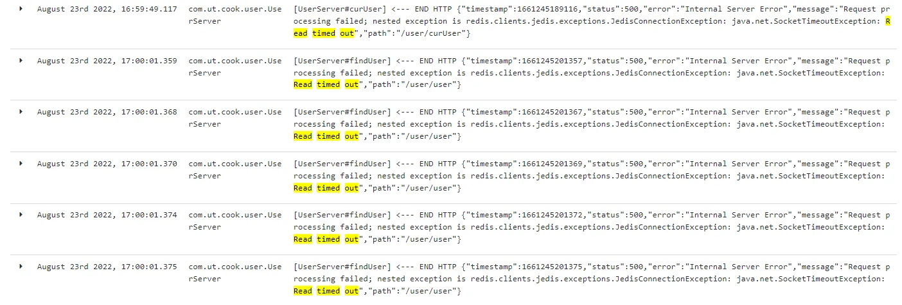
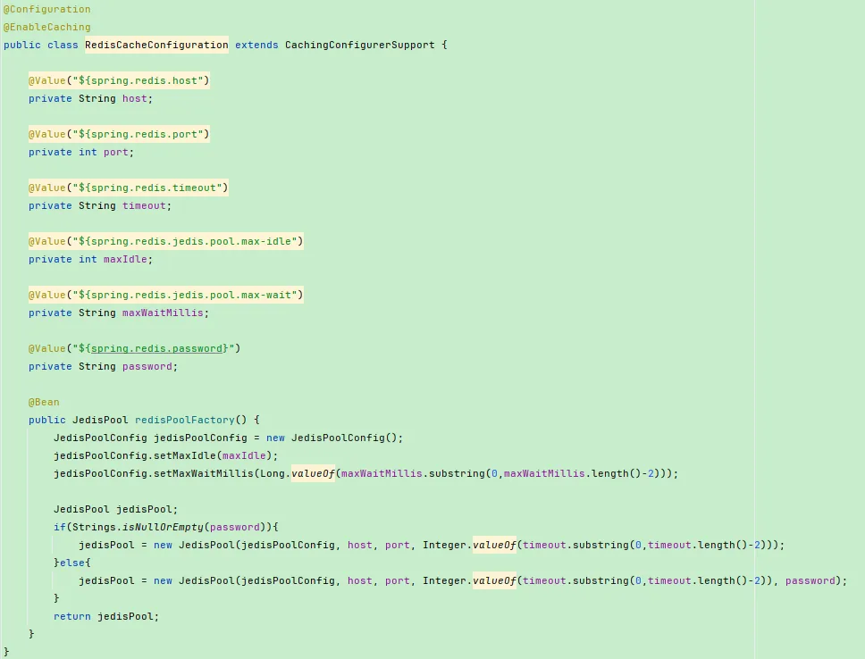
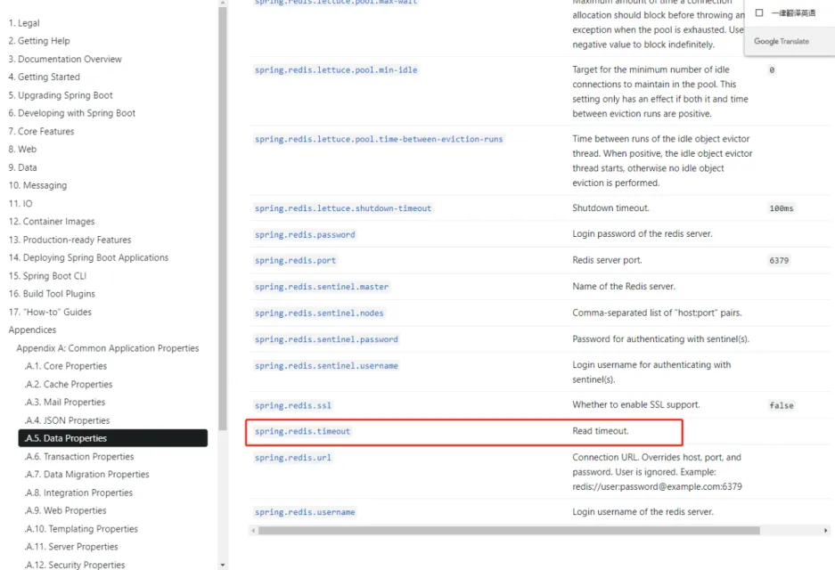
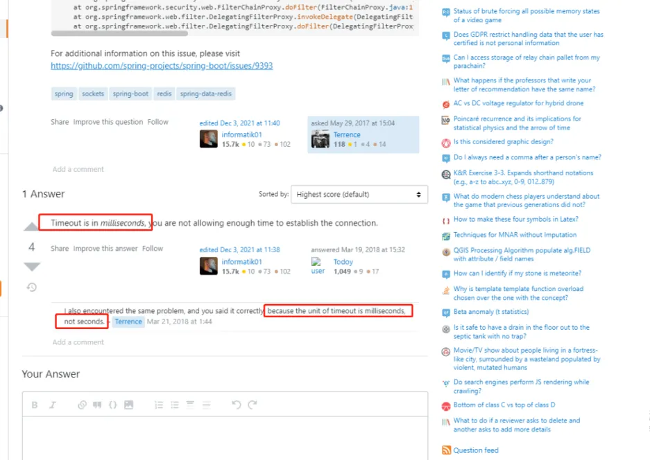
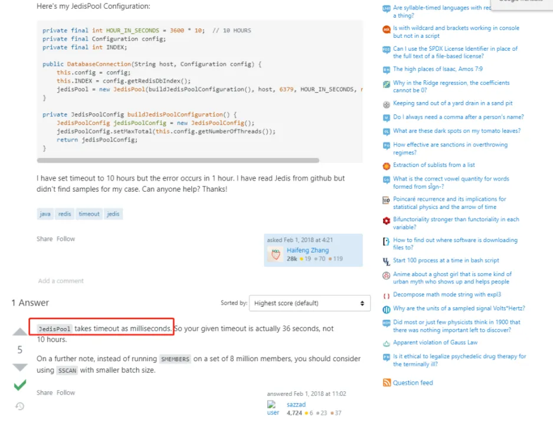
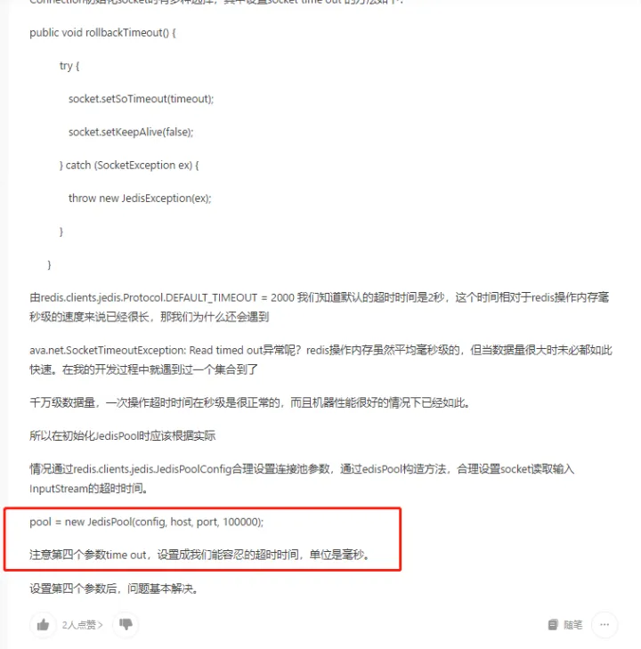
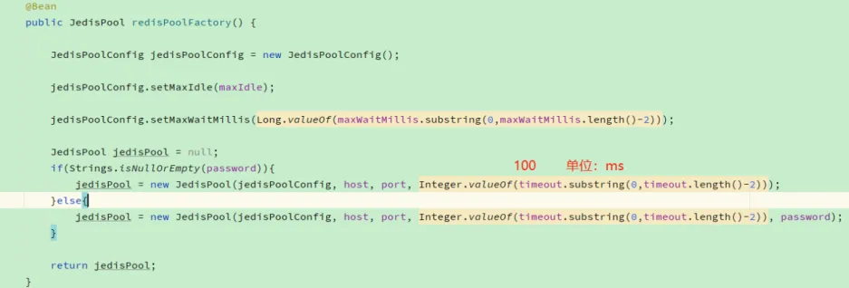

# 【问题】Redis请求超时
## 问题描述
上游反馈用户查询时报错了，日志显示Redis请求读超时报错   
  
```text
org.springframework.web.util.NestedServletException: Request processing failed; nested exception is redis.clients.jedis.exceptions.JedisConnectionException: java.net.SocketTimeoutException: Read timed out
at org.springframework.web.servlet.FrameworkServlet.processRequest(FrameworkServlet.java:989)
at org.springframework.web.servlet.FrameworkServlet.doGet(FrameworkServlet.java:873)
at javax.servlet.http.HttpServlet.service(HttpServlet.java:687)
at org.springframework.web.servlet.FrameworkServlet.service(FrameworkServlet.java:858)
at javax.servlet.http.HttpServlet.service(HttpServlet.java:790)
at io.undertow.servlet.handlers.ServletHandler.handleRequest(ServletHandler.java:74)
at io.undertow.servlet.handlers.FilterHandler$FilterChainImpl.doFilter(FilterHandler.java:129)
at org.springframework.boot.actuate.web.trace.servlet.HttpTraceFilter.doFilterInternal(HttpTraceFilter.java:90)
at org.springframework.web.filter.OncePerRequestFilter.doFilter(OncePerRequestFilter.java:107)
at io.undertow.servlet.core.ManagedFilter.doFilter(ManagedFilter.java:61)
at io.undertow.servlet.handlers.FilterHandler$FilterChainImpl.doFilter(FilterHandler.java:131)
at org.springframework.security.web.FilterChainProxy$VirtualFilterChain.doFilter(FilterChainProxy.java:320)
at org.springframework.security.web.access.intercept.FilterSecurityInterceptor.invoke(FilterSecurityInterceptor.java:127)
at org.springframework.security.web.access.intercept.FilterSecurityInterceptor.doFilter(FilterSecurityInterceptor.java:91)
at org.springframework.security.web.FilterChainProxy$VirtualFilterChain.doFilter(FilterChainProxy.java:334)
at org.springframework.security.web.access.ExceptionTranslationFilter.doFilter(ExceptionTranslationFilter.java:119)
at org.springframework.security.web.FilterChainProxy$VirtualFilterChain.doFilter(FilterChainProxy.java:334)
at org.springframework.security.web.session.SessionManagementFilter.doFilter(SessionManagementFilter.java:137)
at org.springframework.security.web.FilterChainProxy$VirtualFilterChain.doFilter(FilterChainProxy.java:334)
at org.springframework.security.web.authentication.AnonymousAuthenticationFilter.doFilter(AnonymousAuthenticationFilter.java:111)
at org.springframework.security.web.FilterChainProxy$VirtualFilterChain.doFilter(FilterChainProxy.java:334)
at org.springframework.security.web.servletapi.SecurityContextHolderAwareRequestFilter.doFilter(SecurityContextHolderAwareRequestFilter.java:170)
at org.springframework.security.web.FilterChainProxy$VirtualFilterChain.doFilter(FilterChainProxy.java:334)
at org.springframework.security.web.savedrequest.RequestCacheAwareFilter.doFilter(RequestCacheAwareFilter.java:63)
at org.springframework.security.web.FilterChainProxy$VirtualFilterChain.doFilter(FilterChainProxy.java:334)
at org.springframework.security.oauth2.provider.authentication.OAuth2AuthenticationProcessingFilter.doFilter(OAuth2AuthenticationProcessingFilter.java:176)
at org.springframework.security.web.FilterChainProxy$VirtualFilterChain.doFilter(FilterChainProxy.java:334)
at org.springframework.security.web.authentication.logout.LogoutFilter.doFilter(LogoutFilter.java:116)
at org.springframework.security.web.FilterChainProxy$VirtualFilterChain.doFilter(FilterChainProxy.java:334)
at org.springframework.security.web.header.HeaderWriterFilter.doFilterInternal(HeaderWriterFilter.java:74)
at org.springframework.web.filter.OncePerRequestFilter.doFilter(OncePerRequestFilter.java:107)
at org.springframework.security.web.FilterChainProxy$VirtualFilterChain.doFilter(FilterChainProxy.java:334)
at org.springframework.security.web.context.SecurityContextPersistenceFilter.doFilter(SecurityContextPersistenceFilter.java:105)
at org.springframework.security.web.FilterChainProxy$VirtualFilterChain.doFilter(FilterChainProxy.java:334)
at org.springframework.security.web.context.request.async.WebAsyncManagerIntegrationFilter.doFilterInternal(WebAsyncManagerIntegrationFilter.java:56)
at org.springframework.web.filter.OncePerRequestFilter.doFilter(OncePerRequestFilter.java:107)
at org.springframework.security.web.FilterChainProxy$VirtualFilterChain.doFilter(FilterChainProxy.java:334)
at org.springframework.security.web.FilterChainProxy.doFilterInternal(FilterChainProxy.java:215)
at org.springframework.security.web.FilterChainProxy.doFilter(FilterChainProxy.java:178)
at org.springframework.web.filter.DelegatingFilterProxy.invokeDelegate(DelegatingFilterProxy.java:357)
at org.springframework.web.filter.DelegatingFilterProxy.doFilter(DelegatingFilterProxy.java:270)
at io.undertow.servlet.core.ManagedFilter.doFilter(ManagedFilter.java:61)
at io.undertow.servlet.handlers.FilterHandler$FilterChainImpl.doFilter(FilterHandler.java:131)
at org.springframework.web.filter.RequestContextFilter.doFilterInternal(RequestContextFilter.java:99)
at org.springframework.web.filter.OncePerRequestFilter.doFilter(OncePerRequestFilter.java:107)
at io.undertow.servlet.core.ManagedFilter.doFilter(ManagedFilter.java:61)
at io.undertow.servlet.handlers.FilterHandler$FilterChainImpl.doFilter(FilterHandler.java:131)
at org.springframework.web.filter.HttpPutFormContentFilter.doFilterInternal(HttpPutFormContentFilter.java:109)
at org.springframework.web.filter.OncePerRequestFilter.doFilter(OncePerRequestFilter.java:107)
at io.undertow.servlet.core.ManagedFilter.doFilter(ManagedFilter.java:61)
at io.undertow.servlet.handlers.FilterHandler$FilterChainImpl.doFilter(FilterHandler.java:131)
at org.springframework.web.filter.HiddenHttpMethodFilter.doFilterInternal(HiddenHttpMethodFilter.java:93)
at org.springframework.web.filter.OncePerRequestFilter.doFilter(OncePerRequestFilter.java:107)
at io.undertow.servlet.core.ManagedFilter.doFilter(ManagedFilter.java:61)
at io.undertow.servlet.handlers.FilterHandler$FilterChainImpl.doFilter(FilterHandler.java:131)
at org.springframework.cloud.sleuth.instrument.web.ExceptionLoggingFilter.doFilter(ExceptionLoggingFilter.java:48)
at io.undertow.servlet.core.ManagedFilter.doFilter(ManagedFilter.java:61)
at io.undertow.servlet.handlers.FilterHandler$FilterChainImpl.doFilter(FilterHandler.java:131)
at brave.servlet.TracingFilter.doFilter(TracingFilter.java:86)
at io.undertow.servlet.core.ManagedFilter.doFilter(ManagedFilter.java:61)
at io.undertow.servlet.handlers.FilterHandler$FilterChainImpl.doFilter(FilterHandler.java:131)
at org.springframework.boot.actuate.metrics.web.servlet.WebMvcMetricsFilter.filterAndRecordMetrics(WebMvcMetricsFilter.java:117)
at org.springframework.boot.actuate.metrics.web.servlet.WebMvcMetricsFilter.doFilterInternal(WebMvcMetricsFilter.java:106)
at org.springframework.web.filter.OncePerRequestFilter.doFilter(OncePerRequestFilter.java:107)
at io.undertow.servlet.core.ManagedFilter.doFilter(ManagedFilter.java:61)
at io.undertow.servlet.handlers.FilterHandler$FilterChainImpl.doFilter(FilterHandler.java:131)
at org.springframework.web.filter.CharacterEncodingFilter.doFilterInternal(CharacterEncodingFilter.java:200)
at org.springframework.web.filter.OncePerRequestFilter.doFilter(OncePerRequestFilter.java:107)
at io.undertow.servlet.core.ManagedFilter.doFilter(ManagedFilter.java:61)
at io.undertow.servlet.handlers.FilterHandler$FilterChainImpl.doFilter(FilterHandler.java:131)
at io.undertow.servlet.handlers.FilterHandler.handleRequest(FilterHandler.java:84)
at io.undertow.servlet.handlers.security.ServletSecurityRoleHandler.handleRequest(ServletSecurityRoleHandler.java:62)
at io.undertow.servlet.handlers.ServletChain$1.handleRequest(ServletChain.java:65)
at io.undertow.servlet.handlers.ServletDispatchingHandler.handleRequest(ServletDispatchingHandler.java:36)
at io.undertow.servlet.handlers.security.SSLInformationAssociationHandler.handleRequest(SSLInformationAssociationHandler.java:132)
at io.undertow.servlet.handlers.security.ServletAuthenticationCallHandler.handleRequest(ServletAuthenticationCallHandler.java:57)
at io.undertow.server.handlers.PredicateHandler.handleRequest(PredicateHandler.java:43)
at io.undertow.security.handlers.AbstractConfidentialityHandler.handleRequest(AbstractConfidentialityHandler.java:46)
at io.undertow.servlet.handlers.security.ServletConfidentialityConstraintHandler.handleRequest(ServletConfidentialityConstraintHandler.java:64)
at io.undertow.security.handlers.AuthenticationMechanismsHandler.handleRequest(AuthenticationMechanismsHandler.java:60)
at io.undertow.servlet.handlers.security.CachedAuthenticatedSessionHandler.handleRequest(CachedAuthenticatedSessionHandler.java:77)
at io.undertow.security.handlers.AbstractSecurityContextAssociationHandler.handleRequest(AbstractSecurityContextAssociationHandler.java:43)
at io.undertow.server.handlers.PredicateHandler.handleRequest(PredicateHandler.java:43)
at io.undertow.server.handlers.PredicateHandler.handleRequest(PredicateHandler.java:43)
at io.undertow.servlet.handlers.ServletInitialHandler.handleFirstRequest(ServletInitialHandler.java:292)
at io.undertow.servlet.handlers.ServletInitialHandler.access$100(ServletInitialHandler.java:81)
at io.undertow.servlet.handlers.ServletInitialHandler$2.call(ServletInitialHandler.java:138)
at io.undertow.servlet.handlers.ServletInitialHandler$2.call(ServletInitialHandler.java:135)
at io.undertow.servlet.core.ServletRequestContextThreadSetupAction$1.call(ServletRequestContextThreadSetupAction.java:48)
at io.undertow.servlet.core.ContextClassLoaderSetupAction$1.call(ContextClassLoaderSetupAction.java:43)
at io.undertow.servlet.handlers.ServletInitialHandler.dispatchRequest(ServletInitialHandler.java:272)
at io.undertow.servlet.handlers.ServletInitialHandler.access$000(ServletInitialHandler.java:81)
at io.undertow.servlet.handlers.ServletInitialHandler$1.handleRequest(ServletInitialHandler.java:104)
at io.undertow.server.Connectors.executeRootHandler(Connectors.java:336)
at io.undertow.server.HttpServerExchange$1.run(HttpServerExchange.java:830)
at java.util.concurrent.ThreadPoolExecutor.runWorker(ThreadPoolExecutor.java:1149)
at java.util.concurrent.ThreadPoolExecutor$Worker.run(ThreadPoolExecutor.java:624)
at java.lang.Thread.run(Thread.java:748)
Caused by: redis.clients.jedis.exceptions.JedisConnectionException: java.net.SocketTimeoutException: Read timed out
at redis.clients.util.RedisInputStream.ensureFill(RedisInputStream.java:202)
at redis.clients.util.RedisInputStream.readByte(RedisInputStream.java:40)
at redis.clients.jedis.Protocol.process(Protocol.java:151)
at redis.clients.jedis.Protocol.read(Protocol.java:215)
at redis.clients.jedis.Connection.readProtocolWithCheckingBroken(Connection.java:340)
at redis.clients.jedis.Connection.getBinaryBulkReply(Connection.java:259)
at redis.clients.jedis.Connection.getBulkReply(Connection.java:248)
at redis.clients.jedis.Jedis.get(Jedis.java:153)
at com.ut.user.cache.CacheSingleService.get(CacheSingleService.java:43)
at com.ut.user.usermgr.MyUserService.findByUsernameWithCache(MyUserService.java:1357)
at com.ut.user.usermgr.MyUserService.getSelf(MyUserService.java:658)
at com.ut.user.usermgr.MyUserService.getLoginUser(MyUserService.java:133)
at com.ut.user.usermgr.MyUserService$$FastClassBySpringCGLIB$$3f778c5c.invoke(<generated>)
at org.springframework.cglib.proxy.MethodProxy.invoke(MethodProxy.java:204)
at org.springframework.aop.framework.CglibAopProxy$DynamicAdvisedInterceptor.intercept(CglibAopProxy.java:684)
at com.ut.user.usermgr.MyUserService$$EnhancerBySpringCGLIB$$94e7d8c1.getLoginUser(<generated>)
at com.ut.user.controller.UserController.getLoginUser(UserController.java:39)
at sun.reflect.GeneratedMethodAccessor269.invoke(Unknown Source)
at sun.reflect.DelegatingMethodAccessorImpl.invoke(DelegatingMethodAccessorImpl.java:43)
at java.lang.reflect.Method.invoke(Method.java:498)
at org.springframework.web.method.support.InvocableHandlerMethod.doInvoke(InvocableHandlerMethod.java:209)
at org.springframework.web.method.support.InvocableHandlerMethod.invokeForRequest(InvocableHandlerMethod.java:136)
at org.springframework.web.servlet.mvc.method.annotation.ServletInvocableHandlerMethod.invokeAndHandle(ServletInvocableHandlerMethod.java:102)
at org.springframework.web.servlet.mvc.method.annotation.RequestMappingHandlerAdapter.invokeHandlerMethod(RequestMappingHandlerAdapter.java:891)
at org.springframework.web.servlet.mvc.method.annotation.RequestMappingHandlerAdapter.handleInternal(RequestMappingHandlerAdapter.java:797)
at org.springframework.web.servlet.mvc.method.AbstractHandlerMethodAdapter.handle(AbstractHandlerMethodAdapter.java:87)
at org.springframework.web.servlet.DispatcherServlet.doDispatch(DispatcherServlet.java:991)
at org.springframework.web.servlet.DispatcherServlet.doService(DispatcherServlet.java:925)
at org.springframework.web.servlet.FrameworkServlet.processRequest(FrameworkServlet.java:981)
... 97 common frames omitted
Caused by: java.net.SocketTimeoutException: Read timed out
at java.net.SocketInputStream.socketRead0(Native Method)
at java.net.SocketInputStream.socketRead(SocketInputStream.java:116)
at java.net.SocketInputStream.read(SocketInputStream.java:171)
at java.net.SocketInputStream.read(SocketInputStream.java:141)
at java.net.SocketInputStream.read(SocketInputStream.java:127)
at redis.clients.util.RedisInputStream.ensureFill(RedisInputStream.java:196)
... 125 common frames omitted
```

## 问题分析
查看了代码，使用的jedis并通过连接池连接redis
  
再结合报错的信息应该可以将范围缩小在读超时配置的问题上，然后检查了配置文件，发现spring.redis.timeout的值是10000，看着好像挺大的，不应该有问题才对  

所以下一步需要确定下这个配置的单位  
**Jedis配置官方说明**
  
https://docs.spring.io/spring-boot/docs/current/reference/htmlsingle/#appendix.application-properties.data

**网上其它讨论说明**  
  
  
  
https://stackoverflow.com/questions/44245581/spring-redis-connection-fail-socket-timeout-read-timed-out  
https://stackoverflow.com/questions/48555300/jedisconnectionexception-read-time-out  
https://www.jianshu.com/p/1997c3c3f0a8  

官方文档没有见到该配置的单位具体是什么，不过通过网上相关讨论和说明，Jedis的相关时间配置都是以毫秒为单位。那如果是10000毫秒的话，不应该报错才对。最后发现代码里对jedis连接池配置的时候，把这个超时时间又减少了2位，相当于配置的是100毫秒，虽然redis的访问的响应很快，但是100毫秒的超时时间确实还是有可能出现超时的


## 解决
定位到是Redis超时配置导致的，那就把超时时间加大就好，但是后面发现加大了时间之后还是会出现报错，没办法只能在Redis进行查询的地方进行捕获异常，然后再去查一次数据库。直到后面其它服务上线出现过配置未正确加载的问题才想到，起始之前很有可能也是改了配置没生效导致的，因为我们代码里还有一份application-pro.yml的配置，如果配置中心的配置不能正常加载的话，就是读的本地这份配置，但是本地的Redis超时时间是没有修复过的，所以不管生产环境配置中心的配置怎么修改都不会生效(因为我们使用的是apollo，需要在启动参数上加上apollo的坐标，但是没有加，所以我们一直以为是生效的)