# 【源码】ConcurrentHashMap
## 1.7
### 构造器
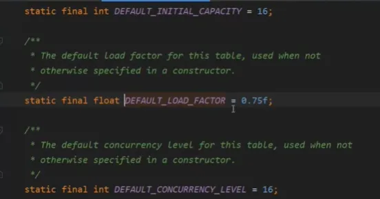  
segments最多只能有65536个
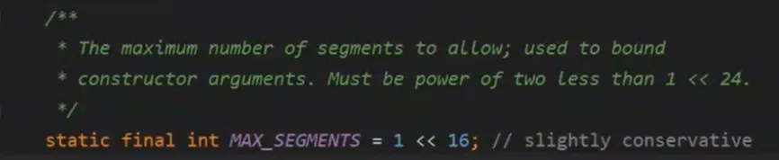  
每个segment中的hashMap大小默认是2
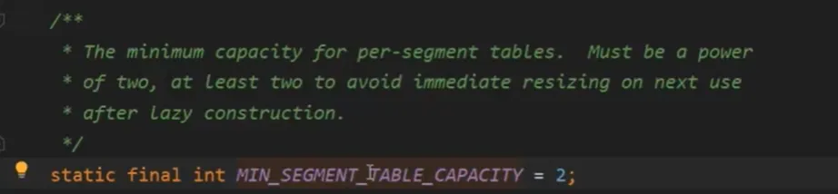  
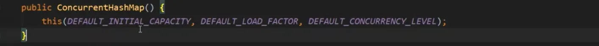  
计算出segment的数量和每个segment中hashMap的大小，我的理解其实就是hashMap的大小 * segment的数量要能放得下initialCapacity，hashMap的大小是先用initialCapacity / segment的数量再向上取整，然后再取2的幂次方。
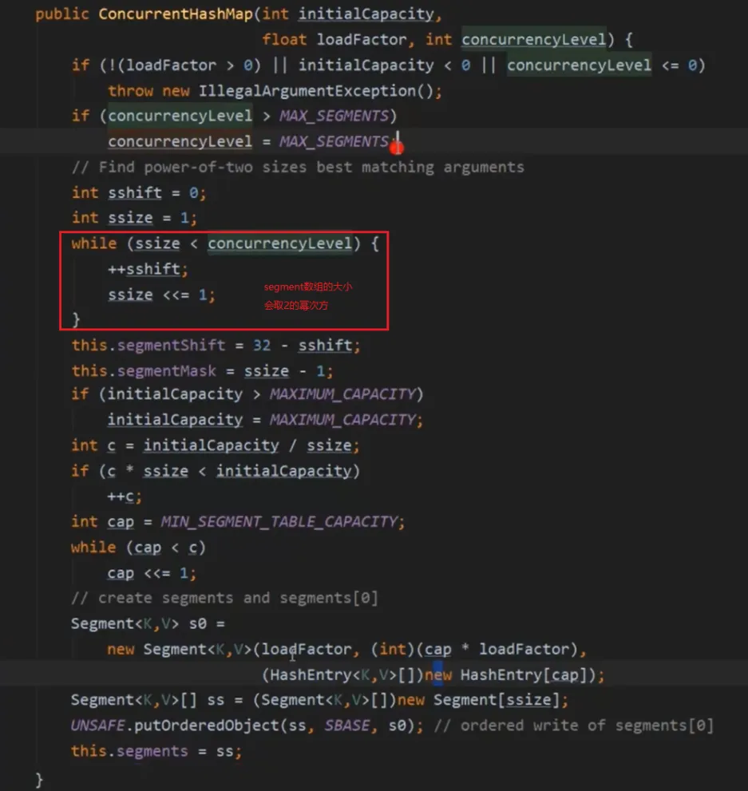  
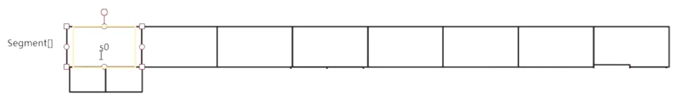
之所以一开始要在0位置上初始化s0，是为了后面put的时候如果发现对应segment中的hashMap还没初始化，可以拿到s0的属性快速初始化一个hashMap

### put
通过reentrantLock加锁控制线程安全
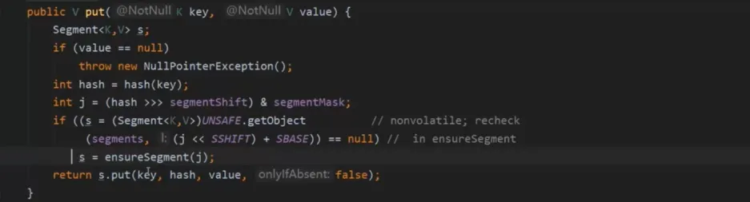  
当对应位置的Segment为空时，调用ensureSegment进行初始化，初始化的时候，因为有可能会有多个线程同时来操作，所以通过cas控制将null更新为初始化的Segment，如果更新成功就退出，更新失败就自旋继续尝试将null更新为初始化的Segment，直到有人把null更新为初始化的Segment再退出
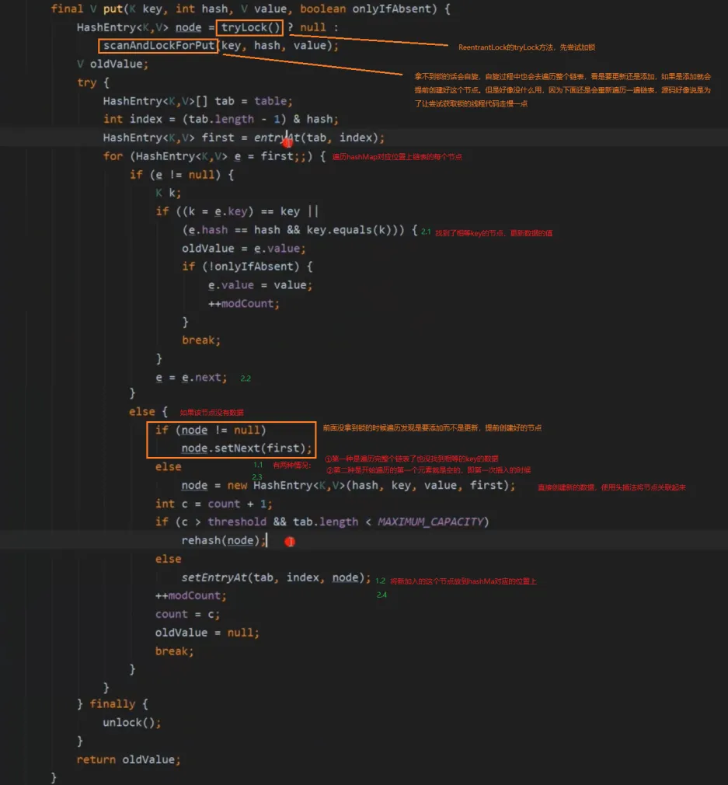
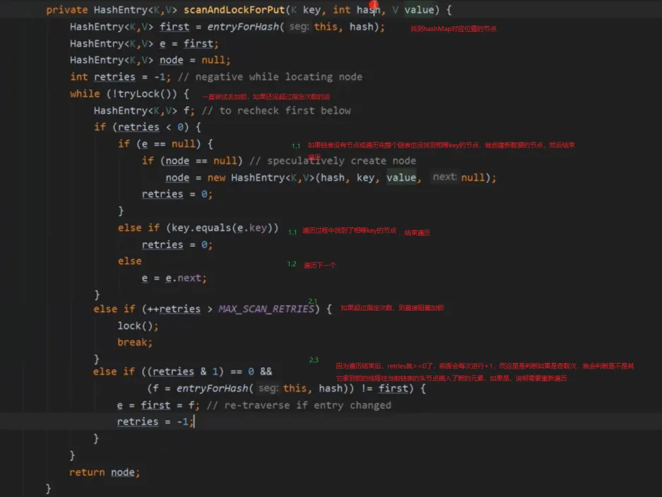  
### get
Segment中的hashmap通过volatile保证可见性，以及hashmap中的hashEntry的value和next都是通过volatile保证可见性
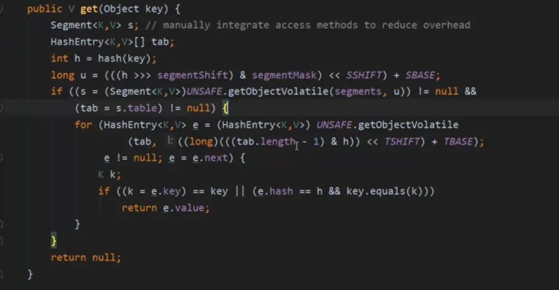  
### remove
通过reentrantLock加锁控制线程安全
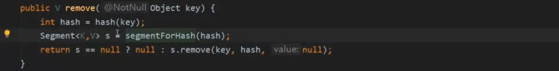  
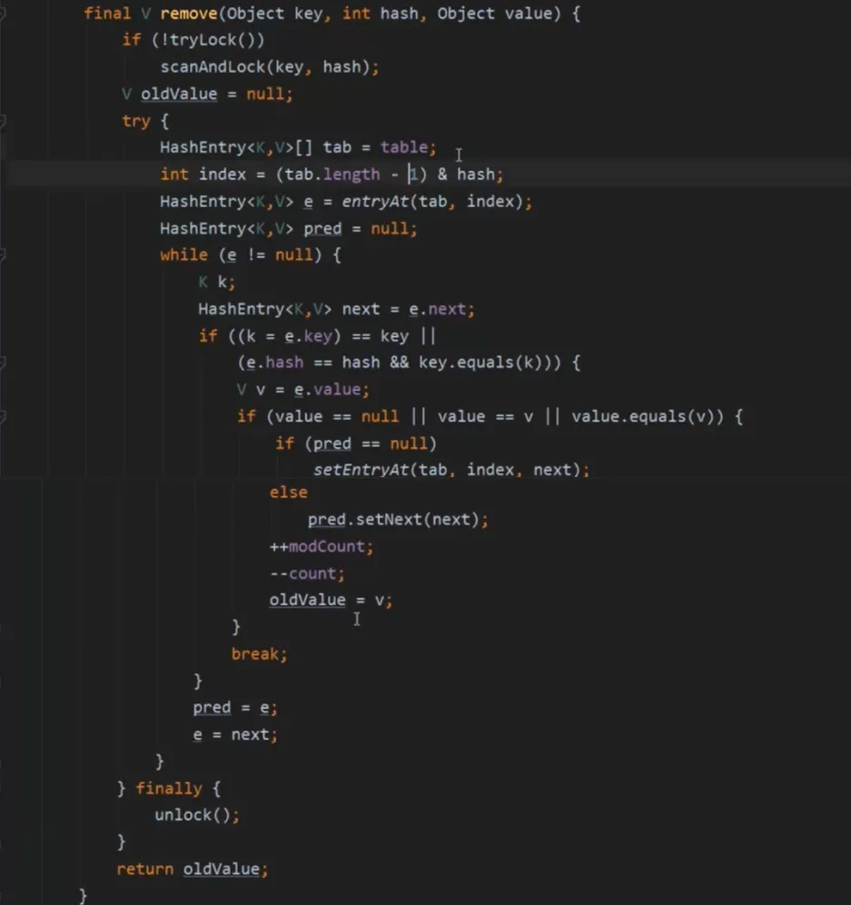  
### 总结
更新操作：分段锁（ReentrantLock）+ CAS unsafe操作  
查询操作：volatile  

## 1.8
### 构造器
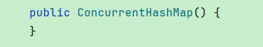  
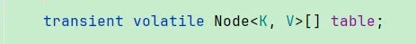  
### put
红黑树的结构是通过一个TreeBin类，在里面去维护一颗树，而1.8的HashMap是TreeNode类构造的红黑树，之所以用TreeBin包裹一颗红黑树，是因为红黑树的插入可能会涉及到节点的翻转，翻转就会导致加锁的根节点跟着变化，就有可能导致根节点变成了那个没有锁住的节点，这个时候别的线程就可以进来操作
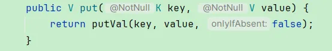  
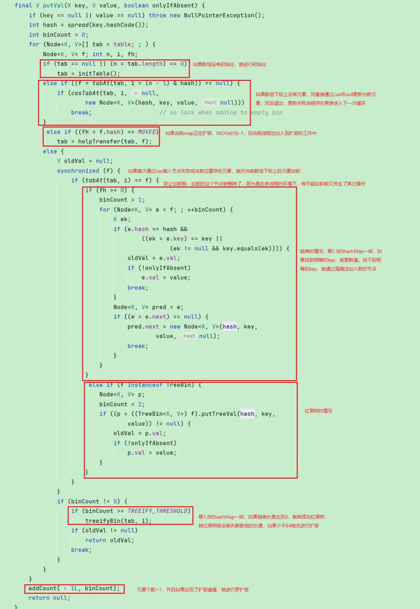  
初始化数组，因为多线程环境存在同时初始化的情况，所以需要控制同步，这里采用的是cas，竞争资源是扩容因子sizeCtl，sizeCtl默认是0，通过cas将sizeCtl改为-1，如果改成功就进行初始化，并设置扩容因子，改失败的就一直调用Thread.yield，让出cpu进行自旋，直到这个map初始化好才退出
网上也有人提到有可能这里会出现cpu标高的问题，如果让出cpu的线程又拿到cpu的时间片，那就又会进行自旋下去，一直重复
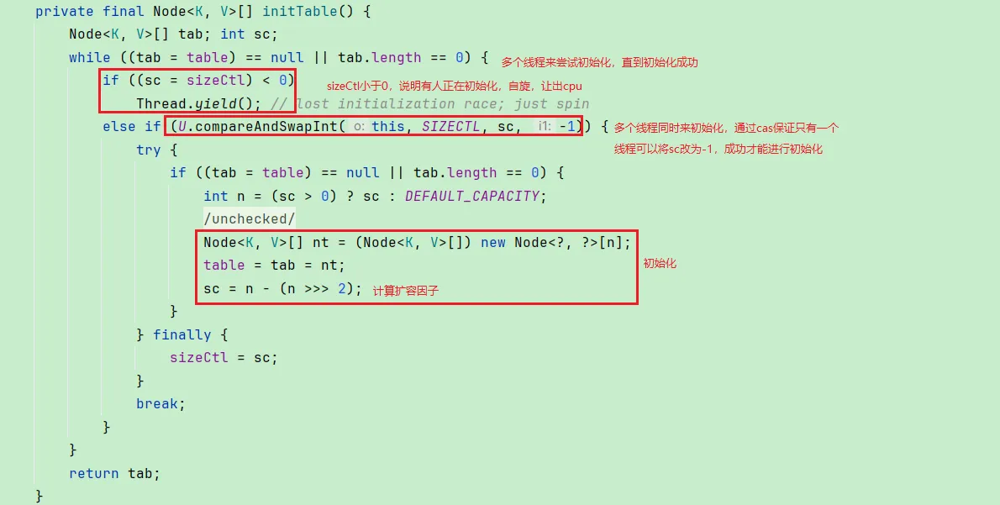
转红黑树
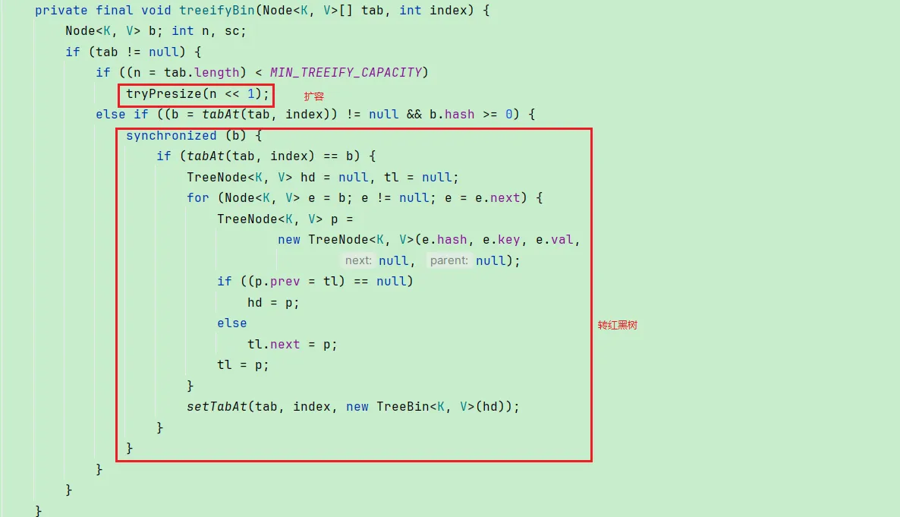  
元素+1，采用的是类似LongAdder的原理，最后判断是否达到扩容阈值需要扩容
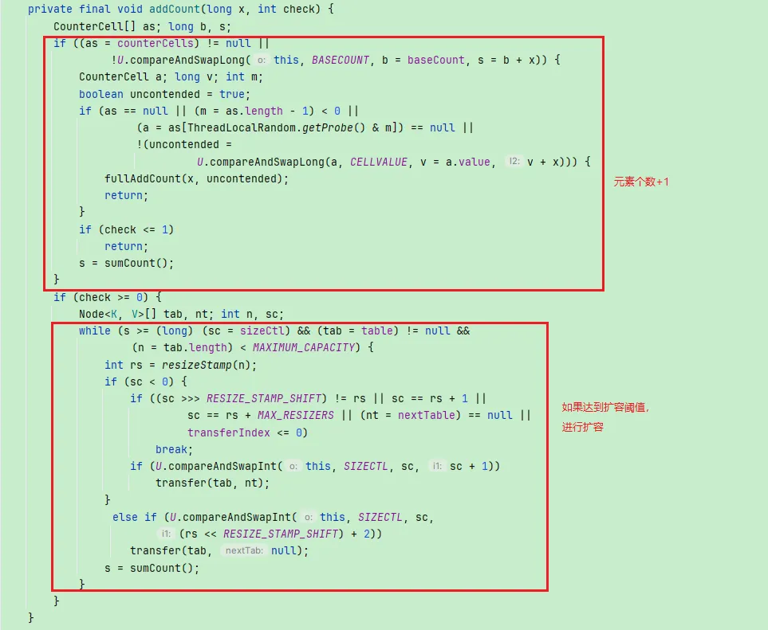  
### size
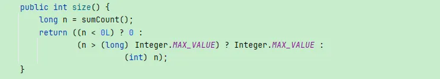  
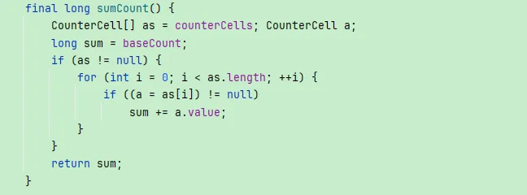  

### 总结
**CAS**  
初始化时用到，控制只有一个线程进行初始化  
put时，如果数组下标上没有元素，通过cas进行设置，解决并发安全  
更新元素个数时，采用分片+CAS更新个数的值  

**Synchronized**  
锁的是数组下标的元素，put的时候如果数组下标上已经有元素了，就会通过synchronized对该元素加锁  

**volatile**   
数组通过volatile修饰，保证可见性，虽然加了Synchronized，但是有些在Synchronized之外的操作是通过cas完成的