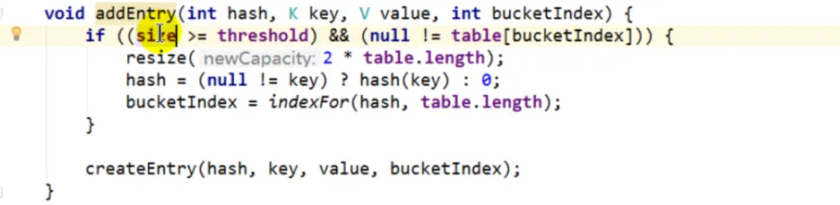

# 【源码】HashMap
## 1.7
### 构造器
  
  

### Put
先计算key的hash值，再计算这个hash值落在数组中的哪个位置。遍历该位置上的每个元素，如果找到可以是相等的元素，则更新值。如果没找到或一开始该位置为空(没有数据)，就调用addEntry。

  

  

  

如果当前元素数量达到阈值(比如总16，现在是12)，而且是该位置上有元素(说明如果再加的话就形成链表)，这个时候就会先进行扩容(原大小2倍)，扩容后再添加元素

  

将当前元素放到该位置，并将后指针指向原先的链表，即头插法

  

  

  

  

为什么数组的长度要是2的倍数，我自己的理解

1. 2的幂次方，转换为二进制后，2的幂次方-1的位数都是1，我们就可以进行&运算，用hashcode的值与hashMap的长度-1进行&运算，来替代取模操作，这样效率比取模效率高。如果hashmap的长度不是2的幂次方，则等价替换不了
2. 因为数组在确定索引的时候是通过key的hashCode进行相关运算后得到新的hash，再拿这个hash & 数组的长度 - 1，那就意味着数组的长度 - 1的二进制每一位都是1，那假如有两个元素hash的值分别是1和0的话，最后结果就是两个位置；如果数组的长度不是2的倍数，那就不会每一位都是1，有可能是0，当0与0与1做&运算的话都是0，就会映射到同一个为止造成哈希冲突

1.7在多线程情况下会出现cpu飙高问题，即链表成环导致的。当两个线程在put时都判断需要扩容，同时调用resize方法

## 1.8
### 构造器
无参构造器，默认扩容因子0.75

  

有参构造器，接收容量参数

  

  

  

### Put
  

先获取key的hash值，获取之后会通过一个扰动函数重新计算hash值，目的是让hash尽可能不同，降低哈希冲突。1.7是直接取hashcode

  

  

如果数组为空或长度为0进行resize(里面的初始化)，然后拿到key的hashCode计算hash值并于数组的长度进行&运算得到索引

1.如果索引上没有数据，则创建数据并赋值

2.如果索引上的数据key和我们要更新value的key相等，即找到了对应的数据，则更新数据的value

3.接下来要遍历索引上的所有数据，jdk8的话有可能是链表，也可能是红黑树，所以需要分情况

3.1 如果不是红黑树(即链表)，遍历每个元素，如果找到key相等的就更新value，如果找不到就往链表尾部添加数据。添加完后判断

    3.1.1 如果当前链表长度达到8，并且数组的长度<64，则进行扩容  
    3.1.2 如果当前链表长度达到8，并且数组的长度>=64，则转成红黑树

3.2 如果是红黑树

4.如果是更新数据的，则直接退出，如果是添加数据，则会判断当前数据的数量是不是超过大于阈值，如果大了，就进行扩容

> [!TIP]
> 通过hash值跟数组的长度-1做与运算来获得数组的下标，这里也可以看出数组的长度取2的幂次方的好处，就是因为2幂次方-1后都是1，那么做与运算的时候要么是1要么是0，但是如果不是2的幂次方-1就会是0，跟0做与运算都是0所以就会出现hash冲突  
> 
> 数组是2的幂次方的情况：  
> 
> hash值&nbsp;&nbsp;&nbsp;&nbsp;1010&nbsp;&nbsp;1001				1010  1000  
> 
> 数组长度&nbsp;&nbsp;0000 1111				0000 1111  
> 
> &nbsp;&nbsp;&nbsp;&nbsp;&nbsp;&nbsp;&nbsp;&nbsp;&nbsp;&nbsp;&nbsp;&nbsp;&nbsp;&nbsp;&nbsp;&nbsp;0000 1001			    0000 1000  
> 
> 不会出现hash冲突  
> 
> 如果数组不是2的幂次方的情况：  
> 
> hash值	1010  1001				1010  1000  
> 
> 数组长度	0000 1110				0000 1110  
> 
> &nbsp;&nbsp;&nbsp;&nbsp;&nbsp;&nbsp;&nbsp;&nbsp;&nbsp;&nbsp;&nbsp;&nbsp;&nbsp;&nbsp;&nbsp;&nbsp;0000 1000			    0000 1000  
> 
> 出现hash冲突  

### 初始化&扩容
首次put数据会先进行数组的初始化，这个resize方法即用在容器初始化也用在容器扩容，下方橙色标注的是初始化是的流程，蓝色标注的是扩容流程

  

### 转红黑树
转之前会先判断当前数组的长度是不是已经达到64，满足才会转红黑树

  

### 总结
解决哈希冲突：链地址法

减少哈希冲突：

+ 数组大小采用2的幂次方
+ 通过hashcode对数组长度-1取模时，会先对hashcode进行异或运算，即扰动函数减少哈希冲突
+ 元素数量达到数组的扩容阈值时进行扩容

提高链表查询效率：转红黑树，或先扩容  

数组2的幂次方：x%2^n=x& (2^n- 1），之所以可以做等价代替，前提是要求HashMap的容量一定要是2^n。这也是hashMap每次扩容都要到2^n的原因  

1.7跟1.8区别

1.7创建hashmap的时候就初始化，1.8在put的时候才会初始化

1.7直接用hashcode进行与运算，1.8会拿hashcode通过扰动函数再进行与运算

1.7是头插法，1.8是尾插法

1.7只有链表，1.8是链表+红黑树

1.7扩容是全部元素再hash，1.8是分了高低链表

