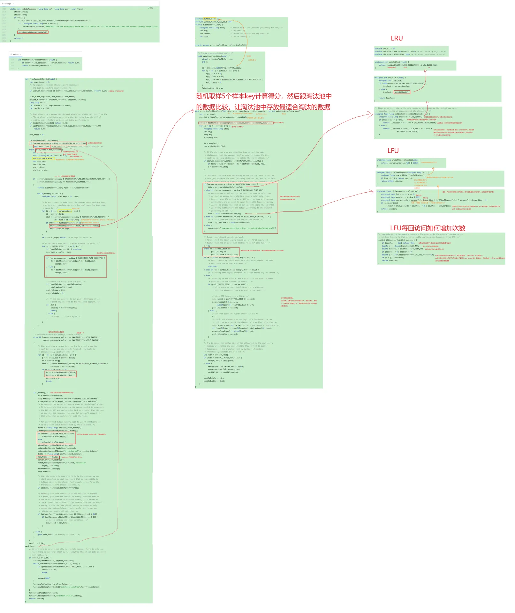

# 【源码】Redis
## 淘汰策略
版本6.0.8  
如果当前清除的内存还不够支持存入新的key，就会一直删除，直到放得下，每一轮删除，会清掉1个最该被淘汰的key。  
遍历每个db，从db里面取出5个(通过maxmemory-simples配置，默认是5，每个桶取5个最终会收集出16个淘汰掉，如果取样越多越精准)，然后总共是db*5个，每一个key会计算一个分数(ttl:最快过期的那个，lru:最后一次访问时间跟现在相差越大，lfu:访问次数最少的)，这个分数越高，越符合被淘汰掉，最后会放到一个淘汰池里，这个淘汰池大小是16，每一轮就从这个池中选出得分最高的那个进行删除，当然不淘汰和随机策略是不需要走上面的逻辑的，不淘汰直接就报错，随机就是随机取了  
  
LRU最后一次访问时间取秒级的24位，为什么取24位可能是从内存角度考虑出发  
正常就是用当前时间-最后一次访问时间，如果采用24位，减完如果是正的还好，有可能就会出现当前时间的24位比最后一次访问时间的24位还小，为负的怎么解决呢  
假如这个对象是8月份访问的，现在的时间是3月份，这个对象多久没访问  
12+3-8，相当于在加1轮  
所以如果当前时间的24位比最后一次访问时间的24位还小，那么就在加上1轮，即24位  

LRU有时效性问题，比如去年访问是3000w，但是今年访问是1000w。新的数据就会被淘汰  
如果是lfu算法，redis就记的不是最后一次访问时间，而是16位的时间+8位的次数  
16位的时间代表这个对象最后访问时间分单位的最后16位  
lfu的得分值计算，先用当前时间分单位16位与最后一次访问时间分单位的16位作差值，与lru的算法类似。即对象有多少分钟没被访问了，然后根据多少分钟没访问就减1的配置，减去相应的值，例如默认是每1分钟没访问就减1，如果配的是2，就是每2分钟没访问就减1，所以要除以这个配置，算出要减去多少，得到这个值后，用后8位的那个次数减去这个值，如果为负的就取0，  
这里的作用其实就是解决失效性问题，如果次数很多，但是是很久以前访问的，那么最后一次访问与当前时间的差值就会越大，然后用访问次数减去这个值，就会变得小很多，所以越久之前访问的，减去的次数就会越多，最后再用255减去这个值  
那接下来就是8位的次数是怎么存的呢，key不可能只会存255次，所以有下面的算法  
1.最大只能255，如果到了255，不往上加  
2.如果当前5<次数<255，那么越往上，加的概率越低  
3.如果<=5，每次访问必+1  
怎么控制这个次数越到，+1的概率越低呢。  
其实就是用下面的公式  
if (r<p) {  
count++;  
}  
这个r是个0到1之间的随机数。然后p是1/n +1，n可以理解为访问次数，所以访问次数越大，p就越小，p越小，那么r<p的概率也就越小  

## 过期策略
版本6.0.8  
### 被动过期
在任何增删改查的地方都会去调用这个方法，从库一般不会主动删数据，一切听从主的，4.0之后支持异步删除，根据lazyfree-lazy-expire，默认是关闭的，no
   

### 定期删除
1.遍历每个db，将每个db下存放过期key的dict中到期的key进行删除，每遍历16个db都会判断已经消耗的时间是否超过指定时间(25ms)，超过了就会退出此次定期删除任务。  
2.每个db下会进行多轮删除，每一轮即遍历两个hashTable中的链表，每一轮如果已经遍历了hashTable中20个节点或已经遍历了400个槽，就会判断这一轮删除的key占扫描key的比例是否超过10%，超过则大概率还有很多过期key，会继续当前db下一轮对hashTable的遍历，否则当前db删除结束，继续下一个db。  
  
