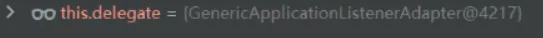
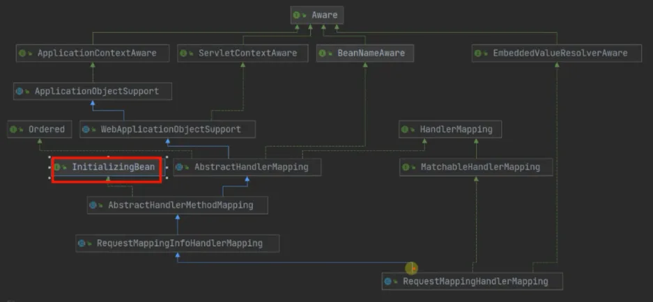
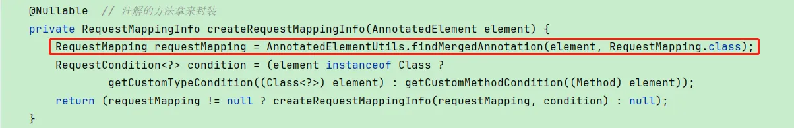
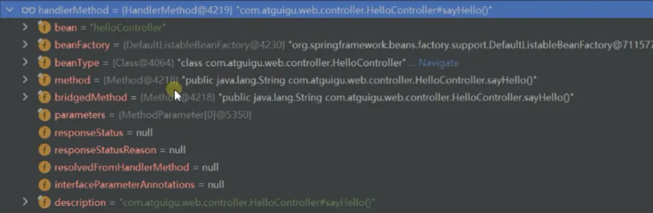
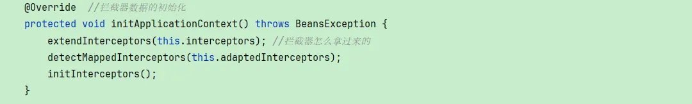
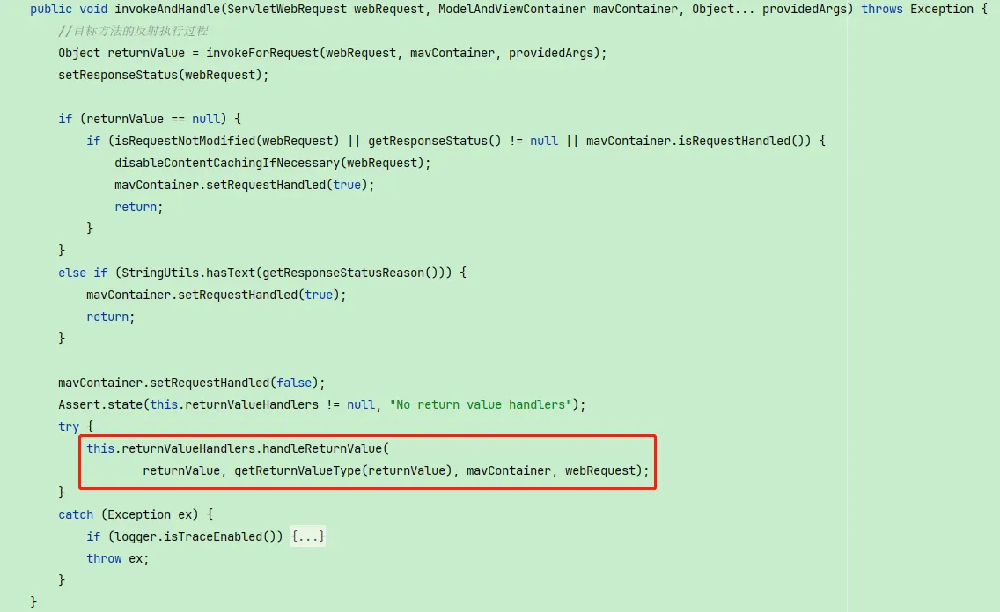

# 【源码】SpringMVC-DispatcherServlet
## DispatcherServlet结构
  
  
DispatcherServlet里的9大组件  
https://docs.spring.io/spring-framework/reference/web/webmvc/mvc-servlet/special-bean-types.html
  
## 9大组件初始化
Tomcat触发Servlet的初始化  
org.springframework.web.servlet.HttpServletBean#init-> initServletBean  
org.springframework.web.servlet.FrameworkServlet#initServletBean-> initWebApplicationContext-> configureAndRefreshWebApplicationContext->刷新容器  
org.springframework.context.support.AbstractApplicationContext#refresh -> finishRefresh【刷新容器12步最后一步】-> publishEvent  
  
  

org.springframework.context.event.SimpleApplicationEventMulticaster#multicastEvent(ApplicationEvent) -> multicastEvent  
  
此时的listener有一个是，这个是DispatcherServlet启动的时候加的  
  
调用listener的onApplicationEvent方法  
  
org.springframework.context.event.SourceFilteringListener#onApplicationEvent  
  
  
org.springframework.context.event.GenericApplicationListenerAdapter#onApplicationEvent  
  
  
org.springframework.web.servlet.FrameworkServlet.ContextRefreshListener  
  
org.springframework.web.servlet.FrameworkServlet#onApplicationEvent  
    
org.springframework.web.servlet.DispatcherServlet#onRefresh  
  
  

### MultipartResolver


### LocaleResolver
  
org.springframework.web.servlet.DispatcherServlet#getDefaultStrategy -> org.springframework.web.servlet.DispatcherServlet#getDefaultStrategies  
  
去DispatcherServlet类路径下加载DispatcherServlet.properties文件，文件中配置了每一个组件的默认值，所以9大组件加载的时候如果没有，会从这个文件中按指定的名称找对应的值  
  
  
我们现在正在初始化LocaleResolver，所以key是，最终根据文件的默认值创建出AcceptHeaderLocaleResolver  
  
  
### handlerMappings
会初始化三个类，我们最常用的是RequestMappingHandlerMapping，下面以分析它为例  
  
  
  
同样是通过bean容器获取实例，经过bean的生命周期，最后会来到初始化方法  
  
org.springframework.web.servlet.mvc.method.annotation.RequestMappingHandlerMapping#afterPropertiesSet  
  
org.springframework.web.servlet.handler.AbstractHandlerMethodMapping#afterPropertiesSet  
  

拿到mvc容器(子容器)的所有组件  
  
  
org.springframework.web.servlet.mvc.method.annotation.RequestMappingHandlerMapping#isHandler，先判断标了Controller或RequestMapping注解的才行  

  
org.springframework.web.servlet.mvc.method.annotation.RequestMappingHandlerMapping#getMappingForMethod  
  
只找标了RequestMapping注解
  
org.springframework.web.servlet.handler.AbstractHandlerMethodMapping#registerHandlerMethod
  
org.springframework.web.servlet.handler.AbstractHandlerMethodMapping.MappingRegistry#register
  
RequestMappingHandlerMapping中，有一个属性，其它Mapping中也有，只是名字叫得不同
  
> BeanNameUrlHandlerMapping则是扫描所有bean名字以/开头的类作为Handler  

### RequestMappingHandlerAdapter
会初始化四个类，我们最常用的是RequestMappingHandlerAdapter，下面以分析它为例  
一样会经过bean的生命周期来到初始化，初始化里配置的内容都是为后续handler执行时服务  
  
org.springframework.web.servlet.mvc.method.annotation.RequestMappingHandlerAdapter#getDefaultArgumentResolvers，下面列了默认的参数解析器  
  
org.springframework.web.servlet.mvc.method.annotation.RequestMappingHandlerAdapter#getDefaultReturnValueHandlers，下面列了默认的返回值解析器
  
### viewNameTranslator
  
如果我们没注入，默认使用的是DefaultRequestToViewNameTranslator
### handlerExceptionResolvers
默认会初始化3个，其中我们最常用到的就是ExceptionHandlerExceptionResolver，在初始化的时候会找到所有标了ControllerAdvice注解的类，把参数解析器和返回值解析器设置进去
  

org.springframework.web.method.ControllerAdviceBean#findAnnotatedBeans
  
org.springframework.web.method.annotation.ExceptionHandlerMethodResolver#ExceptionHandlerMethodResolver  
扫描当前这个ControllerAdvice中所有标注了@ExceptionHandler的方法
  
每一个方法能处理什么异常类型，缓存到Map中。
  


## 流程
  
所有请求最终会来到org.springframework.web.servlet.FrameworkServlet#processRequest
  
org.springframework.web.servlet.DispatcherServlet#doService
  
   

### 获取Handler执行链
   
因为我们最常用的就是RequestMapping，所以命中的是RequestMappingHandlerMapping
   
org.springframework.web.servlet.handler.AbstractHandlerMapping#getHandler  
先找到对应的handler，然后再找到所有的拦截器，并构造成一个链
   
org.springframework.web.servlet.handler.AbstractHandlerMethodMapping#getHandlerInternal
  
    
最终封装的HandlerMethod长这样
    
org.springframework.web.servlet.handler.AbstractHandlerMethodMapping#lookupHandlerMethod  
关键在mappingRegistry里面  
  
    
org.springframework.web.servlet.handler.AbstractHandlerMapping#getHandlerExecutionChain
    
org.springframework.web.servlet.handler.AbstractHandlerMapping#initApplicationContext  
拦截器是在初始化的时候放进去的
  
  
  


### 找Handler的适配器
org.springframework.web.servlet.DispatcherServlet#getHandlerAdapter
  
   
org.springframework.web.servlet.mvc.HttpRequestHandlerAdapter  
只处理实现了HttpRequestHandler的Handler
   
```java
//BeanNameUrlHandlerMapping 创建好对象以后也要初始化，启动拿到容器中所有组件，看谁的名字是以/开始的，就把这个组件注册为处理器
@Controller("/helloReq") //BeanNameUrlHandlerMapping 就会把他注册进去
public class HelloHttpRequestHandler implements HttpRequestHandler {
	//启用 HttpRequestHandlerAdapter

	//处理请求
	@Override
	public void handleRequest(HttpServletRequest request,
							  HttpServletResponse response) throws ServletException, IOException {
		response.getWriter().write("HelloHttpRequestHandler....");
	}
}
```
获取Handler时，BeanNameUrlHandlerMapping中可以看到保存有相关的Handler
   
找到适配器后，执行适配器的handle方法，会回调到处理器的handleRequest方法
  

org.springframework.web.servlet.mvc.SimpleControllerHandlerAdapter  
只处理实现了Controller的Handler  
  
```java
@org.springframework.stereotype.Controller("/helloSimple")
public class HelloSimpleController implements Controller {
	@Override
	public ModelAndView handleRequest(HttpServletRequest request, HttpServletResponse response) throws Exception {
		return null;
	}
}
```

找到适配器后，执行适配器的handle方法，会回调到处理器的handleRequest方法
  

org.springframework.web.servlet.mvc.method.annotation.RequestMappingHandlerAdapter  
只处理实现了HandlerMethod的Handler
  
我们编写的@RequestMapping注解的接口就找到了RequestMappingHandlerAdapter这个适配器

适配器自己的理解  
> Springmvc已经找到了路径对应需要执行请求的Handler为什么还要有适配器呢，因为handler可以有很多种写法，那么每一种的执行可能都会略有不用，如果我们来写代码的话，可能就会写判断这个handler是哪种类型，然后在if里面写对应的handler的执行，这样就会有很多的if，Springmvc相当于把每一个if分支抽成一个适配器，适配器的support方法就是原先if的判断，if里面的逻辑就是handler的执行，然后外部就是遍历每个适配器，其实就是在判断走哪个if分支，拿到某个适配器也就意味着要走哪个if分支

### 拦截器的preHandle执行

### 执行
前面已经介绍了HttpRequestHandlerAdapter和SimpleControllerHandlerAdapter如何调用handler的执行，下面重点介绍RequestMappingHandlerAdapter如何调用handler的执行  
org.springframework.web.servlet.mvc.method.AbstractHandlerMethodAdapter#handle

org.springframework.web.servlet.mvc.method.annotation.RequestMappingHandlerAdapter#handleInternal
  

org.springframework.web.servlet.mvc.method.annotation.ServletInvocableHandlerMethod#invokeAndHandle  
执行目标方法，处理返回值

org.springframework.web.method.support.InvocableHandlerMethod#invokeForRequest  
先找到方法反射执行时需要的参数值，再反射调用方法
  
遍历方法的每个参数，看参数解析器中哪个解析器支持，找到解析器并将参数的值设置好
  
  
org.springframework.web.method.support.HandlerMethodArgumentResolverComposite#supportsParameter
  
遍历每一种参数解析器，如果支持就返回解析器，解析器的判断比如RequestParamMethodArgumentResolver判断参数是否有RequestRaram注解、PathVariableMethodArgumentResolver判断参数是否有PathVariable注解、RequestHeaderMethodArgumentResolver判断参数是否有RequestHeader注解等
  
方法反射执行完后，需要对返回值进行处理
  
org.springframework.web.method.support.HandlerMethodReturnValueHandlerComposite#handleReturnValue
  
遍历每一种返回值解析器，如果支持就返回解析器，解析器的判断比如ModelAndViewMethodReturnValueHandler判断返回值类型是否是ModelAndView、ModelMethodProcessor判断返回值类型是否是Model、ViewMethodReturnValueHandler判断返回值类型是否是void或String、RequestResponseBodyMethodProcessor判断是否标了@ResponseBody注解并且返回值是String等
  
下面举例ViewMethodReturnValueHandler处理返回值的过程  
org.springframework.web.servlet.mvc.method.annotation.ViewNameMethodReturnValueHandler#handleReturnValue，判断是否需要转发或重定向  
> 这里可能会有疑问，我们平常返回String，而且标了RestController注解或@ResponseBody注解，并不会跳转页面，是因为这种用法会被RequestResponseBodyMethodProcessor解析处理，而这个返回值解析器是在ViewMethodReturnValueHandler解析之前  
>   

  
方法反射执行完后，返回值也处理完，就封装ModelAndView  
org.springframework.web.servlet.mvc.method.annotation.RequestMappingHandlerAdapter#getModelAndView  
  

### 设置默认的视图名
org.springframework.web.servlet.DispatcherServlet#applyDefaultViewName
  
  

### 拦截器的PostHandle执行

### 异常处理
org.springframework.web.servlet.DispatcherServlet#processDispatchResult
  
遍历所有的异常解析器，看哪个可以处理，如果没有可以处理的，直接抛出异常
  
  
org.springframework.web.servlet.handler.AbstractHandlerExceptionResolver  
异常解析器的父类抽象类  
  
org.springframework.web.servlet.handler.AbstractHandlerMethodExceptionResolver  
ExceptionHandlerExceptionResolver的父类  
  
org.springframework.web.servlet.mvc.method.annotation.ExceptionHandlerExceptionResolver#doResolveHandlerMethodException  
找到能处理异常的方法，再反射调用  
  
前面解析器初始化的时候会编译所有标了ControllerAdvice注解的类封装成ExceptionHandlerMethodResolver，并找到类中标有ExceptionHandler注解的方法，并保存它能处理哪些异常类
  
org.springframework.web.method.annotation.ExceptionHandlerMethodResolver#resolveMethod
  
org.springframework.web.method.annotation.ExceptionHandlerMethodResolver#resolveMethodByThrowable
  
  
    
```java
@ControllerAdvice  //专门处理所有controller异常的，默认加在容器中
public class MyExceptionHandler {

	@ResponseBody
	@ExceptionHandler(value = {ArithmeticException.class})
	public String handleZeroException(Exception exception){
		//参数位置  https://docs.spring.io/spring-framework/docs/current/reference/html/web.html#mvc-ann-exceptionhandler-args
		//返回值   https://docs.spring.io/spring-framework/docs/current/reference/html/web.html#mvc-ann-exceptionhandler-return-values
		// 异常处理器的功能怎么增强出来的【参数解析器，返回值处理器】.....
		return "Error";
	}
}
```
org.springframework.web.servlet.handler.SimpleMappingExceptionResolver
    
org.springframework.web.servlet.mvc.support.DefaultHandlerExceptionResolver  
默认的异常解析器,判断是否是指定的异常，直接response.sendError，tomcat响应默认错误页  
    
org.springframework.web.servlet.mvc.annotation.ResponseStatusExceptionResolver
  
  
    

```java
/**
 * 自定义异常上有注解的
 */
@ResponseStatus(value = HttpStatus.CONFLICT,reason = "非法用户")
public class InvalidUserException  extends RuntimeException{
	private static final long serialVersionUID = -7034897190745766222L;
}
```
```java
@GetMapping("/hello")
public String sayHello(){
    //非法的用户信息
    throw new InvalidUserException();
    return "index.jsp";
}
```
对于上面没有任何异常解析器能够处理的异常，会直接往外抛出，最后被catch后做进一步处理  
org.springframework.web.servlet.DispatcherServlet#doDispatch  
    
最后还是抛出去
  
### 视图解析
  
先解析视图，拿到视图后再渲染决定页面长什么样
  
遍历所有的视图解析器，看哪个可以处理
  
详细渲染过程，略

### 拦截器的AfterCompletion执行