# 【源码】SpringMVC-启动
## Demo
::: code-group
```java[HelloController.java]
//@Controller; 如果有父子容器 @Component，默认是在父容器中，还找不到
//@Component+@RequestMapping
@RestController
public class HelloController {

	public HelloController(){
		System.out.println("HelloController.....");
	}

	@Autowired
	HelloService helloService;

	@GetMapping("/hello") // 所有的xxxMapping都是RequestMapping
	public String sayHello(){

		String mvc = helloService.say("MVC");
		return mvc;
	}
}
```
```java[HelloService.java]
@Service
public class HelloService {

	public HelloService(){
		System.out.println("HelloService.....");
	}

	public String say(String name){
		return "Hello,"+name;
	}
}
```
:::

::: code-group
```java[SpringConfig.java]
/**
 * Spring不扫描controller组件、AOP咋实现的....
 */
@ComponentScan(value = "com.demo.web",excludeFilters = {
		@ComponentScan.Filter(type= FilterType.ANNOTATION,value = Controller.class)
})
@Configuration
public class SpringConfig {
	//Spring的父容器

}
```
```java[SpringMVCConfig.java]
/**
 * SpringMVC只扫描controller组件，可以不指定父容器类，让MVC扫所有。@Component+@RequestMapping就生效了
 */
@ComponentScan(value = "com.demo.web",includeFilters = {
        @ComponentScan.Filter(type= FilterType.ANNOTATION,value = Controller.class)
},useDefaultFilters = false)
public class SpringMVCConfig {
    //SpringMVC的子容器，能扫描的Spring容器中的组件
}
```
:::
注解版的两种配置方式
```java
/**
 * 最快速的整合注解版SpringMVC和Spring的
 */
public class QuickAppStarter extends AbstractAnnotationConfigDispatcherServletInitializer {
	@Override //根容器的配置（Spring的配置文件===Spring的配置类）
	protected Class<?>[] getRootConfigClasses() {
		return new Class<?>[]{SpringConfig.class};
	}

	@Override //web容器的配置（SpringMVC的配置文件===SpringMVC的配置类）
	protected Class<?>[] getServletConfigClasses() {
		return new Class<?>[]{SpringMVCConfig.class};
	}

	@Override //Servlet的映射，DispatcherServlet的映射路径
	protected String[] getServletMappings() {
		return new String[]{"/"};
	}

	@Override
	protected void customizeRegistration(ServletRegistration.Dynamic registration) {
//		super.customizeRegistration(registration);

//		registration.addMapping("");//
	}
}
```
```java
/**
 * 只要写了这个，相当于配置了SpringMVC的DispatcherServlet
 * 1、Tomcat一启动就加载他
 * 		1）、创建了容器、制定了配置类（所有ioc、aop等spring的功能就ok）
 * 		2）、注册一个Servlet；	DispatcherServlet；
 * 		3）、以后所有的请求都交给了 DispatcherServlet；
 * 	效果，访问Tomcat部署的这个Web应用下的所有请求都会被 	DispatcherServlet 处理
 * 	DispatcherServlet就会进入强大的基于注解的mvc处理流程（@GetMapping）
 * 必须Servlet3.0以上才可以；Tomcat6.0以上才支持Servlet3.0规范
 *
 * Servlet3.0是javaEE的Web的规范标准，Tomcat是Servlet3.0规范的一个实现；
 */
public class AppStarter implements WebApplicationInitializer {
//	@Override
	public void onStartup(ServletContext servletContext) throws ServletException {
		//1、创建ioc容器
		AnnotationConfigWebApplicationContext context = new AnnotationConfigWebApplicationContext();
		context.register(SpringConfig.class); //2、传入一个配置类
		//以上截止，ioc容器都没有启动
		//3、配置了 DispatcherServlet,利用Servlet的初始化机制
		DispatcherServlet servlet = new DispatcherServlet(context);
		ServletRegistration.Dynamic registration = servletContext.addServlet("app", servlet);
		registration.setLoadOnStartup(1);
		registration.addMapping("/"); //映射路径

		//启动了容器？上面的Servlet添加到 servletContext 里面以后，Tomcat就会对 DispatcherServlet进行初始化
		//<servlet></servlet>
//		servletContext.addServlet("abc",XXXX.class)

	}
}
```

## SpringServletContainerInitializer

在Servlet规范里，会通过Spi的机制加载`ServletContainerInitializer`的实现类并调用onStartup方法。而Tomcat实现了Servlet规范，所以启动Tomcat时就会触发到`org.springframework.web.SpringServletContainerInitializer`的`onStartup`方法，在`onStartup`方法里，SpringMvc会遍历所有的`WebApplicationInitializer`实现类，并调用`onStartup`方法  
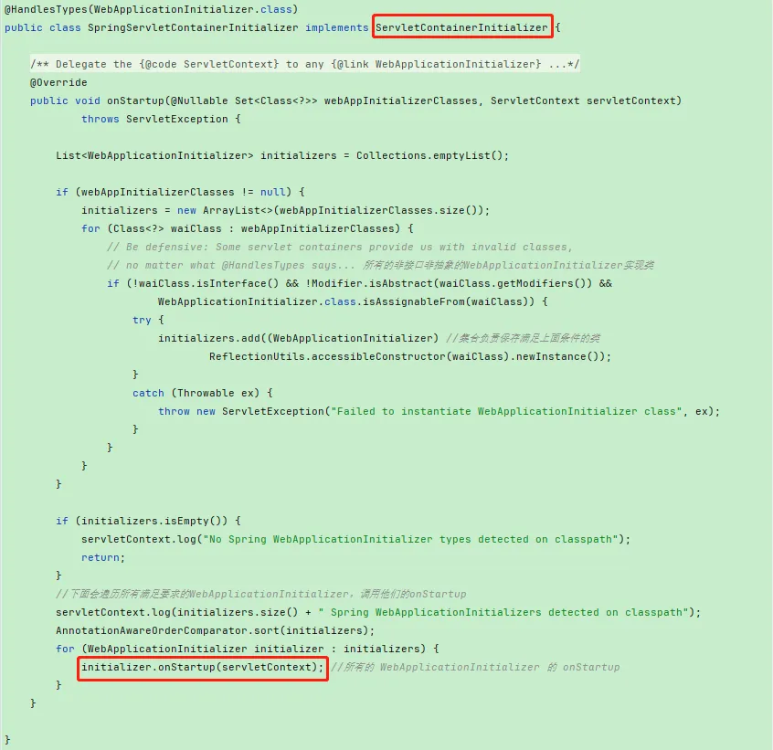  
此时就会触发到我们在Demo里通过注解配置SpringMvc的加载，后文以QuickAppStarter作为分析，我们的QuickAppStarter实现了`AbstractAnnotationConfigDispatcherServletInitializer`  
org.springframework.web.servlet.support.AbstractDispatcherServletInitializer  
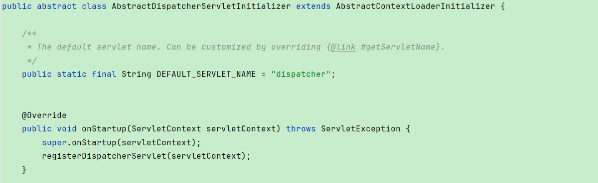  
**先调用父类的onStartup方法**  
org.springframework.web.context.AbstractContextLoaderInitializer#onStartup  
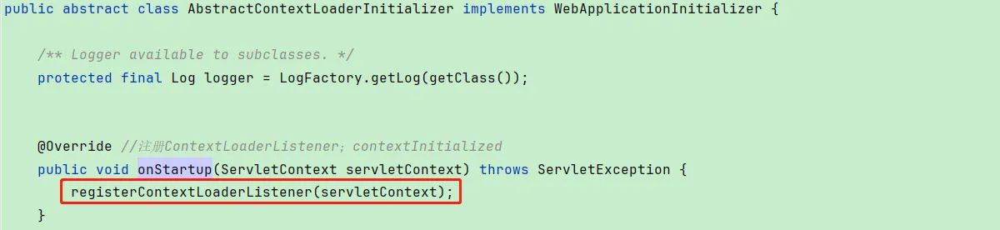  
创建一个根容器(spring的容器)，同时创建一个监听器，并把根容器放到监听器里，最后把监听器放到Servlet的上下文  
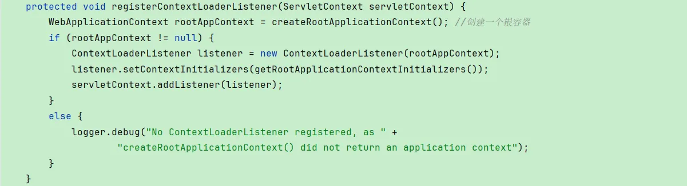  
创建根容器，`getRootConfigClasses`会回调到QuickAppStarter的`getRootConfigClasses`方法  
org.springframework.web.servlet.support.AbstractAnnotationConfigDispatcherServletInitializer#createRootApplicationContext  
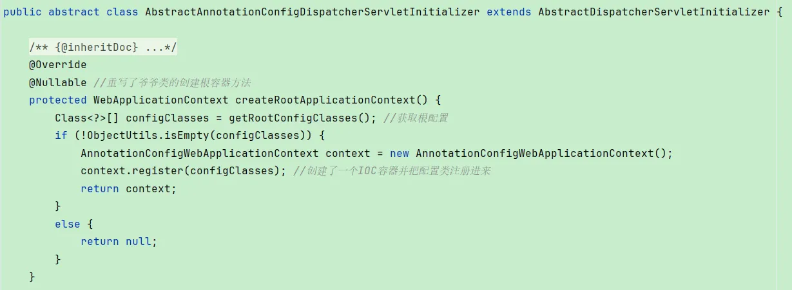  
创建监听器，当前web应用启动以后（Tomcat把web应用加载了以后），调用`contextInitialized`方法  
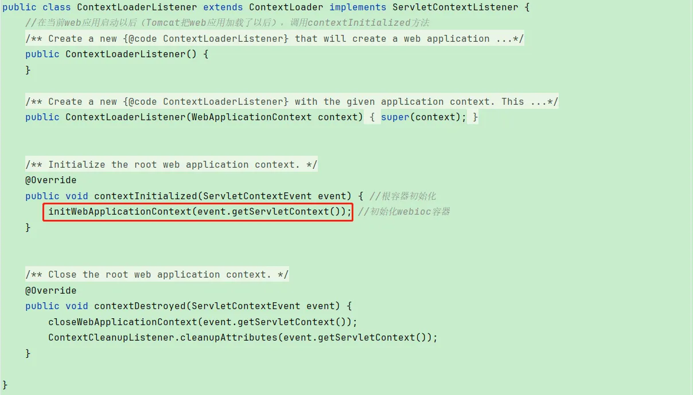  
**registerDispatcherServlet**  
org.springframework.web.servlet.support.AbstractDispatcherServletInitializer#registerDispatcherServlet  
创建一个mvc容器(springmvc的容器)，同时创建一个`DispatcherServlet`，并把mvc容器放到`DispatcherServlet`里，最后把`DispatcherServlet`放到Servlet的上下文  
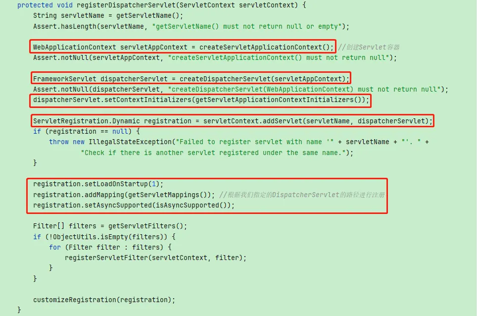  
创建springmvc容器，`getServletConfigClasses`会回调到QuickAppStarter的`getServletConfigClasses`方法，org.springframework.web.servlet.support.AbstractAnnotationConfigDispatcherServletInitializer#createServletApplicationContext  
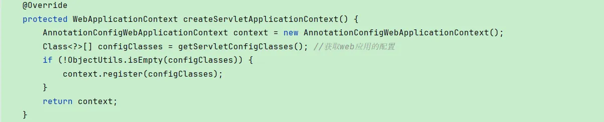  
前面我们提到`ContextLoaderListener`会在web应用启动以后（Tomcat把web应用加载了以后），被tomcat调用`contextInitialized`方法  
org.springframework.web.context.ContextLoader#initWebApplicationContext  
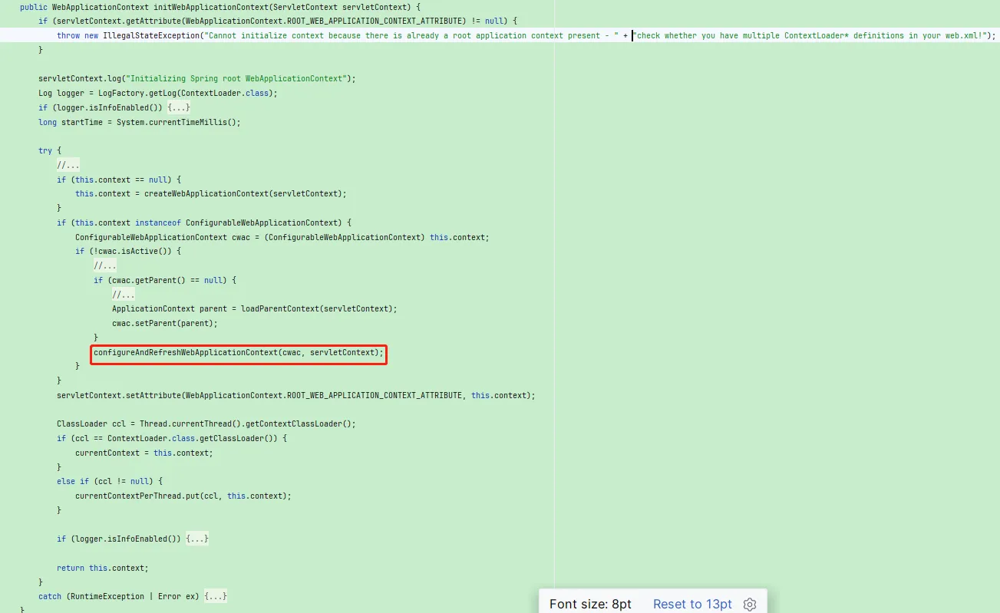  
刷新容器  
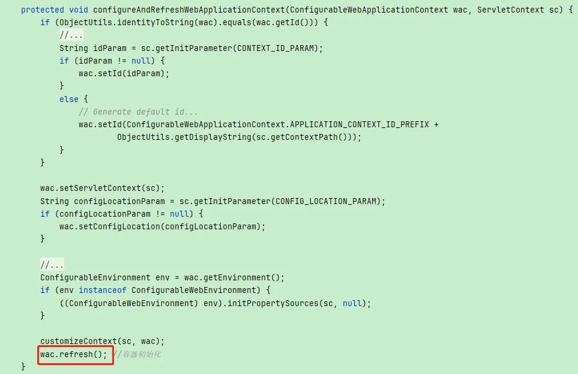  
接着Tomcat创建Servlet时，会进入`Servlet`的`init`方法，回调到我们的`HttpServletBean`的`init`方法  
org.springframework.web.servlet.HttpServletBean#init  
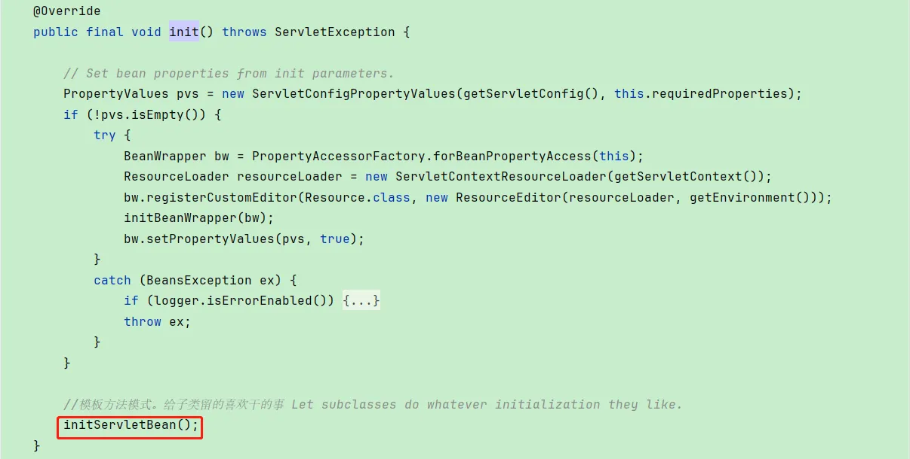  
再回调到子类的方法  
org.springframework.web.servlet.FrameworkServlet#initServletBean  
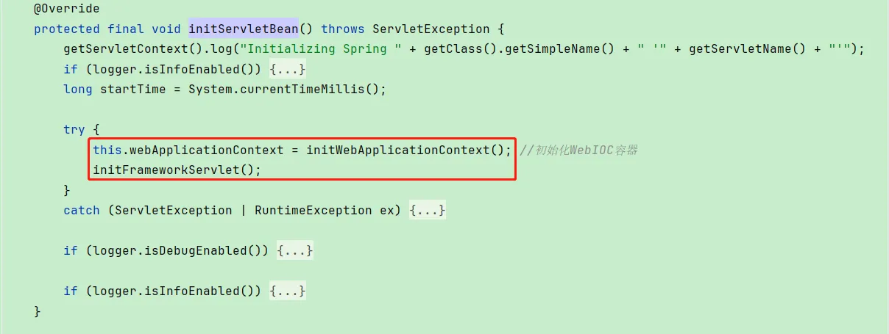  
设置mvc容器的父容器，并且刷新mvc容器
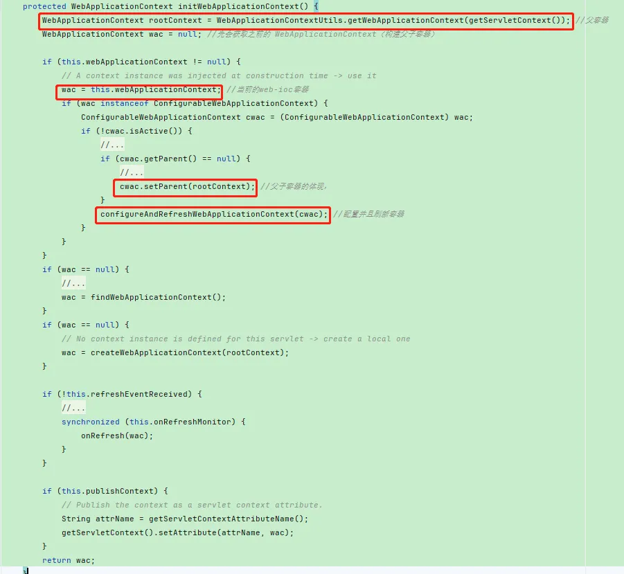  
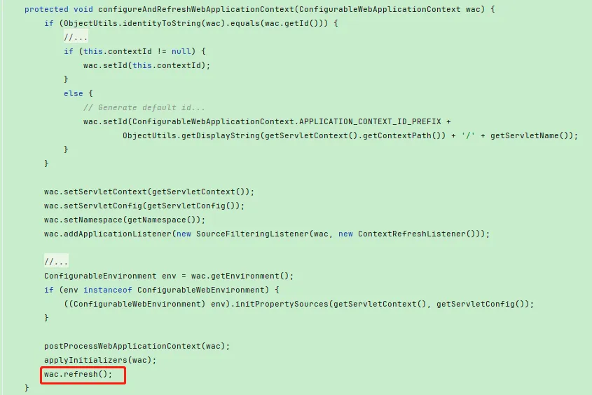  

