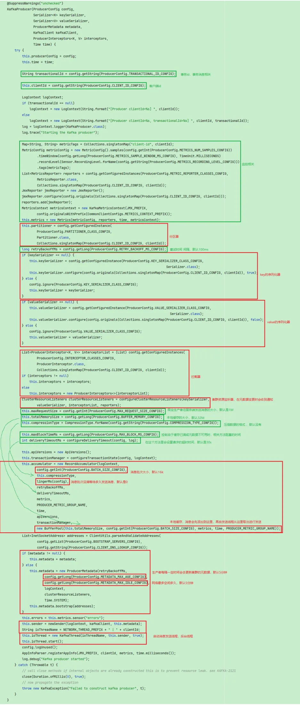
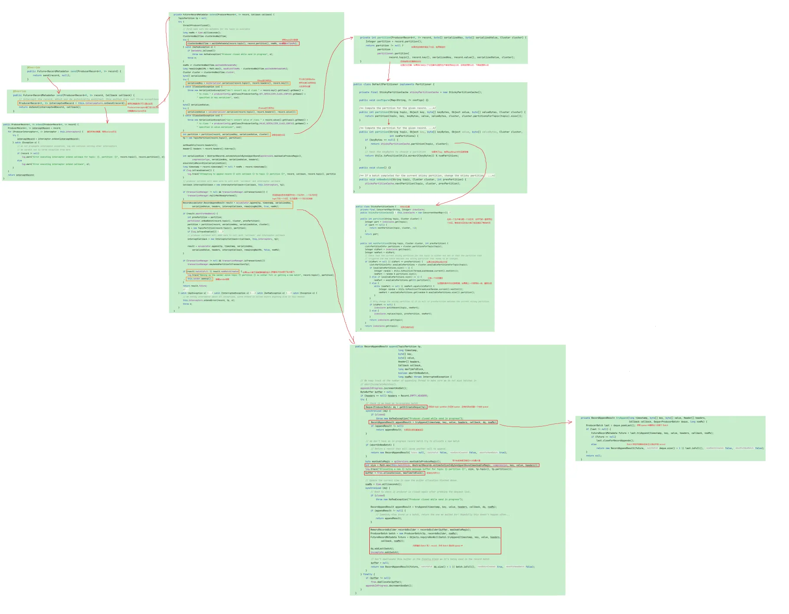
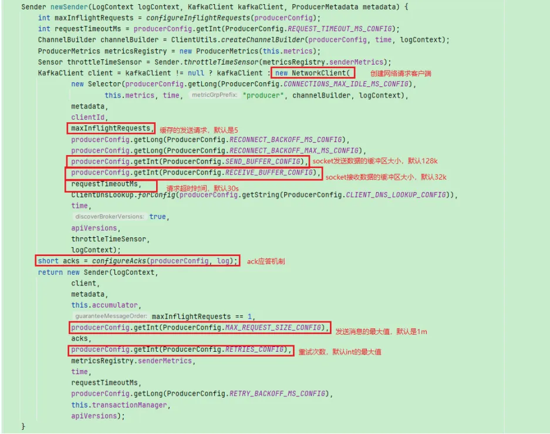
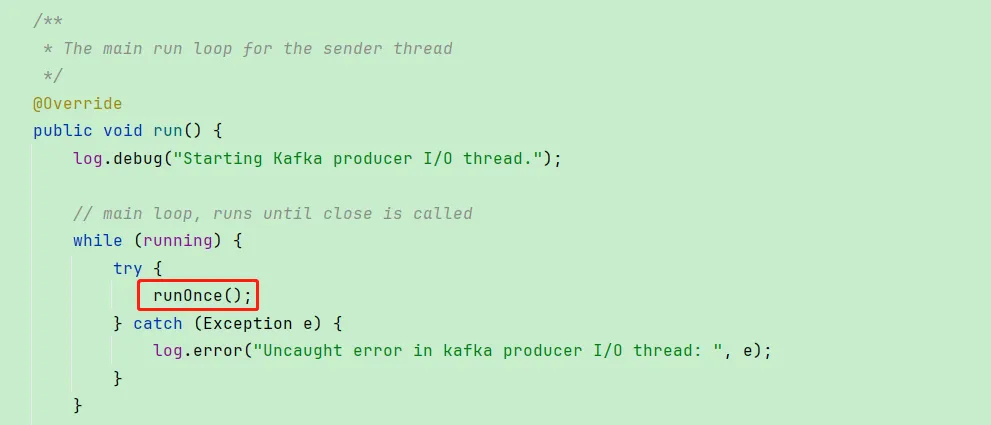
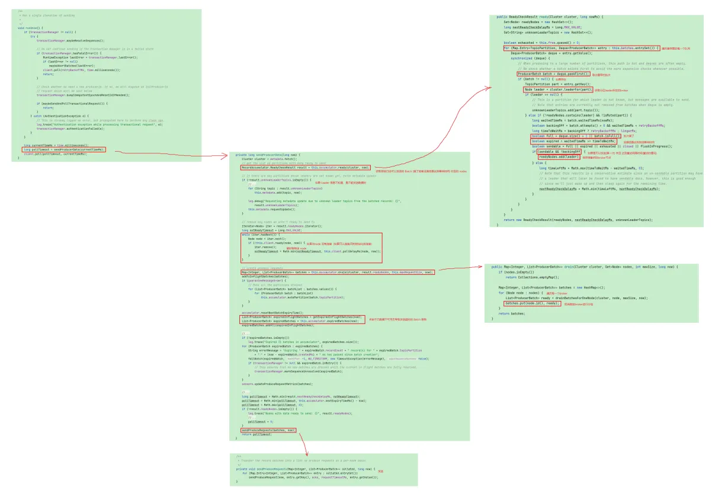
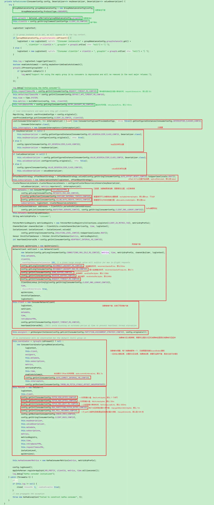
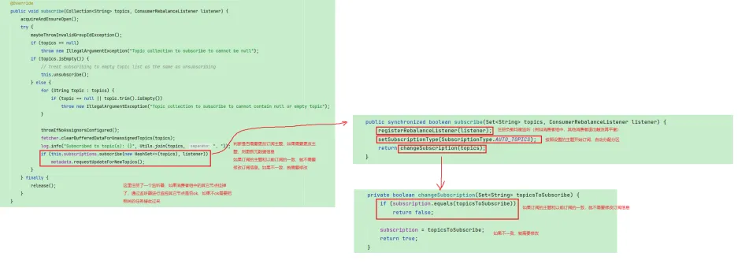
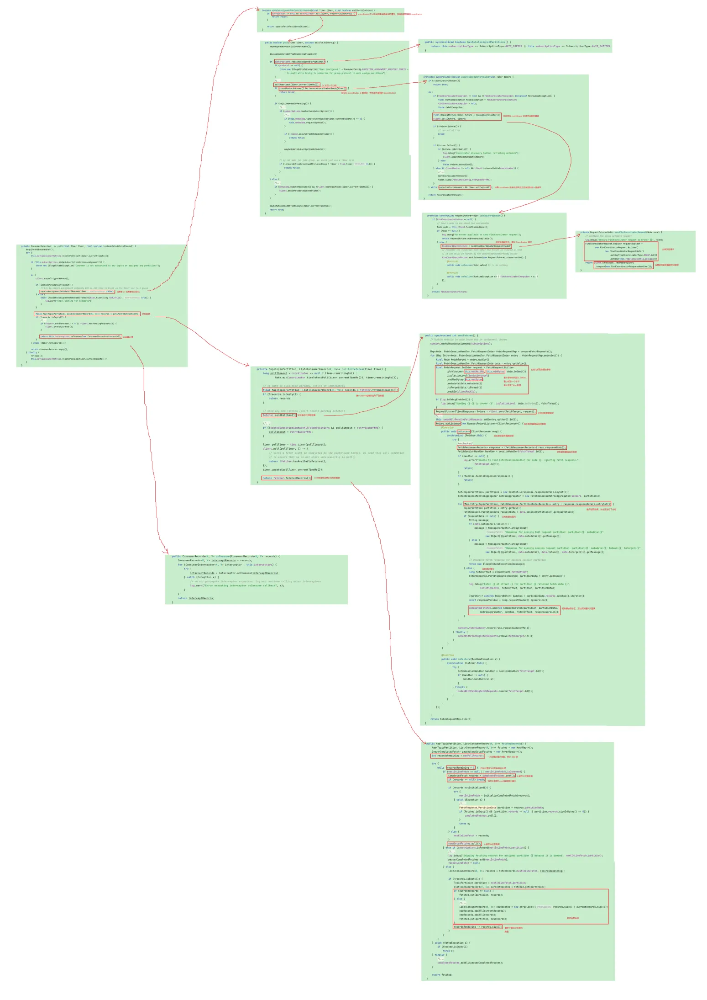

# 【源码】kafka
## 源码下载
https://kafka.apache.org/downloads
版本：3.0

## 生产者
### KafkaProducer

### send()

### Sender线程发送消息

## 消费者
### KafkaConsumer
.png)

### subscribe()
.png)  

### poll()
.png)

## 服务端
待更新