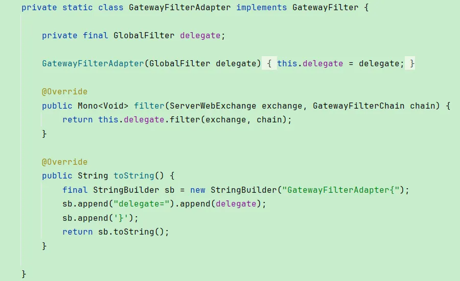
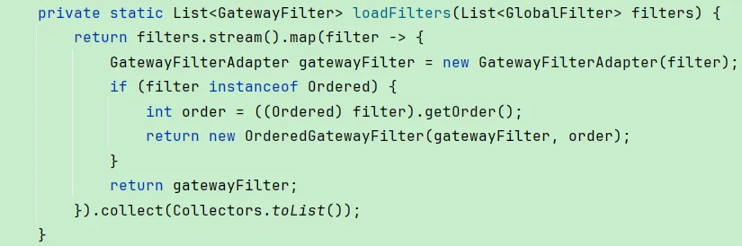

# 【源码】优秀设计思想

## 设计模式
### 适配器
将GlobalGatewayFilter统一转换为GatewayFilter，使用适配器模式，  
GatewayFilterAdapter实现了GatewayFilter接口，并接收一个GlobalGatewayFilter作为成员变量，这样子使用GlobalGatewayFilter就可以跟使用GatewayFilter一样，通过GatewayFilterAdapter去调GlobalGatewayFilter   
  
  

### 责任链+策略模式
SpringMVC中匹配handler的适配器，并通过适配器进行执行handler，SpringGateway中同理用到

## 空间时间转换
### 空间换时间
Redis中每个db中会把相关的key单独存储，比如设置了过期时间的，阻塞命令操作的等，这样想要操作这些数据的时候就不用从所有key-value中去过滤  
JVM分代，垃圾回收不用一次扫描整个堆  
### 时间换空间
Redis的zipList  

## 分片
竞争激烈，并发高处理同步，考虑使用分片，减少冲突  
ConcurrentHashMap分段  
Kafka分区  

## 自旋手段
### Thread.yield()  
1.8ConcurrentHashMap在控制多线程下只有一个线程进行初始化时，针对无法参与初始化的线程采用Thread.yield来实现自旋  
### Semaphore  
Redisson在加锁失败时，通过Semaphore来实现自旋，加锁成功的获取信号量，加锁失败的需要等到信号量释放后才开始  

## 线程
### daemon线程
Kafka客户端的消息发送线程  
