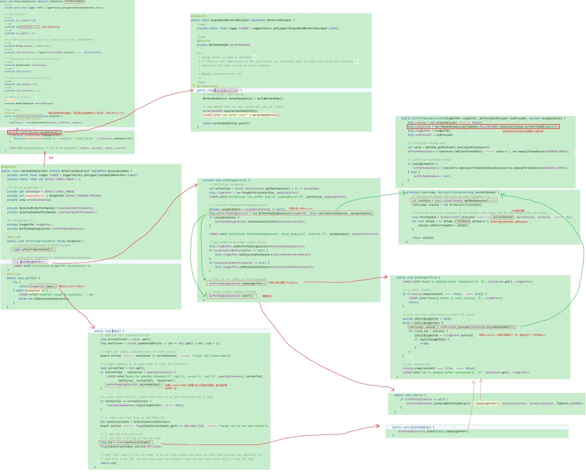

# 【源码】uid-generator
负责生成全局唯一id，基于百度的uid-generator  
https://github.com/baidu/uid-generator/blob/master/README.zh_cn.md

## 工作机制
百度的uid默认28位秒级时间戳，机器位22位，随机数13位，本质是通过一个数组，提前缓存了一批uid，并且会周期性的往里面填充，如果取的时候发现已经低于某个阈值，也会再去拿一批进行填充

## 如果维护workId
默认通过一个一个表的主键进行维护

## 如何解决时间回拨问题
启动的时候会在内存里记录下时间戳，所以假如机器的时间回退了，但是没重启服务，其实不影响的，因为内存里的时间戳没变；如果重启了，那内存中的时间也会重新更新，有可能就会跟以前的一样，但是只要重启了又是一个新的workId，所以uid不会重复

## 源码
  