## 1.Spring Security 原理介绍

##### 如果在classpath下有spring security相关jar包，springboot会替我们做安全配置。
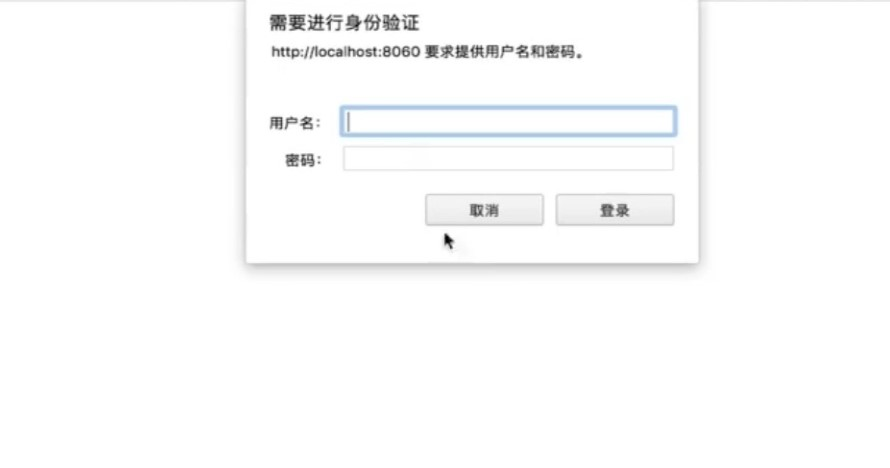
```
用户名：（固定）
user
```
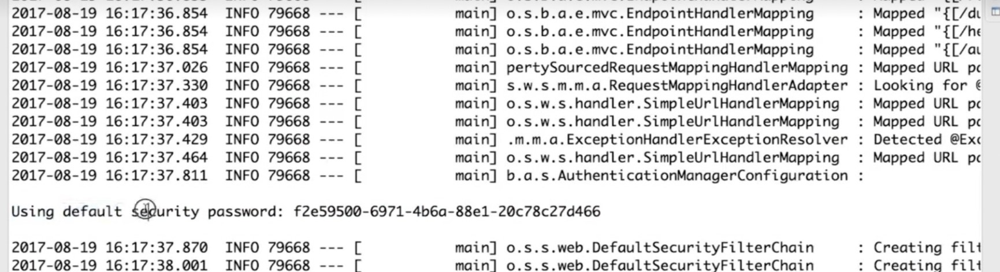
```
密码：（看启动日志，默认安全密码）
```

##### 默认不做任何配置的时候，spring security做了两件事。把访问的所有服务都保护起来，访问任何一个restful服务，都要先进行身份认证，认证方式是http.base方式。
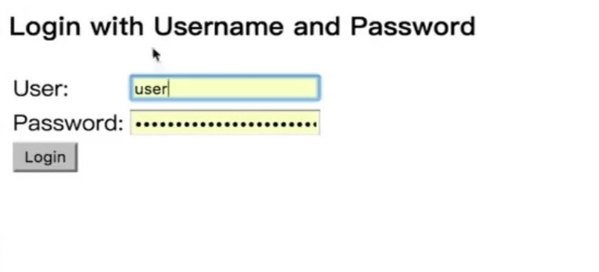

##### 配置
security-browser:
```java
@Configuration
public class BrowserSecurityConfig extends AbstractChannelSecurityConfig {
	@Override
	protected void configure(HttpSecurity http) throws Exception {
//  http.formLogin()  //formLogin表单登录
    http.httpBasic()  //http.base登录
        .and()
        .authorizeRequests()
        .anyRequest()  //任何请求都要身份认证
        .authenticated();
  }
}
```
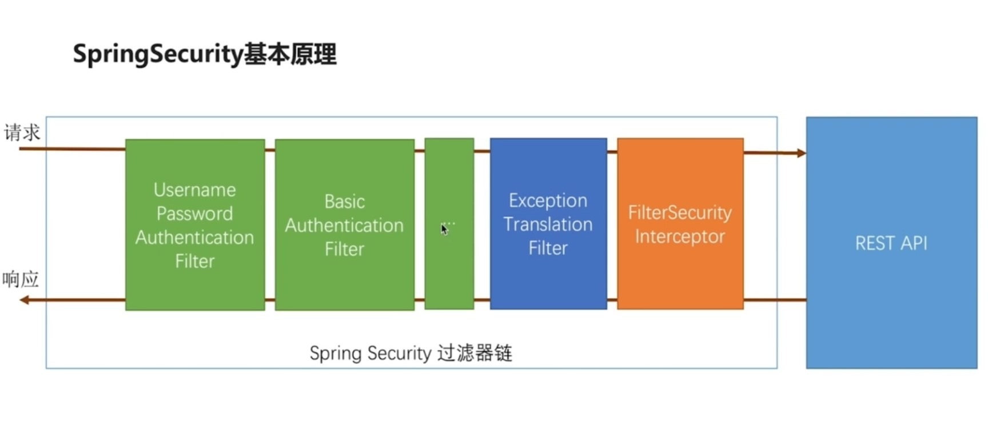
```
绿色过滤器：认证用户的身份，每一个过滤器处理一种认证方式。
橙色过滤器：最终到这里，决定当前请求能不能去访问后面的服务，依据代码里的配置，判断是不是经过了前面的认证配置，根据代码中的规则判断过还是不过，不过会根据不用的原因抛出异常。
蓝色过滤器：捕获后面这个过滤器抛出的异常，根据抛出的异常做出相应的处理。
```

## 2.基于Spring Security的默认实现开发“用户名 + 密码” 认证
### 自定义用户认证逻辑
##### 处理用户信息获取逻辑 UserDetailsService & 处理用户校验逻辑 UserDetails
security-demo:
```java
@Component
public class MyUserDetailsService implements UserDetailsService {
	private Logger logger = LoggerFactory.getLogger(getClass());

	@Override
	public UserDetails loadUserByUsername(String username) throws UsernameNotFoundException {
		logger.info("表单登录用户名:" + username);
		// 根据用户名查找用户信息
		// 根据查找到的用户信息判断用户是否被冻结
    // User => isAccountNonExpired()
    // User => isAccountNonLocked()
    // User => isCredentialsNonExpired()
    // User => isEnabled()
		return new User(username, "123456", true, true, true, true, AuthorityUtils.commaSeparatedStringToAuthorityList("admin"));
	}
}
```
##### 处理密码加密解密 PasswordEncoder
```java
@Configuration
public class BrowserSecurityConfig extends AbstractChannelSecurityConfig {
	@Bean
	public PasswordEncoder passwordEncoder() {
		return new BCryptPasswordEncoder();
	}
  ...
}
```
```java
@Component
public class MyUserDetailsService implements UserDetailsService {
	private Logger logger = LoggerFactory.getLogger(getClass());
	@Autowired
	private PasswordEncoder passwordEncoder;

	@Override
	public UserDetails loadUserByUsername(String username) throws UsernameNotFoundException {
    ...
    String password = passwordEncoder.encode("123456");
		logger.info("数据库密码是:"+password);
		return new User(username, password, true, true, true, true, AuthorityUtils.commaSeparatedStringToAuthorityList("admin"));
	}
}
```

### 个性化用户认证流程
##### 自定义登录页面
```java
@Configuration
public class BrowserSecurityConfig extends AbstractChannelSecurityConfig {
	...

	@Override
	protected void configure(HttpSecurity http) throws Exception {
    http.formLogin()
        .loginPage("/login.html")
        .loginProcessingUrl("/authentication/form")
        .and()
        .authorizeRequests()
        .antMatchers("login.html").permitAll()
        .anyRequest()
        .authenticated()
        .and()
        .csrf().disable();
  }
}
```
security-browser \src\main\resources\resources\login.html
```html
<!DOCTYPE html>
<html>
<head>
<meta charset="UTF-8">
<title>登录</title>
</head>
<body>
	<h2>标准登录页面</h2>
	<h3>表单登录</h3>
	<form action="/authentication/form" method="post">
		<table>
			<tr>
				<td>用户名:</td>
				<td><input type="text" name="username"></td>
			</tr>
			<tr>
				<td>密码:</td>
				<td><input type="password" name="password"></td>
			</tr>
			<tr>
				<td colspan="2"><button type="submit">登录</button></td>
			</tr>
		</table>
	</form>
	<br>
</body>
</html>
```
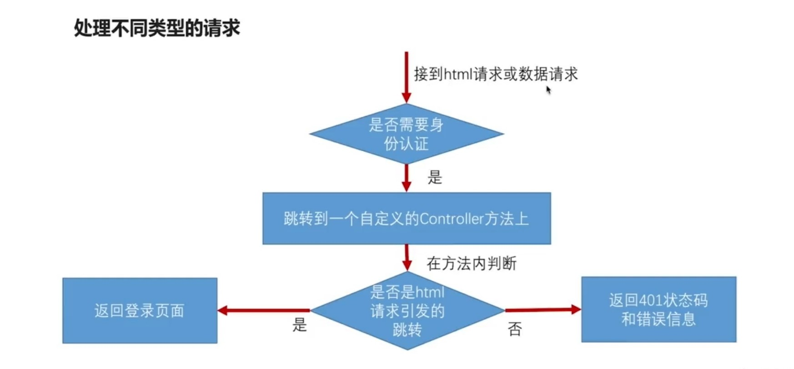
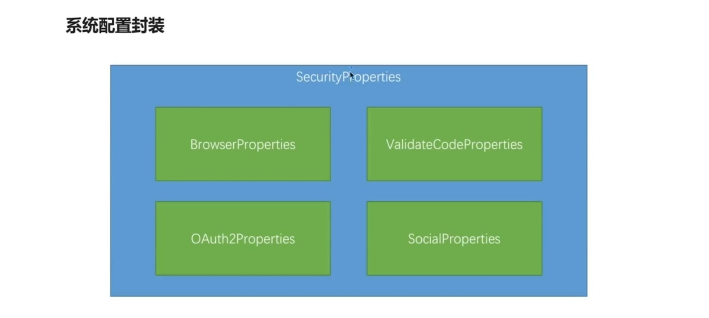
security-core:

```java
@Data
public class BrowserProperties {
	private String loginPage = "login.html";
}
```
```java
@Data
@ConfigurationProperties(prefix = "demo.security")
public class SecurityProperties {
	private BrowserProperties browser = new BrowserProperties();
}
```
```java
@Configuration
@EnableConfigurationProperties(SecurityProperties.class)
public class SecurityCoreConfig {
}
```
security-browser
```java
@RestController
public class BrowserSecurityController {
	private Logger logger = LoggerFactory.getLogger(getClass());
	private RequestCache requestCache = new HttpSessionRequestCache();
	private RedirectStrategy redirectStrategy = new DefaultRedirectStrategy();

	@Autowired
	private SecurityProperties securityProperties;

	/**
	 * 当需要身份认证时，跳转到这里
	 */
	@RequestMapping("/authentication/require")
	@ResponseStatus(code = HttpStatus.UNAUTHORIZED)
	public SimpleResponse requireAuthentication(HttpServletRequest request, HttpServletResponse response)
			throws IOException {

		SavedRequest savedRequest = requestCache.getRequest(request, response);

		if (savedRequest != null) {
			String targetUrl = savedRequest.getRedirectUrl();
			logger.info("引发跳转的请求是:" + targetUrl);
			if (StringUtils.endsWithIgnoreCase(targetUrl, ".html")) {
				redirectStrategy.sendRedirect(request, response, securityProperties.getBrowser().getLoginPage());
			}
		}
		return new SimpleResponse("访问的服务需要身份认证，请引导用户到登录页");
	}
}
```
```java
@Data
@AllArgsConstructor
public class SimpleResponse {
	private Object content;
}
```
```java
@Configuration
public class BrowserSecurityConfig extends AbstractChannelSecurityConfig {
	...
	@Autowired
	private SecurityProperties securityProperties;

	@Override
	protected void configure(HttpSecurity http) throws Exception {
    http.formLogin()
        .loginPage("/authentication/require")
        .loginProcessingUrl("/authentication/form")
        .and()
        .authorizeRequests()
        .antMatchers("/authentication/require", securityProperties.getBrowser().getLoginPage()).permitAll()
        .anyRequest()
        .authenticated()
        .and()
        .csrf().disable();
  }
}
```
security-demo \src\main\resources\resources\demo-login.html
```html
<!DOCTYPE html>
<html>
<head>
<meta charset="UTF-8">
<title>登录</title>
</head>
<body>
	<h2>Demo登录页</h2>
</body>
</html>
```
security-demo application.properties
```properties
demo.security.browser.loginPage = /demo-login.html
```
##### 自定义登录成功处理
security-browser:
```java
@Component("myAuthenticationSuccessHandler")
public class MyAuthenticationSuccessHandler extends SavedRequestAwareAuthenticationSuccessHandler {
	private Logger logger = LoggerFactory.getLogger(getClass());

	@Autowired
	private ObjectMapper objectMapper;

	@Autowired
	private SecurityProperties securityProperties;

	@Override
	public void onAuthenticationSuccess(HttpServletRequest request, HttpServletResponse response,
			Authentication authentication) throws IOException, ServletException {
		logger.info("登录成功");

		if (LoginResponseType.JSON.equals(securityProperties.getBrowser().getLoginType())) {
			response.setContentType("application/json;charset=UTF-8");
			response.getWriter().write(objectMapper.writeValueAsString(authentication));
		} else {
			super.onAuthenticationSuccess(request, response, authentication);
		}
	}
}
```
##### 自定义登录失败处理
security-browser:
```java
@Component("myAuthenctiationFailureHandler")
public class MyAuthenctiationFailureHandler extends SimpleUrlAuthenticationFailureHandler {
	private Logger logger = LoggerFactory.getLogger(getClass());

	@Autowired
	private ObjectMapper objectMapper;

	@Autowired
	private SecurityProperties securityProperties;

	@Override
	public void onAuthenticationFailure(HttpServletRequest request, HttpServletResponse response,
			AuthenticationException exception) throws IOException, ServletException {

		logger.info("登录失败");

		if (LoginResponseType.JSON.equals(securityProperties.getBrowser().getLoginType())) {
			response.setStatus(HttpStatus.INTERNAL_SERVER_ERROR.value());
			response.setContentType("application/json;charset=UTF-8");
			response.getWriter().write(objectMapper.writeValueAsString(new SimpleResponse(exception.getMessage())));
		}else{
			super.onAuthenticationFailure(request, response, exception);
		}
	}
}
```
```java
@Data
public class BrowserProperties {
  ...
  private LoginResponseType loginType = LoginResponseType.JSON;
}
```
```java
public enum LoginResponseType {
	/**
	 * 跳转
	 */
	REDIRECT,

	/**
	 * 返回json
	 */
	JSON
}
```
```java
@Configuration
public class BrowserSecurityConfig extends AbstractChannelSecurityConfig {
	...
	@Autowired
	private SecurityProperties securityProperties;

	@Autowired
	private AuthenticationSuccessHandler myAuthenticationSuccessHandler;

	@Autowired
	private AuthenctiationFailureHandler myAuthenctiationFailureHandler;

	@Override
	protected void configure(HttpSecurity http) throws Exception {
    http.formLogin()
        .loginPage("/authentication/require")
        .loginProcessingUrl("/authentication/form")
        .successHandler(myAuthenticationSuccessHandler)
        .failureHandler(myAuthenctiationFailureHandler)
        .and()
        .authorizeRequests()
        .antMatchers("/authentication/require", securityProperties.getBrowser().getLoginPage()).permitAll()
        .anyRequest()
        .authenticated()
        .and()
        .csrf().disable();
  }
}
```
security-demo application.properties
```properties
demo.security.browser.loginType = REDIRECT
```

### 实现图形验证码功能
##### 开发生成图形验证码接口
security-core
```java
@Data
public class ImageCode {
	private BufferedImage image;
	private String code;
	private LocalDateTime expireTime;

	public ImageCode(String code, int expireIn){
		this.code = code;
		this.expireTime = LocalDateTime.now().plusSeconds(expireIn);
	}

	public ImageCode(String code, LocalDateTime expireTime){
		this.code = code;
		this.expireTime = expireTime;
	}

	public boolean isExpried() {
		return LocalDateTime.now().isAfter(expireTime);
	}

}
```
```java
@RestController
public class ValidateCodeController {
	public static final String SESSION_KEY = "SESSION_KEY_IMAGE_CODE";
	private SessionStrategy sessionStrategy = new HttpSessionSessionStrategy();
	@Autowired
	private ValidateCodeGenerator imageCodeGenerator;

	@GetMapping("/code/image")
	public void createCode(HttpServletRequest request, HttpServletResponse response)
			throws Exception {
    ImageCode imageCode = imageCodeGenerator.generate(new ServletWebRequest(request));
    sessionStrategy.setAttribute(new ServletWebRequest(request), SESSION_KEY, imageCode);
		ImageIO.write(imageCode.getImage(), "JPEG", request.getResponse().getOutputStream());
	}
}
```

### 验证码的生成逻辑可配置
```java
@Configuration
public class ValidateCodeBeanConfig {
	@Autowired
	private SecurityProperties securityProperties;

	@Bean
	@ConditionalOnMissingBean(name = "imageValidateCodeGenerator")
	public ValidateCodeGenerator imageValidateCodeGenerator() {
		ImageCodeGenerator codeGenerator = new ImageCodeGenerator();
		codeGenerator.setSecurityProperties(securityProperties);
		return codeGenerator;
	}
}
```
```java
public interface ValidateCodeGenerator {
	ValidateCode generate(ServletWebRequest request);
}
```
```java
public class ImageCodeGenerator implements ValidateCodeGenerator {
	/**
	 * 系统配置
	 */
	@Autowired
	private SecurityProperties securityProperties;

	@Override
	public ImageCode generate(ServletWebRequest request) {
		int width = ServletRequestUtils.getIntParameter(request.getRequest(), "width",
				securityProperties.getCode().getImage().getWidth());
		int height = ServletRequestUtils.getIntParameter(request.getRequest(), "height",
				securityProperties.getCode().getImage().getHeight());
		BufferedImage image = new BufferedImage(width, height, BufferedImage.TYPE_INT_RGB);

		Graphics g = image.getGraphics();

		Random random = new Random();

		g.setColor(getRandColor(200, 250));
		g.fillRect(0, 0, width, height);
		g.setFont(new Font("Times New Roman", Font.ITALIC, 20));
		g.setColor(getRandColor(160, 200));
		for (int i = 0; i < 155; i++) {
			int x = random.nextInt(width);
			int y = random.nextInt(height);
			int xl = random.nextInt(12);
			int yl = random.nextInt(12);
			g.drawLine(x, y, x + xl, y + yl);
		}

		String sRand = "";
		for (int i = 0; i < securityProperties.getCode().getImage().getLength(); i++) {
			String rand = String.valueOf(random.nextInt(10));
			sRand += rand;
			g.setColor(new Color(20 + random.nextInt(110), 20 + random.nextInt(110), 20 + random.nextInt(110)));
			g.drawString(rand, 13 * i + 6, 16);
		}

		g.dispose();

		return new ImageCode(image, sRand, securityProperties.getCode().getImage().getExpireIn());
	}

	/**
	 * 生成随机背景条纹
	 *
	 * @param fc
	 * @param bc
	 * @return
	 */
	private Color getRandColor(int fc, int bc) {
		Random random = new Random();
		if (fc > 255) {
			fc = 255;
		}
		if (bc > 255) {
			bc = 255;
		}
		int r = fc + random.nextInt(bc - fc);
		int g = fc + random.nextInt(bc - fc);
		int b = fc + random.nextInt(bc - fc);
		return new Color(r, g, b);
	}

	public SecurityProperties getSecurityProperties() {
		return securityProperties;
	}

	public void setSecurityProperties(SecurityProperties securityProperties) {
		this.securityProperties = securityProperties;
	}
}
```

### 验证码基本参数可配置
```java
@ConfigurationProperties(prefix = "demo.security")
public class SecurityProperties {
  ...
  private ValidateCodeProperties code = new ValidateCodeProperties();
}
```
```java
@Data
public class ValidateCodeProperties {
	private ImageCodeProperties image = new ImageCodeProperties();
}
```
```java
@Data
public class ImageCodeProperties {
	private int length = 4;
	private int width = 67;
	private int height = 23;
	private int expireIn = 60;

	private String url;
}
```
```java
@Configuration
public class BrowserSecurityConfig extends AbstractChannelSecurityConfig {
	...

	@Override
	protected void configure(HttpSecurity http) throws Exception {
    http.formLogin()
        .loginPage("/authentication/require")
        .loginProcessingUrl("/authentication/form")
        .successHandler(myAuthenticationSuccessHandler)
        .failureHandler(myAuthenctiationFailureHandler)
        .and()
        .authorizeRequests()
        .antMatchers("/authentication/require", securityProperties.getBrowser().getLoginPage(), "/code/image").permitAll()
        .anyRequest()
        .authenticated()
        .and()
        .csrf().disable();
  }
}
```
```html
...
			<tr>
				<td>图形验证码:</td>
				<td>
					<input type="text" name="imageCode">
					
				</td>
			</tr>
...
```

### 在认证流程中加入图形验证码校验 & 验证码拦截的接口可配置
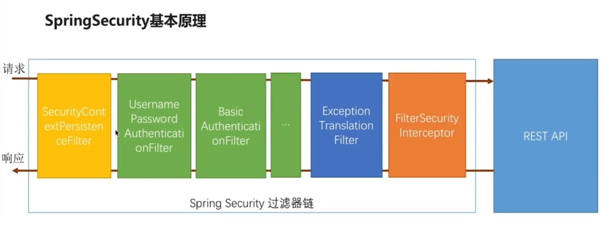
```java
public class ValidateCodeFilter extends OncePerRequestFilter implements InitializingBean {
  private AuthenticationFailureHandler authenticationFailureHandler;
  private SessionStrategy sessionStrategy = new HttpSessionSessionStrategy();
  private Set<String> urls = new HashSet<>();
  private SecurityProperties securityProperties;
  private AntPathMatcher pathMatcher = new AntPathMatcher();

	@Override
	public void afterPropertiesSet() throws ServletException {
		super.afterPropertiesSet();
		String[] urls = StringUtils.splitByWholeSeparatorPreserveAllTokens(securityProperties.getCode().getImage().getUrl(), ",");
		for (String url : urls) {
			urls.put(url);
		}
    urls.add("/authentication/form");
	}

	@Override
	protected void doFilterInternal(HttpServletRequest request, HttpServletResponse response, FilterChain chain)
			throws ServletException, IOException {
    boolean action = false;
    for (String url : urls) {
      if (pathMatcher.match(url, request.getRequestURI())) {
        action = true;
      }
    }
		if (action) {
			try {
				validate(new ServletWebRequest(request, response));
			} catch (ValidateCodeException exception) {
				authenticationFailureHandler.onAuthenticationFailure(request, response, exception);
				return;
			}
		}
		chain.doFilter(request, response);
	}

  public void validate(ServletWebRequest request) {
		String sessionKey = ValidateCodeController.SESSION_KEY;
		ImageCode codeInSession = (ImageCode)sessionStrategy.getAttribute(request, sessionKey);

		String codeInRequest;
		try {
			codeInRequest = ServletRequestUtils.getStringParameter(request.getRequest(), "imageCode");
		} catch (ServletRequestBindingException e) {
			throw new ValidateCodeException("获取验证码的值失败");
		}

		if (StringUtils.isBlank(codeInRequest)) {
			throw new ValidateCodeException(processorType + "验证码的值不能为空");
		}

		if (codeInSession == null) {
			throw new ValidateCodeException(processorType + "验证码不存在");
		}

		if (codeInSession.isExpried()) {
			sessionStrategy.removeAttribute(request, sessionKey);
			throw new ValidateCodeException(processorType + "验证码已过期");
		}

		if (!StringUtils.equals(codeInSession.getCode(), codeInRequest)) {
			throw new ValidateCodeException(processorType + "验证码不匹配");
		}
		sessionStrategy.removeAttribute(request, sessionKey);
	}
}
```
```java
public class ValidateCodeException extends AuthenticationException {
	private static final long serialVersionUID = -7285211528095468156L;

	public ValidateCodeException(String msg) {
		super(msg);
	}
}
```
```java
@Configuration
public class BrowserSecurityConfig extends AbstractChannelSecurityConfig {
	...

	@Override
	protected void configure(HttpSecurity http) throws Exception {
    ValidateCodeFilter validateCodeFilter = new ValidateCodeFilter();
    validateCodeFilter.setAuthenticationFailureHandler(myAuthenticationFailureHandler);
    validateCodeFilter.setSecurityProperties(securityProperties);
    validateCodeFilter.afterPropertiesSet();

    http.addFilterBefore(validateCodeFilter, UsernamePasswordAuthenticationFilter.class)
        .formLogin()
        .loginPage("/authentication/require")
        .loginProcessingUrl("/authentication/form")
        .successHandler(myAuthenticationSuccessHandler)
        .failureHandler(myAuthenctiationFailureHandler)
        .and()
        .authorizeRequests()
        .antMatchers("/authentication/require", securityProperties.getBrowser().getLoginPage(), "/code/image").permitAll()
        .anyRequest()
        .authenticated()
        .and()
        .csrf().disable();
  }
}
```
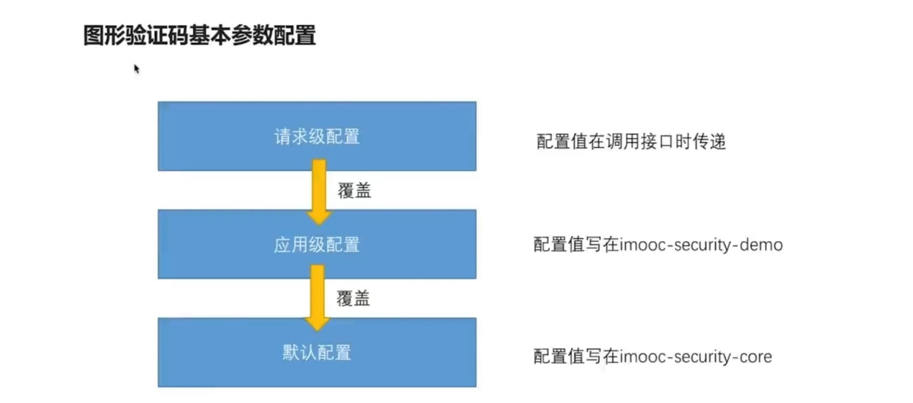
security-demo application.properties
```properties
demo.security.code.image.length = 6
demo.security.code.image.width = 100
demo.security.code.image.url = /user,/user/*
```
```java
@Component("imageCodeGenerator")
public class DemoImageCodeGenerator implements ValidateCodeGenerator {
	@Override
	public ImageCode generate(ServletWebRequest request) {
		System.out.println("更高级的图形验证码生成代码");
		return null;
	}
}
```

### 实现 “记住我” 功能
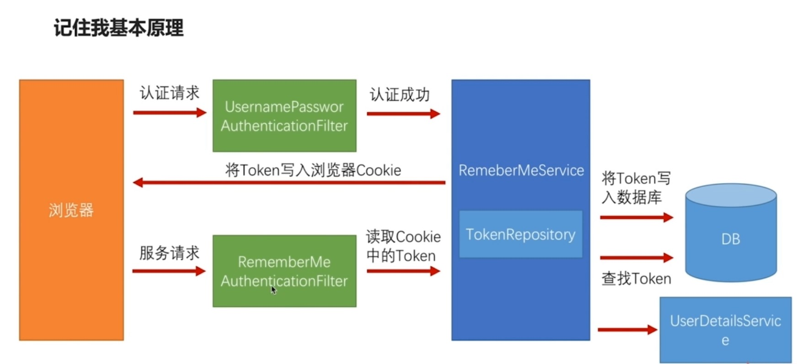
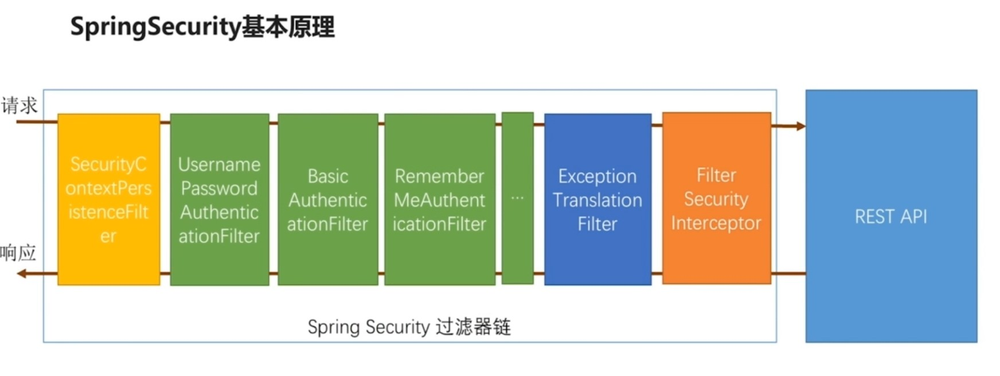
security-browser:
```html
<tr>
	<td colspan='2'><input name="remember-me" type="checkbox" value="true" />记住我</td>
</tr>
```
```java
public class BrowserProperties {
	...
	private int rememberMeSeconds = 3600;
}
```
```java
@Configuration
public class BrowserSecurityConfig extends AbstractChannelSecurityConfig {
	...
	@Autowired
	private DataSource dataSource;
	@Autowired
	private UserDetailsService userDetailsService;

	@Override
	protected void configure(HttpSecurity http) throws Exception {
    ValidateCodeFilter validateCodeFilter = new ValidateCodeFilter();
    validateCodeFilter.setAuthenticationFailureHandler(myAuthenticationFailureHandler);
    validateCodeFilter.setSecurityProperties(securityProperties);
    validateCodeFilter.afterPropertiesSet();

    http.addFilterBefore(validateCodeFilter, UsernamePasswordAuthenticationFilter.class)
        .formLogin()
        .loginPage("/authentication/require")
        .loginProcessingUrl("/authentication/form")
        .successHandler(myAuthenticationSuccessHandler)
        .failureHandler(myAuthenctiationFailureHandler)
        .and()
			  .rememberMe()
				.tokenRepository(persistentTokenRepository())
				.tokenValiditySeconds(securityProperties.getBrowser().getRememberMeSeconds())
				.userDetailsService(userDetailsService)
        .and()
        .authorizeRequests()
        .antMatchers("/authentication/require", securityProperties.getBrowser().getLoginPage(), "/code/image").permitAll()
        .anyRequest()
        .authenticated()
        .and()
        .csrf().disable();
  }

  ...
	@Bean
	public PersistentTokenRepository persistentTokenRepository() {
		JdbcTokenRepositoryImpl tokenRepository = new JdbcTokenRepositoryImpl();
		tokenRepository.setDataSource(dataSource);
//		tokenRepository.setCreateTableOnStartup(true);
		return tokenRepository;
	}
}
```

## 3.开发 “手机号 + 短信” 认证
### 实现短信验证码登录
##### 开发短信验证码接口
```java
public class ValidateCode {
	private String code;
	private LocalDateTime expireTime;

	public ValidateCode(String code, int expireIn){
		this.code = code;
		this.expireTime = LocalDateTime.now().plusSeconds(expireIn);
	}

	public ValidateCode(String code, LocalDateTime expireTime){
		this.code = code;
		this.expireTime = expireTime;
	}

	public boolean isExpried() {
		return LocalDateTime.now().isAfter(expireTime);
	}
}
```
修改ValidateCodeGenerator返回值
```java
public interface ValidateCodeGenerator {
	ValidateCode generate(ServletWebRequest request);
}
```
```java
@Data
public class SmsCodeProperties {
	private int length = 6;
	private int expireIn = 60;
	private String url;
}
```
```java
@Data
public class ValidateCodeProperties {
	...
	private SmsCodeProperties sms = new SmsCodeProperties();
}
```
```java
@Data
@Component("smsValidateCodeGenerator")
public class SmsCodeGenerator implements ValidateCodeGenerator {
	...

	@Override
	public ValidateCode generate(ServletWebRequest request) {
		String code = RandomStringUtils.randomNumeric(securityProperties.getCode().getSms().getLength());
		return new ValidateCode(code, securityProperties.getCode().getSms().getExpireIn());
	}
}
```
```java
public interface SmsCodeSender {
	void send(String mobile, String code);
}
```
```java
@Configuration
public class ValidateCodeBeanConfig {
	...
	@Bean
	@ConditionalOnMissingBean(SmsCodeSender.class)
	public SmsCodeSender smsCodeSender() {
		return new DefaultSmsCodeSender();
	}
}
```
```java
public class DefaultSmsCodeSender implements SmsCodeSender {
	@Override
	public void send(String mobile, String code) {
		System.out.println("向手机"+mobile+"发送短信验证码"+code);
	}
}
```
```java
@RestController
public class ValidateCodeController {
  ...
  @Autowired
  private SmsCodeSender smsCodeSender;

  @Autowired
  private SmsCodeGenerator smsCodeGenerator;

  @GetMapping("/code/sms")
  public void createSmsCode(HttpServletRequest request, HttpServletResponse response)
      throws Exception {
      ValidateCode smsCode = smsCodeGenerator.generate(new ServletWebRequest(request));
      sessionStrategy.setAttribute(new ServletWebRequest(request), SESSION_KEY, smsCode);
  		String mobile = ServletRequestUtils.getRequiredStringParameter(request.getRequest(), "mobile");
  		smsCodeSender.send(mobile, validateCode.getCode());
  }
}
```
```html
...
<h3>短信登录</h3>
<form action="/authentication/mobile" method="post">
  <table>
    <tr>
      <td>手机号:</td>
      <td><input type="text" name="mobile" value="13012345678"></td>
    </tr>
    <tr>
      <td>短信验证码:</td>
      <td>
        <input type="text" name="smsCode">
        <a href="/code/sms?mobile=13012345678">发送验证码</a>
      </td>
    </tr>
    <tr>
      <td colspan="2"><button type="submit">登录</button></td>
    </tr>
  </table>
</form>
...
```

##### 校验短信验证码并登录
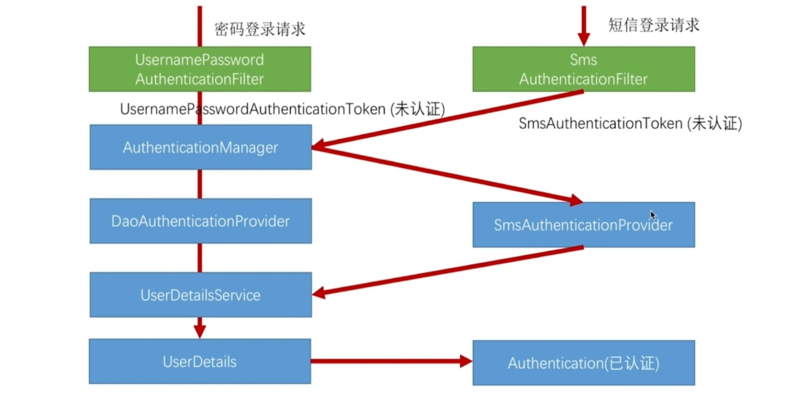
```java
public class SmsCodeAuthenticationToken extends AbstractAuthenticationToken {
	private static final long serialVersionUID = SpringSecurityCoreVersion.SERIAL_VERSION_UID;

	private final Object principal;

	public SmsCodeAuthenticationToken(String mobile) {
		super(null);
		this.principal = mobile;
		setAuthenticated(false);
	}

	public SmsCodeAuthenticationToken(Object principal,
			Collection<? extends GrantedAuthority> authorities) {
		super(authorities);
		this.principal = principal;
		super.setAuthenticated(true); // must use super, as we override
	}

	public Object getCredentials() {
		return null;
	}

	public Object getPrincipal() {
		return this.principal;
	}

	public void setAuthenticated(boolean isAuthenticated) throws IllegalArgumentException {
		if (isAuthenticated) {
			throw new IllegalArgumentException(
					"Cannot set this token to trusted - use constructor which takes a GrantedAuthority list instead");
		}

		super.setAuthenticated(false);
	}

	@Override
	public void eraseCredentials() {
		super.eraseCredentials();
	}
}
```
```java
public class SmsCodeAuthenticationFilter extends AbstractAuthenticationProcessingFilter {
	private String mobileParameter = SecurityConstants.DEFAULT_PARAMETER_NAME_MOBILE;
	private boolean postOnly = true;

	public SmsCodeAuthenticationFilter() {
		super(new AntPathRequestMatcher(SecurityConstants.DEFAULT_LOGIN_PROCESSING_URL_MOBILE, "POST"));
	}

	public Authentication attemptAuthentication(HttpServletRequest request, HttpServletResponse response)
			throws AuthenticationException {
		if (postOnly && !request.getMethod().equals("POST")) {
			throw new AuthenticationServiceException("Authentication method not supported: " + request.getMethod());
		}

		String mobile = obtainMobile(request);

		if (mobile == null) {
			mobile = "";
		}

		mobile = mobile.trim();

		SmsCodeAuthenticationToken authRequest = new SmsCodeAuthenticationToken(mobile);

		// Allow subclasses to set the "details" property
		setDetails(request, authRequest);

		return this.getAuthenticationManager().authenticate(authRequest);
	}


	/**
	 * 获取手机号
	 */
	protected String obtainMobile(HttpServletRequest request) {
		return request.getParameter(mobileParameter);
	}

	protected void setDetails(HttpServletRequest request, SmsCodeAuthenticationToken authRequest) {
		authRequest.setDetails(authenticationDetailsSource.buildDetails(request));
	}

	public void setMobileParameter(String usernameParameter) {
		Assert.hasText(usernameParameter, "Username parameter must not be empty or null");
		this.mobileParameter = usernameParameter;
	}

	public void setPostOnly(boolean postOnly) {
		this.postOnly = postOnly;
	}

	public final String getMobileParameter() {
		return mobileParameter;
	}
}
```
```java
public class SmsCodeAuthenticationProvider implements AuthenticationProvider {
	private UserDetailsService userDetailsService;

	@Override
	public Authentication authenticate(Authentication authentication) throws AuthenticationException {

		SmsCodeAuthenticationToken authenticationToken = (SmsCodeAuthenticationToken) authentication;

		UserDetails user = userDetailsService.loadUserByUsername((String) authenticationToken.getPrincipal());

		if (user == null) {
			throw new InternalAuthenticationServiceException("无法获取用户信息");
		}

		SmsCodeAuthenticationToken authenticationResult = new SmsCodeAuthenticationToken(user, user.getAuthorities());

		authenticationResult.setDetails(authenticationToken.getDetails());

		return authenticationResult;
	}

	@Override
	public boolean supports(Class<?> authentication) {
		return SmsCodeAuthenticationToken.class.isAssignableFrom(authentication);
	}

	public UserDetailsService getUserDetailsService() {
		return userDetailsService;
	}

	public void setUserDetailsService(UserDetailsService userDetailsService) {
		this.userDetailsService = userDetailsService;
	}
}
```
```java
public class SmsCodeFilter extends OncePerRequestFilter implements InitializingBean {
  private AuthenticationFailureHandler authenticationFailureHandler;
  private SessionStrategy sessionStrategy = new HttpSessionSessionStrategy();
  private Set<String> urls = new HashSet<>();
  private SecurityProperties securityProperties;
  private AntPathMatcher pathMatcher = new AntPathMatcher();

	@Override
	public void afterPropertiesSet() throws ServletException {
		super.afterPropertiesSet();
		String[] urls = StringUtils.splitByWholeSeparatorPreserveAllTokens(securityProperties.getCode().getImage().getUrl(), ",");
		for (String url : urls) {
			urls.put(url);
		}
    urls.add("/authentication/mobile");
	}

	@Override
	protected void doFilterInternal(HttpServletRequest request, HttpServletResponse response, FilterChain chain)
			throws ServletException, IOException {
    boolean action = false;
    for (String url : urls) {
      if (pathMatcher.match(url, request.getRequestURI())) {
        action = true;
      }
    }
		if (action) {
			try {
				validate(new ServletWebRequest(request, response));
			} catch (ValidateCodeException exception) {
				authenticationFailureHandler.onAuthenticationFailure(request, response, exception);
				return;
			}
		}
		chain.doFilter(request, response);
	}

  public void validate(ServletWebRequest request) {
		String sessionKey = ValidateCodeController.SESSION_KEY;
		ValidateCode codeInSession = (ValidateCode)sessionStrategy.getAttribute(request, sessionKey);

		String codeInRequest;
		try {
			codeInRequest = ServletRequestUtils.getStringParameter(request.getRequest(), "smsCode");
		} catch (ServletRequestBindingException e) {
			throw new ValidateCodeException("获取验证码的值失败");
		}

		if (StringUtils.isBlank(codeInRequest)) {
			throw new ValidateCodeException(processorType + "验证码的值不能为空");
		}

		if (codeInSession == null) {
			throw new ValidateCodeException(processorType + "验证码不存在");
		}

		if (codeInSession.isExpried()) {
			sessionStrategy.removeAttribute(request, sessionKey);
			throw new ValidateCodeException(processorType + "验证码已过期");
		}

		if (!StringUtils.equals(codeInSession.getCode(), codeInRequest)) {
			throw new ValidateCodeException(processorType + "验证码不匹配");
		}
		sessionStrategy.removeAttribute(request, sessionKey);
	}
}
```
```java
@Component
public class SmsCodeAuthenticationSecurityConfig extends SecurityConfigurerAdapter<DefaultSecurityFilterChain, HttpSecurity> {
	@Autowired
	private AuthenticationSuccessHandler myAuthenticationSuccessHandler;

	@Autowired
	private AuthenticationFailureHandler myAuthenticationFailureHandler;

	@Autowired
	private UserDetailsService userDetailsService;

	@Override
	public void configure(HttpSecurity http) throws Exception {
		SmsCodeAuthenticationFilter smsCodeAuthenticationFilter = new SmsCodeAuthenticationFilter();
		smsCodeAuthenticationFilter.setAuthenticationManager(http.getSharedObject(AuthenticationManager.class));
		smsCodeAuthenticationFilter.setAuthenticationSuccessHandler(myAuthenticationSuccessHandler);
		smsCodeAuthenticationFilter.setAuthenticationFailureHandler(myAuthenticationFailureHandler);

		SmsCodeAuthenticationProvider smsCodeAuthenticationProvider = new SmsCodeAuthenticationProvider();
		smsCodeAuthenticationProvider.setUserDetailsService(userDetailsService);

		http.authenticationProvider(smsCodeAuthenticationProvider)
			.addFilterAfter(smsCodeAuthenticationFilter, UsernamePasswordAuthenticationFilter.class);
	}
}
```
```java
@Configuration
public class BrowserSecurityConfig extends AbstractChannelSecurityConfig {
	...

	@Override
	protected void configure(HttpSecurity http) throws Exception {
    ValidateCodeFilter validateCodeFilter = new ValidateCodeFilter();
    validateCodeFilter.setAuthenticationFailureHandler(myAuthenticationFailureHandler);
    validateCodeFilter.setSecurityProperties(securityProperties);
    validateCodeFilter.afterPropertiesSet();

    SmsCodeFilter smsCodeFilter = new SmsCodeFilter();
    smsCodeFilter.setAuthenticationFailureHandler(myAuthenticationFailureHandler);
    smsCodeFilter.setSecurityProperties(securityProperties);
    smsCodeFilter.afterPropertiesSet();

    http.addFilterBefore(smsCodeFilter, UsernamePasswordAuthenticationFilter.class)
        .addFilterBefore(validateCodeFilter, UsernamePasswordAuthenticationFilter.class)
        .formLogin()
        .loginPage("/authentication/require")
        .loginProcessingUrl("/authentication/form")
        .successHandler(myAuthenticationSuccessHandler)
        .failureHandler(myAuthenctiationFailureHandler)
        .and()
			  .rememberMe()
				.tokenRepository(persistentTokenRepository())
				.tokenValiditySeconds(securityProperties.getBrowser().getRememberMeSeconds())
				.userDetailsService(userDetailsService)
        .and()
        .authorizeRequests()
        .antMatchers("/authentication/require", securityProperties.getBrowser().getLoginPage(), "/code/image").permitAll()
        .anyRequest()
        .authenticated()
        .and()
        .csrf().disable()
        // 相当于把smsCodeAuthenticationSecurityConfig这个类中的配置加到了后面，等于接着往后写
        .apply(smsCodeAuthenticationSecurityConfig);
  }
  ...
}
```

##### 重构代码
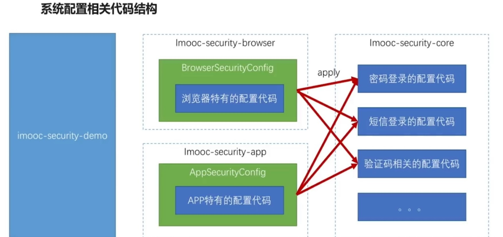
