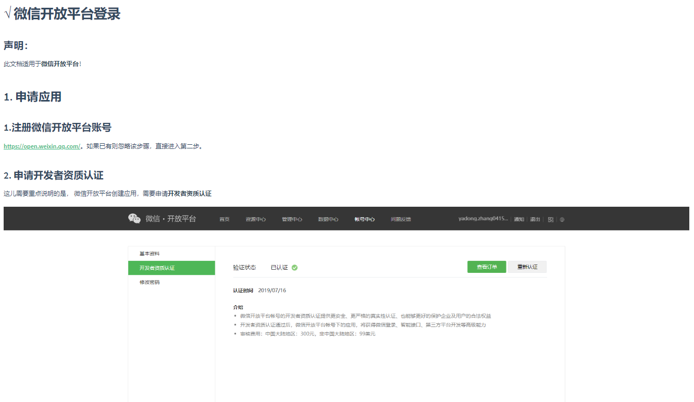
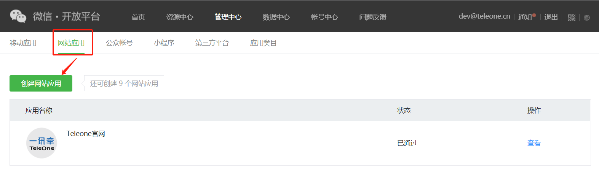
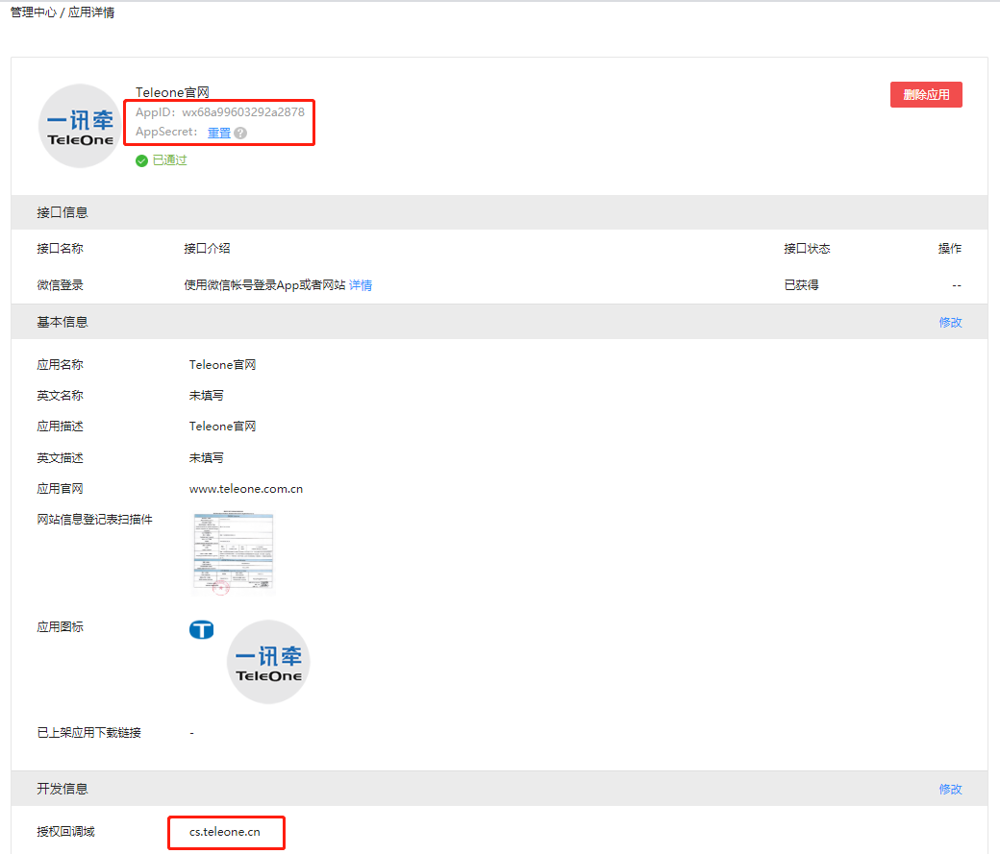
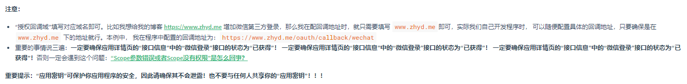
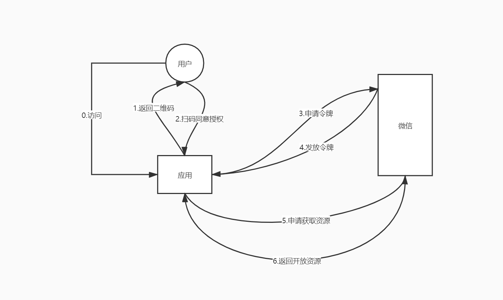
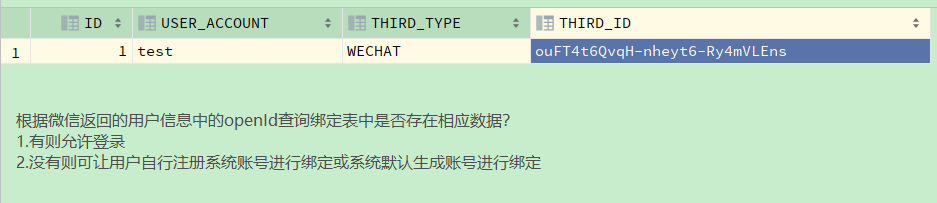
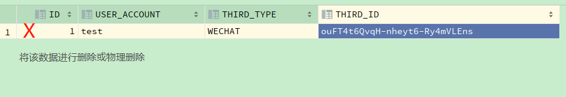
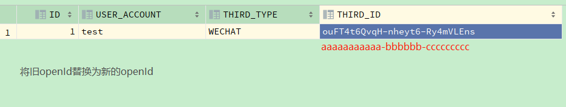

## 一、原生API实现第三方登录（微信）

#### 1、准备工作

1.注册微信开放平台账号

2.申请开发者资质认证

3.创建第三方应用（AppID、AppSecret）

4.设置授权回调域（回调域）

- 参考以下链接：[https://justauth.wiki/#/oauth/wechat_open](https://justauth.wiki/#/oauth/wechat_open)  










注意：  
```properties
# 设置授权回调域cs.teleone.cn
https://open.weixin.qq.com/connect/qrconnect?appid=wx68a99603292a2878&redirect_uri=http%3A%2F%2Fcs.teleone.cn%2Fapi%2Fcrm-cluster-server%2FportalWeChat%2Foauth%2FweChat%2Finfo&response_type=code&scope=snsapi_login&state=78ec74408f984116863d5f778637a2f1%23wechat_redirect  
# 回调地址（在申请二维码页面回调地址(你的redirect_uri) 还必须加上http或者https）
http%3A%2F%2Fcs.teleone.cn%2Fapi%2Fcrm-cluster-server%2FportalWeChat%2Foauth%2FweChat%2Finfo?
# host文件中配置回调域cs.teleone.cn与应用ip的映射
```

#### 2、登录流程





#### 3、绑定解绑流程

解绑：



换绑：



#### 4、代码

```java
@RestController
@RequestMapping("/oauth/weChat")
@Slf4j
public class LoginController {

  /**
   * 微信获取授权码的url
   */
  private static final String URL_AUTHORIZE = "https://open.weixin.qq.com/connect/qrconnect";
  /**
   * 微信获取accessToken的url
   */
  private static final String URL_ACCESS_TOKEN = "https://api.weixin.qq.com/sns/oauth2/access_token";
  /**
   * 获取用户信息的url
   */
  private static final String URL_GET_USER_INFO = "https://api.weixin.qq.com/sns/userinfo";
  private static final String CODE = "code";
  private static final String SCOPE = "snsapi_login";
  private static final String APP_ID = "appid";
  private static final String SECRET = "secret";
  private static final String GRANT_TYPE = "grant_type";
  private static final String AUTHORIZATION_CODE = "authorization_code";
  private static final String ACCESS_TOKEN = "access_token";
  private static final String OPEN_ID = "openId";

  @Value("${appId}")
  private String appId;
  @Value("${redirectUri}")
  private String redirectUri;
  @Value("${appSecret}")
  private String appSecret;

  @Autowired
  private RestTemplate restTemplate;

  @GetMapping("/oauth/url")
  public String getUrl() {
    StringBuilder codeRequestUrl = new StringBuilder(URL_AUTHORIZE);
    Map<String, String> params = ImmutableMap.of(
        "appId", appId,
        "redirect_uri", redirectUri,
        "response_type", CODE,
        "scope", SCOPE,
        "state", UUID.randomUUID() + "#wechat_redirect"
    );
    return codeRequestUrl.append("?").append(asUrlParams(params)).toString();
  }

  @GetMapping("/oauth/weChat/info")
  public void getWeChatInfo(HttpServletRequest request) {
    String code = request.getParameter(CODE);
    if (StringUtils.hasText(code)) {
      // 获取access_token
      WeixinAccessGrant accessGrant = getAccessToken(code);
      if (StringUtils.hasText(accessGrant.getAccessToken()) && StringUtils.hasText(accessGrant.getOpenId())) {
        WeixinUserInfo weixinUserInfo = getUserInfo(accessGrant.getAccessToken(), accessGrant.getOpenId());
        if (weixinUserInfo != null) {
          // TODO 查询是否存在系统账号，如果有则允许登录，跳转成功登录页面，
          // TODO 如果没有则跳转绑定页面，继续后续绑定操作
        }
      }
    }
    // TODO 跳转失败地址或实现自定义逻辑
  }

  private WeixinAccessGrant getAccessToken(String code) {
    // 微信返回的contentType是html/text，添加相应的HttpMessageConverter来处理。
    restTemplate.getMessageConverters().add(new StringHttpMessageConverter(StandardCharsets.UTF_8));
    // 构造请求参数
    Map<String, String> map = ImmutableMap.of(APP_ID, appId, SECRET, appSecret, CODE, code, GRANT_TYPE, AUTHORIZATION_CODE);
    String params = asUrlParams(map);
    // 请求weChat获取token
    String response = restTemplate.getForObject(new StringBuilder(URL_ACCESS_TOKEN).append("?").append(params).toString(), String.class);
    // 获取返回体
    log.info("获取access_token, 响应内容: " + response);
    Map<String, String> result = new Gson().fromJson(response, Map.class);
    // 校验是否成功
    boolean success = checkResponseSuccess(result);
    return success ? new WeixinAccessGrant(result.get("openid"), result.get(ACCESS_TOKEN), result.get("refresh_token")) : new WeixinAccessGrant();
  }

  /**
   * 获取微信用户信息
   */
  private WeixinUserInfo getUserInfo(String accessToken, String openId) {
    // 构造请求参数
    Map<String, String> map = ImmutableMap.of(ACCESS_TOKEN, accessToken, OPEN_ID, openId);
    // 请求weChat获取用户信息
    String response = restTemplate.getForObject(new StringBuilder(URL_GET_USER_INFO).append("?").append(asUrlParams(map)).toString(), String.class);
    // 获取返回体
    Map<String, String> result = new Gson().fromJson(response, Map.class);
    // 校验是否成功
    boolean success = checkResponseSuccess(result);
    if (!success) {
      return null;
    }
    // 查询是否已绑定账号
    WeixinUserInfo userInfo = new Gson().fromJson(response, WeixinUserInfo.class);
    // 微信那边采用的是ISO-8859-1编码，需要进行转码
    userInfo.setNickname(new String(userInfo.getNickname().getBytes(StandardCharsets.ISO_8859_1), StandardCharsets.UTF_8));
    return userInfo;
  }

  private boolean checkResponseSuccess(Map<String, String> map) {
    if (map.containsKey("errcode")) {
      log.error("获取access token失败, errcode: {}, errmsg: {}", map.get("errcode"), map.get("errmsg"));
      return false;
    }
    return true;
  }

  private String asUrlParams(Map<String, String> map) {
    Map<String, String> newMap = new HashMap<>();
    map.forEach((k, v) -> {
      if (v != null)
        try {
          newMap.put(k, URLEncoder.encode(v, "utf-8"));
        } catch (UnsupportedEncodingException ignored) {
        }
    });
    return Joiner.on("&").useForNull("").withKeyValueSeparator("=").join(newMap);
  }

}
```

## 二、Springboot 2.X + Spring Security5 集成OAuth2 实现第三方登录(Facebook)

pom.xml

```xml
<dependencyManagement>
  <dependencies>
    <dependency>
      <groupId>org.springframework.cloud</groupId>
      <artifactId>spring-cloud-dependencies</artifactId>
      <version>Finchley.RELEASE</version>
      <type>pom</type>
      <scope>import</scope>
    </dependency>
  </dependencies>
</dependencyManagement>
```

```xml
<dependencies>  
  ...
  <dependency>
    <groupId>org.springframework.boot</groupId>
    <artifactId>spring-boot-starter-security</artifactId>
  </dependency>
  <dependency>
    <groupId>org.springframework.security</groupId>
    <artifactId>spring-security-oauth2-client</artifactId>
  </dependency>
</dependencies>
```

application.properties

```properties
spring.security.oauth2.client.registration.facebook.client-id=885298005186737
spring.security.oauth2.client.registration.facebook.client-secret=251df1baebd6b512457c24abc7063536
spring.security.oauth2.client.registration.facebook.redirect-uri-template=https://172.30.21.229/login/oauth2/code/facebook
spring.security.oauth2.client.provider.facebook.authorization-uri=https://www.facebook.com/v2.8/dialog/oauth
spring.security.oauth2.client.provider.facebook.token-uri=https://graph.facebook.com/v4.0/oauth/access_token
spring.security.oauth2.client.provider.facebook.user-info-uri=https://graph.facebook.com/me?fields=id,first_name,middle_name,last_name,name,email,verified,is_verified,picture.width(250).height(250)

server.use-forward-headers=true
```

VM options

```sh
-DproxySet=true -Dhttp.proxyHost=127.0.0.1 -Dhttp.proxyPort=10809 -Dhttps.proxyHost=127.0.0.1 -Dhttps.proxyPort=10809
```

java

```java
@Configuration
public class SecurityConfig extends WebSecurityConfigurerAdapter {

  @Autowired
  private CustomSuccessHandler customSuccessHandler;

  @Override
  protected void configure(HttpSecurity http) throws Exception {
    http.oauth2Login()
        .userInfoEndpoint().customUserType(FacebookOAuth2User.class, "facebook")
        .and()
        .successHandler(customSuccessHandler);
  }

}
```

```java
@Component
@Slf4j
public class CustomSuccessHandler implements AuthenticationSuccessHandler {

  @Override
  public void onAuthenticationSuccess(HttpServletRequest httpServletRequest, HttpServletResponse httpServletResponse, Authentication authentication) {
    OAuth2AuthenticationToken oAuth2AuthenticationToken = (OAuth2AuthenticationToken) authentication;
    String registrationId = oAuth2AuthenticationToken.getAuthorizedClientRegistrationId();
    log.info("registrationId:{}", registrationId);
    if ("facebook".equals(registrationId)) {
      FacebookOAuth2User facebookOAuth2User = (FacebookOAuth2User) oAuth2AuthenticationToken.getPrincipal();
      log.info("id:{}", facebookOAuth2User.getId());
      log.info("name:{}", facebookOAuth2User.getName());
    }
    // 根据registrationId和id查询是否存在系统账号，如果有则允许登录，跳转成功登录页面，
    // 如果没有则跳转绑定页面，继续后续绑定操作
    // 根据业务实现自定义逻辑
  }
}
```

```java
public class FacebookOAuth2User implements OAuth2User {

  private List<GrantedAuthority> authorities = AuthorityUtils.createAuthorityList("ROLE_USER");
  private Map<String, Object> attributes;
  private String id;
  private String name;

  @Override
  public Collection<? extends GrantedAuthority> getAuthorities() {
    return authorities;
  }

  @Override
  public Map<String, Object> getAttributes() {
    if (this.attributes == null) {
      this.attributes = new HashMap<>();
      this.attributes.put("id", this.getId());
      this.attributes.put("name", this.getName());
    }
    return attributes;
  }

  @Override
  public String getName() {
    return name;
  }

  public void setName(String name) {
    this.name = name;
  }

  public String getId() {
    return id;
  }

  public void setId(String id) {
    this.id = id;
  }

}
```
参考：  
[https://www.iteye.com/blog/justdo2008-2163516](https://www.iteye.com/blog/justdo2008-2163516)  

[https://docs.spring.io/spring-security/site/docs/current/reference/html5/#oauth2](https://docs.spring.io/spring-security/site/docs/current/reference/html5/#oauth2)  
[https://docs.spring.io/spring-security/site/docs/5.0.7.RELEASE/reference/htmlsingle/](https://docs.spring.io/spring-security/site/docs/5.0.7.RELEASE/reference/htmlsingle/)  

## 三、OAuth2协议

- 