## 1.认证处理流程说明
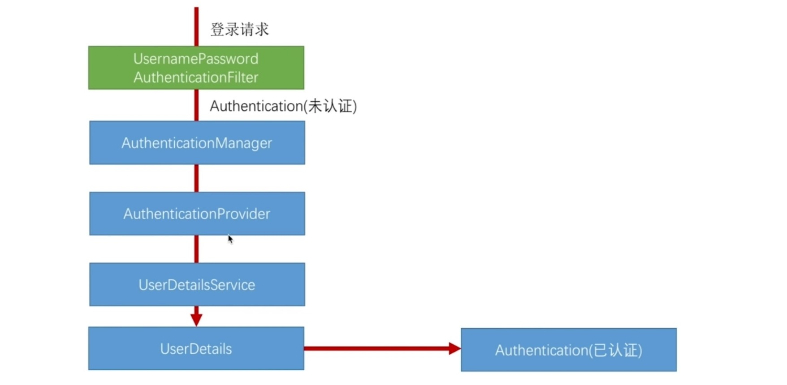
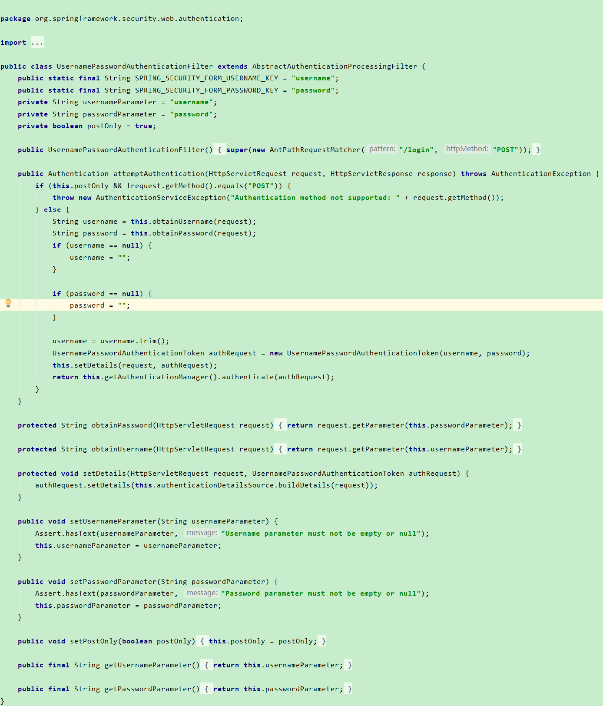
```java
UsernamePasswordAuthenticationToken authRequest = new UsernamePasswordAuthenticationToken(username, password);
```
获取请求中携带的用户名和密码，然后拿用户名和密码构建了一个UsernamePasswordAuthenticationToken这样一个对象。

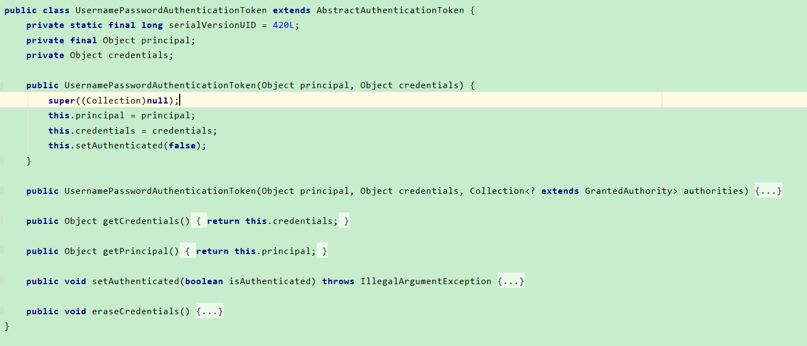
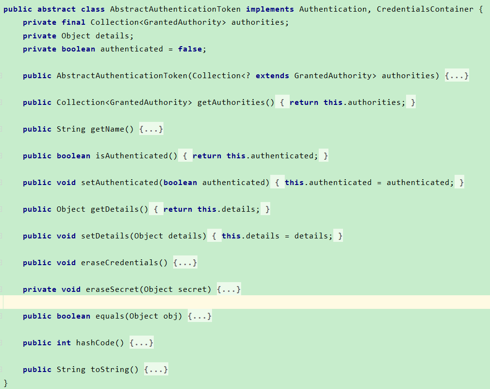
该对象是Authentication接口的实现，该接口实际上封装了我们的认证信息。
通过该类构造函数发现，会先调用父类的构造函数设置空的权限，设置用户名和密码到本地变量上。
设置当前传进去的身份信息还没经过认证。

```java
this.setDetails(request, authRequest);
```
会把请求的一些信息设到authRequest中，包括当前发请求的机器的ip，session等。

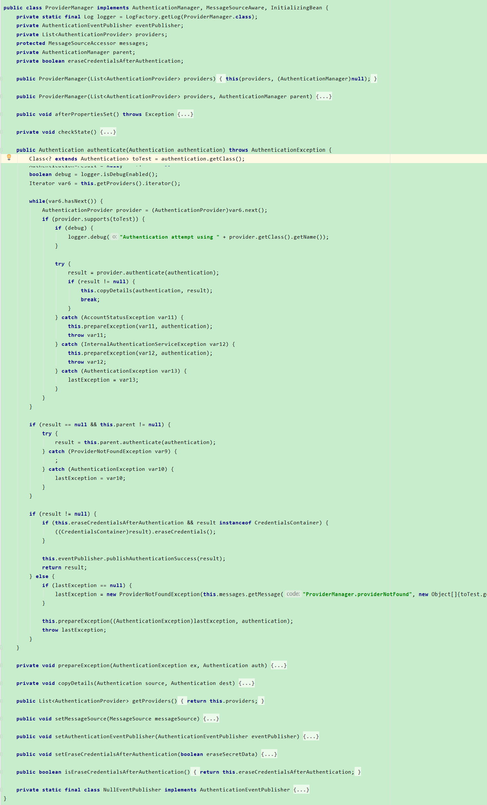
```java
Class<? extends Authentication> toTest = authentication.getClass();
AuthenticationException lastException = null;
Authentication result = null;
boolean debug = logger.isDebugEnabled();
Iterator var6 = this.getProviders().iterator();

while(var6.hasNext()) {
    AuthenticationProvider provider = (AuthenticationProvider)var6.next();
    if (provider.supports(toTest)) {
        if (debug) {
            logger.debug("Authentication attempt using " + provider.getClass().getName());
        }

        try {
            result = provider.authenticate(authentication);
            if (result != null) {
                this.copyDetails(authentication, result);
                break;
            }
        } catch (AccountStatusException var11) {
            this.prepareException(var11, authentication);
            throw var11;
        } catch (InternalAuthenticationServiceException var12) {
            this.prepareException(var12, authentication);
            throw var12;
        } catch (AuthenticationException var13) {
            lastException = var13;
        }
    }
}
```
AuthenticationManager用来管理下面的AuthenticationProvider。
真正的检验逻辑是写在AuthenticationProvider中，不同的登录方式的认证逻辑是不一样的。
用户名密码登录，校验的是用户名密码。如果是第三方登录，这时候是不用验密码的。
spring提供了两个provider，AuthenticationManager负责把所有的provider收集起来，然后收到请求的时候去循环它们，挨个去问你当前这个provider支不支持我这种登录方式。
即调用supports方法，判断支不支持我传进来的这个Authentication类型。
比如当前拿到的是UsernamePasswordAuthenticationToken，比如第三方的登录传的就是SocialAuthenticationToken。
根据传进来的Authentication类型会挑出其中一个provider来进行校验处理。

```java
result = provider.authenticate(authentication);
```
如果支持的话，往下走，真正去执行校验逻辑。

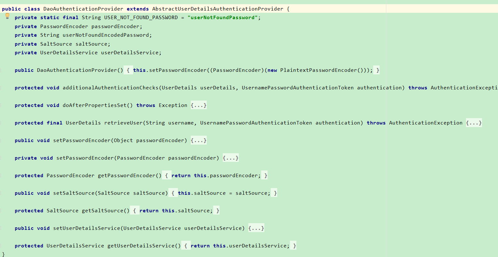
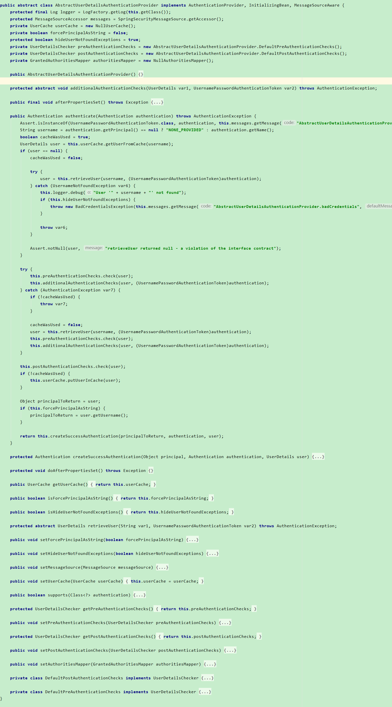

Authentication的主要校验逻辑是写在抽象类里面的，首先调用retrieveUser，获取到UserDetails对象。
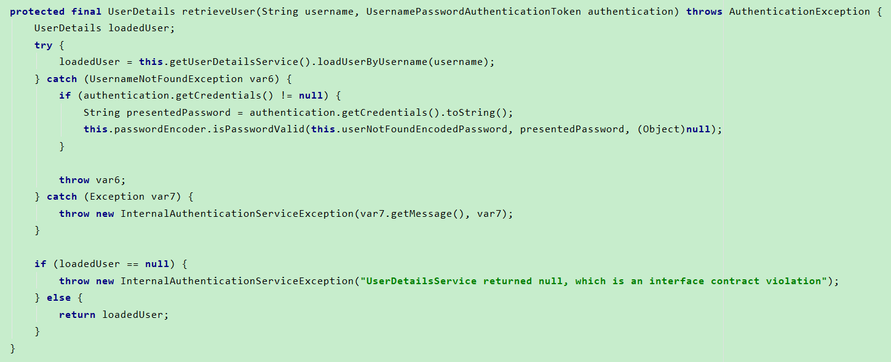
DaoAuthenticationProvider中实现了retrieveUser接口，在实现方法里，调用了我们提供的UserDetailsService实现。
通过loadUserByUsername查到我们的用户信息，并包装成UserDetails。如果拿不到，则抛出异常。
```java
this.preAuthenticationChecks.check(user);
```
如果拿到了用户信息，会做预检查。
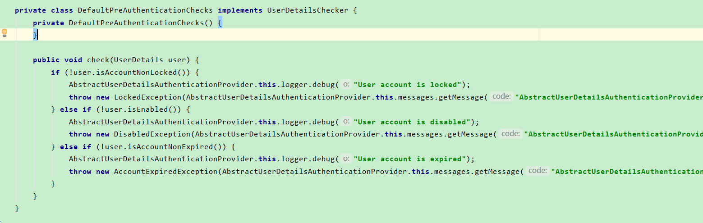
UserDetalis这个接口有4个方法来判断用户是否可用。锁定，过期等校验。

```java
this.additionalAuthenticationChecks(user, (UsernamePasswordAuthenticationToken)authentication);
```
做完预检查后，会做附加检查。在DaoAuthenticationProvider中有具体实现。
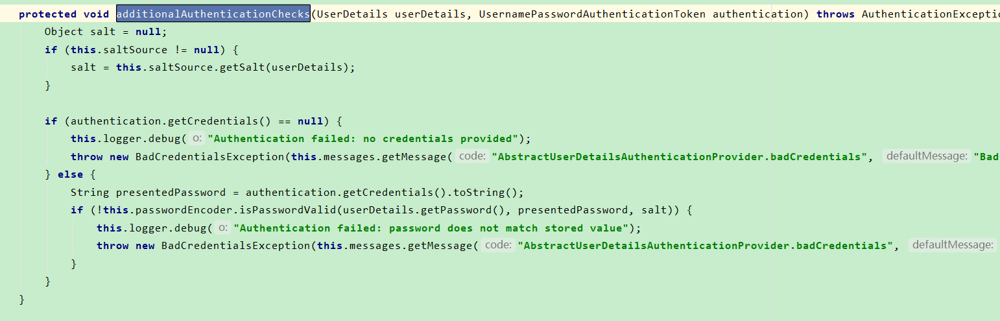
用passwordEncoder校验当前的密码是否匹配。

```java
this.postAuthenticationChecks.check(user);
```
做完前面两步检查之后，还有一个后检查。也是UserDetails中的校验。

```java
return this.createSuccessAuthentication(principalToReturn, authentication, user);
```
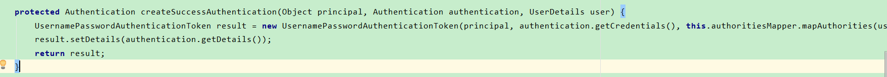
所有的这些检查都通过之后，那么认为用户认证是成功的，拿获取到的用户信息、Authentication传进来的认证请求信息来创建SuccessAuthentication。

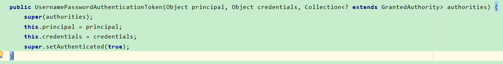
设置权限和认证通过。

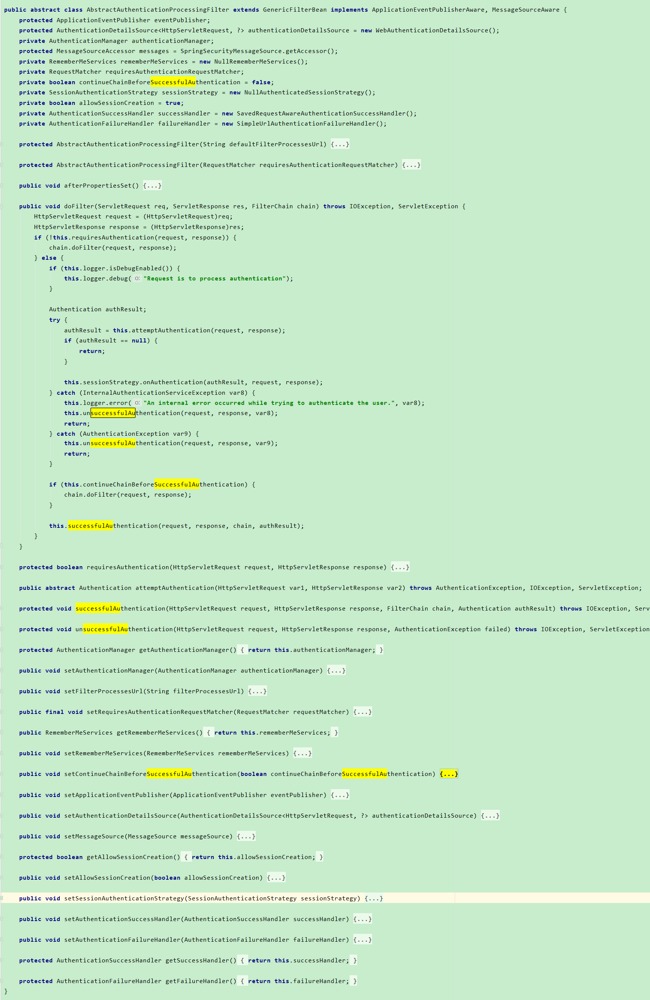
```java
this.successfulAuthentication(request, response, chain, authResult);
```
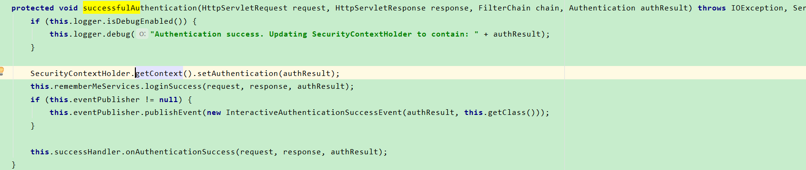
会调我们自己写的成功处理器。
```java
try {
    authResult = this.attemptAuthentication(request, response);
    if (authResult == null) {
        return;
    }

    this.sessionStrategy.onAuthentication(authResult, request, response);
} catch (InternalAuthenticationServiceException var8) {
    this.logger.error("An internal error occurred while trying to authenticate the user.", var8);
    this.unsuccessfulAuthentication(request, response, var8);
    return;
} catch (AuthenticationException var9) {
    this.unsuccessfulAuthentication(request, response, var9);
    return;
}
```
如果在认证过程中任何一处出了异常，会调用unsuccessfulAuthentication方法，其中会调用我们自己写的失败处理器。

## 2.认证结果如何在多个请求之间共享
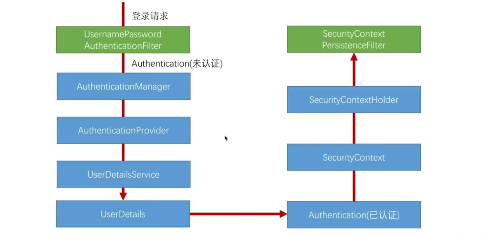
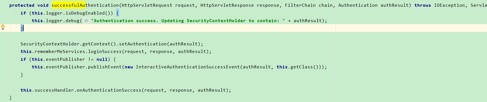
在调成功处理器之前，将我们认证成功的Authentication放到SecurityContext，然后放到SecurityContextHolder里面，
SecurityContextHolder实际上是ThreadLocal的封装。

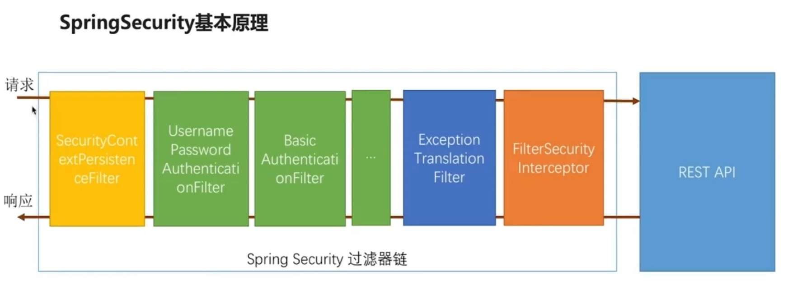
当请求进来的时候，检查sessionl里是否有SecurityContext。如果有，把SecurityContext从session中拿出来放到线程里，如果没有，则为空，放过。
当整个请求响应回来以后，过它的时候，它检查线程，如果线程里面有SecurityContext,就拿出来放到session里，这样不用的请求就可以在session中
拿到相同的认证信息。

## 3.获取认证用户信息
```java
@RestController
@RequestMapping("/user")
public class UserController {
  @GetMapping("/me")
  public Object getCurrentUser(@AuthenticationPrincipal UserDetails user) {
    return user;
  }

  @GetMapping("/me2")
  public Object getCurrentUser2(Authentication authentication) {
    return authentication;
  }
}
```
