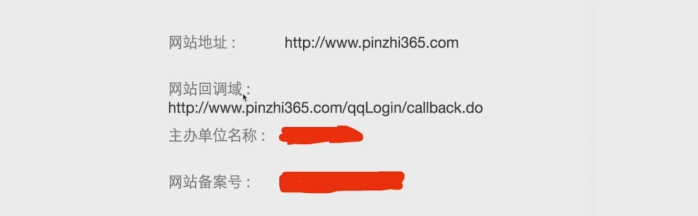

## 1.OAuth协议以及Spring Social原理简介

### OAuth协议简介
##### OAuth协议要解决的问题

1. 应用可以访问用户在微信上的所有数据
2. 用户只有修改密码，才能收回授权
3. 密码泄露的可能性大大提高

##### OAuth协议中的各种角色 && 运行流程


### Spring Social原理简介


## 2.实现QQ认证和微信认证
### QQ认证
参考：  
[https://wiki.connect.qq.com/](https://wiki.connect.qq.com/)  

spring-core:

```java
@Data
public class QQUserInfo {
	/**
	 * 	返回码
	 */
	private String ret;
	/**
	 * 如果ret<0，会有相应的错误信息提示，返回数据全部用UTF-8编码。
	 */
	private String msg;
	/**
	 *
	 */
	private String openId;
	/**
	 * 不知道什么东西，文档上没写，但是实际api返回里有。
	 */
	private String is_lost;
	/**
	 * 省(直辖市)
	 */
	private String province;
	/**
	 * 市(直辖市区)
	 */
	private String city;
	/**
	 * 出生年月
	 */
	private String year;
	/**
	 * 	用户在QQ空间的昵称。
	 */
	private String nickname;
	/**
	 * 	大小为30×30像素的QQ空间头像URL。
	 */
	private String figureurl;
	/**
	 * 	大小为50×50像素的QQ空间头像URL。
	 */
	private String figureurl_1;
	/**
	 * 	大小为100×100像素的QQ空间头像URL。
	 */
	private String figureurl_2;
	/**
	 * 	大小为40×40像素的QQ头像URL。
	 */
	private String figureurl_qq_1;
	/**
	 * 	大小为100×100像素的QQ头像URL。需要注意，不是所有的用户都拥有QQ的100×100的头像，但40×40像素则是一定会有。
	 */
	private String figureurl_qq_2;
	/**
	 * 	性别。 如果获取不到则默认返回”男”
	 */
	private String gender;
	/**
	 * 	标识用户是否为黄钻用户（0：不是；1：是）。
	 */
	private String is_yellow_vip;
	/**
	 * 	标识用户是否为黄钻用户（0：不是；1：是）
	 */
	private String vip;
	/**
	 * 	黄钻等级
	 */
	private String yellow_vip_level;
	/**
	 * 	黄钻等级
	 */
	private String level;
	/**
	 * 标识是否为年费黄钻用户（0：不是； 1：是）
	 */
	private String is_yellow_year_vip;
}
```
```java
public interface QQ {
	QQUserInfo getUserInfo();
}
```
```java
public class QQImpl extends AbstractOAuth2ApiBinding implements QQ {
	private static final String URL_GET_OPENID = "https://graph.qq.com/oauth2.0/me?access_token=%s";

	private static final String URL_GET_USERINFO = "https://graph.qq.com/user/get_user_info?oauth_consumer_key=%s&openid=%s";

	private String appId;

	private String openId;

	private ObjectMapper objectMapper = new ObjectMapper();

	public QQImpl(String accessToken, String appId) {
		super(accessToken, TokenStrategy.ACCESS_TOKEN_PARAMETER);

		this.appId = appId;

		String url = String.format(URL_GET_OPENID, accessToken);
		String result = getRestTemplate().getForObject(url, String.class);

		this.openId = StringUtils.substringBetween(result, "\"openid\":\"", "\"}");
	}

	@Override
	public QQUserInfo getUserInfo() {

		String url = String.format(URL_GET_USERINFO, appId, openId);
		String result = getRestTemplate().getForObject(url, String.class);

		QQUserInfo userInfo = null;
		try {
			userInfo = objectMapper.readValue(result, QQUserInfo.class);
			userInfo.setOpenId(openId);
			return userInfo;
		} catch (Exception e) {
			throw new RuntimeException("获取用户信息失败", e);
		}
	}
}
```
```java
public class QQOAuth2Template extends OAuth2Template {
	private Logger logger = LoggerFactory.getLogger(getClass());

	public QQOAuth2Template(String clientId, String clientSecret, String authorizeUrl, String accessTokenUrl) {
		super(clientId, clientSecret, authorizeUrl, accessTokenUrl);
		setUseParametersForClientAuthentication(true);
	}

	@Override
	protected AccessGrant postForAccessGrant(String accessTokenUrl, MultiValueMap<String, String> parameters) {
		String responseStr = getRestTemplate().postForObject(accessTokenUrl, parameters, String.class);

		logger.info("获取accessToke的响应："+responseStr);

		String[] items = StringUtils.splitByWholeSeparatorPreserveAllTokens(responseStr, "&");

		String accessToken = StringUtils.substringAfterLast(items[0], "=");
		Long expiresIn = new Long(StringUtils.substringAfterLast(items[1], "="));
		String refreshToken = StringUtils.substringAfterLast(items[2], "=");

		return new AccessGrant(accessToken, null, refreshToken, expiresIn);
	}

	@Override
	protected RestTemplate createRestTemplate() {
		RestTemplate restTemplate = super.createRestTemplate();
		restTemplate.getMessageConverters().add(new StringHttpMessageConverter(Charset.forName("UTF-8")));
		return restTemplate;
	}
}
```
```java
public class QQServiceProvider extends AbstractOAuth2ServiceProvider<QQ> {
	private String appId;

	private static final String URL_AUTHORIZE = "https://graph.qq.com/oauth2.0/authorize";

	private static final String URL_ACCESS_TOKEN = "https://graph.qq.com/oauth2.0/token";

	public QQServiceProvider(String appId, String appSecret) {
		super(new QQOAuth2Template(appId, appSecret, URL_AUTHORIZE, URL_ACCESS_TOKEN));
		this.appId = appId;
	}

	@Override
	public QQ getApi(String accessToken) {
		return new QQImpl(accessToken, appId);
	}
}
```
```java
public class QQAdapter implements ApiAdapter<QQ> {
	@Override
	public boolean test(QQ api) {
		return true;
	}

	@Override
	public void setConnectionValues(QQ api, ConnectionValues values) {
		QQUserInfo userInfo = api.getUserInfo();

		values.setDisplayName(userInfo.getNickname());
		values.setImageUrl(userInfo.getFigureurl_qq_1());
		values.setProfileUrl(null);
		values.setProviderUserId(userInfo.getOpenId());
	}

	@Override
	public UserProfile fetchUserProfile(QQ api) {
		// TODO Auto-generated method stub
		return null;
	}

	@Override
	public void updateStatus(QQ api, String message) {
		//do noting
	}
}
```
```java
public class QQConnectionFactory extends OAuth2ConnectionFactory<QQ> {
	public QQConnectionFactory(String providerId, String appId, String appSecret) {
		super(providerId, new QQServiceProvider(appId, appSecret), new QQAdapter());
	}
}
```
```java
public class QQProperties extends SocialProperties {
	private String providerId = "qq";
}
```
```java
@Data
public class SocialProperties {
  private String filterProcessesUrl = "/auth";

  private QQProperties qq = new QQProperties();
}
```
```java
@Data
public class BrowserProperties {
  ...
  private String signUpUrl = "/my-signUp.html";
}
```
```java
@Data
@ConfigurationProperties(prefix = "security")
public class SecurityProperties {
  ...
  private SocialProperties social = new SocialProperties();
  private BrowserProperties browser = new BrowserProperties();
}
```
```java
public class MySpringSocialConfigurer extends SpringSocialConfigurer {
	private String filterProcessesUrl;

	public MySpringSocialConfigurer(String filterProcessesUrl) {
		this.filterProcessesUrl = filterProcessesUrl;
	}

	@SuppressWarnings("unchecked")
	@Override
	protected <T> T postProcess(T object) {
		SocialAuthenticationFilter filter = (SocialAuthenticationFilter) super.postProcess(object);
		filter.setFilterProcessesUrl(filterProcessesUrl);
		return (T) filter;
	}
}
```
```java
@Configuration
@EnableSocial
public class SocialConfig extends SocialConfigurerAdapter {

	@Autowired
	private DataSource dataSource;

	@Autowired
	private SecurityProperties securityProperties;

	@Autowired(required = false)
	private ConnectionSignUp connectionSignUp;

	@Override
	public UsersConnectionRepository getUsersConnectionRepository(ConnectionFactoryLocator connectionFactoryLocator) {
		JdbcUsersConnectionRepository repository = new JdbcUsersConnectionRepository(dataSource,
				connectionFactoryLocator, Encryptors.noOpText());
		repository.setTablePrefix("my_");
		if(connectionSignUp != null) {
			repository.setConnectionSignUp(connectionSignUp);
		}
		return repository;
	}

	@Bean
	public SpringSocialConfigurer mySocialSecurityConfig() {
		String filterProcessesUrl = securityProperties.getSocial().getFilterProcessesUrl();
		MySpringSocialConfigurer configurer = new MySpringSocialConfigurer(filterProcessesUrl);
		configurer.signupUrl(securityProperties.getBrowser().getSignUpUrl());
		return configurer;
	}

	@Bean
	public ProviderSignInUtils providerSignInUtils(ConnectionFactoryLocator connectionFactoryLocator) {
		return new ProviderSignInUtils(connectionFactoryLocator,
				getUsersConnectionRepository(connectionFactoryLocator)) {
		};
	}
}
```
org/springframework/social/spring-social-core/1.1.4.RELEASE/spring-social-core-1.1.4.RELEASE.jar!/org/springframework/social/connect/jdbc/JdbcUsersConnectionRepository.sql:
```sql
create table UserConnection (userId varchar(255) not null,
	providerId varchar(255) not null,
	providerUserId varchar(255),
	rank int not null,
	displayName varchar(255),
	profileUrl varchar(512),
	imageUrl varchar(512),
	accessToken varchar(512) not null,
	secret varchar(512),
	refreshToken varchar(512),
	expireTime bigint,
	primary key (userId, providerId, providerUserId));
create unique index UserConnectionRank on UserConnection(userId, providerId, rank);
```
```java
@Configuration
@ConditionalOnProperty(prefix = "security.social.qq", name = "app-id")
public class QQAutoConfig extends SocialAutoConfigurerAdapter {
	@Autowired
	private SecurityProperties securityProperties;

	@Override
	protected ConnectionFactory<?> createConnectionFactory() {
		QQProperties qqConfig = securityProperties.getSocial().getQq();
		return new QQConnectionFactory(qqConfig.getProviderId(), qqConfig.getAppId(), qqConfig.getAppSecret());
	}
}
```
spring-browser:
```java
@Configuration
public class BrowserSecurityConfig extends AbstractChannelSecurityConfig {
  ...
  @Autowired
  private SpringSocialConfigurer mySocialSecurityConfig;

  @Override
	protected void configure(HttpSecurity http) throws Exception {
      http.apply(mySocialSecurityConfig)
          .and()
          .authorizeRequests()
          .antMatchers(
            securityProperties.getBrowser().getSignUpUrl(),
            "/user/regist"
          )
          .permitAll()
          ...

  }
}
```
```java
@Data
public class SocialUserInfo {
	private String providerId;

	private String providerUserId;

	private String nickname;

	private String headimg;
}
```
```java
@RestController
public class BrowserSecurityController {
	@Autowired
	private ProviderSignInUtils providerSignInUtils;

	@GetMapping("/social/user")
	public SocialUserInfo getSocialUserInfo(HttpServletRequest request) {
		SocialUserInfo userInfo = new SocialUserInfo();
		Connection<?> connection = providerSignInUtils.getConnectionFromSession(new ServletWebRequest(request));
		userInfo.setProviderId(connection.getKey().getProviderId());
		userInfo.setProviderUserId(connection.getKey().getProviderUserId());
		userInfo.setNickname(connection.getDisplayName());
		userInfo.setHeadimg(connection.getImageUrl());
		return userInfo;
	}
}
```
my-signIn.html
```html
<!DOCTYPE html>
<html>
<head>
<meta charset="UTF-8">
<title>登录</title>
</head>
<body>
  <h3>社交登录</h3>
  <a href="/qqLogin/callback.do">QQ登录</a>
</body>
</html>
```
spring-demo:
```java
@Component
public class DemoConnectionSignUp implements ConnectionSignUp {
	@Override
	public String execute(Connection<?> connection) {
		//根据社交用户信息默认创建用户并返回用户唯一标识
		return connection.getDisplayName();
	}
}
```
```java
@Component
public class MyUserDetailsService implements UserDetailsService, SocialUserDetailsService {
	private Logger logger = LoggerFactory.getLogger(getClass());

	@Autowired
	private PasswordEncoder passwordEncoder;

	@Override
	public UserDetails loadUserByUsername(String username) throws UsernameNotFoundException {
		logger.info("表单登录用户名:" + username);
		return buildUser(username);
	}

	@Override
	public SocialUserDetails loadUserByUserId(String userId) throws UsernameNotFoundException {
		logger.info("设计登录用户Id:" + userId);
		return buildUser(userId);
	}

	private SocialUserDetails buildUser(String userId) {
		// 根据用户名查找用户信息
		//根据查找到的用户信息判断用户是否被冻结
		String password = passwordEncoder.encode("123456");
		logger.info("数据库密码是:"+password);
		return new SocialUser(userId, password,
				true, true, true, true,
				AuthorityUtils.commaSeparatedStringToAuthorityList("admin"));
	}
}
```
```java
@RestController
@RequestMapping("/user")
public class UserController {
  @Autowired
  private ProviderSignInUtils providerSignInUtils;

  @PostMapping("/regist")
  public void regist(User user, HttpServletRequest request) {

    //不管是注册用户还是绑定用户，都会拿到一个用户唯一标识。
    String userId = user.getUsername();
    providerSignInUtils.doPostSignUp(userId, new ServletWebRequest(request));
  }
}
```

application.properties:
```properties
...
security.social.qq.app-id =
security.social.qq.app-secret =
security.social.qq.providerId = callback.do

security.browser.signUpUrl = /demo-signUp.html

security.social.filterProcessesUrl = /qqLogin
```
demo-signUp.html:
```html
<!DOCTYPE html>
<html>
<head>
<meta charset="UTF-8">
<title>登录</title>
</head>
<body>
	<h2>Demo注册页</h2>

	<form action="/user/regist" method="post">
		<table>
			<tr>
				<td>用户名:</td>
				<td><input type="text" name="username"></td>
			</tr>
			<tr>
				<td>密码:</td>
				<td><input type="password" name="password"></td>
			</tr>
			<tr>
				<td colspan="2">
					<button type="submit" name="type" value="regist">注册</button>
					<button type="submit" name="type" value="binding">绑定</button>
				</td>
			</tr>
		</table>
	</form>
</body>
</html>
```
### 微信认证
spring-core:
```java
@Data
public class WeixinUserInfo {

	/**
	 * 普通用户的标识，对当前开发者帐号唯一
	 */
	private String openid;
	/**
	 * 普通用户昵称
	 */
	private String nickname;
	/**
	 * 语言
	 */
	private String language;
	/**
	 * 普通用户性别，1为男性，2为女性
	 */
	private String sex;
	/**
	 * 普通用户个人资料填写的省份
	 */
	private String province;
	/**
	 * 普通用户个人资料填写的城市
	 */
	private String city;
	/**
	 * 国家，如中国为CN
	 */
	private String country;
	/**
	 * 用户头像，最后一个数值代表正方形头像大小（有0、46、64、96、132数值可选，0代表640*640正方形头像），用户没有头像时该项为空
	 */
	private String headimgurl;
	/**
	 * 用户特权信息，json数组，如微信沃卡用户为（chinaunicom）
	 */
	private String[] privilege;
	/**
	 * 用户统一标识。针对一个微信开放平台帐号下的应用，同一用户的unionid是唯一的。
	 */
	private String unionid;
}
```
```java
public interface Weixin {
	WeixinUserInfo getUserInfo(String openId);
}
```
```java
/**
 * Weixin API调用模板， scope为Request的Spring bean, 根据当前用户的accessToken创建。
 */
public class WeixinImpl extends AbstractOAuth2ApiBinding implements Weixin {
	/**
	 *
	 */
	private ObjectMapper objectMapper = new ObjectMapper();
	/**
	 * 获取用户信息的url
	 */
	private static final String URL_GET_USER_INFO = "https://api.weixin.qq.com/sns/userinfo?openid=";

	/**
	 * @param accessToken
	 */
	public WeixinImpl(String accessToken) {
		super(accessToken, TokenStrategy.ACCESS_TOKEN_PARAMETER);
	}

	/**
	 * 默认注册的StringHttpMessageConverter字符集为ISO-8859-1，而微信返回的是UTF-8的，所以覆盖了原来的方法。
	 */
	protected List<HttpMessageConverter<?>> getMessageConverters() {
		List<HttpMessageConverter<?>> messageConverters = super.getMessageConverters();
		messageConverters.remove(0);
		messageConverters.add(new StringHttpMessageConverter(Charset.forName("UTF-8")));
		return messageConverters;
	}

	/**
	 * 获取微信用户信息。
	 */
	@Override
	public WeixinUserInfo getUserInfo(String openId) {
		String url = URL_GET_USER_INFO + openId;
		String response = getRestTemplate().getForObject(url, String.class);
		if(StringUtils.contains(response, "errcode")) {
			return null;
		}
		WeixinUserInfo profile = null;
		try {
			profile = objectMapper.readValue(response, WeixinUserInfo.class);
		} catch (Exception e) {
			e.printStackTrace();
		}
		return profile;
	}

}
```
```java
@Data
public class WeixinProperties extends SocialProperties {
	/**
	 * 第三方id，用来决定发起第三方登录的url，默认是 weixin。
	 */
	private String providerId = "weixin";
}
```
```java
@Data
public class SocialProperties {
  private String filterProcessesUrl = "/auth";
  ...
  private WeixinProperties weixin = new WeixinProperties();
}
```
```java
/**
 * 微信的access_token信息。与标准OAuth2协议不同，微信在获取access_token时会同时返回openId,并没有单独的通过accessToke换取openId的服务
 *
 * 所以在这里继承了标准AccessGrant，添加了openId字段，作为对微信access_token信息的封装。
 */
@Data
public class WeixinAccessGrant extends AccessGrant {
	private static final long serialVersionUID = -7243374526633186782L;

	private String openId;

	public WeixinAccessGrant() {
		super("");
	}

	public WeixinAccessGrant(String accessToken, String scope, String refreshToken, Long expiresIn) {
		super(accessToken, scope, refreshToken, expiresIn);
	}
}
```
```java
/**
 * 完成微信的OAuth2认证流程的模板类。国内厂商实现的OAuth2每个都不同, spring默认提供的OAuth2Template适应不了，只能针对每个厂商自己微调。
 */
public class WeixinOAuth2Template extends OAuth2Template {
	private String clientId;

	private String clientSecret;

	private String accessTokenUrl;

	private static final String REFRESH_TOKEN_URL = "https://api.weixin.qq.com/sns/oauth2/refresh_token";

	private Logger logger = LoggerFactory.getLogger(getClass());

	public WeixinOAuth2Template(String clientId, String clientSecret, String authorizeUrl, String accessTokenUrl) {
		super(clientId, clientSecret, authorizeUrl, accessTokenUrl);
		setUseParametersForClientAuthentication(true);
		this.clientId = clientId;
		this.clientSecret = clientSecret;
		this.accessTokenUrl = accessTokenUrl;
	}

	@Override
	public AccessGrant exchangeForAccess(String authorizationCode, String redirectUri,
			MultiValueMap<String, String> parameters) {

		StringBuilder accessTokenRequestUrl = new StringBuilder(accessTokenUrl);

		accessTokenRequestUrl.append("?appid="+clientId);
		accessTokenRequestUrl.append("&secret="+clientSecret);
		accessTokenRequestUrl.append("&code="+authorizationCode);
		accessTokenRequestUrl.append("&grant_type=authorization_code");
		accessTokenRequestUrl.append("&redirect_uri="+redirectUri);

		return getAccessToken(accessTokenRequestUrl);
	}

	public AccessGrant refreshAccess(String refreshToken, MultiValueMap<String, String> additionalParameters) {

		StringBuilder refreshTokenUrl = new StringBuilder(REFRESH_TOKEN_URL);

		refreshTokenUrl.append("?appid="+clientId);
		refreshTokenUrl.append("&grant_type=refresh_token");
		refreshTokenUrl.append("&refresh_token="+refreshToken);

		return getAccessToken(refreshTokenUrl);
	}

	@SuppressWarnings("unchecked")
	private AccessGrant getAccessToken(StringBuilder accessTokenRequestUrl) {

		logger.info("获取access_token, 请求URL: "+accessTokenRequestUrl.toString());

		String response = getRestTemplate().getForObject(accessTokenRequestUrl.toString(), String.class);

		logger.info("获取access_token, 响应内容: "+response);

		Map<String, Object> result = null;
		try {
			result = new ObjectMapper().readValue(response, Map.class);
		} catch (Exception e) {
			e.printStackTrace();
		}

		//返回错误码时直接返回空
		if(StringUtils.isNotBlank(MapUtils.getString(result, "errcode"))){
			String errcode = MapUtils.getString(result, "errcode");
			String errmsg = MapUtils.getString(result, "errmsg");
			throw new RuntimeException("获取access token失败, errcode:"+errcode+", errmsg:"+errmsg);
		}

		WeixinAccessGrant accessToken = new WeixinAccessGrant(
				MapUtils.getString(result, "access_token"),
				MapUtils.getString(result, "scope"),
				MapUtils.getString(result, "refresh_token"),
				MapUtils.getLong(result, "expires_in"));

		accessToken.setOpenId(MapUtils.getString(result, "openid"));

		return accessToken;
	}

	/**
	 * 构建获取授权码的请求。也就是引导用户跳转到微信的地址。
	 */
	public String buildAuthenticateUrl(OAuth2Parameters parameters) {
		String url = super.buildAuthenticateUrl(parameters);
		url = url + "&appid="+clientId+"&scope=snsapi_login";
		return url;
	}

	public String buildAuthorizeUrl(OAuth2Parameters parameters) {
		return buildAuthenticateUrl(parameters);
	}

	/**
	 * 微信返回的contentType是html/text，添加相应的HttpMessageConverter来处理。
	 */
	protected RestTemplate createRestTemplate() {
		RestTemplate restTemplate = super.createRestTemplate();
		restTemplate.getMessageConverters().add(new StringHttpMessageConverter(Charset.forName("UTF-8")));
		return restTemplate;
	}
}
```
```java
/**
 * 微信 api适配器，将微信 api的数据模型转为spring social的标准模型。
 */
public class WeixinAdapter implements ApiAdapter<Weixin> {
	private String openId;

	public WeixinAdapter() {}

	public WeixinAdapter(String openId){
		this.openId = openId;
	}

	@Override
	public boolean test(Weixin api) {
		return true;
	}

	@Override
	public void setConnectionValues(Weixin api, ConnectionValues values) {
		WeixinUserInfo profile = api.getUserInfo(openId);
		values.setProviderUserId(profile.getOpenid());
		values.setDisplayName(profile.getNickname());
		values.setImageUrl(profile.getHeadimgurl());
	}

	@Override
	public UserProfile fetchUserProfile(Weixin api) {
		return null;
	}

	@Override
	public void updateStatus(Weixin api, String message) {
		//do nothing
	}
}
```
```java
/**
 * 微信的OAuth2流程处理器的提供器，供spring social的connect体系调用
 */
public class WeixinServiceProvider extends AbstractOAuth2ServiceProvider<Weixin> {
	/**
	 * 微信获取授权码的url
	 */
	private static final String URL_AUTHORIZE = "https://open.weixin.qq.com/connect/qrconnect";
	/**
	 * 微信获取accessToken的url
	 */
	private static final String URL_ACCESS_TOKEN = "https://api.weixin.qq.com/sns/oauth2/access_token";

	public WeixinServiceProvider(String appId, String appSecret) {
		super(new WeixinOAuth2Template(appId, appSecret,URL_AUTHORIZE,URL_ACCESS_TOKEN));
	}

	@Override
	public Weixin getApi(String accessToken) {
		return new WeixinImpl(accessToken);
	}
}
```
```java
/**
 * 微信连接工厂
 */
public class WeixinConnectionFactory extends OAuth2ConnectionFactory<Weixin> {

	public WeixinConnectionFactory(String providerId, String appId, String appSecret) {
		super(providerId, new WeixinServiceProvider(appId, appSecret), new WeixinAdapter());
	}

	/**
	 * 由于微信的openId是和accessToken一起返回的，所以在这里直接根据accessToken设置providerUserId即可，不用像QQ那样通过QQAdapter来获取
	 */
	@Override
	protected String extractProviderUserId(AccessGrant accessGrant) {
		if(accessGrant instanceof WeixinAccessGrant) {
			return ((WeixinAccessGrant)accessGrant).getOpenId();
		}
		return null;
	}

	public Connection<Weixin> createConnection(AccessGrant accessGrant) {
		return new OAuth2Connection<Weixin>(getProviderId(), extractProviderUserId(accessGrant), accessGrant.getAccessToken(),
				accessGrant.getRefreshToken(), accessGrant.getExpireTime(), getOAuth2ServiceProvider(), getApiAdapter(extractProviderUserId(accessGrant)));
	}

	public Connection<Weixin> createConnection(ConnectionData data) {
		return new OAuth2Connection<Weixin>(data, getOAuth2ServiceProvider(), getApiAdapter(data.getProviderUserId()));
	}

	private ApiAdapter<Weixin> getApiAdapter(String providerUserId) {
		return new WeixinAdapter(providerUserId);
	}

	private OAuth2ServiceProvider<Weixin> getOAuth2ServiceProvider() {
		return (OAuth2ServiceProvider<Weixin>) getServiceProvider();
	}
}
```
```java
/**
 * 微信登录配置
 */
@Configuration
@ConditionalOnProperty(prefix = "security.social.weixin", name = "app-id")
public class WeixinAutoConfiguration extends SocialAutoConfigurerAdapter {
	@Autowired
	private SecurityProperties securityProperties;

	@Override
	protected ConnectionFactory<?> createConnectionFactory() {
		WeixinProperties weixinConfig = securityProperties.getSocial().getWeixin();
		return new WeixinConnectionFactory(weixinConfig.getProviderId(), weixinConfig.getAppId(),
				weixinConfig.getAppSecret());
	}

	@Bean({"connect/weixinConnect", "connect/weixinConnected"})
	@ConditionalOnMissingBean(name = "weixinConnectedView")
	public View weixinConnectedView() {
		return new MyConnectView();
	}
}
```
```java
public class MyConnectView extends AbstractView {

	@Override
	protected void renderMergedOutputModel(Map<String, Object> model, HttpServletRequest request,
			HttpServletResponse response) throws Exception {

		response.setContentType("text/html;charset=UTF-8");
		if (model.get("connection") == null) {
			response.getWriter().write("<h3>解绑成功</h3>");
		} else {
			response.getWriter().write("<h3>绑定成功</h3>");
		}
	}
}
```
```java
@Component("connect/status")
public class MyConnectionStatusView extends AbstractView {
	@Autowired
	private ObjectMapper objectMapper;

	@SuppressWarnings("unchecked")
	@Override
	protected void renderMergedOutputModel(Map<String, Object> model, HttpServletRequest request,
			HttpServletResponse response) throws Exception {

		Map<String, List<Connection<?>>> connections = (Map<String, List<Connection<?>>>) model.get("connectionMap");

		Map<String, Boolean> result = new HashMap<>();
		for (String key : connections.keySet()) {
			result.put(key, CollectionUtils.isNotEmpty(connections.get(key)));
		}

		response.setContentType("application/json;charset=UTF-8");
		response.getWriter().write(objectMapper.writeValueAsString(result));
	}
}
```
spring-browser:
my-signIn.html:
```html
<!DOCTYPE html>
<html>
<head>
<meta charset="UTF-8">
<title>登录</title>
</head>
<body>
...
<a href="/qqLogin/weixin">微信登录</a>
</body>
</html>
```
my-banding.html:
```html
<!DOCTYPE html>
<html>
<head>
<meta charset="UTF-8">
<title>登录</title>
</head>
<body>
	<h2>标准绑定页面</h2>
	<form action="/connect/weixin" method="post">
		<button type="submit">绑定微信</button>
	</form>
</body>
</html>
```
spring-demo:
application.properties:

```properties
security.social.weixin.app-id = wxd99431bbff8305a0
security.social.weixin.app-secret = 60f78681d063590a469f1b297feff3c4
```

## 3.SESSION管理及退出
### Session超时处理

### Session并发控制

### 集群Session管理
