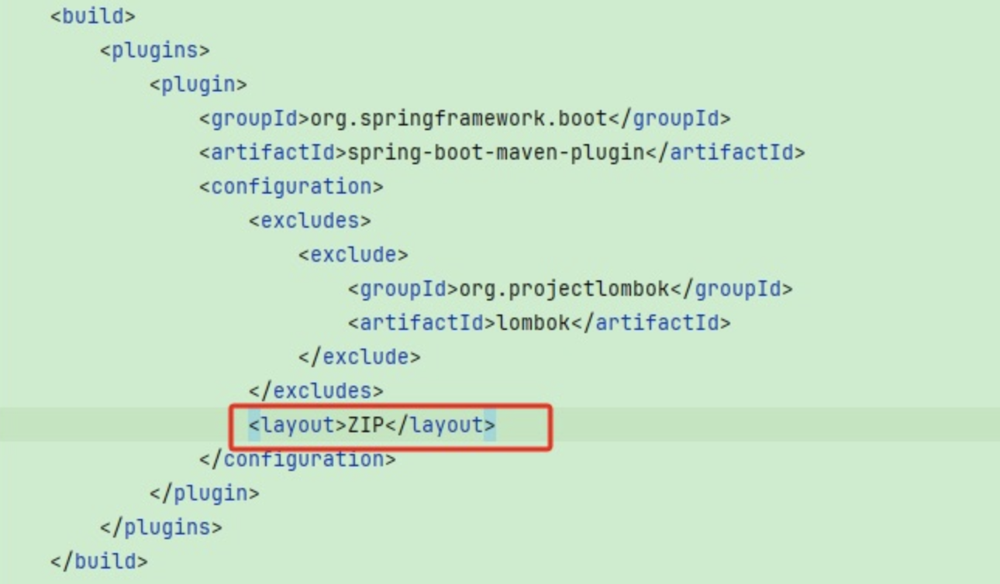

# 【实践】类路径下文件加载如何实现可配置

## 背景
项目中在没有使用配置中心的情况下，通过`Class`的`getResourceAsStream`实现resources目录下数据库配置文件`db.properties`的读取，具体代码如下

```java
@Slf4j
public class DBUtils {

    private DBUtils() {}

    private static final Properties properties = new Properties();

    private static final DataSource dataSource;

    static {
        try (InputStream input = DBUtils.class.getResourceAsStream("/db.properties")) {
            properties.load(input);
            dataSource = DruidDataSourceFactory.createDataSource(properties);
            ((DruidDataSource) dataSource).setFilters("stat,slf4j");

            Class.forName(properties.getProperty("driverClassName"));
        } catch (IOException e) {
            throw new BusinessException(-1, "加载配置文件失败", e);
        } catch (Exception e) {
            throw new BusinessException(-1, "数据库连接池创建失败", e);
        }
    }

    public static Connection getConnection() throws SQLException {
        return dataSource.getConnection();
    }

    // 其它数据库操作
}
```

但是我们在生产环境会倾向于将配置文件放在jar包之外进行维护，此处我们使用`DBUtils.class.getResourceAsStream("/db.properties")`进行文件的读取，它读取是类路径下的文件，如果要实现在jar包之外维护配置文件，我们需要使用绝对路径的方式进行读取，除了要更换api还需要在代码上做环境判断，那么在不改变代码的情况下要如何实现类路径下文件加载的可配置呢。  

## 解决
- 添加spring-boot-maven-plugin插件  

我们可以借助spring-boot-maven-plugin这个maven插件来实现可配置，只需要添加`<layout>ZIP</layout>`即可


- 配置挂载  

启动时增加参数`-Dloader.path`并指定配置文件绝对路径
```
java -Dloader.path=/path/to/db.properties -jar app.jar
```