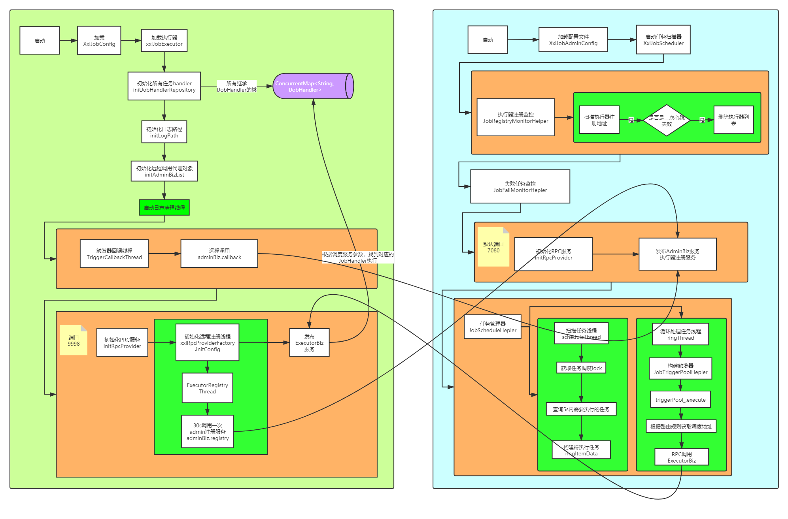

# 【学习】分布式任务调度XXL-JOB
## 定时任务使用场景
**1、时间驱动**  
房贷短信  
营销类短信  
对账单、日结、月结  
...  
**2、数据驱动**  
数据交换，数据同步  
系统解耦，批量处理  
...  

## 定时任务的基本概念

**1、执行器 Executor**  
**2、任务 JOB**  
**3、触发器 Trigger**  


## 原生定时任务框架先天缺陷
**1、不支持分片任务**  
处理有序数据时，多机器分片执行任务处理不同数据  

**2、不支持生命周期统一管理**  
不重启服务情况下关闭、启动任务。  

**3、不支持集群**  
存在任务重复执行的问题  

**4、不支持失败重试**  
出现异常后任务终结，不能根据执行状态控制任务重新执行  

**5、不支持动态调整**  
不重启服务的情况下修改任务参数  

**6、无报警机制**  
任务失败之后没有报警机制  

**7、任务数据统计难以统计**  
任务数据量大时，对于任务执行情况无法高效的统计执行情况  

## XXL-JOB架构
### 调度中心设计

- 任务检测

以秒查询当前需要执行的任务，并计算出下一次的执行时间，并更新数据库

- 负载均衡

根据执行器地址列表和配置的路由测试计算出需要通知的执行器

- 通讯

使用自定义的RPC协议，或者http协议。Xxl-job通过netty封装了Servlet容器

- 健康检查

监控执行器是否在线，离线的机器需要踢出负载列表

### 执行器设计

- 对外接口

提供一系列对外接口给调度中心调用，接收任务执行通知

- 任务管理

在执行器初始化的时候，实例化有当前执行器中声明的任务实例，并进行管理

- 调度实现

在接收到任务执行通知的时候，调用对应实例执行业务方法。阻塞策略的控制。超时机制的实现

- 健康检查

定时上报心跳信息，实现调度中心的健康检查


## XXL-JOB安装使用说明
**1、源码下载**  

许雪里社区 [http://www.xuxueli.com/page/projects.html](http://www.xuxueli.com/page/projects.html)  
XXL-JOB github 地址 [https://github.com/xuxueli/xxl-job](https://github.com/xuxueli/xxl-job)  

**2、初始化admin数据库**  

| 表名             | 表描述           |
| ---------------- | ---------------- |
| xxl_job_group    | 执行器分组       |
| xxl_job_info     | 任务信息         |
| xxl_job_lock     | 任务通知分布式锁 |
| xxl_job_log      | 任务执行日志     |
| xxl_job_logglue  | glue模式任务日志 |
| xxl_job_registry | 执行器注册信息   |
| xxl_user         | admin用户表      |

**3、修改admin配置文件**  

**4、访问admin首页，执行器列表、任务列表**  

```
http://127.0.0.1:8081/xxl-job-admin
```


**5、执行器依赖core包，修改配置文件**

```properties
xxl.job.admin.addresses=http://127.0.0.1:8081/xxl-job-admin

### xxl-job executor address
xxl.job.executor.appname=xxl-job-executor-sample
xxl.job.executor.ip=
xxl.job.executor.port=9999

### xxl-job, access token
xxl.job.accessToken=

### xxl-job log path /data/applogs/xxl-job/jobhandler
xxl.job.executor.logpath=D:\\xxldata\\applogs\\xxl-job\\jobhandler
### xxl-job log retention days
xxl.job.executor.logretentiondays=-1
```

**6、编写任务handler**

```java
@Component
public class SampleXxlJob {
    private static Logger logger = LoggerFactory.getLogger(SampleXxlJob.class);


    /**
     * 1、简单任务示例（Bean模式）
     */
    @XxlJob("demoJobHandler")
    public void demoJobHandler() throws Exception {
        XxlJobHelper.log("XXL-JOB, Hello World.");

        for (int i = 0; i < 5; i++) {
            XxlJobHelper.log("beat at:" + i);
            TimeUnit.SECONDS.sleep(2);
        }
        // default success
    }
}
```

**7、启动执行器**

```
自动注册

手动注册
```

**8、admin查看执行器列表**


**9、配置任务**


**10、执行一次任务**


**11、启动任务**


**12、admin集群**

 	   集群任务通知原子性
 	   
**13、多机器**

```properties
xxl.job.admin.addresses=http://127.0.0.1:8081/xxl-job-admin

### xxl-job executor address
xxl.job.executor.appname=xxl-job-executor-sample
xxl.job.executor.ip=
xxl.job.executor.port=9998

### xxl-job, access token
xxl.job.accessToken=

### xxl-job log path /data/applogs/xxl-job/jobhandler
xxl.job.executor.logpath=D:\\xxldata\\applogs\\xxl-job\\jobhandler
### xxl-job log retention days
xxl.job.executor.logretentiondays=-1
```

把端口为9999的执行器kill，迅速再执行一次，会发现调度失败


等一会再次执行一次，调度成功


**14、分片广播**  

```java
@Component
public class SampleXxlJob {
    private static Logger logger = LoggerFactory.getLogger(SampleXxlJob.class);
    
    /**
     * 2、分片广播任务
     */
    @XxlJob("shardingJobHandler")
    public void shardingJobHandler(String param) throws Exception {

        // 分片参数
        int shardIndex = XxlJobHelper.getShardIndex();
        int shardTotal = XxlJobHelper.getShardTotal();

        XxlJobHelper.log("分片参数：当前分片序号 = {}, 总分片数 = {}", shardIndex, shardTotal);

        // 业务逻辑
        for (int i = 0; i < shardTotal; i++) {
            if (i == shardIndex) {
                XxlJobHelper.log("第 {} 片, 命中分片开始处理", i);
            } else {
                XxlJobHelper.log("第 {} 片, 忽略", i);
            }
        }

    }
}
```


## 基于当前XXL-JOB我们能做什么？
1、手动注册执行器，路由策略的健康机制优化
修改为手动注册时 该执行器下的任务路由策略做限制，因为不会做心跳保护，因为是手动录入的，所以不可能检测到挂掉后还要手动录入
此时，如果路由策略如果选择不当(比如第一个)，则会出现错误，可通过选择故障转移、忙碌转移等进行避免

2、同一个工程、多个任务、不同节点执行？


## 源码阅读技巧
xxl-job-admin 调度中心，独立的web服务  
xxl-job-core 独立jar  
xxl-job-executor-samples 不同框架集成  

宏观 -> 微观 -> 图解

阅读类，先看全局变量，

顾名思义

```java
@Configuration
public class XxlJobConfig {
    private Logger logger = LoggerFactory.getLogger(XxlJobConfig.class);

    @Value("${xxl.job.admin.addresses}")
    private String adminAddresses;
    @Value("${xxl.job.executor.appname}")
    private String appName;
    @Value("${xxl.job.executor.ip}")
    private String ip;
    @Value("${xxl.job.executor.port}")
    private int port;
    @Value("${xxl.job.accessToken}")
    private String accessToken;
    @Value("${xxl.job.executor.logpath}")
    private String logPath;
    @Value("${xxl.job.executor.logretentiondays}")
    private int logRetentionDays;

    @Bean(initMethod = "start", destroyMethod = "destroy")
    public XxlJobSpringExecutor xxlJobExecutor() {
        logger.info(">>>>>>>>>>> xxl-job config init.");
        XxlJobSpringExecutor xxlJobSpringExecutor = new XxlJobSpringExecutor();
        xxlJobSpringExecutor.setAdminAddresses(adminAddresses);
        xxlJobSpringExecutor.setAppName(appName);
        xxlJobSpringExecutor.setIp(ip);
        xxlJobSpringExecutor.setPort(port);
        xxlJobSpringExecutor.setAccessToken(accessToken);
        xxlJobSpringExecutor.setLogPath(logPath);
        xxlJobSpringExecutor.setLogRetentionDays(logRetentionDays);
        return xxlJobSpringExecutor;
    }
}
```
```java
public class XxlJobSpringExecutor extends XxlJobExecutor implements ApplicationContextAware {
    @Override
    public void start() throws Exception {
        // init JobHandler Repository
        // 初始化当前实例下所有的JobHandler、放入jobHandlerRepository map容器
        initJobHandlerRepository(applicationContext);
        // refresh GlueFactory
        GlueFactory.refreshInstance(1); // 依赖注入
        // super start
        super.start();
    }

    private void initJobHandlerRepository(ApplicationContext applicationContext){
        if (applicationContext == null) {
            return;
        }
        // init job handler action
        Map<String, Object> serviceBeanMap = applicationContext.getBeansWithAnnotation(JobHandler.class);
        if (serviceBeanMap!=null && serviceBeanMap.size()>0) {
            for (Object serviceBean : serviceBeanMap.values()) {
                if (serviceBean instanceof IJobHandler){
                    String name = serviceBean.getClass().getAnnotation(JobHandler.class).value();
                    IJobHandler handler = (IJobHandler) serviceBean;
                    if (loadJobHandler(name) != null) {
                        throw new RuntimeException("xxl-job jobhandler naming conflicts.");
                    }
                    registJobHandler(name, handler);
                }
            }
        }
    }

    // ---------------------- applicationContext ----------------------
    private static ApplicationContext applicationContext;
    @Override
    public void setApplicationContext(ApplicationContext applicationContext) throws BeansException {
        this.applicationContext = applicationContext;
    }
    public static ApplicationContext getApplicationContext() {
        return applicationContext;
    }
}
```
```java
public class XxlJobExecutor  {
    private static final Logger logger = LoggerFactory.getLogger(XxlJobExecutor.class);

    // ---------------------- param ----------------------
    private String adminAddresses;
    private String appName;
    private String ip;
    private int port;
    private String accessToken;
    private String logPath;
    private int logRetentionDays;

    public void setAdminAddresses(String adminAddresses) {
        this.adminAddresses = adminAddresses;
    }
    public void setAppName(String appName) {
        this.appName = appName;
    }
    public void setIp(String ip) {
        this.ip = ip;
    }
    public void setPort(int port) {
        this.port = port;
    }
    public void setAccessToken(String accessToken) {
        this.accessToken = accessToken;
    }
    public void setLogPath(String logPath) {
        this.logPath = logPath;
    }
    public void setLogRetentionDays(int logRetentionDays) {
        this.logRetentionDays = logRetentionDays;
    }


    // ---------------------- start + stop ----------------------
    public void start() throws Exception {

        // init logpath  初始化本地日志文件 该文件不是slf4j的日志文件
        //是通过xxl-job自身封装的日志工具输出日志的文本文件
        //也是通过调度中心查看日志的信息
        XxlJobFileAppender.initLogPath(logPath);

        // init invoker, admin-client 初始化远程AdminBiz服务代理对象
        // 实现跟调度中心的通讯，健康检查，上报对应的信息
        initAdminBizList(adminAddresses, accessToken);


        // init JobLogFileCleanThread 日志文件清理线程
        JobLogFileCleanThread.getInstance().start(logRetentionDays);

        // init TriggerCallbackThread 初始化任务回调线程
        //任务执行完的状态回调信息会放入回调信息队列中
        TriggerCallbackThread.getInstance().start();//回调异步

        // init executor-server 初始化执行器RPC服务 发布ExecutorBiz服务
        port = port>0?port: NetUtil.findAvailablePort(9999);
        ip = (ip!=null&&ip.trim().length()>0)?ip: IpUtil.getIp();
        initRpcProvider(ip, port, appName, accessToken);
    }
    public void destroy(){
        // destory jobThreadRepository
        if (jobThreadRepository.size() > 0) {
            for (Map.Entry<Integer, JobThread> item: jobThreadRepository.entrySet()) {
                removeJobThread(item.getKey(), "web container destroy and kill the job.");
            }
            jobThreadRepository.clear();
        }
        jobHandlerRepository.clear();


        // destory JobLogFileCleanThread
        JobLogFileCleanThread.getInstance().toStop();

        // destory TriggerCallbackThread
        TriggerCallbackThread.getInstance().toStop();

        // destory executor-server
        stopRpcProvider();

        // destory invoker
        stopInvokerFactory();
    }


    // ---------------------- admin-client (rpc invoker) ----------------------
    private static List<AdminBiz> adminBizList;
    private static Serializer serializer;
    private void initAdminBizList(String adminAddresses, String accessToken) throws Exception {
        serializer = Serializer.SerializeEnum.HESSIAN.getSerializer();
        if (adminAddresses!=null && adminAddresses.trim().length()>0) {
            for (String address: adminAddresses.trim().split(",")) {
                if (address!=null && address.trim().length()>0) {

                    String addressUrl = address.concat(AdminBiz.MAPPING);

                    AdminBiz adminBiz = (AdminBiz) new XxlRpcReferenceBean(
                            NetEnum.NETTY_HTTP,
                            serializer,
                            CallType.SYNC,
                            LoadBalance.ROUND,
                            AdminBiz.class,
                            null,
                            10000,
                            addressUrl,
                            accessToken,
                            null,
                            null
                    ).getObject();

                    if (adminBizList == null) {
                        adminBizList = new ArrayList<AdminBiz>();
                    }
                    adminBizList.add(adminBiz);
                }
            }
        }
    }
    private void stopInvokerFactory(){
        // stop invoker factory
        try {
            XxlRpcInvokerFactory.getInstance().stop();
        } catch (Exception e) {
            logger.error(e.getMessage(), e);
        }
    }
    public static List<AdminBiz> getAdminBizList(){
        return adminBizList;
    }
    public static Serializer getSerializer() {
        return serializer;
    }


    // ---------------------- executor-server (rpc provider) ----------------------
    private XxlRpcProviderFactory xxlRpcProviderFactory = null;

    private void initRpcProvider(String ip, int port, String appName, String accessToken) throws Exception {

        // init, provider factory
        String address = IpUtil.getIpPort(ip, port);
        Map<String, String> serviceRegistryParam = new HashMap<String, String>();
        serviceRegistryParam.put("appName", appName);
        serviceRegistryParam.put("address", address);

        xxlRpcProviderFactory = new XxlRpcProviderFactory();
        xxlRpcProviderFactory.initConfig(NetEnum.NETTY_HTTP, Serializer.SerializeEnum.HESSIAN.getSerializer(), ip, port, accessToken, ExecutorServiceRegistry.class, serviceRegistryParam);

        // add services
        xxlRpcProviderFactory.addService(ExecutorBiz.class.getName(), null, new ExecutorBizImpl());

        // start
        xxlRpcProviderFactory.start();// netty 监听启动

    }

    public static class ExecutorServiceRegistry extends ServiceRegistry {

        @Override
        public void start(Map<String, String> param) {
            // start registry
            ExecutorRegistryThread.getInstance().start(param.get("appName"), param.get("address"));
        }
        @Override
        public void stop() {
            // stop registry
            ExecutorRegistryThread.getInstance().toStop();
        }

        @Override
        public boolean registry(Set<String> keys, String value) {
            return false;
        }
        @Override
        public boolean remove(Set<String> keys, String value) {
            return false;
        }
        @Override
        public Map<String, TreeSet<String>> discovery(Set<String> keys) {
            return null;
        }
        @Override
        public TreeSet<String> discovery(String key) {
            return null;
        }

    }

    private void stopRpcProvider() {
        // stop provider factory
        try {
            xxlRpcProviderFactory.stop();
        } catch (Exception e) {
            logger.error(e.getMessage(), e);
        }
    }


    // ---------------------- job handler repository ----------------------
    private static ConcurrentHashMap<String, IJobHandler> jobHandlerRepository = new ConcurrentHashMap<String, IJobHandler>();
    public static IJobHandler registJobHandler(String name, IJobHandler jobHandler){
        logger.info(">>>>>>>>>>> xxl-job register jobhandler success, name:{}, jobHandler:{}", name, jobHandler);
        return jobHandlerRepository.put(name, jobHandler);
    }
    public static IJobHandler loadJobHandler(String name){
        return jobHandlerRepository.get(name);
    }


    // ---------------------- job thread repository ----------------------
    private static ConcurrentHashMap<Integer, JobThread> jobThreadRepository = new ConcurrentHashMap<Integer, JobThread>();
    public static JobThread registJobThread(int jobId, IJobHandler handler, String removeOldReason){
        JobThread newJobThread = new JobThread(jobId, handler);
        newJobThread.start();
        logger.info(">>>>>>>>>>> xxl-job regist JobThread success, jobId:{}, handler:{}", new Object[]{jobId, handler});

        JobThread oldJobThread = jobThreadRepository.put(jobId, newJobThread);	// putIfAbsent | oh my god, map's put method return the old value!!!
        if (oldJobThread != null) {
            oldJobThread.toStop(removeOldReason);
            oldJobThread.interrupt();
        }

        return newJobThread;
    }
    public static void removeJobThread(int jobId, String removeOldReason){
        JobThread oldJobThread = jobThreadRepository.remove(jobId);
        if (oldJobThread != null) {
            oldJobThread.toStop(removeOldReason);
            oldJobThread.interrupt();
        }
    }
    public static JobThread loadJobThread(int jobId){
        JobThread jobThread = jobThreadRepository.get(jobId);
        return jobThread;
    }
}
```
```java
public interface ExecutorBiz {

    /**
     * beat
     * @return
     */
    public ReturnT<String> beat();

    /**
     * idle beat 执行一次任务
     *
     * @param jobId
     * @return
     */
    public ReturnT<String> idleBeat(int jobId);

    /**
     * kill 删除某任务
     * @param jobId
     * @return
     */
    public ReturnT<String> kill(int jobId);

    /**
     * log 查询某任务日志
     * @param logDateTim
     * @param logId
     * @param fromLineNum
     * @return
     */
    public ReturnT<LogResult> log(long logDateTim, int logId, int fromLineNum);

    /**
     * run 启动任务
     * @param triggerParam
     * @return
     */
    public ReturnT<String> run(TriggerParam triggerParam);
}
```
```java
public class TriggerParam implements Serializable{
    private static final long serialVersionUID = 42L;

    private int jobId;

    private String executorHandler;
    private String executorParams;
    private String executorBlockStrategy;
    private int executorTimeout;

    private int logId;// 幂等
    private long logDateTim;

    private String glueType;
    private String glueSource;
    private long glueUpdatetime;

    private int broadcastIndex;
    private int broadcastTotal;

    public int getJobId() {
        return jobId;
    }
    public void setJobId(int jobId) {
        this.jobId = jobId;
    }
    public String getExecutorHandler() {
        return executorHandler;
    }
    public void setExecutorHandler(String executorHandler) {
        this.executorHandler = executorHandler;
    }
    public String getExecutorParams() {
        return executorParams;
    }
    public void setExecutorParams(String executorParams) {
        this.executorParams = executorParams;
    }
    public String getExecutorBlockStrategy() {
        return executorBlockStrategy;
    }
    public void setExecutorBlockStrategy(String executorBlockStrategy) {
        this.executorBlockStrategy = executorBlockStrategy;
    }
    public int getExecutorTimeout() {
        return executorTimeout;
    }
    public void setExecutorTimeout(int executorTimeout) {
        this.executorTimeout = executorTimeout;
    }
    public int getLogId() {
        return logId;
    }
    public void setLogId(int logId) {
        this.logId = logId;
    }
    public long getLogDateTim() {
        return logDateTim;
    }
    public void setLogDateTim(long logDateTim) {
        this.logDateTim = logDateTim;
    }
    public String getGlueType() {
        return glueType;
    }
    public void setGlueType(String glueType) {
        this.glueType = glueType;
    }
    public String getGlueSource() {
        return glueSource;
    }
    public void setGlueSource(String glueSource) {
        this.glueSource = glueSource;
    }
    public long getGlueUpdatetime() {
        return glueUpdatetime;
    }
    public void setGlueUpdatetime(long glueUpdatetime) {
        this.glueUpdatetime = glueUpdatetime;
    }
    public int getBroadcastIndex() {
        return broadcastIndex;
    }
    public void setBroadcastIndex(int broadcastIndex) {
        this.broadcastIndex = broadcastIndex;
    }
    public int getBroadcastTotal() {
        return broadcastTotal;
    }
    public void setBroadcastTotal(int broadcastTotal) {
        this.broadcastTotal = broadcastTotal;
    }

    @Override
    public String toString() {
        return "TriggerParam{" +
                "jobId=" + jobId +
                ", executorHandler='" + executorHandler + '\'' +
                ", executorParams='" + executorParams + '\'' +
                ", executorBlockStrategy='" + executorBlockStrategy + '\'' +
                ", executorTimeout=" + executorTimeout +
                ", logId=" + logId +
                ", logDateTim=" + logDateTim +
                ", glueType='" + glueType + '\'' +
                ", glueSource='" + glueSource + '\'' +
                ", glueUpdatetime=" + glueUpdatetime +
                ", broadcastIndex=" + broadcastIndex +
                ", broadcastTotal=" + broadcastTotal +
                '}';
    }
}
```
```java
public class ExecutorBizImpl implements ExecutorBiz {
    private static Logger logger = LoggerFactory.getLogger(ExecutorBizImpl.class);

    @Override
    public ReturnT<String> beat() {
        return ReturnT.SUCCESS;
    }

    @Override
    public ReturnT<String> idleBeat(int jobId) {

        // isRunningOrHasQueue
        boolean isRunningOrHasQueue = false;
        JobThread jobThread = XxlJobExecutor.loadJobThread(jobId);
        if (jobThread != null && jobThread.isRunningOrHasQueue()) {
            isRunningOrHasQueue = true;
        }

        if (isRunningOrHasQueue) {
            return new ReturnT<String>(ReturnT.FAIL_CODE, "job thread is running or has trigger queue.");
        }
        return ReturnT.SUCCESS;
    }

    @Override
    public ReturnT<String> kill(int jobId) {
        // kill handlerThread, and create new one
        JobThread jobThread = XxlJobExecutor.loadJobThread(jobId);
        if (jobThread != null) {
            XxlJobExecutor.removeJobThread(jobId, "scheduling center kill job.");
            return ReturnT.SUCCESS;
        }

        return new ReturnT<String>(ReturnT.SUCCESS_CODE, "job thread aleady killed.");
    }

    @Override
    public ReturnT<LogResult> log(long logDateTim, int logId, int fromLineNum) {
        // log filename: logPath/yyyy-MM-dd/9999.log
        String logFileName = XxlJobFileAppender.makeLogFileName(new Date(logDateTim), logId);

        LogResult logResult = XxlJobFileAppender.readLog(logFileName, fromLineNum);
        return new ReturnT<LogResult>(logResult);
    }

    @Override
    public ReturnT<String> run(TriggerParam triggerParam) {
        // load old：jobHandler + jobThread
        //重点
        JobThread jobThread = XxlJobExecutor.loadJobThread(triggerParam.getJobId());
        IJobHandler jobHandler = jobThread!=null?jobThread.getHandler():null;
        String removeOldReason = null;

        // valid：jobHandler + jobThread
        GlueTypeEnum glueTypeEnum = GlueTypeEnum.match(triggerParam.getGlueType());
        if (GlueTypeEnum.BEAN == glueTypeEnum) {

            // new jobhandler
            IJobHandler newJobHandler = XxlJobExecutor.loadJobHandler(triggerParam.getExecutorHandler());

            // valid old jobThread
            if (jobThread!=null && jobHandler != newJobHandler) {
                // change handler, need kill old thread
                removeOldReason = "change jobhandler or glue type, and terminate the old job thread.";

                jobThread = null;
                jobHandler = null;
            }

            // valid handler
            if (jobHandler == null) {
                jobHandler = newJobHandler;
                if (jobHandler == null) {
                    return new ReturnT<String>(ReturnT.FAIL_CODE, "job handler [" + triggerParam.getExecutorHandler() + "] not found.");
                }
            }

        } else if (GlueTypeEnum.GLUE_GROOVY == glueTypeEnum) {

            // valid old jobThread
            if (jobThread != null &&
                    !(jobThread.getHandler() instanceof GlueJobHandler
                        && ((GlueJobHandler) jobThread.getHandler()).getGlueUpdatetime()==triggerParam.getGlueUpdatetime() )) {
                // change handler or gluesource updated, need kill old thread
                removeOldReason = "change job source or glue type, and terminate the old job thread.";

                jobThread = null;
                jobHandler = null;
            }

            // valid handler
            if (jobHandler == null) {
                try {
                    IJobHandler originJobHandler = GlueFactory.getInstance().loadNewInstance(triggerParam.getGlueSource());
                    jobHandler = new GlueJobHandler(originJobHandler, triggerParam.getGlueUpdatetime());
                } catch (Exception e) {
                    logger.error(e.getMessage(), e);
                    return new ReturnT<String>(ReturnT.FAIL_CODE, e.getMessage());
                }
            }
        } else if (glueTypeEnum!=null && glueTypeEnum.isScript()) {

            // valid old jobThread
            if (jobThread != null &&
                    !(jobThread.getHandler() instanceof ScriptJobHandler
                            && ((ScriptJobHandler) jobThread.getHandler()).getGlueUpdatetime()==triggerParam.getGlueUpdatetime() )) {
                // change script or gluesource updated, need kill old thread
                removeOldReason = "change job source or glue type, and terminate the old job thread.";

                jobThread = null;
                jobHandler = null;
            }

            // valid handler
            if (jobHandler == null) {
                jobHandler = new ScriptJobHandler(triggerParam.getJobId(), triggerParam.getGlueUpdatetime(), triggerParam.getGlueSource(), GlueTypeEnum.match(triggerParam.getGlueType()));
            }
        } else {
            return new ReturnT<String>(ReturnT.FAIL_CODE, "glueType[" + triggerParam.getGlueType() + "] is not valid.");
        }

        // executor block strategy
        if (jobThread != null) {
            ExecutorBlockStrategyEnum blockStrategy = ExecutorBlockStrategyEnum.match(triggerParam.getExecutorBlockStrategy(), null);
            // 从这里可以看出，如果使用的是轮询或随机的路由策略，在多个执行机器的情况下可能阻塞策略可能失效
            if (ExecutorBlockStrategyEnum.DISCARD_LATER == blockStrategy) {
                // discard when running  丢弃后续调度
                if (jobThread.isRunningOrHasQueue()) {
                    return new ReturnT<String>(ReturnT.FAIL_CODE, "block strategy effect："+ExecutorBlockStrategyEnum.DISCARD_LATER.getTitle());
                }
            } else if (ExecutorBlockStrategyEnum.COVER_EARLY == blockStrategy) {
                // kill running jobThread  覆盖当前调度
                if (jobThread.isRunningOrHasQueue()) {
                    removeOldReason = "block strategy effect：" + ExecutorBlockStrategyEnum.COVER_EARLY.getTitle();
                    //当前对象为null 之后走新注册逻辑
                    jobThread = null;
                }
            } else {
                // just queue trigger
            }
        }

        // replace thread (new or exists invalid)
        if (jobThread == null) {
            jobThread = XxlJobExecutor.registJobThread(triggerParam.getJobId(), jobHandler, removeOldReason);
        }

        // push data to queue
        ReturnT<String> pushResult = jobThread.pushTriggerQueue(triggerParam);
        return pushResult;
    }

}
```
```java
//任务的并发数太大  cpu
public class JobThread extends Thread{
	private static Logger logger = LoggerFactory.getLogger(JobThread.class);

	private int jobId;
	private IJobHandler handler;
	//任务的执行通过消息队列控制，相当于实现了通知到任务执行进行解耦
	//也通过是否存在Queue来判断当前job是否有待处理的
	private LinkedBlockingQueue<TriggerParam> triggerQueue;  //jvm
	private Set<Integer> triggerLogIdSet;		// avoid repeat trigger for the same TRIGGER_LOG_ID

	private volatile boolean toStop = false;
	private String stopReason;

    private boolean running = false;    // if running job 判断该执行器是否忙碌的一个条件
	private int idleTimes = 0;			// idel times  空闲时间记录 如果超过90s没有被调度则该线程退出


	public JobThread(int jobId, IJobHandler handler) {
		this.jobId = jobId;
		this.handler = handler;
		this.triggerQueue = new LinkedBlockingQueue<TriggerParam>();
		this.triggerLogIdSet = Collections.synchronizedSet(new HashSet<Integer>());
	}
	public IJobHandler getHandler() {
		return handler;
	}

    /**
     * new trigger to queue
     *
     * @param triggerParam
     * @return
     */
	public ReturnT<String> pushTriggerQueue(TriggerParam triggerParam) {
		// avoid repeat
		// 解决请求重试带来的问题（第一次请求执行的业务时间超过了超时时间）
		//幂等校验
		if (triggerLogIdSet.contains(triggerParam.getLogId())) {
			logger.info(">>>>>>>>>>> repeate trigger job, logId:{}", triggerParam.getLogId());
			return new ReturnT<String>(ReturnT.FAIL_CODE, "repeate trigger job, logId:" + triggerParam.getLogId());
		}

		triggerLogIdSet.add(triggerParam.getLogId());
		triggerQueue.add(triggerParam);
        return ReturnT.SUCCESS;
	}

    /**
     * kill job thread
     *
     * @param stopReason
     */
	public void toStop(String stopReason) {
		/**
		 * Thread.interrupt只支持终止线程的阻塞状态(wait、join、sleep)，
		 * 在阻塞出抛出InterruptedException异常,但是并不会终止运行的线程本身；
		 * 所以需要注意，此处彻底销毁本线程，需要通过共享变量方式；
		 */
		this.toStop = true;
		this.stopReason = stopReason;
	}

    /**
     * is running job
     * @return
     */
    public boolean isRunningOrHasQueue() {
        return running || triggerQueue.size()>0;
    }

    @Override
	public void run() {

    	// init
    	try {
			handler.init();
		} catch (Throwable e) {
    		logger.error(e.getMessage(), e);
		}

		// execute
		while(!toStop){
			running = false;
			idleTimes++;

            TriggerParam triggerParam = null;
            ReturnT<String> executeResult = null;
            try {
				// to check toStop signal, we need cycle, so wo cannot use queue.take(), instand of poll(timeout)
				//ant:实现长时间该任务没有被调度的时候释放线程，如果使用take就一直会阻塞
				//triggerParam.take();
				triggerParam = triggerQueue.poll(3L, TimeUnit.SECONDS);
				if (triggerParam!=null) {
					running = true;
					idleTimes = 0;
					triggerLogIdSet.remove(triggerParam.getLogId());

					// log filename, like "logPath/yyyy-MM-dd/9999.log"
					String logFileName = XxlJobFileAppender.makeLogFileName(new Date(triggerParam.getLogDateTim()), triggerParam.getLogId());
					XxlJobFileAppender.contextHolder.set(logFileName);
					ShardingUtil.setShardingVo(new ShardingUtil.ShardingVO(triggerParam.getBroadcastIndex(), triggerParam.getBroadcastTotal()));

					// execute
					XxlJobLogger.log("<br>----------- xxl-job job execute start -----------<br>----------- Param:" + triggerParam.getExecutorParams());

					if (triggerParam.getExecutorTimeout() > 0) {
						// limit timeout 设置了超时时间的人任务执行分支
						Thread futureThread = null;
						try {
							final TriggerParam triggerParamTmp = triggerParam;
							FutureTask<ReturnT<String>> futureTask = new FutureTask<ReturnT<String>>(new Callable<ReturnT<String>>() {
								@Override
								public ReturnT<String> call() throws Exception {
									return handler.execute(triggerParamTmp.getExecutorParams());
								}
							});
							futureThread = new Thread(futureTask);
							futureThread.start();

							executeResult = futureTask.get(triggerParam.getExecutorTimeout(), TimeUnit.SECONDS);
						} catch (TimeoutException e) {

							XxlJobLogger.log("<br>----------- xxl-job job execute timeout");
							XxlJobLogger.log(e);

							executeResult = new ReturnT<String>(IJobHandler.FAIL_TIMEOUT.getCode(), "job execute timeout ");
						} finally {
							futureThread.interrupt();
						}
					} else {
						// just execute
						executeResult = handler.execute(triggerParam.getExecutorParams());
					}

					if (executeResult == null) {
						executeResult = IJobHandler.FAIL;
					} else {
						executeResult.setMsg(
								(executeResult!=null&&executeResult.getMsg()!=null&&executeResult.getMsg().length()>50000)
										?executeResult.getMsg().substring(0, 50000).concat("...")
										:executeResult.getMsg());
						executeResult.setContent(null);	// limit obj size
					}
					XxlJobLogger.log("<br>----------- xxl-job job execute end(finish) -----------<br>----------- ReturnT:" + executeResult);

				} else {
					if (idleTimes > 30) {
						XxlJobExecutor.removeJobThread(jobId, "excutor idel times over limit.");
					}
				}
			} catch (Throwable e) {
				if (toStop) {
					XxlJobLogger.log("<br>----------- JobThread toStop, stopReason:" + stopReason);
				}

				StringWriter stringWriter = new StringWriter();
				e.printStackTrace(new PrintWriter(stringWriter));
				String errorMsg = stringWriter.toString();
				executeResult = new ReturnT<String>(ReturnT.FAIL_CODE, errorMsg);

				XxlJobLogger.log("<br>----------- JobThread Exception:" + errorMsg + "<br>----------- xxl-job job execute end(error) -----------");
			} finally {
                if(triggerParam != null) {
                    // callback handler info
                    if (!toStop) {
                        // commonm
                        TriggerCallbackThread.pushCallBack(new HandleCallbackParam(triggerParam.getLogId(), triggerParam.getLogDateTim(), executeResult));
                    } else {
                        // is killed
                        ReturnT<String> stopResult = new ReturnT<String>(ReturnT.FAIL_CODE, stopReason + " [job running，killed]");
                        TriggerCallbackThread.pushCallBack(new HandleCallbackParam(triggerParam.getLogId(), triggerParam.getLogDateTim(), stopResult));
                    }
                }
            }
        }

		// callback trigger request in queue
		while(triggerQueue !=null && triggerQueue.size()>0){
			TriggerParam triggerParam = triggerQueue.poll();
			if (triggerParam!=null) {
				// is killed
				ReturnT<String> stopResult = new ReturnT<String>(ReturnT.FAIL_CODE, stopReason + " [job not executed, in the job queue, killed.]");
				TriggerCallbackThread.pushCallBack(new HandleCallbackParam(triggerParam.getLogId(), triggerParam.getLogDateTim(), stopResult));
			}
		}

		// destroy
		try {
			handler.destroy();
		} catch (Throwable e) {
			logger.error(e.getMessage(), e);
		}

		logger.info(">>>>>>>>>>> xxl-job JobThread stoped, hashCode:{}", Thread.currentThread());
	}
}
```



## Admin核心代码
**admin初始化工作**  
1、```JobRegistryMonitorHelper.getInstance().start()```保证任务执行的时候拿到的执行器列表都是运行的

启动一个守护线程，

每30秒查询数据库中**自动注册**的执行器

查询90秒未再次注册的执行器

删除90秒未再次注册的执行器 register表

更新group表的addressList

2、```JobRegistryMonitorHelper.getInstance().start()```  
启动一个线程，扫描失败日志判断是否需要重试，需要重试则执行触发器

3、```initRpcProvider();```
初始化rpc服务 AdminBiz(任务回调、注册执行器、移除执行器)

4、```JobScheduleHelper.getInstance().start();```  
scheduleThread 构建5秒内要执行的任务  
ringThread 执行5秒内任务的触发器

**触发器的工作**  
1、失败次数超过10次的任务使用慢线程池执行  
2、查询要执行任务的详细信息  
3、根据路由策略从执行器地址列表中得到通知的地址  
4、根据通知地址初始化远程代理对象ExecutorBiz  
5、远程调用 executorBiz.run  


## Excutor 执行器核心
**初始化做的事情**  
1、```public ReturnT<String> beat()```  

把当前应用中所有声明了jobHandler注解的类放到ConcurrrentMap<String, IJobHandler>

2、初始化ClueFactory  
根据codeSource获得任务实例对象，SpringGlueFactory拿到实例并注入属性

3、```initAdminBizList()```  
初始化远程AdminBiz远程服务代理对象

并启动一个守护线程每30s执行一次
```java
this.xxlRpcProviderFactory.initConfig(NetEnum.NETTY_HTTP, SerializeEnum.HESSIAN.getSerializer(), ip, port, accessToken, XxlJobExecutor.ExecutorServiceRegistry.class, serviceRegistryParam);
```
4、```JobLogFileCleanThread.getInstance().start();```  
该线程一天执行一次，清理过期文件

5、```TriggerCallbackThread```  
处理任务执行结果回调给调度中心

6、```initRpcProvider()```  
初始化执行器rpc服务 ExecutorBiz

**ExecutorBiz**

1、```public ReturnT<String> beat();```  
路由策略故障转移算法中调用的rpc接口

2、```public ReturnT<String> idleBeat(int jobId);```  
路由策略忙碌转移算法中调用的rpc接口

3、```public ReturnT<String> kill(int jobId);```  
删除某任务

4、```public ReturnT<LogResult> log(long logDateTim, long logId, int fromLineNum);```  
查看日志

5、```public ReturnT<String> run(TriggerParam triggerParam);```  
从jobThreadRepository获取jobThread

如果没有对应的Jobthread registJobThread一个并启动

把调用参数放到jobThread TriggerQueue中


**jobThread**  
每3秒获取阻塞队列任务

126-153 任务执行

超时执行

handler.execute(triggerParamTmp.getExecutorParams());

普通执行

pushCallBack 任务执行完把执行结果放入回调线程的执行队列中
