# RocketMQ篇
## 整体架构
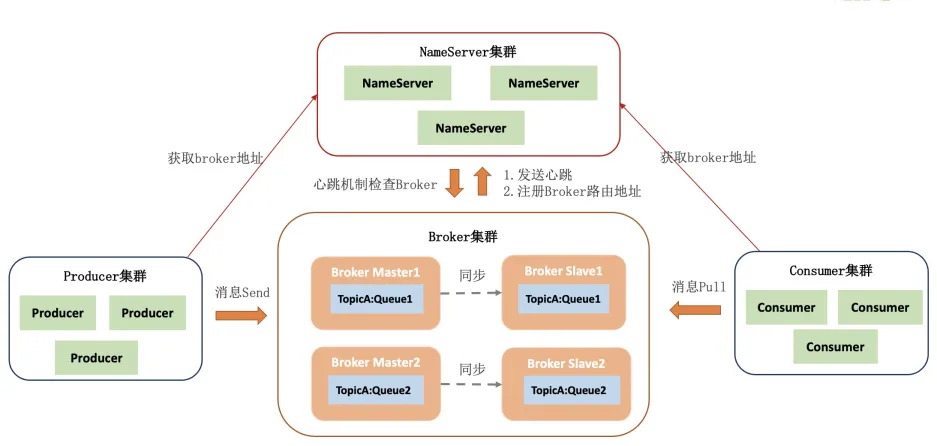  

**生产者：** 消息的发送方，负责将消息发送到RocketMQ的Broker（消息存储服务器）。生产者一般会将消息发送到指定的Topic。  
**Topic：** 是消息的逻辑分类，用于区分不同类型的消息。生产者将消息发送到特定的Topic，消费者从Topic中订阅消息。  
**消息队列：** 消息存储和传输的基本单位。也是Topic的分区，每个Topic可以被分成多个消息队列，使得消息可以并行处理，提高了系统的吞吐量。  
**消费者：** 消息的接收方，消费者从指定的Topic中订阅消息，负责从Broker中拉取消息并进行消费处理。  
**生产者组：** 同一类生产者的集合，这些生产者共同向同一个Topic发送消息。生产者组的存在主要是为了在事务消息中实现事务的最终一致性。  
**消费者组：** 一组消费者的集合，这些消费者共同消费同一个Topic的消息。消费者组中的消费者可以并行消费消息，一个Topic类型的消息只会被消费者组中的一个消费者消费，不过可以被多个消费者组消费。  
**NameServer：** RocketMQ自己实现的轻量级服务发现与路由中心，类似于分布式系统中的“注册中心”，早期使用的也是Zookeeper。它不存储消息本身，而是负责管理Broker的元数据（如Broker地址、Topic路由信息等），并为生产者和消费者提供Topic路由查询服务。  
**Broker：** 是 RocketMQ 的核心组件，负责消息的存储、传输和管理。生产者的消息最终会发送到 Broker，消费者从Broker拉取消息进行消费。Broker支持集群模式，各集群节点中存放着相同Topic的不同Queue。集群中包括Master和Slave节点，Master负责响应客户端请求（生产者发送消息、消费者拉取消息等），Slave负责同步Master消息。  

## 注册发现
**流程** 
- Broker启动时会向所有NameServer注册自己的信息（如IP、端口、Topic配置等），NameServer记录Broker列表。
- Broker定期（默认30秒）向NameServer发送心跳，表明自己存活，NameServer更新Broker最新存活时间。若NameServer检测（每隔10秒）到Broker心跳超时（默认120秒），则认为该Broker不可用，将Broker从列表中剔除。
- 客户端定期（默认30s）向NameServer拉取最新的路由信息

**路由信息**
- clusterAddrTable：Broker集群信息，存储集群中所有Broker名称
- brokerAddrTable：Broker基础信息，包括brokerName、所属集群名称、主备Broker地址
- brokerLiveTable：Broker状态信息，NameServer每次收到心跳包是会替换该信息
- topicQueueTable：Topic消息队列路由信息，消息发送时根据路由表进行负载均衡
- topicQueueMappingInfoTable：Topic队列详细信息，Topic下队列在Broker上的分布

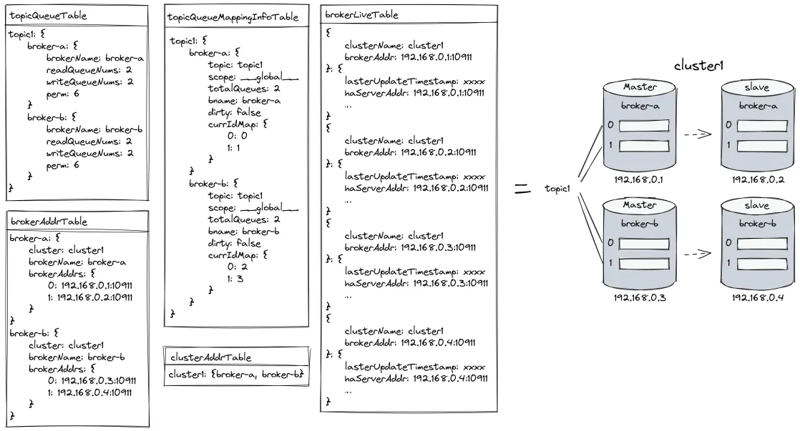  

## 消息发送
**1. 流程**
- 获取本地Topic路由信息，如果不存在时向NameServer获取并更新本地路由信息
- 根据负载均衡算法从Topic下选出发送的队列
- 向选出的队列所在的Broker发起请求

**2. 发送方式**
**同步发送：** 生产者发送消息后，阻塞等待Broker返回发送结果，确保消息可靠到达Broker。适用于对消息可靠性要求高、需实时确认的场景。存在重试机制。
- 当出现RemotingException、MQClientException和部分MQBrokerException时会重投。默认重试2次，重试时不会选择上次失败的broker，尝试向其他broker发送
- 如果响应结果不是`SendStatus.SEND_OK`，可以将`retryAnotherBrokerWhenNotStoreOK`配置为true开启重试，默认为false

```java
@Component
public class SyncProducer {
    @Autowired
    private RocketMQTemplate rocketMQTemplate;

    public void sendSyncMessage(String topic, String message) {
        // 同步发送消息，返回 SendResult 对象
        SendResult sendResult = rocketMQTemplate.syncSend(topic, message);
        System.out.println("同步发送结果: " + sendResult.getSendStatus());
    }
}
```
**异步发送：** 生产者发送消息后不阻塞，通过回调函数异步处理发送结果。适用于高吞吐场景，允许短暂延迟。存在重试机制。
- 发送异常会发起重试，默认重试2次，重试时不会选择其他broker，仅在同一个broker上做重试  
```java
@Component
public class AsyncProducer {
    @Autowired
    private RocketMQTemplate rocketMQTemplate;

    public void sendAsyncMessage(String topic, String message) {
        rocketMQTemplate.asyncSend(topic, message, new SendCallback() {
            @Override
            public void onSuccess(SendResult sendResult) {
                System.out.println("异步发送成功: " + sendResult.getMsgId());
            }

            @Override
            public void onException(Throwable throwable) {
                System.err.println("异步发送失败: " + throwable.getMessage());
            }
        });
    }
}
```
**单向发送：** 生产者仅发送消息，不等待Broker响应，也不处理回调。适用于对可靠性要求低、追求极致性能的场景。没有重试机制。
```java
@Component
public class OnewayProducer {
    @Autowired
    private RocketMQTemplate rocketMQTemplate;

    public void sendOnewayMessage(String topic, String message) {
        rocketMQTemplate.sendOneWay(topic, message);
        System.out.println("单向消息已发送（不保证到达）");
    }
}
```
**3. 负载均衡**  
RocketMQ默认采用轮询算法选择投递消息的队列，生产者依次将消息发送到Topic下的所有消息队列，按顺序轮询分配。例如：Topic有6个队列，消息将依次发送到每个队列。如果发送消息结果不成功或异常，发起重试时会规避上一次发送队列所在Broker下的队列。  

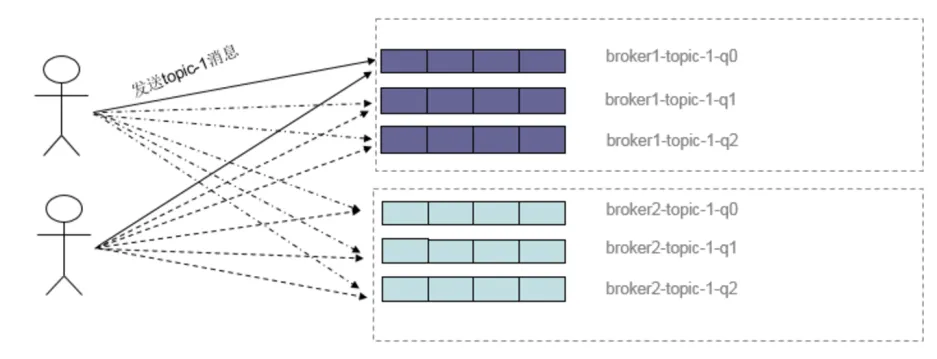  
RocketMQ允许自定义消息队列的选择逻辑，通过实现MessageQueueSelector接口实现灵活选择。  
```java
rocketMQTemplate.setMessageQueueSelector(new MessageQueueSelector() {
    /**
     * @param list Topic下所有可用的消息队列列表
     * @param msg  消息对象
     * @param key  分片键
     */
    @Override
    public MessageQueue select(List<MessageQueue> list, Message msg, Object key) {
        int index = Math.abs(key.hashCode()) % list.size();
        return list.get(index);
    }
});

rocketMQTemplate.syncSendOrderly("test-topic", "message", "key");
```

**4. 批量消息** 
将多条消息合并为一个批次，一次性发送到Broker，减少网络交互次数。确保单批次消息总大小不超过maxMessageSize（默认4MB），否则会抛异常。  
```java
// 构建批量消息列表
List<String> messages = new ArrayList<>();
messages.add("Message1");
messages.add("Message2");

// 发送批量消息
SendResult result = rocketMQTemplate.syncSend("test-topic", messages);
System.out.println("批量发送结果: " + result.getSendStatus());
```

## 消息存储及日志格式
### 1. CommitLog
> 生产者发过来的所有消息，不管是属于哪个Topic，Broker都通过顺序写的方式统一存在CommitLog当中

- CommitLog由多个⽂件组成，每个⽂件固定⼤⼩1G，每次写CommitLog文件时，都会去检查当前CommitLog文件空间是否足够，如果不够的话，就重新创建一个CommitLog文件。以第⼀条消息的偏移量为文件名，例如第二个文件起始偏移量 1GB（1073741824 字节）  

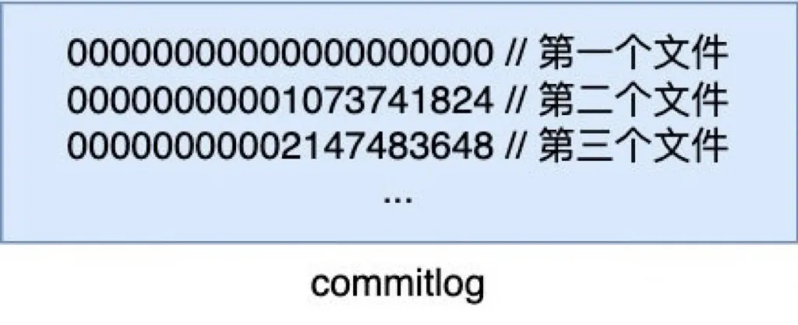  
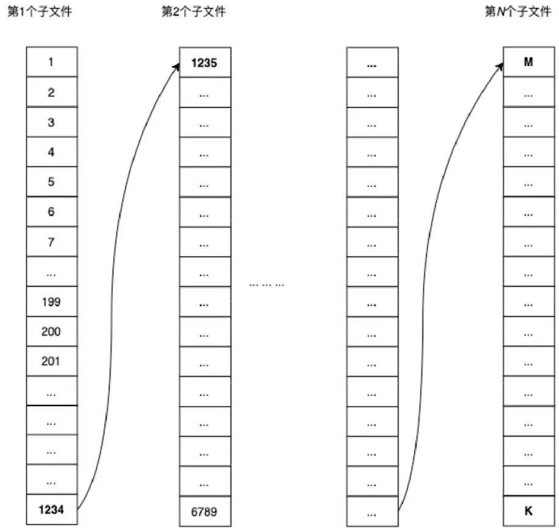  

- RocketMQ通过后台线程定期清理过期的CommitLog文件，默认保留最近3天的日志，释放磁盘空间。如果磁盘使用率超过阈值，默认75%，也会触发删除日志，按文件创建时间排序，强制删除最旧的 CommitLog文件，直至低于阈值
- 消息格式
  | **字段** | **长度（字节）** | **说明** |
  | :--- | :--- | :--- |
  | **<font style="color:rgb(64, 64, 64);">MsgLen</font>** | <font style="color:rgb(64, 64, 64);">4</font> | <font style="color:rgb(64, 64, 64);">消息总长度（包含本字段之后的所有内容）</font> |
  | <font style="color:rgb(64, 64, 64);">MagicCode</font> | <font style="color:rgb(64, 64, 64);">4</font> | <font style="color:rgb(64, 64, 64);">魔数（固定值 </font>`<font style="color:rgb(64, 64, 64);">0xAABBCCDD</font>`<font style="color:rgb(64, 64, 64);"> 或 </font>`<font style="color:rgb(64, 64, 64);">0xBBCCDDEE</font>`<font style="color:rgb(64, 64, 64);">，用于标识协议版本）</font> |
  | <font style="color:rgb(64, 64, 64);">BodyCRC</font> | <font style="color:rgb(64, 64, 64);">4</font> | <font style="color:rgb(64, 64, 64);">消息体 CRC 校验码</font> |
  | **<font style="color:rgb(64, 64, 64);">QueueId</font>** | <font style="color:rgb(64, 64, 64);">4</font> | <font style="color:rgb(64, 64, 64);">消息所属的队列 ID</font> |
  | <font style="color:rgb(64, 64, 64);">Flag</font> | <font style="color:rgb(64, 64, 64);">4</font> | <font style="color:rgb(64, 64, 64);">消息标记（如压缩、事务等）</font> |
  | **<font style="color:rgb(64, 64, 64);">QueueOffset</font>** | <font style="color:rgb(64, 64, 64);">8</font> | <font style="color:rgb(64, 64, 64);">在 ConsumeQueue 中的逻辑偏移量</font> |
  | **<font style="color:rgb(64, 64, 64);">PhysicalOffset</font>** | <font style="color:rgb(64, 64, 64);">8</font> | <font style="color:rgb(64, 64, 64);">消息在 CommitLog 中的物理偏移量</font> |
  | <font style="color:rgb(64, 64, 64);">SysFlag</font> | <font style="color:rgb(64, 64, 64);">4</font> | <font style="color:rgb(64, 64, 64);">系统标记（如是否压缩、是否为批量消息等）</font> |
  | <font style="color:rgb(64, 64, 64);">BornTimestamp</font> | <font style="color:rgb(64, 64, 64);">8</font> | <font style="color:rgb(64, 64, 64);">消息生成时间戳</font> |
  | <font style="color:rgb(64, 64, 64);">BornHost</font> | <font style="color:rgb(64, 64, 64);">8</font> | <font style="color:rgb(64, 64, 64);">生产者地址（IP + 端口）</font> |
  | <font style="color:rgb(64, 64, 64);">StoreTimestamp</font> | <font style="color:rgb(64, 64, 64);">8</font> | <font style="color:rgb(64, 64, 64);">消息存储时间戳</font> |
  | <font style="color:rgb(64, 64, 64);">StoreHost</font> | <font style="color:rgb(64, 64, 64);">8</font> | <font style="color:rgb(64, 64, 64);">Broker 地址（IP + 端口）</font> |
  | <font style="color:rgb(64, 64, 64);">ReconsumeTimes</font> | <font style="color:rgb(64, 64, 64);">4</font> | <font style="color:rgb(64, 64, 64);">消息重试次数（消费者消费失败后重新投递的次数）</font> |
  | <font style="color:rgb(64, 64, 64);">PreparedTransactionOffset</font> | <font style="color:rgb(64, 64, 64);">8</font> | <font style="color:rgb(64, 64, 64);">事务消息的 Prepared 阶段偏移量</font> |
  | **<font style="color:rgb(64, 64, 64);">BodyLength</font>** | <font style="color:rgb(64, 64, 64);">4</font> | <font style="color:rgb(64, 64, 64);">消息体长度</font> |
  | **<font style="color:rgb(64, 64, 64);">Body</font>** | <font style="color:rgb(64, 64, 64);">变长</font> | <font style="color:rgb(64, 64, 64);">消息体内容</font> |
  | **<font style="color:rgb(64, 64, 64);">TopicLength</font>** | <font style="color:rgb(64, 64, 64);">1</font> | <font style="color:rgb(64, 64, 64);">Topic 名称长度</font> |
  | **<font style="color:rgb(64, 64, 64);">Topic</font>** | <font style="color:rgb(64, 64, 64);">变长</font> | <font style="color:rgb(64, 64, 64);">Topic 名称</font> |
  | <font style="color:rgb(64, 64, 64);">PropertiesLength</font> | <font style="color:rgb(64, 64, 64);">2</font> | <font style="color:rgb(64, 64, 64);">属性键值对的长度</font> |
  | <font style="color:rgb(64, 64, 64);">Properties</font> | <font style="color:rgb(64, 64, 64);">变长</font> | <font style="color:rgb(64, 64, 64);">自定义属性（如 Tag、Keys 等）</font> |

### 2. ConsumerQueue
> RocketMQ在消息存储的时候将消息顺序写入CommitLog文件，如果想根据Topic对消息进行查找，需要扫描所有CommitLog文件，这种方式性能低下，所以RocketMQ又设计了ConsumeQueue，按Topic和Queue纬度保存消息在CommitLog中的偏移量。消息写入CommitLog以后，通过顺序写构建对应的ConsumeQueue文件。

- 在RocketMQ的存储文件目录下，有一个consumequeue文件夹，里面按Topic分组，每个Topic一个文件夹，Topic文件夹内是该Topic的所有消息队列，以消息队列ID命名文件夹，每个消息队列都有自己对应的ConsumeQueue文件
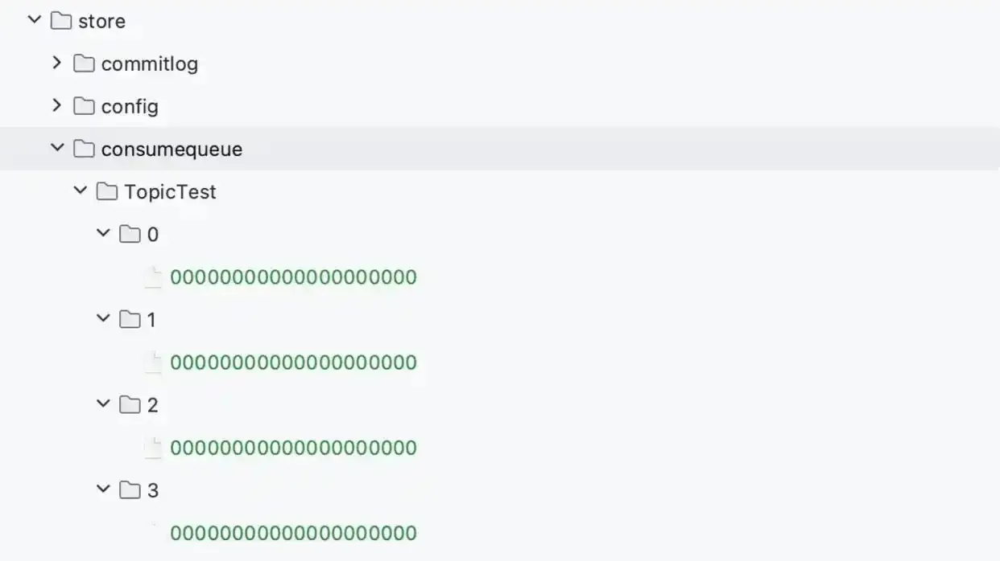  

- 文件名由起始逻辑偏移量命名，每个文件固定大小为600w字节，包含30w个索引（每个索引固定20字节），如果文件写满了，会创建新的文件继续写入
- ConsumeQueue文件仅存储消息在 CommitLog中的位置，不存储消息内容
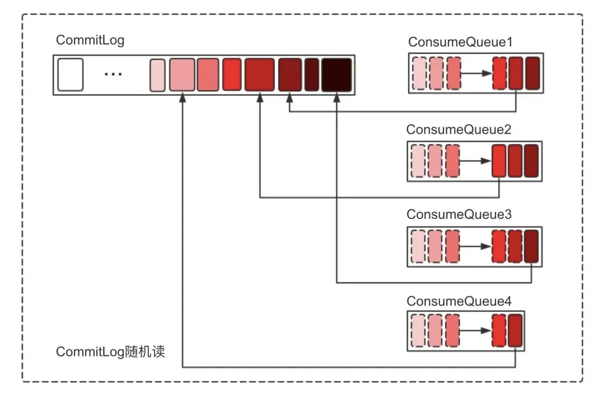

- 索引格式

| **字段** | **长度（字节）** | **说明** |
| --- | --- | --- |
| offset | 8 | 消息在CommitLog中的物理偏移量 |
| size | 4 | 消息总长度(即CommitLog中该消息的MsgLen) |
| tagsCode | 8 | 消息Tag的哈希值(用于Tag过滤) |

### 3. IndexFile
> 除了通过指定Topic进行消息消费外，RocketMQ还提供了根据key进行消息查询的功能。IndexFile就是用于加速通过key查询消息的索引文件。

- IndexFile按创建时间戳命名，默认每个文件的大小固定为400MB，当文件写满2000w个index后会创建新文件继续写入
- IndexFile的文件结构分为三部分：Header（头部）、Slot Table（哈希槽）和Index Linked List（索引条目）
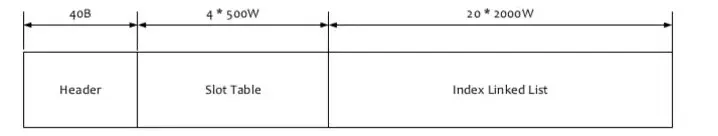
- Header：存储索引文件的元信息

| **字段** | **长度（字节）** | **说明** |
| --- | --- | --- |
| beginTimestamp | 8 | 当前indexFile文件中第一条消息的存储时间 |
| endTimestamp | 8 | 当前indexFile文件中最后一条消息存储时间 |
| beginPhyoffset | 8 | 当前indexFile文件中第一条消息在Commitlog中的偏移量 |
| endPhyoffset | 8 | 当前indexFile文件中最后一条消息在CommitLog中的偏移量 |
| hashSlotCount | 4 | 已经使用的hash槽的个数 |
| indexCount | 4 | 索引项中记录的所有消息索引总数 |

- Slot Table、Index Linked List：维护key与消息在CommitLog中物理偏移量的哈希索引

- Index节点

| **字段** | **长度（字节）** | **说明** |
| --- | --- | --- |
| keyHash | 4 | 消息Key的哈希值（用于通过对Slot Table总数取模得到Slot位置） |
| phyOffset | 8 | 消息在CommitLog中的物理偏移量 |
| timeDiff | 4 | 消息存储时间与IndexFile起始时间的差值（单位：秒） |
| nextIndexNo | 4 | 同一哈希槽下一个索引的位置（用于解决哈希冲突） |

**写入索引：**  
计算消息Key的哈希值，用哈希值 % 500w得到对应的Slot位置  
构建Index节点（设置消息物理偏移量、时间戳差，将index节点的nextIndexNo设置为当前Slot位置的值）  
计算新index在链表中的绝对偏移量（40+5000000*4+indexCount*20）并写入  
更新Slot的值指向新index的逻辑下标  
**查询索引：**
查询的传入值除了key外，还包含一个时间起始值以及截止值，仅仅一个key是无法定位到具体的indexFile，时间范围就为了更精确的定位到具体的indexFile，缩小查找的范围，indexFile文件名是一个时间戳，根据这个日期就可以定位到传入的日期范围对应在哪个或者哪些indexFile中    
计算消息Key的哈希值，用哈希值 % 500w得到对应的Slot位置  
读取Slot位置的值，找到index头节点，遍历整个链表，匹配符合时间范围以及Key相等的index，从而得到消息物理偏移量。从CommitLog中获得完整消息  

### 4. consumerOffset.json
消费者拉取数据时，需要知道从哪个进度开始拉取。在RocketMQ集群消息模式下，会基于每个消费者组维护一份消费记录，该记录指定消费者组消费某一个队列时，消费过的最新一条消息的位点，即消费位点。以便消费者继续从上次消费的位置开始。  
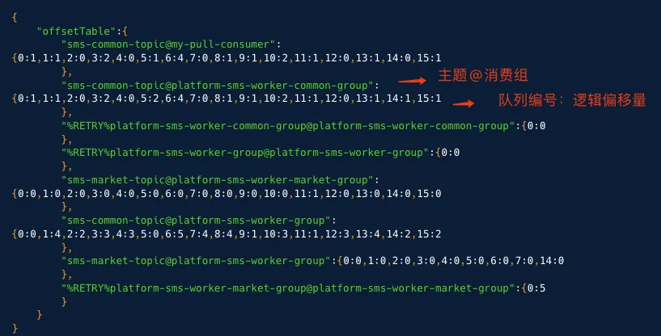  
如果是广播消息模式，则每个消费者实例需要在本地独立记录自己消费的进度offsets.json，格式与consumerOffset.json类似，因为消息会被组内的所有消费者实例消费，RocketMQ不会在Broker端统一管理消费位移。  

## 消息消费
**1. 拉取方式**   
**Pull模式：**  
消费者通过轮询方式主动向Broker发送请求，查询是否有新消息。实时性低，消息到达后可能无法及时消费，依赖轮询间隔，但是频繁拉取会给服务端造成压力。对消费者友好，可以根据自身处理能力拉取消息，避免客户端过载。  
**Push模式：**  
消费者与Broker之间建立长连接，消费者注册监听器，Broker在消息到达后主动推送给消费者。实时性高，消息到达后立即推送，减少延迟。但是突发流量可能导致消费者过载。  
**Long Polling模式：**  
RocketMQ的Push模式并非真正的服务端主动推送消息，而是Pull模式。通过长轮询机制对传统的Pull模式进行优化，模拟实时推送的效果。这种设计既保证了消息的实时性，又减少了无效的网络请求开销。  
> 传统Pull模式存在的缺陷：消费者频繁轮询Broker会导致大量无消息时的空响应，增加网络和CPU资源消耗。

长轮询过程如下：
- 消费者向Broker发送Pull请求，Broker如果有新的消息立即返回消息列表，消费者处理消息。如果没有消息，Broker将请求挂起并记录起来
- 后续如果有新消息到达Broker时，检查是否有挂起的请求指向该新消息所在队列，如果有则立即唤醒挂起的请求，将新消息返回给消费者
- 如果一直没有新消息到来，Broker会在超时15秒后返回空响应，消费者重新发起Pull请求，重复上述流程
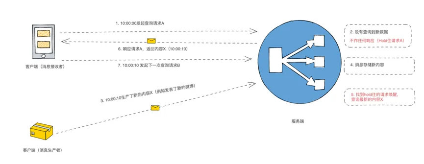

**2. 消费模式**   
**集群消息：** 同一消费者组下的多个消费者消费指定Topic中的消息时，RocketMQ会将多条消息投递给不同的消费者处理，同一条消息只会被消费者组中的一个消费者消费到。
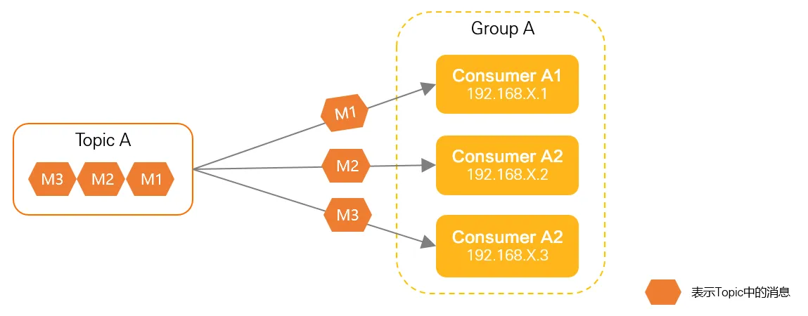

**广播消息：** 同一消费者组下的多个消费者消费指定Topic中的消息时，RocketMQ会将每条消息都投递给集群内所有的消费者，保证每条消息至少被每个消费者消费一次。
可用于本地配置、缓存同步等。例如：当我们的服务为了提升性能，增加了本地缓存后，当数据发生更新时，为了保证数据一致性，需要同步更新本地缓存，就可以通过广播消息通知到每个服务实例进行本地缓存更新。
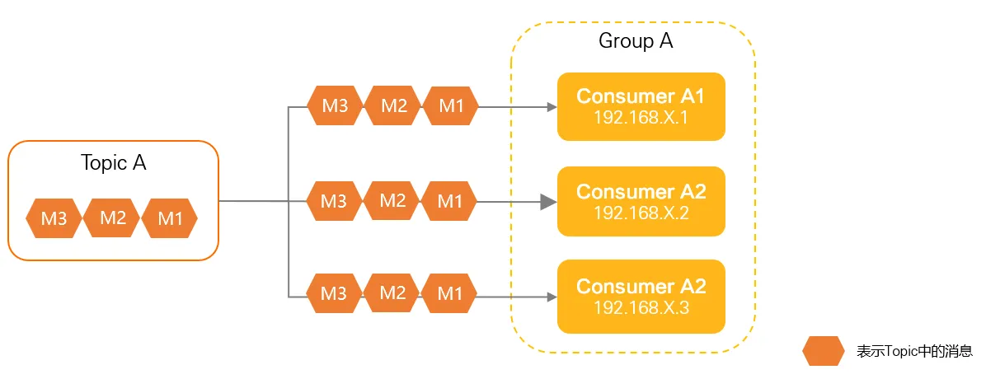

**3. 负载均衡**   
集群模式下，同一消费者组内多个消费者实例根据负载均衡策略决定如何分配Topic的消息队列，以实现消息的高效并行处理。广播模式每一条消息都会投递给订阅了Topic的所有消费者实例，所有消费者都分到所有的队列，并不存在负载均衡。
- 平均分配（AllocateMessageQueueAveragely）：RocketMQ默认的负载均衡策略，将Topic的所有队列均匀分配给消费者组内的所有实例，即用队列的数量除以消费者的数量，若队列数无法整除消费者数，多余的队列按顺序分配给前几个消费者
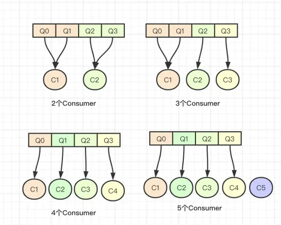
- 循环分配（AllocateMessageQueueAveragelyByCircle）：按消费者实例的顺序 循环分配 队列，直到所有队列分配完毕。
  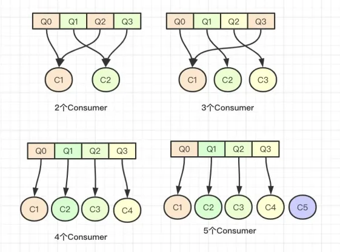
- 一致性哈希分配（AllocateMessageQueueConsistentHash）：使用 虚拟节点一致性哈希算法，将队列映射到消费者实例。将消费者的hash值作为Node节点存放到hash环上，然后将队列的hash值也放到hash环上，通过顺时针方向，距离最近的那个消费者就是该队列要分配的消费者。
  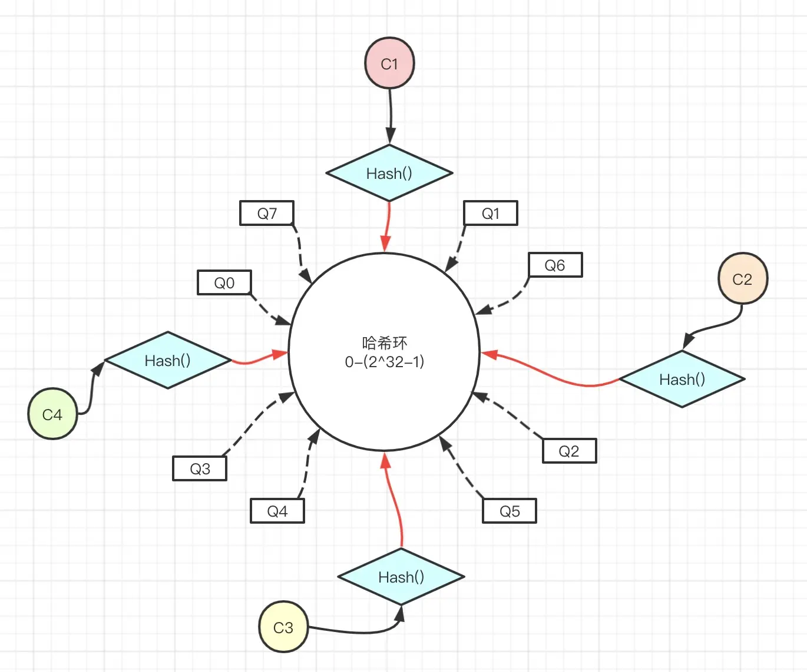
- 机房就近分配（AllocateMessageQueueByMachineRoom/AllocateMachineRoomNearby）：优先将队列分配给与消费者同机房的 Broker，减少跨机房网络延迟。AllocateMachineRoomNearby是AllocateMessageQueueByMachineRoom策略的升级版本，针对同机房只有队列却没有消费者的情况根据用户给定的第二个策略对剩下的队列进行分配
  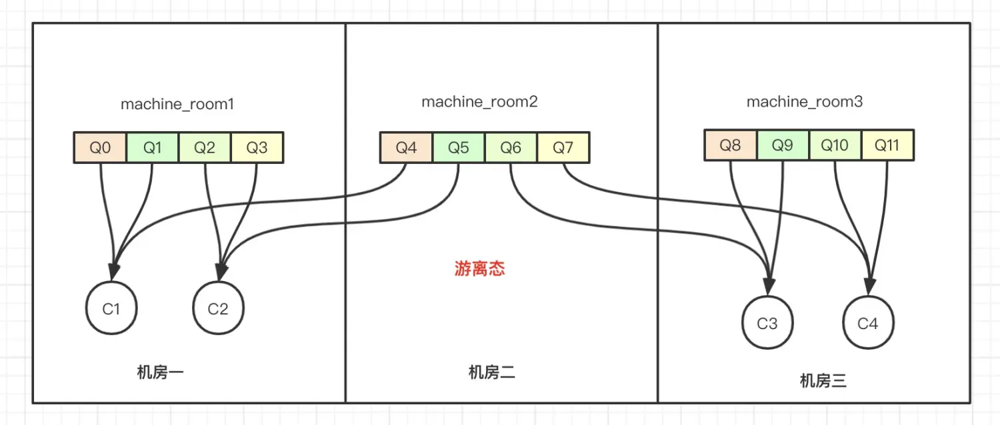
- 配置固定分配（AllocateMessageQueueByConfig）：通过配置文件手动指定消费者实例与队列的绑定关系

**4. 再平衡**   
当消费者实例变化（例如增加消费者实例、消费者宕机或主动关闭下线）或Topic队列数量变化时，需要重新调整消费者组中消息队列的分配，用于确保消费者实例能够合理分摊消息消费任务。
**触发时机：**  
- 消费者启动或恢复时，会触发重平衡，并上报心跳让Broker感知到新消费者启动，发送Reblance通知让其它消费者进行重平衡。
- 消费者下线时，向Broker发请求，或消费者宕机时Broker监测不到心跳。Broker收到后发送Reblance通知让其他消费者进行重平衡。
- 消费者每隔20秒会触发一次重平衡。  

**过程：**  
消费者将获取Topic的队列列表和消费者组内的活跃实例列表，重新根据负载均衡策略将队列分配给当前消费者实例，消费者向Broker发送请求，尝试锁定分配到的队列。  
- 一致性哈希分配策略可以减少在重平衡过程中重新分配的队列，最小化迁移带来的影响。


## 消息刷盘
当写入一个文件时，操作系统默认将数据先写到缓存（页缓存PageCache）中，RocketMQ利用此机制提升写入速度。但是内存中的数据是不安全的，如果系统崩溃或断电就会造成数据丢失，需要通过刷盘将内存中的消息数据持久化到磁盘。在Linux中可以通过调用fsync系统调用实现把页缓存刷新到磁盘上。RocketMQ通过不同的刷盘策略来管理这一过程，直接影响消息的可靠性和吞吐量。  
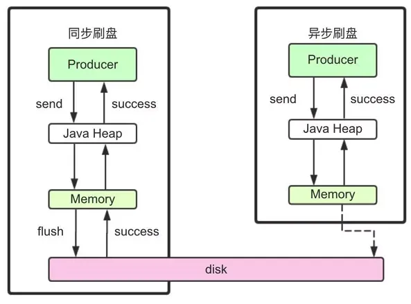  
**同步刷盘**  
消息被真正持久化到磁盘才会响应ACK，可靠性非常高，但是性能会受到较大影响，适用于金融业务。  
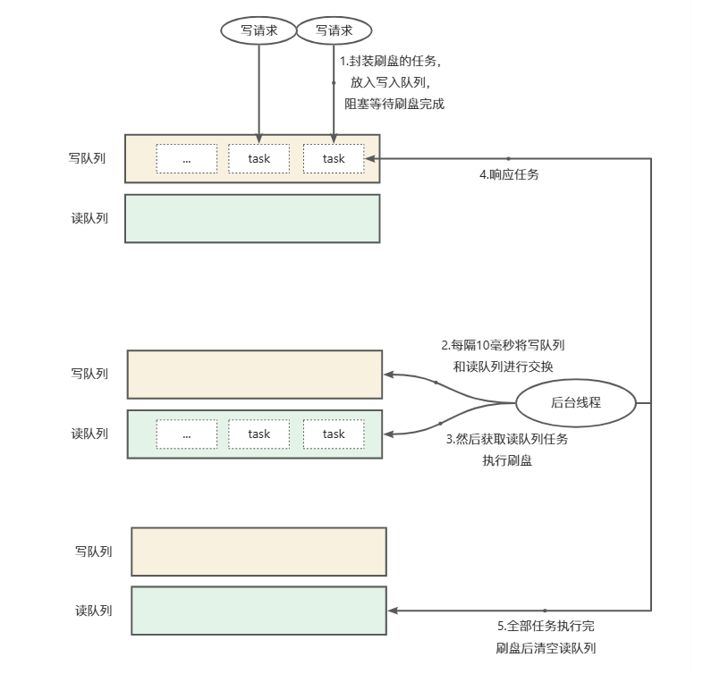  
- 消息在写入PageCahce后，开始触发刷盘，封装刷盘任务（CompletableFuture）并放到写队列中，并通过get阻塞等待任务结果
- 后台线程每隔10毫秒将读写队列进行交换，在10毫秒的间隔期间，写队列照常接收任务
- 读写队列交换后接着取出读队列中的任务，执行刷盘，刷盘完成后，通过complete响应结果，Broker最终响应生产者

**异步刷盘**  
消息写入PageCache就会响应ACK，然后由后台线程异步将PageCache里的内容持久化到磁盘，降低了读写延迟，提高了性能和吞吐量。服务宕机消息不丢失，机器断电少量消息丢失。
- 写入PageCache后会唤醒后台线程，Broker返回响应。后台线程默认每隔500ms会进行刷盘
- 如果用户开启了堆外内存，则消息会写入到堆外内存而不是PageCache，写入后会唤醒后台线程，Broker返回响应。后台线程每隔200ms将堆外内存写到PageCache，再唤醒前面的后台线程每隔500ms进行刷盘


## 顺序消息
消息按照生产者发送的顺序被消费者逐条消费。在某些业务场景中至关重要，例如订单状态变更：创建订单 → 支付订单 → 完成订单，必须按序处理。若消息乱序消费，可能导致数据不一致或逻辑错误。  
生产者将同一业务标识（如订单ID）的消息发送到同一个队列。使用同步发送模式而非异步发送，异步发送可能导致消息乱序。  
```java
@Autowired
private RocketMQTemplate rocketMQTemplate;

/**
 * 发送顺序消息
 * @param topic     主题
 * @param message   消息内容
 * @param orderId   业务标识（如订单ID）
 */
public void sendOrderlyMessage(String topic, String message, String orderId) {
    // 发送顺序消息（使用订单ID选择队列）
    rocketMQTemplate.syncSendOrderly(topic, message, orderId);
}

/**
 * 发送顺序消息，使用自定义的队列选择算法
 * @param topic     主题
 * @param message   消息内容
 * @param orderId   业务标识（如订单ID）
 */
public void sendWithCustomSelector(String topic, String message, String orderId) {
    // 发送顺序消息（使用自定义算法选择队列）
    rocketMQTemplate.setMessageQueueSelector(new MessageQueueSelector() {
        /**
         * @param mqs Topic下所有可用的消息队列列表
         * @param msg 消息对象
         * @param shardingKey 业务分片键
         */
        @Override
        public MessageQueue select(List<MessageQueue> mqs, Message msg, Object shardingKey) {
            int index = Math.abs(shardingKey.hashCode()) % mqs.size();
            return mqs.get(index);
        }
    });
    rocketMQTemplate.syncSendOrderly(topic, message, orderId);
}
```
消费者指定顺序消费模式，对每个队列启动一个线程顺序拉取消息，确保队列内消息按序处理。消息处理过程中关键步骤禁止异步处理，非关键步骤将可异步化并行处理，减少单条消息处理时间。
```java
@Component
@RocketMQMessageListener(
    topic = "OrderTopic",
    consumerGroup = "orderGroup",
    consumeMode = ConsumeMode.ORDERLY  // 指定顺序消费模式
)
public class OrderConsumerService implements RocketMQListener<String> {
    @Override
    public void onMessage(String message) {
        System.out.println("收到顺序消息: " + message);
    }
}
```
消费者如果消费失败，会发起重试，默认的重试会将消息投递到重试队列进行重试，有可能会导致消费队列和重试队列并行处理导致顺序错乱，可以通过返回ConsumeOrderlyStatus.SUSPEND_CURRENT_QUEUE_A_MOMENT状态，会暂停当前队列的消费（不拉取新消息），等一会（SuspendCurrentQueueTimeMillis），再继续处理消息，而不是放到重试队列里。  
顺序消息的局限性：单队列单线程消费可能限制吞吐量，需通过增加队列数提升并发。若某条消息处理耗时过长，会阻塞后续消息消费，需优化业务逻辑。  


## 延迟消息
延时消息为 Apache RocketMQ 中的高级特性消息，服务端根据消息设置的定时时间在某一固定时刻将消息投递给消费者消费。  
**4.x版本**  
提供18个预设的延迟级别（1s、5s、10s、30s、1m、2m、3m、4m、5m、6m、7m、8m、9m、10m、20m、30m、1h、2h），用户只能选择这些预定义的时间段。  
延迟消息发送后，Broker会将消息原始的目标信息保存到属性中，并将消息存储到内部Topic（`SCHEDULE_TOPIC_XXXX`），这个Topic下有18个队列，每个延迟级别对应一个队列。并计算出投递时间当做消息Tag的哈希值存储到CosumeQueue。此时消费者消费不到延迟消息。  
Broker有一个定时任务每隔1秒执行一次，按延迟级别轮询SCHEDULE_TOPIC_XXXX下的所有队列，将到期的消息转移到目标Topic的队列中。  
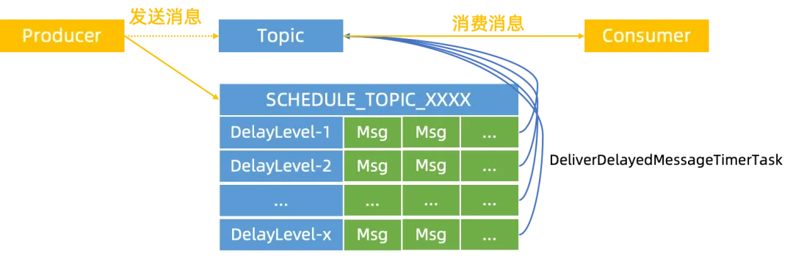  
**5.x版本**  
支持精确到毫秒的任意延迟时间，突破固定级别的限制。基于时间轮算法实现  
时间轮：时间轮算法的设计思想就来源于钟表。如下图所示，时间轮可以理解为一种环形结构，像钟表一样被分为多个slot槽位。每个slot代表一个时间段，每个slot中可以存放多个任务，使用的是链表结构保存该时间段到期的所有任务。时间轮通过一个时针随着时间一个个slot转动，并执行 slot 中的所有到期任务。  
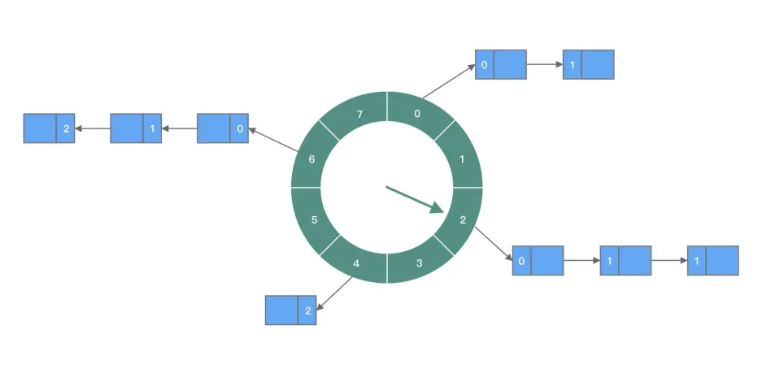  
Rocketmq实现：  
用TimerWheel类来封装时间轮，TimerWheel由若干个刻度Slot组成，一个刻度就代表一个时间单位，默认一个Slot代表一秒。  
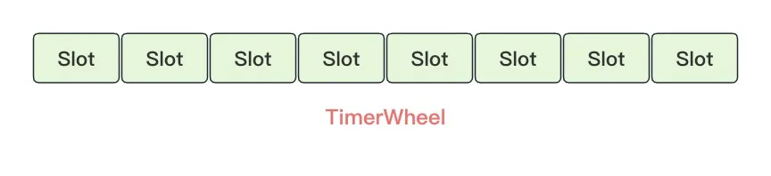  
Slot的格式如下，其中通过firstPos和lastPos维护该刻度下的所有延迟消息。  

| **字段** | **长度（字节）** | **说明** |
| --- | --- | --- |
| timeMs | 8 | 延迟时间 |
| firstPos | 8 | 第一个消息的位置 |
| lastPos | 8 | 最后一个消息的位置 |
| num | 4 | 消息数量 |
| magic | 4 | 魔数（废弃） |

所有的延迟消息统一放到TimerLog文件里，并通过prev pos指针将属于同一个刻度下的延迟消息串联起来  
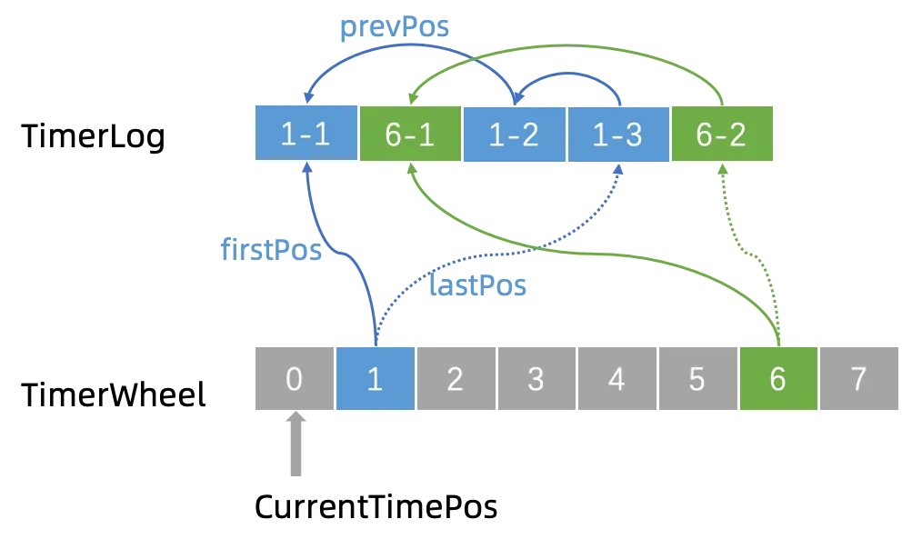  
如果1号Slot上再添加一条延时消息1-4，需要先把1-4写入 timerlog，1-4的 prevPos 指针会指向1-3串联成链表，再把 Slot -> lastPos指向1-4。
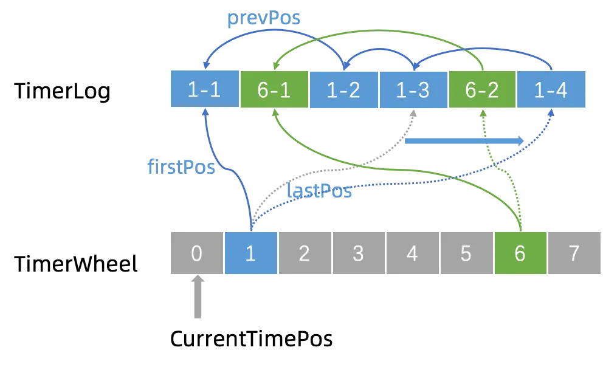

TimerLog格式：  
| **字段** | **长度（字节）** | **** |
| --- | --- | --- |
| size | 4 | 当前条目总大小（固定为 `TimerLog.UNIT_SIZE`<br/>，如32字节）。 |
| prevPos | 8 | 同一槽位中前一个条目的物理偏移（链表指针）。 |
| magic | 4 | 控制标记（如 `MAGIC_DELETE`<br/> 标记消息删除，`MAGIC_ROLL`<br/> 标记时间轮滚动）。 |
| currWriteTimeMs | 8 | 当前时间轮的基准时间（写入时间戳，单位毫秒）。 |
| delayTimeMs | 4 | 消息的延迟时间差（相对于 `currWriteTimeMs`<br/>，单位毫秒）。 |


## 事务消息
事务消息适用于对数据最终一致性有需求的场景。不会因为某一个关联应用的不可用导致整体回滚，从而最大限度保证核心系统的可用性。在极端情况下，如果关联的某一个应用始终无法处理成功，也只需对当前应用进行补偿或数据订正处理，而无需对整体业务进行回滚。  
**执行流程：**  
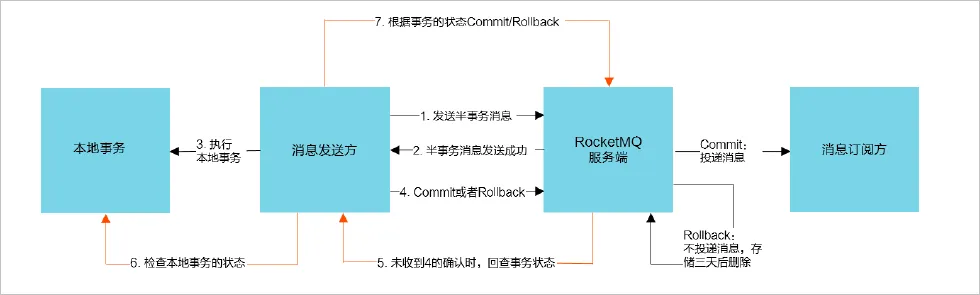  
- 事务消息发送步骤如下：  
a. 发送方将半事务消息发送至RocketMQ服务端。  
b. 服务端将消息持久化成功之后，向发送方返回ACK确认消息已经发送成功，此时消息为半事务消息。  
c. 发送方开始执行本地事务逻辑。  
d. 发送方根据本地事务执行结果向服务端提交二次确认（Commit或是Rollback），服务端收到Commit状态则将半事务消息标记为可投递，订阅方最终将收到该消息；服务端收到Rollback状态则删除半事务消息，订阅方将不会接受该消息。  
- 事务消息回查步骤如下：  
a. 在断网或者是应用重启的特殊情况下，上述发送步骤的步骤4提交的二次确认最终未到达服务端，经过固定时间后服务端将对该消息发起消息回查。  
b. 发送方收到消息回查后，需要检查对应消息的本地事务执行的最终结果。  
c. 发送方根据检查得到的本地事务的最终状态再次提交二次确认，服务端仍按照发送步骤的步骤4对半事务消息进行操作。    

**本地事务的状态：**  
- 事务提交：LocalTransactionState.COMMIT_MESSAGE
- 事务回滚：LocalTransactionState.ROLLBACK_MESSAGE
- 事务未决：LocalTransactionState.UNKNOW  
**生产组：**  
Broker 发起事务回查时，会根据消息中的生产者组名，找到注册到该组的任一存活生产者实例（负载均衡）。同一生产者组可部署多个生产者实例，若某个实例宕机，Broker 会自动将回查请求路由到其他存活实例。  
不同业务的事务生产者应使用不同的组名，防止回查路由混乱。

## 消息丢失
一条消息从发送到成功消费，需要经过生产者发送、服务端接收、持久化、消费者消费，中间会跨进程、网络进行传输，每个阶段都会出现消息丢失的风险  
**生产者：** 发送消息的过程中，出现网络中断、Broker宕机，如果生产者没有处理好异常应答或未开启重试，就会出现消息未到达Broker即丢失  
**Broker服务端：** Broker消息持久化时会先写到PageCache中，再根据不同的刷盘策略写入硬盘。如果是异步刷盘，消息在异步刷盘前机器宕机了，那么消息就会丢失。如果是同步消息，理论上机器宕机时只会丢失10ms内的消息，但是工程实践中这种极端情况的概率几乎为0  
**消费者：** 
如果消费者处理消息的逻辑采用异步，异常情况下会出现消息异步处理失败了，但Offset已提交，看似消息丢失的情况  
**保证消息不丢失的解决方案：**  
- 使用同步发送消息
- 使用同步刷盘
- 消费者成功处理业务逻辑后再响应服务端  


## 消息积压
**消息积压产生的原因**  
生产消费速率失衡：营销活动、突发流量等场景导致消息量陡增；消费能力不足，消费者逻辑复杂（如DB操作、外部API调用引起的IO阻塞）、单线程消费模型。  
消费端异常：消费者CPU过载、内存泄漏、数据库连接池耗尽等；下游服务不可用导致消息堆积。  
消息分发不均：发送消息时指定了特定业务Key导致消息集中到少数队列；Topic分配的队列数过小，限制了吞吐量。  
**消息积压产生的解决方案**  
水平扩展消费能力：增加消费者实例、扩容队列数，如果是消费者数量与队列数量相等时，再增加消费者数量则没有意义。  
优化消费逻辑：将耗时操作异步化；批量处理优化，合并DB操作，减少事务开销。  
消费者批量拉取消息：调整Pull参数提升吞吐。   
```properties
rocketmq.consumer.pull-batch-size=32
rocketmq.consumer.consume-thread-max=64
```
消费者批量消费消息：  
```java
@Component
@RocketMQMessageListener(
        topic = "OrderTopic",
        consumerGroup = "orderGroup"
)
public class OrderConsumerService implements RocketMQListener<List<MessageExt>> {
    @Override
    public void onMessage(List<MessageExt> message) {
    }
}
```
rocketmq5.x pop模式 及 kafka4.0共享组  
http://cnblogs.com/shanml/p/17726682.html  
https://rocketmq.apache.org/zh/docs/featureBehavior/08consumerloadbalance/#消息粒度负载均衡  

https://rocketmq.apache.org/zh/docs/4.x/bestPractice/01bestpractice#消费速度慢的处理方式  


## 消息幂等
在互联网应用中，消息可能因网络重传、消费者故障恢复、Broker重试等场景被多次投递。若业务逻辑无法正确处理重复消息，会出现数据不一致
- 生产者发送消息到服务端后由于网络抖动，未收到服务端成功应答，生产者若发起重试，则会出现消息重复发送
- 消费者消费消息完成后响应服务端，由于网络抖动或宕机，导致服务端未成功接收到应答，发起重试，则会出现消费者重复消费
- 当消费者或队列发生再平衡时，极端情况下有可能会出现消息重复消费
为了解决消息重复投递的问题，我们需要在业务上自行控制  
首先需要知道如何区分重复的消息，Broker会为每条消息生成唯一标识offsetMsgId，如果消息由生产者触发重试时，则offsetMsgId会重新生成，最终导致重复消息对消费者来说拿到的msgId不一样，区分不出是重复消息。所以建议基于业务key进行判断，例如订单id等。对重复的消息我们再做好幂等控制，例如CAS、锁保证数据同步安全  

https://rocketmq.apache.org/zh/docs/4.x/bestPractice/01bestpractice#消费过程幂等
