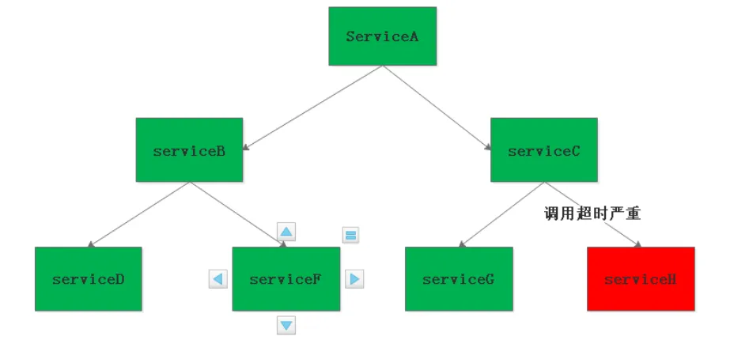

# SpringCloudGateway篇
## 网关是什么
对于我们做Java开发来说，最熟悉的网关莫过于zuul和SpringCloudGateway，这两个基本都是配合我们微服务体系使用，当我们引入微服务之后，我们需要考虑如果将请求正确的接入到它所对应的服务，我们会把网关一同注册到注册中心上，由网关作为请求的统一入口，**并通过服务发现功能转发到相应的服务**。所以我认为网关就是作为我们微服务的入口，也可以叫**微服务网关**。而我们对于业务上一些统一的逻辑处理一般都会抽取出来放到各个微服务的前面，基于微服务网关的扩展能力，我们也会**把这部分统一的业务功能集成到网关**上，所以微服务网关一般也承担了**业务网关**的作用。  
但是即便抛开微服务体系，我们的网关也是存在，比如我们熟知的Nginx，它是以**高性能**著称的，支持**高并发**，所以一般会作为我们全局，最外层的网关，这类网关也叫**流量网关**。  
通过上面我们对网关的认识，我们从中也能提炼出网关本身需要具备的一些核心能力，比如动态路由、负载均衡、可扩展、高并发、流量控制等。基于网关的可扩展性，我们又可以实现其它的自定义功能比如统一鉴权、限流、熔断、监控等等  
下面主要以SpringCloudGateway为主，讲解下在项目中是怎么运用上面提到的功能  

## 路由转发
网关最基本基本的功能之一就是负责将我们的请求转发到对应的服务上，而要实现这一功能就需要我们告诉网关具体的转发规则是怎么样的，所以接触网关最频繁的一件事就是在配置文件里给网关添加路由转发规则  
这里需要关注一下问题：路由转发规则添加后要支持实时更新，无需重启网关，否则会影响用户访问  
通常解决这个问题有两个办法：  

| 办法                                                                            | 原理                                                                       | 好处  |  坏处 |
|-------------------------------------------------------------------------------|--------------------------------------------------------------------------|---|---|
| 使用动态路由                                                                        | 网关会自动去注册中心上获取所有的服务列表，并将服务名作为路径的前缀映射，用户无需再额外配置路由转发规则<br>这种一般需要通过网关的配置进行开启 |  方便，不用频繁的更新路由配置 |  不安全，用户通过路径就能你的微服务名 |
| 结合配置中心 |                             将路由转发配置放到配置中心上，网关会进行监听，当我们在配置中心上操作了路由转发规则后，配置中心客户端会发布相关事件，网关接收到监听事件后会进行更新<br>zuul就需要自己实现监听事件，进行刷新，SpringCloudGateway已经内置好了事件监听逻辑                                             | 安全  | 路由一有变更或新增就需要在配置中心上进行操作  |

这两种我在工作中都有使用到，主要看公司对于安全程度的衡量  
> 这里再补充一下：
> 网关除了结合注册中心进行服务发现进行转发之外，如果是在k8s环境，还可以不依赖注册中心，直接利用k8s的coreDNS功能，也是k8s提供的一种service的负载均衡的能力
```yaml
- id: test-service
  uri: http://test-servicee:8080 # k8s的服务名和端口
  predicates:
    - Path=/pathPrefix/**
      filters:
    - StripPrefix=1
```

## 请求资源限制
包括请求头、请求体、文件大小等的限制

## 跨域

## 容错&&高可用
### 超时设置
在分布式系统中，存在服务A 调用服务B ，而服务B又去调用服务C，服务D,这样的调用过程就是服务扇出。  
而在某条扇出的服务调用链路中有一个服务，由于响应时间过程或者抛出异常，导致服务调用者被占用越来越多资源，从而导致整个系统奔溃，整个过程就叫服务雪崩或者级联故障  
  
网关作为我们微服务的入口，可以同于等我们上述的ServiceA，所以在网关层我们要控制好下游微服务的超时时间，避免线程阻塞耗费资源。主要包括连接超时和读超时  
设置超时的好处：一旦超时，就释放资源。由于释放资源速度较快，应用就不会那么容易被拖死，只是缓解了雪崩问题，并不能解决雪崩问题  
zuul：

| 方式  | 超时  |
|---|---|
|  url | http连接池  |
| service-id  |  ribbon |

SCG:
```yaml
# 全局
spring:
  cloud:
    gateway:
      httpclient:
        connect-timeout: 3000
        response-timeout: 3s

  # 路由级别
  - id: xxx
    uri: lb://xxx
    predicates:
      - Path=/xxx/**
    filters:
      - StripPrefix=1
    metadata:
      response-timeout: 120000
      connect-timeout: 10000
```

### 限流
网关作为我们微服务统一流量的入口，请求是比较大的，所以我们需要做好流量的控制，限制业务访问的QPS，避免服务因为流量的突增而故障。这种是从预防层面来解决雪崩问题  
我们一般都是通过合适的限流算法来实现，常见的限流算法主要包括如下  
- 计数器/固定窗口
- 滑动窗口
- 漏桶
- 令牌桶  

具体的细节就不在这里描述  
计数器比如控制1分钟内只能接受100个请求，但是存在临界问题，比如前一分钟的后30s接受了100个请求，后一分钟的前30s接受了100个请求，实际请求200>限制请求100，所以计数器不准确  
滑动窗口算法实际上是颗粒度更小的固定窗口算法，它可以在一定程度上提高限流的精度和实时性，并不能从根本上解决请求分布不均匀的问题。算法受限于窗口的大小和时间间隔，特别是在极端情况下，如突发流量过大或请求分布极不均匀的情况下，仍然可能导致限流不准确  
漏桶，水进来的前提一个是桶没满，那如果满了就需要依赖于水流出去，水流出去是依赖于我们控制的一个速度，并不是取决于请求结束水就流掉，更多的是控制请求速度平衡，比如请求进来满了之后，假如每秒流出去4个，那么每秒也就能流进来4个，但是下游的处理速度是不同的，我们也不可控，所以太小也不行，对网关压力比较大，太大也不行，对下游压力比较大，漏桶更多的是用在保护下游  
令牌桶通过一定速率向桶中生成令牌，可以保证流量限制准确，同时从桶中取走令牌不需要耗时，桶中会预留令牌，只要桶中有足够的令牌就可以，所以可以适合一定的突发流量的情况，既能保护自己又能兼顾到下游  
所以针对上面对限流算法的比较，一般是在漏桶和令牌桶中选择，而网关作为流量的入口，要保证可用，要支持大流量和突发流量，如果网关挂了，下游都用不了，所以选择令牌桶算法比较合适  
至于网关的令牌桶数量和速率要设置多少，要根据业务要求达到的吞吐量，以及通过压测我们的热点高频接口和核心流程得到实际的吞吐量后进行设置，一般我们都会将我们的应用优化到业务上要求的吞吐量，然后我们就可以将我们的限流策略设置为稍微小于吞吐量，虽然这样可能会有些请求会失败，但是我们换个角度想下，对于那些已经超出我们应用所能承受的流量，最终也是会失败，所以我们优先保护我们的应用，防止宕机，而可以通过增加副本数来提高网关的吞吐量，因为网关是无状态的，只要资源足够就可以短时间内提高性能  
> 舱壁隔离(资源隔离)  
> 隔离机制的本质就是将服务调用的粒度划分的更小，以此来减少服务生产崩溃而对服务调用带来的影响，避免服务雪崩现象产生。  

如果我们知道哪些服务是热点的，一定要针对这些服务采用限流，根据热度不同采用不用的令牌桶数量，这样可以实现资源隔离    
zuul:

| 方式  | 限流  |
|---|---|
| url  | spring-cloud-zuul-ratelimit(可到路由级别)  |
|  service-id | hystrix(可到路由级别)  |

SCG:

|  方式 | 限流                                   |
|---|--------------------------------------|
| http、lb  | spring-cloud-zuul-ratelimit(可到路由级别)、hystrix(仅到全局) | 

ratelimit支持扩展自己的限流规则，例如通过路径、参数等粒度进行限流

### 熔断、降级
当依赖的服务有大量超时时，在让新的请求去访问根本没有意义，只会无畏的消耗现有资源。比如我们设置了超时时间为3s,如果短时间内有大量请求在3s内都得不到响应，就意味着这个服务出现了异常，此时就没有必要再让其他的请求去访问这个依赖了，这个时候就应该使用断路器避免资源浪费。  
zuul：

|  方式 | 熔断  |
|---|---|
| url  | 不支持  |
|  service-id |  hystrix(可到路由级别) |

SCG：

| 方式  |  熔断 |
|---|---|
| http、lb  | hystrix(仅支持全局)  |

hystrix熔断注意：
> 通过XXCommand对请求进行包裹，把依赖封装到run方法里，然后exec通过异步或同步的方法进行执行，运行的时候会进行判断，判断断路器是否打开，如果已经打开就进到降级方法，降级成功返回。如果断路器没有打开，判断信号量或线程池里是否能够接收我们的请求，如果拒绝，走降级方法，并记录失败请求统计。如果成功就执行目标方法，最后执行成功记录成功请求统计数据，执行失败或超时记录失败请求统计，并走降级方法  

在Gateway中,由于路由的服务数量可能很多(从几十个到上百个都有可能),如果使用线程池隔离,则需要创建上百个独立的线程池,开销非常大，所以对于qps并较高的服务，我们可以使用信号量，避免资源消耗及线程上下文切换，对于耗时比较大qps比较低的服务可以采用线程池  
如果使用信号量的话，要配置ribbon(zuul)或SCG的超时时间，不要依赖于hystrix的超时时间，因为会失效  
hystrix在SCG中并不支持路由级别的操作，所以如果要实现这个特性需要自己再基于SCG的HystrixGatewayFilterFactory进行定制开发，自定义开发要注意command的groupKey一般是跟服务粒度走的，相同groupKey会做资源隔离，commandKey一般是跟服务粒度走的，如果服务下有个别接口需要个性化配置再单独设置，被相同commandKey包裹的请求熔断后将快速返回，他们拥有相同的断路器，需要注意哪些熔断是要互不影响的，hystrix官网也推荐command的数量不应太多  
推荐直接集成Sentinel，因为Sentinel提供了丰富的网关限流规则，支持路由，api，分组，api匹配等，无需我们再自己开发  
> 1.注入一个过滤器，由Sentinel客户端提供的  
> 2.注入初始化的限流参数，自定义各种规则，针对资源的限流规则  
> 2.1资源名称可以是路由id、api、api分组(api路径支持表达式)等  
> 2.2配置统计时间  
> 2.3配置限流阈值  
> 3.自定义异常处理  
## 性能

|   |  请求接收 |  编程模型 | 请求转发 |
|---|---|---|---|
| Zuul  | 支持Netty  |  Servlet |  httpClient |
| SpringCloudGateway  | Netty  |  WebFlux | Netty  |

在SpringCloud Finchley 正式版之前，Spring Cloud 推荐的网关是 Netflix 提供的Zuul：  
1. Zuul 1.x，是一个基于阻塞 I/ O 的 API Gateway  
2. Zuul 1.x 基于Servlet 2. 5使用阻塞架构它不支持任何长连接(如 WebSocket) Zuul 的设计模式和Nginx较像，每次 I/ O 操作都是从工作线程中选择一个执行，请求线程被阻塞到工作线程完成，但是差别是Nginx 用C++ 实现，Zuul 用 Java 实现，而 JVM 本身会有第一次加载较慢的情况，使得Zuul 的性能相对较差。  
3. Zuul 2.x理念更先进，想基于Netty非阻塞和支持长连接，但SpringCloud目前还没有整合。 Zuul 2.x的性能较 Zuul 1.x 有较大提升。在性能方面，根据官方提供的基准测试， Spring Cloud Gateway 的 RPS（每秒请求数）是Zuul 的 1. 6 倍。  
4. Spring Cloud Gateway 建立 在 Spring Framework 5、 Project Reactor 和 Spring Boot 2 之上， 使用非阻塞 API。  
5. Spring Cloud Gateway 还 支持 WebSocket， 并且与Spring紧密集成拥有更好的开发体验  

## 高可用
避免单点故障的问题，我们需要对我们的网关搭建集群，并通过nginx进行负载均衡

## 统一鉴权
待更新
