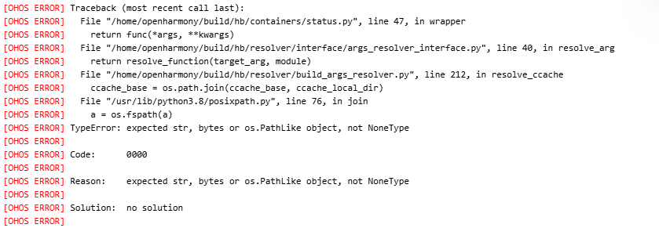
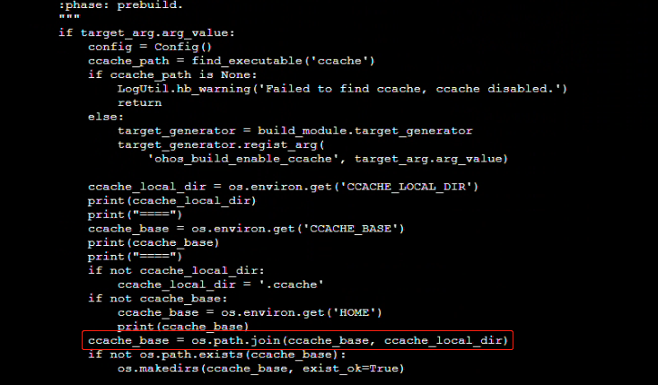

# 【案例】学会看堆栈日志排查非Java问题

## 背景
最近公司资源比较紧张，所以被临时借调参与了一个鸿蒙设备相关的项目，任务就是在Docker中安装鸿蒙设备编译的基础环境，通过Springboot应用去调用他们提供的编译命令，说人话就是在java里去调cmd命令  

## 问题描述
因为鸿蒙的编译环境做了升级，导致调命令报错了  
  

## 问题分析
因为是跨语言的问题，所以第一时间选择了在网上查阅资料，但是并没有找到任何解决方法。负责C语言开发的同事也不知道问题所在，后来是一个同事提醒了我让我从堆栈日志里定位  
找到堆栈日志中报错的代码行，如下：  
  
从日志中`TypeError: expected str, bytes or os.PathLike object, not NoneType`可以推断，很可能是a为空导致的，继续往上排查  
  
从堆栈中可以看到a是调用`os.path.join`时传进去的`ccache_base`，而`ccache_base`是通过`os.environ.get('HOME')`得来的，从网上查阅得知这句代码是获取环境变量HOME的值，所以是因为HOME环境变量为空导致的。  

## 问题解决
通过对比了升级前的HOME环境变量值，并在调用命令前设置HOME环境变量进行解决  

## 总结
有时候遇到一些非Java范畴的语言的时候，我们会想当然的去查阅资料进行解决。但是在缺少资料的情况下，我们还是要利用起堆栈日志一步步分析，即使有可能是比较底层的问题，万变不离其宗  
