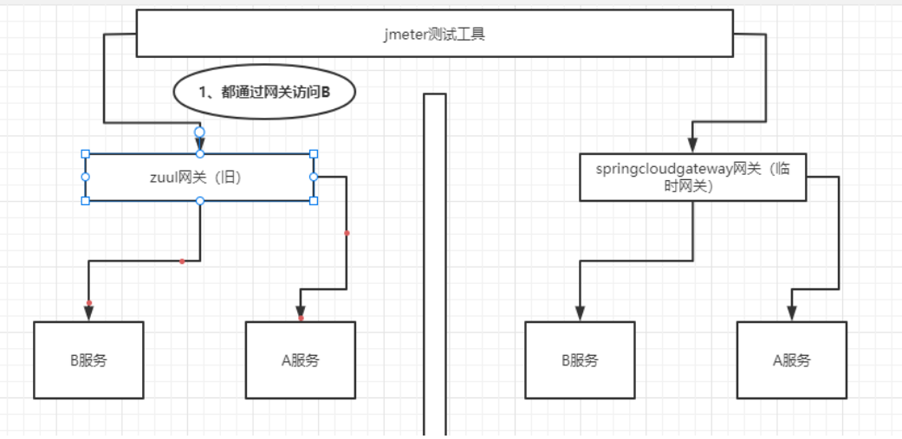
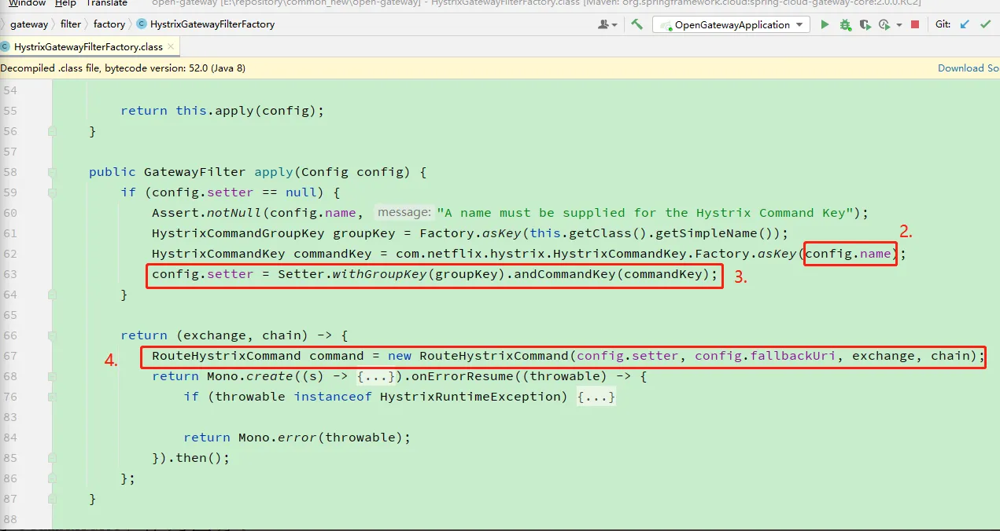
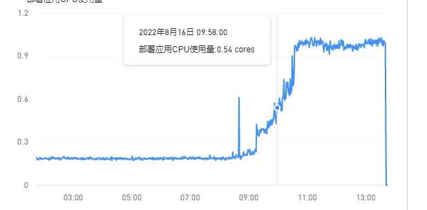
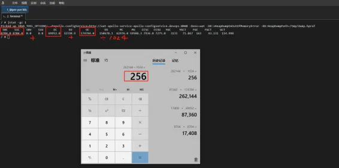
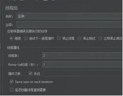
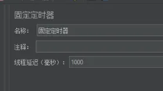
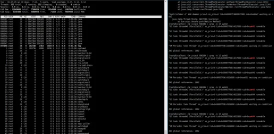
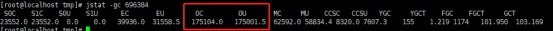
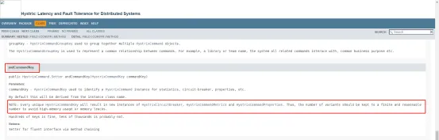
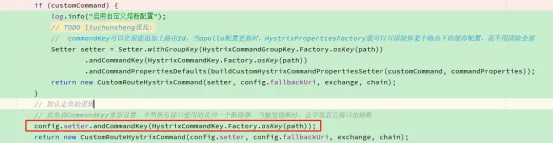

# 【案例】网关升级改造
## 背景
目前公司各环境使用的网关，均没有熔断保护功能，后续如果某个服务出现访问大量超时问题，会出现拖垮网关，引发其他服务不可访问的问题。为了解决该问题，现计划升级成有熔断保护功能的网关。  
由于原网关（Zuul）的技术不能完全满足现有使用，因此我们将对网关技术进行升级，下面将通过技术对比，筛选出适合公司发展的网关技术。原计划升级为apisix 网关技术，但由于此技术对运维环境版本要求比较高，升级改动较大，待运维升级后续使用，现使用临时网关spring cloud gateway 替代  
<br>
> **思考：**  
> 之前使用的网关是zuul1.0，听说之前出过生产事故，猜测应该就是类似服务雪崩的问题,。从背景可以看出应该是某个服务有问题，网关可能没做超时/限流/熔断等手段或没生效，从而影响了网关(而且zuul1.0是阻塞式的，更可怕)，作为对外的流量入口和路由转发，从而也影响了其它服务。  
> 
> <br>
> 一开始很好奇，zuul不是默认整合了hystrix的吗，怎么会不满足呢？查了下资料，才知道原来zuul的路由转发有两种模式，基于url方式和service-id方式，而基于url方式是不会作为HystrixCommand执行  

- 模式一：url方式  
```yaml
# org.springframework.cloud.netflix.zuul.filters.route.SimpleHostRoutingFilter
zuul:
  routes:
    users:
      path: /路径/**
      url: http://ip:port
```
- 模式二：service-id方式  
```yaml
# org.springframework.cloud.netflix.zuul.filters.route.RibbonRoutingFilter
zuul:
  routes:
    users:
      path: /路径/**
      service-id: 注册中心上的服务名称
```
> **思考：**  
> 刚好我们公司使用的是url模式，之所以用这个模式，是因为我们不再基于注册中心组件做服务的注册与发现，而是采用k8s的service做服务的注册与发现，这样的好处可能是可以移除注册中心，减少资源，同时也比较符合云原生的架构吧。即使用url: `http://k8s的service名称:k8s的service端口`，这也就导致了熔断不生效  
> 
> <br>
> 如果使用service-id的方式，zuul集成hystrix的限流降级熔断等功能都是没问题的，而且可以支持路由级别的，只要将hystrix的default改成对应的服务名即可，例如： hystrix.command.default.execution.isolation.thread.timeoutInMilliseconds: 60000。唯一的缺点可能就是zuul1.0的IO模型导致它的性能被诟病  

## 现状
> 对目前生产环境zuul的配置进行分析

zuul配置(仅部分)：
```yaml
#如果是url的方式，则zuul.host开头的生效, 响应走socket
zuul:
  max: 
    host:
      connections: 1000000
  host:
    max-per-route-connections: 6000000
    maxTotalConnections: 600000
    socket-timeout-millis: 60000
    connect-timeout-millis: 60000

#如果路由方式是serviceId的方式，那么ribbon的生效
ribbon:
  ReadTimeout: 60000
  ConnectTimeout: 60000
  OkToRertryOnAllOperations: ture # 是否对所有操作重试
  MaxAutoRetriesNextServer: 1 #同一个服务不同实例的重试次数
  MaxAutoRetries: 1 #同一实例的重试次数

hystrix.command.default.execution.isolation.thread.timeoutInMilliseconds: 120000
```
从配置中可以看出，针对两种模式都做了相应的超时配置，因为我们都是url方式的路由转发，所以ribbon以下的配置都可以忽略  
> **思考：**  
> 针对url的方式配置的超时时间是60s，我感觉是有点大的，如果能够及时中断超时，可能拖垮网关的机率会小很多  
> 另外给每个路由分配的连接建立数是6000000，这简直是个天文数字吧，而且总的比每个还小，应该是配错了。如果那个有问题的服务不能够得到很好的限流，那只会无限扩大问题，如果能够限制得小一点，可能拖垮网关的机率也会小很多  
> 
> <br>
> 以上可能是我们能够应对突发流量或服务异常所做的努力了，但是最终的保障还是得交给服务熔断，所以还缺少最后一关  

## 现状临时优化
合理分配连接数和超时时间  
> **思考：**  
> 总的连接数和分配给每个路由的连接数要设置一个合适的值  
> 连接和超时时间好像是因为有些接口比较大，所以需要对耗时接口进行优化，同时再设置一个合适的值  
> 
> <br>
> url的方式有个不好的地方就是无法像ribbon那样对单个路由设置连接和超时时间，底层是基于httpclient的，如果要实现只能重新注入自己自定义的httpclient或其它http客户端工具，然后按域名进行设置连接和超时时间  
> <br>
> <br>
> 不过关于限流的话，目前只是利用了httpClient的相关连接数配置，可能有时候也不能满足我们复杂的流控规则，例如不同路由的配置不一样，所以必要时候也可以使用 spring-cloud-zuul-ratelimit 组件https://github.com/marcosbarbero/spring-cloud-zuul-ratelimit  

## 解决方案
1. 将阻塞式的zuul替换为异步非阻塞式的SpringCloudGateway  
2. 在SCG中集成Hystrix  
> 架构师的方案是在SCG上还是使用Hystrix，我有点不明白，Hystrix团队已经不再维护了，为什么不用Sentinel，而且功能还强大。后面了解到是因为公司架构在向云原生的方向推进，后续会使用kubesphere，该平台也有相应的网关，同时也支持降级熔断功能，而且现在也只是过度一下，好吧  

## SCG预研
1. Spring Cloud CircuitBreaker及Hystrix网关过滤器  
```xml
<dependency>
  <groupId>org.springframework.cloud</groupId>
  <artifactId>spring-cloud-starter-netflix-hystrix</artifactId>
</dependency>
```
```yaml
hystrix:
  command:
    FallbackController:
      execution:
        isolation:
          #strategy: SEMAPHORE
          thread:
            timeoutInMilliseconds: 3000 # 断路器允许内部服务响应时间设置
      # 断路条件 如果在5 秒内，至少访问5次以上，超时率达到60%，则启动断路器
      metrics:
        rollingStats:
          timeInMilliseconds: 5000
      circuitBreaker:
        requestVolumeThreshold: 5
        errorThresholdPercentage: 60
        sleepWindowInMilliseconds: 5000 # 断路时间，如果断路条件成立，断路5秒，五秒内访问该服务失败
```
2. 性能测试  
> 使用相同环境的测试服务器对不同网关进行压力测试
- QPS测试：每秒查询率，测试经过网关的速度

|   | QPS  | 备注  |
|---|---|---|
| 不使用网关  |  15K |  本地虚拟机16G 内存/4Core，该测试服务器本身性能极限 |
|  Zuul1 | 4K  | 当前使用网关  |
| Spring Cloud Gateway  |  6K |   |
| Zuul2  |  7K |   |
| Apisix  | 14K  |   |
> 由本地相同条件下，临时网关由Zuul1升级到Spring Cloud Gateway 性能提升50%左右  
> Zuul2性能也不错，但 Spring Cloud没有整合，java部署项目难度大  
> Apisix全网性能最高，但由于对部署环境要求较高，暂无法部署使用  

- 并发测试
> 模拟线上环境对网关进行压力测试，不限流并发测试：  
> 
> <br>
> 目的：不加限制的情况下, 通过对照实验，测试两个网关的极限    
> 步骤：  
> 1.1 准备：左边旧网关，右边新网关  
> 1.2 都通过网关访问服务B，每秒逐步增加对网关的并发数，同时每秒通过网关访问一次A   
> 当A访问失败时，记录当时的的并发数  
  
Zuul:  当访问服务B在每秒700用户左右，访问服务A失败  
Spring cloud gateway: 当访问服务B在每秒1000用户左右，访问服务A失败  

## SCG集成Hystrix
SCG集成Hystrix其实就是配置一个自带的过滤器即可，可以配置在全局，也可以配置在路由  
application.yml  
```yaml
# 全局配置
spring:
  cloud:
    gateway:
      default-filters:
        - name: Hystrix
          args:
            name: fallbackcmd #如果找不到对应的hystrix command配置，会用default的
            fallbackUri: forward:/fallback
```
application.yml
```yaml
# 路由下配置
spring:
  cloud:
    gateway:
      routes:
        - id: neo_route
          uri: lb://localhost:8011
          predicates:
            - Path=/a/**
          filters:
            - name: Hystrix
              args:
                name: fallbackcmd #如果找不到对应的hystrix command配置，会用default的
                fallbackUri: forward:/fallback
```
hystrix配置
```yaml
hystrix:
  threadpool:
    default:
      coreSize: 1000
  command:
    default:
      execution:
        isolation:
          semaphore:
            maxConcurrentRequests: 2000
          thread:
            timeoutInMilliseconds: 3000
```
因为gateway自带的hystrix熔断过滤器功能，是按过滤器配置中args.name作为commandKey，而相同的commandKey使用的是相同的断路器和相同的超时配置，不满足同一个路由下请求部分长耗时的接口，即不支持单独配置单个接口的超时时间  
  
所以需要考虑自定义自己的断路过滤器，本质是拷贝SCG的 HystrixGatewayFilterFactory，在它的基础上进行改造  
> **思考：**  
> 在配置中自定义相关需要自定义超时时间的接口，然后执行请求时，会经过熔断过滤器，用HystrixCommandKey将请求包裹起来时，修改原本的commandKey，如果接口有单独配置，则使用接口的路径作为commandKey，否则还是使用路由id作为commandKey  
自定义的超时配置
```yaml
platform:
  circuit-breaker:
    routeIds:
      service-a:
        - name: /api/a
          command:
            timeoutInMilliseconds: 30000
```
增强SCG熔断过滤器类
```java
/*
 * Copyright 2013-2017 the original author or authors.
 *
 * Licensed under the Apache License, Version 2.0 (the "License");
 * you may not use this file except in compliance with the License.
 * You may obtain a copy of the License at
 *
 *      http://www.apache.org/licenses/LICENSE-2.0
 *
 * Unless required by applicable law or agreed to in writing, software
 * distributed under the License is distributed on an "AS IS" BASIS,
 * WITHOUT WARRANTIES OR CONDITIONS OF ANY KIND, either express or implied.
 * See the License for the specific language governing permissions and
 * limitations under the License.
 *
 */

package com.ut.gateway.filters.factory;

import java.net.URI;
import java.util.*;
import java.util.function.Consumer;
import java.util.function.Function;

import com.netflix.hystrix.*;
import lombok.extern.slf4j.Slf4j;
import org.springframework.beans.factory.annotation.Autowired;
import org.springframework.boot.context.properties.EnableConfigurationProperties;
import org.springframework.cloud.gateway.filter.GatewayFilter;
import org.springframework.cloud.gateway.filter.GatewayFilterChain;
import org.springframework.cloud.gateway.filter.factory.AbstractGatewayFilterFactory;
import org.springframework.cloud.gateway.route.Route;
import org.springframework.cloud.gateway.support.ServerWebExchangeUtils;
import org.springframework.http.HttpStatus;
import org.springframework.http.server.reactive.ServerHttpRequest;
import org.springframework.stereotype.Component;
import org.springframework.util.*;
import org.springframework.web.reactive.DispatcherHandler;
import org.springframework.web.server.ServerWebExchange;
import org.springframework.web.servlet.mvc.condition.PatternsRequestCondition;
import org.springframework.web.util.UriComponentsBuilder;

import com.netflix.hystrix.HystrixObservableCommand.Setter;
import com.netflix.hystrix.exception.HystrixRuntimeException;

import static com.netflix.hystrix.exception.HystrixRuntimeException.FailureType.TIMEOUT;
import static org.springframework.cloud.gateway.support.ServerWebExchangeUtils.GATEWAY_REQUEST_URL_ATTR;
import static org.springframework.cloud.gateway.support.ServerWebExchangeUtils.containsEncodedParts;
import static org.springframework.cloud.gateway.support.ServerWebExchangeUtils.setResponseStatus;

import org.springframework.web.util.UrlPathHelper;
import reactor.core.publisher.Mono;
import rx.Observable;
import rx.RxReactiveStreams;
import rx.Subscription;

/**
 * Depends on `spring-cloud-starter-netflix-hystrix`, {@see http://cloud.spring.io/spring-cloud-netflix/}
 * 拷贝自https://github.com/spring-cloud/spring-cloud-gateway/releases/tag/v2.0.0.RC2，进行扩展
 *
 * @author Spencer Gibb
 */
@Slf4j
@Component
@EnableConfigurationProperties(CircuitBreakerConfig.class)
public class CustomHystrixGatewayFilterFactory extends AbstractGatewayFilterFactory<CustomHystrixGatewayFilterFactory.Config> {

    public static final String FALLBACK_URI = "fallbackUri";

    private final DispatcherHandler dispatcherHandler;

    /*用于接口通配符匹配*/
    private final UrlPathHelper urlPathHelper = new UrlPathHelper();

    /*用于接口通配符匹配*/
    private final PathMatcher pathMatcher = new AntPathMatcher();

    /*自定义的接口熔断配置*/
    @Autowired(required = false)
    private CircuitBreakerConfig circuitBreakerConfig;

    public CustomHystrixGatewayFilterFactory(DispatcherHandler dispatcherHandler) {
        super(Config.class);
        this.dispatcherHandler = dispatcherHandler;
    }

    @Override
    public List<String> shortcutFieldOrder() {
        return Arrays.asList(NAME_KEY);
    }

    public GatewayFilter apply(String routeId, Consumer<Config> consumer) {
        Config config = newConfig();
        consumer.accept(config);

        if (StringUtils.isEmpty(config.getName()) && !StringUtils.isEmpty(routeId)) {
            config.setName(routeId);
        }

        return apply(config);
    }

    @Override
    public GatewayFilter apply(Config config) {
        //TODO: if no name is supplied, generate one from command id (useful for default filter)
        if (config.setter == null) {
            Assert.notNull(config.name, "A name must be supplied for the Hystrix Command Key");
            HystrixCommandGroupKey groupKey = HystrixCommandGroupKey.Factory.asKey(getClass().getSimpleName());
            HystrixCommandKey commandKey = HystrixCommandKey.Factory.asKey(config.name);

            config.setter = Setter.withGroupKey(groupKey)
                    .andCommandKey(commandKey);
        }

        return (exchange, chain) -> {
            log.info("进入自定义Hystrix熔断过滤器");
            // 此处对源码进行了扩展
            CustomRouteHystrixCommand command = buildCommand(exchange, config, chain);

            return Mono.create(s -> {
                Subscription sub = command.toObservable().subscribe(s::success, s::error, s::success);
                s.onCancel(sub::unsubscribe);
            }).onErrorResume((Function<Throwable, Mono<Void>>) throwable -> {
                if (throwable instanceof HystrixRuntimeException) {
                    HystrixRuntimeException e = (HystrixRuntimeException) throwable;
                    if (e.getFailureType() == TIMEOUT) { //TODO: optionally set status
                        setResponseStatus(exchange, HttpStatus.GATEWAY_TIMEOUT);
                        return exchange.getResponse().setComplete();
                    }
                }
                return Mono.error(throwable);
            }).then();
        };
    }

    /**
     * 自定义方法
     * 替换源码中的RouteHystrixCommand command = new RouteHystrixCommand(config.setter, config.fallbackUri, exchange, chain);
     * 因为源码只支持路由级别的熔断配置，所以该方法进行扩展，如果接口存在自定义的熔断配置，则自定义HystrixCommand的setter，否则使用默认setter
     */
    private CustomRouteHystrixCommand buildCommand(ServerWebExchange exchange, Config config, GatewayFilterChain chain) {
        Route route = exchange.getAttribute(ServerWebExchangeUtils.GATEWAY_ROUTE_ATTR);
        // 查询对应路由下的接口熔断自定义配置列表
        List<CircuitBreakerConfig.Api> apis = Optional.ofNullable(circuitBreakerConfig)
                .map(CircuitBreakerConfig::getRouteIds)
                .map(routes -> route != null ? routes.get(route.getId()) : null)
                .orElse(null);

        CircuitBreakerConfig.Api api = null;
        String path = exchange.getRequest().getPath().pathWithinApplication().value();
        log.info("熔断过滤器获取url:{}", path);
        // 如果对应路由下存在接口熔断自定义配置列表，则查询对应接口熔断自定义配置
        if (!CollectionUtils.isEmpty(apis)) {
            log.info("自定义熔断配置url匹配中");
            api = filterApi(apis, path);
        }

        // 如果接口存在自定义配置，则自定义HystrixCommand的setter
        CircuitBreakerConfig.CommandProperties commandProperties = Optional.ofNullable(api)
                .map(CircuitBreakerConfig.Api::getCommand).orElse(null);
        // 防止用户只配置到threadpool/command/collapser这一层，所以需要校验用户配置了具体的属性项才算自定义了配置
        boolean customCommand = commandProperties != null && (commandProperties.getTimeoutInMilliseconds() != null);
        // 目前只判断了command，后续如果有其它判断，可以在此处追加条件判断
        if (customCommand) {
            log.info("启用自定义熔断配置");
            // TODO liuchunsheng优化：
            //  commandKey可以在前面追加上路由Id，当apollo配置更新时，HystrixPropertiesFactory就可以只清除掉某个路由下的缓存配置，而不用清除全部
            Setter setter = Setter.withGroupKey(HystrixCommandGroupKey.Factory.asKey(path))
                    .andCommandKey(HystrixCommandKey.Factory.asKey(path))
                    .andCommandPropertiesDefaults(buildCustomHystrixCommandPropertiesSetter(customCommand, commandProperties));
            return new CustomRouteHystrixCommand(setter, config.fallbackUri, exchange, chain);
        }
        // 默认走原始逻辑
        // 此处将CommandKey设置为与路由一致，不然所有接口使用的是同一个断路器，当触发熔断时，会导致其它接口也熔断
        config.setter.andCommandKey(HystrixCommandKey.Factory.asKey(route != null ? route.getId() : config.name));
        return new CustomRouteHystrixCommand(config.setter, config.fallbackUri, exchange, chain);
    }

    /**
     * 根据uri路径筛选出最匹配的接口，按以下优先级进行匹配
     * 1.精准匹配
     * 2.按通配符匹配
     * <p>
     * 匹配的逻辑借鉴了SpringMvc对RequestMapping注解的方法解析的过程（主要是寻找匹配度最高的方法逻辑和通配符匹配逻辑）
     * {@link org.springframework.web.servlet.handler.AbstractHandlerMethodMapping#lookupHandlerMethod}
     *
     * @param apis 接口列表
     * @param path uri路径
     * @return 匹配的接口
     */
    private CircuitBreakerConfig.Api filterApi(List<CircuitBreakerConfig.Api> apis, String path) {
        CircuitBreakerConfig.Api api = null;

        List<PatternsRequestCondition> patternsRequestConditionList = new LinkedList<>();
        Map<PatternsRequestCondition, CircuitBreakerConfig.Api> pattern2ApiMapping = new HashMap<>();

        for (CircuitBreakerConfig.Api obj : apis) {
            // 优先精准匹配，如果匹配成功则退出循环
            // TODO liuchunsheng优化：
            //  可以考虑在Spring容器启动装载配置类的时候构建好精准匹配的Mapping哈希表，当精准匹配时，就无需再循环匹配，直接通过key查找哈希表
            if (path.equals(obj.getName())) {
                api = obj;
                break;
            }
            // 通配符模式匹配(可能匹配到多个)，如果匹配成功则加到通配符匹配的接口列表，后续再从中找出一个最优的匹配结果
            PatternsRequestCondition patternsRequestCondition = new PatternsRequestCondition(
                    new String[]{obj.getName()}, urlPathHelper, pathMatcher, true
            );
            List<String> matchResult = patternsRequestCondition.getMatchingPatterns(path);
            // 匹配成功
            if (!CollectionUtils.isEmpty(matchResult)) {
                patternsRequestConditionList.add(patternsRequestCondition);
                pattern2ApiMapping.put(patternsRequestCondition, obj);
            }
        }

        // 如果未找到精准匹配的接口并且存在通配符匹配的接口列表，则从通配符匹配的接口列表中筛选出最优的结果
        // 此处的排序规则与SpringMvc对多个匹配的RequestMapping方法排序的规则一致
        if (api == null && !CollectionUtils.isEmpty(patternsRequestConditionList)) {
            patternsRequestConditionList.sort(
                    (pattern1, pattern2) -> comparePatternsRequestCondition(pattern1, pattern2, path, pathMatcher)
            );
            api = pattern2ApiMapping.get(patternsRequestConditionList.get(0));
        }
        return api;
    }

    /**
     * 参考：{@link org.springframework.web.servlet.mvc.condition.PatternsRequestCondition#compareTo}
     */
    private int comparePatternsRequestCondition(
            PatternsRequestCondition pattern1, PatternsRequestCondition pattern2, String lookupPath, PathMatcher pathMatcher
    ) {
        Comparator<String> patternComparator = pathMatcher.getPatternComparator(lookupPath);
        Iterator<String> iterator = pattern1.getPatterns().iterator();
        Iterator<String> iteratorOther = pattern2.getPatterns().iterator();

        while (iterator.hasNext() && iteratorOther.hasNext()) {
            int result = patternComparator.compare(iterator.next(), iteratorOther.next());
            if (result != 0) {
                return result;
            }
        }

        if (iterator.hasNext()) {
            return -1;
        } else {
            return iteratorOther.hasNext() ? 1 : 0;
        }
    }

    /**
     * 自定义方法
     * 根据用户自定义的Command配置，构建HystrixCommand配置
     *
     * @param customCommand     用户是否自定义了Command配置
     * @param commandProperties 自定义的Command配置
     * @return HystrixCommand配置
     */
    private HystrixCommandProperties.Setter buildCustomHystrixCommandPropertiesSetter(
            boolean customCommand, CircuitBreakerConfig.CommandProperties commandProperties
    ) {
        HystrixCommandProperties.Setter setter = HystrixCommandProperties.Setter();
        if (customCommand) {
            Optional.ofNullable(commandProperties.getTimeoutInMilliseconds()).ifPresent(setter::withExecutionTimeoutInMilliseconds);
            // 后续如果有其它属性项配置，可以在此处赋值
        }
        return setter;
    }

    //TODO: replace with HystrixMonoCommand that we write
    private class CustomRouteHystrixCommand extends HystrixObservableCommand<Void> {

        private final URI fallbackUri;
        private final ServerWebExchange exchange;
        private final GatewayFilterChain chain;

        CustomRouteHystrixCommand(Setter setter, URI fallbackUri, ServerWebExchange exchange, GatewayFilterChain chain) {
            super(setter);
            this.fallbackUri = fallbackUri;
            this.exchange = exchange;
            this.chain = chain;
        }

        @Override
        protected Observable<Void> construct() {
            return RxReactiveStreams.toObservable(this.chain.filter(exchange));
        }

        @Override
        protected Observable<Void> resumeWithFallback() {
            if (this.fallbackUri == null) {
                return super.resumeWithFallback();
            }

            //TODO: copied from RouteToRequestUrlFilter
            URI uri = exchange.getRequest().getURI();
            //TODO: assume always?
            boolean encoded = containsEncodedParts(uri);
            URI requestUrl = UriComponentsBuilder.fromUri(uri)
                    .host(null)
                    .port(null)
                    .uri(this.fallbackUri)
                    .build(encoded)
                    .toUri();
            exchange.getAttributes().put(GATEWAY_REQUEST_URL_ATTR, requestUrl);

            ServerHttpRequest request = this.exchange.getRequest().mutate().uri(requestUrl).build();
            ServerWebExchange mutated = exchange.mutate().request(request).build();
            return RxReactiveStreams.toObservable(CustomHystrixGatewayFilterFactory.this.dispatcherHandler.handle(mutated));
        }
    }

    public static class Config {
        private String name;
        private Setter setter;
        private URI fallbackUri;

        public String getName() {
            return name;
        }

        public Config setName(String name) {
            this.name = name;
            return this;
        }

        public Config setFallbackUri(String fallbackUri) {
            if (fallbackUri != null) {
                setFallbackUri(URI.create(fallbackUri));
            }
            return this;
        }

        public URI getFallbackUri() {
            return fallbackUri;
        }

        public void setFallbackUri(URI fallbackUri) {
            if (fallbackUri != null && !"forward".equals(fallbackUri.getScheme())) {
                throw new IllegalArgumentException("Hystrix Filter currently only supports 'forward' URIs, found " + fallbackUri);
            }
            this.fallbackUri = fallbackUri;
        }

        public Config setSetter(Setter setter) {
            this.setter = setter;
            return this;
        }
    }
}

```
自定义超时时间接口的配置类
```java
package com.ut.gateway.filters.factory;

import lombok.Getter;
import lombok.Setter;
import org.springframework.boot.context.properties.ConfigurationProperties;
import org.springframework.cloud.context.config.annotation.RefreshScope;
import org.springframework.context.annotation.Configuration;

import java.util.List;
import java.util.Map;

@Getter
@Setter
@RefreshScope
@Configuration
@ConfigurationProperties(prefix = "platform.circuit-breaker")
public class CircuitBreakerConfig {

    private Map<String, List<Api>> routeIds;

    @Getter
    @Setter
    public static class Api {

        private String name;
        private ThreadPoolProperties threadpool;
        private CommandProperties command;
        private CollapserProperties collapser;

    }

    @Getter
    @Setter
    public static class ThreadPoolProperties {
    }

    @Getter
    @Setter
    public static class CommandProperties {

        private Integer timeoutInMilliseconds;

    }

    @Getter
    @Setter
    public static class CollapserProperties {
    }

}
```
另外，我们项目里是使用apollo作为配置中心，记录hystrix的相关配置，而hystrix的规则配置等最终都是被加载到内存中存放的，所以需要监听apollo的改动，修改了之后能及时更新内存中hystrix的相关数据   
> 后面也看了SpringCloudAlibabaSentinel的源码，基于目前所了解到的Hystrix和Sentinel都是把相关的规则配置之类的数据放在内存中，Sentinel还有额外的一个面板可以对数据进行增删改查，不过面板是没有持久化数据的，数据源还是来源于使用了Sentinel客户端的服务内存中，所以所谓持久化比较简单的做法也是通过配置中心进行维护，下面简单列了两个不同框架的做法(不是标准)  
> 从配置中心加载配置到内存中，当配置中心的数据修改新增删除后同步修改内存中的数据
> 通过SentinelDashboard面板操作数据后会同步修改内存中的数据，内存中的数据变更后再写会nacos，需要自己编码进行增强  

apollo配置刷新类
```java
@Component
@Configuration
@EnableApolloConfig("gateway.yml")
public class GatewayPropertiesRefresher implements ApplicationContextAware,ApplicationEventPublisherAware {

    private ApplicationContext applicationContext;

    private ApplicationEventPublisher publisher;
    
    @Autowired
    private GatewayProperties gatewayProperties;

    @Autowired
    private RefreshScope refreshScope;

    @Override
    public void setApplicationContext(ApplicationContext applicationContext) throws BeansException {
        this.applicationContext = applicationContext;
    }

    @Override
    public void setApplicationEventPublisher(ApplicationEventPublisher applicationEventPublisher) {
        this.publisher = applicationEventPublisher;
    }

    @ApolloConfigChangeListener(interestedKeyPrefixes = "hystrix.", value = "gateway.yml")
    public void onChangeForHystrix(ConfigChangeEvent changeEvent) {
        logger.info("刷新hystrix配置!");
        this.applicationContext.publishEvent(new EnvironmentChangeEvent(changeEvent.changedKeys()));
        logger.info("刷新hystrix配置完成!");
    }

    @ApolloConfigChangeListener(interestedKeyPrefixes = "platform.circuit-breaker.", value = "gateway.yml")
    public void onChangeForPlatformCircuitBreaker(ConfigChangeEvent changeEvent) {
        logger.info("刷新platform circuit-breaker配置!");

        this.applicationContext.publishEvent(new EnvironmentChangeEvent(changeEvent.changedKeys()));
        refreshScope.refreshAll();

        // 清除HystrixPropertiesCommand缓存
        boolean clearThreadPool = false;
        boolean clearCommand = false;
        boolean clearCollapser = false;

        for (String changedKey : changeEvent.changedKeys()) {
            String[] split = changedKey.split("\\.");
            if (split.length >= 5) {
                if ("threadpool".equals(split[4])) {
                    clearThreadPool = true;
                } else if ("command".equals(split[4])) {
                    clearCommand = true;
                } else if ("collapser".equals(split[4])) {
                    clearCollapser = true;
                }
            }
        }

        clearHystrixPropertiesCache(clearThreadPool, clearCommand, clearCollapser);

        logger.info("刷新platform circuit-breaker配置完成!");
    }

    private void clearHystrixPropertiesCache(boolean clearThreadPool, boolean clearCommand, boolean clearCollapser) {
        if (clearThreadPool) {
            HystrixPropertiesFactory.clearThreadPoolProperties();
        }
        if (clearCommand) {
            HystrixPropertiesFactory.clearCommandProperties();
        }
        if (clearCollapser) {
            HystrixPropertiesFactory.clearCollapserProperties();
        }
    }

}
```
因为HystrixPropertiesFactory的清除缓存功能只允许清除所有数据，为了提升性能，需要进行扩展，增加按类型清除方法  
覆盖HystrixPropertiesFactory类
```java
//
// Source code recreated from a .class file by IntelliJ IDEA
// (powered by FernFlower decompiler)
//

package com.netflix.hystrix.strategy.properties;

import com.netflix.hystrix.HystrixCollapserKey;
import com.netflix.hystrix.HystrixCollapserProperties;
import com.netflix.hystrix.HystrixCommandKey;
import com.netflix.hystrix.HystrixCommandProperties;
import com.netflix.hystrix.HystrixThreadPoolKey;
import com.netflix.hystrix.HystrixThreadPoolProperties;
import com.netflix.hystrix.strategy.HystrixPlugins;

import java.util.Map;
import java.util.concurrent.ConcurrentHashMap;

/**
 * 因为HystrixPropertiesFactory的清除缓存功能只允许清除所有数据，为了提升性能，需要进行扩展，增加按类型清除方法
 * 拷贝自com.netflix.hystrix.strategy.properties.HystrixPropertiesFactory
 */
public class HystrixPropertiesFactory {
    private static final ConcurrentHashMap<String, HystrixCommandProperties> commandProperties = new ConcurrentHashMap();
    private static final ConcurrentHashMap<String, HystrixThreadPoolProperties> threadPoolProperties = new ConcurrentHashMap();
    private static final ConcurrentHashMap<String, HystrixCollapserProperties> collapserProperties = new ConcurrentHashMap();

    public HystrixPropertiesFactory() {
    }

    public static Map<String, HystrixCommandProperties> getCommandProperties() {
        return commandProperties;
    }

    public static Map<String, HystrixThreadPoolProperties> getThreadPoolProperties() {
        return threadPoolProperties;
    }

    public static Map<String, HystrixCollapserProperties> getCollapserProperties() {
        return collapserProperties;
    }

    public static void reset() {
        commandProperties.clear();
        threadPoolProperties.clear();
        collapserProperties.clear();
    }

    /**
     * 自定义方法，清除command配置
     */
    public static void clearCommandProperties() {
        commandProperties.clear();
    }

    /**
     * 自定义方法，清除threadPool配置
     */
    public static void clearThreadPoolProperties() {
        threadPoolProperties.clear();
    }

    /**
     * 自定义方法，清除collapser配置
     */
    public static void clearCollapserProperties() {
        collapserProperties.clear();
    }

    public static HystrixCommandProperties getCommandProperties(HystrixCommandKey key, HystrixCommandProperties.Setter builder) {
        HystrixPropertiesStrategy hystrixPropertiesStrategy = HystrixPlugins.getInstance().getPropertiesStrategy();
        String cacheKey = hystrixPropertiesStrategy.getCommandPropertiesCacheKey(key, builder);
        if (cacheKey != null) {
            HystrixCommandProperties properties = (HystrixCommandProperties)commandProperties.get(cacheKey);
            if (properties != null) {
                return properties;
            } else {
                if (builder == null) {
                    builder = HystrixCommandProperties.Setter();
                }

                properties = hystrixPropertiesStrategy.getCommandProperties(key, builder);
                HystrixCommandProperties existing = (HystrixCommandProperties)commandProperties.putIfAbsent(cacheKey, properties);
                return existing == null ? properties : existing;
            }
        } else {
            return hystrixPropertiesStrategy.getCommandProperties(key, builder);
        }
    }

    public static HystrixThreadPoolProperties getThreadPoolProperties(HystrixThreadPoolKey key, HystrixThreadPoolProperties.Setter builder) {
        HystrixPropertiesStrategy hystrixPropertiesStrategy = HystrixPlugins.getInstance().getPropertiesStrategy();
        String cacheKey = hystrixPropertiesStrategy.getThreadPoolPropertiesCacheKey(key, builder);
        if (cacheKey != null) {
            HystrixThreadPoolProperties properties = (HystrixThreadPoolProperties)threadPoolProperties.get(cacheKey);
            if (properties != null) {
                return properties;
            } else {
                if (builder == null) {
                    builder = HystrixThreadPoolProperties.Setter();
                }

                properties = hystrixPropertiesStrategy.getThreadPoolProperties(key, builder);
                HystrixThreadPoolProperties existing = (HystrixThreadPoolProperties)threadPoolProperties.putIfAbsent(cacheKey, properties);
                return existing == null ? properties : existing;
            }
        } else {
            return hystrixPropertiesStrategy.getThreadPoolProperties(key, builder);
        }
    }

    public static HystrixCollapserProperties getCollapserProperties(HystrixCollapserKey key, HystrixCollapserProperties.Setter builder) {
        HystrixPropertiesStrategy hystrixPropertiesStrategy = HystrixPlugins.getInstance().getPropertiesStrategy();
        String cacheKey = hystrixPropertiesStrategy.getCollapserPropertiesCacheKey(key, builder);
        if (cacheKey != null) {
            HystrixCollapserProperties properties = (HystrixCollapserProperties)collapserProperties.get(cacheKey);
            if (properties != null) {
                return properties;
            } else {
                if (builder == null) {
                    builder = HystrixCollapserProperties.Setter();
                }

                properties = hystrixPropertiesStrategy.getCollapserProperties(key, builder);
                HystrixCollapserProperties existing = (HystrixCollapserProperties)collapserProperties.putIfAbsent(cacheKey, properties);
                return existing == null ? properties : existing;
            }
        } else {
            return hystrixPropertiesStrategy.getCollapserProperties(key, builder);
        }
    }
}

```

## BUG
没想到还出现了小插曲，在内部pre环境运行了一段时间后，居然出现了网关接口访问延迟大，cpu高的问题。  
  
先找运维查了一下jvm的堆大小是256M  
  
从日志里统计了网关这段时间的接口访问个数(做了去重，即相同的url的接口个数为1)，大概请求了600多个不同的接口，在压测环境部署网关服务，通过jmeter运行计划，每秒从上述600多个接口中随机抽取2个接口进行请求，模拟pre环境请求频率持续访问  
  
  
通过jvisualVM查看jvm情况，在一个小时内，可以看到堆的使用一直在增大，cpu的使用也随着增大。  
  
查看linux cpu使用情况，可以看到cpu占用靠前的几个java线程都是GC线程  
  
查看堆及gc情况，老年代基本快使用完了，gc次数和占用的时间也不少  
  
如果继续访问下去，再访问多20几个接口，就会出现如下情况，cpu爆了，pre cpu高的问题原因可能就是如此  
  
初步怀疑是堆内存不足，垃圾回收后内存并未下降，可能存在内存泄漏，导致JVM频繁GC，占用cpu，程序停顿时间长，导致请求访问很慢  
通过导出dump文件，发现有存在内存泄漏的情况  
  
BucketedCounterStream：计数统计：记录一段时间窗口内的失败、超时、线程拒绝，成功（为一组）。统计时采用N-1组数据统计，第N组刚开始统计时随时间变化。基于时间转滚统计。  
RollingConcurrencyStream：最大并发数统计：线程池最大并发数。  
RollingDistributionStream：延时百分比统计：记录一段时间窗口内的百分位统计，对N-1组百分比数据排序，P50、P99、P999。  
<br>
检查代码及查阅网上相关资料。怀疑应该是hystrix command问题  
  
https://stackoverflow.com/questions/59742952/hystrix-high-memory-usage-with-over-1000-commands
https://netflix.github.io/Hystrix/javadoc/com/netflix/hystrix/HystrixCommand.Setter.html

  
之前在设置HystrixCommand的CommandKey的时候，使用的是路径，那就意味着每访问一次新接口，内存中就会多出很多Hystrix的降级熔断配置数据，这个数量也是有点恐怖的。后面换成了以路由作为CommandKey来解决这个问题   
后来查了下hystrix的配置，可以通过metrics.rollingPercentile.enabled来禁用掉关于延迟百分比的，但好像没什么用  
> 表示执行延迟是否应该跟踪和计算为百分比。如果被禁用，则所有汇总统计返回为-1。默认true  
> 如果对于这些统计信息没有利用到的话，也可以选择这种方法进行解决

其实改了CommandKey本质是减少了资源，所以另一个优化方向就是qps高的服务可以换为信号量隔离，减少资源消耗  
> **思考：**  
> 后面公司进行了相关分离，另一个公司基于KubeSphere，而我们的架构还是保持基于SpringCloud，所以可以将Hystrix替换为Sentinel，功能更强大，而且SCG集成Sentinel仅仅通过Sentinel的类库进行编码就可以支持路由或接口级别的配置，集成起来更方便。本质也是基于过滤器，然后我们只需要在过滤器中声明我们的规则即可  

## 云原生网关
http://higress.io/zh-cn/docs/overview/what-is-higress
> **思考：**  
> 打开始重事程序员职业，项目中基本挡在最前面的就是Nginx，我觉得最主要的原因是Nginx的高性能及相关的反向代理和负载均衡。但随着互联网业务的扩展和复杂性变大以及微服务时代的来临，基于Nginx的可扩展性来满足我们的场景可能不一定能非常的适配，所以就出现了像Nginx+Lua、openresty、kong、zuul、SpringCloudGateway等一众网关，前面的几款在性能和扩展性上做了折中，zuul和SpringCloudGateway在性能上比不过前面的产品，语言上与Java强关联，扩展性如果对于使用Java语言及相关技术栈的公司会比较友好，而且也无法承担像waf、安全等方面的工作。  
> 随着云原生时代的到来，像higress中介绍的，新一代的网关应该是同时兼顾安全+流量+微服务的网关，进而有了像ApiSix、Higress这类的网关

