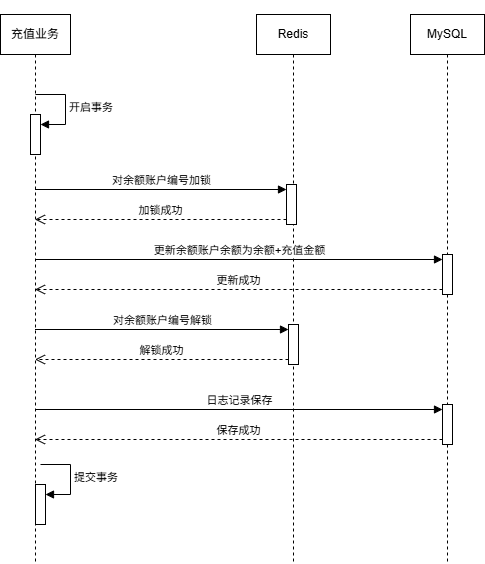
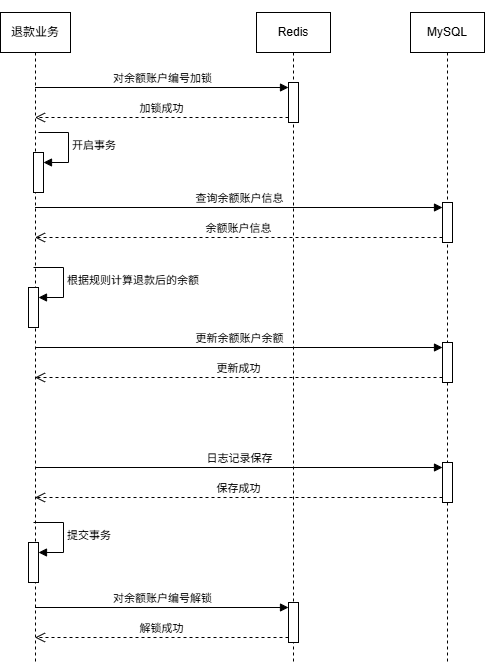

# 【案例】支付中加锁与事务顺序的问题
## 背景
今天支付中台团队的同事在做余额账户的充值和退款业务压测时，发现了金额不正确的情况，让我帮忙排查下，最后发现又是一道妥妥的面试题

## 问题描述
测试场景为用户多次进行充值和退款，业务正确的情况下，用户的余额账户金额经过多次充值和退款后数据应保持一致性，但是测试的结果发现用户的余额账户金额少扣了，以下是用户单次充值和退款的过程  
   
   

## 问题定位
据同事的表述，她的充值业务扣款业务都通过Redisson的分布式锁对同一个用户的余额账户编号进行了同步控制，即充值业务和扩宽业务是串行执行的，这似乎一切都很合理，如果能按上述的逻辑正常执行的话是不应该出现数据不一致的情况  
我只能让她加了一些日志打印，把每一次充值/退款前的余额账户金额和充值后/退款后的余额账户金额打印出来  
加了日志打印之后又运行了一次，通过日志输出看到有几次退款前的余额账户金额和充值前的余额账户金额是相同的，如果是串行的情况下，那不应该出现退款前和充值前余额账户金额相同的情况，除非锁失效了，不过经过一通验证，锁是没问题的  
那就只能分析代码逻辑了  

以下是关于充值业务和退款业务的代码逻辑，细节代码已省略  
**充值业务**  
   
**退款业务**   
   

对退款的业务进行分析，在退款前获取的余额账户的余额既然不是最新的，基于MySQL那很有可能是快照读导致的，但是如果充值和退款都是串行执行的情况，在退款时查询余额账户时建立的一致性试图中，拿到的应该是充值完成之后提交的事务数据了。如果不是最新的那只能说明充值业务这时候事务还没提交，而退款业务已经拿到了锁，开始查询余额账户，建立一致性视图  
从充值的业务流程中可以看出，充值业务是先开启事务再加锁的，那就会出现，当充值业务解锁后，事务还没提交，此时退款业务获取到锁，查询余额账户，拿到的不是最新的数据，所以就出现了少扣的现象  

## 问题解决
通过上面的分析，我们可以得出问题原因是先开启事务再加锁导致的数据不一致情况，那么我们只需要调整为先加锁，再开启事务就可以解决问题。在更换顺序后，通过验证并没有出现少扣的现象  

## 总结
通过这个问题我们可以得出，到底是先开启事务再加锁还是先加锁再开启事务，这两者都会影响我们应用的阻塞时间，一个是锁操作的中间件，一个是数据库，但是在考虑到数据一致性的情况下，我们优先确保先加锁再开启事务  
