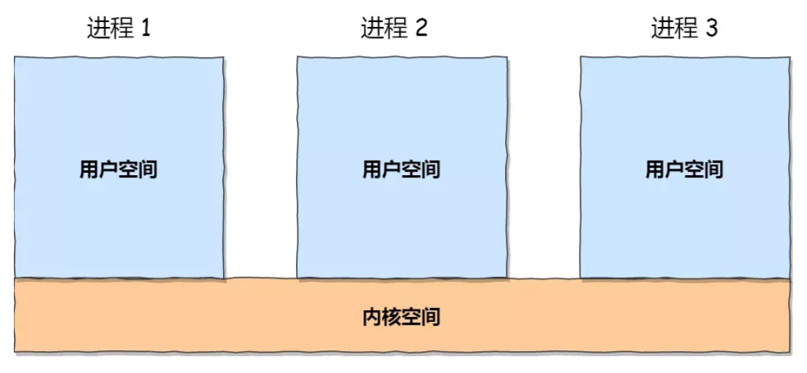
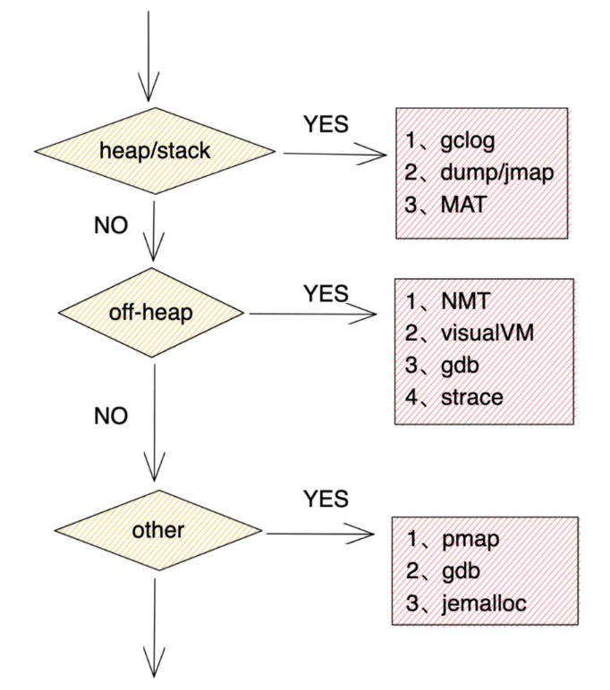

# 【案例】JVM堆外内存泄漏
## 背景
标准虚拟机是公司使用C语言开发的一款类似状态机、规则引擎等支持动态执行业务的组件，面向非开发人员，支持口语化编程。在我们的各类Java应用服务中，通过使用SDK的形式进行使用，底层通过JNI进行调用  
  
SDK的方法主要有以下几个：
- 创建虚拟机：c语言申请内存，创建执行载体
- 发送事件：c语言执行业务规则逻辑
- 销毁虚拟机：c语言释放内存，销毁执行载体

## 问题描述
在测试的过程中，假设创建10000个虚拟机，然后销毁掉创建的10000个虚拟机，容器的内存没有出现减少，疑似内存泄漏  
  
在容器终端执行top命令查看容器的进程资源占用，可以看到程序的RES即使用的物理内存大小与容器可视化界面的数据基本对应上  
   
> RES是指进程占用的实际物理内存大小,也就是进程实际使用的内存大小

虽然容器的内存并没有正常回收，但是JVM的堆内存大小及回收一切正常，而且C的开发同事说已经通过内存工具排除了C语言侧存在内存泄漏的可能  
   
> 运行时的资源配置如下：  
> <br>
> JVM：Xms768m Xmx768m  
> 容器：内存1536 CPU2核  


## 问题定位
### 划清边界
相信大家看了前面我给出的JVM堆内存数据，大概率都会觉得应该不会是Java层的问题，但是堆内存其实也只是JVM运行时数据区里的一部分，对于我们的Java程序来说，用到的内存涉及到很多方面，例如还有非堆(或称堆外内存)  

我们目前可以认为对于堆内存来说并不是导致问题的原因，只有当我们把所有可能用到的地方都排除嫌疑之后，我们才可以有底气认为Java层没有问题  
   

### JVM运行时数据区
除了堆，JVM运行时数据区的其它区域也会占据内存
   
> oracle官方对JVM运行时数据区的介绍：https://docs.oracle.com/javase/specs/jvms/se8/html/jvms-2.html#jvms-2.5


### JVM NativeMemoryTracking
**概述**  
本机内存跟踪 (NMT) 是 Java Hotspot VM 的一项功能，可跟踪 HotSpot JVM 的内部内存使用情况。您可以使用 jcmd 实用程序访问 NMT 数据。此版本中的 NMT 不会跟踪第三方本机代码内存分配和 JDK 类库。此外，此版本不包括MBeanHotSpot for JMC 中的 NMT。  
> oracle官方对Native Memory Tracking使用说明：https://docs.oracle.com/javase/8/docs/technotes/guides/vm/nmt-8.html


**使用**  
> NMT使用：https://docs.oracle.com/javase/8/docs/technotes/guides/troubleshoot/tooldescr007.html

1. 增加JVM启动参数`-XX:NativeMemoryTracking=detail`  
   
2. 通过`jcmd <PID> VM.native_memory detail scale=MB`输出NMT数据  

   
**输出结果**  

   

**字段解释**  

   
> oracle官方对Native Memory Tracking内存分类说明：https://docs.oracle.com/javase/8/docs/technotes/guides/troubleshoot/tooldescr022.html#BABHIFJC


| 字段 | 含义 |
|----|---|
| Java Heap   |  堆|
| Class   | 存储类元数据信息  |
|  Thread  | 虚拟机栈、本地方法栈、程序计数器  |
|  Code  |  字节码编译成汇编指令，JIT的代码缓存 |
|  GC  |  GC 使用的数据，例如卡表 |
|  Internal  | 命令行解析器使用的内存、JVMTI等  |
|  Symbol  | 保留字符串（Interned String）的引用与符号表引用  |
|  Native Memory Tracking  | NMT本身占用  |
|  Arena Chunk  | 不知道啥  |

### Direct Memory
JDK 1.4之后`ByteBuffer`类提供`allocateDirect(int capacity)`进行堆外内存的申请，底层通过`unsafe.allocateMemory(size)`实现，会调用`malloc`方法进行内存分配。实际上，在java堆里是维护了一个记录堆外地址和大小的`DirectByteBuffer`的对象，所以GC是能通过操作`DirectByteBuffer`对象来间接操作对应的堆外内存，从而达到释放堆外内存的目的  

### Mapped Memory
通过系统调用 `mmap` 函数将某个文件映射到内存中，真正分配在操作系统内核，使用场景如 java 的零拷贝，将减少用户态和内核态的数据复制次数  

### JNI Memory
通过 java JNI 调用的 native 方法分配的内存  

### JVM内存总结
   
> 这里的堆内存指JDK1.8  
> -XX:MetaspaceSize、-XX:MaxMetaspaceSize 可以设置 Metaspace 大小  
> -XX:MaxDirectMemorySize 可以设置Direct Memory 大小  
> <br>
> 关于JVM进程占用内存：  
> https://stackoverflow.com/questions/53451103/java-using-much-more-memory-than-heap-size-or-size-correctly-docker-memory-limi/53624438#53624438

### 定位
前面我们已经分析过堆内存的情况是正常的，接下来就要分析堆外的内存，需要借助NMT  
1. 在测试前先通过`jcmd <pid> VM.native_memory baseline`创建基线  
2. 进行测试  
3. 测试后通过`jcmd <pid> VM.native_memory detail.diff`查看NMT增长数据详情

   
可以看到总计的数据中，committed仅增加了6886KB   

通过NMT的数据我们可以看到，NMT跟踪的堆外内存增长并不明显，远远达不到容器增长的内存大小  

接下来是NMT跟踪不到的内存，因为代码里并没有使用Direct Memory和Mapped Memory的代码，所以也可以排除掉这两块的问题，那就可以把问题锁定在JNI Memory上了，我们的代码实现也是通过JNI调用来完成相应功能的  
> 虽然在我们的项目中没有使用到Direct Memory和Mapped Memory，但是如果我们要定位这两块的问题该如何下手呢？下面列了通过JDK自带的工具jvisualVM和jconsole进行定位  
> <br>
>    
>    
>    
> <br>
> 通过arthas也可以查看除了JNI之外的内存，不过通过NMT和会更详细

## 问题分析
### JNI内存分配过程
   

### 操作系统-内存管理
**程序直接访问物理内存带来的问题：**  
1.访问了不该访问的区域，比如无意间修改了系统的数据导致系统出错  
2.同时运行多个程序，一个程序运行可能会覆盖另外一个程序的代码或数据  

操作系统会提供一种机制，为每个进程分配独立的一套「虚拟地址」，将不同进程的虚拟地址和不同内存的物理地址映射起来。这样不同的进程运行的时候，写入的是不同的物理地址，这样就不会冲突了  
操作系统引入了虚拟内存，进程持有的虚拟地址会通过 CPU 芯片中的内存管理单元（MMU）的映射关系，来转换变成物理地址，然后再通过物理地址访问内存  
   
   

### Linux内存布局
   
   

> ● 程序文件段，包括二进制可执行代码；  
> ● 已初始化数据段，包括静态常量；  
> ● 未初始化数据段，包括未初始化的静态变量；  
> ● 堆段，包括动态分配的内存，从低地址开始向上增长；  
> ● 文件映射段，包括动态库、共享内存等，从低地址开始向上增长（跟硬件和内核版本有关）  
> ● 栈段，包括局部变量和函数调用的上下文等。栈的大小是固定的，一般是 8 MB。当然系统也提供了参数，以便我们自定义大小  
> <br>
> 在这 7 个内存段中，堆和文件映射段的内存是动态分配的。比如说，使用 C 标准库的 malloc() 或者 mmap() ，就可以分别在堆和文件映射段动态分配内存。  

### Linux内存申请
   
> 这里的LIB库指glibc标准库

C语言中使用`malloc`可以分配一段连续的内存空间  
对于堆(heap)，OS提供了`int brk(void *addr)`函数，C库提供了`void *sbrk(int* increment)`函数  
对于映射区域(mmap)的操作，操作系统提供了 `void *mmap(void *addr, size_t length, int prot, int flags, int fd, off_t offset)`、 `int munmap(void *addr, size t length)`两个函数  

### 内存池
**池化技术**  

池是一种设计模式，将程序中需要经常使用的核心资源先申请出来，放到一个池内，由程序自己管理，这样可以提高资源的使用效率，也可以保证本程序占有的资源数量。例如线程池、连接池，除了我们常见的这两种类型，还包括内存池  

**内存池**  
由于brk/sbrk/mmap属于系统调用，如果每次申请内存，都调用这三个函数中的一个，那么每次都要产生系统调用开销（即cpu从用户态切换到内核态的上下文切换，这里要保存用户态数据，等会还要切换回用户态），这是非常影响性能的；
其次，这样申请的内存容易产生碎片，因为堆是从低地址到高地址，如果低地址的内存没有被释放，高地址的内存就不能被回收  


通过内存池可以减少系统调用的次数，有效减少内存碎片问题   

### glibc之内存管理(ptmalloc)
ptmalloc是隶属于glibc(GNU Libc)的一款内存分配器，现在在Linux环境上，我们使用的运行库的内存分配(malloc/new)和释放(free/delete)就是由其提供  

ptmalloc 实现了 malloc()，free()以及一组其它的函数. 以提供动态内存管理的支持。分配器处在用户程序和内核之间，它响应用户的分配请求，向操作系统申请内存，然后将其返 回给用户程序，为了保持高效的分配，分配器一般都会预先分配一块大于用户请求的内存，并通过某种算法管理这块内存，来满足用户的内存分配要求。  
用户释放掉的内存也并不是立 即就返回给操作系统，相反，分配器会管理这些被释放掉的空闲空间，以应对用户以后的内存分配要求。也就是说，分配器不但要管理已分配的内存块，还需要管理空闲的内存块，当 响应用户分配要求时，分配器会首先在空闲空间中寻找一块合适的内存给用户，在空闲空间 中找不到的情况下才分配一块新的内存。  
为实现一个高效的分配器，需要考虑很多的因素。 比如，分配器本身管理内存块所占用的内存空间必须很小，分配算法必须要足够的快  

> https://paper.seebug.org/papers/Archive/refs/heap/glibc内存管理ptmalloc源代码分析.pdf

### ptmalloc原理
   
1. 即分配一块小型内存(小于或等于 128kb)，malloc()会调用 brk 函数将 堆顶 指针向高地址移动，获得新的内存空间，free 释放内存的时候，并不会把内存归还给操作系统，而是缓存在 malloc 的内存池中，待下次使用  

2. 当分配一块大型内存(大于 128kb)，mmap() 系统调用中「私有匿名映射」的方式，在文件映射区分配一块内存。free 释放内存的时候，会把内存归还给操作系统，内存得到真正的释放  

> 为什么 malloc 不全部使用 mmap 来实现呢(mmap分配的内存可以会通过 munmap 进行 free ，实现真正释放)？而是仅仅对于大于 128k 的大块内存才使用 mmap ？
其实，进程向 OS 申请和释放地址空间的接口 sbrk/mmap/munmap 都是系统调用，频繁调用系统调用都比较消耗系统资源的。并且， mmap 申请的内存被 munmap 后，重新申请会产生更多的缺页中断。例如使用 mmap 分配 1M 空间，第一次调用产生了大量缺页中断 (1M/4K 次 ) ，当munmap 后再次分配 1M 空间，会再次产生大量缺页中断。缺页中断是内核行为，会导致内核态CPU消耗较大。另外，如果使用 mmap 分配小内存，会导致地址空间的分片更多，内核的管理负担更大。 同时堆是一个连续空间，并且堆内碎片由于没有归还 OS ，如果可重用碎片，再次访问该内存很可能不需产生任何系统调用和缺页中断，这将大大降低 CPU 的消耗。 因此， glibc 的 malloc 实现中，充分考虑了 sbrk 和 mmap 行为上的差异及优缺点，默认分配大块内存 (128k) 才使用 mmap 获得地址空间，也可通过 mallopt(M_MMAP_THRESHOLD, ) 来修改这个临界值。

### ptmalloc原理
在 Doug Lea 实现的内存分配器中只有一个主分配区(main arena)，每次分配内存都必须对主分配区加锁，分配完成后释放锁，在 SMP 多线程环境下，对主分配区的锁的争用很激烈，严重影响了 malloc 的分配效率。
于是 Wolfram Gloger 在 Doug Lea 的基础上改进使得 Glibc 的 malloc 可以支持多线程，增加了非主分配区(non main arena)支持，每一个进程只有一个主分配区和若干个非主分配区。主分配区由main线程或者第一个线程来创建持有。主分配区与非主分配区用环形链表进行管理。每一个分配区利用互斥锁(mutex)使线程对于该分配区的访问互斥

主分配区可以访问进程的 heap 区域和 mmap 映射区域，也就是说主分配区可以使用 sbrk 和 mmap 向操作系统申请虚拟内存，而非主分配区只能访问进程的 mmap 映射区域

非主分配区每次使用 mmap()向操作系统申请相应(32 位系统上默认为 1MB，64 位系统默 认为 64MB)大小的虚拟内存

   

### ptmalloc缺陷
1. 64M内存碎片
每个子线程预分配的内存是 64MB（Ptmalloc2 中被称为 Thread Arena，32 位系统下为 1MB，64 位系统下为 64MB）。如果有 100 个线程，就将有 6GB 的内存都会被内存池占用。当然，并不是设置了 1000 个线程，就会预分配 60GB 的内存，子线程内存池最多只能到 8 倍的 CPU 核数，比如在 32 核的服务器上，最多只会有 256 个子线程内存池，但这也非常夸张了，16GB（64MB * 256 = 16GB）的内存将一直被 Ptmalloc2 占用

2. 堆内存碎片
brk(sbrk)可能存在内存碎片(由于new和delete的顺序不同，可能存在空洞，又称为碎片)

   

> 64M内存碎片问题可以通过设置thread arena的数量来解决，但是性能会有所下降，export MALLOC_ARENA_MAX=1

### 分析
JNI这块的内存其实已经就不归Java层管理了，谁创建的就由谁维护。那在我们的代码中就是C的so库进行管理，通过前面的介绍，我们知道C的内存管理主要依赖于基础类库glibc中ptmalloc内存管理所维护
鉴于ptmalloc的缺陷，在我们的场景中在没有使用多线程的情况下仍存在问题，所以可以排除是多线程引起的64M内存碎片，重点分析非64M的内存情况

这里我们需要借助gdb工具进行分析，通过`sudo apt-get -y install gdb openjdk-8-dbg`
GDB是 Linux 下常用的程序调试器，我们使用`gdb -q -batch -ex 'call malloc_stats()' -p <PID>`进行分析，下面是分析的结果，从结果可以看出，释放之后in use bytes减少了，说明释放内存了，但是system bytes并没有减少，说明内存分配器并没有将内存归还操作系统，glibc 的内存分配策略导致的碎片化内存回收问题，导致看起来像是内存泄漏

  

另外通过`gdb -q -batch -ex 'call (int)malloc_trim(0)' -p <PID>`，容器的内存正常释放，说明存在内存碎片

   

> 通过调用 malloc_trim() 函数可以整理malloc内存池中的内存块，合并、释放空闲内存，可以简单理解为JVM 的GC
> <br>
> gdb调用C函数，会有一定概率造成jvm进程崩溃，需谨慎执行

> strace工具，可以帮助我们查看系统调用  
> 查看内存申请：`strace -f -e"brk,mmap,munmap" -p <PID>`

## 问题解决
使用其它性能更好，内存占用更少，算法更优的内存分配器，例如Google的tcmalloc、Facebook的jemalloc，下面通过更换默认的ptmalloc为jemalloc来解决问题  
```dockerfile
FROM harbor.utyun.com/library/ubuntu-openjdk-8-jdk:16.0422
ADD target/demo.jar /app.jar

RUN apt update && apt upgrade -y; \
    apt install -y build-essential wget tcl8.6 zlib1g-dev git docbook-xsl xsltproc graphviz autoconf automake libtool; \
    apt clean

RUN mkdir -p /opt && cd /opt && git clone https://github.com/jemalloc/jemalloc.git  && \
    cd jemalloc && \
    git checkout -b stable-4 origin/stable-4 && \
    ./autogen.sh --enable-prof && \
    make dist && \
    make && \
    make install

ENV LANG C.UTF-8
ENV JAVA_OPTS=${JAVA_OPTS}
ENV LD_PRELOAD="/usr/local/lib/libjemalloc.so"
# ENV MALLOC_CONF="prof_leak:true,prof:true,lg_prof_interval:25,lg_prof_sample:18,prof_prefix:/tmp/jeprof"

CMD java ${JAVA_OPTS} -jar /app.jar
```

> jemalloc 是由 Jason Evans 在 FreeBSD 项目中引入的新一代内存分配器。它是一个通用的 malloc 实现，侧重于减少内存碎片和提升高并发场景下内存的分配效率，其目标是能够替代 malloc。jemalloc 应用十分广泛，在 Firefox、Redis、Rust、Netty 等出名的产品或者编程语言中都有大量使用。具体细节可以参考 Jason Evans 发表的论文 《A Scalable Concurrent malloc Implementation for FreeBSD》
> <br>  
> tcmalloc 出身于 Google，全称是 thread-caching malloc，所以 tcmalloc 最大的特点是带有线程缓存，tcmalloc 非常出名，目前在 Chrome、Safari 等知名产品中都有所应有。tcmalloc 为每个线程分配了一个局部缓存，对于小对象的分配，可以直接由线程局部缓存来完成，对于大对象的分配场景，tcmalloc 尝试采用自旋锁来减少多线程的锁竞争问题

更换之后重新进行测试，内存可以正常归还操作系统，而且内存占用减少一半
   
   

## 拓展
### linux工具
gdb：Linux 下的程序调试器  
strace：可以追踪进程执行时的系统调用以及接收到的信号  
pmap：打印进程内所有的内存地址区间  
`cat /proc/<PID>/smaps`：打印进程详细的内存地址  

### 非JVM内存泄漏排查工具
gperftools  
async-profiler  

### Java SE 故障排除指南
https://docs.oracle.com/javase/8/docs/technotes/guides/troubleshoot/toc.html  

## 总结

