# 【案例】Spring国际化落地实践
## 背景
公司的产品准备进军海外市场，拓宽渠道，因此需要支持国际化。后台服务需要进行改造，主要包括代码中的中文元素，例如异常提示信息、枚举常量值等。  


## 选型说明
Spring中，提供了`MessageSource`接口作为国际化的解决方案；它的实现类，会帮我们自动配置好、管理国际化资源文件的组件。所以直接基于springboot提供的特性快速高效，基本能够满足我们的业务场景  
```java
package org.springframework.context;

import java.util.Locale;
import org.springframework.lang.Nullable;

public interface MessageSource {
//如果在国际化配置文件中找不到var1对应的message，可以给一个默认值var3
@Nullable
String getMessage(String var1, @Nullable Object[] var2, @Nullable String var3, Locale var4);

    //如果在国际化配置文件中找不到var1对应的message，抛出异常
    String getMessage(String var1, @Nullable Object[] var2, Locale var3) throws NoSuchMessageException;

    //这个方法暂时没有做太多研究，所以本篇文档也不会涉及
    String getMessage(MessageSourceResolvable var1, Locale var2) throws NoSuchMessageException;
}
```
该接口比较重要的三个实现类如下：
- ResourceBundleMessageSource
- ReloadableResourceBundleMessageSource
- StaticMessageSource


## 预研

**1.创建多语言资源文件**   
在工程的resource目录下创建Resource Bundle  
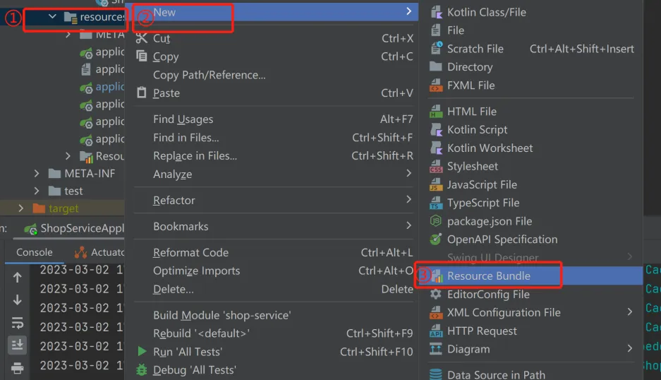  
增加指定语言  
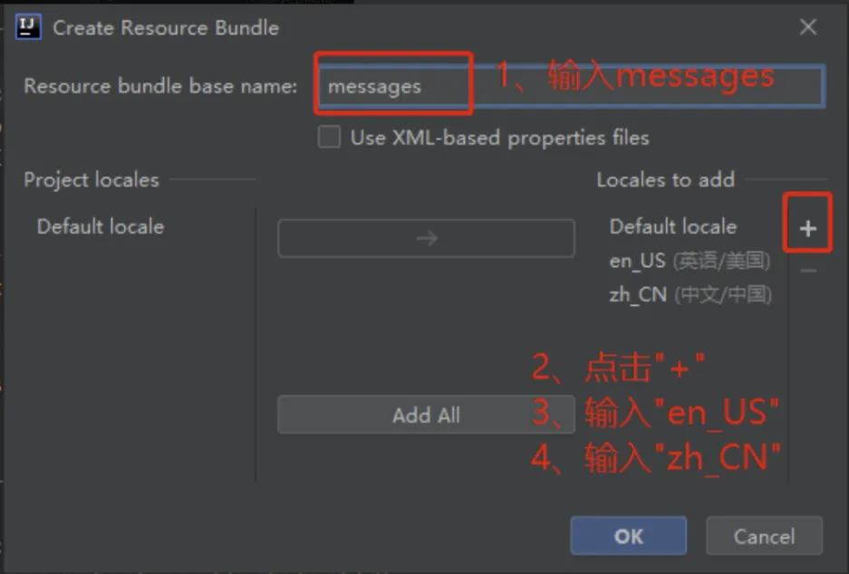  
创建完文件如下  
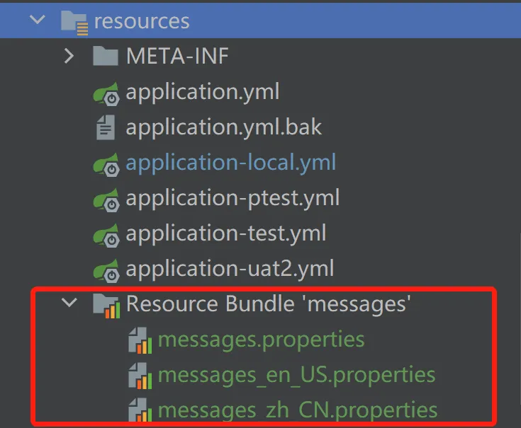


**2.添加多语言内容**
::: code-group

```properties[messages_en_US.properties]
msg.success = login success
msg.args = user {0} not found
```
```properties[messages_zh_CN.properties]
msg.success = 登陆成功
msg.args = 用户不存在{0}
```
:::

**3.编码**  
::: code-group
```java[TestControlle.java]
@ApiOperation("测试国际化(无参)")
@GetMapping(value = "/test")
public String testLocale() {
    return LocaleUtils.getMessage("msg.success", null);
}

@ApiOperation("测试国际化(有参)")
@GetMapping(value = "/testArgs")
public String testLocaleWithArgs() {
    return LocaleUtils.getMessage("msg.args", "123456");
}
```
```java[LocaleUtils.java]
import lombok.extern.slf4j.Slf4j;
import org.springframework.context.MessageSource;
import org.springframework.context.i18n.LocaleContextHolder;

import java.util.Locale;

/**
 * 国际化工具类
 */
@Slf4j
public class LocaleUtils {

    private static final MessageSource MS = 
            SpringContextHolder.getBean(MessageSource.class);

    public static String getMessage(String code) {
        Locale locale = LocaleContextHolder.getLocale();
        if (MS == null) {
            throw new RuntimeException(
                    "locale messsage source can not be null!");
        } else {
            return MS.getMessage(code, (Object[])null, locale);
        }
    }

    public static String getMessage(String code, Object... args) {
        Locale locale = LocaleContextHolder.getLocale();
        if (MS == null) {
            throw new RuntimeException(
                    "locale messsage source can not be null!");
        } else {
            return MS.getMessage(code, args, locale);
        }
    }
}
```
:::

注意事项：idea的文件编码务必设置成UTF-8，不然返回中文内容时可能出现乱码
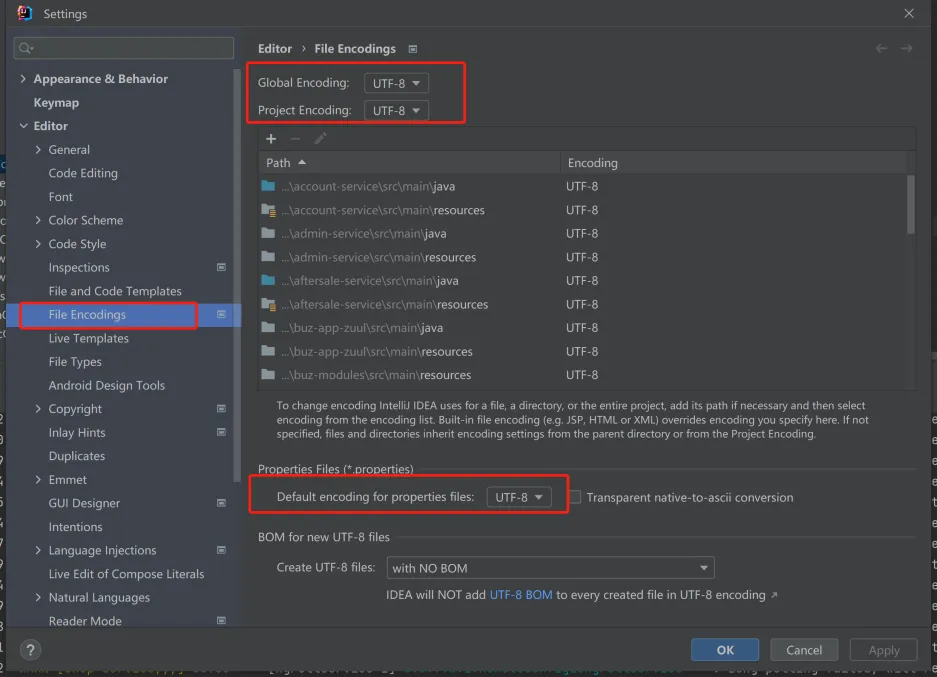  
**4.测试**  
前端从请求头Accept-Language指定多语言环境
| 语言   | 请求头属性值 |
|------|--------|
| 中文简体 |   zh-CN     |
| 英文   |     en-US   |

**中文**  
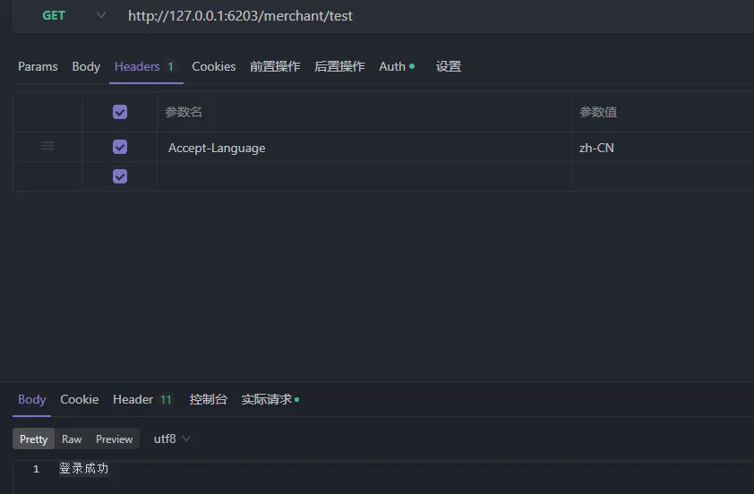  
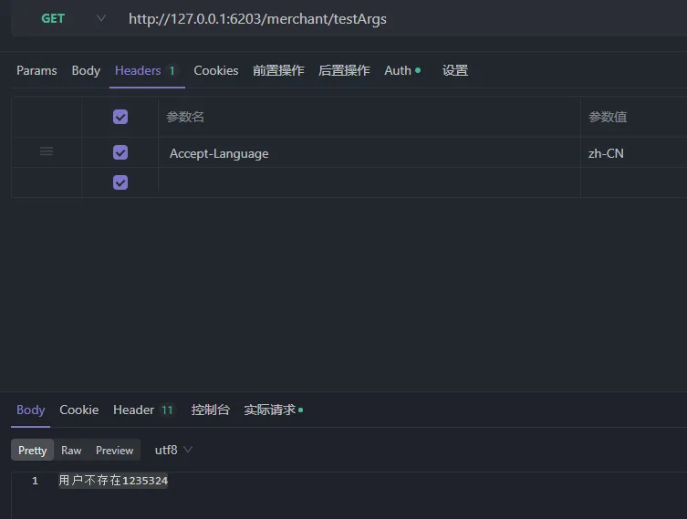  
**英文**  
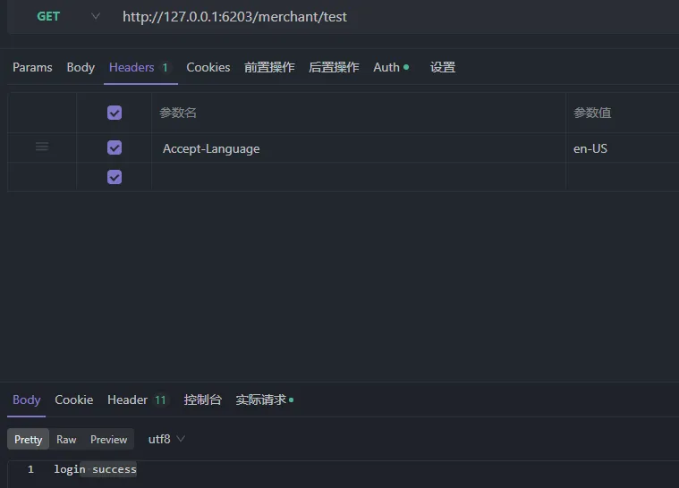  
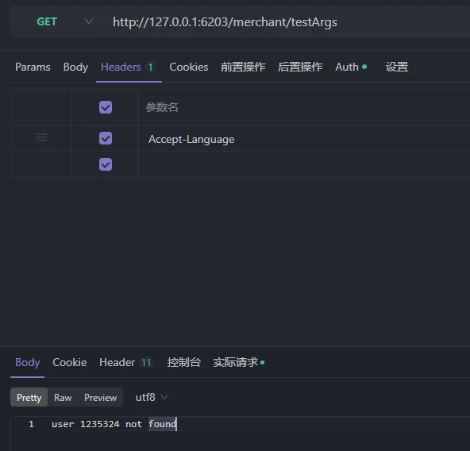
## 方案实现
最终生产实践我们都会使用同统一的配置中心对资源文件进行维护，以下列了我们内部使用的几款主流配置中心的集成方式
### 集成Apollo
**1.创建资源文件**
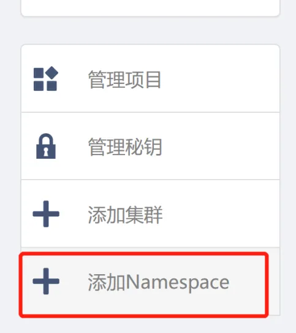   
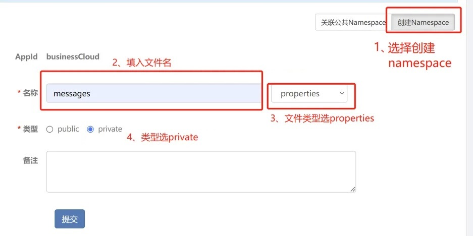  
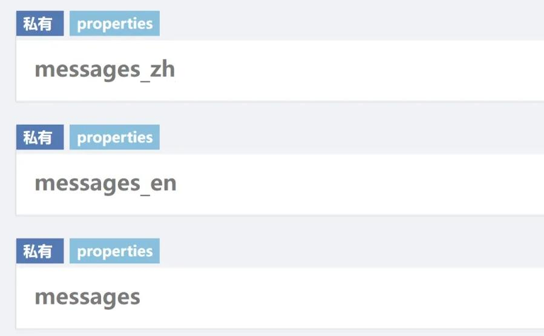

**2.补充资源文件多语言内容**
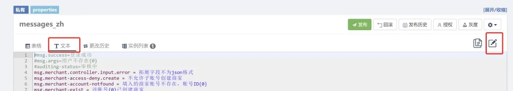

**3.自定义多语言配置类**  
自定义MessageSource，指定从apollo里读取资源文件  
::: code-group
```java[ApolloMessageSource.java]
import com.ctrip.framework.apollo.Config;
import com.ctrip.framework.apollo.ConfigService;
import lombok.extern.slf4j.Slf4j;
import org.springframework.context.MessageSource;
import org.springframework.context.MessageSourceResolvable;
import org.springframework.context.NoSuchMessageException;

import java.text.MessageFormat;
import java.util.Locale;
import java.util.concurrent.ConcurrentHashMap;

@Slf4j
public class ApolloMessageSource implements MessageSource {

    /**
     * key：语言环境
     * subKey：资源Key
     * subValue：资源key对应消息转换
     */
    private static final ConcurrentHashMap<Locale, ConcurrentHashMap<String, MessageFormat>> CACHE_MESSAGE_FORMATS = new ConcurrentHashMap<>();
    private static final Config MESSAGES_EN_US = ConfigService.getConfig("messages_en");
    private static final Config MESSAGE_ZH_CN = ConfigService.getConfig("messages_zh");

    private String resolveCodeWithoutArguments(String code, Locale locale) {
        String result = null;
        if (locale.equals(Locale.CHINESE)) {
            result = MESSAGE_ZH_CN.getProperty(code, "");
        } else if (locale.equals(Locale.ENGLISH)) {
            result = MESSAGES_EN_US.getProperty(code, "");
        } else {
            result = MESSAGE_ZH_CN.getProperty(code, "");
        }
        if (result != null) {
            return result;
        }
        throw new NoSuchMessageException(code, locale);
    }

    private String resolveCode(String code, Object[] args, Locale locale) {
        String result = this.resolveCodeWithoutArguments(code, locale);

        ConcurrentHashMap<String, MessageFormat> localeMessageFormats = CACHE_MESSAGE_FORMATS.get(locale);
        if (localeMessageFormats == null) {
            localeMessageFormats = new ConcurrentHashMap<>();
            CACHE_MESSAGE_FORMATS.put(locale, localeMessageFormats);
        }

        if (localeMessageFormats.containsKey(code)) {
            return localeMessageFormats.get(code).format(args);
        }
        MessageFormat messageFormat = new MessageFormat(result);
        localeMessageFormats.put(code, messageFormat);
        return messageFormat.format(args);
    }

    @Override
    public String getMessage(String code, Object[] args, String defaultMessage, Locale locale) {
        // 不实现
        return null;
    }

    @Override
    public String getMessage(String code, Object[] args, Locale locale) throws NoSuchMessageException {
        if (args == null) {
            return this.resolveCodeWithoutArguments(code, locale);
        }

        return this.resolveCode(code, args, locale);

    }

    @Override
    public String getMessage(MessageSourceResolvable resolvable, Locale locale) throws NoSuchMessageException {
        // 不实现
        return null;
    }
}
```
```java[ApolloMessageAutoConfiguration.java]
import org.springframework.boot.autoconfigure.condition.ConditionalOnProperty;
import org.springframework.context.MessageSource;
import org.springframework.context.annotation.Bean;
import org.springframework.context.annotation.Configuration;
import org.springframework.context.annotation.Primary;

@Configuration
@ConditionalOnProperty(value = "apollo.i18n.message.enable", havingValue = "true", matchIfMissing = true)
public class ApolloMessageAutoConfiguration {

    @Bean
    @Primary
    public MessageSource messageSource() {
        return new ApolloMessageSource();
    }
}
```
```java[WebConfig.java]
import com.google.common.collect.Lists;
import org.apache.commons.lang3.StringUtils;
import org.springframework.beans.factory.annotation.Value;
import org.springframework.context.annotation.Bean;
import org.springframework.context.annotation.Configuration;
import org.springframework.web.servlet.LocaleResolver;
import org.springframework.web.servlet.i18n.AcceptHeaderLocaleResolver;

import java.util.ArrayList;
import java.util.Locale;

@Configuration
public class WebConfig {

    @Value("${platform.i18n.props}")
    private String i18nProps;

   /**
    * 配置应用支持的多语言
    * 
    * @return
    */
    @Bean
    public LocaleResolver localeResolver() {
        AcceptHeaderLocaleResolver acceptHeaderLocaleResolver = new AcceptHeaderLocaleResolver();
        acceptHeaderLocaleResolver.setDefaultLocale(Locale.CHINESE);
        // 默认支持的语言
        ArrayList<Locale> lst = Lists.newArrayList(Locale.CHINESE, Locale.SIMPLIFIED_CHINESE, Locale.ENGLISH);
        // 其它通过配置文件指定
        if (!StringUtils.isEmpty(i18nProps)) {
            for (String str : i18nProps.split(",")) {
                // zh_TW_stroke-繁体中文
                String language = str.split("-")[0];
                // zh_TW_stroke
                String[] langArray = language.split("_");
                switch (langArray.length) {
                    case 1:
                        lst.add(new Locale(langArray[0]));
                        break;
                    case 2:
                        lst.add(new Locale(langArray[0], langArray[1]));
                        break;
                    case 3:
                        lst.add(new Locale(langArray[0], langArray[1], langArray[2]));
                        break;
                }
            }
        }
        acceptHeaderLocaleResolver.setSupportedLocales(lst);
        return acceptHeaderLocaleResolver;
    }

}
```
:::

::: code-group
```yaml[application.yaml]
apollo:
  i18n:
    message:
      enable: true # 将值设为true，打开apollo读取资源文件的开关
platform:
   i18n:
      props: es-西班牙语,fr-法语,zh_TW-繁体中文

spring:
   mvc:
      locale: zh_CN # 设置默认语言为中文。否则前端没传Accept-Language时会取系统默认语言
```
:::

### 集成Nacos
**1.创建资源文件**
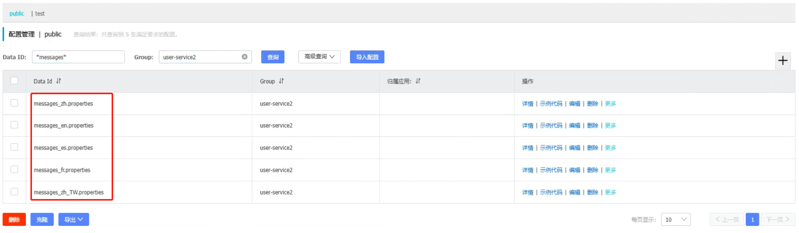

**2.补充资源文件多语言内容**  
略  

**3.自定义多语言配置类**  
自定义MessageSource，指定从nacos里读取资源文件  
::: code-group
```java[NacosMessageAutoConfig.java]
import com.alibaba.cloud.nacos.NacosConfigManager;
import com.alibaba.nacos.api.exception.NacosException;
import lombok.extern.slf4j.Slf4j;
import org.apache.commons.io.FileUtils;
import org.apache.commons.lang3.StringUtils;
import org.springframework.beans.factory.annotation.Value;
import org.springframework.boot.autoconfigure.condition.ConditionalOnProperty;
import org.springframework.context.annotation.Bean;
import org.springframework.context.annotation.Configuration;
import org.springframework.context.annotation.Primary;
import org.springframework.context.support.ReloadableResourceBundleMessageSource;
import org.springframework.util.ResourceUtils;

import java.io.File;
import java.io.IOException;
import java.nio.charset.Charset;

/**
 * 自定义国际化配置类-Nacos
 * 
 */
@Slf4j
@Configuration
@ConditionalOnProperty(value = "nacos.i18n.message.enable", havingValue = "true", matchIfMissing = true)
public class NacosMessageAutoConfig {

    @Value("${spring.application.name}")
    private String applicationName;

    @Value("${lang.i18n.message.baseFolder:lang}")
    private String baseFolder;

    @Value("${lang.i18n.message.baseName:messages}")
    private String baseName;

    @Value("${lang.i18n.message.encoding:UTF-8}")
    private String encoding;

    @Value("${lang.i18n.message.cacheSeconds:120}")
    private int cacheSeconds;

    @Value("${platform.i18n.props}")
    private String i18nProps;

    @Primary
    @Bean
    public ReloadableResourceBundleMessageSource i18nMessageSource(NacosConfigManager nacosConfigManager) throws NacosException {
        // 读取nacos的配置文件
        String config = nacosConfigManager.getConfigService().getConfig("messages.properties", applicationName, 3000);
        String configZh = nacosConfigManager.getConfigService().getConfig("messages_zh.properties", applicationName, 3000);
        String configEn = nacosConfigManager.getConfigService().getConfig("messages_en.properties", applicationName, 3000);
        // 写入本地
        saveAsFileWriter("messages.properties", config);
        saveAsFileWriter("messages_zh.properties", configZh);
        saveAsFileWriter("messages_en.properties", configEn);
        // 添加配置文件中的其他语言
        if (!StringUtils.isEmpty(i18nProps)) {
            for (String lang : i18nProps.split(",")) {
                String filename = "messages_" + lang.split("-")[0] + ".properties";
                String cfg = nacosConfigManager.getConfigService().getConfig(filename, applicationName, 3000);
                saveAsFileWriter(filename, cfg);
            }
        }

        String path = ResourceUtils.FILE_URL_PREFIX + getPath() + File.separator + baseName;
        ReloadableResourceBundleMessageSource messageSource = new ReloadableResourceBundleMessageSource();
        // 配置读取本地
        messageSource.setBasename(path);
        messageSource.setDefaultEncoding(encoding);
        messageSource.setCacheSeconds(cacheSeconds);
        return messageSource;
    }

    private void saveAsFileWriter(String fileName, String content) {
        try {
            fileName = getPath() + File.separator + fileName;
            File file = new File(fileName);
            FileUtils.writeStringToFile(file, content, String.valueOf(Charset.defaultCharset()));
            log.info("国际化配置成功-本地文件路径:{}", fileName);
        } catch (IOException e) {
            log.error("国际化配置失败-本地文件路径:{}，异常信息:{}", fileName, e);
        }
    }

    private String getPath() {
        String userDir = System.getProperty("user.dir");
        if ("/".equals(userDir)) {
            userDir = StringUtils.EMPTY;
        }
        return userDir + File.separator + baseFolder;
    }

}
```
```java[WebConfig.java]
import com.google.common.collect.Lists;
import org.apache.commons.lang3.StringUtils;
import org.springframework.beans.factory.annotation.Value;
import org.springframework.context.annotation.Bean;
import org.springframework.context.annotation.Configuration;
import org.springframework.web.servlet.LocaleResolver;
import org.springframework.web.servlet.i18n.AcceptHeaderLocaleResolver;

import java.util.ArrayList;
import java.util.Locale;

@Configuration
public class WebConfig {

    @Value("${platform.i18n.props}")
    private String i18nProps;

   /**
    * 配置应用支持的多语言
    * 
    * @return
    */
    @Bean
    public LocaleResolver localeResolver() {
        AcceptHeaderLocaleResolver acceptHeaderLocaleResolver = new AcceptHeaderLocaleResolver();
        acceptHeaderLocaleResolver.setDefaultLocale(Locale.CHINESE);
        // 默认支持的语言
        ArrayList<Locale> lst = Lists.newArrayList(Locale.CHINESE, Locale.SIMPLIFIED_CHINESE, Locale.ENGLISH);
        // 其它通过配置文件指定
        if (!StringUtils.isEmpty(i18nProps)) {
            for (String str : i18nProps.split(",")) {
                // zh_TW_stroke-繁体中文
                String language = str.split("-")[0];
                // zh_TW_stroke
                String[] langArray = language.split("_");
                switch (langArray.length) {
                    case 1:
                        lst.add(new Locale(langArray[0]));
                        break;
                    case 2:
                        lst.add(new Locale(langArray[0], langArray[1]));
                        break;
                    case 3:
                        lst.add(new Locale(langArray[0], langArray[1], langArray[2]));
                        break;
                }
            }
        }
        acceptHeaderLocaleResolver.setSupportedLocales(lst);
        return acceptHeaderLocaleResolver;
    }

}
```
:::

::: code-group
```yaml[application.yaml]
nacos:
  i18n:
    message:
      enable: true
platform:
   i18n:
      props: es-西班牙语,fr-法语,zh_TW-繁体中文

spring:
   mvc:
      locale: zh_CN # 设置默认语言为中文。否则前端没传Accept-Language时会取系统默认语言
```
:::

### 集成KubeSphere
**1.创建资源文件**
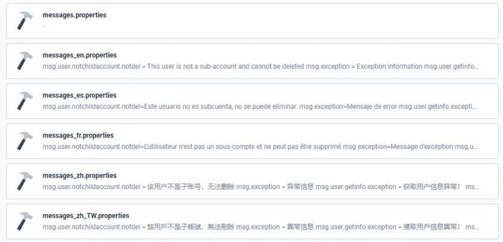   

**2.补充资源文件多语言内容**  
略  

**3.自定义多语言配置类**  
无需自定义MessageSource，只需要在KubeSphere上创建容器时指定配置文件挂载的目录即可
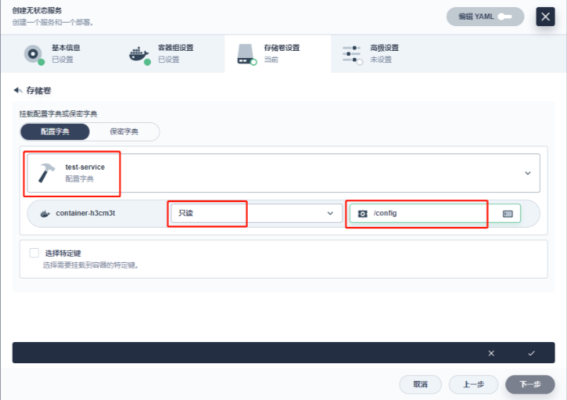    
springboot启动会扫描一下位置的application.properties或者application.yml文件作为Springboot的默认文件  
> -file：/config/  
> -file：.../config/  
> -classpath：/config/  
> -classpath：/  
> 优先级由高到低，高优先级的配置会覆盖低优先级的配置；SpringBoot会从这四个位置全部加载主配置文件：互补配置；  
> 我们还可以通过spring.config.location来改变默认位置  
::: code-group
```java[WebConfig.java]
import com.google.common.collect.Lists;
import org.apache.commons.lang3.StringUtils;
import org.springframework.beans.factory.annotation.Value;
import org.springframework.context.annotation.Bean;
import org.springframework.context.annotation.Configuration;
import org.springframework.web.servlet.LocaleResolver;
import org.springframework.web.servlet.i18n.AcceptHeaderLocaleResolver;

import java.util.ArrayList;
import java.util.Locale;

@Configuration
public class WebConfig {

    @Value("${platform.i18n.props}")
    private String i18nProps;

   /**
    * 配置应用支持的多语言
    * 
    * @return
    */
    @Bean
    public LocaleResolver localeResolver() {
        AcceptHeaderLocaleResolver acceptHeaderLocaleResolver = new AcceptHeaderLocaleResolver();
        acceptHeaderLocaleResolver.setDefaultLocale(Locale.CHINESE);
        // 默认支持的语言
        ArrayList<Locale> lst = Lists.newArrayList(Locale.CHINESE, Locale.SIMPLIFIED_CHINESE, Locale.ENGLISH);
        // 其它通过配置文件指定
        if (!StringUtils.isEmpty(i18nProps)) {
            for (String str : i18nProps.split(",")) {
                // zh_TW_stroke-繁体中文
                String language = str.split("-")[0];
                // zh_TW_stroke
                String[] langArray = language.split("_");
                switch (langArray.length) {
                    case 1:
                        lst.add(new Locale(langArray[0]));
                        break;
                    case 2:
                        lst.add(new Locale(langArray[0], langArray[1]));
                        break;
                    case 3:
                        lst.add(new Locale(langArray[0], langArray[1], langArray[2]));
                        break;
                }
            }
        }
        acceptHeaderLocaleResolver.setSupportedLocales(lst);
        return acceptHeaderLocaleResolver;
    }

}
```
:::

::: code-group
```yaml[application.yaml]
platform:
   i18n:
      props: es-西班牙语,fr-法语,zh_TW-繁体中文

spring:
  mvc:
    locale: zh_CN
  messages:
    basename: file:/config/messages,file:/config/messages_en,file:/config/messages_zh,file:/config/messages_es,file:/config/messages_fr,file:/config/messages_zh_TW
```
:::


