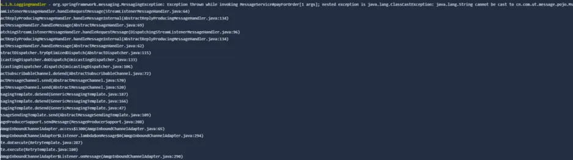
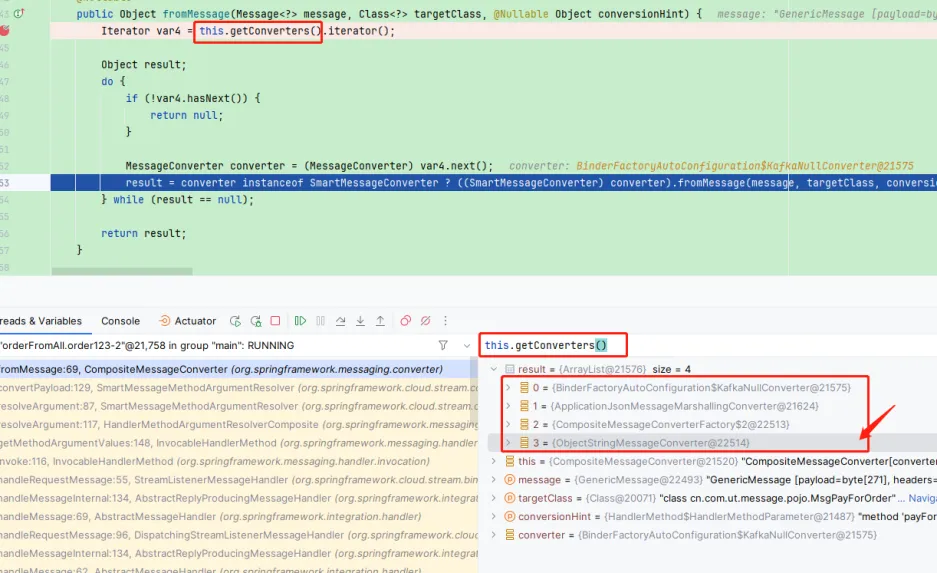
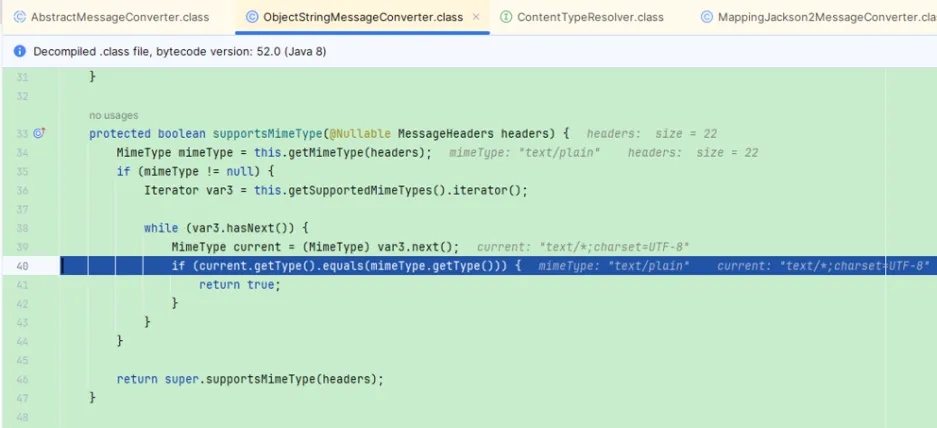
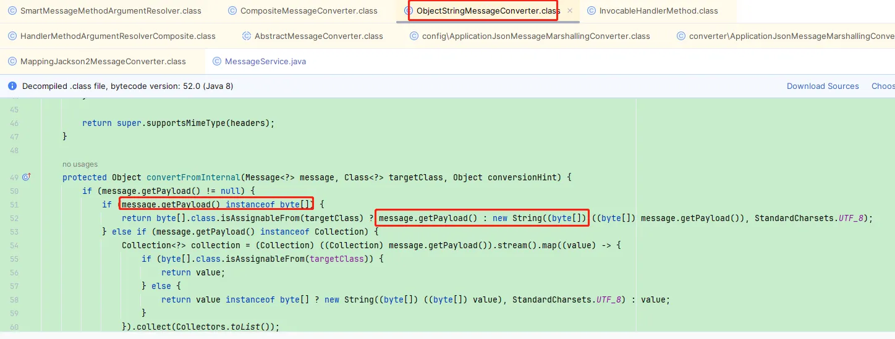
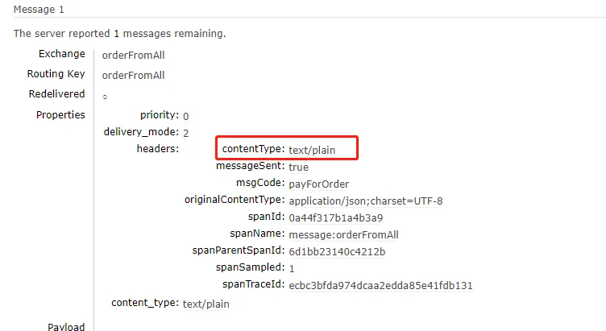
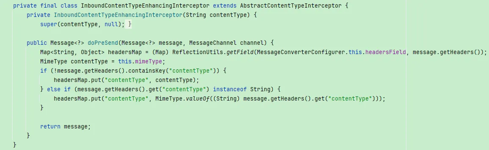
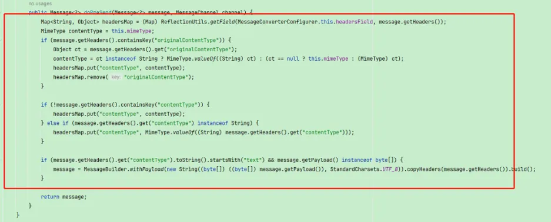
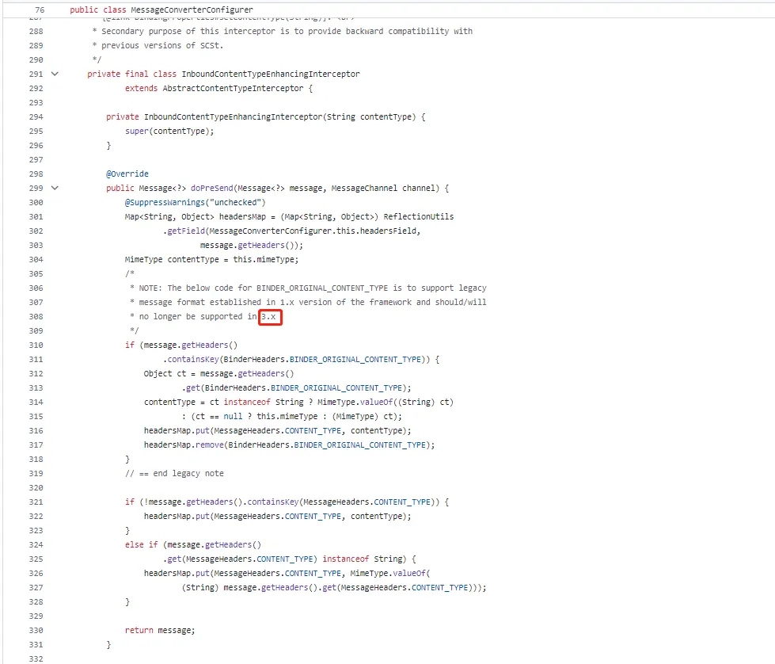
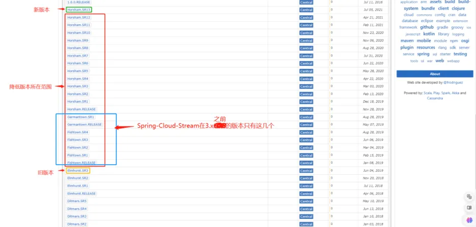
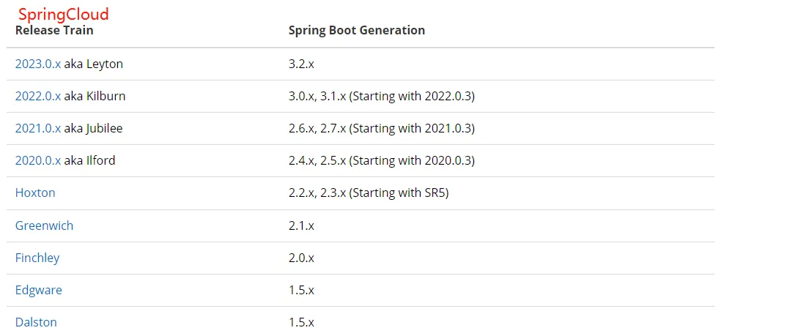

# SpringCloud升版引起的消息消费异常
## 问题描述
上游的同事反馈发送mq消息后，订单状态并没有正常变更。该消息的作用是业务方发送消息给到我们，我们进行消费并更新订单的状态，但是只有dev环境有问题，测试环境没问题

## 问题定位
1. 检查MQ是否正常发送  
   业务方反馈正常发送，我们也在消费端看到日志的打印  
2. 检查MQ消费是否正常  
   在消费端中的日志中查看到了报错`java.lang.ClassCastException: java.lang.String cannot be cast to xxx`
  
可以确定是消费端消费消息的时候报错导致的

## 问题分析
先贴一下生产端和消费端的代码，我们是使用SpringCloudStream进行消息的发送消费，dev和pre可能存在的区别就是SpringBoot和SpringCloud的版本不一样，dev的版本比较新，进行过升级  
**生产端：**
```java
public interface MessageSender {
   @Output("orderFromAll")
   SubscribableChannel orderFromAll();
}
```
```java
@EnableBinding(MessageSender.class)
@SpringBootApplication
public class TestApplication {
    public static void main(String[] args) {
        SpringApplication.run(TestApplication.class, args);
    }
}
```
```java
@Autowired
private MessageSender messageSender;

public void sendMsg(UpdateOrderToPayedMsg msg) {
    log.info("内容:{}", JS0N.toJSNstring(msg));
    messageSender.orderFromAll().send(
            MessageBuilder.withPayload(msg).setHeader("msgCode", "payForOrder").build()
    );
}
```
application.yml
```yaml
spring:
  cloud:
    stream:
      bindings:
        orderFromAll:
          destination: orderFromAll
          contentType: application/json
```
**消费端：**
```java
public interface MessageConfig {
    @Input("orderFromAll")
    SubscribableChannel orderFromAll();
}
```
```java
@EnableBinding(MessageConfig.class)
@SpringBootApplication
public class TestApplication {
    public static void main(String[] args) {
        SpringApplication.run(TestApplication.class, args);
    }
}
```
```java
@Slf4j
@Service
public class MessageService {

    @StreamListener(value = "orderFromAll", condition = "headers['msgCode']=='payForOrder'")
    public void payForOrder(Message<MsgPayForOrder> msgPayForOrderMessage) {
        if (msgPayForOrderMessage.getPayload() != null) {
            log.debug("==payForOrder with payload {}==",
                    JSON.toJSONString(msgPayForOrderMessage.getPayload()));
            payForOrder(msgPayForOrderMessage.getPayload());
        }
    }

    private void payForOrder(MsgPayForOrder msgPayForOrder) {// 这里报了java.lang.ClassCastException
    }

}
```
application.yml
```yaml
spring:
  cloud:
    stream:
      bindings:
        orderFromAll:
          contentType: application/json
          destination: orderFromAll
          group: order
```
  
从日志里可以看到传输过来的payload打印出来是个字符串，而不是对象，前后带了双引号。很奇怪，之前都是可以正常消费的，突然就报错了，起初怀疑是生产端发送的时候，类型不正确，但是负责生产端的同事说生产端的代码和配置也一直没动过，只能debug下源码看下消息是怎么转换成Java类的。  
先拿dev版本的代码本地消费端打断点进行调试，触发消息消费，可以看到SpringCloudStream会遍历每一个Converter，如果该Converter匹配，就进行转换，转换成功即result不为空，就退出  
  
在debug的过程中，发现命中的Converter是`ObjectStringMessageConverter`，而能匹配的条件是请求头contentType是`text/plain`  
  
  
而这个Converter的转换逻辑中，就会把我们的消息装成字符串，从而导致后面消息消费的时候报了类型转换异常  
  
而我拿pre版本的代码消费消息debug调试走的是 `ApplicationJsonMessageMarshallingConverter`这个Converter，所以现在的疑惑就是为什么dev版本的代码会走到`ObjectStringMessageConverter`里，也就是为什么请求头的contentType是`text/plain`，因为正常情况下contentType是`application/json`  
从日志里发现消息内容中的contentType属性确实是text/plain  
  
而且rabbitMQ上消息内容中的contentType也是`text/plain`
  
然后检查了生产端和消费端的配置都指定了contentType的值为`application/json`，那是哪里的问题呢，这时候只能继续从上面debug的地方继续再往前看源码了，看下contentType这个请求头的值是怎么处理的。在Stream要向消费者推送消息的时候会对消息头进行处理，在`org.springframework.cloud.stream.binding.MessageConverterConfigurer.InboundContentTypeEnhancingInterceptor`这个类中，而且新旧两个版本的InboundContentTypeEnhancingInterceptor代码居然不一样
新版本：
  
旧版本：
  
可以看到旧版本多了一步判断请求头中的`originalContentType`，如果存在就会把`originalContentType`的值设置到contentType里面，所以最终消费消息的时候拿到的contentType是`application/json`

## 问题处理
**生产者显式指定contentType(推荐)**  
通过在生产者发送消息时，手动指定contentType的值`.setHeader(MessageHeaders.CONTENT_TYPE, MediaType.APPLICATION_JSON_VALUE)`，可以设置contentType的类型
```java
@Autowired
private MessageSender messageSender;

public void sendMsg(UpdateOrderToPayedMsg msg) {
    log.info("内容:{}", JS0N.toJSNstring(msg));
    messageSender.orderFromAll().send(
        MessageBuilder.withPayload(msg)
            .setHeader("msgCode", "payForOrder")
            // 手动设置contentType
            .setHeader(MessageHeaders.CONTENT_TYPE, MediaType.APPLICATION_JSON_VALUE)
            .build()
    );
}
```
但是业务方负责生产者的同事说，他们那边不好改动，很多地方用到，所以这个方法就放弃了，但是排除这些客观原因的话是推荐这种办法的  

**降低SpringCloudStream版本**  
如果按SpringCloudStream在github上说的3.x之后不再处理orignalTypeContent请求头，那试着把SpringCloudStream降到3.x之前的版本
  
https://github.com/spring-cloud/spring-cloud-stream/blob/2.2.x/spring-cloud-stream/src/main/java/org/springframework/cloud/stream/binding/MessageConverterConfigurer.java  

下面列出了我们现在新旧版本的一些核心依赖的版本

|                                                  | 旧版本               | 新版本              |
|--------------------------------------------------|-------------------|------------------|
| SpringBoot                                       | 2.0.9.RELEASE     | 2.3.12.RELEASE   |
| SpringCloud <br>spring-cloud-stream-dependencies | Finchley.SR4 <br> Elmhurst.SR3| Hoxton.SR12 <br> Horsham.SR13|
| SpringCloudStream   <br>     (Stream的版本默认是由SpringCloud中的spring-cloud-stream-dependencies决定的)                    |     2.0.3.RELEASE              |          3.0.13.RELEASE        |

以下是经过分析之后确定所降低版本的范围
   
把Stream的版本降到上面这些版本，服务启动不起来，会报错，不同版本报的错不一样，但大概意思应该是找不到某些类，应该是Springboot版本跟Stream版本不匹配导致的。  
我是这么理解的，现在降的SpringCloudStream版本对应的SpringCloud版本是Finchley，而SpringCloud版本需要的是Springboot2.0.x的版本，很多类都不一样了  
   
版本关系  
https://spring.io/projects/spring-cloud#overview  
https://github.com/spring-cloud/spring-cloud-release/wiki/Supported-Versions  
SpringCloudStream github上的issue里也有类似的问题，说明都是指向Springboot版本跟Stream的版本不匹配原因  
https://github.com/spring-cloud/spring-cloud-stream/issues/1521  
https://github.com/spring-cloud/spring-cloud-stream/issues/2144  
https://stackoverflow.com/questions/58741514/failed-to-instantiate-org-springframework-cloud-stream-binding-bindingservice  

降低SpringCloudStream版本的方式比较困难而且也违反了SpringCloud的版本关系，所以不建议  

**消费者消费代码兼容处理**  
在消费的时候取出消息进行判断如果是String的话先转成Java类  

