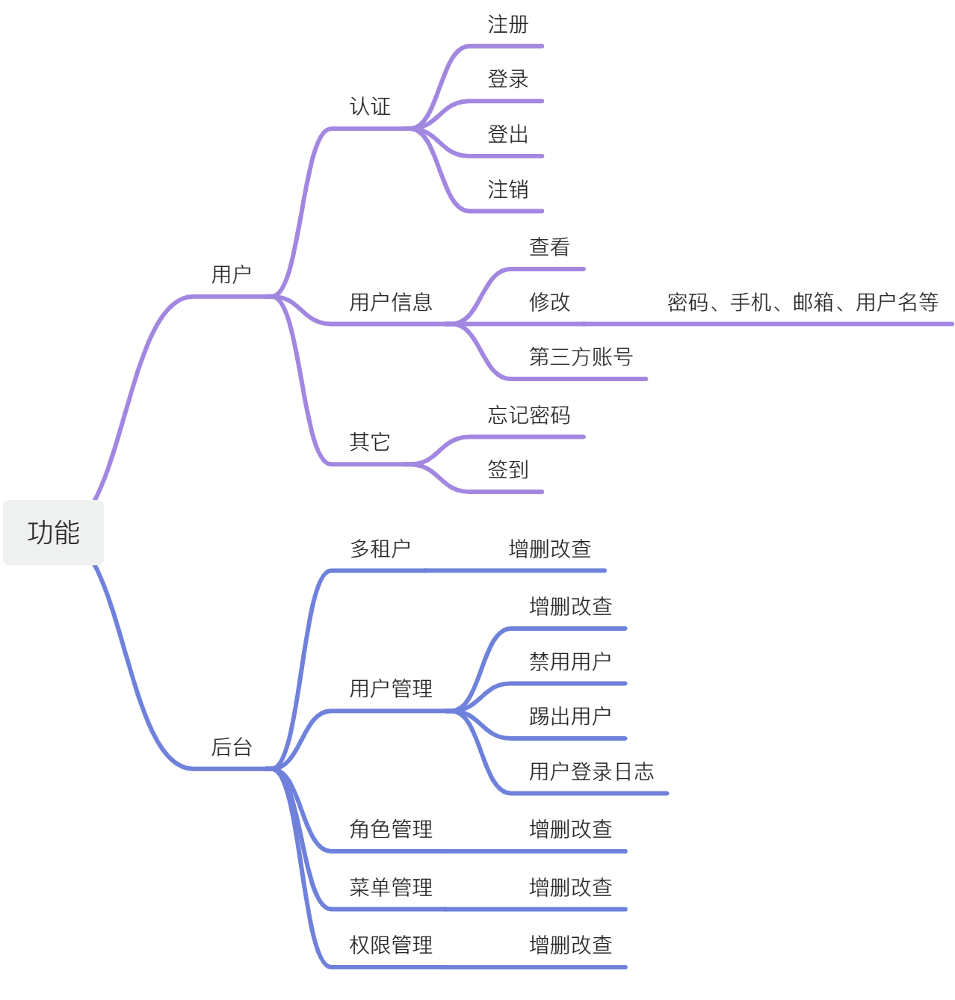
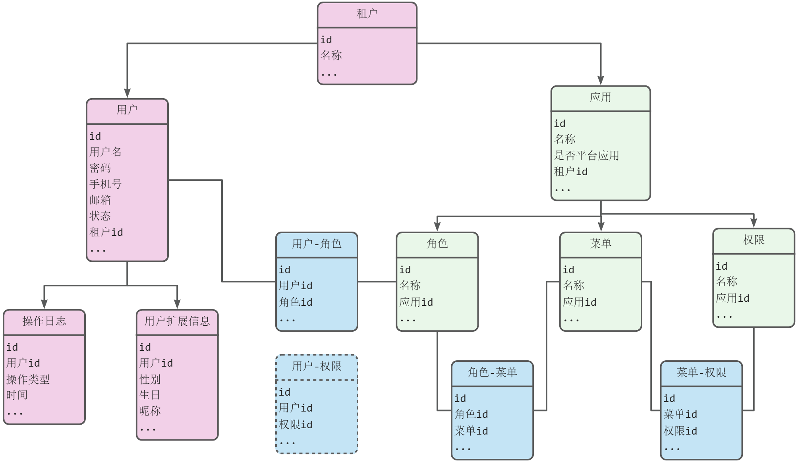
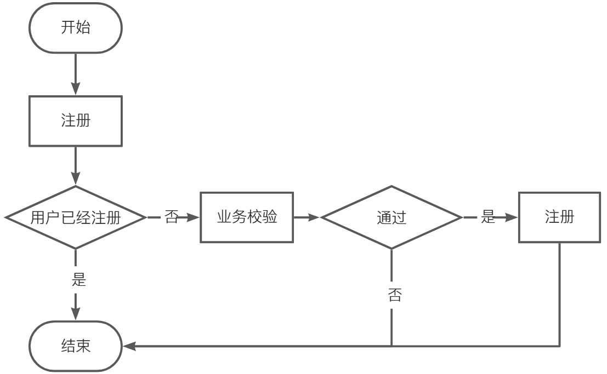
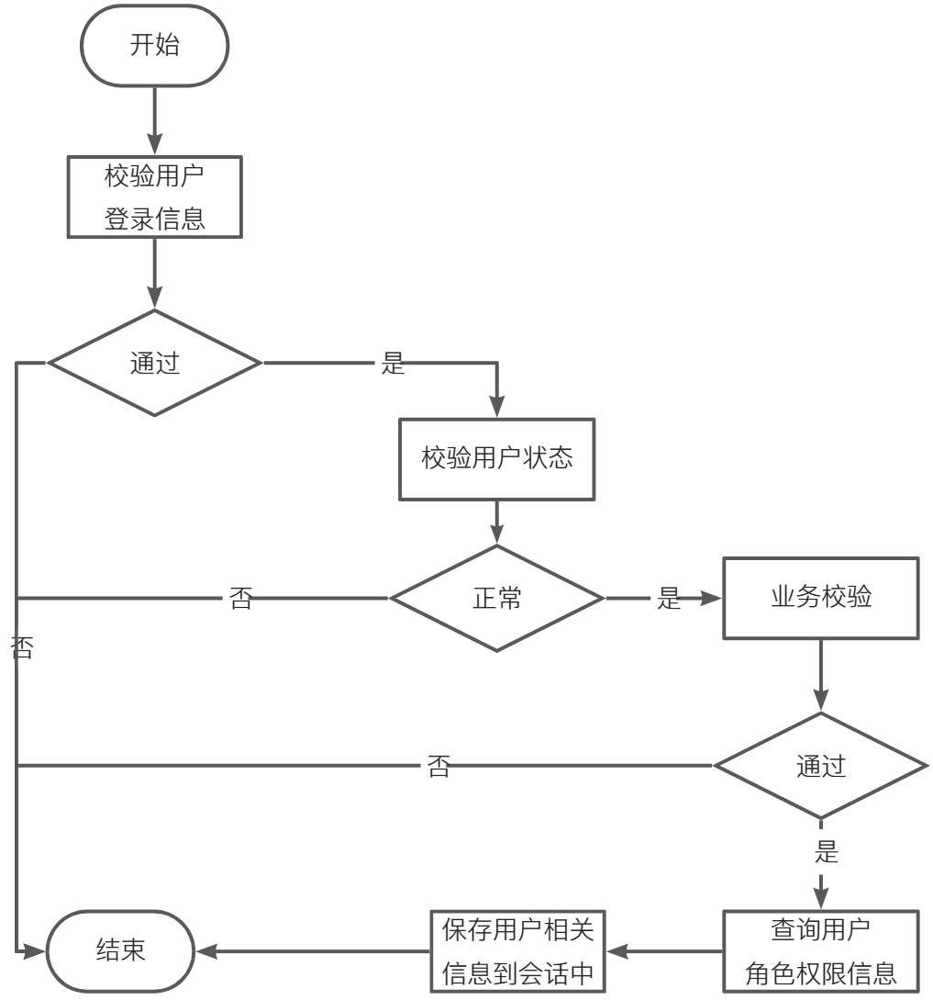
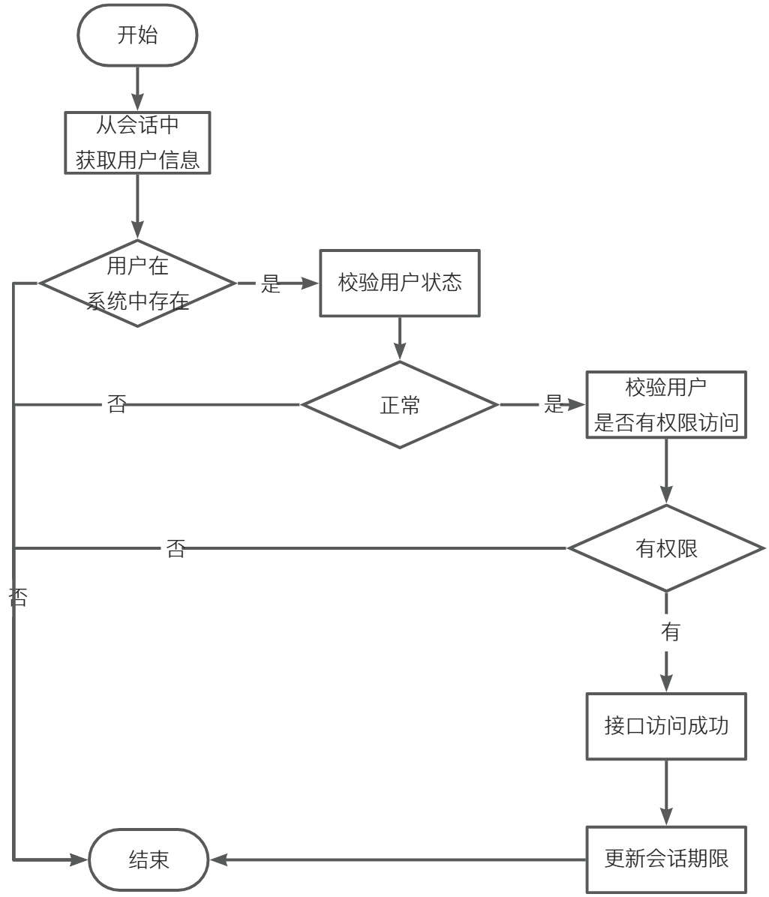
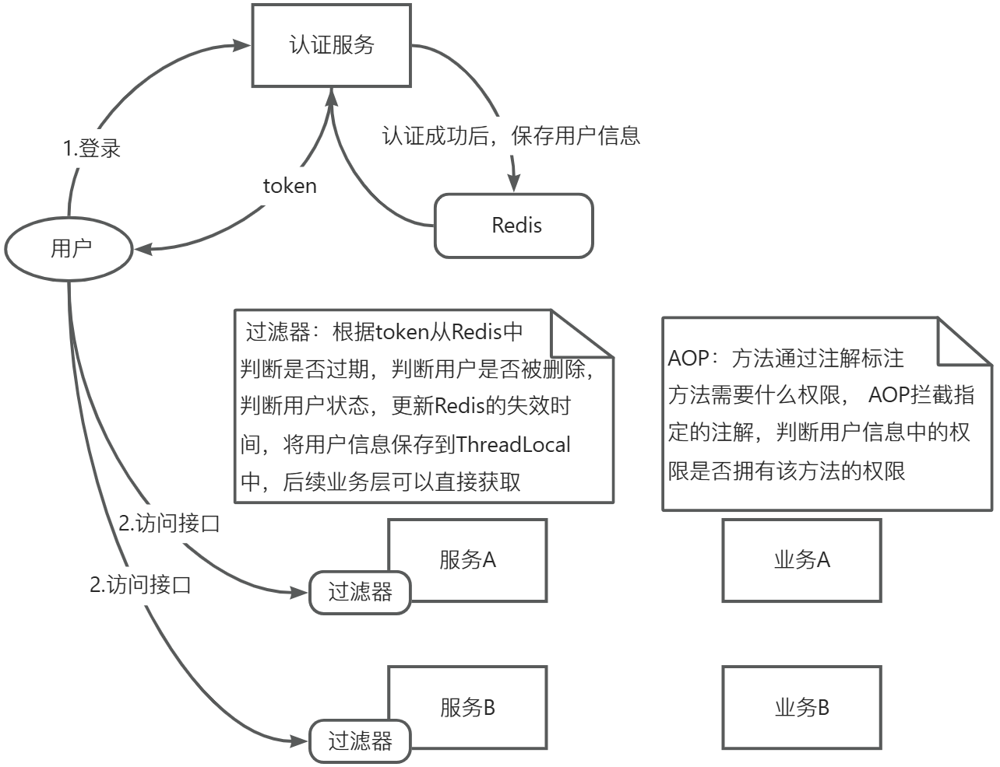
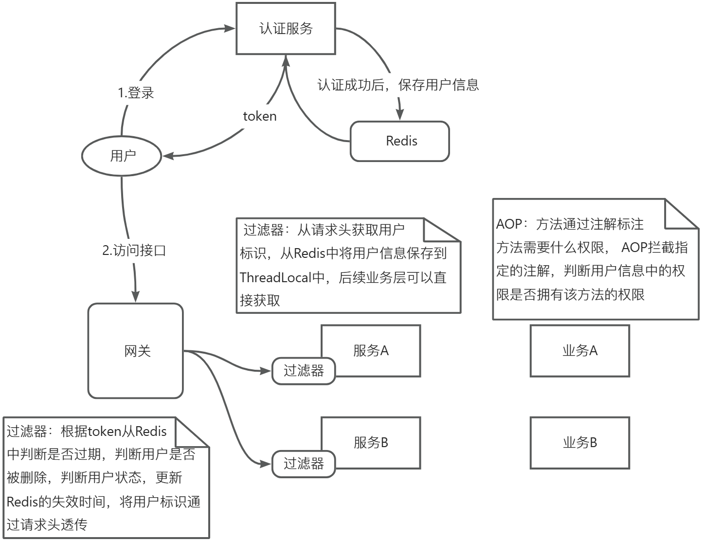

# 【总结】用户中心
## 前言
在我的职业生涯中，基本在待过的公司我都会负责用户中心相关的内容，区别就是负责的占比、技术实现、功能有所差别，但是要满足的业务需求是高度重合的，当然肯定不是100%一样的。  
所以我也将自己对这部分内容的理解和看法进行总结，可能不够全面或绝对正确，仅代表个人看法。

## 是什么
我这里先站在用户使用的角度，简单阐述用户使用的整个流程
1. 用户在我们的应用进行注册  
2. 用户进行登录  
3. 用户可以访问我们应用为其提供的功能，从而进行一系列的操作  
4. 用户进行登出   

用户中心，顾名思义主体就是用户，是用来管理用户数据的，同时要提供用户相关的功能。这里的功能我划分成两部分，一部分是直接面向使用我们应用的用户，一部分是面向我们的应用管理员，或者叫后台功能。  
  
上面是我根据过往负责的与用户中心相关项目抽象出来的核心功能，当然还有很多由上述衍生出来的功能，就不在上面体现  
我们从上面的功能中可以抽取出用户中心的核心就是要完成用户的认证、授权、用户管理  

### 认证
所谓认证，就是我的应用要知道你是谁，认证用户的身份。你是我应用的合法用户，才可以使用我的应用。其实就是我们的登录功能
### 授权
授权，就是我们授予用户相关权限，用户只能访问我们授予的部分，之外的部分是无权访问的。对于用户而言，就是能访问什么页面、菜单、按钮等这些肉眼可见的内容，对于我们应用而言，本质是能访问哪些接口
### 用户管理
用户是用户中心的主要数据，有了用户数据才能完成上述1和2的功能。从用户出发还会关联到其它数据，例如用户可以绑定一些第三方账号，由此带来的数据；为了实现授权的功能，还有角色、菜单、权限等数据。用户管理主要包括对上面数据的维护

## 业务对象模型
有了上面对用户中心功能的了解，下面将向大家展示用户中心主要的对象模型
  
下面对图中的个别对象进行解释  
租户：也称为客户，是实际使用我们平台的主体，通常来说可以是公司，或组织等。举个实际场景，比如我们公司是负责集团下的中台开发，其它兄弟公司或组织可以在我们平台上使用各中台的功能，他们在我们当中就是位于租户的地位。所以租户也是对资源进行隔离的一个重要体现，当然租户对于一些公司来说可能地位没到公司层面，也可以是公司下的组织等类似场景，甚至有些公司可能体系或模式并不需要应用到租户，这个是可选的  
> 对于多租户的实现模式：因为之前在工作中都是通过表字段进行实现的，所以我在编写的时候也去了解了一下具体的解决方案，大概有3种模式  
> ①基于独立数据库模式	  
> ②共享数据库但通过Schema隔离数据的架构    
> ③通过表字段进行隔离实现  
> 本质都是在不同维度对数据进行隔离，从左往右，成本依次降低，隔离性依次减弱
> 上面对象模型就是基于第③种实现的，对于中小型应用普遍选择此种方式  

用户：具体使用我们应用的人   
应用：对角色、菜单、权限等进行隔离的逻辑层，这个也是可选的  
图中左边：主要支撑认证  
图中右边：主要支撑授权，主要是基于RBAC权限模型的用户/角色/权限  

## 核心流程
注册：  
  
登录：  
  
授权：  

## 方案
### 用户认证信息
对于传统应用，我们一般都是会将用户认证通过后的用户信息存储到会话中，这里指的就是Session，Session是服务器提供的功能，本质就是web服务器应用的内存，需要与前端的cookie搭配使用。  
不过如果采用Session会话的方式，需要注意如果认证功能所在的服务是多节点的情况下，要考虑分布式环境下Session存在的问题。当登录请求访问的是节点1，认证通过后将用户信息保存到节点1，而授权请求访问的是节点2，就会导致找不到用户信息，授权校验不通过，接口访问失败  
可以通过以下方式进行处理：  
- 通过配置服务器Session同步功能。影响性能，扩展性差
- 粘性Session，认证在哪个节点，授权就在哪个节点。扩展性差
- 将Session用户信息存储到分布式存储，如Redis中。推荐  

随着移动互联网的发展，我们的应用支持的终端也越来越多，已不再局限于web应用，还包括App、小程序等载体。像此类应用的话，因为并没有像浏览器前端的cookie功能，所以如果还想要采用Session的方式存储用户信息的话，需要App和小程序等也实现类似cookie的功能，这也增大了开发成本  
所以对于存在多端的应用，我们一般采用token令牌的方式来存储用户信息，比如这个token可以是一个用户id，认证通过后将token返回给客户端，客户端将这个token存储起来，每次访问接口时都带上这个token，用于授权，本质是基于客户端存储的，token相比于Session也更适合实现SSO  
JWT就是对token的一个规范和实现，我们一般采用JWT来实现我们的认证信息的存储，此处就不对JWT进行展开，注意JWT不要存储核心敏感的用户数据已经大量用户数据，主要从安全和性能两方面考虑  
不过基于token的方式也存在因为它是存储在客户端的，所以当用户登出时，这个token需要客户端同时进行删除，但是不乏有一些非法操作，可能会拿到这个token请求我们的接口，即便用户已经登出的情况下，为了解决这个问题，我们一般仅会在token中存储用户标识，而将用户信息存储到Redis中，并通过用户标识进行数据操作，这样当用户登出后，Redis也会进行清除，如果用户还使用token进行访问的话则会因找不到用户信息而无法完成授权  
### 认证
一般会设计为一个独立的认证服务，认证即我们的登录接口，按业务完成编码即可，不过一般登录模块要考虑扩展性，因为登录方式随着时代发展一直都在增加，所以可以考虑使用策略模式进行编码  
另外也可以通过SpringSecurity登第三方认证相关框架完成功能，后文进行介绍  
### 授权
一般是在访问每个业务服务访问接口前要完成的功能，需要过滤器或者网关层+业务服务的业务层配合完成，当访问我们的接口时，会先经过过滤器或网关层，需要对token进行校验并使用token中的用户标识查询Redis中的用户信息，校验用户是否存在，状态正常等，如果是在网关层处理，通过请求头继续用户标识透传到业务服务，业务服务再通过另一个过滤器从Redis中查询出用户信息保存到业务服务的上下文中，方便后续用户信息的获取。  
授权的校验通常基于AOP进行实现，我们通过注解标识相关方法需要哪些权限或通过一套规则约定好权限表达式，比如权限命名编码时，按服务名:类名:方法名这样的方式，那AOP代理的逻辑就是判断用户信息中是否拥有该权限，有才允许访问  
另外也可以通过SpringSecurity等第三方认证相关框架完成功能，后文进行介绍  

模式一：
  
模式二：
  
模式一的认证和授权可以通过SpringSecurity的框架进行实现，本质是基于过滤器，通过加入我们自定义的认证过滤器和授权过滤器实现  
模式二的认证可以通过Security的框架进行实现，授权可以统一放到网关进行处理，因为网关本身也是基于过滤器的，所以可以考虑不用SpringSecurity  

### token的续期
token的续期需要根据实际的场景采用不用的实现  
场景一：token从创建之后，有效期保持不变，到期则用户需要重新认证  
这种最简单，只要授权时正常校验token的期限就行  

场景二：token创建之后，随着用户的操作，token的有效期随着延长，直到用户没再操作，则token按期限正常过期  
这种可以通过每次请求后对token进行续期来实现，可以在网关层进行统一处理  

场景三：用户在线，长时间使用我们的应用，即便是token过期后用户还可以正常访问
这种可以通过以下方式进行解决  
- 后台在授权判断用户的token过期时，返回一个新的token给到客户端，客户端检查到后台返回了新的token则替换本地的token（也可以由客户端检测到接口返回token过期后主动调用刷新token接口拿到新的token后再重新发起请求），同时后端在校验token过期时，可以判断这个token的失效时间是否已经超过了需要重新登录的阈值，如果达到则返回token已过期
- 由前端定时触发刷新token的接口，保证token不过期，刷新token接口也同上面一样，判断这个token的失效时间是否已经超过了需要重新登录的阈值，如果达到则返回token已过期，实现如果长时间未使用则重新登录的效果
- 采用双token的方式，除了token之外，还有一个用于刷新的refresh_token，refresh_token的有效期即用户多久未使用需要重新登录的期限，当认证成功后除了返回token外，还会返回一个refresh_token，客户端检测到接口返回token过期后通过refresh_token进行token刷新，如果刷新失败则需要重新登录，如果刷新成功则替换客户端本地的token再发起请求  

我也对市面上的一些小程序抓过包，有些基本就是把token的过期时间设置为较大的值，保证在很长一段时间内不过期  
注意的点：token刷新我们还要考虑一个问题就是并发，因为客户端的请求很多时候都是并行的或异步的，所以假如在token过期时，同时触发了多个请求，那不管是由后端主动刷新token还是前端触发都会有并发问题  
> 这会导致我们会产生多个新的token给到客户端，客户端会存储其中的一个，假如后端不会对token进行相关的缓存的话，那其实也没什么问题，反正这些token不管哪个都能用，但是如果做了缓存，就会导致缓存种有很多垃圾数据，如果用户多而且并行的请求多的话，还是很浪费空间的    
> 而且如果是采用双token方式的话，当使用refresh_token刷新token成功后，其它请求将无法继续使用refresh_token进行刷新，这是最严重的  

所以我们最好是做好并发控制，对某个刷新的token加锁，我们这里介绍另一种方法，就是由前端主动触发刷新token，前端根据token的过期时间，在过期前的几分钟调用刷新token的接口  

## 实现
实现的话可以自己编码完成整体的流程，好处就是流程细节我们可以很清楚，但是工作量大，另一种就是使用第三方的框架，开发快速好扩展，但是对开发人员的技术要求比较高，因为很多流程和细节等都被框架封装好了，如果不动这块的人很难在短时间内快速上手，而且如果遇到一些需要定制的内容，很多时候需要我们对源码进行改造  
这里顺带提一下，像开源的Oauth2.0协议除了用在第三方应用访问其它服务资源的场景下，也可以用在认证授权的场景中，组要是基于用户密码模式  

## 第三方登录
### 基于OAuth2.0协议
待更新