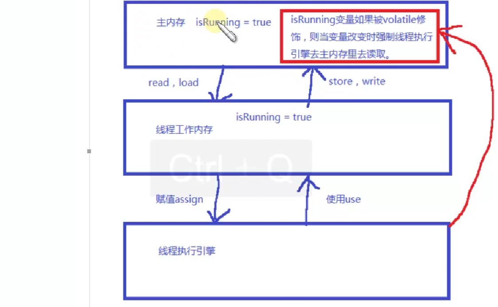

### java多线程基本知识
#### 进程介绍
```
不管是我们开发的应用程序，还是我们运行的其他的应用程序，都需要先把程序安装在本地的硬盘上。然后找到这个程序的启动文件，启动程序的时候，其实是电脑把当前的这个程序加载到内存中，在内存中需要给当前的程序分配一段独立的运行空间。这片空间就专门负责当前这个程序的运行。
不同的应用程序运行的过程中都需要在内存中分配自己独立的运行空间，彼此之间不会相互的影响。我们把每个独立应用程序在内存的独立空间称为当前应用程序运行的一个进程。
进程：它是内存中的一段独立的空间，可以负责当前应用程序的运行。当前这个进程负责调度当前程序中的所有运行细节。
```
#### 线程介绍
```
启动的QQ聊天软件，需要和多个人进行聊天。这时多个人之间是不能相互影响，但是它们都位于当前QQ这个软件运行时所分配的内容的独立空间中。
	在一个进程中，每个独立的功能都需要独立的去运行，这时又需要把当前这个进程划分成多个运行区域，每个独立的小区域（小单元）称为一个线程。
线程：它是位于进程中，负责当前进程中的某个具备独立运行资格的空间。
进程是负责整个程序的运行，而线程是程序中具体的某个独立功能的运行。一个进程中至少应该有一个线程。
```
#### 多线程介绍
```
现在的操作系统基本都是多用户，多任务的操作系统。每个任务就是一个进程。而在这个进程中就会有线程。
真正可以完成程序运行和功能的实现靠的是进程中的线程。
多线程：在一个进程中，我们同时开启多个线程，让多个线程同时去完成某些任务（功能）。
多线程的目的：提高程序的运行效率。
```
#### 多线程运行的原理
```
cpu在线程中做时间片的切换。
其实真正电脑中的程序的运行不是同时在运行的。CPU负责程序的运行，而CPU在运行程序的过程中某个时刻点上，它其实只能运行一个程序。而不是多个程序。而CPU它可以在多个程序之间进行高速的切换。而切换频率和速度太快，导致人的肉看看不到。
每个程序就是进程， 而每个进程中会有多个线程，而CPU是在这些线程之间进行切换。
了解了CPU对一个任务的执行过程，我们就必须知道，多线程可以提高程序的运行效率，但不能无限制的开线程。
```

```
多进程的意义?
	提高CPU的使用率
多线程的意义?
	提高应用程序的使用率

Java程序的运行原理及JVM的启动是多线程的吗?
		A:Java命令去启动JVM，JVM会启动一个进程，该进程会启动一个主线程。
		B:JVM的启动是多线程的，因为它最低有两个线程启动了，主线程和垃圾回收线程。
```

#### 实现线程的两种方式
1、继承Thread的原理
```java
import java.util.Random;

public class MyThreadWithExtends extends Thread {
	String flag;

	public MyThreadWithExtends(String flag){
		this.flag = flag;
	}

	@Override
	public void run() {
		String tname = Thread.currentThread().getName();
		System.out.println(tname+"线程的run方法被调用……");
		Random random = new Random();
		for(int i=0;i<20;i++){
			try {
				Thread.sleep(random.nextInt(10)*100);
				System.out.println(tname+ "...."+ flag);
			} catch (InterruptedException e) {
				e.printStackTrace();
			}
		}
	}

	public static void main(String[] args) {
		Thread thread1 = new MyThreadWithExtends("a");
		Thread thread2 = new MyThreadWithExtends("b");
		thread1.start();
		thread2.start();
		/**
		 * 如果是调用thread的run方法，则只是一个普通的方法调用，不会开启新的线程
		 */
//		thread1.run();
//		thread2.run();
	}
}
```
2、声明实现 Runnable 接口的类
```java
public class MyThreadWithImpliment implements Runnable {
	int x;

	public MyThreadWithImpliment(int x) {
		this.x = x;
	}

	@Override
	public void run() {
		String name = Thread.currentThread().getName();
		System.out.println("线程" + name + "的run方法被调用……");
		for (int i = 0; i < 10; i++) {
			System.out.println(x);
			try {
				Thread.sleep(100);

			} catch (InterruptedException e) {
				e.printStackTrace();
			}
		}
	}

	public static void main(String[] args) {
		Thread thread1 = new Thread(new MyThreadWithImpliment(1), "thread-1");
		Thread thread2 = new Thread(new MyThreadWithImpliment(2), "thread-2");
		 thread1.start();
		 thread2.start();
		// 注意调用run和调用start的区别,直接调用run，则都运行在main线程中
//		thread1.run();
//		thread2.run();
	}
}
```
### synchronized
```java
public class MySynchronized {
	public static void main(String[] args) {
		final MySynchronized mySynchronized = new MySynchronized();
		final MySynchronized mySynchronized2 = new MySynchronized();
		new Thread("thread1") {
			public void run() {
				synchronized (mySynchronized) {
				try {
					System.out.println(this.getName()+" start");
					int i =1/0;   //如果发生异常，jvm会将锁释放
					Thread.sleep(5000);
					System.out.println(this.getName()+"醒了");
					System.out.println(this.getName()+" end");
				} catch (InterruptedException e) {
					e.printStackTrace();
				}
				}
			}
		}.start();
		new Thread("thread2") {
			public void run() {
				synchronized (mySynchronized) {         //争抢同一把锁时，线程1没释放之前，线程2只能等待
//					synchronized (mySynchronized2) {    //如果不是一把锁，可以看到两句话同时打印
					System.out.println(this.getName()+" start");
					System.out.println(this.getName()+" end");

				}
			}
		}.start();
	}
}
```

### 线程的调度和优先级问题
```java
A:线程的调度
	a:分时调度
	b:抢占式调度 (Java采用的是该调度方式)
B:获取和设置线程优先级
public final int getPriority():返回线程对象的优先级
public final void setPriority(int newPriority)：更改线程的优先级。
	a:默认是5
	b:范围是1-10
```

### 线程的控制(常见方法)
```java
public final String getName():获取线程的名称。
public final void setName(String name):设置线程的名称
public static Thread currentThread():返回当前正在执行的线程对象
Thread.currentThread().getName()

A:休眠线程
	public static void sleep(long millis)  在run方法中调用Thread.sleep()
B:加入线程
	 public final void join():等待该线程终止。
C:礼让线程
	public static void yield():暂停当前正在执行的线程对象，并执行其他线程。在run方法中调用Thread.yield()
D:后台线程
	public final void setDaemon(boolean on):
将该线程标记为守护线程或用户线程。当正在运行的线程都是守护线程时，Java虚拟机退出。该方法必须在启动线程前调用。
E:终止线程(掌握)
public final void stop():让线程停止，太暴力，过时了，但是还可以使用。
public void interrupt():中断线程。 把线程的状态终止，并抛出一个InterruptedException。
```

### 线程组
```java
把多个线程组合到一起。
它可以对一批线程进行分类管理，Java允许程序直接对线程组进行控制。

线程默认情况下属于main线程组
线程类里面的方法：public final ThreadGroup getThreadGroup()
		  Thread(ThreadGroup group, Runnable target, String name)
线程组里面的方法：public final String getName()
线程组的构造方法：ThreadGroup(String name)
		  ThreadGroup tg = new ThreadGroup("这是一个新的组");

//通过组名称设置后台线程，表示该组的线程都是后台线程
tg.setDaemon(true);
```

### 线程安全
```java
import java.util.concurrent.atomic.AtomicInteger;

/**
 * 线程安全概念：当多个线程访问某一个类（对象或方法）时，这个对象始终都能表现出正确的行为，那么这个类（对象或方法）就是线程安全的。
 * synchronized：可以在任意对象及方法上加锁，而加锁的这段代码称为"互斥区"或"临界区"
 *
 */
public class MyThread extends Thread{

	private int count = 5 ;

	//synchronized加锁
	public void run(){
		count--;
		System.out.println(this.currentThread().getName() + " count = "+ count);
	}

	public static void main(String[] args) {
		/**
		 * 分析：当多个线程访问myThread的run方法时，以排队的方式进行处理（这里排对是按照CPU分配的先后顺序而定的），
		 * 		一个线程想要执行synchronized修饰的方法里的代码：
		 * 		1 尝试获得锁
		 * 		2 如果拿到锁，执行synchronized代码体内容；拿不到锁，这个线程就会不断的尝试获得这把锁，直到拿到为止，
		 * 		   而且是多个线程同时去竞争这把锁。（也就是会有锁竞争的问题）
		 */
		MyThread myThread = new MyThread();
		Thread t1 = new Thread(myThread,"t1");
		Thread t2 = new Thread(myThread,"t2");
		Thread t3 = new Thread(myThread,"t3");
		Thread t4 = new Thread(myThread,"t4");
		Thread t5 = new Thread(myThread,"t5");
		t1.start();
		t2.start();
		t3.start();
		t4.start();
		t5.start();
	}
}
```
```
t1 count = 2
t5 count = 0
t4 count = 1
t3 count = 2
t2 count = 2
```

### 多个线程多个锁
多个线程多个锁，多个线程，每个线程都可以拿到自己指定的锁，分别获得锁之后，执行synchronized方法体的内容。
```java
/**
 * 关键字synchronized取得的锁都是对象锁，而不是把一段代码（方法）当做锁，
 * 所以代码中哪个线程先执行synchronized关键字的方法，哪个线程就持有该方法所属对象的锁（Lock），
 * 两个对象，线程获得的就是两个不同的锁，他们互不影响。
 *
 * 在静态方法上加synchronized关键字，表示锁定.class类，类一级别的锁（独占.class类）。
 *
 */
public class MultiThread {

	private int num = 0;

	/** static */
	public synchronized void printNum(String tag){
		try {

			if(tag.equals("a")){
				num = 100;
				System.out.println("tag a, set num over!");
				Thread.sleep(1000);
			} else {
				num = 200;
				System.out.println("tag b, set num over!");
			}

			System.out.println("tag " + tag + ", num = " + num);

		} catch (InterruptedException e) {
			e.printStackTrace();
		}
	}

	//注意观察run方法输出顺序
	public static void main(String[] args) {

		//俩个不同的对象
		final MultiThread m1 = new MultiThread();
		final MultiThread m2 = new MultiThread();

		Thread t1 = new Thread(new Runnable() {
			@Override
			public void run() {
				m1.printNum("a");
			}
		});

		Thread t2 = new Thread(new Runnable() {
			@Override
			public void run() {
				m2.printNum("b");
			}
		});

		t1.start();
		t2.start();
	}
}
```
```
tag a, set num over!
tag b, set num over!
tag b, num = 200
tag a, num = 100
```

### 对象锁的同步和异步
同步：synchronized
同步的概念就是共享，我们要牢牢记住“共享”这两个字，如果不是共享的资源，就没有必要进行同步。
异步：asynchronized
异步的概念就是独立，相互之间不受任何制约。就好像我们学习http的时候，在页面发起的ajax请求，我们还可以继续浏览
或操作页面的内容，二者之间没有任何关系。
同步的目的就是为了线程安全，其实对于线程安全来说，需要猫满足两个特性。
原子性（同步）
可见性
```java
/**
 * 对象锁的同步和异步问题
 *
 */
public class MyObject {
	public synchronized void method1(){
		try {
			System.out.println(Thread.currentThread().getName());
			Thread.sleep(4000);
		} catch (InterruptedException e) {
			e.printStackTrace();
		}
	}

	/** synchronized */
	public void method2(){
			System.out.println(Thread.currentThread().getName());
	}

	public static void main(String[] args) {
		final MyObject mo = new MyObject();

		/**
		 * 分析：
		 * t1线程先持有object对象的Lock锁，t2线程可以以异步的方式调用对象中的非synchronized修饰的方法
		 * t1线程先持有object对象的Lock锁，t2线程如果在这个时候调用对象中的同步（synchronized）方法则需等待，也就是同步
		 */
		Thread t1 = new Thread(new Runnable() {
			@Override
			public void run() {
				mo.method1();
			}
		},"t1");

		Thread t2 = new Thread(new Runnable() {
			@Override
			public void run() {
				mo.method2();
			}
		},"t2");

		t1.start();
		t2.start();
	}
}
```
```
t1
t2 （立即打印）
```

### 脏读
对于对象的同步和异步的方法,我们在设计自己的程序的时候,一定要考虑问题的整体,不然就会出现数据不一致的错误,很经典的错误藏是讲读(dirtyread)
```java
/**
 * 在我们对一个对象的方法加锁的时候,需要考虑业务的整体性,即为setValueigetvalue方法同时加链synchronized同步关键字,
 * 保证业务(service)的原子性,不然会出现业务错误(也从侧面保证业务的一致性) .
 */
public class DirtyRead {
	private String username = "bjsxt";
	private String password = "123";

	public synchronized void setValue(String username, String password){
		this.username = username;

		try {
			Thread.sleep(2000);
		} catch (InterruptedException e) {
			e.printStackTrace();
		}

		this.password = password;
		System.out.println("setValue最终结果：username = " + username + " , password = " + password);
	}

	public void getValue(){
		System.out.println("getValue方法得到：username = " + this.username + " , password = " + this.password);
	}

	public static void main(String[] args) throws Exception{
		final DirtyRead dr = new DirtyRead();
		Thread t1 = new Thread(new Runnable() {
			@Override
			public void run() {
				dr.setValue("z3", "456");
			}
		});
		t1.start();
		Thread.sleep(1000);

		dr.getValue();
	}
}
```
```
getValue方法得到：username = z3 , password = 123
setValue最终结果：username = z3 , password = 456
```

### synchronized锁重入:
关键字synchronized拥有锁重入的功能,也就是在使用synchronized时,当一个线程得到了一个对象的锁后,
再次请求此对象时是可以再次得到该对象的锁。
```java
/**
 * synchronized的重入
 *
 */
public class SyncDubbo1 {
	public synchronized void method1(){
		System.out.println("method1..");
		method2();
	}
	public synchronized void method2(){
		System.out.println("method2..");
		method3();
	}
	public synchronized void method3(){
		System.out.println("method3..");
	}

	public static void main(String[] args) {
		final SyncDubbo1 sd = new SyncDubbo1();
		Thread t1 = new Thread(new Runnable() {
			@Override
			public void run() {
				sd.method1();
			}
		});
		t1.start();
	}
}
```
```java
/**
 * synchronized的重入
 *
 */
public class SyncDubbo2 {
	static class Main {
		public int i = 10;
		public synchronized void operationSup(){
			try {
				i--;
				System.out.println("Main print i = " + i);
				Thread.sleep(100);
			} catch (InterruptedException e) {
				e.printStackTrace();
			}
		}
	}

	static class Sub extends Main {
		public synchronized void operationSub(){
			try {
				while(i > 0) {
					i--;
					System.out.println("Sub print i = " + i);
					Thread.sleep(100);
					this.operationSup();
				}
			} catch (InterruptedException e) {
				e.printStackTrace();
			}
		}
	}

	public static void main(String[] args) {
		Thread t1 = new Thread(new Runnable() {
			@Override
			public void run() {
				Sub sub = new Sub();
				sub.operationSub();
			}
		});
		t1.start();
	}
}
```
对于web应用程序,异常释放锁的情况,如果不及时处理,很可能对你的应用程序业务逻辑产生严重的错误,
比如你现在执行一个队列任务,很多对象都去在等特第一个对象正确执行完毕再去释放锁,但是第一个对象由于异常的出现,
导致业务逻辑没有正常执行完毕,就释放了锁,那么可把而知后续的对象执行的都是错误的逻钱.
所以这一点一定要引起注意,在编写代码的时候,一定要考虑剧全.
```java
/**
 * synchronized异常
 *
 */
public class SyncException {
	private int i = 0;
	public synchronized void operation(){
		while(true){
			try {
				i++;
				Thread.sleep(100);
				System.out.println(Thread.currentThread().getName() + " , i = " + i);
				if(i == 20){
					//Integer.parseInt("a");
					throw new RuntimeException();
				}
			} catch (InterruptedException e) {
				e.printStackTrace();
			}
		}
	}

	public static void main(String[] args) {
		final SyncException se = new SyncException();
		Thread t1 = new Thread(new Runnable() {
			@Override
			public void run() {
				se.operation();
			}
		},"t1");
		t1.start();
	}
}
```

### synchronized代码块
使用syhchronized声明的方法在某些情况下是有弊端的,比如A线程调用同步的方法执行一个很长时间的任务,
那么B找程就必须等待比较长的时间才能执行,这样的情况下可以使用synchronized代码块去优化代码执行时间,
也就是通常所说的减小锁的粒度。
```java
/**
 * 使用synchronized代码块减小锁的粒度，提高性能
 *
 */
public class Optimize {
	public void doLongTimeTask(){
		try {
			System.out.println("当前线程开始：" + Thread.currentThread().getName() +
					", 正在执行一个较长时间的业务操作，其内容不需要同步");
			Thread.sleep(2000);

			synchronized(this){
				System.out.println("当前线程：" + Thread.currentThread().getName() +
					", 执行同步代码块，对其同步变量进行操作");
				Thread.sleep(1000);
			}
			System.out.println("当前线程结束：" + Thread.currentThread().getName() +
					", 执行完毕");

		} catch (InterruptedException e) {
			e.printStackTrace();
		}
	}

	public static void main(String[] args) {
		final Optimize otz = new Optimize();
		Thread t1 = new Thread(new Runnable() {
			@Override
			public void run() {
				otz.doLongTimeTask();
			}
		},"t1");
		Thread t2 = new Thread(new Runnable() {
			@Override
			public void run() {
				otz.doLongTimeTask();
			}
		},"t2");
		t1.start();
		t2.start();

	}
}
```
synchronized可以使用任意的Object进行加锁,用法比较灵活.
```java
/**
 * 使用synchronized代码块加锁,比较灵活
 *
 */
public class ObjectLock {
	public void method1(){
		synchronized (this) {	//对象锁
			try {
				System.out.println("do method1..");
				Thread.sleep(2000);
			} catch (InterruptedException e) {
				e.printStackTrace();
			}
		}
	}

	public void method2(){		//类锁
		synchronized (ObjectLock.class) {
			try {
				System.out.println("do method2..");
				Thread.sleep(2000);
			} catch (InterruptedException e) {
				e.printStackTrace();
			}
		}
	}

	private Object lock = new Object();
	public void method3(){		//任何对象锁
		synchronized (lock) {
			try {
				System.out.println("do method3..");
				Thread.sleep(2000);
			} catch (InterruptedException e) {
				e.printStackTrace();
			}
		}
	}

	public static void main(String[] args) {
		final ObjectLock objLock = new ObjectLock();
		Thread t1 = new Thread(new Runnable() {
			@Override
			public void run() {
				objLock.method1();
			}
		});
		Thread t2 = new Thread(new Runnable() {
			@Override
			public void run() {
				objLock.method2();
			}
		});
		Thread t3 = new Thread(new Runnable() {
			@Override
			public void run() {
				objLock.method3();
			}
		});

		t1.start();
		t2.start();
		t3.start();
	}
}
```
另外特别注意一个问题,就是不要使用String的常量加锁,会出现死循环问题
因为在JVM中具有String常量池(如果两个String具有相同的值，那么他们的地址是相同的，都保存在这个常量池中)。
当以String作为锁的时候，如果值相同则，那么线程持有相同的锁。这样就造成了另外一个线程不能执行

锁对象的改变问题,当使用一个对象进行加锁的时候,
要注意对象本身发生改变的时候那么持有的镜就不同,如果对象本身不发生改变,那么依然是同步的,即使是对象的属性发生了改变。

死锁问题
```java
/**
 * 死锁问题，在设计程序时就应该避免双方相互持有对方的锁的情况
 *
 */
public class DeadLock implements Runnable{
	private String tag;
	private static Object lock1 = new Object();
	private static Object lock2 = new Object();

	public void setTag(String tag){
		this.tag = tag;
	}

	@Override
	public void run() {
		if(tag.equals("a")){
			synchronized (lock1) {
				try {
					System.out.println("当前线程 : "  + Thread.currentThread().getName() + " 进入lock1执行");
					Thread.sleep(2000);
				} catch (InterruptedException e) {
					e.printStackTrace();
				}
				synchronized (lock2) {
					System.out.println("当前线程 : "  + Thread.currentThread().getName() + " 进入lock2执行");
				}
			}
		}
		if(tag.equals("b")){
			synchronized (lock2) {
				try {
					System.out.println("当前线程 : "  + Thread.currentThread().getName() + " 进入lock2执行");
					Thread.sleep(2000);
				} catch (InterruptedException e) {
					e.printStackTrace();
				}
				synchronized (lock1) {
					System.out.println("当前线程 : "  + Thread.currentThread().getName() + " 进入lock1执行");
				}
			}
		}
	}

	public static void main(String[] args) {
		DeadLock d1 = new DeadLock();
		d1.setTag("a");
		DeadLock d2 = new DeadLock();
		d2.setTag("b");

		Thread t1 = new Thread(d1, "t1");
		Thread t2 = new Thread(d2, "t2");

		t1.start();
		try {
			Thread.sleep(500);
		} catch (InterruptedException e) {
			e.printStackTrace();
		}
		t2.start();
	}
}
```

### synchronized的缺陷
```
synchronized是java中的一个关键字，也就是说是Java语言内置的特性。
如果一个代码块被synchronized修饰了，当一个线程获取了对应的锁，并执行该代码块时，其他线程便只能一直等待，等待获取锁的线程释放锁，而这里获取锁的线程释放锁只会有两种情况：
1）获取锁的线程执行完了该代码块，然后线程释放对锁的占有；
2）线程执行发生异常，此时JVM会让线程自动释放锁。

例子1：
　　如果这个获取锁的线程由于要等待IO或者其他原因（比如调用sleep方法）被阻塞了，但是又没有释放锁，其他线程便只能干巴巴地等待，试想一下，这多么影响程序执行效率。
　　因此就需要有一种机制可以不让等待的线程一直无期限地等待下去（比如只等待一定的时间或者能够响应中断），通过Lock就可以办到。
例子2：
当有多个线程读写文件时，读操作和写操作会发生冲突现象，写操作和写操作会发生冲突现象，但是读操作和读操作不会发生冲突现象。
　　但是采用synchronized关键字来实现同步的话，就会导致一个问题：
如果多个线程都只是进行读操作，当一个线程在进行读操作时，其他线程只能等待无法进行读操作。

因此就需要一种机制来使得多个线程都只是进行读操作时，线程之间不会发生冲突，通过Lock就可以办到。
另外，通过Lock可以知道线程有没有成功获取到锁。这个是synchronized无法办到的。
总的来说，也就是说Lock提供了比synchronized更多的功能。
```

### lock
#### lock和synchronized的区别
```
1）Lock不是Java语言内置的，synchronized是Java语言的关键字，因此是内置特性。Lock是一个类，通过这个类可以实现同步访问；
2）Lock和synchronized有一点非常大的不同，采用synchronized不需要用户去手动释放锁，当synchronized方法或者synchronized代码块执行完之后，系统会自动让线程释放对锁的占用；而Lock则必须要用户去手动释放锁，如果没有主动释放锁，就有可能导致出现死锁现象。
```
#### lock
```java
public interface Lock {
    void lock();
    void lockInterruptibly() throws InterruptedException;
    boolean tryLock();
    boolean tryLock(long time, TimeUnit unit) throws InterruptedException;
    void unlock();
}
```
Lock接口中每个方法的使用：
lock()、tryLock()、tryLock(long time, TimeUnit unit)、lockInterruptibly()是用来获取锁的。unLock()方法是用来释放锁的。
四个获取锁方法的区别：
lock()方法是平常使用得最多的一个方法，就是用来获取锁。如果锁已被其他线程获取，则进行等待。
由于在前面讲到如果采用Lock，必须主动去释放锁，并且在发生异常时，不会自动释放锁。因此一般来说，使用Lock必须在try{}catch{}块中进行，并且将释放锁的操作放在finally块中进行，以保证锁一定被被释放，防止死锁的发生。
tryLock()方法是有返回值的，它表示用来尝试获取锁，如果获取成功，则返回true，如果获取失败（即锁已被其他线程获取），则返回false，也就说这个方法无论如何都会立即返回。在拿不到锁时不会一直在那等待。
tryLock(long time, TimeUnit unit)方法和tryLock()方法是类似的，只不过区别在于这个方法在拿不到锁时会等待一定的时间，在时间期限之内如果还拿不到锁，就返回false。如果如果一开始拿到锁或者在等待期间内拿到了锁，则返回true。
lockInterruptibly()方法比较特殊，当通过这个方法去获取锁时，如果线程正在等待获取锁，则这个线程能够响应中断，即中断线程的等待状态。也就使说，当两个线程同时通过lock.lockInterruptibly()想获取某个锁时，假若此时线程A获取到了锁，而线程B只有在等待，那么对线程B调用threadB.interrupt()方法能够中断线程B的等待过程。
注意，当一个线程获取了锁之后，是不会被interrupt()方法中断的。
因此当通过lockInterruptibly()方法获取某个锁时，如果不能获取到，只有进行等待的情况下，是可以响应中断的。
而用synchronized修饰的话，当一个线程处于等待某个锁的状态，是无法被中断的，只有一直等待下去。

#### ReentrantLock
直接使用lock接口的话，我们需要实现很多方法，不太方便，ReentrantLock是唯一实现了Lock接口的类，并且ReentrantLock提供了更多的方法，ReentrantLock，意思是“可重入锁”。
```java
import java.util.ArrayList;
import java.util.concurrent.locks.Lock;
import java.util.concurrent.locks.ReentrantLock;

public class MyLockTest {
	private static ArrayList<Integer> arrayList = new ArrayList<Integer>();
	static Lock lock = new ReentrantLock(); // 注意这个地方
	public static <E> void main(String[] args) {
		new Thread() {
			public void run() {
				Thread thread = Thread.currentThread();

				lock.lock();
				try {
					System.out.println(thread.getName() + "得到了锁");
					for (int i = 0; i < 5; i++) {
						arrayList.add(i);
					}
				} catch (Exception e) {
					// TODO: handle exception
				} finally {
					System.out.println(thread.getName() + "释放了锁");
					lock.unlock();
				}

			};
		}.start();

		new Thread() {
			public void run() {
				Thread thread = Thread.currentThread();
				lock.lock();
				try {
					System.out.println(thread.getName() + "得到了锁");
					for (int i = 0; i < 5; i++) {
						arrayList.add(i);
					}
				} catch (Exception e) {
					// TODO: handle exception
				} finally {
					System.out.println(thread.getName() + "释放了锁");
					lock.unlock();
				}

			};
		}.start();
	}
}
```
```java
import java.util.ArrayList;
import java.util.concurrent.locks.Lock;
import java.util.concurrent.locks.ReentrantLock;

/**
 * 观察现象：一个线程获得锁后，另一个线程取不到锁，不会一直等待
 *
 */
public class MyTryLock {
	private static ArrayList<Integer> arrayList = new ArrayList<Integer>();
	static Lock lock = new ReentrantLock(); // 注意这个地方
	public static void main(String[] args) {

		new Thread() {
			public void run() {
				Thread thread = Thread.currentThread();
				boolean tryLock = lock.tryLock();
				System.out.println(thread.getName()+" "+tryLock);
				if (tryLock) {
					try {
						System.out.println(thread.getName() + "得到了锁");
						for (int i = 0; i < 5; i++) {
							arrayList.add(i);
						}
					} catch (Exception e) {
						// TODO: handle exception
					} finally {
						System.out.println(thread.getName() + "释放了锁");
						lock.unlock();
					}
				}
			};
		}.start();

		new Thread() {
			public void run() {
				Thread thread = Thread.currentThread();
				boolean tryLock = lock.tryLock();
				System.out.println(thread.getName()+" "+tryLock);
				if (tryLock) {
					try {
						System.out.println(thread.getName() + "得到了锁");
						for (int i = 0; i < 5; i++) {
							arrayList.add(i);
						}
					} catch (Exception e) {
						// TODO: handle exception
					} finally {
						System.out.println(thread.getName() + "释放了锁");
						lock.unlock();
					}
				}

			};
		}.start();
	}
}
```
```java
import java.util.concurrent.locks.Lock;
import java.util.concurrent.locks.ReentrantLock;

/**
 * 观察现象：如果thread-0得到了锁，阻塞。。。thread-1尝试获取锁，如果拿不到，则可以被中断等待
 *
 */
public class MyInterruptibly {
	 private Lock lock = new ReentrantLock();
	    public static void main(String[] args)  {
	    	MyInterruptibly test = new MyInterruptibly();
	        MyThread thread0 = new MyThread(test);
	        MyThread thread1 = new MyThread(test);
	        thread0.start();
	        thread1.start();

	        try {
	            Thread.sleep(2000);
	        } catch (InterruptedException e) {
	            e.printStackTrace();
	        }
	        thread1.interrupt();
	        System.out.println("=====================");
	    }

	    public void insert(Thread thread) throws InterruptedException{
	        lock.lockInterruptibly();   //注意，如果需要正确中断等待锁的线程，必须将获取锁放在外面，然后将InterruptedException抛出
	        try {
	            System.out.println(thread.getName()+"得到了锁");
	            long startTime = System.currentTimeMillis();
	            for(    ;     ;) {
	                if(System.currentTimeMillis() - startTime >= Integer.MAX_VALUE)
	                    break;
	                //插入数据
	            }
	        }
	        finally {
	            System.out.println(Thread.currentThread().getName()+"执行finally");
	            lock.unlock();
	            System.out.println(thread.getName()+"释放了锁");
	        }
	    }
	}

	class MyThread extends Thread {
	    private MyInterruptibly test = null;
	    public MyThread(MyInterruptibly test) {
	        this.test = test;
	    }
	    @Override
	    public void run() {

	        try {
	            test.insert(Thread.currentThread());
	        } catch (Exception e) {
	            System.out.println(Thread.currentThread().getName()+"被中断");
	        }
	    }
}
```
#### ReadWriteLock
```java
public interface ReadWriteLock {
    /**
     * Returns the lock used for reading.
     *
     * @return the lock used for reading.
     */
    Lock readLock();

    /**
     * Returns the lock used for writing.
     *
     * @return the lock used for writing.
     */
    Lock writeLock();
}
```
一个用来获取读锁，一个用来获取写锁。也就是说将文件的读写操作分开，分成2个锁来分配给线程，从而使得多个线程可以同时进行读操作。下面的ReentrantReadWriteLock实现了ReadWriteLock接口。
```java
/**
 * 一个线程又要读又要写，用synchronize来实现的话，读写操作都只能锁住后一个线程一个线程地进行
 *
 */
public class MySynchronizedReadWrite {
    public static void main(String[] args)  {
        final MySynchronizedReadWrite test = new MySynchronizedReadWrite();

        new Thread(){
            public void run() {
                test.get(Thread.currentThread());
            };
        }.start();

        new Thread(){
            public void run() {
                test.get(Thread.currentThread());
            };
        }.start();

    }

    public synchronized void get(Thread thread) {
        long start = System.currentTimeMillis();
        int i=0;
        while(System.currentTimeMillis() - start <= 1) {
        	i++;
        	if(i%4==0){
            System.out.println(thread.getName()+"正在进行写操作");
        	}else {
        		System.out.println(thread.getName()+"正在进行读操作");
			}
        }
        System.out.println(thread.getName()+"读写操作完毕");
    }
}
```
```java
import java.util.concurrent.locks.ReentrantReadWriteLock;

/**
 * 使用读写锁，可以实现读写分离锁定，读操作并发进行，写操作锁定单个线程
 *
 * 如果有一个线程已经占用了读锁，则此时其他线程如果要申请写锁，则申请写锁的线程会一直等待释放读锁。
 * 如果有一个线程已经占用了写锁，则此时其他线程如果申请写锁或者读锁，则申请的线程会一直等待释放写锁。
 *
 */
public class MyReentrantReadWriteLock {
	 private ReentrantReadWriteLock rwl = new ReentrantReadWriteLock();

	    public static void main(String[] args)  {
	        final MyReentrantReadWriteLock test = new MyReentrantReadWriteLock();

	        new Thread(){
	            public void run() {
	                test.get(Thread.currentThread());
	                test.write(Thread.currentThread());
	            };
	        }.start();

	        new Thread(){
	            public void run() {
	                test.get(Thread.currentThread());
	                test.write(Thread.currentThread());
	            };
	        }.start();

	    }

	    /**
	     * 读操作,用读锁来锁定
	     * @param thread
	     */
	    public void get(Thread thread) {
	        rwl.readLock().lock();
	        try {
	            long start = System.currentTimeMillis();

	            while(System.currentTimeMillis() - start <= 1) {
	                System.out.println(thread.getName()+"正在进行读操作");
	            }
	            System.out.println(thread.getName()+"读操作完毕");
	        } finally {
	            rwl.readLock().unlock();
	        }
	    }

	    /**
	     * 写操作，用写锁来锁定
	     * @param thread
	     */
	    public void write(Thread thread) {
	        rwl.writeLock().lock();;
	        try {
	            long start = System.currentTimeMillis();

	            while(System.currentTimeMillis() - start <= 1) {
	                System.out.println(thread.getName()+"正在进行写操作");
	            }
	            System.out.println(thread.getName()+"写操作完毕");
	        } finally {
	            rwl.writeLock().unlock();
	        }
	    }
}
```
注意：
不过要注意的是，如果有一个线程已经占用了读锁，则此时其他线程如果要申请写锁，则申请写锁的线程会一直等待释放读锁。
如果有一个线程已经占用了写锁，则此时其他线程如果申请写锁或者读锁，则申请的线程会一直等待释放写锁。

#### Lock和synchronized的选择
```
1）Lock是一个接口，而synchronized是Java中的关键字，synchronized是内置的语言实现；
2）synchronized在发生异常时，会自动释放线程占有的锁，因此不会导致死锁现象发生；而Lock在发生异常时，如果没有主动通过unLock()去释放锁，则很可能造成死锁现象，因此使用Lock时需要在finally块中释放锁；
3）Lock可以让等待锁的线程响应中断，而synchronized却不行，使用synchronized时，等待的线程会一直等待下去，不能够响应中断；
4）通过Lock可以知道有没有成功获取锁，而synchronized却无法办到。
5）Lock可以提高多个线程进行读操作的效率。
在性能上来说，如果竞争资源不激烈，两者的性能是差不多的，而当竞争资源非常激烈时（即有大量线程同时竞争），此时Lock的性能要远远优于synchronized。所以说，在具体使用时要根据适当情况选择。
```

### volatile关键字的概念
volatile 概念: atile关键字的主要作用是使变量在多个线程同可见.
在java中,每一个线程都会有一块工作内存区,其中存放着所有线程共享的主内存中的变量值的拷贝。当线程执行时,他在自己的工作内存区中操作这些变量,为了存取一个共享的变量,一个线程通常先获取镇定并去清除它的内存工作区,把这些共享变量从所有线程的共享内存区中正确的装入到他自己所在的工作内存区中,当线程解锁时保证该工作内存区中变量的值写回到共享内存中.
一个线程可以执行的操作有使用(use) 、赋值(assign) 、装载(load)、存储(store) 、锁定(lock) 、解镇(unlock) .
而主内存可以执行的操作有读(read)、写(wrte) 、锁定(lock)、解镇(unlock) ,每个操作都是原子的。
volatile作用就是强制线程到主内存(共享内存)里去读取变量,而不去线程工作内存区里去读取,从而实现了多个线程间的变量可见。也就是满足线程安全的可见性。
```java
public class RunThread extends Thread{
	private volatile boolean isRunning = true;
	private void setRunning(boolean isRunning){
		this.isRunning = isRunning;
	}

	public void run(){
		System.out.println("进入run方法..");
		int i = 0;
		while(isRunning == true){
			//..
		}
		System.out.println("线程停止");
	}

	public static void main(String[] args) throws InterruptedException {
		RunThread rt = new RunThread();
		rt.start();
		Thread.sleep(1000);
		rt.setRunning(false);
		System.out.println("isRunning的值已经被设置了false");
	}
}
```
```
进入run方法..
isRunning的值已经被设置了false
线程停止
```
不加volatile
```
进入run方法..
isRunning的值已经被设置了false
```




### volatile关键字的非原子性
volatile关键字虽然拥有多个线程之间的可见性,但是却不具备同步性(也就是原子性) ,可以算上是一个轻量级的synchronized,性能要比synchronized强很多,不会造成阻塞
(在很多开源的架构里,比如netty的底层代码就大量使用volatile, 可见netty性能一定是非常不错的。)
这里需要注意:一般volatile用于只针对于多个线程可见的变量操作,并不能代替synchronized的同步功能.
```java
import java.util.concurrent.atomic.AtomicInteger;

/**
 * volatile关键字不具备synchronized关键字的原子性（同步）
 *
 */
public class VolatileNoAtomic extends Thread{
	private static volatile int count;
	//private static AtomicInteger count = new AtomicInteger(0);
	private static void addCount(){
		for (int i = 0; i < 1000; i++) {
			count++ ;
			// count.incrementAndGet();
		}
		System.out.println(count);
	}

	public void run(){
		addCount();
	}

	public static void main(String[] args) {

		VolatileNoAtomic[] arr = new VolatileNoAtomic[100];
		for (int i = 0; i < 10; i++) {
			arr[i] = new VolatileNoAtomic();
		}

		for (int i = 0; i < 10; i++) {
			arr[i].start();
		}
	}
}
```
```
1948
3948
2948
1948
5315
6039
6401
7401
8401
9401

```
AtomicInteger
```
2000
2000
3419
4672
5000
6000
7000
9000
8000
10000
```

volatie关键字只具有可见性,没有原子性,要实现原子性建议使用atomic类的系列对象,
支持原子性操作(注童atomic类只保证本身方法原子性,并不保证多次操作的原子性)
```java
import java.util.ArrayList;
import java.util.List;
import java.util.concurrent.atomic.AtomicInteger;

public class AtomicUse {
	private static AtomicInteger count = new AtomicInteger(0);

	//多个addAndGet在一个方法内是非原子性的，需要加synchronized进行修饰，保证4个addAndGet整体原子性
	/**synchronized*/
	public synchronized int multiAdd(){
			try {
				Thread.sleep(100);
			} catch (InterruptedException e) {
				e.printStackTrace();
			}
			count.addAndGet(1);
			count.addAndGet(2);
			count.addAndGet(3);
			count.addAndGet(4); //+10
			return count.get();
	}

	public static void main(String[] args) {
		final AtomicUse au = new AtomicUse();

		List<Thread> ts = new ArrayList<Thread>();
		for (int i = 0; i < 100; i++) {
			ts.add(new Thread(new Runnable() {
				@Override
				public void run() {
					System.out.println(au.multiAdd());
				}
			}));
		}

		for(Thread t : ts){
			t.start();
		}
	}
}
```
