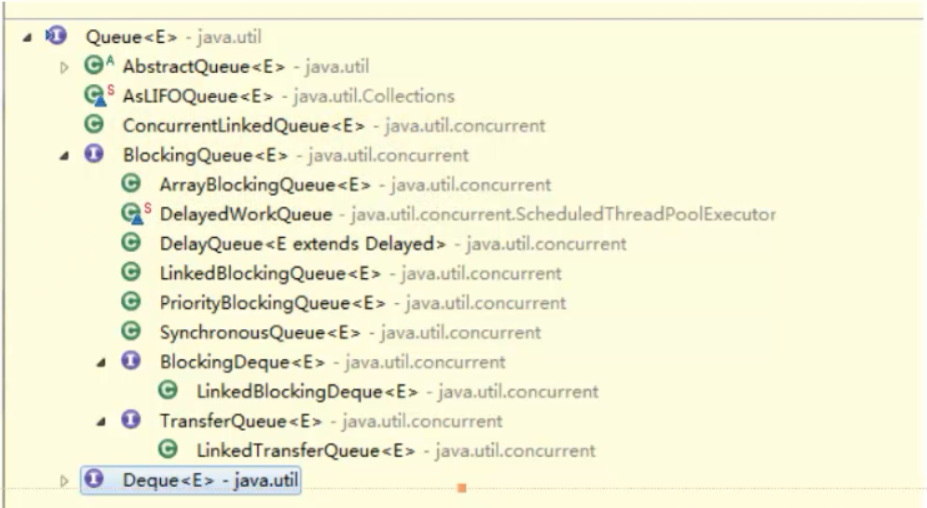
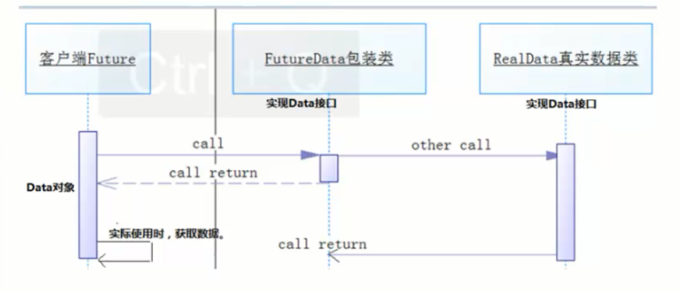
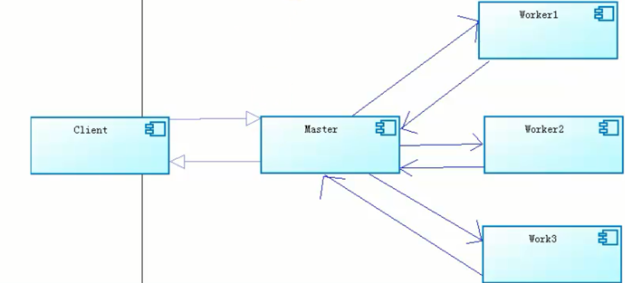
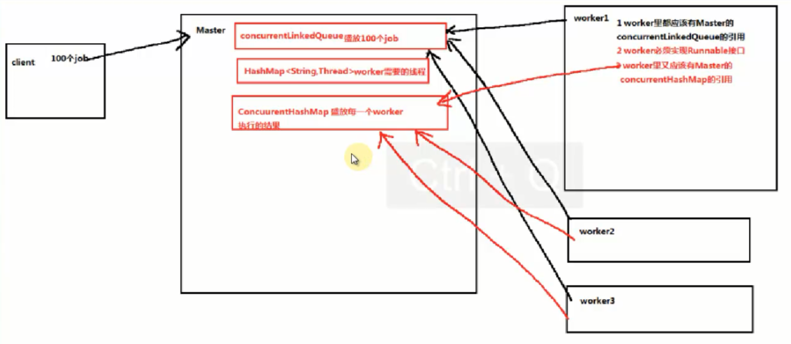

### java并发包介绍
```java
JDK5.0 以后的版本都引入了高级并发特性，大多数的特性在java.util.concurrent 包中，是专门用于多线程发编程的，充分利用了现代多处理器和多核心系统的功能以编写大规模并发应用程序。
主要包含原子量、并发集合、同步器、可重入锁，并对线程池的构造提供了强力的支持。
```

#### 线程池
1、Single Thread Executor : 只有一个线程的线程池，因此所有提交的任务是顺序执行，
Executors.newSingleThreadExecutor()

2、Cached Thread Pool : 线程池里有很多线程需要同时执行，老的可用线程将被新的任务触发重新执行，如果线程超过60秒内没执行，那么将被终止并从池中删除，
Executors.newCachedThreadPool()

3、Fixed Thread Pool : 拥有固定线程数的线程池，如果没有任务执行，那么线程会一直等待，
Executors.newFixedThreadPool(4)
在构造函数中的参数4是线程池的大小，你可以随意设置，也可以和cpu的数量保持一致，获取cpu的数量int cpuNums = Runtime.getRuntime().availableProcessors();

4、Scheduled Thread Pool : 用来调度即将执行的任务的线程池，
Executors.newScheduledThreadPool()

5、Single Thread Scheduled Pool : 只有一个线程，用来调度执行将来的任务，
Executors.newSingleThreadScheduledExecutor()

```java
import java.util.concurrent.ExecutorService;
import java.util.concurrent.Executors;
import java.util.concurrent.ScheduledExecutorService;

/**
 * 列出并发包中的各种线程池
 *
 */

public class ExecutorDemo {

	public static void main(String[] args) {
		ExecutorService newSingleThreadExecutor = Executors.newSingleThreadExecutor();
		ExecutorService newCachedThreadPool = Executors.newCachedThreadPool();

		int cpuNums = Runtime.getRuntime().availableProcessors();
		System.out.println(cpuNums);
		ExecutorService newFixedThreadPool = Executors.newFixedThreadPool(cpuNums);
		ScheduledExecutorService newScheduledThreadPool = Executors.newScheduledThreadPool(8);


		ScheduledExecutorService newSingleThreadScheduledExecutor = Executors.newSingleThreadScheduledExecutor();
	}
}
```

提交 Runnable ，任务完成后 Future 对象返回 null
```java
import java.util.concurrent.ExecutorService;
import java.util.concurrent.Executors;

public class ThreadPoolWithRunable {
	/**
	 * 通过线程池执行线程
	 * @param args
	 */
	public static void main(String[] args) {
		//创建一个线程池
		ExecutorService pool = Executors.newCachedThreadPool();
		for(int i = 1; i < 5; i++){
			pool.execute(new Runnable() {
				@Override
				public void run() {
					System.out.println("thread name: " + Thread.currentThread().getName());
					try {
						Thread.sleep(1000);
					} catch (InterruptedException e) {
						e.printStackTrace();
					}
				}
			});
		}
		pool.shutdown();
	}

}
```

提交 Callable，该方法返回一个 Future 实例表示任务的状态
```java
import java.util.ArrayList;
import java.util.List;
import java.util.concurrent.Callable;
import java.util.concurrent.ExecutionException;
import java.util.concurrent.ExecutorService;
import java.util.concurrent.Executors;
import java.util.concurrent.Future;
/**
 * callable 跟runnable的区别：
 * runnable的run方法不会有任何返回结果，所以主线程无法获得任务线程的返回值
 *
 * callable的call方法可以返回结果，但是主线程在获取时是被阻塞，需要等待任务线程返回才能拿到结果
 *
 */
public class ThreadPoolWithcallable {

	public static void main(String[] args) throws InterruptedException, ExecutionException {
		ExecutorService pool = Executors.newFixedThreadPool(4);

		for(int i = 0; i < 10; i++){
			Future<String> submit = pool.submit(new Callable<String>(){
				@Override
				public String call() throws Exception {
					//System.out.println("a");
					Thread.sleep(5000);
					return "b--"+Thread.currentThread().getName();
				}
			   });
			//从Future中get结果，这个方法是会被阻塞的，一直要等到线程任务返回结果
			System.out.println(submit.get());
		}
			pool.shutdown();
	}
}
```

```java
import java.util.Random;
import java.util.concurrent.Callable;

public class TaskCallable implements Callable<String>{

	private int s;
	Random r = new Random();
	public TaskCallable(int s){
		this.s = s;
	}

	@Override
	public String call() throws Exception {
		String name = Thread.currentThread().getName();
		long currentTimeMillis = System.currentTimeMillis();
		System.out.println(name+" 启动时间：" + currentTimeMillis/1000);

		int rint = r.nextInt(3);
		try {
			Thread.sleep(rint*1000);
		} catch (InterruptedException e) {

			e.printStackTrace();
		}
		System.out.println(name + " is working..."+s);
		return s+"";
	}

}
```
```java
import java.util.Random;

public class TaskRunnable implements Runnable{
	private int s;

	public TaskRunnable(int s){
		this.s = s;
	}

	Random r = new Random();

	@Override
	public void run() {
		String name = Thread.currentThread().getName();
		long currentTimeMillis = System.currentTimeMillis();
		System.out.println(name+" 启动时间：" + currentTimeMillis/1000);

		int rint = r.nextInt(3);
		try {
			Thread.sleep(rint*1000);
		} catch (InterruptedException e) {

			e.printStackTrace();
		}
		System.out.println(name + " is working..."+s);

	}
}
```
```java
import java.util.ArrayList;
import java.util.HashMap;
import java.util.Random;
import java.util.concurrent.ExecutorService;
import java.util.concurrent.Executors;
import java.util.concurrent.Future;
import java.util.concurrent.ScheduledExecutorService;
import java.util.concurrent.TimeUnit;

public class TestPool {
	public static void main(String[] args) throws Exception {
		Future<?> submit = null;
		Random random = new Random();

		//创建固定数量线程池
//		ExecutorService exec = Executors.newFixedThreadPool(4);

		//创建调度线程池
		ScheduledExecutorService exec = Executors.newScheduledThreadPool(4);

		//用来记录各线程的返回结果
		ArrayList<Future<?>> results = new ArrayList<Future<?>>();

		for (int i = 0; i < 10; i++) {
			//fixedPool提交线程，runnable无返回值，callable有返回值
			/*submit = exec.submit(new TaskRunnable(i));*/
			/*submit = exec.submit(new TaskCallable(i));*/

			//对于schedulerPool来说，调用submit提交任务时，跟普通pool效果一致
			/*submit = exec.submit(new TaskCallable(i));*/
			//对于schedulerPool来说，调用schedule提交任务时，则可按延迟，按间隔时长来调度线程的运行
			submit = exec.schedule(new TaskCallable(i), random.nextInt(10), TimeUnit.SECONDS);
			//存储线程执行结果
			results.add(submit);

		}

		//打印结果
		for(Future f: results){
			boolean done = f.isDone();
			System.out.println(done?"已完成":"未完成");  //从结果的打印顺序可以看到，即使未完成，也会阻塞等待
			System.out.println("线程返回future结果： " + f.get());
		}

		exec.shutdown();
	}
}
```

#### 同步容器类
同步类容器都是线程安全的,但在某些场景下可能需要加锁来保护复合操作,复合类操作如选代(反复访问元素,遍历完容器中所有的元素)、跳转(根据指定的顺序找到当前元素的下一个元素)、以及条件运算,这些复合操作在多线程并发地修改容器时,可能会表现出意外的行为,最经典的便是ConcurrengModificationException,原因是当容器迭代的过程中,被井发的修改了内容,
这是由于早期达代器设计的时候并没有考虑并发修改的问题。
同步类容器:如古老的Vector, Hash Table.这些容器的同步功能其实是在JDK的Collections.synchronized**等工厂方法去创建实现的,其底层的机制无非就是用传统的synchronized关键字对每个公用的方法都进行同步,使得每次只能有一个线程访问容器的状态,这很明显不满足我们今天互联网时代高并发的需求,在保证线程安全的同时,他必续要有足够好的性能

#### 并发类容器
jak5.0以后提供了多种并发类容器来替代同步类容器从而改善性能.同步类容器的状态都是串行化的,他们虽然实现了线程安全,但是严重降低了并发性,在多线程环境时,严重降低了应用程序的吞吐量。
并发类容器是专门针对并发设计的,使用ConcurrentHashMap来代替给子散列的传统的HashTable,而且在ConcurrentHashMap中,添加了一些常见复合操作的支持,以及使用了CopyOnWriteArrayList代替Voctor,并发的CopyonWriteArraySet,以及并发的Queue, ConcurrentLinkedQueue和LinkedBlockingQueue,前者是高性能的队列,后者是以阻塞形式的队列,具体实现Queue还有很多,例如ArrayBlockingQueue.
PriorityBlockingQueue. Synchronous Queue等

ConcurrntMap:
ConcurrentMap接口下有俩个重要的实现
ConcurrentHashap
ConcurentSkipListMap (支持并发排序功能,弥补ConcurrentHashMap)
ConcurrentHashMap内部使用段(Segmen)未表示这些不同的部分,每个段其实就是一个小的Hash Table,它们有自己的锁.只要多个修改操作发生在不同的段上,它们就可以并发进行,把一个整体分成了16个段(Segment).
也就是最高支持16个线程的并发修改操作,这也是在多线程场景时减小锁的粒度从面降低锁竞争的一种方案。并且代码中大多共享变量使用volatile关键字声明,目的是第一时间获取修改的内容,性能非常好.

Copy-On-Write容器:
Copy-on-Write简称cow,是种用于程序设计中的优化策略。
JDK里的CoW容器有两种: CopyOnWriteArrayList和CopyOnWriteArraySet,Cow容器非常有用,可以在非常多的并发场景中使用到
什么是CopyOnWrite容器?
CopyOnWrite容器即写时复制的容器,通俗的理解是当我们往一个容器添加元素的时候,不直接往当前容器添加,而是先将当前容器进行Copy,复制出一个新的容器,然后新的容器里添加元素,添加完元素之后,再将原容器的引用指向新的容器。这样放的好处是我们可以对CopyOnWrite容器进行并发的读,而不需要加锁,因为当前容器不会添加任何元素,所以CopyOnWrite容器也是一种读写分离的思想,读和写不同
的容器。

#### 并发Queue
在并发队列上JDK提供了两套实现,一个是以ConcurrentLinkedQueue为代表的高性能队列,一个是以BlockingQueue接口为代表的阻塞队列,无论哪种都维承自Queue


ConcurrentLinkedQueue:
ConcurrentLinkedQueue:是一个适用于高并发场景下的队列,通过无锁的方式,实现了高并发状态下的高性能,通常ConcurrentLinkedQueue性能好于BlockingQueue.它是一个基于链接节点的无界线程安全队列,该队列的元素遵循先进先出的原则,头是最先加入的,尾是最近加入的,该队列不允许null元素。
ConcurrentLinkedQueue重要方法:
add()和 ofter()都是加入元素的方法(在ConcurrentLinkedaueue中,这两个方法没有任何区别)
pol()和peek()都是取头元素节点,区别在于前者会删除元素,后者不会.

ClockingQueue接口:
ArrayBlockingQueue:基于数组的阻塞队列实现,在ArrayBlockingQueue内部,维护了一个定长数组,以便缓存队列中的数据对象,其内部没实现读写分离,也就意味着生产和消费不能完全并行,长度是需要定义的,可以指定先进先出或者先进后出,也叫有界队列,在很多场合非常适合使用.
LinkedBlockingQueue:基于链表的阻塞队列,同ArrayBlockingQueue类似,其内部也维持着一个数据缓冲队列(该队列由一个链表构成) , LinkedBlockingQueue之所以能够高效的处理并发数据,是因为其内部实现采用分离锁(读写分离两个锁) ,从而实现生产者和消费者操作的完全并行运行。他是一个无界队列。
SynchronousQueue :一种没有缓冲的队列,生产者产生的数据直接会被消费者获取并消费。
PriorityBlockingQueue:基于优先级的阻塞队列(优先级的判断通过构造函数传入的Compator对象来决定,也就是说传入队列的对象必须实现Comparable接口) ,在实现PriorityBlockingQueue时,内部控制线程同步的锁采用的是公平锁,他也是一个无界的队列。
DelayQueue:带有延迟时间的Queue,其中的元素只有当其指定的延迟时间到了,才能够从队列中获取到该元素. Delayqueue中的元素必须实现Delayed接口, Delayqueue是一个没有大小限制的队列,应用场景很多,比如对缓存超时的数据进行移除、任务超时处理、空闲连接的关闭等等.

生产消费模型应用:
客户端服务器端数据传输，可能我们没有使用什么消息中间件，通过直连的手段，比如tcp, netty等。
客服端与服务器直连进行数据传输，我们发现使用netty一般都会与队列结合使用，可能有一个客户端每秒发送10条数据到服务器端，但是处理的速度与生产的步伐不一致，服务器每秒只能消费1条。
如果我们用netty,在业务高峰期，把这10条数据直接放到队列中，但是要有限制，使用有界队列，防止服务器内存溢出，非高峰期，用一些无界队列。或者有些在不同时间段使用不同类型队列。

```java
import java.util.concurrent.SynchronousQueue;


public class UseQueue {

	public static void main(String[] args) throws Exception {

		//高性能无阻塞无界队列：ConcurrentLinkedQueue
		/**
		ConcurrentLinkedQueue<String> q = new ConcurrentLinkedQueue<String>();
		q.offer("a");
		q.offer("b");
		q.offer("c");
		q.offer("d");
		q.add("e");

		System.out.println(q.poll());	//a 从头部取出元素，并从队列里删除
		System.out.println(q.size());	//4
		System.out.println(q.peek());	//b
		System.out.println(q.size());	//4
		*/

		/**
		ArrayBlockingQueue<String> array = new ArrayBlockingQueue<String>(5);
		array.put("a");
		array.put("b");
		array.add("c");
		array.add("d");
		array.add("e");
		array.add("f");
		//System.out.println(array.offer("a", 3, TimeUnit.SECONDS));
		*/


		/**
		//阻塞队列
		LinkedBlockingQueue<String> q = new LinkedBlockingQueue<String>();
		q.offer("a");
		q.offer("b");
		q.offer("c");
		q.offer("d");
		q.offer("e");
		q.add("f");
		//System.out.println(q.size());

//		for (Iterator iterator = q.iterator(); iterator.hasNext();) {
//			String string = (String) iterator.next();
//			System.out.println(string);
//		}

		List<String> list = new ArrayList<String>();
		System.out.println(q.drainTo(list, 3));
		System.out.println(list.size());
		for (String string : list) {
			System.out.println(string);
		}
		*/


		final SynchronousQueue<String> q = new SynchronousQueue<String>();
		Thread t1 = new Thread(new Runnable() {
			@Override
			public void run() {
				try {
					System.out.println(q.take());
				} catch (InterruptedException e) {
					e.printStackTrace();
				}
			}
		});
		t1.start();
		Thread t2 = new Thread(new Runnable() {

			@Override
			public void run() {
				q.add("asdasd");
			}
		});
		t2.start();
	}
}
```

PriorityBlockingQueue:
```java
public class Task implements Comparable<Task>{

	private int id ;
	private String name;
	public int getId() {
		return id;
	}
	public void setId(int id) {
		this.id = id;
	}
	public String getName() {
		return name;
	}
	public void setName(String name) {
		this.name = name;
	}

	@Override
	public int compareTo(Task task) {
		return this.id > task.id ? 1 : (this.id < task.id ? -1 : 0);
	}

	public String toString(){
		return this.id + "," + this.name;
	}

}
```
```
import java.util.concurrent.PriorityBlockingQueue;

public class UsePriorityBlockingQueue {


	public static void main(String[] args) throws Exception{


		PriorityBlockingQueue<Task> q = new PriorityBlockingQueue<Task>();

		Task t1 = new Task();
		t1.setId(3);
		t1.setName("id为3");
		Task t2 = new Task();
		t2.setId(4);
		t2.setName("id为4");
		Task t3 = new Task();
		t3.setId(1);
		t3.setName("id为1");

		//return this.id > task.id ? 1 : 0;
		q.add(t1);	//3
		q.add(t2);	//4
		q.add(t3);  //1

		// 1 3 4
		System.out.println("容器：" + q);
		System.out.println(q.take().getId());
		System.out.println("容器：" + q);
//		System.out.println(q.take().getId());
//		System.out.println(q.take().getId());

	}
```
take的时候才排序，放的时候不排序
```
容器：[1,id为1, 4,id为4, 3,id为3]
1
容器：[3,id为3, 4,id为4]
```

DelayQueue:
```java
import java.util.concurrent.Delayed;
import java.util.concurrent.TimeUnit;

public class Wangmin implements Delayed {

    private String name;
    //身份证
    private String id;
    //截止时间
    private long endTime;
    //定义时间工具类
    private TimeUnit timeUnit = TimeUnit.SECONDS;

    public Wangmin(String name,String id,long endTime){
        this.name=name;
        this.id=id;
        this.endTime = endTime;
    }

    public String getName(){
        return this.name;
    }

    public String getId(){
        return this.id;
    }

    /**
     * 用来判断是否到了截止时间
     */
    @Override
    public long getDelay(TimeUnit unit) {
        //return unit.convert(endTime, TimeUnit.MILLISECONDS) - unit.convert(System.currentTimeMillis(), TimeUnit.MILLISECONDS);
    	return endTime - System.currentTimeMillis();
    }

    /**
     * 相互批较排序用
     */
    @Override
    public int compareTo(Delayed delayed) {
    	Wangmin w = (Wangmin)delayed;
        return this.getDelay(this.timeUnit) - w.getDelay(this.timeUnit) > 0 ? 1:0;
    }
}
```
```java
import java.util.concurrent.DelayQueue;

public class WangBa implements Runnable {

    private DelayQueue<Wangmin> queue = new DelayQueue<Wangmin>();

    public boolean yinye =true;

    public void shangji(String name,String id,int money){
        Wangmin man = new Wangmin(name, id, 1000 * money + System.currentTimeMillis());
        System.out.println("网名"+man.getName()+" 身份证"+man.getId()+"交钱"+money+"块,开始上机...");
        this.queue.add(man);
    }

    public void xiaji(Wangmin man){
        System.out.println("网名"+man.getName()+" 身份证"+man.getId()+"时间到下机...");
    }

    @Override
    public void run() {
        while(yinye){
            try {
                Wangmin man = queue.take();
                xiaji(man);
            } catch (InterruptedException e) {
                e.printStackTrace();
            }
        }
    }

    public static void main(String args[]){
        try{
            System.out.println("网吧开始营业");
            WangBa siyu = new WangBa();
            Thread shangwang = new Thread(siyu);
            shangwang.start();

            siyu.shangji("路人甲", "123", 1);
            siyu.shangji("路人乙", "234", 10);
            siyu.shangji("路人丙", "345", 5);
        }
        catch(Exception e){
            e.printStackTrace();
        }

    }
}
```
```
网吧开始营业
网名路人甲 身份证123交钱1块,开始上机...
网名路人乙 身份证234交钱10块,开始上机...
网名路人丙 身份证345交钱5块,开始上机...
网名路人甲 身份证123时间到下机...
网名路人丙 身份证345时间到下机...
网名路人乙 身份证234时间到下机...

```

```java
BlockingQueue也是java.util.concurrent下的主要用来控制线程同步的工具。
主要的方法是：put、take一对阻塞存取；add、poll一对非阻塞存取。
	插入:
		1)add(anObject):把anObject加到BlockingQueue里,即如果BlockingQueue可以容纳,则返回true,否则抛出
        2)offer(anObject):表示如果可能的话,将anObject加到BlockingQueue里,即如果BlockingQueue可以容纳,则返回true,否则返回false.
        3)put(anObject):把anObject加到BlockingQueue里,如果BlockQueue没有空间,则调用此方法的线程被阻断直到BlockingQueue里面有空间再继续.
	读取：
        4)poll(time):取走BlockingQueue里排在首位的对象,若不能立即取出,则可以等time参数规定的时间,取不到时返回null
        5)take():取走BlockingQueue里排在首位的对象,若BlockingQueue为空,阻断进入等待状态直到Blocking有新的对象被加入为止
	其他
int remainingCapacity();返回队列剩余的容量，在队列插入和获取的时候，不要瞎搞，数	据可能不准
boolean remove(Object o); 从队列移除元素，如果存在，即移除一个或者更多，队列改	变了返回true
public boolean contains(Object o); 查看队列是否存在这个元素，存在返回true
int drainTo(Collection<? super E> c); 移除此队列中所有可用的元素，并将它们添加到给定collection中
int drainTo(Collection<? super E> c, int maxElements); 和上面方法的区别在于，制定了移动的数量

BlockingQueue有四个具体的实现类,常用的两种实现类为：

1、ArrayBlockingQueue：一个由数组支持的有界阻塞队列，规定大小的BlockingQueue,其构造函数必须带一个int参数来指明其大小.其所含的对象是以FIFO(先入先出)顺序排序的。

2、LinkedBlockingQueue：大小不定的BlockingQueue,若其构造函数带一个规定大小的参数,生成的BlockingQueue有大小限制,若不带大小参数,所生成的BlockingQueue的大小由Integer.MAX_VALUE来决定.其所含的对象是以FIFO(先入先出)顺序排序的。
	LinkedBlockingQueue 可以指定容量，也可以不指定，不指定的话，默认最大是Integer.MAX_VALUE,其中主要用到put和take方法，put方法在队列满的时候会阻塞直到有队列成员被消费，take方法在队列空的时候会阻塞，直到有队列成员被放进来。

LinkedBlockingQueue和ArrayBlockingQueue区别：

LinkedBlockingQueue和ArrayBlockingQueue比较起来,它们背后所用的数据结构不一样,导致LinkedBlockingQueue的数据吞吐量要大于ArrayBlockingQueue,但在线程数量很大时其性能的可预见性低于ArrayBlockingQueue.
```

### java并发编程的一些总结
1.不应用线程池的缺点
有些开发者图省事，遇到需要多线程处理的地方，直接new Thread(...).start()，对于一般场景是没问题的，但如果是在并发请求很高的情况下，就会有些隐患：
新建线程的开销。线程虽然比进程要轻量许多，但对于JVM来说，新建一个线程的代价还是挺大的，决不同于新建一个对象
资源消耗量。没有一个池来限制线程的数量，会导致线程的数量直接取决于应用的并发量，这样有潜在的线程数据巨大的可能，那么资源消耗量将是巨大的
稳定性。当线程数量超过系统资源所能承受的程度，稳定性就会成问题
2.制定执行策略
在每个需要多线程处理的地方，不管并发量有多大，需要考虑线程的执行策略
任务以什么顺序执行
可以有多少个任何并发执行
可以有多少个任务进入等待执行队列
系统过载的时候，应该放弃哪些任务？如何通知到应用程序？
一个任务的执行前后应该做什么处理
3.线程池的类型
不管是通过Executors创建线程池，还是通过Spring来管理，都得清楚知道有哪几种线程池：
FixedThreadPool：定长线程池，提交任务时创建线程，直到池的最大容量，如果有线程非预期结束，会补充新线程
CachedThreadPool：可变线程池，它犹如一个弹簧，如果没有任务需求时，它回收空闲线程，如果需求增加，则按需增加线程，不对池的大小做限制
SingleThreadExecutor：单线程。处理不过来的任务会进入FIFO队列等待执行
SecheduledThreadPool：周期性线程池。支持执行周期性线程任务
其实，这些不同类型的线程池都是通过构建一个ThreadPoolExecutor来完成的，所不同的是corePoolSize,maximumPoolSize,keepAliveTime,unit,workQueue,threadFactory这么几个参数。具体可以参见JDK DOC。
4.线程池饱和策略
由以上线程池类型可知，除了CachedThreadPool其他线程池都有饱和的可能，当饱和以后就需要相应的策略处理请求线程的任务，ThreadPoolExecutor采取的方式通过队列来存储这些任务，当然会根据池类型不同选择不同的队列，比如FixedThreadPool和SingleThreadExecutor默认采用的是无限长度的LinkedBlockingQueue。但从系统可控性讲，最好的做法是使用定长的ArrayBlockingQueue或有限的LinkedBlockingQueue，并且当达到上限时通过ThreadPoolExecutor.setRejectedExecutionHandler方法设置一个拒绝任务的策略，JDK提供了AbortPolicy、CallerRunsPolicy、DiscardPolicy、DiscardOldestPolicy几种策略，具体差异可见JDK DOC
5.线程无依赖性
多线程任务设计上尽量使得各任务是独立无依赖的，所谓依赖性可两个方面：
线程之间的依赖性。如果线程有依赖可能会造成死锁或饥饿
调用者与线程的依赖性。调用者得监视线程的完成情况，影响可并发量
当然，在有些业务里确实需要一定的依赖性，比如调用者需要得到线程完成后结果，传统的Thread是不便完成的，因为run方法无返回值，只能通过一些共享的变量来传递结果，但在Executor框架里可以通过Future和Callable实现需要有返回值的任务，当然线程的异步性导致需要有相应机制来保证调用者能等待任务完成。

### 多线程的设计模式
并行设计模式属于设计优化的一部分,它是对一些常用的多线程结构的总结和抽象与串行程序相比,并行程序的结构通常更为复杂。因此合理的使用并行模式在多线程开发中更具有意义,在这里主要介绍Future, Master-Worker和生产者-消费者模型。
#### Future模式
Future模式有点类似于商品订单。比如在网购时,当看重某一件商品事,就可以提交订 ,当订单处理完成后,在家里等待商品送货上门即可。或者说更形象的我们发送Ajax请求的时候,页面是异步的进行后台处理,用户无须一直等待请求的结果,可以继续浏览或操作其他内容。


Data:
```java
public interface Data {
	String getRequest();
}
```
RealData:
```java
public class RealData implements Data{

	private String result ;

	public RealData (String queryStr){
		System.out.println("根据" + queryStr + "进行查询，这是一个很耗时的操作..");
		try {
			Thread.sleep(5000);
		} catch (InterruptedException e) {
			e.printStackTrace();
		}
		System.out.println("操作完毕，获取结果");
		result = "查询结果";
	}

	@Override
	public String getRequest() {
		return result;
	}

}
```
FutureData:
```java
public class FutureData implements Data{

	private RealData realData ;
	private boolean isReady = false;

	public synchronized void setRealData(RealData realData) {
		//如果已经装载完毕了，就直接返回
		if(isReady){
			return;
		}
		//如果没装载，进行装载真实对象
		this.realData = realData;
		isReady = true;
		//进行通知
		notify();
	}

	@Override
	public synchronized String getRequest() {
		//如果没装载好 程序就一直处于阻塞状态
		while(!isReady){
			try {
				wait();
			} catch (InterruptedException e) {
				e.printStackTrace();
			}
		}
		//装载好直接获取数据即可
		return this.realData.getRequest();
	}
}
```
FutureClient:
```java
public class FutureClient {

	public Data request(final String queryStr){
		//1 我想要一个代理对象（Data接口的实现类）先返回给发送请求的客户端，告诉他请求已经接收到，可以做其他的事情
		final FutureData futureData = new FutureData();
		//2 启动一个新的线程，去加载真实的数据，传递给这个代理对象
		new Thread(new Runnable() {
			@Override
			public void run() {
				//3 这个新的线程可以去慢慢的加载真实对象，然后传递给代理对象
				RealData realData = new RealData(queryStr);
				futureData.setRealData(realData);
			}
		}).start();

		return futureData;
	}
}
```
Main:
```java
public class Main {

	public static void main(String[] args) throws InterruptedException {

		FutureClient fc = new FutureClient();
		Data data = fc.request("请求参数");
		System.out.println("请求发送成功!");
		System.out.println("做其他的事情...");

		String result = data.getRequest();
		System.out.println(result);

	}
}
```

#### Master-Worker模式
Master-Worker模式是常用的并行计算模式。
它的核心思想是系统由两类进程协作工作: Master进程和Worker进程。Master负责接收和分配任务,Worker负责处理子任务。当各个Worker子进程处理完成后,会将结果返回给Master, 由Master做归纳和总结。
其好处是能将一个大任务分解成若干个小任务,并行执行,从而提高系统的吞吐量。


Task:
```java
public class Task {

	private int id;
	private int price ;
	public int getId() {
		return id;
	}
	public void setId(int id) {
		this.id = id;
	}
	public int getPrice() {
		return price;
	}
	public void setPrice(int price) {
		this.price = price;
	}

}
```

Master:
```java
import java.util.HashMap;
import java.util.Map;
import java.util.concurrent.ConcurrentHashMap;
import java.util.concurrent.ConcurrentLinkedQueue;

public class Master {

	//1 有一个盛放任务的容器
	private ConcurrentLinkedQueue<Task> workQueue = new ConcurrentLinkedQueue<Task>();

	//2 需要有一个盛放worker的集合
	private HashMap<String, Thread> workers = new HashMap<String, Thread>();

	//3 需要有一个盛放每一个worker执行任务的结果集合
	private ConcurrentHashMap<String, Object> resultMap = new ConcurrentHashMap<String, Object>();

	//4 构造方法
	public Master(Worker worker , int workerCount){
		worker.setWorkQueue(this.workQueue);
		worker.setResultMap(this.resultMap);

		for(int i = 0; i < workerCount; i ++){
			this.workers.put(Integer.toString(i), new Thread(worker));
		}

	}

	//5 需要一个提交任务的方法
	public void submit(Task task){
		this.workQueue.add(task);
	}

	//6 需要有一个执行的方法，启动所有的worker方法去执行任务
	public void execute(){
		for(Map.Entry<String, Thread> me : workers.entrySet()){
			me.getValue().start();
		}
	}

	//7 判断是否运行结束的方法
	public boolean isComplete() {
		for(Map.Entry<String, Thread> me : workers.entrySet()){
			if(me.getValue().getState() != Thread.State.TERMINATED){
				return false;
			}
		}
		return true;
	}

	//8 计算结果方法
	public int getResult() {
		int priceResult = 0;
		for(Map.Entry<String, Object> me : resultMap.entrySet()){
			priceResult += (Integer)me.getValue();
		}
		return priceResult;
	}
}
```
Worker:
```java
import java.util.concurrent.ConcurrentHashMap;
import java.util.concurrent.ConcurrentLinkedQueue;

public class Worker implements Runnable {

	private ConcurrentLinkedQueue<Task> workQueue;
	private ConcurrentHashMap<String, Object> resultMap;

	public void setWorkQueue(ConcurrentLinkedQueue<Task> workQueue) {
		this.workQueue = workQueue;
	}

	public void setResultMap(ConcurrentHashMap<String, Object> resultMap) {
		this.resultMap = resultMap;
	}

	@Override
	public void run() {
		while(true){
			Task input = this.workQueue.poll();
			if(input == null) break;
			Object output = handle(input);
			this.resultMap.put(Integer.toString(input.getId()), output);
		}
	}

	private Object handle(Task input) {
		Object output = null;
		try {
			//处理任务的耗时。。 比如说进行操作数据库。。。
			Thread.sleep(500);
			output = input.getPrice();
		} catch (InterruptedException e) {
			e.printStackTrace();
		}
		return output;
	}
}
```
Main:
```java
import java.util.Random;

public class Main {
	public static void main(String[] args) {

		Master master = new Master(new Worker(), 20);

		Random r = new Random();
		for(int i = 1; i <= 100; i++){
			Task t = new Task();
			t.setId(i);
			t.setPrice(r.nextInt(1000));
			master.submit(t);
		}
		master.execute();
		long start = System.currentTimeMillis();

		while(true){
			if(master.isComplete()){
				long end = System.currentTimeMillis() - start;
				int priceResult = master.getResult();
				System.out.println("最终结果：" + priceResult + ", 执行时间：" + end);
				break;
			}
		}

	}
}
```

#### 生产者-消费者
生产者和消费者也是一个非常经典的多线程模式,我们在实际开发中应用非常广泛的思想理念。在生产-消费模式中:通常由两类线程,即若干个生产者的线程和若干个消费者的线程。生产者线程负责提交用户请求,消费者线程则负责具体处理生产者提交的任务,在生产者和消费者之间通过共享内存缓存区进行通信。
Data:
```java
public final class Data {

	private String id;
	private String name;

	public Data(String id, String name){
		this.id = id;
		this.name = name;
	}

	public String getId() {
		return id;
	}

	public void setId(String id) {
		this.id = id;
	}

	public String getName() {
		return name;
	}

	public void setName(String name) {
		this.name = name;
	}

	@Override
	public String toString(){
		return "{id: " + id + ", name: " + name + "}";
	}

}
```
Provider:
```java
import java.util.Random;
import java.util.concurrent.BlockingQueue;
import java.util.concurrent.TimeUnit;
import java.util.concurrent.atomic.AtomicInteger;

public class Provider implements Runnable{

	//共享缓存区
	private BlockingQueue<Data> queue;
	//多线程间是否启动变量，有强制从主内存中刷新的功能。即时返回线程的状态
	private volatile boolean isRunning = true;
	//id生成器
	private static AtomicInteger count = new AtomicInteger();
	//随机对象
	private static Random r = new Random();

	public Provider(BlockingQueue queue){
		this.queue = queue;
	}

	@Override
	public void run() {
		while(isRunning){
			try {
				//随机休眠0 - 1000 毫秒 表示获取数据(产生数据的耗时)
				Thread.sleep(r.nextInt(1000));
				//获取的数据进行累计...
				int id = count.incrementAndGet();
				//比如通过一个getData方法获取了
				Data data = new Data(Integer.toString(id), "数据" + id);
				System.out.println("当前线程:" + Thread.currentThread().getName() + ", 获取了数据，id为:" + id + ", 进行装载到公共缓冲区中...");
				if(!this.queue.offer(data, 2, TimeUnit.SECONDS)){
					System.out.println("提交缓冲区数据失败....");
					//do something... 比如重新提交
				}
			} catch (InterruptedException e) {
				e.printStackTrace();
			}
		}
	}

	public void stop(){
		this.isRunning = false;
	}

}
```
Consumer:
```java
public class Consumer implements Runnable{

	private BlockingQueue<Data> queue;

	public Consumer(BlockingQueue queue){
		this.queue = queue;
	}

	//随机对象
	private static Random r = new Random();

	@Override
	public void run() {
		while(true){
			try {
				//获取数据
				Data data = this.queue.take();
				//进行数据处理。休眠0 - 1000毫秒模拟耗时
				Thread.sleep(r.nextInt(1000));
				System.out.println("当前消费线程：" + Thread.currentThread().getName() + "， 消费成功，消费数据为id: " + data.getId());
			} catch (InterruptedException e) {
				e.printStackTrace();
			}
		}
	}
}
```
Main:
```java
import java.util.concurrent.BlockingQueue;
import java.util.concurrent.ExecutorService;
import java.util.concurrent.Executors;
import java.util.concurrent.LinkedBlockingQueue;

public class Main {

	public static void main(String[] args) throws Exception {
		//内存缓冲区
		BlockingQueue<Data> queue = new LinkedBlockingQueue<Data>(10);
		//生产者
		Provider p1 = new Provider(queue);

		Provider p2 = new Provider(queue);
		Provider p3 = new Provider(queue);
		//消费者
		Consumer c1 = new Consumer(queue);
		Consumer c2 = new Consumer(queue);
		Consumer c3 = new Consumer(queue);
		//创建线程池运行,这是一个缓存的线程池，可以创建无穷大的线程，没有任务的时候不创建线程。空闲线程存活时间为60s（默认值）

		ExecutorService cachePool = Executors.newCachedThreadPool();
		cachePool.execute(p1);
		cachePool.execute(p2);
		cachePool.execute(p3);
		cachePool.execute(c1);
		cachePool.execute(c2);
		cachePool.execute(c3);

		try {
			Thread.sleep(3000);
		} catch (InterruptedException e) {
			e.printStackTrace();
		}
		p1.stop();
		p2.stop();
		p3.stop();
		try {
			Thread.sleep(2000);
		} catch (InterruptedException e) {
			e.printStackTrace();
		}
//		cachePool.shutdown();
//		cachePool.shutdownNow();
	}
}
```

#### Executor框架
为了更好的控制多线程, JDK提供了一套线程框架Executor,帮助开发人员有效地进行线程控制。它们都在java.util.concurrent包中,是JDK并发包的核心。其中有一个比较重要的类: Executors,他扮演这线程工厂的角色,我们通过Executors可以创建特定功能的线程池。
Executors创建线程池方法:
newFixedThreadPool)方法,该方法返回一个固定数量的线程池,该方法的线程数始终不变,当有一个任务提交时,若线程池中空闲,则立即执行,若没有,则会被暂缓在一个任务队列中等待有空闲的线程去执行。
newSingleThreadExecutor()方法,创建一个线程的线程池,若空闲则执行,若没有空闲线程则暂缓在任务列队中。
newCachedThreadPool)方法,返回一个可根据实际情况调整线程个数的线程池,不限制最大线程数量,若有任务,则创建线程,若无任务则不创建线程。如果没有任务则线程在60s后自动回收(空闲时间60s) .
newScheduled ThreadPool)方法,该方法返回一个SchededExecutorService对象,但该线程池可以指定线程的数量

#### 自定义线程池
若Executors工厂类无法满足我们的需求,可以自己去创建自定义的线程池,其实Executors工广类里面的创建线程方法其内部实现均是用了ThreadPoolExecutor这个类,这个类可以自定义线程。构造方法如下:
```java
public ThreadPoolExecutor(int corePoolSize,
                  int maximumPoolSize，
                  long keepAliveTime,
                  TimeUnit unit,
                  BlockingQueue<Runnable> workQueue,
                  ThreadFactory ThreadFactory,
                  RejectedExecutionHandler handler) {...}
```

比如：maximumPoolSize=2，maximumPoolSize=10，ArrayBlockingqueue=10
当一次性来了30个任务，放到这个线程池里，肯定会有一堆任务被拒绝，首先，corePoolSize有2个，还有28个任务待处理，我们可以根据上限maximumPoolSize再去提高8个线程去处理，还剩20个，再往队列里扔10个，最后还剩10个，这10个就会去走RejectedExecutionHandler
任务过多的时候会导致内存溢出，队列会逐渐变大。

#### 自定义线程池使用详细

这个构造方法对于队列是什么类型的比较关键:
在使用有界队列时: 若有新的任务需要执行,如果线程池实际线程数小于corePoolSize,则优先创建线程,若大于corePoolsize,则会将任务加入队列，若队列已满，
则在总线程数不大于maximumPoolSize的前提下创建新的线程，若线程数大于maximumPoolsize,则执行拒绝策略。或其他自定义方式。
无界的任务队列时: LinkedBlockingQueue,与有界队列相比,除非系统资源耗尽,否则无界的任务队列
不存在任务入队失败的情况。当有新在务到来,系统的线程数小于corePoolsize时,则新建线程执行任务,当达到orePoolSize后,就不会继续增加。若后续仍有新的在务加入,而有没有
闲的线程资源，则任务直接进入队列等待。若任务创建和处理的速度差异很大,无界队列会保持快速增长,直到耗尽系统内存。
JDK拒绝策略:
AbortPolicy:直接抛出异常组织系统正常工作
CallerRunsPolicy:只要线程池未关闭,该策略直接在调用者线程中,运行当前被丢弃的任务。
DiscardoldestPolicy:丢弃最老的一个请求,尝试再次提交当前任务。
DiscardPolicy:丢弃无法处理的任务,不给予任何处理。
如果需要自定义拒绝策略可以实现RejectedExecutionHandler接口。
