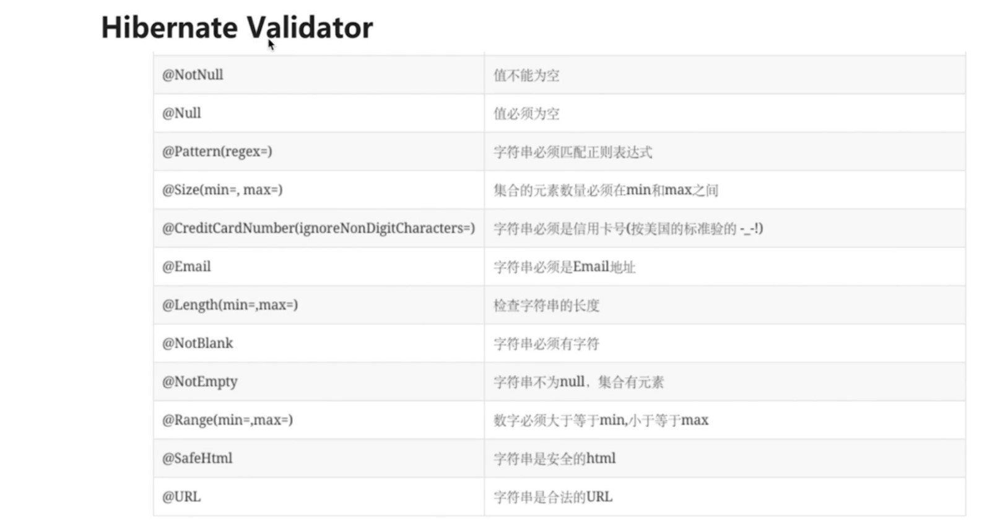

### @Valid注解和BindingResult验证请求参数的合法性并处理校验结果

```java
@PostMapping
public User create(@Valid @RequestBody User user) {
  user.setId("1");
  return user;
}

@PutMapping("/{id:\\d+}")
public User update(@Valid @RequestBody User user, BindingResult errors) {
  user.setId("1");
  return user;
}
```
```java
@Setter
@Getter
public class User {
	private String id;
	private String username;

	@NotBlank(message = "密码不能为空")
	private String password;

}
```

### Bean Validation - @Pattern
```java
@Pattern(regexp = ".+@+.+", flags = Pattern.Flag.CASE_INSENSITIVE, message = "電郵地址格式不正確")
```

### Bean Validation - @Email
```java
import javax.validation.constraints.Email;

@Email
```
参考：  
[https://www.appsdeveloperblog.com/validate-email-in-requestparam/](https://www.appsdeveloperblog.com/validate-email-in-requestparam/)  

### 分组校验
```java
@Data
public class UserDTO {

    @Min(value = 10000000000000000L, groups = Update.class)
    private Long userId;

    @NotNull(groups = {Save.class, Update.class})
    @Length(min = 2, max = 10, groups = {Save.class, Update.class})
    private String userName;

    /**
     * 保存的时候校验分组
     */
    public interface Save {
    }

    /**
     * 更新的时候校验分组
     */
    public interface Update {
    }
}
```
```java
@PostMapping("/save")
public void saveUser(@RequestBody @Validated(UserDTO.Save.class) UserDTO userDTO) {
    // 校验通过，才会执行业务逻辑处理
}

@PostMapping("/update")
public void updateUser(@RequestBody @Validated(UserDTO.Update.class) UserDTO userDTO) {
    // 校验通过，才会执行业务逻辑处理
}
```

### 编程式校验
```java
@Autowired
private javax.validation.Validator globalValidator;

// 编程式校验
@PostMapping("/saveWithCodingValidate")
public void saveWithCodingValidate(@RequestBody UserDTO userDTO) {
    Set<ConstraintViolation<UserDTO>> validate = globalValidator.validate(userDTO, UserDTO.Save.class);
    // 如果校验通过，validate为空；否则，validate包含未校验通过项
    if (validate.isEmpty()) {
        // 校验通过，才会执行业务逻辑处理
    } else {
        for (ConstraintViolation<UserDTO> userDTOConstraintViolation : validate) {
            // 校验失败，做其它逻辑
            System.out.println(userDTOConstraintViolation);
        }
    }
}
```

### @Valid List
1. 如果list作为包装类中的属性，则只需要在包装类前面 + @Valid 并且在List前面 + @Valid
2. list作为controller入参，则需要自定义List
```java
@Getter
@Setter
@ToString
public class ValidList<E> implements List<E> {

  @Valid
  private List<E> list;

  public ValidList() {
    this.list = new ArrayList<>();
  }

  public ValidList(List<E> list) {
    this.list = list;
  }

  @Override
  public int size() {
    return list.size();
  }

  @Override
  public boolean isEmpty() {
    return list.isEmpty();
  }

  @Override
  public boolean contains(Object o) {
    return list.contains(o);
  }

  @Override
  public Iterator<E> iterator() {
    return list.iterator();
  }

  @Override
  public Object[] toArray() {
    return list.toArray();
  }

  @Override
  public <T> T[] toArray(T[] a) {
    return list.toArray(a);
  }

  @Override
  public boolean add(E e) {
    return list.add(e);
  }

  @Override
  public boolean remove(Object o) {
    return list.remove(o);
  }

  @Override
  public boolean containsAll(Collection<?> c) {
    return list.containsAll(c);
  }

  @Override
  public boolean addAll(Collection<? extends E> c) {
    return list.addAll(c);
  }

  @Override
  public boolean addAll(int index, Collection<? extends E> c) {
    return list.addAll(index, c);
  }

  @Override
  public boolean removeAll(Collection<?> c) {
    return list.removeAll(c);
  }

  @Override
  public boolean retainAll(Collection<?> c) {
    return list.retainAll(c);
  }

  @Override
  public void clear() {
    list.clear();
  }

  @Override
  public E get(int index) {
    return list.get(index);
  }

  @Override
  public E set(int index, E element) {
    return list.set(index, element);
  }

  @Override
  public void add(int index, E element) {
    list.add(index, element);
  }

  @Override
  public E remove(int index) {
    return list.remove(index);
  }

  @Override
  public int indexOf(Object o) {
    return list.indexOf(o);
  }

  @Override
  public int lastIndexOf(Object o) {
    return list.lastIndexOf(o);
  }

  @Override
  public ListIterator<E> listIterator() {
    return list.listIterator();
  }

  @Override
  public ListIterator<E> listIterator(int index) {
    return list.listIterator(index);
  }

  @Override
  public List<E> subList(int fromIndex, int toIndex) {
    return list.subList(fromIndex, toIndex);
  }

}
```
```java
@PostMapping("/test")
public void test(@RequestBody @Valid ValidList<Object> validList) {
  // ...
}
```
参考：  
[https://blog.csdn.net/weiyanqiang2012/article/details/94388824](https://blog.csdn.net/weiyanqiang2012/article/details/94388824)  

### 自定义Validator
```java
@Target({ElementType.METHOD, ElementType.FIELD})
@Retention(RetentionPolicy.RUNTIME)
@Constraint(validatedBy = MyConstraintValidator.class)
public @interface MyConstraint {
	String message() default "默认提示";
	Class<?>[] groups() default { };
	Class<? extends Payload>[] payload() default { };
}
```
```java
public class MyConstraintValidator implements ConstraintValidator<MyConstraint, Object> {
	@Override
	public void initialize(MyConstraint constraintAnnotation) {
		System.out.println("my validator init");
	}

	@Override
	public boolean isValid(Object value, ConstraintValidatorContext context) {
    System.out.println("my validator valid");
		System.out.println(value);
		return true;
	}
}
```
```java
public class User {
  @MyConstraint(message = "这是一个测试")
  private String username;
  // ...
}
```

### 快速失败(Fail Fast)
Spring Validation默认会校验完所有字段，然后才抛出异常。可以通过一些简单的配置，开启Fali Fast模式，一旦校验失败就立即返回。  
```java
@Bean
public Validator validator() {
    ValidatorFactory validatorFactory = Validation.byProvider(HibernateValidator.class)
            .configure()
            // 快速失败模式
            .failFast(true)
            .buildValidatorFactory();
    return validatorFactory.getValidator();
}
```

参考：  
[https://mp.weixin.qq.com/s?__biz=MzU4MDUyMDQyNQ==&mid=2247487948&idx=1&sn=e0fba8b5102f8c3a468eb61146dfaf32
&chksm=fd54c14aca23485c632857517e7003d7415819a355c34ee561baca8ca8f753003c4ac26fc4d1&mpshare=1&scene=1
&srcid=09028Sm6DHjZeN6Ttn6haSen&sharer_sharetime=1599022366463&sharer_shareid=64d8f781e069c3f4887b3b02ae3db4f0
&key=af1bfbb7845d3a49b00190c134b9e9fb06fecf171cefc8450cafdde7d3f0714804a182f3c7009b0fdcd429eaa4bde709750d44d6574759d9933ba2e91219ff86f25ee3786336f1f50897b574bf86234b7043696aea597696de72098aad2b0d673cf5c7a523ce9e4df70bdcc391f49af395dec6200942314c4e7b427cbdad1d47
&ascene=1&uin=MTAzMDE1OTU4MA%3D%3D&devicetype=Windows+10+x64&version=6300002f&lang=en&exportkey=AXweKKF%2B6axVWd6DtbhKU%2Bc%3D&pass_ticket=brm2eVjlyEVnz8Dzb3gF0bjJWPSqa%2Fa6tqcwlForUC9Ub8OTz%2BFYdyr7%2Bo06cBFP&wx_header=0]
(https://mp.weixin.qq.com/s?__biz=MzU4MDUyMDQyNQ==&mid=2247487948&idx=1&sn=e0fba8b5102f8c3a468eb61146dfaf32&chksm=fd54c14aca23485c632857517e7003d7415819a355c34ee561baca8ca8f753003c4ac26fc4d1&mpshare=1&scene=1&srcid=09028Sm6DHjZeN6Ttn6haSen&sharer_sharetime=1599022366463&sharer_shareid=64d8f781e069c3f4887b3b02ae3db4f0&key=af1bfbb7845d3a49b00190c134b9e9fb06fecf171cefc8450cafdde7d3f0714804a182f3c7009b0fdcd429eaa4bde709750d44d6574759d9933ba2e91219ff86f25ee3786336f1f50897b574bf86234b7043696aea597696de72098aad2b0d673cf5c7a523ce9e4df70bdcc391f49af395dec6200942314c4e7b427cbdad1d47&ascene=1&uin=MTAzMDE1OTU4MA%3D%3D&devicetype=Windows+10+x64&version=6300002f&lang=en&exportkey=AXweKKF%2B6axVWd6DtbhKU%2Bc%3D&pass_ticket=brm2eVjlyEVnz8Dzb3gF0bjJWPSqa%2Fa6tqcwlForUC9Ub8OTz%2BFYdyr7%2Bo06cBFP&wx_header=0)  

