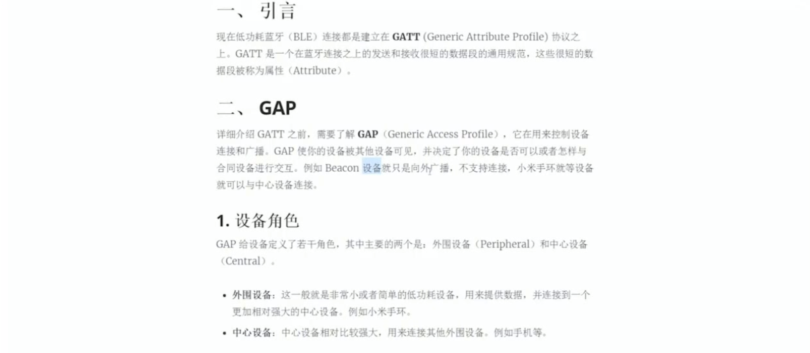
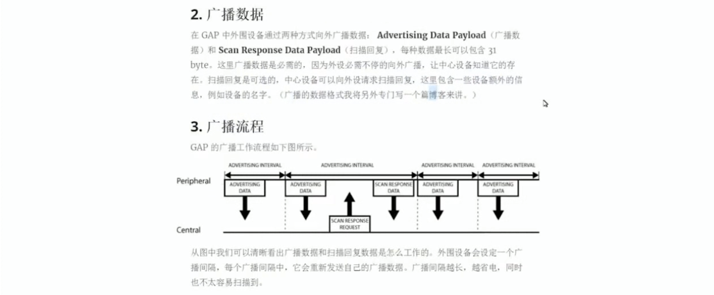
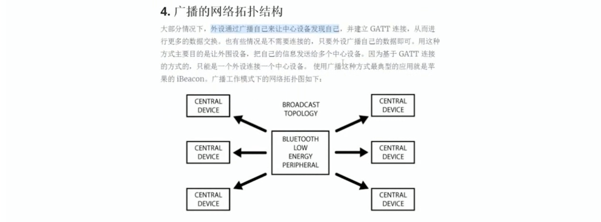
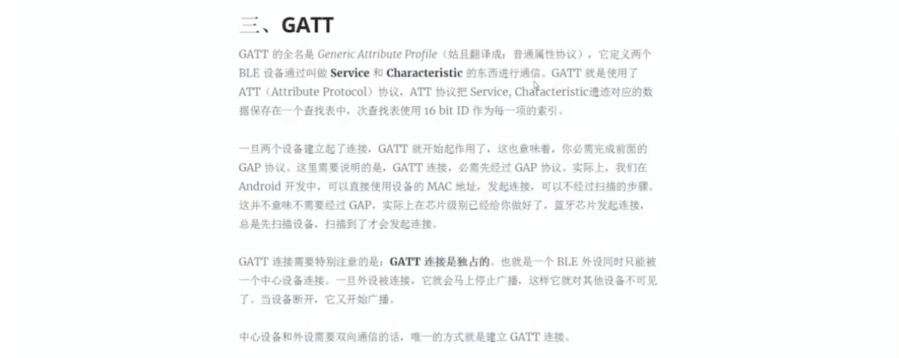
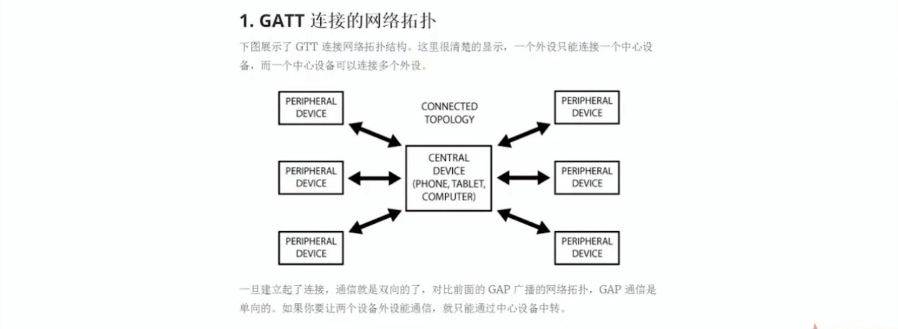
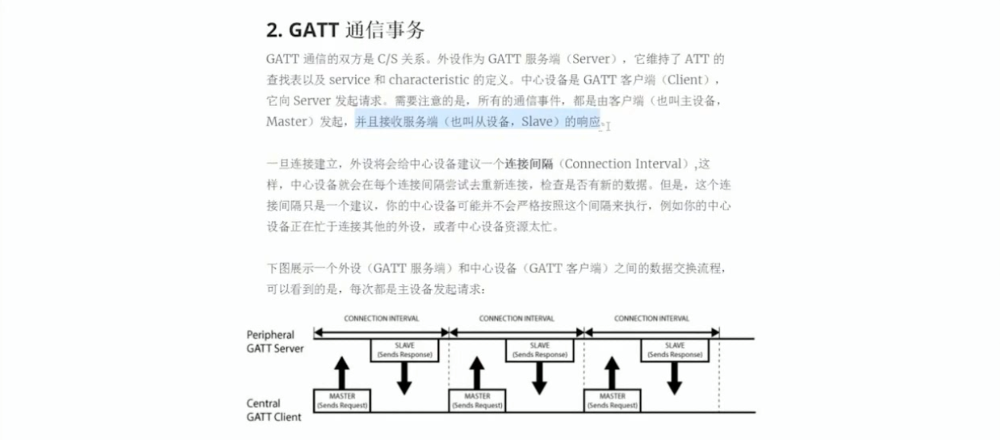
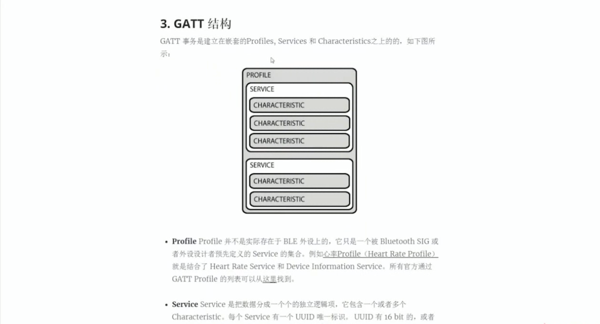

## 使用
### 配置权限
AndroidManifest.xml  
```xml
<?xml version="1.0" encoding="utf-8"?>
<manifest xmlns:android="http://schemas.android.com/apk/res/android"
    package="com.test.blesample">

    <uses-feature android:name="android.hardware.bluetooth.le"
        android:required="true" />

    <uses-permission android:name="android.permission.BLUETOOTH"/>
    <uses-permission android:name="android.permission.BLUETOOTH_ADMIN" />
    <uses-permission android:name="android.permission.ACCESS_COARSE_LOCATION" />
    
    <!--省略其它内容-->

</manifest>
```
### 动态添加权限
```java
public class MainActivity extends AppCompatActivity {

    @Override
    protected void onCreate(Bundle savedInstanceState) {
        super.onCreate(savedInstanceState);
        setContentView(R.layout.activity_main);
        requestPermission();
    }

    private void requestPermission() {
        if (PackageManager.PERMISSION_GRANTED ==
                ContextCompat.checkSelfPermission(MainActivity.this,
                        Manifest.permission.ACCESS_COARSE_LOCATION)) {
            //has permission, do operation directly
        } else {
            //do not have permission
            // Should we show an explanation?
            if (ActivityCompat.shouldShowRequestPermissionRationale(MainActivity.this,
                    Manifest.permission.ACCESS_COARSE_LOCATION)) {
                // Show an explanation to the user *asynchronously* -- don't block
                // this thread waiting for the user's response! After the user
                // sees the explanation, try again to request the permission.
            } else {
                // No explanation needed, we can request the permission.
                ActivityCompat.requestPermissions(MainActivity.this,
                        new String[]{Manifest.permission.ACCESS_COARSE_LOCATION},
                        0);
                // MY_PERMISSIONS_REQUEST_READ_CONTACTS is an
                // app-defined int constant. The callback method gets the
                // result of the request.
            }
        }
    }
}
```
### 检查是否支持蓝牙及ble
```java
public class MainActivity extends AppCompatActivity {

    private Toast mToast;

    private BluetoothAdapter mBluetoothAdapter;
    
    @Override
    protected void onCreate(Bundle savedInstanceState) {
        super.onCreate(savedInstanceState);
        setContentView(R.layout.activity_main);
        // ......
        mToast = Toast.makeText(this, "", Toast.LENGTH_SHORT);
        final BluetoothManager bluetoothManager =
                (BluetoothManager)getSystemService(Context.BLUETOOTH_SERVICE);
        mBluetoothAdapter = bluetoothManager.getAdapter();
        if(mBluetoothAdapter != null) {
            showToast("手机支持蓝牙功能");
        } else {
            finish();
        }
        if(!getPackageManager().hasSystemFeature(PackageManager.FEATURE_BLUETOOTH_LE)) {
            showToast("手机不支持蓝牙BLE功能");
            finish();
        } else {
            showToast("手机支持蓝牙BLE功能!");
        }
    }

    private void showToast(String msg) {
        mToast.setText(msg);
        mToast.show();
    }

    @Override
    protected void onResume() {
        super.onResume();
        if(mBluetoothAdapter != null && !mBluetoothAdapter.isEnabled()) {
            // 申请打开蓝牙功能
            Intent enableBtIntent = new Intent(BluetoothAdapter.ACTION_REQUEST_ENABLE);
            startActivity(enableBtIntent);
        }
    }
    
}
```
### 扫描附近蓝牙4.0设备
```java
public class MainActivity extends AppCompatActivity {

    private Button mBtScan;
    private TextView mBleTextView;

    private static final String TAG = "BLESample";
    private boolean mIsScanStart = false;
    private String mBleAddress = "";

    private BluetoothLeScanner mLeScanner;
    private ScanSettings mScanSettings;
    
    @Override
    protected void onCreate(Bundle savedInstanceState) {
        super.onCreate(savedInstanceState);
        setContentView(R.layout.activity_main);
        // ......
        if(Build.VERSION.SDK_INT >= Build.VERSION_CODES.LOLLIPOP) {
            mLeScanner = mBluetoothAdapter.getBluetoothLeScanner();
            mScanSettings = new ScanSettings.Builder()
                    .setScanMode(ScanSettings.SCAN_MODE_LOW_LATENCY)
                    .setReportDelay(3000).build();
        }
        
        mBtScan = (Button)findViewById(R.id.bt_scan);
        mBtScan.setOnClickListener(new View.OnClickListener() {
            @Override
            public void onClick(View view) {
                if(!mIsScanStart) {
                    mBtScan.setText("停止扫描");
                    mIsScanStart = true;
                    scan(true);
                } else {
                    mBtScan.setText("开始扫描");
                    mIsScanStart = false;
                    scan(false);
                }
            }
        });
        mBleTextView = (TextView)findViewById(R.id.tv_ble);
    }

    @TargetApi(23)
    private void scan(boolean enable) {
        final ScanCallback scanCallback = new ScanCallback() {
            @Override
            public void onScanResult(int callbackType, ScanResult result) {
                super.onScanResult(callbackType, result);
                BluetoothDevice device = result.getDevice();
                Log.d(TAG, "name = " + device.getName() + ", address = "
                        + device.getAddress());
                mBleTextView.setText(device.getName() + " - " + device.getAddress());
                mBleAddress = device.getAddress();
            }
        };
        if(enable) {
            mLeScanner.startScan(scanCallback);
        } else {
            mLeScanner.stopScan(scanCallback);
        }
    }
    
}
```
### 连接设备
```java
public class MainActivity extends AppCompatActivity {

    private Button mConnectButton;
    private Handler mMainUIHandler = new Handler() {
        @Override
        public void handleMessage(Message msg) {
            super.handleMessage(msg);
            int newState = msg.what;
            if(newState == BluetoothProfile.STATE_CONNECTED) {
                mIsConnected = true;
                mConnectButton.setText("断开");
                showToast("连接成功！");
                Log.d(TAG, "connected");
            } else if(newState == BluetoothProfile.STATE_DISCONNECTED) {
                mIsConnected = false;
                mConnectButton.setText("连接");
                showToast("设备已断开！");
                Log.d(TAG, "disconnected");
            }
        }
    };

    private boolean mIsConnected = false;

    private BluetoothGatt mGatt;
    private BluetoothGattCallback mCallback = new BluetoothGattCallback() {
        @Override
        public void onConnectionStateChange(BluetoothGatt gatt, int status, int newState) {
            super.onConnectionStateChange(gatt, status, newState);
            mMainUIHandler.sendEmptyMessage(newState);
        }

        @Override
        public void onServicesDiscovered(BluetoothGatt gatt, int status) {
            super.onServicesDiscovered(gatt, status);
        }

        @Override
        public void onCharacteristicRead(BluetoothGatt gatt, BluetoothGattCharacteristic characteristic, int status) {
            super.onCharacteristicRead(gatt, characteristic, status);
        }

        @Override
        public void onCharacteristicWrite(BluetoothGatt gatt, BluetoothGattCharacteristic characteristic, int status) {
            super.onCharacteristicWrite(gatt, characteristic, status);
        }

        @Override
        public void onCharacteristicChanged(BluetoothGatt gatt, BluetoothGattCharacteristic characteristic) {
            super.onCharacteristicChanged(gatt, characteristic);
        }

        @Override
        public void onDescriptorRead(BluetoothGatt gatt, BluetoothGattDescriptor descriptor, int status) {
            super.onDescriptorRead(gatt, descriptor, status);
        }

        @Override
        public void onDescriptorWrite(BluetoothGatt gatt, BluetoothGattDescriptor descriptor, int status) {
            super.onDescriptorWrite(gatt, descriptor, status);
        }

        @Override
        public void onReliableWriteCompleted(BluetoothGatt gatt, int status) {
            super.onReliableWriteCompleted(gatt, status);
        }

        @Override
        public void onReadRemoteRssi(BluetoothGatt gatt, int rssi, int status) {
            super.onReadRemoteRssi(gatt, rssi, status);
        }

        @Override
        public void onMtuChanged(BluetoothGatt gatt, int mtu, int status) {
            super.onMtuChanged(gatt, mtu, status);
        }
    };

    @Override
    protected void onCreate(Bundle savedInstanceState) {
        super.onCreate(savedInstanceState);
        setContentView(R.layout.activity_main);
        // ......
        mConnectButton = (Button)findViewById(R.id.bt_connect);
        mConnectButton.setOnClickListener(new View.OnClickListener() {
            @Override
            public void onClick(View view) {
                if(!mIsConnected) {
                    connect();
                } else {
                    disconnect();
                }
            }
        });
    }

    private boolean connect() {
        final BluetoothDevice device = mBluetoothAdapter.getRemoteDevice(mBleAddress);
        mGatt = device.connectGatt(MainActivity.this, false, mCallback);
        return mGatt != null;
    }

    private void disconnect() {
        if (mGatt != null) {
            mGatt.disconnect();
        }
    }
    
}
```
### 扫描服务
```java
public class MainActivity extends AppCompatActivity {

    private Button mDiscoveryButton;

    private BluetoothGattCallback mCallback = new BluetoothGattCallback() {
        @Override
        public void onConnectionStateChange(BluetoothGatt gatt, int status, int newState) {
            super.onConnectionStateChange(gatt, status, newState);
            // ......
        }

        @Override
        public void onServicesDiscovered(BluetoothGatt gatt, int status) {
            super.onServicesDiscovered(gatt, status);
            Log.d(TAG, "++onServicesDiscovered++");
            discoverGattService(gatt.getServices());
        }

        @Override
        public void onCharacteristicRead(BluetoothGatt gatt, BluetoothGattCharacteristic characteristic, int status) {
            super.onCharacteristicRead(gatt, characteristic, status);
        }

        @Override
        public void onCharacteristicWrite(BluetoothGatt gatt, BluetoothGattCharacteristic characteristic, int status) {
            super.onCharacteristicWrite(gatt, characteristic, status);
        }

        @Override
        public void onCharacteristicChanged(BluetoothGatt gatt, BluetoothGattCharacteristic characteristic) {
            super.onCharacteristicChanged(gatt, characteristic);
        }

        @Override
        public void onDescriptorRead(BluetoothGatt gatt, BluetoothGattDescriptor descriptor, int status) {
            super.onDescriptorRead(gatt, descriptor, status);
        }

        @Override
        public void onDescriptorWrite(BluetoothGatt gatt, BluetoothGattDescriptor descriptor, int status) {
            super.onDescriptorWrite(gatt, descriptor, status);
        }

        @Override
        public void onReliableWriteCompleted(BluetoothGatt gatt, int status) {
            super.onReliableWriteCompleted(gatt, status);
        }

        @Override
        public void onReadRemoteRssi(BluetoothGatt gatt, int rssi, int status) {
            super.onReadRemoteRssi(gatt, rssi, status);
        }

        @Override
        public void onMtuChanged(BluetoothGatt gatt, int mtu, int status) {
            super.onMtuChanged(gatt, mtu, status);
        }
    };
    
    @Override
    protected void onCreate(Bundle savedInstanceState) {
        super.onCreate(savedInstanceState);
        setContentView(R.layout.activity_main);
        // ......
        mDiscoveryButton = (Button)findViewById(R.id.bt_discovery);
        mDiscoveryButton.setOnClickListener(new View.OnClickListener() {
            @Override
            public void onClick(View view) {
                if (mGatt != null) {
                    mGatt.discoverServices();
                }
            }
        });
    }

    private void discoverGattService(List<BluetoothGattService> services) {
        if(services == null)
            return;

        for(BluetoothGattService service : services) {
            String uuid = service.getUuid().toString();
            Log.d(TAG, "Service uuid = " + uuid);
            List<BluetoothGattCharacteristic> characteristics = service.getCharacteristics();
            for(BluetoothGattCharacteristic characteristic : characteristics) {
                String char_uuid = characteristic.getUuid().toString();
                Log.d(TAG, "    Characteristic uuid = " + char_uuid);
            }
        }
    }

}
```
### 开启通知，设备按键后，上报信息
- simpleKey是一个按钮的service，当按下按键的时候，会通知手机按键被按下，以及上报按键的值  
- 被动接收通知会在onCharacteristicChanged里收到回调  
```java
public class MainActivity extends AppCompatActivity {

    private BluetoothGattCharacteristic mSimpleKeyChar;

    private final String SIMPLE_KEY_UUID = "0000ffe1-0000-1000-8000-00805f9b34fb";
    private final String CLIENT_CONFIG = "00002902-0000-1000-8000-00805f9b34fb";
    private int SENSOR_TYPE_SIMPLE_KEY = 0x00;
    private int SENSOR_TYPE_IR_TEMPERATURE = 0x01;
    
    private Button mDiscoveryButton;
    private ImageView mKeyImageView;

    private Handler mSensorHandler = new Handler() {
        @Override
        public void handleMessage(Message msg) {
            super.handleMessage(msg);
            int type = msg.what;
            if(type == SENSOR_TYPE_IR_TEMPERATURE) {
                float temp;
                Bundle bundle = msg.getData();
                temp = bundle.getFloat("TEMP");
                mTempTextView.setText("温度为：" + temp);
            } else if(type == SENSOR_TYPE_SIMPLE_KEY) {
                int state = msg.arg1;
                if(state == 0) {
                    mKeyImageView.setImageResource(R.drawable.off);
                } else {
                    mKeyImageView.setImageResource(R.drawable.on);
                }
            }
        }
    };

    private BluetoothGattCallback mCallback = new BluetoothGattCallback() {
        @Override
        public void onConnectionStateChange(BluetoothGatt gatt, int status, int newState) {
            super.onConnectionStateChange(gatt, status, newState);
            // ......
        }

        @Override
        public void onServicesDiscovered(BluetoothGatt gatt, int status) {
            super.onServicesDiscovered(gatt, status);
            Log.d(TAG, "++onServicesDiscovered++");
            discoverGattService(gatt.getServices());
        }

        @Override
        public void onCharacteristicRead(BluetoothGatt gatt, BluetoothGattCharacteristic characteristic, int status) {
            super.onCharacteristicRead(gatt, characteristic, status);
        }

        @Override
        public void onCharacteristicWrite(BluetoothGatt gatt, BluetoothGattCharacteristic characteristic, int status) {
            super.onCharacteristicWrite(gatt, characteristic, status);
        }

        @Override
        public void onCharacteristicChanged(BluetoothGatt gatt, BluetoothGattCharacteristic characteristic) {
            super.onCharacteristicChanged(gatt, characteristic);
            Log.d(TAG, "++onCharacteristicChanged++");
            byte[] data = characteristic.getValue();
            String value = "";
            for (byte datum : data) {
                value += String.format("%02x ", datum);
            }
            Log.d(TAG, "value = " + value);
            Message msg = new Message();
            msg.what = SENSOR_TYPE_SIMPLE_KEY;
            msg.arg1 = data[0];
            mSensorHandler.sendMessage(msg);
        }

        @Override
        public void onDescriptorRead(BluetoothGatt gatt, BluetoothGattDescriptor descriptor, int status) {
            super.onDescriptorRead(gatt, descriptor, status);
        }

        @Override
        public void onDescriptorWrite(BluetoothGatt gatt, BluetoothGattDescriptor descriptor, int status) {
            super.onDescriptorWrite(gatt, descriptor, status);
        }

        @Override
        public void onReliableWriteCompleted(BluetoothGatt gatt, int status) {
            super.onReliableWriteCompleted(gatt, status);
        }

        @Override
        public void onReadRemoteRssi(BluetoothGatt gatt, int rssi, int status) {
            super.onReadRemoteRssi(gatt, rssi, status);
        }

        @Override
        public void onMtuChanged(BluetoothGatt gatt, int mtu, int status) {
            super.onMtuChanged(gatt, mtu, status);
        }
    };
    
    @Override
    protected void onCreate(Bundle savedInstanceState) {
        super.onCreate(savedInstanceState);
        setContentView(R.layout.activity_main);
        // ......
        mDiscoveryButton = (Button)findViewById(R.id.bt_discovery);
        mDiscoveryButton.setOnClickListener(new View.OnClickListener() {
            @Override
            public void onClick(View view) {
                if (mGatt != null) {
                    mGatt.discoverServices();
                }
            }
        });
        mKeyImageView = (ImageView)findViewById(R.id.iv_key);
        mTempTextView = (TextView)findViewById(R.id.tv_temp);
    }

    private void discoverGattService(List<BluetoothGattService> services) {
        if(services == null)
            return;

        for(BluetoothGattService service : services) {
            String uuid = service.getUuid().toString();
            Log.d(TAG, "Service uuid = " + uuid);
            List<BluetoothGattCharacteristic> characteristics = service.getCharacteristics();
            for(BluetoothGattCharacteristic characteristic : characteristics) {
                String char_uuid = characteristic.getUuid().toString();
                Log.d(TAG, "    Characteristic uuid = " + char_uuid);
                if(char_uuid.equals(SIMPLE_KEY_UUID)) {
                    Log.d(TAG, "find simple key_on characteristic");
                    mSimpleKeyChar = characteristic;
                    mGatt.setCharacteristicNotification(mSimpleKeyChar, true);
                    BluetoothGattDescriptor descriptor =
                            mSimpleKeyChar.getDescriptor(UUID.fromString(CLIENT_CONFIG));
                    descriptor.setValue(BluetoothGattDescriptor.ENABLE_NOTIFICATION_VALUE);
                    mGatt.writeDescriptor(descriptor);
                    Log.d(TAG, "enable notification!");
                }
            }
        }
    }

}
```
```
++onCharacteristicChanged++
value = 01
++onCharacteristicChanged++
value = 00
++onCharacteristicChanged++
value = 01
++onCharacteristicChanged++
value = 00
```
### 写/读数据
- 打开温度传感器
- 读取温度传感器
```java
public class MainActivity extends AppCompatActivity {

    private Button mEnableTempButton;
    private Button mReadTempButton;

    private BluetoothGattCharacteristic mTempConfigChar;
    private BluetoothGattCharacteristic mTempChar;

    private final String IR_TEMPERATURE_UUID = "f000aa01-0451-4000-b000-000000000000";
    private final String IR_TEMPERATURE_CONFIG = "f000aa02-0451-4000-b000-000000000000";

    private BluetoothGattCallback mCallback = new BluetoothGattCallback() {
        @Override
        public void onConnectionStateChange(BluetoothGatt gatt, int status, int newState) {
            super.onConnectionStateChange(gatt, status, newState);
            // ......
        }

        @Override
        public void onServicesDiscovered(BluetoothGatt gatt, int status) {
            super.onServicesDiscovered(gatt, status);
            Log.d(TAG, "++onServicesDiscovered++");
            discoverGattService(gatt.getServices());
        }

        @Override
        public void onCharacteristicRead(BluetoothGatt gatt, BluetoothGattCharacteristic characteristic, int status) {
            super.onCharacteristicRead(gatt, characteristic, status);
            Log.d(TAG, "++onCharacteristicRead++");
            byte[] data = characteristic.getValue();
            String value = "";
            for (byte datum : data) {
                value += String.format("%02x ", datum);
            }
            Log.d(TAG, "value = " + value);
            int byte2 = data[2] & 0xff;
            int byte3 = data[3] & 0xff;
            int rawVal = (byte3 << 8) | byte2;
            float temp = (float)rawVal / 4 * 0.03125f;
            Log.d(TAG, "temp = " + temp);
            Bundle bundle = new Bundle();
            bundle.putFloat("TEMP", temp);
            Message msg = new Message();
            msg.what = SENSOR_TYPE_IR_TEMPERATURE;
            msg.setData(bundle);
            mSensorHandler.sendMessage(msg);
        }

        @Override
        public void onCharacteristicWrite(BluetoothGatt gatt, BluetoothGattCharacteristic characteristic, int status) {
            super.onCharacteristicWrite(gatt, characteristic, status);
            Log.d(TAG, "++onCharacteristicWrite++");
        }

        @Override
        public void onCharacteristicChanged(BluetoothGatt gatt, BluetoothGattCharacteristic characteristic) {
            super.onCharacteristicChanged(gatt, characteristic);
            Log.d(TAG, "++onCharacteristicChanged++");
            byte[] data = characteristic.getValue();
            String value = "";
            for (byte datum : data) {
                value += String.format("%02x ", datum);
            }
            Log.d(TAG, "value = " + value);
            Message msg = new Message();
            msg.what = SENSOR_TYPE_SIMPLE_KEY;
            msg.arg1 = data[0];
            mSensorHandler.sendMessage(msg);
        }

        @Override
        public void onDescriptorRead(BluetoothGatt gatt, BluetoothGattDescriptor descriptor, int status) {
            super.onDescriptorRead(gatt, descriptor, status);
        }

        @Override
        public void onDescriptorWrite(BluetoothGatt gatt, BluetoothGattDescriptor descriptor, int status) {
            super.onDescriptorWrite(gatt, descriptor, status);
        }

        @Override
        public void onReliableWriteCompleted(BluetoothGatt gatt, int status) {
            super.onReliableWriteCompleted(gatt, status);
        }

        @Override
        public void onReadRemoteRssi(BluetoothGatt gatt, int rssi, int status) {
            super.onReadRemoteRssi(gatt, rssi, status);
        }

        @Override
        public void onMtuChanged(BluetoothGatt gatt, int mtu, int status) {
            super.onMtuChanged(gatt, mtu, status);
        }
    };
    
    @Override
    protected void onCreate(Bundle savedInstanceState) {
        super.onCreate(savedInstanceState);
        setContentView(R.layout.activity_main);
        // ......
        mEnableTempButton = (Button)findViewById(R.id.bt_enable);
        mEnableTempButton.setOnClickListener(new View.OnClickListener() {
            @Override
            public void onClick(View view) {
                Log.d(TAG, "enable temperature sensor");
                mTempConfigChar.setValue(new byte[] {0x01});
                mGatt.writeCharacteristic(mTempConfigChar);
            }
        });
        mReadTempButton = (Button)findViewById(R.id.bt_read);
        mReadTempButton.setOnClickListener(new View.OnClickListener() {
            @Override
            public void onClick(View view) {
                Log.d(TAG, "read temperature sensor");
                mGatt.readCharacteristic(mTempChar);
            }
        });
    }

    private void discoverGattService(List<BluetoothGattService> services) {
        if(services == null)
            return;

        for(BluetoothGattService service : services) {
            String uuid = service.getUuid().toString();
            Log.d(TAG, "Service uuid = " + uuid);
            List<BluetoothGattCharacteristic> characteristics
                    = service.getCharacteristics();
            for(BluetoothGattCharacteristic characteristic : characteristics) {
                String char_uuid = characteristic.getUuid().toString();
                Log.d(TAG, "    Characteristic uuid = " + char_uuid);
                if(char_uuid.equals(SIMPLE_KEY_UUID)) {
                    Log.d(TAG, "find simple key_on characteristic");
                    mSimpleKeyChar = characteristic;
                    mGatt.setCharacteristicNotification(mSimpleKeyChar, true);
                    BluetoothGattDescriptor descriptor =
                            mSimpleKeyChar.getDescriptor(UUID.fromString(
                                    CLIENT_CONFIG
                            ));
                    descriptor.setValue(BluetoothGattDescriptor.ENABLE_NOTIFICATION_VALUE);
                    mGatt.writeDescriptor(descriptor);
                    Log.d(TAG, "enable notification!");
                } else if(char_uuid.equals(IR_TEMPERATURE_CONFIG)) {
                    mTempConfigChar = characteristic;
                    Log.d(TAG, "find temperature config char");
                } else if(char_uuid.equals(IR_TEMPERATURE_UUID)) {
                    mTempChar = characteristic;
                    Log.d(TAG, "find temperature char");
                }
            }
        }
    }
    
}
```
### GATT
  
  
  
  
  
  
  
  
