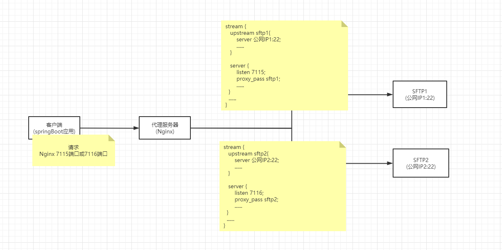

## 架构
  


## Sftp服务器

### 物理机
- 公网IP1:22
- 公网IP2:22


## Nginx服务器

### 物理机
- 内网IP:80 (可访问外网)

### 代理sftp配置
```json
stream {

   upstream sftp1{
       hash $remote_addr consistent;
       server 公网IP1:22;
   }

   server {
       listen 7115;
       proxy_connect_timeout 300s;
       proxy_timeout 300s;
       proxy_pass sftp1;
  }

  upstream sftp2{
      hash $remote_addr consistent;
      server 公网IP2:22;
  }

  server {
      listen 7116;
      proxy_connect_timeout 300s;
      proxy_timeout 300s;
      proxy_pass sftp2;
 }

}
```

### 已安装Nginx情况下添加新的module
```shell script
# 源码目录
cd /usr/local/nginx/nginx-1.14.0
# 编译
./configure --prefix=/usr/local/nginx --with-stream

make

# 停止
/usr/local/nginx/sbin/nginx -s stop
# 备份原有nginx二进制文件
cp /usr/local/nginx/sbin/nginx /usr/local/nginx/sbin/nginx.20210818
# 复制新编译好的nginx二进制文件(此处nginx源码目录为。即为编译命令执行目录)
cp ./objs/nginx /usr/local/nginx/sbin/nginx
# 启动
/usr/local/nginx/sbin/nginx
```
参考：  
[https://blog.csdn.net/zlxtk/article/details/80995955](https://blog.csdn.net/zlxtk/article/details/80995955)  
[https://blog.csdn.net/jijiuqiu6646/article/details/78675891](https://blog.csdn.net/jijiuqiu6646/article/details/78675891)  
[https://www.cnblogs.com/crysmile/p/9565048.html](https://www.cnblogs.com/crysmile/p/9565048.html)  


## Java代码
```java
@Slf4j
@Service
public class ContentMediaSftpService {

  @Value("${sftp.path.mediaPrefix:}")
  private String pathMediaPrefix;

  @Value("${sftp.path.mediaDirectory:media}")
  private String pathMediaDirectory;

  String upload(MultipartFile file, String fileName) {
    boolean result = true;
    SftpUtil sftpUtil1 = getSftp1();
    SftpUtil sftpUtil2 = getSftp2();
    // 生成临时文件
    File tempFile = FileUtil.multipartFile2File(file, "/home/ms/attachment/temp");
    try {
      sftpUtil1.login();
      sftpUtil1.uploadFile(pathMediaPrefix, pathMediaDirectory, fileName, tempFile);
      sftpUtil1.logout();
    } catch (Exception e) {
      result = false;
      log.error("sftp1文件上传失败", e);
    }
    if (!result) {
      tempFile.delete();
      return null;
    }
    try {
      sftpUtil2.login();
      sftpUtil2.uploadFile(pathMediaPrefix, pathMediaDirectory, fileName, tempFile);
      sftpUtil2.logout();
    } catch (Exception e) {
      result = false;
      log.error("sftp2文件上传失败", e);
    }
    tempFile.delete();
    if (!result) {
      return null;
    }
    return pathMediaPrefix + "/" + pathMediaDirectory + "/" + fileName;
  }

  public boolean delete(String directory, String deleteFileName) {
    checkSftpConfig(ContentMediaErrorEnum.FILE_DELETE_ERROR);
    SftpUtil sftpUtil1 = getSftp1();
    SftpUtil sftpUtil2 = getSftp2();
/*    SftpUtil sftpUtil1 = new SftpUtil("portal", "portal.0756", "172.30.21.56", 7115); // 172.30.22.143
    SftpUtil sftpUtil2 = new SftpUtil("portal", "portal.0756", "172.30.21.56", 7116); // 172.30.22.167*/
    boolean result1 = true;
    boolean result2 = true;
    try {
      sftpUtil1.login();
      sftpUtil1.delete(directory, deleteFileName);
      sftpUtil1.logout();
    } catch (Exception e) {
      result1 = false;
      log.error("sftp1文件删除失败", e);
    }
    try {
      sftpUtil2.login();
      sftpUtil2.delete(directory, deleteFileName);
      sftpUtil2.logout();
    } catch (Exception e) {
      result2 = false;
      log.error("sftp2文件删除失败", e);
    }
    ContentMediaErrorEnum.FILE_DELETE_ERROR.isFalse(result1 && result2);
    return result1 && result2;
  }

  private SftpUtil getSftp1() {
    return new SftpUtil("Sftp服务器1用户名", "Sfrp服务器1密码", "Nginx代理服务Ip", 7115);
  }

  private SftpUtil getSftp2() {
    return new SftpUtil("Sftp服务器2用户名", "Sfrp服务器2密码", "Nginx代理服务Ip", 7116);
  }

}
```
```java
public class FileUtil {

  private FileUtil() {
  }

  public static File multipartFile2File(MultipartFile multipartFile, String basePathName) {
    String fileType = getFileType(multipartFile.getOriginalFilename());
    String pathName = generateFileFullName(basePathName, fileType);
    File file = new File(pathName); 
    try {
      FileUtils.copyInputStreamToFile(multipartFile.getInputStream(), file);
    } catch (IOException e) {
      throw new SystemException(e);
    }
    return file;
  }

  public static String getFileType(String fileName) {
    return fileName.substring(fileName.lastIndexOf(".") + 1);
  }

  public static String generateFileFullName(String basePath, String fileType) {
    String filePath = basePath + "/";
    File file = new File(filePath);
    if (!file.exists()) {
      file.mkdirs();
    }
    String fileName = generateFileName(fileType);
    return filePath + fileName;
  }

  public static String generateFileName(String fileType) {
    StringBuilder fileNameBuilder = new StringBuilder();
    if(!fileType.startsWith(".")) {
      fileNameBuilder.append(UUID.randomUUID()).append(".").append(fileType);
    }else {
      fileNameBuilder.append(UUID.randomUUID()).append(fileType);
    }
    return fileNameBuilder.toString();
  }

}
```
```java
@Slf4j
public class SftpUtil {

	private ChannelSftp sftp;
	private Session session;
	/** SFTP 登录用户名 */
	private String username;
	/** SFTP 登录密码 */
	private String password;
	/** 私钥 */
	private String privateKey;
	/** SFTP 服务器地址IP地址 */
	private String host;
	/** SFTP 端口 */
	private int port;

	/**
	 * 构造基于密码认证的sftp对象
	 */
	public SftpUtil(String username, String password, String host, int port) {
		this.username = username;
		this.password = password;
		this.host = host;
		this.port = port;
	}

	/**
	 * 构造基于秘钥认证的sftp对象
	 */
	public SftpUtil(String username, String host, int port, String privateKey) {
		this.username = username;
		this.host = host;
		this.port = port;
		this.privateKey = privateKey;
	}

	public SftpUtil() {
	}

	/**
	 * 连接sftp服务器
	 */
	public void login() {
		try {
			JSch jsch = new JSch();
			if (privateKey != null) {
				// 设置私钥
				jsch.addIdentity(privateKey);
			}
			session = jsch.getSession(username, host, port);
			if (password != null) {
				session.setPassword(password);
			}
			Properties config = new Properties();
			config.put("StrictHostKeyChecking", "no");

			session.setConfig(config);
			session.connect();

			Channel channel = session.openChannel("sftp");
			channel.connect();

			sftp = (ChannelSftp) channel;
		} catch (JSchException e) {
			log.error("=====sftp login error =====", e);
		}
	}

	/**
	 * 关闭连接 server
	 */
	public void logout() {
		if (sftp != null && sftp.isConnected()) {
			sftp.disconnect();
		}
		if (session != null && session.isConnected()) {
			session.disconnect();
		}
	}

	/**
	 * 将输入流的数据上传到sftp作为文件。文件完整路径=basePath+directory
	 * 
	 * @param basePath
	 *          服务器的基础路径
	 * @param directory
	 *          上传到该目录
	 * @param sftpFileName
	 *          sftp端文件名
	 * @param input
	 *          输入流
	 */
	private void upload(String basePath, String directory, String sftpFileName, InputStream input) throws SftpException {
		try {
			sftp.cd(basePath);
			sftp.cd(directory);
		} catch (SftpException e) {
			// 目录不存在，则创建文件夹
			String[] dirs = directory.split("/");
			StringBuilder tempPath = new StringBuilder();
			tempPath.append(basePath);
			for (String dir : dirs) {
				if (null == dir || "".equals(dir)) {
					continue;
				}
				tempPath.append("/").append(dir);
				try {
					sftp.cd(tempPath.toString());
				} catch (SftpException ex) {
					sftp.mkdir(tempPath.toString());
					sftp.cd(tempPath.toString());
				}
			}
		}
		// 上传文件
		sftp.put(input, sftpFileName);
	}
	
	/**
	 * 将件数据上传到sftp 文件完整路径=basePath+directory
	 *
	 * @param basePath
	 *          服务器的基础路径
	 * @param directory
	 *          上传到该目录
	 * @param sftpFileName
	 *          sftp端文件名
	 * @param file
	 *          文件
	 */
	public void uploadFile(String basePath, String directory, String sftpFileName, File file) throws IOException,SftpException{
		try(FileInputStream fileInputStream = new FileInputStream(file)){
			upload(basePath, directory, sftpFileName, fileInputStream);
		}
	}

	/**
	 * 删除文件
	 * 
	 * @param directory
	 *          要删除文件所在目录
	 * @param deleteFile
	 *          要删除的文件
	 */
	public void delete(String directory, String deleteFile) throws SftpException {
		sftp.cd(directory);
		sftp.rm(deleteFile);
	}

}
```

参考：
[https://blog.csdn.net/wagnteng/article/details/78481836](https://blog.csdn.net/wagnteng/article/details/78481836)  
